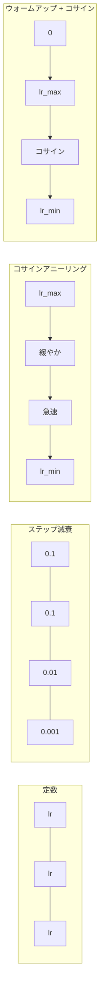
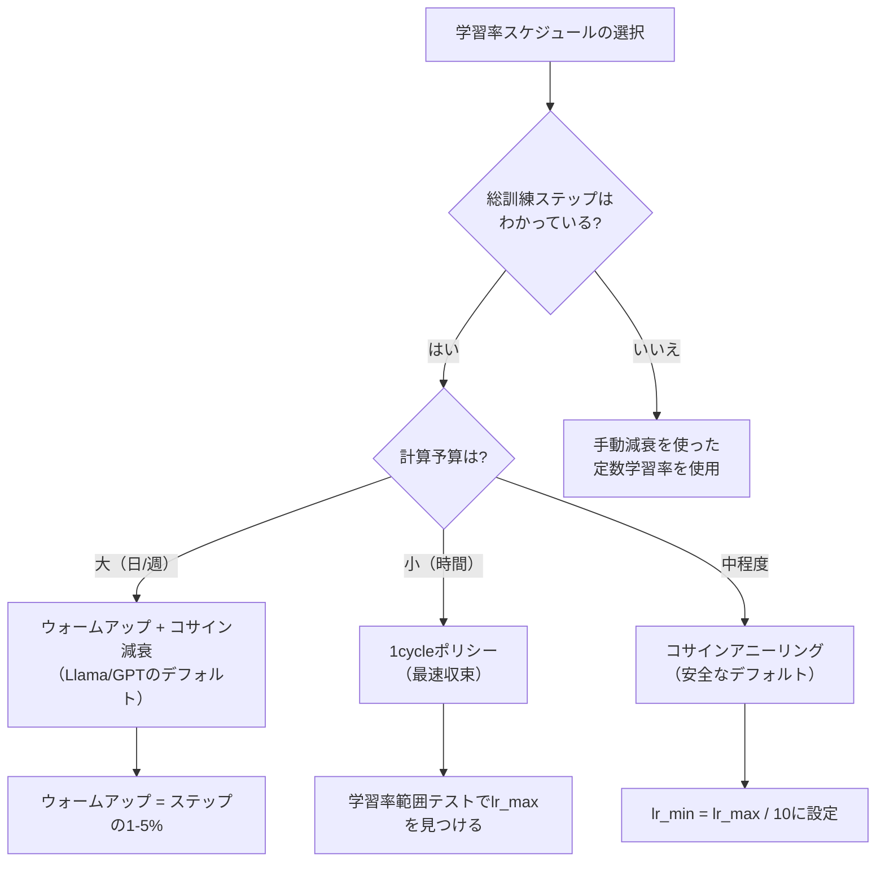
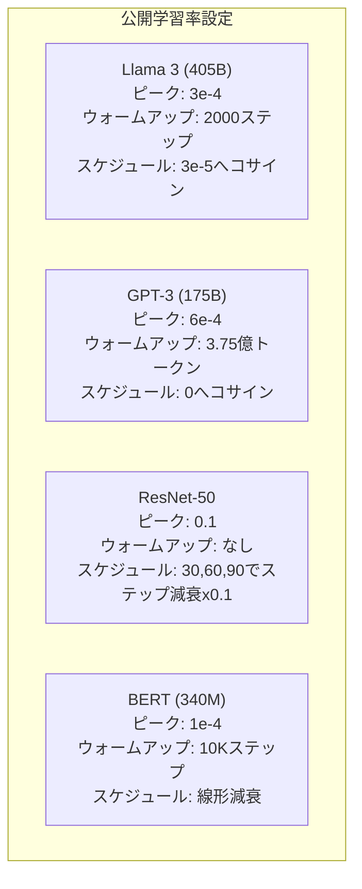

# 学習率スケジュールとウォームアップ

> 学習率は最も重要なハイパーパラメータだ。アーキテクチャでも、データセットのサイズでも、活性化関数でもない。学習率だ。他に何もチューニングしないとしても、これだけはチューニングせよ。

**タイプ:** 構築
**言語:** Python
**前提条件:** レッスン 03.06（オプティマイザ）、レッスン 03.08（重み初期化）
**所要時間:** 約90分

## 学習目標

- 定数、ステップ減衰、コサインアニーリング、ウォームアップ+コサイン、1cycleの学習率スケジュールをゼロから実装する
- 学習率選択の3つの失敗モード（高すぎる場合の発散、低すぎる場合の停滞、減衰なしによる振動）を示す
- Adamベースのオプティマイザにウォームアップが必要な理由と、初期訓練を安定させる方法を説明する
- 同じタスクで5つのスケジュール全体の収束速度を比較し、与えられた訓練予算に対して適切なものを選択する

## 問題

学習率を0.1に設定する。訓練が発散する—損失が3ステップで無限大に跳ね上がる。0.0001に設定する。訓練が這うように進む—100エポック後、モデルはランダムからほとんど動いていない。0.01に設定する。50エポックは機能するが、ステップが大きすぎて到達できない最小値の周りで損失が振動する。

最適な学習率は定数ではない。訓練中に変化する。初期には広い領域をカバーするために大きなステップが必要だ。訓練後半には、シャープな最小値に落ち着くために小さなステップが必要だ。90%精度のモデルと95%精度のモデルの違いは、しばしばスケジュールだけだ。

過去3年間に発表されたすべての主要モデルが学習率スケジュールを使用している。Llama 3はピーク学習率3e-4、2000ウォームアップステップ、3e-5へのコサイン減衰を使用した。GPT-3は3億7500万トークンかけてウォームアップを行い、学習率6e-4を使用した。これらは任意の選択ではない。数百万ドルのコストをかけた広範なハイパーパラメータスイープの結果だ。

スケジュールを理解する必要がある。デフォルトはあなたの問題に対して機能しない。事前訓練済みモデルをファインチューニングする場合、正しいスケジュールはゼロから訓練する場合とは異なる。バッチサイズを増やす場合、ウォームアップ期間を変更する必要がある。ステップ10,000で訓練が壊れた場合、それがスケジュールの問題か他の何かかを知る必要がある。

## コンセプト

### 定数学習率

最もシンプルなアプローチ。数値を選んで、すべてのステップに使用する。

```
lr(t) = lr_0
```

ほとんど最適ではない。訓練の終わりには高すぎる（最小値周りの振動）か、始まりには低すぎる（小さなステップでの無駄な計算）かのどちらかだ。小さなモデルやデバッグには問題ない。1時間以上訓練するものには最悪の選択だ。

### ステップ減衰

ResNet時代のオールドスクール的アプローチ。固定エポックで学習率を係数（通常10倍）で削減する。

```
lr(t) = lr_0 * gamma^(floor(epoch / step_size))
```

gamma = 0.1でstep_size = 30は：30エポックごとに学習率が10倍下がることを意味する。ResNet-50はこれを使用した—学習率=0.1、30、60、90エポックで10倍減少。

問題：最適な減衰ポイントはデータセットとアーキテクチャに依存する。別の問題に移行すると、いつ下げるかを再チューニングする必要がある。遷移は急激だ—レートが突然変わると損失がスパイクする可能性がある。

### コサインアニーリング

コサイン曲線に従って最大学習率から最小学習率へスムーズに減衰する：

```
lr(t) = lr_min + 0.5 * (lr_max - lr_min) * (1 + cos(pi * t / T))
```

tは現在のステップ、Tは総ステップ数だ。

t=0では、コサイン項は1なのでlr = lr_maxだ。t=Tでは、コサイン項は-1なのでlr = lr_minだ。減衰は最初は緩やか、中間で加速し、終わりに向かって再び緩やかになる。

これは現代のほとんどの訓練実行のデフォルトだ。lr_maxとlr_min以外にチューニングするハイパーパラメータがない。コサインの形状は、ほとんどの学習が訓練の中間で行われるという経験的観察と一致している—その重要な期間に合理的なステップサイズが必要だ。

### ウォームアップ：小さく始める理由

Adamや他の適応型オプティマイザは、勾配の平均と分散の移動推定値を維持する。ステップ0では、これらの推定値はゼロに初期化される。最初の数回の勾配更新は、でたらめな統計に基づいている。この期間中に学習率が大きければ、モデルは大きく、方向の定まらないステップを踏む。

ウォームアップはこれを修正する。非常に小さな学習率（しばしばlr_max / warmup_stepsまたはゼロ）から始まり、最初のNステップにわたって線形にlr_maxまでランプアップする。フル学習率に達するまでに、Adamの統計は安定している。

```
lr(t) = lr_max * (t / warmup_steps)     t < warmup_stepsの場合
```

典型的なウォームアップ：総訓練ステップの1〜5%。Llama 3は約1.8兆トークン訓練し、2000ステップでウォームアップした。GPT-3は3億7500万トークンかけてウォームアップした。

### 線形ウォームアップ + コサイン減衰

現代のデフォルト。線形にランプアップし、コサインで減衰する：

```
t < warmup_stepsの場合:
    lr(t) = lr_max * (t / warmup_steps)
それ以外:
    progress = (t - warmup_steps) / (total_steps - warmup_steps)
    lr(t) = lr_min + 0.5 * (lr_max - lr_min) * (1 + cos(pi * progress))
```

これはLlama、GPT、PaLM、そして現代のほとんどのトランスフォーマーが使用しているものだ。ウォームアップは初期の不安定性を防ぐ。コサイン減衰はモデルを良い最小値に落ち着かせる。

### 1cycleポリシー

Leslie Smithの発見（2018年）：訓練の前半で低い値から高い値へ学習率をランプアップし、後半でランプダウンする。直感に反する—訓練の途中でなぜ学習率を*増やす*のか？

理論：高い学習率は最適化軌跡にノイズを加えることで正則化として機能する。ランプアップフェーズ中にモデルは損失の地形をより多く探索し、より良いベースンを見つける。ランプダウンフェーズでは、見つかった最良のベースン内で精緻化する。

```
フェーズ1 (0からT/2):    学習率がlr_max/25からlr_maxにランプアップ
フェーズ2 (T/2からT):    学習率がlr_maxからlr_max/10000にランプダウン
```

1cycleは固定の計算予算でコサインアニーリングより速く訓練することが多い。トレードオフ：総ステップ数を事前に知る必要がある。

### スケジュールの形状



### 意思決定フローチャート



### 公開モデルの実際の数値



## 構築する

### ステップ1：スケジュール関数

各関数は現在のステップを受け取り、そのステップでの学習率を返す。

```python
import math


def constant_schedule(step, lr=0.01, **kwargs):
    return lr


def step_decay_schedule(step, lr=0.1, step_size=100, gamma=0.1, **kwargs):
    return lr * (gamma ** (step // step_size))


def cosine_schedule(step, lr=0.01, total_steps=1000, lr_min=1e-5, **kwargs):
    if step >= total_steps:
        return lr_min
    return lr_min + 0.5 * (lr - lr_min) * (1 + math.cos(math.pi * step / total_steps))


def warmup_cosine_schedule(step, lr=0.01, total_steps=1000, warmup_steps=100, lr_min=1e-5, **kwargs):
    if total_steps <= warmup_steps:
        return lr * (step / max(warmup_steps, 1))
    if step < warmup_steps:
        return lr * step / warmup_steps
    progress = (step - warmup_steps) / (total_steps - warmup_steps)
    return lr_min + 0.5 * (lr - lr_min) * (1 + math.cos(math.pi * progress))


def one_cycle_schedule(step, lr=0.01, total_steps=1000, **kwargs):
    mid = max(total_steps // 2, 1)
    if step < mid:
        return (lr / 25) + (lr - lr / 25) * step / mid
    else:
        progress = (step - mid) / max(total_steps - mid, 1)
        return lr * (1 - progress) + (lr / 10000) * progress
```

### ステップ2：全スケジュールを可視化する

訓練を通じて各スケジュールがどのように進化するかを示すテキストベースのプロットを出力する。

```python
def visualize_schedule(name, schedule_fn, total_steps=500, **kwargs):
    steps = list(range(0, total_steps, total_steps // 20))
    if total_steps - 1 not in steps:
        steps.append(total_steps - 1)

    lrs = [schedule_fn(s, total_steps=total_steps, **kwargs) for s in steps]
    max_lr = max(lrs) if max(lrs) > 0 else 1.0

    print(f"\n{name}:")
    for s, lr_val in zip(steps, lrs):
        bar_len = int(lr_val / max_lr * 40)
        bar = "#" * bar_len
        print(f"  Step {s:4d}: lr={lr_val:.6f} {bar}")
```

### ステップ3：訓練ネットワーク

円データセットでの単純な2層ネットワーク。前のレッスンと同じだが、今回はスケジュールを変える。

```python
import random


def sigmoid(x):
    x = max(-500, min(500, x))
    return 1.0 / (1.0 + math.exp(-x))


def relu(x):
    return max(0.0, x)


def relu_deriv(x):
    return 1.0 if x > 0 else 0.0


def make_circle_data(n=200, seed=42):
    random.seed(seed)
    data = []
    for _ in range(n):
        x = random.uniform(-2, 2)
        y = random.uniform(-2, 2)
        label = 1.0 if x * x + y * y < 1.5 else 0.0
        data.append(([x, y], label))
    return data


def train_with_schedule(schedule_fn, schedule_name, data, epochs=300, base_lr=0.05, **kwargs):
    random.seed(0)
    hidden_size = 8
    total_steps = epochs * len(data)

    std = math.sqrt(2.0 / 2)
    w1 = [[random.gauss(0, std) for _ in range(2)] for _ in range(hidden_size)]
    b1 = [0.0] * hidden_size
    w2 = [random.gauss(0, std) for _ in range(hidden_size)]
    b2 = 0.0

    step = 0
    epoch_losses = []

    for epoch in range(epochs):
        total_loss = 0
        correct = 0

        for x, target in data:
            lr = schedule_fn(step, lr=base_lr, total_steps=total_steps, **kwargs)

            z1 = []
            h = []
            for i in range(hidden_size):
                z = w1[i][0] * x[0] + w1[i][1] * x[1] + b1[i]
                z1.append(z)
                h.append(relu(z))

            z2 = sum(w2[i] * h[i] for i in range(hidden_size)) + b2
            out = sigmoid(z2)

            error = out - target
            d_out = error * out * (1 - out)

            for i in range(hidden_size):
                d_h = d_out * w2[i] * relu_deriv(z1[i])
                w2[i] -= lr * d_out * h[i]
                for j in range(2):
                    w1[i][j] -= lr * d_h * x[j]
                b1[i] -= lr * d_h
            b2 -= lr * d_out

            total_loss += (out - target) ** 2
            if (out >= 0.5) == (target >= 0.5):
                correct += 1
            step += 1

        avg_loss = total_loss / len(data)
        accuracy = correct / len(data) * 100
        epoch_losses.append(avg_loss)

    return epoch_losses
```

### ステップ4：全スケジュールを比較する

同じネットワークを各スケジュールで訓練し、最終損失と収束動作を比較する。

```python
def compare_schedules(data):
    configs = [
        ("Constant", constant_schedule, {}),
        ("Step Decay", step_decay_schedule, {"step_size": 15000, "gamma": 0.1}),
        ("Cosine", cosine_schedule, {"lr_min": 1e-5}),
        ("Warmup+Cosine", warmup_cosine_schedule, {"warmup_steps": 3000, "lr_min": 1e-5}),
        ("1cycle", one_cycle_schedule, {}),
    ]

    print(f"\n{'Schedule':<20} {'Start Loss':>12} {'Mid Loss':>12} {'End Loss':>12} {'Best Loss':>12}")
    print("-" * 70)

    for name, schedule_fn, extra_kwargs in configs:
        losses = train_with_schedule(schedule_fn, name, data, epochs=300, base_lr=0.05, **extra_kwargs)
        mid_idx = len(losses) // 2
        best = min(losses)
        print(f"{name:<20} {losses[0]:>12.6f} {losses[mid_idx]:>12.6f} {losses[-1]:>12.6f} {best:>12.6f}")
```

### ステップ5：学習率が高すぎる場合と低すぎる場合

3つの失敗モードを示す：高すぎる（発散）、低すぎる（這い進む）、ちょうど良い。

```python
def lr_sensitivity(data):
    learning_rates = [1.0, 0.1, 0.01, 0.001, 0.0001]

    print("\n学習率感度（定数スケジュール、100エポック）:")
    print(f"  {'LR':>10} {'Start Loss':>12} {'End Loss':>12} {'Status':>15}")
    print("  " + "-" * 52)

    for lr in learning_rates:
        losses = train_with_schedule(constant_schedule, f"lr={lr}", data, epochs=100, base_lr=lr)
        start = losses[0]
        end = losses[-1]

        if end > start or math.isnan(end) or end > 1.0:
            status = "DIVERGED"
        elif end > start * 0.9:
            status = "BARELY MOVED"
        elif end < 0.15:
            status = "CONVERGED"
        else:
            status = "LEARNING"

        end_str = f"{end:.6f}" if not math.isnan(end) else "NaN"
        print(f"  {lr:>10.4f} {start:>12.6f} {end_str:>12} {status:>15}")
```

## 活用する

PyTorchは `torch.optim.lr_scheduler` でスケジューラを提供している：

```python
import torch
import torch.optim as optim
from torch.optim.lr_scheduler import CosineAnnealingLR, OneCycleLR, StepLR

model = nn.Sequential(nn.Linear(10, 64), nn.ReLU(), nn.Linear(64, 1))
optimizer = optim.Adam(model.parameters(), lr=3e-4)

scheduler = CosineAnnealingLR(optimizer, T_max=1000, eta_min=1e-5)

for step in range(1000):
    loss = train_step(model, optimizer)
    scheduler.step()
```

ウォームアップ + コサインにはラムダスケジューラまたはHuggingFaceの `get_cosine_schedule_with_warmup` を使用する：

```python
from transformers import get_cosine_schedule_with_warmup

scheduler = get_cosine_schedule_with_warmup(
    optimizer,
    num_warmup_steps=2000,
    num_training_steps=100000,
)
```

HuggingFaceの関数は、ほとんどのLlamaとGPTのファインチューニングスクリプトが使用しているものだ。迷ったら、ウォームアップ = 総ステップの3〜5%のウォームアップ + コサインを使用する。ほぼすべてに機能する。

## Ship It

このレッスンが生成するもの：
- `outputs/prompt-lr-schedule-advisor.md` — あなたの訓練設定に適切な学習率スケジュールとハイパーパラメータを推奨するプロンプト

## 演習

1. 指数減衰を実装する：lr(t) = lr_0 * gamma^t（gamma = 0.999）。円データセットでコサインアニーリングと比較する。

2. 学習率範囲テスト（Leslie Smith）を実装する：学習率を1e-7から1まで指数的に増加させながら数百ステップ訓練する。損失対学習率をプロットする。最適な最大学習率は損失が増加し始める直前だ。

3. ウォームアップ + コサインで訓練するが、ウォームアップ長を変える：総ステップの0%、1%、5%、10%、20%。訓練が最も安定するスイートスポットを見つける。

4. ウォームアップ付きコサインアニーリング（SGDR）を実装する：Tステップごとに学習率をlr_maxにリセットして再度減衰する。より長い訓練実行での標準コサインと比較する。

5. 訓練損失を監視し、損失が安定したら自動的にウォームアップからコサインに切り替え、損失が長時間プラトーした場合に学習率を下げる「スケジュールサージョン」を構築する。

## 用語集

| 用語 | よく言われること | 実際の意味 |
|------|----------------|----------------------|
| 学習率 | 「モデルが学習する速さ」 | パラメータ更新サイズを決定するために勾配に掛けるスカラー |
| スケジュール | 「学習率を時間とともに変化させる」 | 訓練ステップを学習率にマッピングする関数。収束を最適化するよう設計される |
| ウォームアップ | 「小さな学習率から始める」 | オプティマイザ統計を安定させるために最初のNステップでほぼゼロからターゲット値まで学習率を線形にランプアップすること |
| コサインアニーリング | 「スムーズな学習率減衰」 | 訓練を通じてlr_maxからlr_minまでコサイン曲線に従って学習率を下げること |
| ステップ減衰 | 「マイルストーンで学習率を下げる」 | 固定エポック間隔で学習率を係数（通常0.1）で掛けること |
| 1cycleポリシー | 「上げてから下げる」 | Leslie Smithの方法で、より速い収束のために1サイクルで学習率を上下させる |
| 学習率範囲テスト | 「最良の学習率を見つける」 | 損失が発散し始める値を見つけるために学習率を増加させながら短時間訓練すること |
| ウォームリスタート付きコサイン | 「リセットして繰り返す」 | 定期的に学習率をlr_maxにリセットして再度減衰させること（SGDR） |
| Eta min | 「学習率のフロア」 | スケジュールが減衰する最小学習率 |
| ピーク学習率 | 「最大学習率」 | 訓練中に達する最高の学習率。通常ウォームアップ後 |

## 参考文献

- Loshchilov & Hutter、「SGDR: Stochastic Gradient Descent with Warm Restarts」（2017年）—コサインアニーリングとウォームリスタートを導入
- Smith、「Super-Convergence: Very Fast Training of Neural Networks Using Large Learning Rates」（2018年）—1cycleポリシー論文
- Touvronら、「Llama 2: Open Foundation and Fine-Tuned Chat Models」（2023年）—スケールでのウォームアップ + コサインスケジュールを記録
- Goyalら、「Accurate, Large Minibatch SGD: Training ImageNet in 1 Hour」（2017年）—大バッチ訓練のための線形スケーリングルールとウォームアップ
