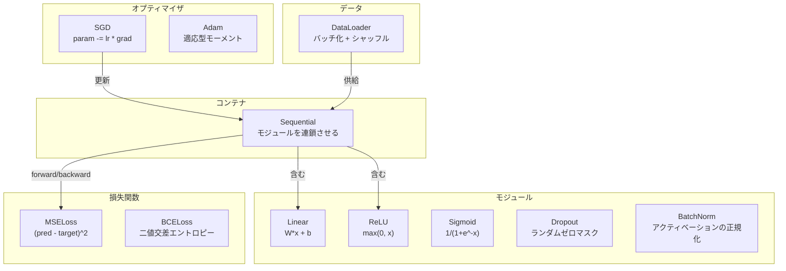
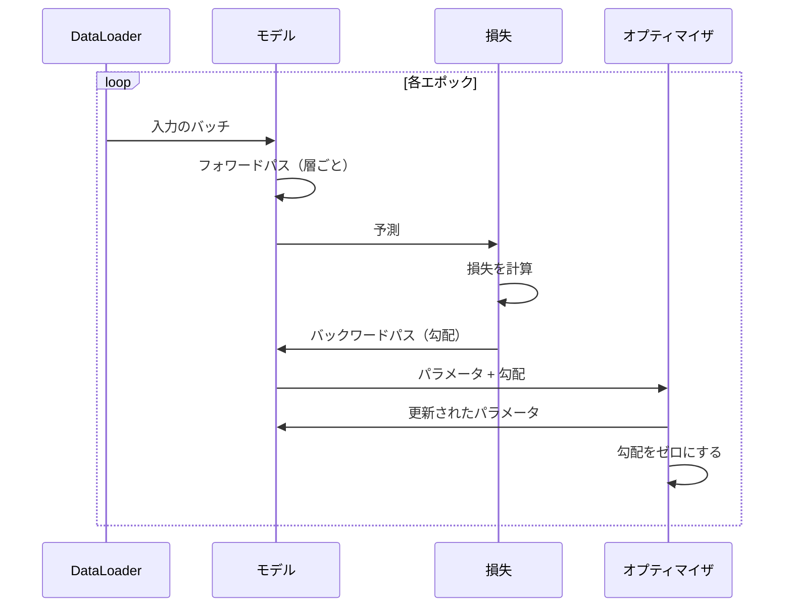
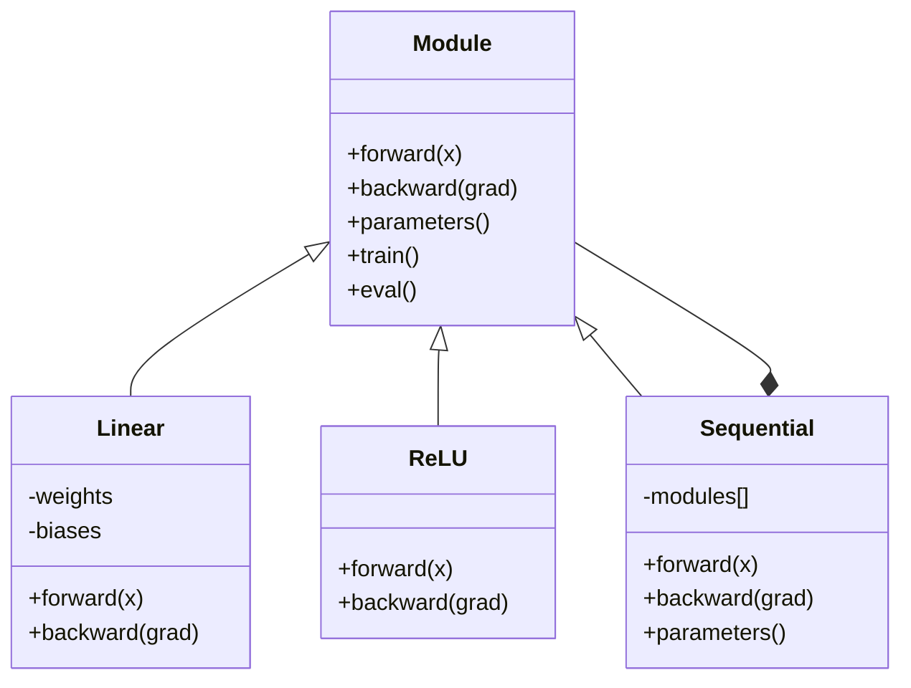

# 独自のミニフレームワークを構築する

> ニューロン、層、ネットワーク、バックプロパゲーション、活性化関数、損失関数、オプティマイザ、正則化、初期化、学習率スケジュールを構築してきた。すべてが独立したピースとして。今度はそれらをフレームワークに組み合わせる。PyTorchでも、TensorFlowでもない。自分のものを。

**タイプ:** 構築
**言語:** Python
**前提条件:** フェーズ03の全て（レッスン01-09）
**所要時間:** 約120分

## 学習目標

- Module、Linear、ReLU、Sigmoid、Dropout、BatchNorm、Sequential、損失関数、オプティマイザ、DataLoaderを含む完全なディープラーニングフレームワーク（約500行）を構築する
- Moduleの抽象化（forward、backward、parameters）と訓練/評価モードの切り替えが必要な理由を説明する
- すべてのコンポーネントを、円分類の4層ネットワークを訓練する動作する訓練ループに繋ぎ合わせる
- フレームワークの各コンポーネントをPyTorchの対応物にマッピングする（nn.Module、nn.Sequential、optim.Adam、DataLoader）

## 問題

レッスンの積み木が10個、別々のファイルに散らばっている。ここに`Value`クラス、あそこに訓練ループ、別のファイルに重み初期化、さらに別のファイルに学習率スケジュール。ネットワークを訓練するには、5つの異なるレッスンからコピー&ペーストして手動で繋ぎ合わせる必要がある。

これがフレームワークが解決することだ。PyTorchは `nn.Module`、`nn.Sequential`、`optim.Adam`、`DataLoader`、そしてそれらを結びつける訓練ループパターンを提供する。TensorFlowは `keras.Layer`、`keras.Sequential`、`keras.optimizers.Adam` を提供する。これらは魔法ではない。毎回配管を再発明することなくネットワークを定義、訓練、評価できる組織パターンだ。

Pythonで約500行で同じものを構築する。NumPyなし、外部依存なし。任意のフィードフォワードネットワークを定義し、SGDまたはAdamで訓練し、データをバッチ化し、ドロップアウトとバッチ正規化を適用し、任意の活性化を使用し、学習率をスケジュールできるフレームワーク。

完成したら、PyTorchで `model = nn.Sequential(...)` と書いたときに何が起きているかを正確に理解できる。`model.train()` と `model.eval()` が存在する理由を理解できる。`optimizer.zero_grad()` が別の呼び出しである理由を理解できる。すべてを構築したから、すべてを理解できる。

## コンセプト

### Moduleの抽象化

PyTorchのすべての層は `nn.Module` を継承する。Moduleは3つの責任を持つ：

1. **forward()** — 入力が与えられたとき出力を計算する
2. **parameters()** — すべての訓練可能な重みを返す
3. **backward()** — 勾配を計算する（PyTorchではautogradが処理するが、我々のでは明示的）

Linear層はModuleだ。ReLU活性化はModuleだ。ドロップアウト層はModuleだ。バッチ正規化層はModuleだ。すべてが同じインターフェースを持つ。

### Sequentialコンテナ

`nn.Sequential` はModuleを連鎖させる。フォワードパス：モジュール1、次にモジュール2、次にモジュール3にデータを通す。バックワードパス：連鎖を逆にたどる。コンテナ自体がModuleだ—forward()、parameters()、backward()を持つ。これはコンポジットパターン：モジュールのシーケンス自体がModuleだ。

### 訓練対評価モード

ドロップアウトは訓練中にランダムにニューロンをゼロにするが、評価中はすべてを通過させる。バッチ正規化は訓練中はバッチ統計を使用するが、評価中は移動平均を使用する。`train()` と `eval()` メソッドはこの動作を切り替える。すべてのModuleに `training` フラグがある。

### オプティマイザ

オプティマイザは勾配を使ってパラメータを更新する。SGD：`param -= lr * grad`。Adam：モーメンタムと分散の推定値を維持し、更新する。オプティマイザはネットワークのアーキテクチャについて知らない—パラメータとその勾配のフラットなリストしか見ない。

### DataLoader

バッチ化は2つの理由で重要だ。第一に、大きな問題ではデータセット全体をメモリに収めることができない。第二に、ミニバッチ勾配降下法は局所的最小値から抜け出すのに役立つノイズを提供する。DataLoaderはデータをバッチに分割し、オプションでエポック間でシャッフルする。

### フレームワークのアーキテクチャ



### 訓練ループ



### モジュール階層



## 構築する

### ステップ1：Moduleの基底クラス

すべての層が実装する抽象インターフェース。

```python
class Module:
    def __init__(self):
        self.training = True

    def forward(self, x):
        raise NotImplementedError

    def backward(self, grad):
        raise NotImplementedError

    def parameters(self):
        return []

    def train(self):
        self.training = True

    def eval(self):
        self.training = False
```

### ステップ2：Linear層

基本的な構成要素。重みとバイアスを格納し、フォワードでWx + bを計算し、バックワードで重み/入力の勾配を計算する。

```python
import math
import random


class Linear(Module):
    def __init__(self, fan_in, fan_out):
        super().__init__()
        std = math.sqrt(2.0 / fan_in)
        self.weights = [[random.gauss(0, std) for _ in range(fan_in)] for _ in range(fan_out)]
        self.biases = [0.0] * fan_out
        self.weight_grads = [[0.0] * fan_in for _ in range(fan_out)]
        self.bias_grads = [0.0] * fan_out
        self.fan_in = fan_in
        self.fan_out = fan_out
        self.input = None

    def forward(self, x):
        self.input = x
        output = []
        for i in range(self.fan_out):
            val = self.biases[i]
            for j in range(self.fan_in):
                val += self.weights[i][j] * x[j]
            output.append(val)
        return output

    def backward(self, grad):
        input_grad = [0.0] * self.fan_in
        for i in range(self.fan_out):
            self.bias_grads[i] += grad[i]
            for j in range(self.fan_in):
                self.weight_grads[i][j] += grad[i] * self.input[j]
                input_grad[j] += grad[i] * self.weights[i][j]
        return input_grad

    def parameters(self):
        params = []
        for i in range(self.fan_out):
            for j in range(self.fan_in):
                params.append((self.weights, i, j, self.weight_grads))
            params.append((self.biases, i, None, self.bias_grads))
        return params
```

### ステップ3：アクティベーションモジュール

ModuleとしてのReLU、Sigmoid、Tanh。それぞれがバックワードパスに必要なものをキャッシュする。

```python
class ReLU(Module):
    def __init__(self):
        super().__init__()
        self.mask = None

    def forward(self, x):
        self.mask = [1.0 if v > 0 else 0.0 for v in x]
        return [max(0.0, v) for v in x]

    def backward(self, grad):
        return [g * m for g, m in zip(grad, self.mask)]


class Sigmoid(Module):
    def __init__(self):
        super().__init__()
        self.output = None

    def forward(self, x):
        self.output = []
        for v in x:
            v = max(-500, min(500, v))
            self.output.append(1.0 / (1.0 + math.exp(-v)))
        return self.output

    def backward(self, grad):
        return [g * o * (1 - o) for g, o in zip(grad, self.output)]


class Tanh(Module):
    def __init__(self):
        super().__init__()
        self.output = None

    def forward(self, x):
        self.output = [math.tanh(v) for v in x]
        return self.output

    def backward(self, grad):
        return [g * (1 - o * o) for g, o in zip(grad, self.output)]
```

### ステップ4：Dropoutモジュール

訓練中に要素をランダムにゼロにする。期待値が同じになるように残りの要素を1/(1-p)でスケーリングする。評価中は何もしない。

```python
class Dropout(Module):
    def __init__(self, p=0.5):
        super().__init__()
        self.p = p
        self.mask = None

    def forward(self, x):
        if not self.training:
            return x
        self.mask = [0.0 if random.random() < self.p else 1.0 / (1 - self.p) for _ in x]
        return [v * m for v, m in zip(x, self.mask)]

    def backward(self, grad):
        if self.mask is None:
            return grad
        return [g * m for g, m in zip(grad, self.mask)]
```

### ステップ5：BatchNormモジュール

バッチ全体で特徴量ごとにアクティベーションを平均ゼロ・単位分散に正規化する。評価モード用の移動統計を維持する。

```python
class BatchNorm(Module):
    def __init__(self, size, momentum=0.1, eps=1e-5):
        super().__init__()
        self.size = size
        self.gamma = [1.0] * size
        self.beta = [0.0] * size
        self.gamma_grads = [0.0] * size
        self.beta_grads = [0.0] * size
        self.running_mean = [0.0] * size
        self.running_var = [1.0] * size
        self.momentum = momentum
        self.eps = eps
        self.x_norm = None
        self.std_inv = None
        self.batch_input = None

    def forward_batch(self, batch):
        batch_size = len(batch)
        output_batch = []

        if self.training:
            mean = [0.0] * self.size
            for sample in batch:
                for j in range(self.size):
                    mean[j] += sample[j]
            mean = [m / batch_size for m in mean]

            var = [0.0] * self.size
            for sample in batch:
                for j in range(self.size):
                    var[j] += (sample[j] - mean[j]) ** 2
            var = [v / batch_size for v in var]

            self.std_inv = [1.0 / math.sqrt(v + self.eps) for v in var]

            self.x_norm = []
            self.batch_input = batch
            for sample in batch:
                normed = [(sample[j] - mean[j]) * self.std_inv[j] for j in range(self.size)]
                self.x_norm.append(normed)
                output = [self.gamma[j] * normed[j] + self.beta[j] for j in range(self.size)]
                output_batch.append(output)

            for j in range(self.size):
                self.running_mean[j] = (1 - self.momentum) * self.running_mean[j] + self.momentum * mean[j]
                self.running_var[j] = (1 - self.momentum) * self.running_var[j] + self.momentum * var[j]
        else:
            std_inv = [1.0 / math.sqrt(v + self.eps) for v in self.running_var]
            for sample in batch:
                normed = [(sample[j] - self.running_mean[j]) * std_inv[j] for j in range(self.size)]
                output = [self.gamma[j] * normed[j] + self.beta[j] for j in range(self.size)]
                output_batch.append(output)

        return output_batch

    def forward(self, x):
        result = self.forward_batch([x])
        return result[0]

    def backward(self, grad):
        if self.x_norm is None:
            return grad
        for j in range(self.size):
            self.gamma_grads[j] += self.x_norm[0][j] * grad[j]
            self.beta_grads[j] += grad[j]
        return [grad[j] * self.gamma[j] * self.std_inv[j] for j in range(self.size)]

    def parameters(self):
        params = []
        for j in range(self.size):
            params.append((self.gamma, j, None, self.gamma_grads))
            params.append((self.beta, j, None, self.beta_grads))
        return params
```

### ステップ6：Sequentialコンテナ

モジュールを連鎖させる。フォワードは左から右へ、バックワードは右から左へ。

```python
class Sequential(Module):
    def __init__(self, *modules):
        super().__init__()
        self.modules = list(modules)

    def forward(self, x):
        for module in self.modules:
            x = module.forward(x)
        return x

    def backward(self, grad):
        for module in reversed(self.modules):
            grad = module.backward(grad)
        return grad

    def parameters(self):
        params = []
        for module in self.modules:
            params.extend(module.parameters())
        return params

    def train(self):
        self.training = True
        for module in self.modules:
            module.train()

    def eval(self):
        self.training = False
        for module in self.modules:
            module.eval()
```

### ステップ7：損失関数

MSEと二値交差エントロピー。それぞれが損失値を返し、勾配を返すbackward()を提供する。

```python
class MSELoss:
    def __call__(self, predicted, target):
        self.predicted = predicted
        self.target = target
        n = len(predicted)
        self.loss = sum((p - t) ** 2 for p, t in zip(predicted, target)) / n
        return self.loss

    def backward(self):
        n = len(self.predicted)
        return [2 * (p - t) / n for p, t in zip(self.predicted, self.target)]


class BCELoss:
    def __call__(self, predicted, target):
        self.predicted = predicted
        self.target = target
        eps = 1e-7
        n = len(predicted)
        self.loss = 0
        for p, t in zip(predicted, target):
            p = max(eps, min(1 - eps, p))
            self.loss += -(t * math.log(p) + (1 - t) * math.log(1 - p))
        self.loss /= n
        return self.loss

    def backward(self):
        eps = 1e-7
        n = len(self.predicted)
        grads = []
        for p, t in zip(self.predicted, self.target):
            p = max(eps, min(1 - eps, p))
            grads.append((-t / p + (1 - t) / (1 - p)) / n)
        return grads
```

### ステップ8：SGDとAdamオプティマイザ

どちらもパラメータリストを受け取り、勾配を使って重みを更新する。

```python
class SGD:
    def __init__(self, parameters, lr=0.01):
        self.params = parameters
        self.lr = lr

    def step(self):
        for container, i, j, grad_container in self.params:
            if j is not None:
                container[i][j] -= self.lr * grad_container[i][j]
            else:
                container[i] -= self.lr * grad_container[i]

    def zero_grad(self):
        for container, i, j, grad_container in self.params:
            if j is not None:
                grad_container[i][j] = 0.0
            else:
                grad_container[i] = 0.0


class Adam:
    def __init__(self, parameters, lr=0.001, beta1=0.9, beta2=0.999, eps=1e-8):
        self.params = parameters
        self.lr = lr
        self.beta1 = beta1
        self.beta2 = beta2
        self.eps = eps
        self.t = 0
        self.m = [0.0] * len(parameters)
        self.v = [0.0] * len(parameters)

    def step(self):
        self.t += 1
        for idx, (container, i, j, grad_container) in enumerate(self.params):
            if j is not None:
                g = grad_container[i][j]
            else:
                g = grad_container[i]

            self.m[idx] = self.beta1 * self.m[idx] + (1 - self.beta1) * g
            self.v[idx] = self.beta2 * self.v[idx] + (1 - self.beta2) * g * g

            m_hat = self.m[idx] / (1 - self.beta1 ** self.t)
            v_hat = self.v[idx] / (1 - self.beta2 ** self.t)

            update = self.lr * m_hat / (math.sqrt(v_hat) + self.eps)

            if j is not None:
                container[i][j] -= update
            else:
                container[i] -= update

    def zero_grad(self):
        for container, i, j, grad_container in self.params:
            if j is not None:
                grad_container[i][j] = 0.0
            else:
                grad_container[i] = 0.0
```

### ステップ9：DataLoader

データをバッチに分割し、オプションで各エポックをシャッフルする。

```python
class DataLoader:
    def __init__(self, data, batch_size=32, shuffle=True):
        self.data = data
        self.batch_size = batch_size
        self.shuffle = shuffle

    def __iter__(self):
        indices = list(range(len(self.data)))
        if self.shuffle:
            random.shuffle(indices)
        for start in range(0, len(indices), self.batch_size):
            batch_indices = indices[start:start + self.batch_size]
            batch = [self.data[i] for i in batch_indices]
            inputs = [item[0] for item in batch]
            targets = [item[1] for item in batch]
            yield inputs, targets

    def __len__(self):
        return (len(self.data) + self.batch_size - 1) // self.batch_size
```

### ステップ10：円分類での4層ネットワークの訓練

すべてを繋ぎ合わせる。モデルを定義し、損失を選び、オプティマイザを選び、訓練ループを実行する。

```python
def make_circle_data(n=500, seed=42):
    random.seed(seed)
    data = []
    for _ in range(n):
        x = random.uniform(-2, 2)
        y = random.uniform(-2, 2)
        label = 1.0 if x * x + y * y < 1.5 else 0.0
        data.append(([x, y], [label]))
    return data


def train():
    random.seed(42)

    model = Sequential(
        Linear(2, 16),
        ReLU(),
        Linear(16, 16),
        ReLU(),
        Linear(16, 8),
        ReLU(),
        Linear(8, 1),
        Sigmoid(),
    )

    criterion = BCELoss()
    optimizer = Adam(model.parameters(), lr=0.01)

    data = make_circle_data(500)
    split = int(len(data) * 0.8)
    train_data = data[:split]
    test_data = data[split:]

    loader = DataLoader(train_data, batch_size=16, shuffle=True)

    model.train()

    for epoch in range(100):
        total_loss = 0
        total_correct = 0
        total_samples = 0

        for batch_inputs, batch_targets in loader:
            batch_loss = 0
            for x, t in zip(batch_inputs, batch_targets):
                pred = model.forward(x)
                loss = criterion(pred, t)
                batch_loss += loss

                optimizer.zero_grad()
                grad = criterion.backward()
                model.backward(grad)
                optimizer.step()

                predicted_class = 1.0 if pred[0] >= 0.5 else 0.0
                if predicted_class == t[0]:
                    total_correct += 1
                total_samples += 1

            total_loss += batch_loss

        avg_loss = total_loss / total_samples
        accuracy = total_correct / total_samples * 100

        if epoch % 10 == 0 or epoch == 99:
            print(f"Epoch {epoch:3d} | Loss: {avg_loss:.6f} | Train Accuracy: {accuracy:.1f}%")

    model.eval()
    correct = 0
    for x, t in test_data:
        pred = model.forward(x)
        predicted_class = 1.0 if pred[0] >= 0.5 else 0.0
        if predicted_class == t[0]:
            correct += 1
    test_accuracy = correct / len(test_data) * 100
    print(f"\nTest Accuracy: {test_accuracy:.1f}% ({correct}/{len(test_data)})")

    return model, test_accuracy
```

## 活用する

以下は今構築したもののPyTorch版だ：

```python
import torch
import torch.nn as nn
from torch.utils.data import DataLoader, TensorDataset

model = nn.Sequential(
    nn.Linear(2, 16),
    nn.ReLU(),
    nn.Linear(16, 16),
    nn.ReLU(),
    nn.Linear(16, 8),
    nn.ReLU(),
    nn.Linear(8, 1),
    nn.Sigmoid(),
)

criterion = nn.BCELoss()
optimizer = torch.optim.Adam(model.parameters(), lr=0.01)

for epoch in range(100):
    model.train()
    for inputs, targets in dataloader:
        optimizer.zero_grad()
        predictions = model(inputs)
        loss = criterion(predictions, targets)
        loss.backward()
        optimizer.step()

    model.eval()
    with torch.no_grad():
        test_predictions = model(test_inputs)
```

構造は同一だ。`Sequential`、`Linear`、`ReLU`、`Sigmoid`、`BCELoss`、`Adam`、`zero_grad`、`backward`、`step`、`train`、`eval`。すべてのコンセプトが1対1でマッピングされる。違いはPyTorchがautogradを自動的に処理し（各モジュールでbackward()を実装する必要がない）、GPUで動作し、何年もかけて最適化されていることだ。しかしその骨格は同じだ。

これでPyTorchのコードを見たとき、すべての行で何が起きているかを正確に知ることができる。その理解こそがすべての目的だ。

## Ship It

このレッスンが生成するもの：
- `outputs/prompt-framework-architect.md` — フレームワークの抽象化を使ってニューラルネットワークアーキテクチャを設計するプロンプト

## 演習

1. 多クラス分類のための `SoftmaxCrossEntropyLoss` クラスを追加する。予測をソフトマックスし、交差エントロピー損失を計算し、組み合わせたバックワードパスを処理する。3クラスのスパイラルデータセットでテストする。

2. オプティマイザに学習率スケジューリングを実装する：`set_lr()` メソッドを追加し、レッスン09のコサインスケジュールを繋ぎ込む。ウォームアップ + コサインで円分類器を訓練し、定数学習率と比較する。

3. Sequentialに `save()` と `load()` メソッドを追加する。すべての重みをJSONファイルにシリアライズして読み戻す。読み込んだモデルが元のモデルと同じ予測を生成することを確認する。

4. Adamオプティマイザに重み減衰（L2正則化）を実装する。各ステップで重みをゼロに向かって縮小する `weight_decay` パラメータを追加する。decay=0対decay=0.01で訓練を比較する。

5. サンプルごとの訓練ループを適切なミニバッチ勾配累積に置き換える：バッチ内のすべてのサンプルで勾配を累積し、バッチサイズで割り、1回のオプティマイザステップを踏む。これが収束速度を変えるかどうかを測定する。

## 用語集

| 用語 | よく言われること | 実際の意味 |
|------|----------------|----------------------|
| Module | 「層」 | フレームワーク内の基本抽象化—forward()、backward()、parameters()を持つあらゆるもの |
| Sequential | 「層を順番に積み重ねる」 | モジュールを連鎖させるコンテナ。フォワードに順番に、バックワードに逆順に適用する |
| フォワードパス | 「ネットワークを実行する」 | 各モジュールを順番に通して入力を渡すことで出力を計算する |
| バックワードパス | 「勾配を計算する」 | 損失勾配を逆順に各モジュールに伝播させてパラメータ勾配を計算する |
| パラメータ | 「訓練可能な重み」 | オプティマイザが更新できるネットワーク内のすべての値—重みとバイアス |
| オプティマイザ | 「重みを更新するもの」 | 勾配を使ってパラメータを更新するアルゴリズム。SGD、Adamなどのルールを実装する |
| DataLoader | 「データを供給するもの」 | データセットをバッチに分割するイテレータ。エポック間でオプションにシャッフルする |
| 訓練モード | 「model.train()」 | ドロップアウトやバッチ統計を使ったバッチ正規化などの確率的動作を有効にするフラグ |
| 評価モード | 「model.eval()」 | ドロップアウトを無効にし、バッチ正規化に移動統計を使わせるフラグ |
| ゼロ勾配 | 「勾配をクリアする」 | 次のバッチの勾配を計算する前にすべてのパラメータ勾配をゼロにリセットすること |

## 参考文献

- Paszkeら、「PyTorch: An Imperative Style, High-Performance Deep Learning Library」（2019年）—PyTorchの設計上の決定を説明する論文
- Chollet、「Deep Learning with Python, Second Edition」（2021年）—第3章が同じモジュール/層の抽象化でKerasの内部を説明する
- Johnson、「Tiny-DNN」（https://github.com/tiny-dnn/tiny-dnn）—フレームワーク内部を理解するためのヘッダーオンリーC++ディープラーニングフレームワーク
