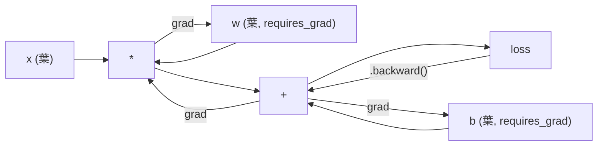
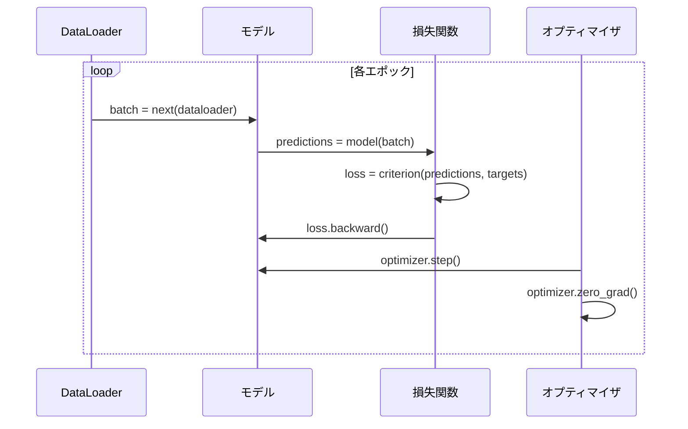

# PyTorch入門

> ピストンとクランクシャフトからエンジンを構築してきた。今度は誰もが実際に運転するものを学ぼう。

**タイプ:** 構築
**言語:** Python
**前提条件:** レッスン 03.10（独自のミニフレームワークを構築する）
**所要時間:** 約75分

## 学習目標

- PyTorchのnn.Module、nn.Sequential、autogradを使ってニューラルネットワークを構築・訓練する
- PyTorchのテンソル、GPU高速化、標準訓練ループ（zero_grad、forward、loss、backward、step）を使用する
- ゼロから作ったミニフレームワークのコンポーネントをPyTorchの対応物に変換する
- ゼロから作ったPure PythonフレームワークとPyTorchの訓練速度を同じタスクでプロファイリングして比較する

## 問題

動作するミニフレームワークがある。Linear層、ReLU、ドロップアウト、バッチ正規化、Adam、DataLoader、訓練ループ。Pure Pythonで円分類問題上の4層ネットワークを訓練する。

同じ問題でPyTorchより500倍遅くもある。

ミニフレームワークはネストされたPythonループで1サンプルずつ処理する。PyTorchは同じ操作をGPUで動作する最適化されたC++/CUDAカーネルにディスパッチする。単一のNVIDIA A100では、PyTorchはResNet-50（2560万パラメータ）をImageNet（128万画像）で約6時間で訓練できる。同じタスクでフレームワークは約3,000時間かかる—メモリ不足にならなければの話だが。

速度だけがギャップではない。フレームワークにはGPUサポートがない。自動微分がない—すべてのモジュールでbackward()を手書きした。シリアライゼーションがない。分散訓練がない。混合精度がない。print文なしでは勾配フローをデバッグできない。

PyTorchはこれらすべてのギャップを埋める。そして、すでに構築したのと全く同じメンタルモデルを維持しながら：Module、forward()、parameters()、backward()、optimizer.step()。コンセプトは1対1で移行できる。構文はほぼ同一だ。違いはPyTorchが10年分のシステムエンジニアリングを同じインターフェースの裏側に包んでいることだ。

## コンセプト

### PyTorchが勝った理由

2015年、TensorFlowは何かを実行する前に静的な計算グラフを定義する必要があった。グラフを構築し、コンパイルし、そこにデータを流す。デバッグはグラフの視覚化を見つめることを意味した。アーキテクチャの変更はグラフを最初から再構築することを意味した。

PyTorchは2017年に異なる哲学で登場した：eagerな実行。Pythonを書く。すぐに実行される。`y = model(x)` は実際に今yを計算する。「後でyを計算するグラフにノードを追加する」ではない。これは標準的なPythonデバッグツールが機能することを意味した。print()が機能した。pdbが機能した。フォワードパスのif/elseが機能した。

2020年までに、市場が答えを出した。ML研究論文でのPyTorchのシェアは7%（2017年）から75%以上（2022年）に増加した。Meta、Google DeepMind、OpenAI、Anthropic、Hugging FaceはすべてプライマリフレームワークとしてPyTorchを使用している。TensorFlow 2.xはそれに応じてeagerな実行を採用した—PyTorchの設計が正しかったという暗黙の認識だ。

教訓：開発者体験は複利で積み重なる。10%遅いが50%デバッグが速いフレームワークが毎回勝つ。

### テンソル

テンソルは3つの重要なプロパティを持つ多次元配列：shape、dtype、device。

```python
import torch

x = torch.zeros(3, 4)           # shape: (3, 4), dtype: float32, device: cpu
x = torch.randn(2, 3, 224, 224) # 2枚のRGB画像のバッチ、224x224
x = torch.tensor([1, 2, 3])     # Pythonリストから
```

**Shape**は次元数だ。スカラーはshape ()、ベクトルは(n,)、行列は(m, n)、画像のバッチは(batch, channels, height, width)だ。

**Dtype**は精度とメモリを制御する。

| dtype | ビット | 範囲 | ユースケース |
|-------|------|-------|----------|
| float32 | 32 | ~7桁の10進数 | デフォルトの訓練 |
| float16 | 16 | ~3.3桁の10進数 | 混合精度 |
| bfloat16 | 16 | float32と同じ範囲、精度は低い | LLM訓練 |
| int8 | 8 | -128から127 | 量子化推論 |

**Device**は計算が行われる場所を決定する。

```python
device = torch.device("cuda" if torch.cuda.is_available() else "cpu")
x = torch.randn(3, 4, device=device)
x = x.to("cuda")
x = x.cpu()
```

すべての演算はすべてのテンソルが同じデバイス上にあることを必要とする。これが初心者が直面する #1 PyTorchエラーだ：`RuntimeError: Expected all tensors to be on the same device`。計算前にすべてを同じデバイスに移動することで修正する。

**リシェイプ**は定数時間だ—データではなくメタデータを変更する。

```python
x = torch.randn(2, 3, 4)
x.view(2, 12)      # (2, 12)にリシェイプ—連続している必要がある
x.reshape(6, 4)    # (6, 4)にリシェイプ—常に機能する
x.permute(2, 0, 1) # 次元を並べ替える
x.unsqueeze(0)     # 次元を追加: (1, 2, 3, 4)
x.squeeze()        # サイズ1の次元を削除
```

### Autograd

ミニフレームワークはすべてのモジュールでbackward()を実装する必要があった。PyTorchはそうではない。テンソルへのすべての操作を有向非巡回グラフ（計算グラフ）に記録し、そのグラフを逆向きにたどって勾配を自動的に計算する。



フレームワークとの主な違い：PyTorchはテープベースの自動微分を使用する。すべての操作はフォワードパス中に「テープ」に追加される。`.backward()`を呼ぶとテープが逆順に再生される。

```python
x = torch.randn(3, requires_grad=True)
y = x ** 2 + 3 * x
z = y.sum()
z.backward()
print(x.grad)  # dz/dx = 2x + 3
```

autogradの3つのルール：

1. `requires_grad=True`の葉テンソルのみが勾配を累積する
2. 勾配はデフォルトで累積される—各バックワードパスの前に`optimizer.zero_grad()`を呼ぶ
3. `torch.no_grad()`は勾配追跡を無効にする（評価中に使用）

### nn.Module

`nn.Module`はPyTorchのすべてのニューラルネットワークコンポーネントの基底クラスだ。この抽象化はレッスン10で構築済みだ。PyTorchのバージョンは自動パラメータ登録、再帰的なモジュール発見、デバイス管理、state dictシリアライゼーションを追加する。

```python
import torch.nn as nn

class MLP(nn.Module):
    def __init__(self, input_dim, hidden_dim, output_dim):
        super().__init__()
        self.layer1 = nn.Linear(input_dim, hidden_dim)
        self.relu = nn.ReLU()
        self.layer2 = nn.Linear(hidden_dim, output_dim)

    def forward(self, x):
        x = self.layer1(x)
        x = self.relu(x)
        x = self.layer2(x)
        return x
```

`__init__`で`nn.Module`または`nn.Parameter`を属性として割り当てると、PyTorchが自動的に登録する。`model.parameters()`はすべての登録済みパラメータを再帰的に収集する。ミニフレームワークでやったように重みを手動でまとめる必要がない理由だ。

主要なビルディングブロック：

| モジュール | 動作 | パラメータ数 |
|--------|-------------|------------|
| nn.Linear(in, out) | Wx + b | in*out + out |
| nn.Conv2d(in_ch, out_ch, k) | 2D畳み込み | in_ch*out_ch*k*k + out_ch |
| nn.BatchNorm1d(features) | アクティベーションの正規化 | 2 * features |
| nn.Dropout(p) | ランダムゼロ化 | 0 |
| nn.ReLU() | max(0, x) | 0 |
| nn.GELU() | ガウス誤差線形 | 0 |
| nn.Embedding(vocab, dim) | ルックアップテーブル | vocab * dim |
| nn.LayerNorm(dim) | サンプルごとの正規化 | 2 * dim |

### 損失関数とオプティマイザ

PyTorchは構築したすべてのものの本番環境対応バージョンを提供する。

**損失関数**（`torch.nn`から）：

| 損失 | タスク | 入力 |
|------|------|-------|
| nn.MSELoss() | 回帰 | 任意のshape |
| nn.CrossEntropyLoss() | 多クラス分類 | ロジット（softmaxでない） |
| nn.BCEWithLogitsLoss() | 二値分類 | ロジット（sigmoidでない） |
| nn.L1Loss() | 回帰（ロバスト） | 任意のshape |
| nn.CTCLoss() | シーケンスアライメント | 対数確率 |

注意：`CrossEntropyLoss`は内部で`LogSoftmax` + `NLLLoss`を組み合わせる。ソフトマックス出力ではなく生のロジットを渡す。これはサイレントに間違った勾配を生成する一般的な間違いだ。

**オプティマイザ**（`torch.optim`から）：

| オプティマイザ | 使う場面 | 典型的な学習率 |
|-----------|-------------|-----------|
| SGD(params, lr, momentum) | CNN、よく調整されたパイプライン | 0.01〜0.1 |
| Adam(params, lr) | デフォルトの出発点 | 1e-3 |
| AdamW(params, lr, weight_decay) | トランスフォーマー、ファインチューニング | 1e-4〜1e-3 |
| LBFGS(params) | 小規模、二次 | 1.0 |

### 訓練ループ

すべてのPyTorch訓練ループは同じ5ステップのパターンに従う。これはレッスン10から既に知っている。



標準パターン：

```python
for epoch in range(num_epochs):
    model.train()
    for inputs, targets in train_loader:
        inputs, targets = inputs.to(device), targets.to(device)
        optimizer.zero_grad()
        outputs = model(inputs)
        loss = criterion(outputs, targets)
        loss.backward()
        optimizer.step()
```

バッチループ内の5行。GPT-4、Stable Diffusion、LLaMAを訓練した5行だ。アーキテクチャは変わる。データは変わる。これらの5行は変わらない。

### DatasetとDataLoader

PyTorchの`Dataset`は2つのメソッドを持つ抽象クラスだ：`__len__`と`__getitem__`。`DataLoader`はバッチ化、シャッフル、マルチプロセスデータロードでラップする。

```python
from torch.utils.data import Dataset, DataLoader

class MNISTDataset(Dataset):
    def __init__(self, images, labels):
        self.images = images
        self.labels = labels

    def __len__(self):
        return len(self.labels)

    def __getitem__(self, idx):
        return self.images[idx], self.labels[idx]

loader = DataLoader(dataset, batch_size=64, shuffle=True, num_workers=4)
```

`num_workers=4`は4つのプロセスを生成して、GPUが現在のバッチで訓練している間、並列にデータをロードする。ディスクバウンドのワークロード（大きな画像、音声）では、これだけで訓練速度が2倍になることがある。

### GPU訓練

モデルをGPUに移動する：

```python
device = torch.device("cuda" if torch.cuda.is_available() else "cpu")
model = model.to(device)
```

これはすべてのパラメータとバッファを再帰的にGPUに移動する。次に訓練中に各バッチを移動する：

```python
inputs, targets = inputs.to(device), targets.to(device)
```

**混合精度**は、マスター重みをfloat32に保ちながらフォワード/バックワードをfloat16で実行することで、現代のGPU（A100、H100、RTX 4090）でメモリ使用量を半減しスループットを2倍にする：

```python
from torch.amp import autocast, GradScaler

scaler = GradScaler()
for inputs, targets in loader:
    with autocast(device_type="cuda"):
        outputs = model(inputs)
        loss = criterion(outputs, targets)
    scaler.scale(loss).backward()
    scaler.step(optimizer)
    scaler.update()
    optimizer.zero_grad()
```

### 比較：ミニフレームワーク対PyTorch対JAX

| 機能 | ミニフレームワーク (L10) | PyTorch | JAX |
|---------|---------------------|---------|-----|
| 自動微分 | 手動backward() | テープベースのautograd | 関数型変換 |
| 実行 | Eager (Pythonループ) | Eager (C++カーネル) | トレース + JITコンパイル |
| GPUサポート | なし | あり (CUDA, ROCm, MPS) | あり (CUDA, TPU) |
| 速度 (MNIST MLP) | ~300秒/エポック | ~0.5秒/エポック | ~0.3秒/エポック |
| モジュールシステム | カスタムModuleクラス | nn.Module | ステートレス関数 (Flax/Equinox) |
| デバッグ | print() | print(), pdb, breakpoint() | 難しい (JITトレーシングがprintを壊す) |
| エコシステム | なし | Hugging Face, Lightning, timm | Flax, Optax, Orbax |
| 学習曲線 | 自分で構築した | 中程度 | 急峻（関数型パラダイム） |
| 本番使用 | おもちゃの問題 | Meta, OpenAI, Anthropic, HF | Google DeepMind, Midjourney |

## 構築する

PyTorchのみを使ってMNISTで訓練する3層MLP。高レベルのラッパーなし。`torchvision.datasets`なし。生データを自分でダウンロードして解析する。

### ステップ1：生ファイルからMNISTをロードする

MNISTは4つのgzip圧縮ファイルとして提供される：訓練画像（60,000 x 28 x 28）、訓練ラベル、テスト画像（10,000 x 28 x 28）、テストラベル。ダウンロードしてバイナリ形式を解析する。

```python
import torch
import torch.nn as nn
import struct
import gzip
import urllib.request
import os

def download_mnist(path="./mnist_data"):
    base_url = "https://storage.googleapis.com/cvdf-datasets/mnist/"
    files = [
        "train-images-idx3-ubyte.gz",
        "train-labels-idx1-ubyte.gz",
        "t10k-images-idx3-ubyte.gz",
        "t10k-labels-idx1-ubyte.gz",
    ]
    os.makedirs(path, exist_ok=True)
    for f in files:
        filepath = os.path.join(path, f)
        if not os.path.exists(filepath):
            urllib.request.urlretrieve(base_url + f, filepath)

def load_images(filepath):
    with gzip.open(filepath, "rb") as f:
        magic, num, rows, cols = struct.unpack(">IIII", f.read(16))
        data = f.read()
        images = torch.frombuffer(bytearray(data), dtype=torch.uint8)
        images = images.reshape(num, rows * cols).float() / 255.0
    return images

def load_labels(filepath):
    with gzip.open(filepath, "rb") as f:
        magic, num = struct.unpack(">II", f.read(8))
        data = f.read()
        labels = torch.frombuffer(bytearray(data), dtype=torch.uint8).long()
    return labels
```

### ステップ2：モデルの定義

3層MLP：784 -> 256 -> 128 -> 10。ReLUアクティベーション。正則化のためのドロップアウト。シンプルにするためバッチ正規化はなし。

```python
class MNISTModel(nn.Module):
    def __init__(self):
        super().__init__()
        self.net = nn.Sequential(
            nn.Linear(784, 256),
            nn.ReLU(),
            nn.Dropout(0.2),
            nn.Linear(256, 128),
            nn.ReLU(),
            nn.Dropout(0.2),
            nn.Linear(128, 10),
        )

    def forward(self, x):
        return self.net(x)
```

出力層は10個の生のロジット（数字ごとに1つ）を生成する。ソフトマックスなし—`CrossEntropyLoss`が内部で処理する。

パラメータ数：784*256 + 256 + 256*128 + 128 + 128*10 + 10 = 235,146。現代の基準では小さい。GPT-2 smallは1億2400万持つ。これは数秒で訓練できる。

### ステップ3：訓練ループ

標準的なforward-loss-backward-stepパターン。

```python
def train_one_epoch(model, loader, criterion, optimizer, device):
    model.train()
    total_loss = 0
    correct = 0
    total = 0
    for images, labels in loader:
        images, labels = images.to(device), labels.to(device)
        optimizer.zero_grad()
        outputs = model(images)
        loss = criterion(outputs, labels)
        loss.backward()
        optimizer.step()
        total_loss += loss.item() * images.size(0)
        _, predicted = outputs.max(1)
        correct += predicted.eq(labels).sum().item()
        total += labels.size(0)
    return total_loss / total, correct / total


def evaluate(model, loader, criterion, device):
    model.eval()
    total_loss = 0
    correct = 0
    total = 0
    with torch.no_grad():
        for images, labels in loader:
            images, labels = images.to(device), labels.to(device)
            outputs = model(images)
            loss = criterion(outputs, labels)
            total_loss += loss.item() * images.size(0)
            _, predicted = outputs.max(1)
            correct += predicted.eq(labels).sum().item()
            total += labels.size(0)
    return total_loss / total, correct / total
```

評価中の `torch.no_grad()` に注意。これはautogradを無効にし、メモリ使用量を減らし推論を速める。これなしでは、PyTorchが使わない計算グラフを構築する。

### ステップ4：すべてを繋ぎ合わせる

```python
def main():
    device = torch.device("cuda" if torch.cuda.is_available() else "cpu")

    download_mnist()
    train_images = load_images("./mnist_data/train-images-idx3-ubyte.gz")
    train_labels = load_labels("./mnist_data/train-labels-idx1-ubyte.gz")
    test_images = load_images("./mnist_data/t10k-images-idx3-ubyte.gz")
    test_labels = load_labels("./mnist_data/t10k-labels-idx1-ubyte.gz")

    train_dataset = torch.utils.data.TensorDataset(train_images, train_labels)
    test_dataset = torch.utils.data.TensorDataset(test_images, test_labels)
    train_loader = torch.utils.data.DataLoader(
        train_dataset, batch_size=64, shuffle=True
    )
    test_loader = torch.utils.data.DataLoader(
        test_dataset, batch_size=256, shuffle=False
    )

    model = MNISTModel().to(device)
    criterion = nn.CrossEntropyLoss()
    optimizer = torch.optim.Adam(model.parameters(), lr=1e-3)

    num_params = sum(p.numel() for p in model.parameters())
    print(f"Device: {device}")
    print(f"Parameters: {num_params:,}")
    print(f"Train samples: {len(train_dataset):,}")
    print(f"Test samples: {len(test_dataset):,}")
    print()

    for epoch in range(10):
        train_loss, train_acc = train_one_epoch(
            model, train_loader, criterion, optimizer, device
        )
        test_loss, test_acc = evaluate(
            model, test_loader, criterion, device
        )
        print(
            f"Epoch {epoch+1:2d} | "
            f"Train Loss: {train_loss:.4f} | Train Acc: {train_acc:.4f} | "
            f"Test Loss: {test_loss:.4f} | Test Acc: {test_acc:.4f}"
        )

    torch.save(model.state_dict(), "mnist_mlp.pt")
    print(f"\nModel saved to mnist_mlp.pt")
    print(f"Final test accuracy: {test_acc:.4f}")
```

10エポック後の期待出力：テスト精度約97.8%。CPU上の訓練時間：約30秒。GPU上：約5秒。同じアーキテクチャでミニフレームワーク上：約45分。

## 活用する

### クイック比較：ミニフレームワーク対PyTorch

| ミニフレームワーク（レッスン10） | PyTorch |
|---------------------------|---------|
| `model = Sequential(Linear(784, 256), ReLU(), ...)` | `model = nn.Sequential(nn.Linear(784, 256), nn.ReLU(), ...)` |
| `pred = model.forward(x)` | `pred = model(x)` |
| `optimizer.zero_grad()` | `optimizer.zero_grad()` |
| `grad = criterion.backward()` から `model.backward(grad)` | `loss.backward()` |
| `optimizer.step()` | `optimizer.step()` |
| GPUなし | `model.to("cuda")` |
| 各モジュールの手動backward | autogradがすべて処理 |

インターフェースはほぼ同一だ。違いはすべてフードの下にある。

### モデルの保存と読み込み

```python
torch.save(model.state_dict(), "model.pt")

model = MNISTModel()
model.load_state_dict(torch.load("model.pt", weights_only=True))
model.eval()
```

モデルオブジェクトではなく `state_dict()`（パラメータ辞書）を常に保存する。モデルオブジェクトの保存はpickleを使用し、コードをリファクタリングすると壊れる。state dictはポータブルだ。

### 学習率スケジューリング

```python
scheduler = torch.optim.lr_scheduler.CosineAnnealingLR(
    optimizer, T_max=10
)
for epoch in range(10):
    train_one_epoch(model, train_loader, criterion, optimizer, device)
    scheduler.step()
```

PyTorchには15以上のスケジューラが付属する：StepLR、ExponentialLR、CosineAnnealingLR、OneCycleLR、ReduceLROnPlateau。すべてが同じオプティマイザインターフェースに接続する。

## Ship It

このレッスンが生成するもの：

- `outputs/prompt-pytorch-debugger.md` — 一般的なPyTorch訓練の失敗を診断するプロンプト
- `outputs/skill-pytorch-patterns.md` — PyTorch訓練パターンのスキルリファレンス

## 演習

1. **バッチ正規化を追加する。** 各Linear層の後（活性化の前）に `nn.BatchNorm1d` を挿入する。テスト精度と訓練速度をドロップアウトのみのバージョンと比較する。バッチ正規化は少ないエポックで98%以上に達するはずだ。

2. **学習率ファインダーを実装する。** 指数的に学習率を増加させながら（1e-7から1.0）1エポック訓練する。損失対学習率をプロットする。最適な学習率は損失が増加し始める直前だ。これを使ってMNISTモデルのより良い学習率を選ぶ。

3. **GPUで混合精度に移行する。** `torch.amp.autocast` と `GradScaler` を訓練ループに追加する。混合精度あり/なしでGPUのスループット（サンプル/秒）を測定する。A100では約2倍の速度向上が期待できる。

4. **カスタムDatasetを構築する。** Fashion-MNIST（MNISTと同じ形式だが衣料品アイテム）をダウンロードする。`__getitem__` と `__len__` を持つ `FashionMNISTDataset(Dataset)` クラスを実装する。同じMLPを訓練して精度を比較する。Fashion-MNISTはより難しい—約98%対約88%が期待される。

5. **Adamをモーメンタム付きSGDに置き換える。** `SGD(params, lr=0.01, momentum=0.9)` で訓練する。収束曲線を比較する。次に `CosineAnnealingLR` スケジューラを追加し、SGDがエポック10までにAdamに追いつくかどうか確認する。

## 用語集

| 用語 | よく言われること | 実際の意味 |
|------|----------------|----------------------|
| テンソル | 「多次元配列」 | すべての演算に自動微分サポートが組み込まれた型付きのデバイス対応配列 |
| Autograd | 「自動バックプロパゲーション」 | フォワードパス中に演算を記録し、それを逆順に再生して正確な勾配を計算するテープベースのシステム |
| nn.Module | 「層」 | あらゆる微分可能な計算ブロックの基底クラス—パラメータを登録し、ネスティングをサポートし、train/evalモードを処理する |
| state_dict | 「モデルの重み」 | パラメータ名をテンソルにマッピングするOrderedDict—訓練済みモデルのポータブルでシリアライズ可能な表現 |
| .backward() | 「勾配を計算する」 | 計算グラフを逆向きにたどり、requires_grad=Trueのすべての葉テンソルの勾配を計算・累積する |
| .to(device) | 「GPUに移動する」 | すべてのパラメータとバッファを指定したデバイス（CPU、CUDA、MPS）に再帰的に転送する |
| DataLoader | 「データパイプライン」 | Datasetからデータロードをバッチ化、シャッフル、オプションで並列化するイテレータ |
| 混合精度 | 「float16を使用する」 | 数値的安定性のためfloat32マスター重みを保ちながらfloat16フォワード/バックワードを使って速度とメモリを改善する |
| Eager実行 | 「今すぐ実行する」 | 後のコンパイルステップに先延ばしにせず、呼び出されたら即座に演算を実行する—PyTorchをTF 1.xと差別化するコアの設計上の選択 |
| zero_grad | 「勾配をリセットする」 | PyTorchはデフォルトで勾配を累積するため、次のバックワードパスの前にすべてのパラメータ勾配をゼロに設定する |

## 参考文献

- Paszkeら、「PyTorch: An Imperative Style, High-Performance Deep Learning Library」（2019年）—PyTorchの設計上のトレードオフを説明する元の論文
- PyTorchチュートリアル：「Learning PyTorch with Examples」（https://pytorch.org/tutorials/beginner/pytorch_with_examples.html）—テンソルからnn.Moduleへの公式パス
- PyTorchパフォーマンスチューニングガイド（https://pytorch.org/tutorials/recipes/recipes/tuning_guide.html）—混合精度、DataLoaderワーカー、ピン留めメモリ、その他の本番最適化
- Horace He、「Making Deep Learning Go Brrrr」（https://horace.io/brrr_intro.html）—GPU訓練が速い理由とPyTorch固有の最適化戦略
