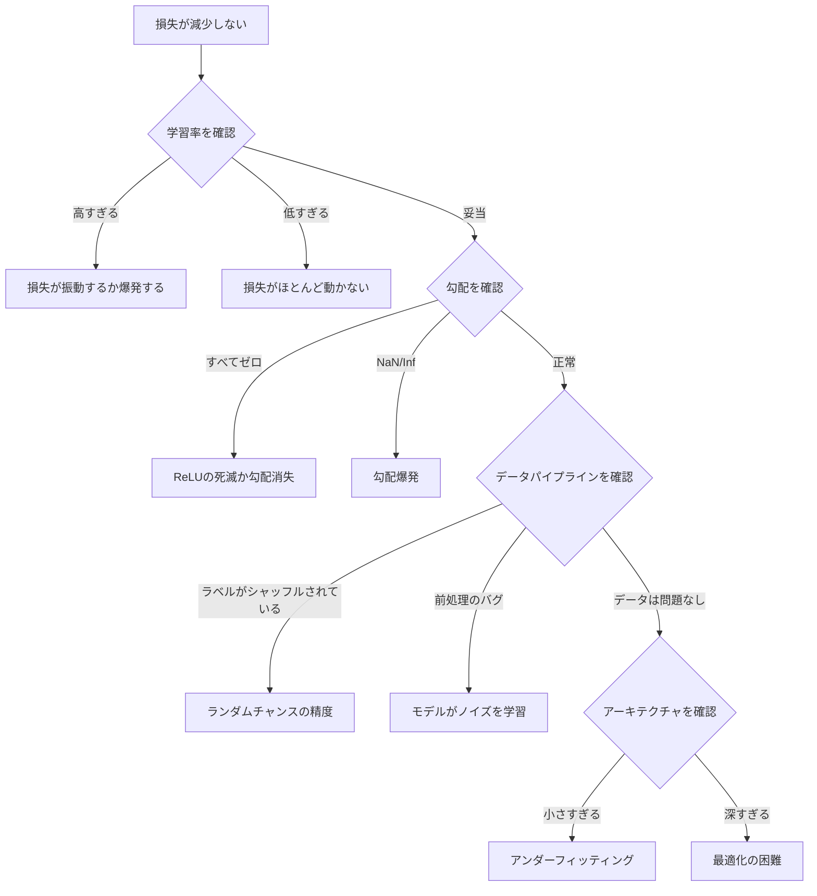
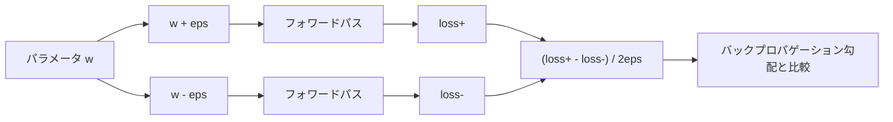
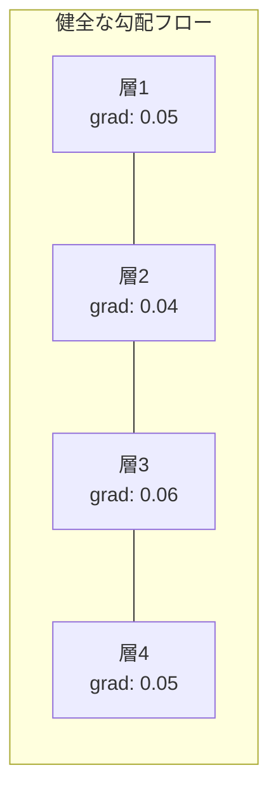
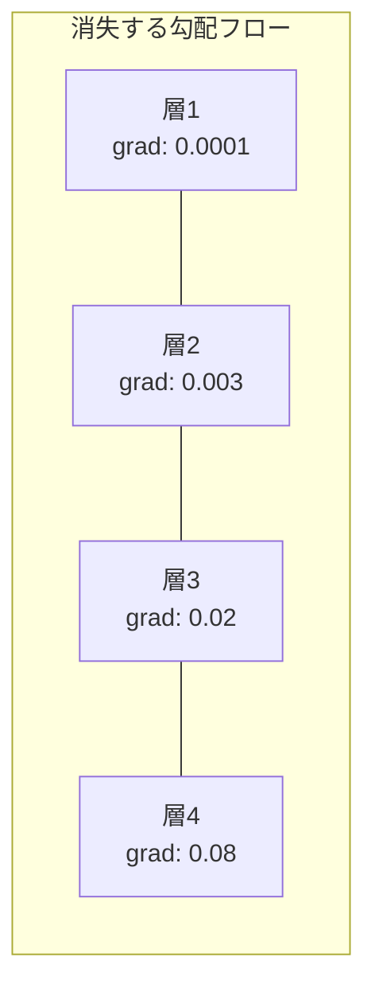
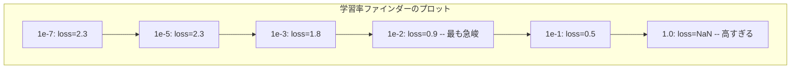

# ニューラルネットワークのデバッグ

> ネットワークがコンパイルされた。実行された。数値が生成された。その数値は間違っていて、何もクラッシュしていない。エラーメッセージのない、最も難しい種類のデバッグへようこそ。

**タイプ:** 実践
**言語:** Python、PyTorch
**前提条件:** フェーズ03 レッスン01-10（特にバックプロパゲーション、損失関数、オプティマイザ）
**所要時間:** 約90分

## 学習目標

- 系統的なデバッグ戦略を使って一般的なニューラルネットワークの失敗（NaN損失、フラットな損失曲線、過学習、振動）を診断する
- 「1バッチ過学習」テクニックを適用してモデルアーキテクチャと訓練ループが正しいことを確認する
- 勾配の大きさ、アクティベーション分布、重みノルムを検査して勾配消失/爆発問題を特定する
- データパイプライン、モデルアーキテクチャ、損失関数、オプティマイザ、学習率の問題をカバーするデバッグチェックリストを構築する

## 問題

従来のソフトウェアは壊れているときにクラッシュする。ヌルポインタは例外を投げる。型の不一致はコンパイル時に失敗する。オフバイワンのエラーは明らかに間違った出力を生成する。

ニューラルネットワークはその贅沢を与えてくれない。

壊れたニューラルネットワークは完了まで実行し、損失値を出力し、予測を生成する。損失は減少するかもしれない。予測は妥当に見えるかもしれない。しかしモデルはサイレントに間違っている—近道を学習し、ノイズを記憶し、役に立たない局所的最小値に収束している。Googleの研究者はML デバッグ時間の60〜70%が「サイレントな」バグ（エラーを生成しないがモデルの品質を低下させる）に費やされると推定している。

動作するモデルと壊れているモデルの違いは、しばしば1行のコードだ：`zero_grad()`の欠如、転置された次元、10倍ずれた学習率。2019年の定番「Recipe for Training Neural Networks」はこう始まる：「最も一般的なニューラルネットワークの間違いはクラッシュしないバグだ。」

このレッスンではそのようなバグの見つけ方を教える。

## コンセプト

### デバッグのマインドセット

print-and-prayデバッグは忘れよう。ニューラルネットワークのデバッグはフィードバックループが遅く（1回の訓練実行に数分から数時間）、症状が曖昧（悪い損失は20の異なることを意味する可能性がある）ため、系統的なアプローチが必要だ。

黄金律：**シンプルから始め、一度に1つずつ複雑さを追加し、各ピースを独立して検証する。**



### 症状1：損失が減少しない

最も一般的な訴えだ。訓練ループが実行され、エポックが進み、損失がフラットなままか激しく振動する。

**間違った学習率。** 高すぎる：損失が振動するかNaNに跳び上がる。低すぎる：損失が非常にゆっくり減少するのでフラットに見える。Adamでは1e-3から始める。SGDでは1e-1か1e-2から始める。他に何か問題があると結論する前に、10倍刻みの3つの学習率（例えば1e-2、1e-3、1e-4）を常に試す。

**ReLUの死滅。** ReLUニューロンが大きな負の入力を受け取ると、0を出力し勾配が0になる。二度と活性化しない。十分なニューロンが死滅すると、ネットワークは学習できない。確認：各ReLU層の後でちょうど0のアクティベーションの割合を出力する。>50%が死滅している場合、LeakyReLUに切り替えるか学習率を下げる。

**勾配消失。** sigmoidやtanhアクティベーションを持つ深いネットワークでは、勾配が逆向きに伝播するにつれて指数的に縮小する。最初の層に達するころには約0になっている。最初の層が学習を止める。修正：ReLU/GELUを使い、残差接続を追加し、バッチ正規化を使う。

**勾配爆発。** 逆の問題—勾配が指数的に増加する。RNNと非常に深いネットワークで一般的。損失がNaNに跳ぶ。修正：勾配クリッピング（`torch.nn.utils.clip_grad_norm_`）、低い学習率、または正規化の追加。

### 症状2：損失は減少しているがモデルが悪い

損失が下がる。訓練精度が99%に達する。しかしテスト精度が55%だ。またはモデルが実際のデータで無意味な出力を生成する。

**過学習。** モデルがパターンを学習する代わりに訓練データを記憶する。訓練損失と検証損失のギャップが時間とともに増大する。修正：より多くのデータ、ドロップアウト、重み減衰、早期停止、データ拡張。

**データリーク。** テストデータが訓練に漏洩した。精度が疑わしいほど高い。一般的な原因：分割前のシャッフル、完全なデータセットの統計を使った前処理、分割をまたいだ重複サンプル。修正：まず分割し次に前処理し、重複を確認する。

**ラベルのエラー。** ほとんどの実際のデータセットのラベルの5〜10%は間違っている（Northcuttら、2021年—「Pervasive Label Errors in Test Sets」）。モデルはノイズを学習する。修正：confident learningを使って誤ったラベルを見つけて修正するか、損失の切り捨てを使って高損失サンプルを無視する。

### 症状3：損失にNaNかInfがある

損失値が`nan`または`inf`になる。訓練が死んだ。

**学習率が高すぎる。** 勾配更新が大きくオーバーシュートして重みが爆発する。修正：10倍下げる。

**log(0)かlog(負の値)。** 交差エントロピー損失は`log(p)`を計算する。モデルがちょうど0か負の確率を出力すると、logが爆発する。修正：`eps=1e-7`で予測を`[eps, 1-eps]`にクランプする。

**ゼロ除算。** バッチ正規化は標準偏差で割る。定数値のバッチはstd=0になる。修正：分母にepsilonを追加する（PyTorchはデフォルトでこれをするが、カスタム実装はしないかもしれない）。

**数値オーバーフロー。** 大きなアクティベーションが`exp()`に渡されるとInfを生成する。softmaxが特にこれに陥りやすい。修正：指数化の前に最大値を引く（log-sum-expトリック）。

### テクニック1：勾配チェック

解析的勾配（バックプロパゲーションから）と数値的勾配（有限差分から）を比較する。一致しない場合、バックワードパスにバグがある。

パラメータ`w`の数値的勾配：

```
grad_numerical = (loss(w + eps) - loss(w - eps)) / (2 * eps)
```

一致度のメトリクス（相対差）：

```
rel_diff = |grad_analytical - grad_numerical| / max(|grad_analytical|, |grad_numerical|, 1e-8)
```

`rel_diff < 1e-5`：正しい。`rel_diff > 1e-3`：ほぼ確実にバグがある。



### テクニック2：アクティベーション統計

訓練中に各層の後のアクティベーションの平均と標準偏差を監視する。健全なネットワークは（正規化後）平均が0付近、stdが1付近のアクティベーションを維持する。

| 健全性指標 | 平均 | Std | 診断 |
|-----------------|------|-----|-----------|
| 健全 | ~0 | ~1 | ネットワークが正常に学習している |
| 飽和 | >>0か<<0 | ~0 | アクティベーションが極端な値で詰まっている |
| 死滅 | 0 | 0 | ニューロンが死んでいる（すべてゼロ） |
| 爆発 | >>10 | >>10 | アクティベーションが際限なく増加している |

### テクニック3：勾配フローの可視化

各層の平均勾配の大きさをプロットする。健全なネットワークでは、勾配の大きさが層全体でほぼ同等であるべきだ。初期の層が後の層より1000倍小さい勾配を持つ場合、勾配消失がある。





### テクニック4：1バッチ過学習テスト

ディープラーニングで最も重要なデバッグテクニック。

1つの小さいバッチ（8〜32サンプル）を取る。100回以上の反復で訓練する。損失はほぼゼロになり、訓練精度は100%に達するはずだ。そうならない場合、モデルまたは訓練ループに根本的なバグがある—完全な訓練に進まないこと。

このテストが捕まえるもの：
- 壊れた損失関数
- 壊れたバックワードパス
- データを表現するには小さすぎるアーキテクチャ
- モデルパラメータに接続されていないオプティマイザ
- データとラベルのずれ

このテストは30秒で実行でき、完全な訓練実行の何時間ものデバッグを節約できる。

### テクニック5：学習率ファインダー

Leslie Smith（2017年）は、1エポックかけて損失を記録しながら学習率を非常に小さい（1e-7）から非常に大きい（10）まで掃引することを提案した。損失対学習率をプロットする。最適な学習率は損失が最も速く減少し始める速度のおよそ10倍小さい値だ。



この例での最良の学習率：約1e-3（最も急峻なポイントの1桁前）。

### 一般的なPyTorchのバグ

PyTorchコミュニティで最も多くの時間を無駄にするバグ：

| バグ | 症状 | 修正 |
|-----|---------|-----|
| `optimizer.zero_grad()`を忘れる | 勾配がバッチをまたいで累積し、損失が振動する | `loss.backward()`の前に`optimizer.zero_grad()`を追加する |
| テスト時に`model.eval()`を忘れる | ドロップアウトとバッチ正規化の動作が異なり、実行間でテスト精度が変動する | `model.eval()`と`torch.no_grad()`を追加する |
| テンソルshapeが間違っている | サイレントなブロードキャストが間違った結果を生成し、エラーなし | デバッグ中はすべての演算の後にshapeを出力する |
| CPU/GPUの不一致 | `RuntimeError: expected CUDA tensor` | モデルとデータの両方に`.to(device)`を使う |
| テンソルをデタッチしていない | 計算グラフが無限に増大し、OOM | `.detach()`か`with torch.no_grad()`を使う |
| インプレース演算がautogradを壊す | `RuntimeError: modified by in-place operation` | `x += 1`を`x = x + 1`に置き換える |
| データが正規化されていない | 損失がランダムチャンスレベルで詰まっている | 入力を平均=0、std=1に正規化する |
| ラベルが間違ったdtype | 交差エントロピーは`Long`を期待するが`Float`を受け取った | ラベルをキャスト：`labels.long()` |

### マスターデバッグ表

| 症状 | 考えられる原因 | 最初に試すこと |
|---------|-------------|-------------------|
| 損失が-log(1/クラス数)で詰まっている | モデルが一様分布を予測している | データパイプラインを確認し、ラベルが入力と一致することを確認する |
| 数ステップ後に損失がNaN | 学習率が高すぎる | 学習率を10倍下げる |
| 即座に損失がNaN | log(0)かゼロ除算 | log/除算演算にepsilonを追加する |
| 損失が激しく振動する | 学習率が高すぎるかバッチサイズが小さすぎる | 学習率を下げ、バッチサイズを増やす |
| 損失が減少してからプラトーになる | ファインチューニングフェーズに対して学習率が高すぎる | 学習率スケジュールを追加する（コサインかステップ減衰） |
| 訓練精度が高くテスト精度が低い | 過学習 | ドロップアウト、重み減衰、より多くのデータを追加する |
| 訓練精度 = テスト精度 = チャンス | モデルが何も学習していない | 1バッチ過学習テストを実行する |
| 訓練精度 = テスト精度、両方低い | アンダーフィッティング | より大きなモデル、より多くの層、より多くの特徴量 |
| 勾配がすべてゼロ | ReLUの死滅か切り離された計算グラフ | LeakyReLUに切り替え、`.requires_grad`を確認する |
| 訓練中にメモリ不足 | バッチが大きすぎるかグラフが解放されていない | バッチサイズを減らし、評価に`torch.no_grad()`を使う |

## 構築する

アクティベーション、勾配、損失曲線を監視する診断ツールキット。ネットワークを意図的に壊して、ツールキットを使って各問題を診断する。

### ステップ1：NetworkDebuggerクラス

PyTorchモデルにフックを挿入して、層ごとのアクティベーションと勾配統計を記録する。

```python
import torch
import torch.nn as nn
import math


class NetworkDebugger:
    def __init__(self, model):
        self.model = model
        self.activation_stats = {}
        self.gradient_stats = {}
        self.loss_history = []
        self.lr_losses = []
        self.hooks = []
        self._register_hooks()

    def _register_hooks(self):
        for name, module in self.model.named_modules():
            if isinstance(module, (nn.Linear, nn.Conv2d, nn.ReLU, nn.LeakyReLU)):
                hook = module.register_forward_hook(self._make_activation_hook(name))
                self.hooks.append(hook)
                hook = module.register_full_backward_hook(self._make_gradient_hook(name))
                self.hooks.append(hook)

    def _make_activation_hook(self, name):
        def hook(module, input, output):
            with torch.no_grad():
                out = output.detach().float()
                self.activation_stats[name] = {
                    "mean": out.mean().item(),
                    "std": out.std().item(),
                    "fraction_zero": (out == 0).float().mean().item(),
                    "min": out.min().item(),
                    "max": out.max().item(),
                }
        return hook

    def _make_gradient_hook(self, name):
        def hook(module, grad_input, grad_output):
            if grad_output[0] is not None:
                with torch.no_grad():
                    grad = grad_output[0].detach().float()
                    self.gradient_stats[name] = {
                        "mean": grad.mean().item(),
                        "std": grad.std().item(),
                        "abs_mean": grad.abs().mean().item(),
                        "max": grad.abs().max().item(),
                    }
        return hook

    def record_loss(self, loss_value):
        self.loss_history.append(loss_value)

    def check_loss_health(self):
        if len(self.loss_history) < 2:
            return "NOT_ENOUGH_DATA"
        recent = self.loss_history[-10:]
        if any(math.isnan(v) or math.isinf(v) for v in recent):
            return "NAN_OR_INF"
        if len(self.loss_history) >= 20:
            first_half = sum(self.loss_history[:10]) / 10
            second_half = sum(self.loss_history[-10:]) / 10
            if second_half >= first_half * 0.99:
                return "NOT_DECREASING"
        if len(recent) >= 5:
            diffs = [recent[i+1] - recent[i] for i in range(len(recent)-1)]
            if max(diffs) - min(diffs) > 2 * abs(sum(diffs) / len(diffs)):
                return "OSCILLATING"
        return "HEALTHY"

    def check_activations(self):
        issues = []
        for name, stats in self.activation_stats.items():
            if stats["fraction_zero"] > 0.5:
                issues.append(f"DEAD_NEURONS: {name} has {stats['fraction_zero']:.0%} zero activations")
            if abs(stats["mean"]) > 10:
                issues.append(f"EXPLODING_ACTIVATIONS: {name} mean={stats['mean']:.2f}")
            if stats["std"] < 1e-6:
                issues.append(f"COLLAPSED_ACTIVATIONS: {name} std={stats['std']:.2e}")
        return issues if issues else ["HEALTHY"]

    def check_gradients(self):
        issues = []
        grad_magnitudes = []
        for name, stats in self.gradient_stats.items():
            grad_magnitudes.append((name, stats["abs_mean"]))
            if stats["abs_mean"] < 1e-7:
                issues.append(f"VANISHING_GRADIENT: {name} abs_mean={stats['abs_mean']:.2e}")
            if stats["abs_mean"] > 100:
                issues.append(f"EXPLODING_GRADIENT: {name} abs_mean={stats['abs_mean']:.2e}")
        if len(grad_magnitudes) >= 2:
            first_mag = grad_magnitudes[0][1]
            last_mag = grad_magnitudes[-1][1]
            if last_mag > 0 and first_mag / last_mag > 100:
                issues.append(f"GRADIENT_RATIO: first/last = {first_mag/last_mag:.0f}x (vanishing)")
        return issues if issues else ["HEALTHY"]

    def print_report(self):
        print("\n=== NETWORK DEBUGGER REPORT ===")
        print(f"\nLoss health: {self.check_loss_health()}")
        if self.loss_history:
            print(f"  Last 5 losses: {[f'{v:.4f}' for v in self.loss_history[-5:]]}")
        print("\nActivation diagnostics:")
        for item in self.check_activations():
            print(f"  {item}")
        print("\nGradient diagnostics:")
        for item in self.check_gradients():
            print(f"  {item}")
        print("\nPer-layer activation stats:")
        for name, stats in self.activation_stats.items():
            print(f"  {name}: mean={stats['mean']:.4f} std={stats['std']:.4f} zero={stats['fraction_zero']:.1%}")
        print("\nPer-layer gradient stats:")
        for name, stats in self.gradient_stats.items():
            print(f"  {name}: abs_mean={stats['abs_mean']:.2e} max={stats['max']:.2e}")

    def remove_hooks(self):
        for hook in self.hooks:
            hook.remove()
        self.hooks.clear()
```

### ステップ2：1バッチ過学習テスト

```python
def overfit_one_batch(model, x_batch, y_batch, criterion, lr=0.01, steps=200):
    optimizer = torch.optim.Adam(model.parameters(), lr=lr)
    model.train()
    print("\n=== OVERFIT ONE BATCH TEST ===")
    print(f"Batch size: {x_batch.shape[0]}, Steps: {steps}")

    for step in range(steps):
        optimizer.zero_grad()
        output = model(x_batch)
        loss = criterion(output, y_batch)
        loss.backward()
        optimizer.step()

        if step % 50 == 0 or step == steps - 1:
            with torch.no_grad():
                preds = (output > 0).float() if output.shape[-1] == 1 else output.argmax(dim=1)
                targets = y_batch if y_batch.dim() == 1 else y_batch.squeeze()
                acc = (preds.squeeze() == targets).float().mean().item()
            print(f"  Step {step:3d} | Loss: {loss.item():.6f} | Accuracy: {acc:.1%}")

    final_loss = loss.item()
    if final_loss > 0.1:
        print(f"\n  FAIL: Loss did not converge ({final_loss:.4f}). Model or training loop is broken.")
        return False
    print(f"\n  PASS: Loss converged to {final_loss:.6f}")
    return True
```

### ステップ3：学習率ファインダー

```python
def find_learning_rate(model, x_data, y_data, criterion, start_lr=1e-7, end_lr=10, steps=100):
    import copy
    original_state = copy.deepcopy(model.state_dict())
    optimizer = torch.optim.SGD(model.parameters(), lr=start_lr)
    lr_mult = (end_lr / start_lr) ** (1 / steps)

    model.train()
    results = []
    best_loss = float("inf")
    current_lr = start_lr

    print("\n=== LEARNING RATE FINDER ===")

    for step in range(steps):
        optimizer.zero_grad()
        output = model(x_data)
        loss = criterion(output, y_data)

        if math.isnan(loss.item()) or loss.item() > best_loss * 10:
            break

        best_loss = min(best_loss, loss.item())
        results.append((current_lr, loss.item()))

        loss.backward()
        optimizer.step()

        current_lr *= lr_mult
        for param_group in optimizer.param_groups:
            param_group["lr"] = current_lr

    model.load_state_dict(original_state)

    if len(results) < 10:
        print("  Could not complete LR sweep -- loss diverged too quickly")
        return results

    min_loss_idx = min(range(len(results)), key=lambda i: results[i][1])
    suggested_lr = results[max(0, min_loss_idx - 10)][0]

    print(f"  Swept {len(results)} steps from {start_lr:.0e} to {results[-1][0]:.0e}")
    print(f"  Minimum loss {results[min_loss_idx][1]:.4f} at lr={results[min_loss_idx][0]:.2e}")
    print(f"  Suggested learning rate: {suggested_lr:.2e}")

    return results
```

### ステップ4：勾配チェッカー

```python
def _flat_to_multi_index(flat_idx, shape):
    multi_idx = []
    remaining = flat_idx
    for dim in reversed(shape):
        multi_idx.insert(0, remaining % dim)
        remaining //= dim
    return tuple(multi_idx)


def gradient_check(model, x, y, criterion, eps=1e-4):
    model.train()
    x_double = x.double()
    y_double = y.double()
    model_double = model.double()

    print("\n=== GRADIENT CHECK ===")
    overall_max_diff = 0
    checked = 0

    for name, param in model_double.named_parameters():
        if not param.requires_grad:
            continue

        layer_max_diff = 0

        model_double.zero_grad()
        output = model_double(x_double)
        loss = criterion(output, y_double)
        loss.backward()
        analytical_grad = param.grad.clone()

        num_checks = min(5, param.numel())
        for i in range(num_checks):
            idx = _flat_to_multi_index(i, param.shape)
            original = param.data[idx].item()

            param.data[idx] = original + eps
            with torch.no_grad():
                loss_plus = criterion(model_double(x_double), y_double).item()

            param.data[idx] = original - eps
            with torch.no_grad():
                loss_minus = criterion(model_double(x_double), y_double).item()

            param.data[idx] = original

            numerical = (loss_plus - loss_minus) / (2 * eps)
            analytical = analytical_grad[idx].item()

            denom = max(abs(numerical), abs(analytical), 1e-8)
            rel_diff = abs(numerical - analytical) / denom

            layer_max_diff = max(layer_max_diff, rel_diff)
            checked += 1

        overall_max_diff = max(overall_max_diff, layer_max_diff)
        status = "OK" if layer_max_diff < 1e-5 else "MISMATCH"
        print(f"  {name}: max_rel_diff={layer_max_diff:.2e} [{status}]")

    model.float()

    print(f"\n  Checked {checked} parameters")
    if overall_max_diff < 1e-5:
        print("  PASS: Gradients match (rel_diff < 1e-5)")
    elif overall_max_diff < 1e-3:
        print("  WARN: Small differences (1e-5 < rel_diff < 1e-3)")
    else:
        print("  FAIL: Gradient mismatch detected (rel_diff > 1e-3)")
    return overall_max_diff
```

### ステップ5：意図的に壊れたネットワーク

ツールキットを壊れたネットワークに適用して、それぞれを診断する。

```python
def demo_broken_networks():
    torch.manual_seed(42)
    x = torch.randn(64, 10)
    y = (x[:, 0] > 0).long()

    print("\n" + "=" * 60)
    print("BUG 1: Learning rate too high (lr=10)")
    print("=" * 60)
    model1 = nn.Sequential(nn.Linear(10, 32), nn.ReLU(), nn.Linear(32, 2))
    debugger1 = NetworkDebugger(model1)
    optimizer1 = torch.optim.SGD(model1.parameters(), lr=10.0)
    criterion = nn.CrossEntropyLoss()
    for step in range(20):
        optimizer1.zero_grad()
        out = model1(x)
        loss = criterion(out, y)
        debugger1.record_loss(loss.item())
        loss.backward()
        optimizer1.step()
    debugger1.print_report()
    debugger1.remove_hooks()

    print("\n" + "=" * 60)
    print("BUG 2: Dead ReLUs from bad initialization")
    print("=" * 60)
    model2 = nn.Sequential(nn.Linear(10, 32), nn.ReLU(), nn.Linear(32, 32), nn.ReLU(), nn.Linear(32, 2))
    with torch.no_grad():
        for m in model2.modules():
            if isinstance(m, nn.Linear):
                m.weight.fill_(-1.0)
                m.bias.fill_(-5.0)
    debugger2 = NetworkDebugger(model2)
    optimizer2 = torch.optim.Adam(model2.parameters(), lr=1e-3)
    for step in range(50):
        optimizer2.zero_grad()
        out = model2(x)
        loss = criterion(out, y)
        debugger2.record_loss(loss.item())
        loss.backward()
        optimizer2.step()
    debugger2.print_report()
    debugger2.remove_hooks()

    print("\n" + "=" * 60)
    print("BUG 3: Missing zero_grad (gradients accumulate)")
    print("=" * 60)
    model3 = nn.Sequential(nn.Linear(10, 32), nn.ReLU(), nn.Linear(32, 2))
    debugger3 = NetworkDebugger(model3)
    optimizer3 = torch.optim.SGD(model3.parameters(), lr=0.01)
    for step in range(50):
        out = model3(x)
        loss = criterion(out, y)
        debugger3.record_loss(loss.item())
        loss.backward()
        optimizer3.step()
    debugger3.print_report()
    debugger3.remove_hooks()

    print("\n" + "=" * 60)
    print("HEALTHY NETWORK: Correct setup for comparison")
    print("=" * 60)
    model_good = nn.Sequential(nn.Linear(10, 32), nn.ReLU(), nn.Linear(32, 2))
    debugger_good = NetworkDebugger(model_good)
    optimizer_good = torch.optim.Adam(model_good.parameters(), lr=1e-3)
    for step in range(50):
        optimizer_good.zero_grad()
        out = model_good(x)
        loss = criterion(out, y)
        debugger_good.record_loss(loss.item())
        loss.backward()
        optimizer_good.step()
    debugger_good.print_report()
    debugger_good.remove_hooks()

    print("\n" + "=" * 60)
    print("OVERFIT-ONE-BATCH TEST (healthy model)")
    print("=" * 60)
    model_test = nn.Sequential(nn.Linear(10, 32), nn.ReLU(), nn.Linear(32, 2))
    overfit_one_batch(model_test, x[:8], y[:8], criterion)

    print("\n" + "=" * 60)
    print("LEARNING RATE FINDER")
    print("=" * 60)
    model_lr = nn.Sequential(nn.Linear(10, 32), nn.ReLU(), nn.Linear(32, 2))
    find_learning_rate(model_lr, x, y, criterion)

    print("\n" + "=" * 60)
    print("GRADIENT CHECK")
    print("=" * 60)
    model_grad = nn.Sequential(nn.Linear(10, 8), nn.ReLU(), nn.Linear(8, 2))
    gradient_check(model_grad, x[:4], y[:4], criterion)
```

## 活用する

### PyTorch組み込みツール

```python
import torch
import torch.nn as nn

model = nn.Sequential(
    nn.Linear(768, 256),
    nn.ReLU(),
    nn.Linear(256, 10),
)

with torch.autograd.detect_anomaly():
    output = model(input_tensor)
    loss = criterion(output, target)
    loss.backward()

for name, param in model.named_parameters():
    if param.grad is not None:
        print(f"{name}: grad_mean={param.grad.abs().mean():.2e}")
```

### Weights & Biasesとの統合

```python
import wandb

wandb.init(project="debug-training")

for epoch in range(100):
    loss = train_one_epoch()
    wandb.log({
        "loss": loss,
        "lr": optimizer.param_groups[0]["lr"],
        "grad_norm": torch.nn.utils.clip_grad_norm_(model.parameters(), float("inf")),
    })

    for name, param in model.named_parameters():
        if param.grad is not None:
            wandb.log({f"grad/{name}": wandb.Histogram(param.grad.cpu().numpy())})
```

### TensorBoard

```python
from torch.utils.tensorboard import SummaryWriter

writer = SummaryWriter("runs/debug_experiment")

for epoch in range(100):
    loss = train_one_epoch()
    writer.add_scalar("Loss/train", loss, epoch)

    for name, param in model.named_parameters():
        writer.add_histogram(f"weights/{name}", param, epoch)
        if param.grad is not None:
            writer.add_histogram(f"gradients/{name}", param.grad, epoch)
```

### デバッグチェックリスト（完全な訓練前に）

1. 1バッチ過学習テストを実行する。失敗したら停止する。
2. モデルのサマリーを出力する—パラメータ数が妥当であることを確認する。
3. ランダムデータで単一のフォワードパスを実行する—出力shapeを確認する。
4. 5エポック訓練する—損失が減少することを確認する。
5. アクティベーション統計を確認する—死んだ層なし、爆発なし。
6. 勾配フローを確認する—消失なし、爆発なし。
7. データパイプラインを検証する—ラベル付きの5つのランダムサンプルを出力する。

## Ship It

このレッスンが生成するもの：
- `outputs/prompt-nn-debugger.md` — ニューラルネットワーク訓練の失敗を診断するプロンプト
- `outputs/skill-debug-checklist.md` — 訓練問題のデバッグのための決定木チェックリスト

デバッグの主要なデプロイパターン：
- 本番訓練スクリプトに監視フックを追加する
- アクティベーションと勾配統計をNステップごとにW&BまたはTensorBoardにログする
- NaN損失、死んだニューロン（>80%ゼロ）、または勾配爆発の自動アラートを実装する
- アーキテクチャやデータパイプラインを変更するときは常に1バッチ過学習テストを実行する

## 演習

1. **爆発する勾配検出器を追加する。** `NetworkDebugger`を変更して、勾配がしきい値を超えたときに検出し、自動的に勾配クリッピング値を提案する。正規化なしの20層ネットワークでテストする。

2. **死んだニューロンの復活器を構築する。** 死んだReLUニューロン（常に0を出力）を特定し、Kaiming初期化でその入力重みを再初期化する関数を書く。>70%のニューロンが死んでいるネットワークが回復することを示す。

3. **プロット付きの学習率ファインダーを実装する。** 結果をCSVとして保存するよう`find_learning_rate`を拡張し、CSVを読み込んでmatplotlibを使って学習率対損失曲線を表示する別のスクリプトを書く。CIFAR-10のResNet-18の最適な学習率を特定する。

4. **データパイプラインバリデータを作成する。** 以下を確認する関数を書く：訓練/テスト分割をまたいだ重複サンプル、ラベル分布の不均衡（>10:1の比率）、入力正規化（平均が0付近、stdが1付近）、データ内のNaN/Inf値。意図的に破損したデータセットで実行する。

5. **実際の失敗をデバッグする。** レッスン10のミニフレームワークを使い、微妙なバグを導入し（例：バックワードで重み行列を転置する）、勾配チェックを使って不正な勾配を持つパラメータを正確に特定する。デバッグプロセスを文書化する。

## 用語集

| 用語 | よく言われること | 実際の意味 |
|------|----------------|----------------------|
| サイレントバグ | 「実行されるが結果が悪い」 | エラーを生成しないがモデルの品質を低下させるバグ—MLにおける支配的な失敗モード |
| ReLUの死滅 | 「ニューロンが死んだ」 | 入力が常に負のReLUニューロン。0を出力し永久に勾配が0になる |
| 勾配消失 | 「初期層が学習を止める」 | 勾配が層を通じて指数的に縮小し、初期層の重みが実質的に固定される |
| 勾配爆発 | 「損失がNaNになった」 | 勾配が層を通じて指数的に増大し、重みの更新がオーバーフローするほど大きくなる |
| 勾配チェック | 「バックプロパゲーションが正しいことを確認する」 | バックプロパゲーションからの解析的勾配と有限差分からの数値的勾配を比較する |
| 1バッチ過学習 | 「最も重要なデバッグテスト」 | 単一の小さいバッチで訓練してモデルが学習できることを確認する—できなければ何かが根本的に壊れている |
| 学習率ファインダー | 「正しい学習率を見つけるためにスイープする」 | 1エポックかけて学習率を指数的に増加させ、損失が発散する直前の速度を選ぶ |
| データリーク | 「テストデータが訓練に漏洩した」 | テストセットからの情報が訓練に混入し、人工的に高い精度を生成するとき |
| アクティベーション統計 | 「層の健全性を監視する」 | 死んだ、飽和した、または爆発するニューロンを検出するために各層の出力の平均、std、ゼロ割合を追跡する |
| 勾配クリッピング | 「勾配の大きさをキャップする」 | ノルムがしきい値を超えたときに勾配をスケールダウンし、爆発する勾配の更新を防ぐ |

## 参考文献

- Smith、「Cyclical Learning Rates for Training Neural Networks」（2017年）—学習率範囲テスト（学習率ファインダー）を導入する論文
- Northcuttら、「Pervasive Label Errors in Test Sets Destabilize Machine Learning Benchmarks」（2021年）—ImageNet、CIFAR-10、その他の主要なベンチマークのラベルの3〜6%が間違っていることを示す
- Zhangら、「Understanding Deep Learning Requires Rethinking Generalization」（2017年）—ニューラルネットワークがランダムなラベルを記憶できることを示す論文。1バッチ過学習テストが機能する理由
- NaN/Inf検出のための`torch.autograd.detect_anomaly`と`torch.autograd.set_detect_anomaly`に関するPyTorchドキュメント
