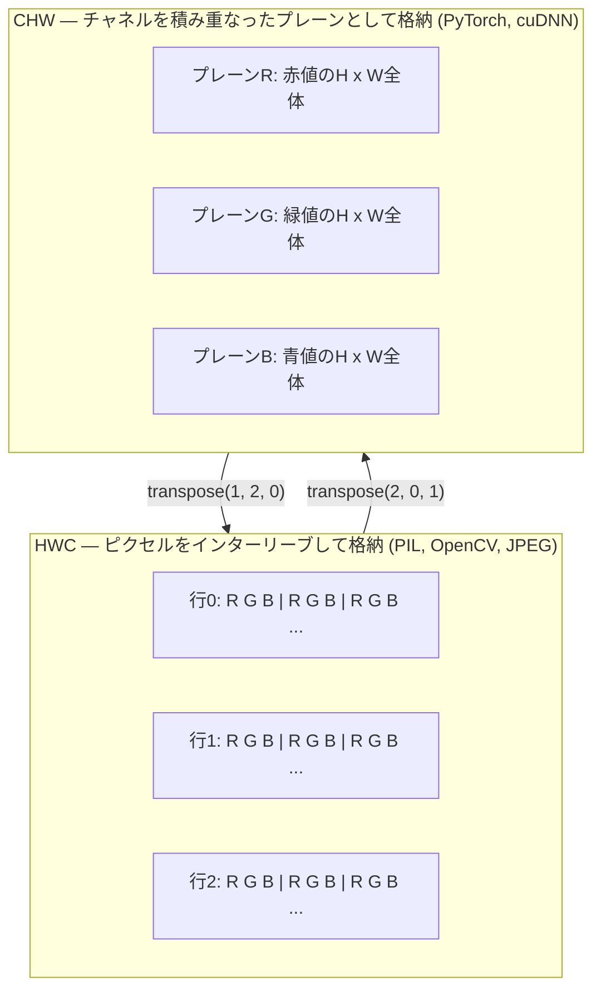

# 画像の基礎—ピクセル、チャネル、色空間

> 画像は光のサンプルのテンソルだ。あなたが使うすべてのビジョンモデルはこの一つの事実から始まる。

**タイプ:** 構築
**言語:** Python
**前提条件:** フェーズ1 レッスン12（テンソル演算）、フェーズ3 レッスン11（PyTorch入門）
**所要時間:** 約45分

## 学習目標

- 連続したシーンがピクセルに離散化される方法と、サンプリング/量子化の決定がすべての下流モデルの上限を設定する理由を説明する
- NumPy配列として画像を読み込み、スライスし、検査し、HWCとCHWレイアウトをスムーズに切り替える
- RGB、グレースケール、HSV、YCbCrを変換し、各色空間が存在する理由を説明する
- torchvisionが期待するとおりにピクセルレベルの前処理（正規化、標準化、リサイズ、チャネルファースト）を適用する

## 問題

読むすべての論文、ダウンロードするすべての事前学習済み重み、呼び出すすべてのビジョンAPIは入力の特定のエンコーディングを仮定している。モデルが`float32`を期待するところに`uint8`画像を渡すと、まだ実行される—そしてサイレントにゴミを生成する。RGBで訓練されたネットワークにBGRを与えると精度が10ポイント崩壊する。チャネルファーストを期待するモデルにチャネルラストの入力を渡すと、最初の畳み込み層が高さを特徴量チャネルとして扱う。これらはどれもエラーを投げない。メトリクスを台無しにするだけで、バグを探すのに1週間を費やすことになる。

畳み込みは、それが何をスライドしているかを知れば複雑ではない。難しいのはカメラ、JPEGデコーダー、PIL、OpenCV、torchvision、CUDAカーネルそれぞれにとって「画像」が異なることだ。各スタックには独自の軸の順序、バイト範囲、チャネル規約がある。これらを整理できないビジョンエンジニアは壊れたパイプラインを出荷する。

このレッスンは基盤を固め、フェーズの残りがその上に構築できるようにする。終わるころにはピクセルとは何か、1ピクセルあたりに3つの数値がある理由、「ImageNetの統計で正規化する」が実際に何をするか、すべての他のレッスンが仮定する2〜3のレイアウト間を移動する方法を知ることができる。

## コンセプト

### 一目でわかる完全な前処理パイプライン

すべての本番ビジョンシステムは同じ可逆変換のシーケンスだ。1ステップ間違えると、モデルは訓練時とは異なる入力を見る。

```mermaid
flowchart LR
    A["画像ファイル<br/>(JPEG/PNG)"] --> B["デコード<br/>uint8 HWC"]
    B --> C["色空間変換<br/>(RGB/BGR/YCbCr)"]
    C --> D["リサイズ<br/>短辺"]
    D --> E["中心クロップ<br/>モデルサイズ"]
    E --> F["255で除算<br/>float32 [0,1]"]
    F --> G["平均を引く<br/>stdで除算"]
    G --> H["転置<br/>HWC → CHW"]
    H --> I["バッチ化<br/>CHW → NCHW"]
    I --> J["モデル"]

    style A fill:#fef3c7,stroke:#d97706
    style J fill:#ddd6fe,stroke:#7c3aed
    style G fill:#fecaca,stroke:#dc2626
    style H fill:#bfdbfe,stroke:#2563eb
```



赤と青の2つのボックスがサイレントな失敗の80%が起きる場所：標準化の欠如と間違ったレイアウトだ。

### ピクセルは正方形ではなくサンプルだ

カメラセンサーは小さな検出器のグリッドに当たる光子を数える。各検出器は一瞬の間光を積分し、当たった光子の数に比例した電圧を発する。センサーはその電圧を整数に離散化する。1つの検出器が1つのピクセルになる。

```
連続したシーン               センサーグリッド               デジタル画像
（無限のディテール）          (H x W 検出器)               (H x W 整数)

    ~~~~~                   +--+--+--+--+--+              210 198 180 155 120
   ~   ~   ~                |  |  |  |  |  |              205 195 178 152 118
  ~ light ~      ---->      +--+--+--+--+--+     ---->    200 190 175 150 115
   ~~~~~                    |  |  |  |  |  |              195 185 170 148 112
                            +--+--+--+--+--+              188 180 165 145 108
```

このステップで2つの選択が行われ、以降のすべての上限を固定する：

- **空間サンプリング**はシーンの1度あたりの検出器の数を決定する。少なすぎると端がギザギザになる（エイリアシング）。多すぎるとストレージと計算が爆発する。
- **強度量子化**は電圧がどれほど細かくバケット化されるかを決定する。8ビットは256レベルを提供し、表示の標準だ。10、12、16ビットはより滑らかなグラデーションを提供し、医療画像、HDR、生センサーパイプラインで重要だ。

ピクセルは面積を持つ色付きの正方形ではない。単一の測定値だ。リサイズや回転を行うとき、その測定グリッドを再サンプリングしている。

### なぜ3チャネルあるか

1つの検出器は可視スペクトル全体の光子を数える—これがグレースケールだ。色を得るには、センサーが赤、緑、青のフィルターのモザイクでグリッドをカバーする。デモザイキング後、すべての空間位置に3つの整数がある：赤フィルター付き検出器、緑フィルター付き、青フィルター付きの近傍の応答。これら3つの整数がピクセルのRGBトリプレットだ。

```
メモリ内の1ピクセル:

    (R, G, B) = (210, 140, 30)   <- 赤みがかったオレンジ

H x W RGB画像:

    shape (H, W, 3)     格納形式   W個のピクセルのH行、それぞれ3値
                                    uint8の場合それぞれ[0, 255]
```

3は魔法の数字ではない。深度カメラはZチャネルを追加する。衛星は赤外線や紫外線バンドを追加する。医療スキャンはしばしば1チャネル（X線、CT）または多数（ハイパースペクトル）。チャネルの数が最後の軸であり、畳み込み層はそれを混ぜることを学習する。

### 2つのレイアウト規約：HWCとCHW

同じテンソル、2つの順序。すべてのライブラリがどちらかを選ぶ。

```
HWC (height, width, channels)           CHW (channels, height, width)

   W ->                                    H ->
  +-----+-----+-----+                     +-----+-----+
H |R G B|R G B|R G B|                   C |R R R R R R|
| +-----+-----+-----+                   | +-----+-----+
v |R G B|R G B|R G B|                   v |G G G G G G|
  +-----+-----+-----+                     +-----+-----+
                                          |B B B B B B|
                                          +-----+-----+

   PIL, OpenCV, matplotlib,              PyTorch, ほとんどのディープラーニング
   ディスク上のほぼすべての画像ファイル     フレームワーク, cuDNNカーネル
```

CHWが存在するのは畳み込みカーネルがHとWをスライドするからだ。チャネル軸を最初に保つと、各カーネルはチャネルごとに連続した2Dプレーンを見ることができ、きれいにベクトル化できる。ディスク形式はHWCを保持するのは、センサーからスキャンラインが出てくる方法と一致するからだ。

1000回入力することになる1行の変換：

```
img_chw = img_hwc.transpose(2, 0, 1)      # NumPy
img_chw = img_hwc.permute(2, 0, 1)        # PyTorchテンソル
```

メモリレイアウトの可視化：



### バイト範囲とdtype

3つの規約が支配的だ：

| 規約 | dtype | 範囲 | どこで見られるか |
|------------|-------|-------|------------------|
| 生 | `uint8` | [0, 255] | ディスク上のファイル、PIL、OpenCV出力 |
| 正規化済み | `float32` | [0.0, 1.0] | `img.astype('float32') / 255`の後 |
| 標準化済み | `float32` | 大体 [-2, +2] | 平均を引いてstdで割った後 |

畳み込みネットワークは標準化された入力で訓練された。ImageNetの統計`mean=[0.485, 0.456, 0.406]`、`std=[0.229, 0.224, 0.225]`は、[0, 1]に正規化されたピクセルで計算された、ImageNet訓練セット全体にわたる3チャネルの算術平均と標準偏差だ。標準化floatを期待するモデルに生の`uint8`を渡すことは、応用ビジョンで最も一般的なサイレントな失敗だ。

### 色空間とその存在理由

RGBはキャプチャ形式だが、モデルにとって常に最も有用な表現ではない。

```
 RGB               HSV                       YCbCr / YUV

 R 赤              H 色相（角度0-360）        Y 輝度（明るさ）
 G 緑              S 彩度（0-1）              Cb 青-黄のクロマ
 B 青              V 値/明るさ（0-1）         Cr 赤-緑のクロマ

 センサー出力に     色を明るさから分離する。   明るさを色から分離する。
 線形               色閾値処理、UIスライダー、   JPEGとほとんどのビデオ
                   シンプルなフィルターに便利。 コーデックは人間の目が
                                              輝度より色の細部に敏感でない
                                              ため、クロマチャネルをより
                                              強く圧縮する。
```

現代のCNNのほとんどはRGBを入力とする。他の色空間を使うのは：

- **HSV** — 古典的なCVコード、色ベースのセグメンテーション、ホワイトバランシング。
- **YCbCr** — JPEGの内部を読む、ビデオパイプライン、Yのみで動作する超解像モデル。
- **グレースケール** — OCR、ドキュメントモデル、色が信号ではなく邪魔な変数となるあらゆる場合。

RGBからのグレースケールは単純な平均ではなく加重和だ。人間の目は青や赤よりも緑に敏感だからだ：

```
Y = 0.299 R + 0.587 G + 0.114 B       (ITU-R BT.601、古典的な重み)
```

### アスペクト比、リサイズ、補間

すべてのモデルは固定の入力サイズを持つ（ほとんどのImageNet分類器では224x224、現代の検出器では384x384や512x512）。画像はほとんど一致しない。重要な3つのリサイズの選択：

- **短辺をリサイズしてから中心クロップ** — 標準的なImageNetのレシピ。アスペクト比を保持し、端のピクセルの一部を捨てる。
- **リサイズしてパディング** — アスペクト比とすべてのピクセルを保持し、黒いバーを追加する。検出とOCRの標準。
- **直接ターゲットにリサイズ** — 画像を引き伸ばす。安価で形状が歪むが、多くの分類タスクでは問題ない。

補間方法は新しいグリッドが古いグリッドと一致しない場合の中間ピクセルの計算方法を決定する：

```
最近傍補間       最速、ブロック状、マスク/ラベルに唯一の選択
バイリニア補間    速い、滑らか、ほとんどの画像リサイズのデフォルト
バイキュービック補間  遅い、アップスケールでシャープ
Lanczos補間     最も遅い、最高品質、最終表示に使用
```

経験則：訓練にはバイリニア、見る資産にはバイキュービックかLanczos、整数クラスIDを含むものには最近傍補間。

## 構築する

### ステップ1：画像をロードしてshapeを検査する

Pillowを使って任意のJPEGやPNGをロードし、NumPyに変換し、内容を出力する。オフラインで実行できる確定的な例として、合成的に生成する。

```python
import numpy as np
from PIL import Image

def synthetic_rgb(h=128, w=192, seed=0):
    rng = np.random.default_rng(seed)
    yy, xx = np.meshgrid(np.linspace(0, 1, h), np.linspace(0, 1, w), indexing="ij")
    r = (np.sin(xx * 6) * 0.5 + 0.5) * 255
    g = yy * 255
    b = (1 - yy) * xx * 255
    rgb = np.stack([r, g, b], axis=-1) + rng.normal(0, 6, (h, w, 3))
    return np.clip(rgb, 0, 255).astype(np.uint8)

arr = synthetic_rgb()
# またはディスクからロード:
# arr = np.asarray(Image.open("your_image.jpg").convert("RGB"))

print(f"type:   {type(arr).__name__}")
print(f"dtype:  {arr.dtype}")
print(f"shape:  {arr.shape}     # (H, W, C)")
print(f"min:    {arr.min()}")
print(f"max:    {arr.max()}")
print(f"pixel at (0, 0): {arr[0, 0]}")
```

期待される出力：`shape: (H, W, 3)`、`dtype: uint8`、範囲`[0, 255]`。これはカメラ、JPEGデコーダー、合成ジェネレーターのどれからバイトが来たとしても、ディスク上の標準的な表現だ。

### ステップ2：チャネルを分割してレイアウトを並べ替える

R、G、Bを個別に取り出し、PyTorch用にHWCからCHWに変換する。

```python
R = arr[:, :, 0]
G = arr[:, :, 1]
B = arr[:, :, 2]
print(f"R shape: {R.shape}, mean: {R.mean():.1f}")
print(f"G shape: {G.shape}, mean: {G.mean():.1f}")
print(f"B shape: {B.shape}, mean: {B.mean():.1f}")

arr_chw = arr.transpose(2, 0, 1)
print(f"\nHWC shape: {arr.shape}")
print(f"CHW shape: {arr_chw.shape}")
```

チャネルごとに1枚、3枚のグレースケールプレーン。CHWは軸を並べ替えるだけ。メモリレイアウトが許す場合、データのコピーは厳密には必要ない。

### ステップ3：グレースケールとHSVへの変換

加重和でグレースケール変換し、次に手動でRGB-to-HSV変換する。

```python
def rgb_to_grayscale(rgb):
    weights = np.array([0.299, 0.587, 0.114], dtype=np.float32)
    return (rgb.astype(np.float32) @ weights).astype(np.uint8)

def rgb_to_hsv(rgb):
    rgb_f = rgb.astype(np.float32) / 255.0
    r, g, b = rgb_f[..., 0], rgb_f[..., 1], rgb_f[..., 2]
    cmax = np.max(rgb_f, axis=-1)
    cmin = np.min(rgb_f, axis=-1)
    delta = cmax - cmin

    h = np.zeros_like(cmax)
    mask = delta > 0
    rmax = mask & (cmax == r)
    gmax = mask & (cmax == g)
    bmax = mask & (cmax == b)
    h[rmax] = ((g[rmax] - b[rmax]) / delta[rmax]) % 6
    h[gmax] = ((b[gmax] - r[gmax]) / delta[gmax]) + 2
    h[bmax] = ((r[bmax] - g[bmax]) / delta[bmax]) + 4
    h = h * 60.0

    s = np.where(cmax > 0, delta / cmax, 0)
    v = cmax
    return np.stack([h, s, v], axis=-1)

gray = rgb_to_grayscale(arr)
hsv = rgb_to_hsv(arr)
print(f"gray shape: {gray.shape}, range: [{gray.min()}, {gray.max()}]")
print(f"hsv   shape: {hsv.shape}")
print(f"hue range: [{hsv[..., 0].min():.1f}, {hsv[..., 0].max():.1f}] degrees")
print(f"sat range: [{hsv[..., 1].min():.2f}, {hsv[..., 1].max():.2f}]")
print(f"val range: [{hsv[..., 2].min():.2f}, {hsv[..., 2].max():.2f}]")
```

色相は度単位で出てくる、彩度と値は[0, 1]。これはOpenCVの`hsv_full`規約と一致する。

### ステップ4：正規化、標準化、逆変換

生のバイトから事前学習済みImageNetモデルが期待するテンソルへ、そして元に戻す。

```python
mean = np.array([0.485, 0.456, 0.406], dtype=np.float32)
std = np.array([0.229, 0.224, 0.225], dtype=np.float32)

def preprocess_imagenet(rgb_uint8):
    x = rgb_uint8.astype(np.float32) / 255.0
    x = (x - mean) / std
    x = x.transpose(2, 0, 1)
    return x

def deprocess_imagenet(chw_float32):
    x = chw_float32.transpose(1, 2, 0)
    x = x * std + mean
    x = np.clip(x * 255.0, 0, 255).astype(np.uint8)
    return x

x = preprocess_imagenet(arr)
print(f"preprocessed shape: {x.shape}     # (C, H, W)")
print(f"preprocessed dtype: {x.dtype}")
print(f"preprocessed mean per channel:  {x.mean(axis=(1, 2)).round(3)}")
print(f"preprocessed std  per channel:  {x.std(axis=(1, 2)).round(3)}")

roundtrip = deprocess_imagenet(x)
max_diff = np.abs(roundtrip.astype(int) - arr.astype(int)).max()
print(f"roundtrip max pixel diff: {max_diff}    # 0か1であるべき")
```

チャネルごとの平均はゼロに近く、stdは1に近いはずだ。前処理/後処理のペアは、すべてのtorchvisionの`transforms.Normalize`呼び出しがフードの下でやっていることと全く同じだ。

### ステップ5：3つの補間方法でリサイズする

差が見えるようにアップスケールで最近傍、バイリニア、バイキュービックを比較する。

```python
target = (arr.shape[0] * 3, arr.shape[1] * 3)

nearest = np.asarray(Image.fromarray(arr).resize(target[::-1], Image.NEAREST))
bilinear = np.asarray(Image.fromarray(arr).resize(target[::-1], Image.BILINEAR))
bicubic = np.asarray(Image.fromarray(arr).resize(target[::-1], Image.BICUBIC))

def local_roughness(x):
    gy = np.diff(x.astype(float), axis=0)
    gx = np.diff(x.astype(float), axis=1)
    return float(np.abs(gy).mean() + np.abs(gx).mean())

for name, out in [("nearest", nearest), ("bilinear", bilinear), ("bicubic", bicubic)]:
    print(f"{name:>8}  shape={out.shape}  roughness={local_roughness(out):6.2f}")
```

最近傍補間は硬いエッジを保持するため粗さのスコアが最も高い。バイリニアが最も滑らかだ。バイキュービックは中間に位置し、階段状のアーティファクトなしに知覚されるシャープさを保持する。

## 活用する

`torchvision.transforms`は上記のすべてを単一の合成可能なパイプラインにまとめる。以下のコードは`preprocess_imagenet`がするのと全く同じことを再現し、さらにリサイズとクロップを行う。

```python
import torch
from torchvision import transforms
from PIL import Image

img = Image.fromarray(synthetic_rgb(256, 256))

pipeline = transforms.Compose([
    transforms.Resize(256),
    transforms.CenterCrop(224),
    transforms.ToTensor(),
    transforms.Normalize(mean=[0.485, 0.456, 0.406], std=[0.229, 0.224, 0.225]),
])

x = pipeline(img)
print(f"tensor type:  {type(x).__name__}")
print(f"tensor dtype: {x.dtype}")
print(f"tensor shape: {tuple(x.shape)}      # (C, H, W)")
print(f"per-channel mean: {x.mean(dim=(1, 2)).tolist()}")
print(f"per-channel std:  {x.std(dim=(1, 2)).tolist()}")

batch = x.unsqueeze(0)
print(f"\nbatched shape: {tuple(batch.shape)}   # (N, C, H, W) — モデルの準備完了")
```

4つのステップ、この正確な順序で：`Resize(256)`は短辺を256にスケールする；`CenterCrop(224)`は中央から224x224のパッチを取る；`ToTensor()`は255で割りHWCをCHWに変換する；`Normalize`はImageNetの平均を引いてstdで割る。その順序を逆にするとモデルに届くものがサイレントに変わる。

## Ship It

このレッスンが生成するもの：

- `outputs/prompt-vision-preprocessing-audit.md` — 任意のモデルカードやデータセットカードを、チームが守らなければならない正確な前処理の不変条件のチェックリストに変換するプロンプト。
- `outputs/skill-image-tensor-inspector.md` — 任意の画像形状のテンソルや配列が与えられたとき、dtype、レイアウト、範囲、生か正規化済みか標準化済みかを報告するスキル。

## 演習

1. **(簡単)** OpenCV（`cv2.imread`）とPillowで同じJPEGをロードする。両方のshapeと`(0, 0)`のピクセルを出力する。チャネルの順序の違いを説明し、OpenCV配列をPillowのものと同一にする1行の変換を書く。
2. **(中程度)** `standardize(img, mean, std)`とその逆関数を書く。これらは一緒に任意のuint8画像で`roundtrip_max_diff <= 1`テストに合格しなければならない。関数はHWCの単一画像とNCHWのバッチで同じ呼び出しで機能しなければならない。
3. **(難しい)** 3チャネルのImageNet標準化テンソルを取り、RGBを1つのグレースケールチャネルに加重混合する1x1 convを通す。重みを`[0.299, 0.587, 0.114]`に初期化して凍結し、出力が手動の`rgb_to_grayscale`と浮動小数点誤差の範囲内で一致することを確認する。他にどの古典的な色空間変換が1x1 convとして書けるか？

## 用語集

| 用語 | よく言われること | 実際の意味 |
|------|----------------|----------------------|
| ピクセル | 「色付きの正方形」 | 1つのグリッド位置での光強度の1つのサンプル—色には3つの数値、グレースケールには1つ |
| チャネル | 「色」 | 画像テンソルに積み重なられた並列空間グリッドの1つ。HWCでは最後の軸、CHWでは最初の軸 |
| HWC / CHW | 「shape」 | 画像テンソルの軸の順序。ディスクとPILはHWCを使い、PyTorchとcuDNNはCHWを使う |
| 正規化 | 「画像をスケールする」 | 255で割ってピクセルを[0, 1]に置く—必要だが十分ではない |
| 標準化 | 「ゼロ中心化する」 | チャネルごとに平均を引いてstdで割り、入力分布をモデルが訓練されたものに合わせる |
| グレースケール変換 | 「チャネルを平均する」 | 人間の輝度知覚と一致する0.299/0.587/0.114の係数を持つ加重和 |
| 補間 | 「リサイズがどのようにピクセルを選ぶか」 | 新しいグリッドが古いグリッドと一致しない場合の出力値を決定するルール—ラベルには最近傍、訓練にはバイリニア、表示にはバイキュービック |
| アスペクト比 | 「幅と高さの比」 | 「リサイズしてパディング」と「リサイズして引き伸ばす」を区別する比率 |

## 参考文献

- [Charles Poynton — A Guided Tour of Color Space](https://poynton.ca/PDFs/Guided_tour.pdf) — 多くの色空間が存在する理由とそれぞれが重要な場面の最も明確な技術的解説
- [PyTorch Vision Transforms Docs](https://pytorch.org/vision/stable/transforms.html) — 本番で実際に合成する変換の完全なパイプライン
- [How JPEG Works (Colt McAnlis)](https://www.youtube.com/watch?v=F1kYBnY6mwg) — クロマサブサンプリング、DCT、JPEGがRGBではなくYCbCrをエンコードする理由の鋭い視覚的ツアー
- [ImageNet Preprocessing Conventions (torchvision models)](https://pytorch.org/vision/stable/models.html) — `mean=[0.485, 0.456, 0.406]`の真実の源と、なぜモデル動物園のすべてのモデルがそれを期待するか
