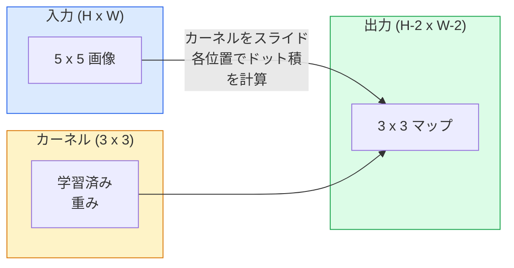
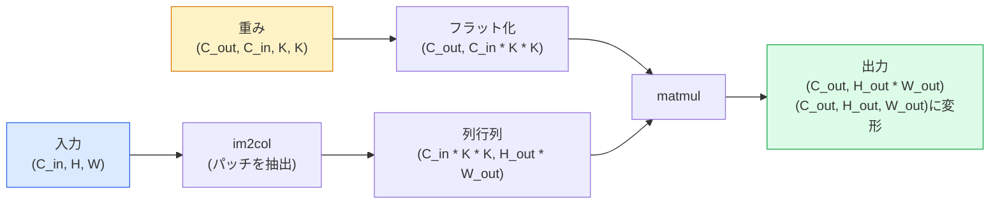

# ゼロから学ぶ畳み込み

> 畳み込みとは、画像上をスライドさせる小さな全結合層であり、すべての位置で同じ重みを共有する。

**タイプ:** 構築
**言語:** Python
**前提条件:** フェーズ3（ディープラーニング基礎）、フェーズ4 レッスン01（画像の基礎）
**所要時間:** 約75分

## 学習目標

- NumPyのみを使って2D畳み込みをゼロから実装する（ネストループ版とベクトル化された`im2col`版の両方）
- 入力サイズ、カーネルサイズ、パディング、ストライドの任意の組み合わせに対して出力の空間サイズを計算し、`(H - K + 2P) / S + 1`という公式を説明する
- カーネルを手動設計（エッジ検出、ブラー、シャープン、Sobel）し、それぞれがそのような活性化パターンを生み出す理由を説明する
- 畳み込みを積み重ねて特徴量抽出器を作り、積み重ねの深さと受容野の大きさの関係を理解する

## 問題

224x224のRGB画像に対して全結合層を使うと、1ニューロンあたり224 * 224 * 3 = 150,528個の入力重みが必要になる。1,000ユニットの単一隠れ層だけで既に1億5千万個のパラメータとなり、まだ何も有用なことを学習していない。さらに悪いことに、その層は左上の犬と右下の犬が同じパターンであることを認識できない。すべてのピクセル位置を独立したものとして扱うが、これは画像において全く正しくない。猫を3ピクセル移動させても、ネットワークがその概念を再学習する必要があってはならないのだ。

画像モデルに必要な2つの性質は、**平行移動等変性**（入力がシフトすると出力もシフトする）と**パラメータ共有**（同じ特徴量検出器があらゆる場所で動作する）だ。全結合層はそのどちらも提供しない。畳み込みはその両方を無償で提供する。

畳み込みはディープラーニングのために発明されたものではない。JPEG圧縮、PhotoshopのガウシアンブラーAnd、産業視覚でのエッジ検出、かつて作られたあらゆるオーディオフィルタを支えているのと同じ演算だ。CNNが2012年から2020年まで ImageNetを支配し続けたのは、畳み込みが「近接する値が関連しており、同じパターンがどこにでも現れる」というデータに対する正しい事前知識であるからだ。

## コンセプト

### 1つのカーネル、スライド

2D畳み込みは、カーネル（またはフィルタ）と呼ばれる小さな重み行列を取り、入力上をスライドさせながら各位置で要素ごとの積の和を計算する。その和が1つの出力ピクセルになる。



5x5入力上での3x3の具体的な例（パディングなし、ストライド1）：

```
入力 X (5 x 5):                カーネル W (3 x 3):

  1  2  0  1  2                   1  0 -1
  0  1  3  1  0                   2  0 -2
  2  1  0  2  1                   1  0 -1
  1  0  2  1  3
  2  1  1  0  1

カーネルはすべての有効な3 x 3ウィンドウをスライド。出力 Y は 3 x 3:

 Y[0,0] = sum( W * X[0:3, 0:3] )
 Y[0,1] = sum( W * X[0:3, 1:4] )
 Y[0,2] = sum( W * X[0:3, 2:5] )
 Y[1,0] = sum( W * X[1:4, 0:3] )
 ... 以下同様
```

この1つの公式——**重みの共有、局所性、スライドウィンドウ**——がアイデアのすべてだ。その他はすべて帳簿管理に過ぎない。

### 出力サイズの公式

入力の空間サイズ`H`、カーネルサイズ`K`、パディング`P`、ストライド`S`が与えられたとき：

```
H_out = floor( (H - K + 2P) / S ) + 1
```

これを暗記しよう。アーキテクチャごとに何十回も計算することになる。

| シナリオ | H | K | P | S | H_out |
|----------|---|---|---|---|-------|
| Validな畳み込み、パディングなし | 32 | 3 | 0 | 1 | 30 |
| Same畳み込み（サイズを保持） | 32 | 3 | 1 | 1 | 32 |
| 2倍ダウンサンプル | 32 | 3 | 1 | 2 | 16 |
| 2x2プーリング | 32 | 2 | 0 | 2 | 16 |
| 大きな受容野 | 32 | 7 | 3 | 2 | 16 |

「Same padding」とは、S == 1のとき H_out == H となるようにPを選ぶことを意味する。奇数のKに対しては、P = (K - 1) / 2となる。3x3カーネルが主流な理由はここにある——中心を持つ最小の奇数カーネルだからだ。

### パディング

パディングなしでは、すべての畳み込みが特徴マップを縮小させる。20回積み重ねると224x224の画像が184x184になり、境界部分の計算が無駄になり、形状の一致が必要な残差接続も複雑になる。

```
ゼロパディング (P = 1) を5 x 5入力に適用:

  0  0  0  0  0  0  0
  0  1  2  0  1  2  0
  0  0  1  3  1  0  0
  0  2  1  0  2  1  0       これでカーネルをピクセル
  0  1  0  2  1  3  0       (0, 0) に中心を置いても
  0  2  1  1  0  1  0       3行3列の値が得られる。
  0  0  0  0  0  0  0
```

実際に使うモード：`zero`（最も一般的）、`reflect`（エッジを反射させ、生成モデルで硬い境界を避ける）、`replicate`（エッジをコピー）、`circular`（折り返し、トーラス形状の問題で使用）。

### ストライド

ストライドはスライドのステップサイズだ。`stride=1`がデフォルト。`stride=2`は空間次元を半分にし、別のプーリング層なしにCNN内でダウンサンプルする古典的な方法だ——すべての現代的なアーキテクチャ（ResNet、ConvNeXt、MobileNet）は、どこかで最大プーリングの代わりにストライド付き畳み込みを使っている。

```
5 x 5入力、3 x 3カーネルでストライド1:

  開始位置: (0,0) (0,1) (0,2)        -> 出力行 0
            (1,0) (1,1) (1,2)        -> 出力行 1
            (2,0) (2,1) (2,2)        -> 出力行 2

  出力: 3 x 3

同じ入力でストライド2:

  開始位置: (0,0) (0,2)              -> 出力行 0
            (2,0) (2,2)              -> 出力行 1

  出力: 2 x 2
```

### 複数の入力チャンネル

実際の画像には3つのチャンネルがある。RGB入力に対する3x3畳み込みは実際には3x3x3のボリュームだ：入力チャンネルごとに1つの3x3スライスがある。各空間位置で、3つのスライスすべてにわたって積和を計算し、バイアスを加える。

```
入力:   (C_in,  H,  W)        3 x 5 x 5
カーネル:  (C_in,  K,  K)     3 x 3 x 3 (1つのカーネル)
出力:  (1,     H', W')        2Dマップ

C_out個の出力チャンネルを生成する層では、C_out個のカーネルを積み重ねる:

重み:  (C_out, C_in, K, K)   例: 64 x 3 x 3 x 3
出力:  (C_out, H', W')        64 x 3 x 3

パラメータ数: C_out * C_in * K * K + C_out   (+ C_outはバイアス)
```

この最後の行が、モデルを設計するときに計算するものだ。3チャンネル入力に対する64チャンネル3x3畳み込みは`64 * 3 * 3 * 3 + 64 = 1,792`個のパラメータを持つ。安価だ。

### im2col トリック

ネストループは読みやすいが遅い。GPUは大きな行列積を好む。トリック：入力の各受容野ウィンドウを大きな行列の1列にフラット化し、カーネルを行にフラット化すると、畳み込み全体が単一の行列積（matmul）になる。



すべての本番畳み込み実装は、これにキャッシュタイリングトリック（direct conv、Winograd、大きなカーネルのFFT conv）を加えたバリアントだ。im2colを理解すれば、核心を理解したことになる。

### 受容野

単一の3x3畳み込みは9つの入力ピクセルを見る。3x3畳み込みを2つ積み重ねると、2番目の層のニューロンは5x5の入力ピクセルを見る。3つの3x3畳み込みで7x7になる。一般的に：

```
L個の K x K畳み込みを積み重ねた後の受容野 (ストライド1) = 1 + L * (K - 1)

ストライドあり: 受容野は各層のストライドに従って乗法的に増大する。
```

「3x3を縦に並べる」方法（VGG、ResNet、ConvNeXt）が機能する理由は、2つの3x3畳み込みが1つの5x5畳み込みと同じ入力領域を見るが、パラメータが少なく、間に余分な非線形性があるからだ。

## 構築

### ステップ1: 配列をパディングする

最小のプリミティブから始める：H x W配列の周囲をゼロでパディングする関数。

```python
import numpy as np

def pad2d(x, p):
    if p == 0:
        return x
    h, w = x.shape[-2:]
    out = np.zeros(x.shape[:-2] + (h + 2 * p, w + 2 * p), dtype=x.dtype)
    out[..., p:p + h, p:p + w] = x
    return out

x = np.arange(9).reshape(3, 3)
print(x)
print()
print(pad2d(x, 1))
```

末尾軸トリック`x.shape[:-2]`により、同じ関数が`(H, W)`、`(C, H, W)`、`(N, C, H, W)`で変更なしに動作する。

### ステップ2: ネストループによる2D畳み込み

参照実装——低速だが明確。これが原理的に`torch.nn.functional.conv2d`が行うことだ。

```python
def conv2d_naive(x, w, b=None, stride=1, padding=0):
    c_in, h, w_in = x.shape
    c_out, c_in_w, kh, kw = w.shape
    assert c_in == c_in_w

    x_pad = pad2d(x, padding)
    h_out = (h + 2 * padding - kh) // stride + 1
    w_out = (w_in + 2 * padding - kw) // stride + 1

    out = np.zeros((c_out, h_out, w_out), dtype=np.float32)
    for oc in range(c_out):
        for i in range(h_out):
            for j in range(w_out):
                hs = i * stride
                ws = j * stride
                patch = x_pad[:, hs:hs + kh, ws:ws + kw]
                out[oc, i, j] = np.sum(patch * w[oc])
        if b is not None:
            out[oc] += b[oc]
    return out
```

4つのネストループ（出力チャンネル、行、列、さらにC_in、kh、kwにわたる暗黙の和）。これが、より高速な実装と比較する際のグラウンドトゥルースだ。

### ステップ3: 手動設計のカーネルで検証

垂直Sobelカーネルを構築し、合成ステップ画像に適用して、垂直エッジが光ることを確認する。

```python
def synthetic_step_image():
    img = np.zeros((1, 16, 16), dtype=np.float32)
    img[:, :, 8:] = 1.0
    return img

sobel_x = np.array([
    [[-1, 0, 1],
     [-2, 0, 2],
     [-1, 0, 1]]
], dtype=np.float32)[None]

x = synthetic_step_image()
y = conv2d_naive(x, sobel_x, padding=1)
print(y[0].round(1))
```

列7に大きな正の値（左から右への明度増加）が表示され、他の場所はゼロになることを期待する。その1行のprintが、数学が正しいことを確認するサニティチェックだ。

### ステップ4: im2col

入力のカーネルサイズウィンドウをすべて行列の列に変換する。`C_in=3, K=3`では、各列は27個の数値になる。

```python
def im2col(x, kh, kw, stride=1, padding=0):
    c_in, h, w = x.shape
    x_pad = pad2d(x, padding)
    h_out = (h + 2 * padding - kh) // stride + 1
    w_out = (w + 2 * padding - kw) // stride + 1

    cols = np.zeros((c_in * kh * kw, h_out * w_out), dtype=x.dtype)
    col = 0
    for i in range(h_out):
        for j in range(w_out):
            hs = i * stride
            ws = j * stride
            patch = x_pad[:, hs:hs + kh, ws:ws + kw]
            cols[:, col] = patch.reshape(-1)
            col += 1
    return cols, h_out, w_out
```

まだPythonループだが、重い処理は単一のベクトル化されたmatmulになる。

### ステップ5: im2col + matmulによる高速畳み込み

4重ループを1つの行列積に置き換える。

```python
def conv2d_im2col(x, w, b=None, stride=1, padding=0):
    c_out, c_in, kh, kw = w.shape
    cols, h_out, w_out = im2col(x, kh, kw, stride, padding)
    w_flat = w.reshape(c_out, -1)
    out = w_flat @ cols
    if b is not None:
        out += b[:, None]
    return out.reshape(c_out, h_out, w_out)
```

正確性チェック：両方の実装を実行して比較する。

```python
rng = np.random.default_rng(0)
x = rng.normal(0, 1, (3, 16, 16)).astype(np.float32)
w = rng.normal(0, 1, (8, 3, 3, 3)).astype(np.float32)
b = rng.normal(0, 1, (8,)).astype(np.float32)

y_naive = conv2d_naive(x, w, b, padding=1)
y_im2col = conv2d_im2col(x, w, b, padding=1)

print(f"max abs diff: {np.max(np.abs(y_naive - y_im2col)):.2e}")
```

`max abs diff`は約`1e-5`になるはずだ——差異はバグではなく浮動小数点の累積順序の違いだ。

### ステップ6: 手動設計カーネルのバンク

訓練前に単一の畳み込み層が表現できるものを示す5つのフィルタ。

```python
KERNELS = {
    "identity": np.array([[0, 0, 0], [0, 1, 0], [0, 0, 0]], dtype=np.float32),
    "blur_3x3": np.ones((3, 3), dtype=np.float32) / 9.0,
    "sharpen": np.array([[0, -1, 0], [-1, 5, -1], [0, -1, 0]], dtype=np.float32),
    "sobel_x": np.array([[-1, 0, 1], [-2, 0, 2], [-1, 0, 1]], dtype=np.float32),
    "sobel_y": np.array([[-1, -2, -1], [0, 0, 0], [1, 2, 1]], dtype=np.float32),
}

def apply_kernel(img2d, kernel):
    x = img2d[None].astype(np.float32)
    w = kernel[None, None]
    return conv2d_im2col(x, w, padding=1)[0]
```

グレースケール画像に適用すると、blurがソフトに、sharpenがエッジをくっきりさせ、Sobel-xが垂直エッジを、Sobel-yが水平エッジを検出する。これらはAlexNetやVGGの*最初の*訓練済み畳み込み層が学習したパターンと全く同じだ——良い画像モデルは、後でどんなタスクが来ても、エッジとブロブの検出器が必要だからだ。

## 活用

PyTorchの`nn.Conv2d`は、autograd、CUDAカーネル、cuDNN最適化を備えた同じ演算をラップする。形状のセマンティクスは同一だ。

```python
import torch
import torch.nn as nn

conv = nn.Conv2d(in_channels=3, out_channels=64, kernel_size=3, stride=1, padding=1)
print(conv)
print(f"weight shape: {tuple(conv.weight.shape)}   # (C_out, C_in, K, K)")
print(f"bias shape:   {tuple(conv.bias.shape)}")
print(f"param count:  {sum(p.numel() for p in conv.parameters())}")

x = torch.randn(8, 3, 224, 224)
y = conv(x)
print(f"\ninput  shape: {tuple(x.shape)}")
print(f"output shape: {tuple(y.shape)}")
```

`padding=1`を`padding=0`に変えると出力が222x222に下がる。`stride=1`を`stride=2`に変えると112x112に下がる。上で暗記した公式と同じだ。

## 出力

このレッスンでは以下を生成する：

- `outputs/prompt-cnn-architect.md` — 入力サイズ、パラメータ予算、ターゲット受容野を与えると、各ステップで適切なK/S/Pを持つ`Conv2d`層のスタックを設計するプロンプト。
- `outputs/skill-conv-shape-calculator.md` — ネットワーク仕様を層ごとに確認し、各ブロックの出力形状、受容野、パラメータ数を返すスキル。

## 演習

1. **(簡単)** 128x128グレースケール入力と`[Conv3x3(s=1,p=1), Conv3x3(s=2,p=1), Conv3x3(s=1,p=1), Conv3x3(s=2,p=1)]`のスタックが与えられた場合、各層での出力空間サイズと受容野を手で計算する。ダミーの畳み込みを持つPyTorchの`nn.Sequential`で検証する。
2. **(中程度)** `conv2d_naive`と`conv2d_im2col`を`groups`引数を受け付けるように拡張する。`groups=C_in=C_out`がデプスワイズ畳み込みを再現し、そのパラメータ数が`C * C * K * K`ではなく`C * K * K`になることを示す。
3. **(難しい)** `conv2d_im2col`のバックワードパスを手動で実装する：出力の勾配が与えられた場合、`x`と`w`の勾配を計算する。同じ入力と重みで`torch.autograd.grad`と比較して検証する。トリック：im2colの勾配は`col2im`であり、重複するウィンドウを累積する必要がある。

## キーワード

| 用語 | 人々が言うこと | 実際の意味 |
|------|----------------|----------------------|
| 畳み込み | 「フィルタをスライドさせる」 | 共有重みで各空間位置に適用される学習可能なドット積；数学的には相互相関だが、全員が畳み込みと呼ぶ |
| カーネル / フィルタ | 「特徴量検出器」 | 形状(C_in, K, K)の小さな重みテンソルで、入力のウィンドウとのドット積が1つの出力ピクセルを生成する |
| ストライド | 「どれだけ飛ぶか」 | 連続するカーネル配置間のステップサイズ；ストライド2で各空間次元を半分にする |
| パディング | 「エッジのゼロ」 | カーネルが境界ピクセルに中心を置けるように入力周囲に追加される値；`same`パディングは出力サイズを入力サイズと等しく保つ |
| 受容野 | 「ニューロンが見ている範囲」 | 特定の出力活性化が依存する元の入力のパッチで、深さとストライドとともに増大する |
| im2col | 「GEMMトリック」 | すべての受容野ウィンドウを列に並べ替えて畳み込みを大きな行列積にする——すべての高速畳み込みカーネルの核心 |
| デプスワイズ畳み込み | 「チャンネルごとに1つのカーネル」 | `groups == C_in`の畳み込みで、各出力チャンネルを対応する入力チャンネルのみから計算する；MobileNetとConvNeXtの骨格 |
| 平行移動等変性 | 「シフトイン、シフトアウト」 | 入力をkピクセルシフトすると出力もkピクセルシフトするという性質；共有重みで自動的に得られる |

## 参考文献

- [A guide to convolution arithmetic for deep learning (Dumoulin & Visin, 2016)](https://arxiv.org/abs/1603.07285) — あらゆるコースが密かにコピーするパディング/ストライド/ダイレーションの決定版図解
- [CS231n: Convolutional Neural Networks for Visual Recognition](https://cs231n.github.io/convolutional-networks/) — 元のim2col説明を含む標準的な講義ノート
- [The Annotated ConvNet (fast.ai)](https://nbviewer.org/github/fastai/fastbook/blob/master/13_convolutions.ipynb) — 手動畳み込みから訓練済み数字分類器までのウォークスルーノートブック
- [Receptive Field Arithmetic for CNNs (Dang Ha The Hien)](https://distill.pub/2019/computing-receptive-fields/) — 受容野計算の論文品質のインタラクティブ解説
