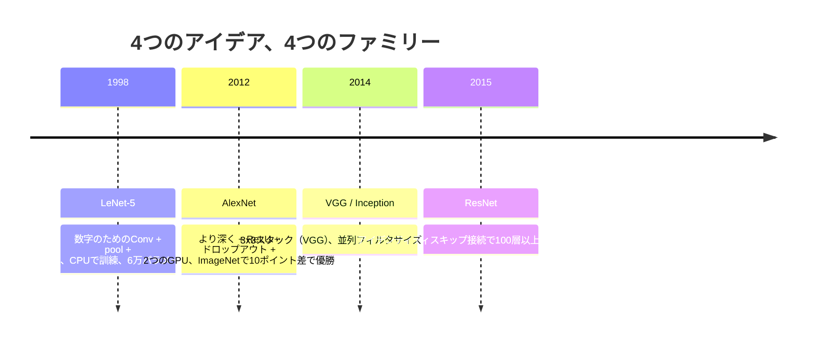
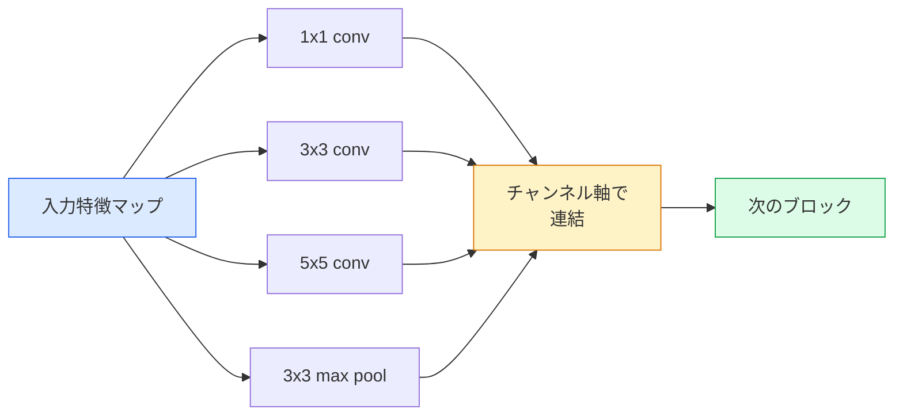
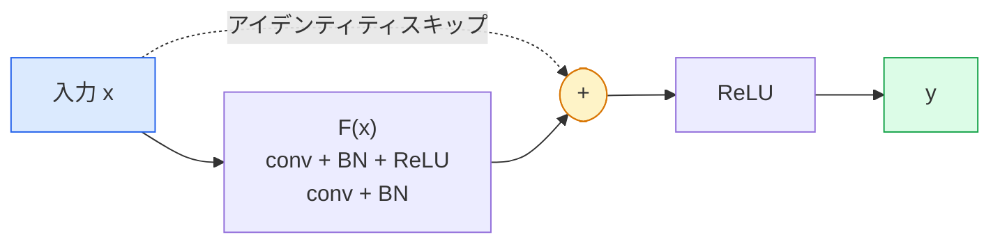

# CNN — LeNetからResNetへ

> 過去30年のすべての主要なCNNは、同じ「畳み込み→非線形性→ダウンサンプル」のレシピに、新しいアイデアを1つ追加したものだ。アイデアを順番に学ぼう。

**タイプ:** 学習 + 構築
**言語:** Python
**前提条件:** フェーズ3 レッスン11（PyTorch）、フェーズ4 レッスン01（画像の基礎）、フェーズ4 レッスン02（ゼロから学ぶ畳み込み）
**所要時間:** 約75分

## 学習目標

- LeNet-5 -> AlexNet -> VGG -> Inception -> ResNetのアーキテクチャの系譜を辿り、各ファミリーが貢献した単一の新しいアイデアを述べる
- LeNet-5、VGGスタイルブロック、ResNet BasicBlockをPyTorchで各40行以内に実装する
- 残差接続が1,000層のネットワークを訓練不可能から最先端へと変える理由を説明する
- 現代のバックボーン（ResNet-18、ResNet-50）を読み、ソースを見る前に出力形状、受容野、パラメータ数を予測する

## 問題

2011年、最優秀のImageNet分類器はトップ5精度約74%を記録した。2012年にAlexNetは85%を達成。2015年にResNetは96%を達成した。新しいデータはない。新しいGPU世代もない。その向上はアーキテクチャのアイデアから生まれた。現役のビジョンエンジニアは、どのアイデアがどの論文から来たかを知る必要がある。なぜなら、2026年に出荷するすべての本番バックボーンは、それらの同じパーツの再組み合わせだからだ——そしてアイデアは移転し続けている：グループ化畳み込みはCNNからトランスフォーマーへ、残差接続はResNetからすべてのLLMへ、バッチ正規化は拡散モデルに生き続けている。

これらのネットワークを順番に学習することは、よくある間違いからも守ってくれる：LeNetサイズのネットワークで問題が解決できるのに、利用可能な最大のモデルに手を伸ばすという間違いだ。MNISTはResNetを必要としない。各ファミリーのスケーリング曲線を知れば、どこに座るべきかがわかる。

## コンセプト

### ビジョンを変えた4つのアイデア



古典的なビジョンにおいて、これら4つのジャンプほど重要なものは他にない。

### LeNet-5 (1998)

Yann LeCunの数字認識器。60,000パラメータ。2つのconv-poolブロック、2つの全結合層、tanh活性化関数。すべてのCNNが継承するテンプレートを定義した：

```
入力 (1, 32, 32)
  conv 5x5 -> (6, 28, 28)
  avg pool 2x2 -> (6, 14, 14)
  conv 5x5 -> (16, 10, 10)
  avg pool 2x2 -> (16, 5, 5)
  flatten -> 400
  dense -> 120
  dense -> 84
  dense -> 10
```

現代のCNNと呼ばれるもの——畳み込みとダウンサンプリングが交互に現れ、小さな分類ヘッドに繋がる——は、より多くの層、より大きなチャンネル数、より良い活性化関数を持つLeNetだ。

### AlexNet (2012)

一緒にImageNetを破った3つの変化：

1. tanhの代わりに**ReLU**。勾配が消えなくなった。訓練速度が6倍に向上。
2. 全結合ヘッドの**ドロップアウト**。正則化が層になり、トリックでなくなった。
3. **深さと幅**。5つの畳み込み層、3つの全結合層、6千万パラメータ、モデルを2つに分割して2つのGPUで訓練。

論文の図2には、2つの並列ストリームとしてGPU分割が示されている。その並列性はアーキテクチャ上の洞察ではなくハードウェアの回避策だった——しかし上記の3つのアイデアは今も使われているすべてのモデルに含まれている。

### VGG (2014)

VGGが問いかけたこと：3x3畳み込みだけを使って深くしたらどうなるか？

```
スタック:   conv 3x3 -> conv 3x3 -> pool 2x2
繰り返し:  16または19の畳み込み層
```

2つの3x3畳み込みは、1つの5x5畳み込みと同じ5x5の入力領域を見るが、パラメータが少なく（2*9*C^2 = 18C^2対25*C^2）、間に余分なReLUがある。VGGはこの観察を全アーキテクチャに変えた。シンプルさ——1種類のブロックを繰り返すだけ——により、その後のすべてのリファレンスポイントとなった。

コスト：1億3千8百万パラメータ、訓練が遅く、推論も高価。

### Inception (2014年、同年)

「どのカーネルサイズを使うべきか？」というGoogleの答えは：すべて並行して使う。



各分岐が特化——チャンネル混合の1x1、局所テクスチャの3x3、大きなパターンの5x5、シフト不変特徴のプーリング——そして連結により次の層がどの分岐が有用かを選べる。Inception v1はパラメータ数を抑えるため、各分岐内でボトルネックとして1x1畳み込みを使った。

### 劣化問題

2015年までに、VGG-19は機能したがVGG-32は機能しなかった。深さは助けになるはずだったが、約20層を超えると訓練損失もテスト損失も悪化した。それは過学習ではない。勾配がすべての層を通じて乗法的に縮小するため、オプティマイザが有用な重みを見つけられなくなっているのだ。

```
単純な深いネットワーク:
  y = f_L( f_{L-1}( ... f_1(x) ... ) )

初期層に対する勾配:
  dL/dW_1 = dL/dy * df_L/df_{L-1} * ... * df_2/df_1 * df_1/dW_1

各乗法項の大きさはおよそ(重みの大きさ) * (活性化のゲイン)。
ゲイン < 1 でこれを100回積み重ねると勾配は事実上ゼロになる。
```

VGGが19層で機能したのは、同時期に発表されたバッチ正規化が活性化を適切にスケーリングしていたからだ。しかしバッチ正規化でさえ30層前後を超えた深さを救うことはできなかった。

### ResNet (2015)

He、Zhang、Ren、Sunはすべてを修正する1つの変更を提案した：

```
標準ブロック:   y = F(x)
残差ブロック:   y = F(x) + x
```

`+ x`は、層が`F(x)`をゼロに押し込むことで常に何もしないことを選べることを意味する。1,000層のResNetは今や最悪でも1層のネットワーク程度の性能を持つ。なぜなら余分なブロックには自明な逃げ道があるからだ。その保証があれば、オプティマイザは各ブロックを*わずかに*有用にすることに積極的になる——そしてわずかな有用性が100回積み重なると最先端になる。



至る所に現れる2つのブロックバリアント：

- **BasicBlock** (ResNet-18、ResNet-34)：2つの3x3畳み込み、両方をスキップ。
- **Bottleneck** (ResNet-50、-101、-152)：1x1ダウン、3x3中間、1x1アップ、3つをスキップ。チャンネル数が多い場合は安価。

スキップがダウンサンプル（stride=2）を跨ぐ必要がある場合、アイデンティティパスは形状を一致させるための1x1 stride=2畳み込みに置き換えられる。

### 残差接続がビジョンを超えて重要な理由

このアイデアは実際には画像分類についてではなかった。深いネットワークを「勾配が生き残ることを祈るだけ」から、信頼性の高い、スケーラブルなエンジニアリングツールに変えることについてだった。次のフェーズで読むすべてのトランスフォーマーは、すべてのブロックにまったく同じスキップ接続を持っている。ResNetなしにはGPTも存在しない。

## 構築

### ステップ1: LeNet-5

最小限で忠実なLeNet。tanh活性化関数、平均プーリング。現代性への唯一の譲歩は、元のガウス接続の代わりに`nn.CrossEntropyLoss`を使うことだ。

```python
import torch
import torch.nn as nn
import torch.nn.functional as F

class LeNet5(nn.Module):
    def __init__(self, num_classes=10):
        super().__init__()
        self.conv1 = nn.Conv2d(1, 6, kernel_size=5)
        self.conv2 = nn.Conv2d(6, 16, kernel_size=5)
        self.pool = nn.AvgPool2d(2)
        self.fc1 = nn.Linear(16 * 5 * 5, 120)
        self.fc2 = nn.Linear(120, 84)
        self.fc3 = nn.Linear(84, num_classes)

    def forward(self, x):
        x = self.pool(torch.tanh(self.conv1(x)))
        x = self.pool(torch.tanh(self.conv2(x)))
        x = torch.flatten(x, 1)
        x = torch.tanh(self.fc1(x))
        x = torch.tanh(self.fc2(x))
        return self.fc3(x)

net = LeNet5()
x = torch.randn(1, 1, 32, 32)
print(f"output: {net(x).shape}")
print(f"params: {sum(p.numel() for p in net.parameters()):,}")
```

期待される出力：`output: torch.Size([1, 10])`、`params: 61,706`。これが現代のビジョンを始めた数字分類器の全てだ。

### ステップ2: VGGブロック

再利用可能な1つのブロック：2つの3x3畳み込み、ReLU、バッチ正規化、最大プーリング。

```python
class VGGBlock(nn.Module):
    def __init__(self, in_c, out_c):
        super().__init__()
        self.conv1 = nn.Conv2d(in_c, out_c, kernel_size=3, padding=1)
        self.bn1 = nn.BatchNorm2d(out_c)
        self.conv2 = nn.Conv2d(out_c, out_c, kernel_size=3, padding=1)
        self.bn2 = nn.BatchNorm2d(out_c)
        self.pool = nn.MaxPool2d(2)

    def forward(self, x):
        x = F.relu(self.bn1(self.conv1(x)))
        x = F.relu(self.bn2(self.conv2(x)))
        return self.pool(x)

class MiniVGG(nn.Module):
    def __init__(self, num_classes=10):
        super().__init__()
        self.stack = nn.Sequential(
            VGGBlock(3, 32),
            VGGBlock(32, 64),
            VGGBlock(64, 128),
        )
        self.head = nn.Sequential(
            nn.AdaptiveAvgPool2d(1),
            nn.Flatten(),
            nn.Linear(128, num_classes),
        )

    def forward(self, x):
        return self.head(self.stack(x))

net = MiniVGG()
x = torch.randn(1, 3, 32, 32)
print(f"output: {net(x).shape}")
print(f"params: {sum(p.numel() for p in net.parameters()):,}")
```

CIFARサイズの入力に3つのVGGブロック、アダプティブプール、1つの線形層。約29万パラメータ。CIFAR-10には十分だ。

### ステップ3: ResNet BasicBlock

ResNet-18とResNet-34の核となるビルディングブロック。

```python
class BasicBlock(nn.Module):
    def __init__(self, in_c, out_c, stride=1):
        super().__init__()
        self.conv1 = nn.Conv2d(in_c, out_c, kernel_size=3, stride=stride, padding=1, bias=False)
        self.bn1 = nn.BatchNorm2d(out_c)
        self.conv2 = nn.Conv2d(out_c, out_c, kernel_size=3, stride=1, padding=1, bias=False)
        self.bn2 = nn.BatchNorm2d(out_c)
        if stride != 1 or in_c != out_c:
            self.shortcut = nn.Sequential(
                nn.Conv2d(in_c, out_c, kernel_size=1, stride=stride, bias=False),
                nn.BatchNorm2d(out_c),
            )
        else:
            self.shortcut = nn.Identity()

    def forward(self, x):
        out = F.relu(self.bn1(self.conv1(x)))
        out = self.bn2(self.conv2(out))
        out = out + self.shortcut(x)
        return F.relu(out)
```

畳み込み層の`bias=False`はバッチ正規化の慣習だ——BNのbetaパラメータが既にバイアスを処理しているので、畳み込みのバイアスも保持するのは無駄だ。`shortcut`はストライドまたはチャンネル数が変わる場合のみ実際の畳み込みが必要で、そうでなければ恒等変換だ。

### ステップ4: 小さなResNet

4グループのBasicBlockを積み重ねて、CIFARサイズの入力に対して機能するResNetを作る。

```python
class TinyResNet(nn.Module):
    def __init__(self, num_classes=10):
        super().__init__()
        self.stem = nn.Sequential(
            nn.Conv2d(3, 32, kernel_size=3, stride=1, padding=1, bias=False),
            nn.BatchNorm2d(32),
            nn.ReLU(inplace=True),
        )
        self.layer1 = self._make_group(32, 32, num_blocks=2, stride=1)
        self.layer2 = self._make_group(32, 64, num_blocks=2, stride=2)
        self.layer3 = self._make_group(64, 128, num_blocks=2, stride=2)
        self.layer4 = self._make_group(128, 256, num_blocks=2, stride=2)
        self.head = nn.Sequential(
            nn.AdaptiveAvgPool2d(1),
            nn.Flatten(),
            nn.Linear(256, num_classes),
        )

    def _make_group(self, in_c, out_c, num_blocks, stride):
        blocks = [BasicBlock(in_c, out_c, stride=stride)]
        for _ in range(num_blocks - 1):
            blocks.append(BasicBlock(out_c, out_c, stride=1))
        return nn.Sequential(*blocks)

    def forward(self, x):
        x = self.stem(x)
        x = self.layer1(x)
        x = self.layer2(x)
        x = self.layer3(x)
        x = self.layer4(x)
        return self.head(x)

net = TinyResNet()
x = torch.randn(1, 3, 32, 32)
print(f"output: {net(x).shape}")
print(f"params: {sum(p.numel() for p in net.parameters()):,}")
```

各2ブロックの4グループ。グループ2、3、4の先頭でストライド2。ダウンサンプルごとにチャンネル数が2倍。約280万パラメータ。ResNet-152まで綺麗にスケールする標準的なレシピだ。

### ステップ5: パラメータ対特徴量効率の比較

同じ入力を3つのネットワーク全てに通してパラメータ数を比較する。

```python
def summary(name, net, x):
    y = net(x)
    params = sum(p.numel() for p in net.parameters())
    print(f"{name:12s}  input {tuple(x.shape)} -> output {tuple(y.shape)}  params {params:>10,}")

x = torch.randn(1, 3, 32, 32)
summary("LeNet5",     LeNet5(),       torch.randn(1, 1, 32, 32))
summary("MiniVGG",    MiniVGG(),      x)
summary("TinyResNet", TinyResNet(),   x)
```

3つのモデル、3つの時代、3桁のパラメータ数の差。CIFAR-10の精度では、おおよそ：LeNet 60%、MiniVGG 89%、TinyResNet 93%（数エポック訓練後）が必要だ。

## 活用

`torchvision.models`は上記のすべての事前学習版を提供する。呼び出しシグネチャはファミリー間で同一で、これがバックボーン抽象化のまさにポイントだ。

```python
from torchvision.models import resnet18, ResNet18_Weights, vgg16, VGG16_Weights

r18 = resnet18(weights=ResNet18_Weights.IMAGENET1K_V1)
r18.eval()

print(f"ResNet-18 params: {sum(p.numel() for p in r18.parameters()):,}")
print(r18.layer1[0])
print()

v16 = vgg16(weights=VGG16_Weights.IMAGENET1K_V1)
v16.eval()
print(f"VGG-16   params: {sum(p.numel() for p in v16.parameters()):,}")
```

ResNet-18は11.7Mパラメータ。VGG-16は138M。ImageNetのトップ1精度は類似（69.8%対71.6%）。残差接続で12倍のパラメータ効率を達成。だからこそResNetバリアントは2016年からViTが登場した2021年まで支配し続け、計算がボトルネックな実世界のデプロイメントでは今も支配的だ。

転移学習では、レシピは常に同じだ：事前学習済みをロードし、バックボーンを凍結し、分類ヘッドを置き換える。

```python
for p in r18.parameters():
    p.requires_grad = False
r18.fc = nn.Linear(r18.fc.in_features, 10)
```

3行だ。これでImageNetが払ったコストで得た表現を継承した10クラスのCIFAR分類器ができた。

## 出力

このレッスンでは以下を生成する：

- `outputs/prompt-backbone-selector.md` — タスク、データセットサイズ、計算予算に基づいて適切なCNNファミリー（LeNet/VGG/ResNet/MobileNet/ConvNeXt）を選ぶプロンプト。
- `outputs/skill-residual-block-reviewer.md` — PyTorchモジュールを読み、スキップ接続の間違い（ストライド変更時のショートカット欠落、ショートカット活性化の順序、加算に対するBNの配置）を指摘するスキル。

## 演習

1. **(簡単)** `TinyResNet`のパラメータを層ごとに手で数える。`sum(p.numel() for p in net.parameters())`と比較する。パラメータ予算の大部分はどこへ行くか——畳み込み、BN、分類ヘッドか？
2. **(中程度)** Bottleneckブロック（スキップ付きの1x1 -> 3x3 -> 1x1）を実装し、CIFARのResNet-50スタイルネットワークを構築する。`TinyResNet`とパラメータ数を比較する。
3. **(難しい)** `BasicBlock`からスキップ接続を削除し、34ブロックの「プレーン」ネットワークと34ブロックのResNetをCIFAR-10で各10エポック訓練する。両方の訓練損失対エポックをプロットする。プレーンな深いネットワークが浅いツインよりも高い損失に収束するというHe et al.の図1の結果を再現する。

## キーワード

| 用語 | 人々が言うこと | 実際の意味 |
|------|----------------|----------------------|
| バックボーン | 「モデル」 | タスクヘッドに送られる特徴マップを生成する畳み込みブロックのスタック |
| 残差接続 | 「スキップ接続」 | `y = F(x) + x`；Fをゼロにすることでオプティマイザが恒等変換を学習できるようにし、任意の深さの訓練を可能にする |
| BasicBlock | 「スキップ付き2つの3x3畳み込み」 | ResNet-18/34のビルディングブロック：conv-BN-ReLU-conv-BN-add-ReLU |
| Bottleneck | 「1x1ダウン、3x3、1x1アップ」 | ResNet-50/101/152ブロック；3x3が縮小された幅で動作するため、高チャンネル数では安価 |
| 劣化問題 | 「深いほど悪い」 | 約20層の単純な畳み込み層を超えると、訓練誤差もテスト誤差も増加する；データを増やしても解決しない、残差接続で解決する |
| ステム | 「最初の層」 | 3チャンネル入力を基本特徴幅に変換する初期畳み込み；ImageNetでは通常7x7ストライド2、CIFARでは3x3ストライド1 |
| ヘッド | 「分類器」 | 最終バックボーンブロックの後の層：アダプティブプール、フラット化、線形層 |
| 転移学習 | 「事前学習済み重み」 | ImageNetで訓練されたバックボーンをロードし、タスクに対してヘッドのみをファインチューニングする |

## 参考文献

- [Deep Residual Learning for Image Recognition (He et al., 2015)](https://arxiv.org/abs/1512.03385) — ResNet論文；すべての図を研究する価値がある
- [Very Deep Convolutional Networks (Simonyan & Zisserman, 2014)](https://arxiv.org/abs/1409.1556) — VGG論文；「なぜ3x3か」についての最良の参考文献
- [ImageNet Classification with Deep CNNs (Krizhevsky et al., 2012)](https://papers.nips.cc/paper_files/paper/2012/hash/c399862d3b9d6b76c8436e924a68c45b-Abstract.html) — AlexNet；手工芸的特徴量時代を終わらせた論文
- [Going Deeper with Convolutions (Szegedy et al., 2014)](https://arxiv.org/abs/1409.4842) — Inception v1；ビジョントランスフォーマーにも現れる並列フィルタのアイデア
