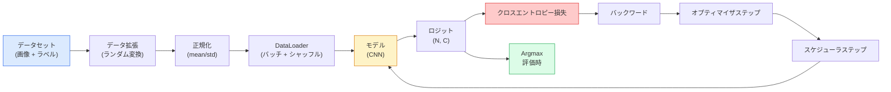

# 画像分類

> 分類器とは、ピクセルからクラスの確率分布へのマッピング関数だ。その他はすべて配管工事に過ぎない。

**タイプ:** 構築
**言語:** Python
**前提条件:** フェーズ2 レッスン09（モデル評価）、フェーズ3 レッスン10（ミニフレームワーク）、フェーズ4 レッスン03（CNN）
**所要時間:** 約75分

## 学習目標

- CIFAR-10でエンドツーエンドの画像分類パイプラインを構築する：データセット、データ拡張、モデル、訓練ループ、評価
- 各コンポーネント（データローダー、損失、オプティマイザ、スケジューラ、データ拡張）の役割を説明し、それらの1つが壊れたときに損失曲線にどう現れるかを予測する
- mixup、cutout、ラベルスムージングをゼロから実装し、それぞれをいつ追加する価値があるかを説明する
- 混同行列とクラスごとの適合率/再現率テーブルを読み、集約的な精度を超えたデータセットとモデルの失敗を診断する

## 問題

出荷されるすべてのビジョンタスクは、ある意味で画像分類に帰着する。物体検出は領域を分類する。セマンティックセグメンテーションはピクセルを分類する。検索はクラスの重心との類似度でランク付けする。分類を正しく行う——データセットループ、データ拡張ポリシー、損失、評価——というスキルは、フェーズのすべての他のタスクに転移する。

ほとんどの分類バグはモデルの中にない。パイプラインの中に存在する：壊れた正規化、シャッフルされていない訓練セット、ラベルを歪めるデータ拡張、訓練データで汚染された検証分割、エポック30以降にサイレントに発散する学習率。正しいセットアップで93%を達成できるCNNが、壊れたセットアップでは70-75%を記録し、損失曲線はずっともっともらしく見える。

このレッスンでは、バグを調査できるようにパイプライン全体を手作業で組み立てる。バグを隠す可能性のある`torchvision.datasets`は使わない。

## コンセプト

### 分類パイプライン



このループのすべての行はバグが潜む場所だ。クロスエントロピーはsoftmax出力ではなく生のロジットを取るため、損失の前に`model(x).softmax()`をかけるとサイレントに間違った勾配を計算する。データ拡張は入力のみに適用され、ラベルには適用しない——mixupは両方を混ぜるため例外だ。`optimizer.zero_grad()`はステップごとに1回行う必要があり、これを省略すると勾配が累積され、非常に不安定な学習率のように見える。これらのバグはそれぞれ、エラーを出さずに学習曲線を平らにする。

### クロスエントロピー、ロジット、softmax

分類器は画像ごとにロジットと呼ばれる`C`個の数値を生成する。softmaxを適用すると確率分布に変換される：

```
softmax(z)_i = exp(z_i) / sum_j exp(z_j)
```

クロスエントロピーは正解クラスの負の対数確率を測定する：

```
CE(z, y) = -log( softmax(z)_y )
        = -z_y + log( sum_j exp(z_j) )
```

右辺の形式は数値的に安定なものだ（log-sum-exp）。PyTorchの`nn.CrossEntropyLoss`はsoftmax + NLLを1つの操作で融合し、生のロジットを直接取る。自分でsoftmaxを先に適用するのはほぼ常にバグだ——log(softmax(softmax(z)))という無意味な量を計算することになる。

### データ拡張がなぜ機能するか

CNNは（重み共有から）平行移動に対する帰納的バイアスを持つが、クロップ、フリップ、色ジッター、オクルージョンに対する組み込みの不変性はない。それらの不変性を教える唯一の方法は、それらを行使するピクセルを見せることだ。訓練中のすべてのランダム変換は、「これら2つの画像は同じラベルを持つ；違いを無視する特徴量を学習せよ」と言うことだ。

```
元のクロップ:  「左を向いている犬」
フリップ:      「右を向いている犬」       <- 同じラベル、異なるピクセル
Rotate(+15):   「少し傾いた犬」
色ジッター:    「暖かい光の中の犬」
RandomErasing: 「パッチが欠けた犬」
```

ルール：データ拡張はラベルを保持しなければならない。数字のCutoutと回転は「6」を「9」に変えてしまう可能性がある；そのデータセットでは、より小さな回転範囲を使用し、数字特有の不変性を尊重するデータ拡張を選ぶ。

### Mixup と CutMix

通常のデータ拡張はピクセルを変換するが、ラベルをone-hotに保持する。**Mixup**と**CutMix**は両方を補間することでそれを破る。

```
Mixup:
  lambda ~ Beta(a, a)
  x = lambda * x_i + (1 - lambda) * x_j
  y = lambda * y_i + (1 - lambda) * y_j

CutMix:
  x_jのランダムな矩形をx_iに貼り付ける
  y = y_i と y_j の面積加重混合
```

なぜ効果があるか：モデルはスパイクのあるone-hotターゲットの暗記をやめ、クラス間の補間を学習する。訓練損失は上がるが、テスト精度も上がる。あらゆる分類器に対して最も安価な堅牢性アップグレードだ。

### ラベルスムージング

Mixupの従兄弟。`[0, 0, 1, 0, 0]`に対して訓練する代わりに、小さな`eps`（例：0.1）に対して`[eps/C, eps/C, 1-eps, eps/C, eps/C]`に対して訓練する。モデルが任意に急峻なロジットを生成するのを防ぎ、ほぼコストなしでキャリブレーションを改善する。PyTorch 1.10以降では`nn.CrossEntropyLoss(label_smoothing=0.1)`に組み込まれている。

### 精度を超えた評価

集約精度は不均衡を隠す。常に多数クラスを予測する90-10の2値分類器は90%のスコアを出す。実際に何が起きているかを教えるツール：

- **クラスごとの精度** — クラスごとの1つの数値；パフォーマンスが低いカテゴリをすぐに浮かび上がらせる。
- **混同行列** — C x C グリッドで行iの列jは、真のクラスiがクラスjとして予測されたカウント；対角が正解で、非対角がモデルが間違える場所だ。
- **Top-1 / Top-5** — 正解クラスが上位1または5位の予測にあるかどうか；ImageNetではTop-5が重要で、「ノリッジテリア」対「ノーフォークテリア」のようなクラスは本当に曖昧だからだ。
- **キャリブレーション (ECE)** — 0.8の信頼度の予測は80%の確率で正しいか？現代のネットワークは系統的に過信気味で、温度スケーリングやラベルスムージングで修正する。

## 構築

### ステップ1: 決定論的な合成データセット

CIFAR-10はディスクに存在する。このレッスンを再現可能で高速にするため、CIFARに似た合成データセットを構築する——32x32 RGB画像にモデルが学習しなければならないクラス特有の構造を持たせる。まったく同じパイプラインが実際のCIFAR-10で変更なく動作する。

```python
import numpy as np
import torch
from torch.utils.data import Dataset


def synthetic_cifar(num_per_class=1000, num_classes=10, seed=0):
    rng = np.random.default_rng(seed)
    X = []
    Y = []
    for c in range(num_classes):
        centre = rng.uniform(0, 1, (3,))
        freq = 2 + c
        for _ in range(num_per_class):
            yy, xx = np.meshgrid(np.linspace(0, 1, 32), np.linspace(0, 1, 32), indexing="ij")
            r = np.sin(xx * freq) * 0.5 + centre[0]
            g = np.cos(yy * freq) * 0.5 + centre[1]
            b = (xx + yy) * 0.5 * centre[2]
            img = np.stack([r, g, b], axis=-1)
            img += rng.normal(0, 0.08, img.shape)
            img = np.clip(img, 0, 1)
            X.append(img.astype(np.float32))
            Y.append(c)
    X = np.stack(X)
    Y = np.array(Y)
    idx = rng.permutation(len(X))
    return X[idx], Y[idx]


class ArrayDataset(Dataset):
    def __init__(self, X, Y, transform=None):
        self.X = X
        self.Y = Y
        self.transform = transform

    def __len__(self):
        return len(self.X)

    def __getitem__(self, i):
        img = self.X[i]
        if self.transform is not None:
            img = self.transform(img)
        img = torch.from_numpy(img).permute(2, 0, 1)
        return img, int(self.Y[i])
```

各クラスには固有のカラーパレットと周波数パターンがあり、モデルがピクセルを暗記せず信号を学習するようにガウスノイズを加える。10クラス、各1,000枚、シャッフル済み。

### ステップ2: 正規化とデータ拡張

すべてのビジョンパイプラインが持つ2つの変換。

```python
def standardize(mean, std):
    mean = np.array(mean, dtype=np.float32)
    std = np.array(std, dtype=np.float32)
    def _fn(img):
        return (img - mean) / std
    return _fn


def random_hflip(p=0.5):
    def _fn(img):
        if np.random.random() < p:
            return img[:, ::-1, :].copy()
        return img
    return _fn


def random_crop(pad=4):
    def _fn(img):
        h, w = img.shape[:2]
        padded = np.pad(img, ((pad, pad), (pad, pad), (0, 0)), mode="reflect")
        y = np.random.randint(0, 2 * pad)
        x = np.random.randint(0, 2 * pad)
        return padded[y:y + h, x:x + w, :]
    return _fn


def compose(*fns):
    def _fn(img):
        for fn in fns:
            img = fn(img)
        return img
    return _fn
```

クロップの前にゼロパディングではなくリフレクトパディングを使う。黒い境界はモデルが無駄な方法で無視するようになる信号になるからだ。

### ステップ3: Mixup

訓練ステップ内で2枚の画像と2つのラベルを混ぜる。データセットの内部ではなくフォワードパスの隣に置けるように、バッチ変換として実装する。

```python
def mixup_batch(x, y, num_classes, alpha=0.2):
    if alpha <= 0:
        return x, torch.nn.functional.one_hot(y, num_classes).float()
    lam = float(np.random.beta(alpha, alpha))
    idx = torch.randperm(x.size(0), device=x.device)
    x_mixed = lam * x + (1 - lam) * x[idx]
    y_onehot = torch.nn.functional.one_hot(y, num_classes).float()
    y_mixed = lam * y_onehot + (1 - lam) * y_onehot[idx]
    return x_mixed, y_mixed


def soft_cross_entropy(logits, soft_targets):
    log_probs = torch.log_softmax(logits, dim=-1)
    return -(soft_targets * log_probs).sum(dim=-1).mean()
```

`soft_cross_entropy`はソフトラベル分布に対するクロスエントロピーだ。ターゲットが正確にone-hotのとき、通常の場合に帰着する。

### ステップ4: 訓練ループ

完全なレシピ：データ上の1回のパス、バッチごとに1回の勾配計算、エポックごとに1回のスケジューラステップ。

```python
import torch
import torch.nn as nn
from torch.utils.data import DataLoader
from torch.optim import SGD
from torch.optim.lr_scheduler import CosineAnnealingLR

def train_one_epoch(model, loader, optimizer, device, num_classes, use_mixup=True):
    model.train()
    total, correct, loss_sum = 0, 0, 0.0
    for x, y in loader:
        x, y = x.to(device), y.to(device)
        if use_mixup:
            x_m, y_soft = mixup_batch(x, y, num_classes)
            logits = model(x_m)
            loss = soft_cross_entropy(logits, y_soft)
        else:
            logits = model(x)
            loss = nn.functional.cross_entropy(logits, y, label_smoothing=0.1)
        optimizer.zero_grad()
        loss.backward()
        optimizer.step()
        loss_sum += loss.item() * x.size(0)
        total += x.size(0)
        # mixupがオンのとき、un-mixed labelの`y`に対する訓練精度は近似値に過ぎない
        # （モデルはyではなくソフトターゲットを見た）。大まかな進捗シグナルとして扱い、
        # 実際の性能には検証精度を使う。
        with torch.no_grad():
            pred = logits.argmax(dim=-1)
            correct += (pred == y).sum().item()
    return loss_sum / total, correct / total


@torch.no_grad()
def evaluate(model, loader, device, num_classes):
    model.eval()
    total, correct = 0, 0
    loss_sum = 0.0
    cm = torch.zeros(num_classes, num_classes, dtype=torch.long)
    for x, y in loader:
        x, y = x.to(device), y.to(device)
        logits = model(x)
        loss = nn.functional.cross_entropy(logits, y)
        pred = logits.argmax(dim=-1)
        for t, p in zip(y.cpu(), pred.cpu()):
            cm[t, p] += 1
        loss_sum += loss.item() * x.size(0)
        total += x.size(0)
        correct += (pred == y).sum().item()
    return loss_sum / total, correct / total, cm
```

訓練ループを書くたびに確認する5つの不変条件：

1. 訓練前に`model.train()`、評価前に`model.eval()`——ドロップアウトとバッチ正規化の動作を切り替える。
2. `.backward()`の前に`.zero_grad()`。
3. メトリクスを累積する際に`.item()`を使い、計算グラフを生き続けさせない。
4. 評価中は`@torch.no_grad()`——メモリと時間を節約し、微妙な事故を防ぐ。
5. softmaxではなく生のロジットに対してArgmax——同じ結果で演算が1つ少ない。

### ステップ5: 組み合わせる

前のレッスンの`TinyResNet`を使い、数エポック訓練して評価する。

```python
from main import synthetic_cifar, ArrayDataset
from main import standardize, random_hflip, random_crop, compose
from main import mixup_batch, soft_cross_entropy
from main import train_one_epoch, evaluate
# TinyResNetは前のレッスン（03-cnns-lenet-to-resnet）から来る。
# 前のレッスンのコードを保存した場所に合わせてインポートパスを調整する。
from cnns_lenet_to_resnet import TinyResNet  # プレースホルダーの例

X, Y = synthetic_cifar(num_per_class=500)
split = int(0.9 * len(X))
X_train, Y_train = X[:split], Y[:split]
X_val, Y_val = X[split:], Y[split:]

mean = [0.5, 0.5, 0.5]
std = [0.25, 0.25, 0.25]
train_tf = compose(random_hflip(), random_crop(pad=4), standardize(mean, std))
eval_tf = standardize(mean, std)

train_ds = ArrayDataset(X_train, Y_train, transform=train_tf)
val_ds = ArrayDataset(X_val, Y_val, transform=eval_tf)

train_loader = DataLoader(train_ds, batch_size=128, shuffle=True, num_workers=0)
val_loader = DataLoader(val_ds, batch_size=256, shuffle=False, num_workers=0)

device = "cuda" if torch.cuda.is_available() else "cpu"
model = TinyResNet(num_classes=10).to(device)
optimizer = SGD(model.parameters(), lr=0.1, momentum=0.9, weight_decay=5e-4, nesterov=True)
scheduler = CosineAnnealingLR(optimizer, T_max=10)

for epoch in range(10):
    tr_loss, tr_acc = train_one_epoch(model, train_loader, optimizer, device, 10, use_mixup=True)
    va_loss, va_acc, _ = evaluate(model, val_loader, device, 10)
    scheduler.step()
    print(f"epoch {epoch:2d}  lr {scheduler.get_last_lr()[0]:.4f}  "
          f"train {tr_loss:.3f}/{tr_acc:.3f}  val {va_loss:.3f}/{va_acc:.3f}")
```

合成データセットでは、5エポック以内にほぼ完璧な検証精度に達する。これがポイントだ：パイプラインは正しく、モデルは学習可能なものを学習できる。データセットを実際のCIFAR-10に交換しても、同じループが変更なく約90%まで訓練できる。

### ステップ6: 混同行列を読む

精度だけではモデルがどこで失敗しているかを教えてくれない。混同行列が教えてくれる。

```python
def print_confusion(cm, labels=None):
    c = cm.shape[0]
    labels = labels or [str(i) for i in range(c)]
    print(f"{'':>6}" + "".join(f"{l:>5}" for l in labels))
    for i in range(c):
        row = cm[i].tolist()
        print(f"{labels[i]:>6}" + "".join(f"{v:>5}" for v in row))
    print()
    tp = cm.diag().float()
    fp = cm.sum(dim=0).float() - tp
    fn = cm.sum(dim=1).float() - tp
    prec = tp / (tp + fp).clamp_min(1)
    rec = tp / (tp + fn).clamp_min(1)
    f1 = 2 * prec * rec / (prec + rec).clamp_min(1e-9)
    for i in range(c):
        print(f"{labels[i]:>6}  prec {prec[i]:.3f}  rec {rec[i]:.3f}  f1 {f1[i]:.3f}")

_, _, cm = evaluate(model, val_loader, device, 10)
print_confusion(cm)
```

行が真のクラス、列が予測だ。クラス3と5の間の非対角カウントのクラスターは、モデルがその2つを混同していることを意味し、的を絞ったデータ収集やクラス特有のデータ拡張の出発点を提供する。

## 活用

`torchvision`は上記のすべてを慣用的なコンポーネントにラップしている。実際のCIFAR-10では、完全なパイプラインは4行と訓練ループで済む。

```python
from torchvision.datasets import CIFAR10
from torchvision.transforms import Compose, RandomCrop, RandomHorizontalFlip, ToTensor, Normalize

mean = (0.4914, 0.4822, 0.4465)
std = (0.2470, 0.2435, 0.2616)
train_tf = Compose([
    RandomCrop(32, padding=4, padding_mode="reflect"),
    RandomHorizontalFlip(),
    ToTensor(),
    Normalize(mean, std),
])
eval_tf = Compose([ToTensor(), Normalize(mean, std)])

train_ds = CIFAR10(root="./data", train=True,  download=True, transform=train_tf)
val_ds   = CIFAR10(root="./data", train=False, download=True, transform=eval_tf)
```

注目すべき2点：mean/stdは**データセット固有**だ——ImageNetではなくCIFAR-10訓練セットで計算されている——そしてリフレクトパッドがコミュニティのデフォルトクロップポリシーだ。ここでImageNetの統計をコピー&ペーストすると、誰かがモデルをプロファイルするまで誰も気づかない約1%の精度漏れが生じる。

## 出力

このレッスンでは以下を生成する：

- `outputs/prompt-classifier-pipeline-auditor.md` — 訓練スクリプトを上記の5つの不変条件について監査し、最初の違反を浮かび上がらせるプロンプト。
- `outputs/skill-classification-diagnostics.md` — 混同行列とクラス名のリストが与えられると、クラスごとの失敗を要約し最も効果的な単一の修正を提案するスキル。

## 演習

1. **(簡単)** 同じモデルを合成データセットで5エポック、mixupあり/なしで訓練する。両方の訓練損失と検証損失をプロットする。mixupありの訓練損失が高いにもかかわらず、検証精度が同等かそれ以上になる理由を説明する。
2. **(中程度)** Cutoutを実装する——各訓練画像のランダムな8x8の正方形をゼロにする——そして、データ拡張なし、hflip+crop、hflip+crop+cutout、hflip+crop+mixupのアブレーションを実行する。それぞれの検証精度を報告する。
3. **(難しい)** CIFAR-100パイプライン（100クラス、同じ入力サイズ）を構築し、公開された精度の1%以内でResNet-34の訓練実行を再現する。追加：3つの学習率と2つの重み減衰をスイープし、ローカルのCSVにログを記録し、最終的な混同行列の上位混同テーブルを生成する。

## キーワード

| 用語 | 人々が言うこと | 実際の意味 |
|------|----------------|----------------------|
| ロジット | 「生の出力」 | softmax適用前の画像ごとのC個の数値ベクトル；クロスエントロピーはsoftmax後の値ではなくこれを期待する |
| クロスエントロピー | 「損失」 | 正解クラスの負の対数確率；log-softmaxとNLLを1つの安定した操作で結合する |
| DataLoader | 「バッチャー」 | シャッフル、バッチング、（オプションの）マルチワーカーローディングでデータセットをラップする；訓練バグの半分の原因とされる |
| データ拡張 | 「ランダム変換」 | 訓練時にラベルを保持するピクセルレベルの変換；CNNがネイティブに持っていない不変性を教える |
| Mixup / CutMix | 「2枚の画像を混ぜる」 | 入力とラベルの両方をブレンドすることで、分類器が硬い境界の代わりに滑らかな補間を学習する |
| ラベルスムージング | 「ソフトなターゲット」 | one-hotを(1-eps, eps/(C-1), ...)に置き換える；キャリブレーションを改善し、わずかに精度を上げる |
| Top-k精度 | 「Top-5」 | 正解クラスが上位k位の予測にある；クラスが本当に曖昧なデータセットで使用 |
| 混同行列 | 「エラーの場所」 | エントリ(i, j)が真のクラスiをjとして予測した画像数のC x Cテーブル；対角が正解、非対角が修正すべき場所を示す |

## 参考文献

- [CS231n: Training Neural Networks](https://cs231n.github.io/neural-networks-3/) — 1ページで訓練パイプラインを最も明確に説明している
- [Bag of Tricks for Image Classification (He et al., 2019)](https://arxiv.org/abs/1812.01187) — ImageNetでResNetの精度を合わせて3-4%上げるすべての小さなトリック
- [mixup: Beyond Empirical Risk Minimization (Zhang et al., 2017)](https://arxiv.org/abs/1710.09412) — 元のmixup論文；3ページの理論と説得力のある実験
- [Why temperature scaling matters (Guo et al., 2017)](https://arxiv.org/abs/1706.04599) — 現代のネットワークがキャリブレーション不足であることを証明し、1つのスカラーパラメータで修正した論文
