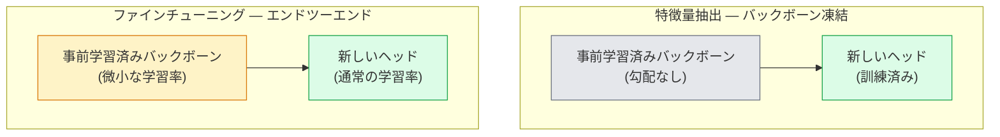

# 転移学習とファインチューニング

> 誰かがネットワークにエッジ、テクスチャ、オブジェクトパーツの見方を教えるために百万GPU時間を費やした。自分で訓練する前に、その特徴量を借りるべきだ。

**タイプ:** 構築
**言語:** Python
**前提条件:** フェーズ4 レッスン03（CNN）、フェーズ4 レッスン04（画像分類）
**所要時間:** 約75分

## 学習目標

- 特徴量抽出とファインチューニングを区別し、データセットサイズ、ドメイン距離、計算予算に基づいて適切な方を選ぶ
- 事前学習済みバックボーンをロードし、分類ヘッドを置き換えて、20行以下のコードでヘッドのみを訓練して動作するベースラインを得る
- 識別学習率を使って層を段階的に解凍し、初期の汎用的な特徴量が後期のタスク特有のものより小さい更新を受けるようにする
- 3つの一般的な失敗を診断する：解凍されたブロックの高すぎる学習率による特徴量ドリフト、小さなデータセットでのBN統計の崩壊、壊滅的な忘却

## 問題

ResNet-50をImageNetで訓練するには約2,000GPU時間かかる。出荷するすべてのタスクにそのような予算を持つチームはほとんどない。ほとんどのチームが実際に出荷するのは、数百枚または数千枚のタスク固有の画像で訓練された新しいヘッドを持つ事前学習済みバックボーンだ。

これは近道ではない。ImageNetで訓練されたCNNの最初の畳み込みブロックはエッジとGaborフィルタを学習する。次のいくつかのブロックはテクスチャと単純なモチーフを学習する。中間ブロックはオブジェクトパーツを学習する。最終ブロックは1,000のImageNetカテゴリに似た組み合わせを学習する。その階層の最初の90%は、医療画像、産業検査、衛星データ、その他すべてのビジョンタスクにほぼ変更なく転移する——自然界にはエッジとテクスチャの限られた語彙があるからだ。最後の10%が実際に訓練するものだ。

転移を正しく行うには3つのバグが待ち受けている：高すぎる学習率で事前学習済み特徴量を破壊すること、凍結しすぎて情報を枯渇させること、ネットワークの残りが学習したことのない小さなデータセットにBatchNormの実行統計がドリフトすること。このレッスンでは意図的にそれぞれを体験する。

## コンセプト

### 特徴量抽出とファインチューニング

2つのレジームで、事前学習済み特徴量をどれだけ信頼するか、どれだけデータがあるかによって選ぶ。



経験則：

| データセットサイズ | ドメイン距離 | レシピ |
|--------------|-----------------|--------|
| < 1k枚 | ImageNetに近い | バックボーン凍結、ヘッドのみ訓練 |
| 1k-10k | 近い | 最初の2-3ステージを凍結、残りをファインチューニング |
| 10k-100k | どちらでも | 識別学習率でエンドツーエンドファインチューニング |
| 100k+ | 遠い | すべてをファインチューニング；ドメインが十分遠ければスクラッチからの訓練を検討 |

「ImageNetに近い」とは大まかにオブジェクトのようなコンテンツを持つ自然なRGB写真を意味する。医療CTスキャン、上空からの衛星画像、顕微鏡写真は遠いドメインだ——特徴量はまだ役立つが、より多くの層が適応する必要がある。

### 凍結がなぜ機能するか

CNNが学習するImageNet特徴量は1,000カテゴリに特化していない。自然画像の統計に特化している：特定の向きのエッジ、テクスチャ、コントラストパターン、形状プリミティブ。これらの統計は人間が名付けられるほぼすべての視覚的ドメインにわたって安定している。だからこそ、ImageNetで訓練されてCIFAR-10でゼロショットで評価されたモデルが、バックボーンのファインチューニングなしに新しい線形ヘッドだけで80%以上の精度に達する。ヘッドは、このタスクに対してどの学習済み特徴量を重み付けするかを学習している。

### 識別学習率

解凍したとき、初期層は後期層より遅く訓練するべきだ。初期層は保持したい汎用的な特徴量をエンコードし、後期層は大きく移動させる必要があるタスク特有の構造をエンコードしている。

```
典型的なレシピ:

  ステージ0（ステム + 最初のグループ）: lr = base_lr / 100    (ほぼ固定)
  ステージ1:                             lr = base_lr / 10
  ステージ2:                             lr = base_lr / 3
  ステージ3（最後のバックボーングループ）: lr = base_lr
  ヘッド:                                lr = base_lr  (またはわずかに高い)
```

PyTorchでは、これはオプティマイザに渡されるパラメータグループのリストに過ぎない。1つのモデル、5つの学習率、余分なコードはゼロ。

### バッチ正規化問題

BN層はImageNetで計算された`running_mean`と`running_var`バッファを保持している。タスクが異なるピクセル分布を持つ場合——異なる照明、異なるセンサー、異なる色空間——それらのバッファは間違っている。好みの順に3つのオプション：

1. **BNをトレインモードでファインチューニング。** BNが他のすべてと一緒に実行統計を更新するようにする。タスクデータセットが中程度のサイズ（>= 5k枚）の場合のデフォルト選択。
2. **BNを評価モードで凍結。** ImageNetの統計を保持し、重みのみを訓練する。データセットが小さすぎてBNの移動平均がノイズになる場合に正しい。
3. **BNをGroupNormに置き換え。** 移動平均問題を完全に除去する。GPUごとのバッチサイズが小さい検出・セグメンテーションバックボーンで使用される。

これを間違えると、5-15%の精度が静かに失われる。

### ヘッド設計

分類ヘッドは1-3の線形層とオプションのドロップアウトだ。すべてのtorchvisionバックボーンには置き換えるデフォルトヘッドが付属している：

```
backbone.fc = nn.Linear(backbone.fc.in_features, num_classes)          # ResNet
backbone.classifier[1] = nn.Linear(..., num_classes)                    # EfficientNet, MobileNet
backbone.heads.head = nn.Linear(..., num_classes)                       # torchvision ViT
```

小さなデータセットでは、単一の線形層で十分なことが多い。隠れ層（Linear -> ReLU -> Dropout -> Linear）を追加すると、タスク分布がバックボーンの訓練分布からさらに遠い場合に役立つ。

### 層ごとの学習率減衰

現代のファインチューニング（BEiT、DINOv2、ViT-Bのファインチューニング）で使われる識別学習率のよりスムーズなバージョン。層をステージにグループ化する代わりに、各層にその上の層より若干小さい学習率を与える：

```
lr_layer_k = base_lr * decay^(L - k)
```

decay = 0.75、L = 12トランスフォーマーブロックの場合、最初のブロックはヘッドの学習率の`0.75^11 ≈ 0.04x`で訓練される。CNNよりもトランスフォーマーのファインチューニングで重要で、CNNではステージグループ化された学習率で通常十分だ。

### 評価すべきもの

転移学習の実行には、スクラッチ実行では追跡しない2つの数値が必要だ：

- **事前学習済みのみの精度** — バックボーンを凍結したときのヘッドの精度。これがフロアだ。
- **ファインチューニング済みの精度** — エンドツーエンドの訓練後の同じモデル。これがシーリングだ。

ファインチューニング済みが事前学習済みのみより低い場合、学習率またはBNのバグがある。常に両方を表示する。

## 構築

### ステップ1: 事前学習済みバックボーンをロードして検査する

```python
import torch
import torch.nn as nn
from torchvision.models import resnet18, ResNet18_Weights

backbone = resnet18(weights=ResNet18_Weights.IMAGENET1K_V1)
print(backbone)
print()
print("分類ヘッド:", backbone.fc)
print("特徴量次元:", backbone.fc.in_features)
```

`ResNet18`には4つのステージ（`layer1..layer4`）にステムと`fc`ヘッドがある。すべてのtorchvision分類バックボーンには類似した構造がある。

### ステップ2: 特徴量抽出 — すべてを凍結し、ヘッドを置き換える

```python
def make_feature_extractor(num_classes=10):
    model = resnet18(weights=ResNet18_Weights.IMAGENET1K_V1)
    for p in model.parameters():
        p.requires_grad = False
    model.fc = nn.Linear(model.fc.in_features, num_classes)
    return model

model = make_feature_extractor(num_classes=10)
trainable = sum(p.numel() for p in model.parameters() if p.requires_grad)
frozen = sum(p.numel() for p in model.parameters() if not p.requires_grad)
print(f"trainable: {trainable:>10,}")
print(f"frozen:    {frozen:>10,}")
```

`model.fc`のみが訓練可能だ。バックボーンは凍結された特徴量抽出器だ。

### ステップ3: 識別的ファインチューニング

ステージ固有の学習率を持つパラメータグループを構築するユーティリティ。

```python
def discriminative_param_groups(model, base_lr=1e-3, decay=0.3):
    stages = [
        ["conv1", "bn1"],
        ["layer1"],
        ["layer2"],
        ["layer3"],
        ["layer4"],
        ["fc"],
    ]
    groups = []
    for i, names in enumerate(stages):
        lr = base_lr * (decay ** (len(stages) - 1 - i))
        params = [p for n, p in model.named_parameters()
                  if any(n.startswith(k) for k in names)]
        if params:
            groups.append({"params": params, "lr": lr, "name": "_".join(names)})
    return groups

model = resnet18(weights=ResNet18_Weights.IMAGENET1K_V1)
model.fc = nn.Linear(model.fc.in_features, 10)
for p in model.parameters():
    p.requires_grad = True

groups = discriminative_param_groups(model)
for g in groups:
    print(f"{g['name']:>10s}  lr={g['lr']:.2e}  params={sum(p.numel() for p in g['params']):>8,}")
```

`decay=0.3`は各ステージが次のステージの30%のレートで訓練されることを意味する。`fc`は`base_lr`を得る、`layer4`は`0.3 * base_lr`を、`conv1`は`0.3^5 * base_lr ≈ 0.00243 * base_lr`を得る。極端に聞こえるが、経験的に機能する。

### ステップ4: バッチ正規化の処理

重みを凍結せずにBN実行統計を凍結するヘルパー。

```python
def freeze_bn_stats(model):
    for m in model.modules():
        if isinstance(m, (nn.BatchNorm1d, nn.BatchNorm2d, nn.BatchNorm3d)):
            m.eval()
            for p in m.parameters():
                p.requires_grad = False
    return model
```

各エポックの開始時に`model.train()`を呼び出した後にこれを呼び出す。`model.train()`はすべてをトレーニングモードにひっくり返す；これはBN層のみについてそれを元に戻す。

### ステップ5: 最小限のエンドツーエンドファインチューニングループ

```python
from torch.optim import SGD
from torch.utils.data import DataLoader
from torch.optim.lr_scheduler import CosineAnnealingLR
import torch.nn.functional as F

def fine_tune(model, train_loader, val_loader, device, epochs=5, base_lr=1e-3, freeze_bn=False):
    model = model.to(device)
    groups = discriminative_param_groups(model, base_lr=base_lr)
    optimizer = SGD(groups, momentum=0.9, weight_decay=1e-4, nesterov=True)
    scheduler = CosineAnnealingLR(optimizer, T_max=epochs)

    for epoch in range(epochs):
        model.train()
        if freeze_bn:
            freeze_bn_stats(model)
        tr_loss, tr_correct, tr_total = 0.0, 0, 0
        for x, y in train_loader:
            x, y = x.to(device), y.to(device)
            logits = model(x)
            loss = F.cross_entropy(logits, y, label_smoothing=0.1)
            optimizer.zero_grad()
            loss.backward()
            optimizer.step()
            tr_loss += loss.item() * x.size(0)
            tr_total += x.size(0)
            tr_correct += (logits.argmax(-1) == y).sum().item()
        scheduler.step()

        model.eval()
        va_total, va_correct = 0, 0
        with torch.no_grad():
            for x, y in val_loader:
                x, y = x.to(device), y.to(device)
                pred = model(x).argmax(-1)
                va_total += x.size(0)
                va_correct += (pred == y).sum().item()
        print(f"epoch {epoch}  train {tr_loss/tr_total:.3f}/{tr_correct/tr_total:.3f}  "
              f"val {va_correct/va_total:.3f}")
    return model
```

上記のレシピでCIFAR-10に対して5エポック実行すると、`ResNet18-IMAGENET1K_V1`がゼロショット線形プローブ精度の約70%からファインチューニング済みの約93%精度に向上する。ヘッドのみではバックボーンに触れずに約86%でプラトーになる。

### ステップ6: 段階的な解凍

終わりから始まりに向かって1エポックごとに1ステージを解凍するスケジュール。特徴量ドリフトを軽減するが、追加エポックがかかる。

```python
def progressive_unfreeze_schedule(model):
    stages = ["layer4", "layer3", "layer2", "layer1"]
    yielded = set()

    def start():
        for p in model.parameters():
            p.requires_grad = False
        for p in model.fc.parameters():
            p.requires_grad = True

    def unfreeze(epoch):
        if epoch < len(stages):
            name = stages[epoch]
            yielded.add(name)
            for n, p in model.named_parameters():
                if n.startswith(name):
                    p.requires_grad = True
            return name
        return None

    return start, unfreeze
```

最初のエポックの前に`start()`を1回呼び出す。各エポックの開始時に`unfreeze(epoch)`を呼び出す。訓練可能なパラメータのセットが変わるたびにオプティマイザを再構築する。そうしないと、凍結されたパラメータがまだキャッシュされたモーメントを保持しており、それが混乱させる。

## 活用

ほとんどの実際のタスクでは、`torchvision.models` + 3行で十分だ。上の重い機械は、ライブラリのデフォルトでは解決できない問題に遭遇したときに重要になる。

```python
from torchvision.models import resnet50, ResNet50_Weights

model = resnet50(weights=ResNet50_Weights.IMAGENET1K_V2)
model.fc = nn.Linear(model.fc.in_features, num_classes)
optimizer = torch.optim.AdamW(model.parameters(), lr=1e-4, weight_decay=1e-4)
```

本番グレードのデフォルトが他に2つある：

- `timm`は約800の事前学習済みビジョンバックボーンを一貫したAPIで提供する（`timm.create_model("resnet50", pretrained=True, num_classes=10)`）。torchvisionのzooを超えるファインチューニングには、これが標準だ。
- トランスフォーマーについては、`transformers.AutoModelForImageClassification.from_pretrained(name, num_labels=N)`がテキストモデルと同じローディングセマンティクスでViT / BEiT / DeiTを提供する。

## 出力

このレッスンでは以下を生成する：

- `outputs/prompt-fine-tune-planner.md` — データセットサイズ、ドメイン距離、計算予算に基づいて特徴量抽出vs段階的vsエンドツーエンドファインチューニングを選ぶプロンプト。
- `outputs/skill-freeze-inspector.md` — PyTorchモデルが与えられると、どのパラメータが訓練可能か、どのBatchNorm層が評価モードにあるか、オプティマイザが実際に訓練可能なパラメータを受け取っているかを報告するスキル。

## 演習

1. **(簡単)** 同じ合成CIFARデータセットで`ResNet18`を線形プローブ（バックボーン凍結）とフルファインチューニングとして訓練する。両方の精度を並べて報告する。どちらのギャップが特徴量が転移することを示し、どちらが転移しないことを示すかを説明する。
2. **(中程度)** わざとバグを導入する：ヘッドの代わりにバックボーンステージに`base_lr = 1e-1`を設定する。訓練損失が爆発することを示し、次に`discriminative_param_groups`ヘルパーを適用して回復させる。各ステージが発散し始める学習率を記録する。
3. **(難しい)** 医療画像データセット（例：CheXpert-small、PatchCamelyon、またはHAM10000）を取り、3つのレジームを比較する：(a) ImageNet事前学習済み凍結バックボーン + 線形ヘッド；(b) ImageNet事前学習済みエンドツーエンドファインチューニング；(c) スクラッチから訓練。それぞれの精度と計算コストを報告する。どのデータセットサイズでスクラッチからの訓練が競争力を持つようになるか？

## キーワード

| 用語 | 人々が言うこと | 実際の意味 |
|------|----------------|----------------------|
| 特徴量抽出 | 「凍結してヘッドを訓練」 | バックボーンパラメータを凍結し、新しい分類ヘッドのみが勾配を受け取る |
| ファインチューニング | 「エンドツーエンドで再訓練」 | すべてのパラメータが訓練可能で、通常スクラッチ訓練より大幅に小さい学習率 |
| 識別学習率 | 「初期層は学習率を小さく」 | 初期ステージの学習率が後期ステージの学習率の一部であるオプティマイザのパラメータグループ |
| 層ごとの学習率減衰 | 「スムーズな学習率勾配」 | decay^(L - k)を乗じた層ごとの学習率；トランスフォーマーのファインチューニングで一般的 |
| 壊滅的な忘却 | 「モデルがImageNetを失った」 | 高すぎる学習率が新しいタスクシグナルが学習される前に事前学習済み特徴量を上書きする |
| BN統計ドリフト | 「実行平均が間違っている」 | 現在のタスクとは異なる分布で計算されたBatchNormのrunning_mean/var；静かに精度を落とす |
| 線形プローブ | 「凍結バックボーン + 線形ヘッド」 | 事前学習済み特徴量の評価——凍結された表現上で最良の線形分類器の精度 |
| 壊滅的な崩壊 | 「すべてが1クラスを予測する」 | 特徴量を破壊するほど高い学習率でファインチューニングすると、ヘッドからの勾配が安定する前に発生する |

## 参考文献

- [How transferable are features in deep neural networks? (Yosinski et al., 2014)](https://arxiv.org/abs/1411.1792) — 層をまたいだ特徴量の転移可能性を定量化した論文
- [Universal Language Model Fine-tuning (ULMFiT, Howard & Ruder, 2018)](https://arxiv.org/abs/1801.06146) — 元の識別学習率/段階的解凍レシピ；アイデアはビジョンに直接転移する
- [timm documentation](https://huggingface.co/docs/timm) — 現代のビジョンバックボーンと、それらが訓練された正確なファインチューニングデフォルトのリファレンス
- [A Simple Framework for Linear-Probe Evaluation (Kornblith et al., 2019)](https://arxiv.org/abs/1805.08974) — 線形プローブ精度がなぜ重要か、および正しい報告方法
