# 物体検出 — ゼロから学ぶYOLO

> 検出は分類と回帰を組み合わせたもので、特徴マップのすべての位置で実行され、非最大抑制でクリーンアップされる。

**タイプ:** 構築
**言語:** Python
**前提条件:** フェーズ4 レッスン03（CNN）、フェーズ4 レッスン04（画像分類）、フェーズ4 レッスン05（転移学習）
**所要時間:** 約75分

## 学習目標

- グリッドとアンカーの設計が検出を密予測問題に変える仕組みを説明し、出力テンソルの各数値の意味を述べる
- ボックス間のIntersection-over-Unionを計算し、非最大抑制をゼロから実装する
- 事前学習済みバックボーン上に最小限のYOLOスタイルヘッドを構築する（分類、オブジェクト性、ボックス回帰損失を含む）
- 検出メトリクスの行（precision@0.5、recall、mAP@0.5、mAP@0.5:0.95）を読み、次に調整すべきパラメータを選ぶ

## 問題

分類は「この画像は犬だ」と言う。検出は「ピクセル(112, 40, 280, 210)に犬がいて、(400, 180, 560, 310)に猫がいて、フレームにはそれ以外何もない」と言う。その1つの構造的な変化——1枚の画像に1つのラベルではなく、ラベル付きボックスの可変数を予測すること——が、すべての自律システム、すべての監視製品、すべてのドキュメントレイアウトパーサー、すべての工場ビジョンラインが依存するものだ。

検出は、ビジョンのすべてのエンジニアリングトレードオフが一度に現れる場所でもある。正確なボックス（回帰ヘッド）、各ボックスの正しいクラス（分類ヘッド）、何も検出するものがないときにそれを知る（オブジェクト性スコア）、そして実際のオブジェクトごとに正確に1つの予測（非最大抑制）が必要だ。これらのいずれかを欠くと、パイプラインはオブジェクトを見逃すか、幻のボックスを報告するか、同じオブジェクトをわずかに異なる位置で15回予測する。

YOLO（You Only Look Once、Redmon et al. 2016）は、畳み込みネットの単一フォワードパスでこれをリアルタイムに実行することを可能にした設計であり、同じ構造的決定は現代の検出器（YOLOv8、YOLOv9、YOLO-NAS、RT-DETR）のバックボーンでもある。核心を学べば、すべてのバリアントが同じパーツの並べ替えになる。

## コンセプト

### 密予測としての検出

分類器は画像ごとにC個の数値を出力する。YOLOスタイルの検出器は画像ごとに`(S x S x (5 + C))`個の数値を出力する。Sは空間グリッドサイズだ。

```mermaid
flowchart LR
    IMG["入力 416x416 RGB"] --> BB["バックボーン<br/>(ResNet, DarkNet, ...)"]
    BB --> FM["特徴マップ<br/>(C_feat, 13, 13)"]
    FM --> HEAD["検出ヘッド<br/>(1x1 畳み込み)"]
    HEAD --> OUT["出力テンソル<br/>(13, 13, B * (5 + C))"]
    OUT --> DEC["デコード<br/>(グリッド + sigmoid + exp)"]
    DEC --> NMS["非最大抑制"]
    NMS --> RESULT["最終ボックス"]

    style IMG fill:#dbeafe,stroke:#2563eb
    style HEAD fill:#fef3c7,stroke:#d97706
    style NMS fill:#fecaca,stroke:#dc2626
    style RESULT fill:#dcfce7,stroke:#16a34a
```



`S * S`グリッドセルのそれぞれが`B`個のボックスを予測する。各ボックスについて：

- 4つの数値がジオメトリを記述：`tx, ty, tw, th`。
- 1つの数値がオブジェクト性スコア：「このセルの中心にオブジェクトがあるか？」
- C個の数値がクラス確率。

セルごとの合計：`B * (5 + C)`。`S=13, B=2, C=20`のVOCでは、セルごとに50個の数値。

### グリッドとアンカーの理由

単純な回帰では、各オブジェクトの`(x, y, w, h)`を絶対座標として予測する。それは画像を平行移動させてもすべての予測が同じ量だけ平行移動してはならないため、畳み込みネットワークには難しい——各オブジェクトは空間的に固定されている。グリッドはこれに答える：各グラウンドトゥルースボックスをその中心が入るグリッドセルに割り当てる；そのセルのみがそのオブジェクトに責任を持つ。

アンカーは2番目の問題に対処する。3x3の畳み込みは16ピクセルの受容野特徴セルから500ピクセル幅のボックスを簡単に回帰できない。代わりに、セルごとに`B`個の事前ボックス形状（アンカー）を事前定義し、各アンカーからの小さなデルタを予測する。モデルは適切なアンカーを選択してそれを微調整することを学習する。

```
アンカーボックスの事前形状（416x416入力の例）:

  小:   (30,  60)
  中:  (75,  170)
  大:   (200, 380)

各グリッドセルで、すべてのアンカーが (tx, ty, tw, th, obj, c_1, ..., c_C) を出力する。
```

現代の検出器はFPNと解像度ごとに異なるアンカーセットを使うことが多い——浅い高解像度マップに小さなアンカー、深い低解像度マップに大きなアンカー。同じアイデアで、よりスケールが多い。

### 予測のデコード

生の`tx, ty, tw, th`はボックス座標ではなく、プロットする前に変換が必要な回帰ターゲットだ：

```
中心 x  = (sigmoid(tx) + cell_x) * stride
中心 y  = (sigmoid(ty) + cell_y) * stride
幅     = anchor_w * exp(tw)
高さ    = anchor_h * exp(th)
```

`sigmoid`は中心オフセットをセル内に保つ。`exp`はアンカーから符号の反転なしに幅を自由にスケールさせる。`stride`はグリッド座標をピクセルに戻す。このデコードステップはv2以降のすべてのYOLOバージョンで同じだ。

### IoU

2つのボックス間の汎用的な類似度メトリクス：

```
IoU(A, B) = area(A intersect B) / area(A union B)
```

IoU = 1は同一を意味し；IoU = 0は重複なしを意味する。予測とグラウンドトゥルースボックス間のIoUは、予測が真陽性としてカウントされるかどうかを決定する（通常IoU >= 0.5）。2つの予測間のIoUはNMSが重複排除に使うものだ。

### 非最大抑制

隣接するアンカーで訓練された畳み込みネットワークは、同じオブジェクトに対して重複するボックスを予測することが多い。NMSは最高信頼度の予測を保持し、閾値を超えるIoUを持つ他の予測を削除する。

```
NMS(boxes, scores, iou_threshold):
    スコア降順でボックスをソート
    keep = []
    ボックスが空でない間:
        トップスコアのボックスを選び、keepに追加
        選んだボックスにIoU > iou_thresholdのすべてのボックスを削除
    keepを返す
```

典型的な閾値：物体検出で0.45。最近の検出器は標準NMSを`soft-NMS`、`DIoU-NMS`に置き換えたり、抑制を直接学習したり（RT-DETR）するが、構造的な目的は同じだ。

### 損失

YOLO損失は重みで加算された3つの損失だ：

```
L = lambda_coord * L_box(pred, target, where obj=1)
  + lambda_obj   * L_obj(pred, 1,     where obj=1)
  + lambda_noobj * L_obj(pred, 0,     where obj=0)
  + lambda_cls   * L_cls(pred, target, where obj=1)
```

オブジェクトを含むセルのみがボックス回帰と分類損失に貢献する。オブジェクトのないセルはオブジェクト性損失にのみ貢献する（モデルに沈黙するよう教える）。`lambda_noobj`は通常小さい（約0.5）。セルの大多数が空であり、そうでなければ総損失を支配してしまうからだ。

現代のバリアントはMSEボックス損失をCIoU / DIoU（IoUを直接最適化）に交換し、クラス不均衡にFocal lossを使い、オブジェクト性をquality focal lossでバランスさせる。3コンポーネント構造は変わらない。

### 検出メトリクス

精度は検出に転移しない。転移する4つの数値：

- **Precision@IoU=0.5** — 陽性としてカウントされた予測のうち、実際に正しいものの割合。
- **Recall@IoU=0.5** — 実際のオブジェクトのうち、見つけた割合。
- **AP@0.5** — IoU閾値0.5での適合率-再現率曲線の面積；クラスごとの1つの数値。
- **mAP@0.5:0.95** — IoU閾値0.5、0.55、...、0.95にわたるAPの平均。COCOメトリクス；最も厳格で最も情報が多い。

4つすべてを報告する。mAP@0.5は強いがmAP@0.5:0.95が弱い検出器は、大まかに局所化しているが精密ではない；より良いボックス回帰損失で修正する。適合率が高く再現率が低い検出器は保守的すぎる；信頼度閾値を下げるかオブジェクト性の重みを増やす。

## 構築

### ステップ1: IoU

このレッスン全体の主力。`(x1, y1, x2, y2)`形式の2つのボックス配列で動作する。

```python
import numpy as np

def box_iou(boxes_a, boxes_b):
    ax1, ay1, ax2, ay2 = boxes_a[:, 0], boxes_a[:, 1], boxes_a[:, 2], boxes_a[:, 3]
    bx1, by1, bx2, by2 = boxes_b[:, 0], boxes_b[:, 1], boxes_b[:, 2], boxes_b[:, 3]

    inter_x1 = np.maximum(ax1[:, None], bx1[None, :])
    inter_y1 = np.maximum(ay1[:, None], by1[None, :])
    inter_x2 = np.minimum(ax2[:, None], bx2[None, :])
    inter_y2 = np.minimum(ay2[:, None], by2[None, :])

    inter_w = np.clip(inter_x2 - inter_x1, 0, None)
    inter_h = np.clip(inter_y2 - inter_y1, 0, None)
    inter = inter_w * inter_h

    area_a = (ax2 - ax1) * (ay2 - ay1)
    area_b = (bx2 - bx1) * (by2 - by1)
    union = area_a[:, None] + area_b[None, :] - inter
    return inter / np.clip(union, 1e-8, None)
```

ペアワイズIoUの`(N_a, N_b)`行列を返す。一方の配列を形状`(1, 4)`にすることで単一のグラウンドトゥルースボックスに対して使える。

### ステップ2: 非最大抑制

```python
def nms(boxes, scores, iou_threshold=0.45):
    order = np.argsort(-scores)
    keep = []
    while len(order) > 0:
        i = order[0]
        keep.append(i)
        if len(order) == 1:
            break
        rest = order[1:]
        ious = box_iou(boxes[[i]], boxes[rest])[0]
        order = rest[ious <= iou_threshold]
    return np.array(keep, dtype=np.int64)
```

決定論的で、ソートから`O(N log N)`、同一の入力では`torchvision.ops.nms`の動作と一致する。

### ステップ3: ボックスのエンコードとデコード

ピクセル座標とネットワークが実際に回帰する`(tx, ty, tw, th)`ターゲット間を変換する。

```python
def encode(box_xyxy, cell_x, cell_y, stride, anchor_wh):
    x1, y1, x2, y2 = box_xyxy
    cx = 0.5 * (x1 + x2)
    cy = 0.5 * (y1 + y2)
    w = x2 - x1
    h = y2 - y1
    tx = cx / stride - cell_x
    ty = cy / stride - cell_y
    tw = np.log(w / anchor_wh[0] + 1e-8)
    th = np.log(h / anchor_wh[1] + 1e-8)
    return np.array([tx, ty, tw, th])


def decode(tx_ty_tw_th, cell_x, cell_y, stride, anchor_wh):
    tx, ty, tw, th = tx_ty_tw_th
    cx = (sigmoid(tx) + cell_x) * stride
    cy = (sigmoid(ty) + cell_y) * stride
    w = anchor_wh[0] * np.exp(tw)
    h = anchor_wh[1] * np.exp(th)
    return np.array([cx - w / 2, cy - h / 2, cx + w / 2, cy + h / 2])


def sigmoid(x):
    return 1.0 / (1.0 + np.exp(-x))
```

テスト：ボックスをエンコードしてデコード——元のボックスに非常に近いものが得られるはずだ（`tx`がpost-sigmoid範囲にないとき、sigmoidの逆が完全に可逆でないため）。

### ステップ4: 最小限のYOLOヘッド

特徴マップ上の1x1畳み込みで、`(B, S, S, num_anchors, 5 + C)`に形状変換する。

```python
import torch
import torch.nn as nn

class YOLOHead(nn.Module):
    def __init__(self, in_c, num_anchors, num_classes):
        super().__init__()
        self.num_anchors = num_anchors
        self.num_classes = num_classes
        self.conv = nn.Conv2d(in_c, num_anchors * (5 + num_classes), kernel_size=1)

    def forward(self, x):
        n, _, h, w = x.shape
        y = self.conv(x)
        y = y.view(n, self.num_anchors, 5 + self.num_classes, h, w)
        y = y.permute(0, 3, 4, 1, 2).contiguous()
        return y
```

出力形状：`(N, H, W, num_anchors, 5 + C)`。最後の次元は`[tx, ty, tw, th, obj, cls_0, ..., cls_{C-1}]`を保持する。

### ステップ5: グラウンドトゥルースの割り当て

各グラウンドトゥルースボックスについて、どの`(セル, アンカー)`が責任を持つかを決定する。

```python
def assign_targets(boxes_xyxy, classes, anchors, stride, grid_size, num_classes):
    num_anchors = len(anchors)
    target = np.zeros((grid_size, grid_size, num_anchors, 5 + num_classes), dtype=np.float32)
    has_obj = np.zeros((grid_size, grid_size, num_anchors), dtype=bool)

    for box, cls in zip(boxes_xyxy, classes):
        x1, y1, x2, y2 = box
        cx, cy = 0.5 * (x1 + x2), 0.5 * (y1 + y2)
        gx, gy = int(cx / stride), int(cy / stride)
        bw, bh = x2 - x1, y2 - y1

        ious = np.array([
            (min(bw, aw) * min(bh, ah)) / (bw * bh + aw * ah - min(bw, aw) * min(bh, ah))
            for aw, ah in anchors
        ])
        best = int(np.argmax(ious))
        aw, ah = anchors[best]

        target[gy, gx, best, 0] = cx / stride - gx
        target[gy, gx, best, 1] = cy / stride - gy
        target[gy, gx, best, 2] = np.log(bw / aw + 1e-8)
        target[gy, gx, best, 3] = np.log(bh / ah + 1e-8)
        target[gy, gx, best, 4] = 1.0
        target[gy, gx, best, 5 + cls] = 1.0
        has_obj[gy, gx, best] = True
    return target, has_obj
```

アンカー選択は「グラウンドトゥルースとの最良の形状IoU」——YOLOv2/v3の割り当てと一致する安価な代理だ。v5以降はより洗練された戦略（タスクアラインドマッチング、ダイナミックk）を使うが、同じアイデアを洗練させている。

### ステップ6: 3つの損失

```python
def yolo_loss(pred, target, has_obj, lambda_coord=5.0, lambda_obj=1.0, lambda_noobj=0.5, lambda_cls=1.0):
    has_obj_t = torch.from_numpy(has_obj).bool()
    target_t = torch.from_numpy(target).float()

    # ボックス回帰損失：オブジェクトを持つセルのみ
    box_pred = pred[..., :4][has_obj_t]
    box_true = target_t[..., :4][has_obj_t]
    loss_box = torch.nn.functional.mse_loss(box_pred, box_true, reduction="sum")

    # オブジェクト性損失
    obj_pred = pred[..., 4]
    obj_true = target_t[..., 4]
    loss_obj_pos = torch.nn.functional.binary_cross_entropy_with_logits(
        obj_pred[has_obj_t], obj_true[has_obj_t], reduction="sum")
    loss_obj_neg = torch.nn.functional.binary_cross_entropy_with_logits(
        obj_pred[~has_obj_t], obj_true[~has_obj_t], reduction="sum")

    # オブジェクトを持つセルの分類損失
    cls_pred = pred[..., 5:][has_obj_t]
    cls_true = target_t[..., 5:][has_obj_t]
    loss_cls = torch.nn.functional.binary_cross_entropy_with_logits(
        cls_pred, cls_true, reduction="sum")

    total = (lambda_coord * loss_box
             + lambda_obj * loss_obj_pos
             + lambda_noobj * loss_obj_neg
             + lambda_cls * loss_cls)
    return total, {"box": loss_box.item(), "obj_pos": loss_obj_pos.item(),
                   "obj_neg": loss_obj_neg.item(), "cls": loss_cls.item()}
```

すべてのYOLOチュートリアルがハードコードするかスイープする5つのハイパーパラメータ。比率が重要：`lambda_coord=5, lambda_noobj=0.5`は元のYOLOv1論文を反映し、合理的なデフォルトとして今も機能する。

### ステップ7: 推論パイプライン

生のヘッド出力をデコードし、sigmoid/expを適用し、オブジェクト性で閾値を設け、NMSを適用する。

```python
def postprocess(pred_tensor, anchors, stride, img_size, conf_threshold=0.25, iou_threshold=0.45):
    pred = pred_tensor.detach().cpu().numpy()
    grid_h, grid_w = pred.shape[1], pred.shape[2]
    num_anchors = len(anchors)

    boxes, scores, classes = [], [], []
    for gy in range(grid_h):
        for gx in range(grid_w):
            for a in range(num_anchors):
                tx, ty, tw, th, obj, *cls = pred[0, gy, gx, a]
                score = sigmoid(obj) * sigmoid(np.array(cls)).max()
                if score < conf_threshold:
                    continue
                cls_idx = int(np.argmax(cls))
                cx = (sigmoid(tx) + gx) * stride
                cy = (sigmoid(ty) + gy) * stride
                w = anchors[a][0] * np.exp(tw)
                h = anchors[a][1] * np.exp(th)
                boxes.append([cx - w / 2, cy - h / 2, cx + w / 2, cy + h / 2])
                scores.append(float(score))
                classes.append(cls_idx)

    if not boxes:
        return np.zeros((0, 4)), np.zeros((0,)), np.zeros((0,), dtype=int)
    boxes = np.array(boxes)
    scores = np.array(scores)
    classes = np.array(classes)
    keep = nms(boxes, scores, iou_threshold)
    return boxes[keep], scores[keep], classes[keep]
```

これが完全な評価パス：ヘッド -> デコード -> 閾値 -> NMS。

## 活用

`torchvision.models.detection`は同じ概念構造を持つ本番検出器を提供している。事前学習済みモデルのロードは3行だ。

```python
import torch
from torchvision.models.detection import fasterrcnn_resnet50_fpn_v2

model = fasterrcnn_resnet50_fpn_v2(weights="DEFAULT")
model.eval()
with torch.no_grad():
    predictions = model([torch.randn(3, 400, 600)])
print(predictions[0].keys())
print(f"boxes:  {predictions[0]['boxes'].shape}")
print(f"scores: {predictions[0]['scores'].shape}")
print(f"labels: {predictions[0]['labels'].shape}")
```

リアルタイム推論パイプラインでは、`ultralytics`（YOLOv8/v9）が標準だ：`from ultralytics import YOLO; model = YOLO('yolov8n.pt'); model(img)`。モデルはデコードとNMSを内部で処理し、上で構築したのと同じ`boxes / scores / labels`トリプルを返す。

## 出力

このレッスンでは以下を生成する：

- `outputs/prompt-detection-metric-reader.md` — `precision, recall, AP, mAP@0.5:0.95`の行を1行の診断と最も有用な次の実験に変換するプロンプト。
- `outputs/skill-anchor-designer.md` — グラウンドトゥルースボックスのデータセットが与えられると、`(w, h)`に対してk-meansを実行し、FPNレベルごとのアンカーセットと適切なアンカー数を選択するための網羅率統計を返すスキル。

## 演習

1. **(簡単)** `box_iou`を実装し、1,000個のランダムなボックスペアで`torchvision.ops.box_iou`に対して実行する。最大絶対差が`1e-6`以下であることを確認する。
2. **(中程度)** `yolo_loss`をMSEの代わりに`CIoU`ボックス損失を使うバージョンに移植する。100枚の合成画像データセットで、CIoUが同じエポック数でMSEよりも良い最終mAP@0.5:0.95に収束することを示す。
3. **(難しい)** マルチスケール推論を実装する：同じ画像を3つの解像度でモデルに通し、ボックス予測を統合し、最後に単一のNMSを実行する。保留セットでシングルスケール推論に対するmAPの向上を測定する。

## キーワード

| 用語 | 人々が言うこと | 実際の意味 |
|------|----------------|----------------------|
| アンカー | 「ボックスの事前形状」 | 各グリッドセルで事前定義されたボックス形状で、ネットワークは絶対座標ではなくこれからのデルタを予測する |
| IoU | 「重複」 | 2つのボックスのIntersection-over-union；検出における汎用的な類似度尺度 |
| NMS | 「重複排除」 | 最高スコアの予測を保持し、閾値を超えて重複するものを削除する貪欲アルゴリズム |
| オブジェクト性 | 「ここに何かあるか」 | アンカーごと、セルごとのスカラーで、そのセルを中心にオブジェクトがあるかどうかを予測する |
| グリッドストライド | 「ダウンサンプル係数」 | グリッドセルごとのピクセル数；13グリッドヘッドの416px入力はストライド32 |
| mAP | 「平均適合率」 | 適合率-再現率曲線下面積の平均、クラスを超えて（COCOでは）IoU閾値を超えて平均 |
| AP@0.5 | 「PASCAL VOC AP」 | IoU閾値0.5での平均適合率；メトリクスの寛容なバージョン |
| mAP@0.5:0.95 | 「COCO AP」 | IoU閾値0.5〜0.95（ステップ0.05）にわたる平均；厳格なバージョンで現在のコミュニティ標準 |

## 参考文献

- [YOLOv1: You Only Look Once (Redmon et al., 2016)](https://arxiv.org/abs/1506.02640) — 創設論文；それ以降のすべてのYOLOはこの構造の洗練
- [YOLOv3 (Redmon & Farhadi, 2018)](https://arxiv.org/abs/1804.02767) — マルチスケールFPNスタイルヘッドを導入した論文；最も明確な図
- [Ultralytics YOLOv8 docs](https://docs.ultralytics.com) — 現在の本番リファレンス；データセット形式、データ拡張、訓練レシピを網羅
- [The Illustrated Guide to Object Detection (Jonathan Hui)](https://jonathan-hui.medium.com/object-detection-series-24d03a12f904) — 完全な検出器動物園の最良のわかりやすい解説；DETR、RetinaNet、FCOS、YOLOの関係を理解するのに非常に価値がある
