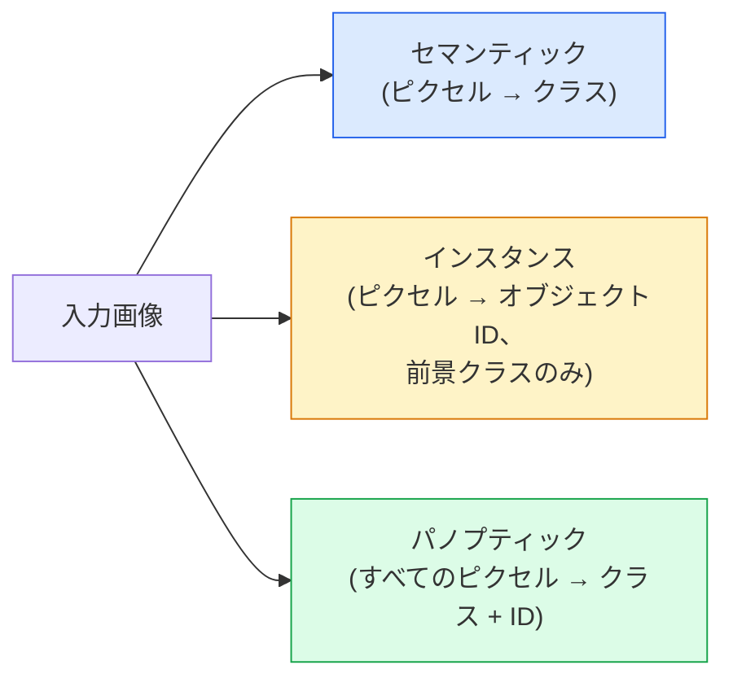
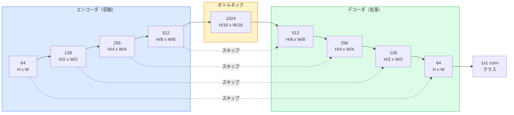

# セマンティックセグメンテーション — U-Net

> セグメンテーションとはすべてのピクセルで分類を行うことだ。U-Netは、ダウンサンプリングエンコーダとアップサンプリングデコーダをペアにし、それらの間にスキップ接続を配線することでそれを機能させる。

**タイプ:** 構築
**言語:** Python
**前提条件:** フェーズ4 レッスン03（CNN）、フェーズ4 レッスン04（画像分類）
**所要時間:** 約75分

## 学習目標

- セマンティック、インスタンス、パノプティックセグメンテーションを区別し、与えられた問題に対して適切なタスクを選ぶ
- エンコーダブロック、ボトルネック、転置畳み込みを持つデコーダ、スキップ接続を含むU-NetをPyTorchでゼロから構築する
- ピクセルワイズクロスエントロピー、Dice損失、および医療・産業セグメンテーションの現在のデフォルトである複合損失を実装する
- クラスごとのIoUとDiceメトリクスを読み、悪いスコアが小さなオブジェクトの再現率、境界精度、クラス不均衡のどれから来るかを診断する

## 問題

分類は画像ごとに1つのラベルを出力する。検出は画像ごとに少数のボックスを出力する。セグメンテーションはピクセルごとに1つのラベルを出力する。`H x W`サイズの入力では、出力は`H x W`（セマンティック）または`H x W x N_instances`（インスタンス）のテンソルだ。画像ごとに1つではなく、何百万もの予測がある。

セグメンテーションの構造が、ほぼすべての密予測ビジョン製品を動かす理由だ：医療画像（腫瘍マスク）、自動運転（道路、車線、障害物）、衛星（建物のフットプリント、作物の境界）、文書解析（レイアウトゾーン）、ロボティクス（把持可能な領域）。これらのタスクのどれもオブジェクトの周りにボックスを置くことでは解決できない；正確なシルエットが必要だ。

セグメンテーションのアーキテクチャ上の問題は単純に述べられ、単純には解決できない：ネットワークが画像のグローバルコンテキスト（これはどんな種類のシーンか）とローカルピクセルの詳細（正確にどのピクセルが道路でどれが歩道か）を同時に見る必要がある。標準的なCNNはコンテキストを得るために空間的に圧縮し、その詳細を捨てる。U-Netは両方を得た設計だった。

## コンセプト

### セマンティックvsインスタンスvsパノプティック



- **セマンティック**は「このピクセルは道路、あのピクセルは車だ」と言う。隣接する2台の車は1つのブロブに溶け込む。
- **インスタンス**は「このピクセルは車#3、あのピクセルは車#5だ」と言う。背景のもの（スカイ、道路、草）は無視する。
- **パノプティック**は両方を統合する：すべてのピクセルがクラスラベルを得て、すべてのインスタンスが一意のIDを得て、stuffとthingの両方がセグメンテーションされる。

このレッスンはセマンティックを扱う。次のレッスン（Mask R-CNN）はインスタンスを扱う。

### U-Netの形状



エンコーダは空間解像度を4回半減させてチャンネルを2倍にする。デコーダは逆：空間解像度を4回2倍にしてチャンネルを半減させる。スキップ接続はすべての解像度でエンコーダの一致する特徴量とデコーダの特徴量を連結する。最終1x1畳み込みは完全な解像度で`64 -> num_classes`にマップする。

スキップ接続が必要な理由：デコーダがピクセルレベルの予測を出力しようとするとき、既に小さな特徴マップしか見ていない。スキップなしでは、その情報がエンコーダで圧縮されて失われているため、エッジを正確に局所化できない。スキップ接続は、エンコーダが下るときに計算した高解像度の特徴マップをデコーダに渡す。

### 転置畳み込みvsバイリニアアップサンプル

デコーダは空間次元を拡大する必要がある。2つのオプション：

- **転置畳み込み** (`nn.ConvTranspose2d`) — 学習可能なアップサンプル。歴史的なU-Netのデフォルト。ストライドとカーネルサイズが均等に割り切れない場合、チェッカーボードアーティファクトが発生する可能性がある。
- **バイリニアアップサンプル + 3x3畳み込み** — スムーズなアップサンプルに続いて畳み込み。アーティファクトが少なく、パラメータも少なく、現代のデフォルトになっている。

両方が実際に使われる。最初のU-Netにはバイリニアの方が安全だ。

### ピクセルグリッド上のクロスエントロピー

Cクラスのセマンティックセグメンテーションでは、モデル出力は`(N, C, H, W)`だ。ターゲットは整数クラスIDを持つ`(N, H, W)`だ。クロスエントロピーは分類の場合と同一で、すべての空間位置に適用されるだけだ：

```
損失 = -log( softmax(logits[n, :, h, w])[target[n, h, w]] ) の (n, h, w) にわたる平均
```

PyTorchの`F.cross_entropy`はこの形状をネイティブに処理する。変形は必要ない。

### Dice損失とその必要性

クロスエントロピーはすべてのピクセルを等しく扱う。1つのクラスがフレームを支配する場合（医療画像：99%背景、1%腫瘍）それは間違いだ。ネットワークはどこでも背景を予測することで99%の精度を得ながら、役に立たないままでいられる。

Dice損失はこれを、予測と真のマスクの重複を直接最適化することで解決する：

```
Dice(p, y) = 2 * sum(p * y) / (sum(p) + sum(y) + epsilon)
Dice_loss = 1 - Dice
```

ここで`p`はクラスのsigmoid/softmax確率マップ、`y`はバイナリのグラウンドトゥルースマスクだ。重複が完璧なときのみ損失はゼロになる。比率ベースなので、クラス不均衡は無関係だ。

実際には、**複合損失**を使う：

```
L = L_cross_entropy + lambda * L_dice       (lambda ~ 1)
```

クロスエントロピーは訓練の初期に安定した勾配を提供し；Diceは訓練の後半をマスクの形状の実際のマッチングに集中させる。この組み合わせは医療画像のデフォルトであり、クラス不均衡なデータセットで打ち負かすのは難しい。

### 評価メトリクス

- **ピクセル精度** — 正しく予測されたピクセルの割合。安価。分類の精度と同じ理由で不均衡なデータで壊れている。
- **クラスごとのIoU** — 各クラスのマスクのintersection over union；クラス全体の平均 = mIoU。
- **Dice（ピクセルのF1）** — IoUと類似；`Dice = 2 * IoU / (1 + IoU)`。医療画像はDiceを好み、自動運転コミュニティはIoUを好む；単調に関連している。
- **境界F1** — 予測境界がグラウンドトゥルース境界にどれだけ近いかを測定し、わずかなシフトも罰する。半導体検査などの高精度タスクに重要。

mIoUだけでなくクラスごとのIoUを報告する。平均IoUは9つが85%のとき15%のクラスを隠す。

### 入力解像度のトレードオフ

U-Netのエンコーダは解像度を4回半減させるため、入力は16で割り切れる必要がある。医療画像はしばしば512x512または1024x1024だ。自動運転のクロップは2048x1024だ。U-Netのメモリコストは`H * W * C_max`でスケールし、1024x1024と1024ボトルネックチャンネルではフォワードパスだけでギガバイトのVRAMを使う。

2つの標準的な回避策：
1. 入力をタイリングする——重複を持って256x256タイルを処理して縫い合わせる。
2. ボトルネックを、空間解像度を高く保ちながら受容野を広げる拡張畳み込みに置き換える（DeepLabファミリー）。

最初のモデルには、8 GB VRAMで快適に訓練できる`base=64`の256x256入力のU-Netだ。

## 構築

### ステップ1: エンコーダブロック

バッチ正規化とReLUを持つ2つの3x3畳み込み。最初の畳み込みがチャンネル数を変え、2番目が保持する。

```python
import torch
import torch.nn as nn
import torch.nn.functional as F

class DoubleConv(nn.Module):
    def __init__(self, in_c, out_c):
        super().__init__()
        self.net = nn.Sequential(
            nn.Conv2d(in_c, out_c, kernel_size=3, padding=1, bias=False),
            nn.BatchNorm2d(out_c),
            nn.ReLU(inplace=True),
            nn.Conv2d(out_c, out_c, kernel_size=3, padding=1, bias=False),
            nn.BatchNorm2d(out_c),
            nn.ReLU(inplace=True),
        )

    def forward(self, x):
        return self.net(x)
```

このブロックは全体で再利用される。`bias=False`はBNのbetaがバイアスを処理するためだ。

### ステップ2: ダウンとアップのブロック

```python
class Down(nn.Module):
    def __init__(self, in_c, out_c):
        super().__init__()
        self.net = nn.Sequential(
            nn.MaxPool2d(2),
            DoubleConv(in_c, out_c),
        )

    def forward(self, x):
        return self.net(x)


class Up(nn.Module):
    def __init__(self, in_c, out_c):
        super().__init__()
        self.up = nn.Upsample(scale_factor=2, mode="bilinear", align_corners=False)
        self.conv = DoubleConv(in_c, out_c)

    def forward(self, x, skip):
        x = self.up(x)
        if x.shape[-2:] != skip.shape[-2:]:
            x = F.interpolate(x, size=skip.shape[-2:], mode="bilinear", align_corners=False)
        x = torch.cat([skip, x], dim=1)
        return self.conv(x)
```

空間のみの形状チェック（`shape[-2:]`）は16で割り切れない次元を持つ入力を処理する；安全な`F.interpolate`が連結前にテンソルを揃える。完全な形状を比較するとチャンネル数の違いでもトリガーされ、それはサイレントなinterpolateではなく大きなエラーになるべきだ。

### ステップ3: U-Net

```python
class UNet(nn.Module):
    def __init__(self, in_channels=3, num_classes=2, base=64):
        super().__init__()
        self.inc = DoubleConv(in_channels, base)
        self.d1 = Down(base, base * 2)
        self.d2 = Down(base * 2, base * 4)
        self.d3 = Down(base * 4, base * 8)
        self.d4 = Down(base * 8, base * 16)
        self.u1 = Up(base * 16 + base * 8, base * 8)
        self.u2 = Up(base * 8 + base * 4, base * 4)
        self.u3 = Up(base * 4 + base * 2, base * 2)
        self.u4 = Up(base * 2 + base, base)
        self.outc = nn.Conv2d(base, num_classes, kernel_size=1)

    def forward(self, x):
        x1 = self.inc(x)
        x2 = self.d1(x1)
        x3 = self.d2(x2)
        x4 = self.d3(x3)
        x5 = self.d4(x4)
        x = self.u1(x5, x4)
        x = self.u2(x, x3)
        x = self.u3(x, x2)
        x = self.u4(x, x1)
        return self.outc(x)

net = UNet(in_channels=3, num_classes=2, base=32)
x = torch.randn(1, 3, 256, 256)
print(f"output: {net(x).shape}")
print(f"params: {sum(p.numel() for p in net.parameters()):,}")
```

出力形状`(1, 2, 256, 256)`——入力と同じ空間サイズ、`num_classes`チャンネル。`base=32`で約770万パラメータ。

### ステップ4: 損失

```python
def dice_loss(logits, targets, num_classes, eps=1e-6):
    probs = F.softmax(logits, dim=1)
    targets_one_hot = F.one_hot(targets, num_classes).permute(0, 3, 1, 2).float()
    dims = (0, 2, 3)
    intersection = (probs * targets_one_hot).sum(dim=dims)
    denom = probs.sum(dim=dims) + targets_one_hot.sum(dim=dims)
    dice = (2 * intersection + eps) / (denom + eps)
    return 1 - dice.mean()


def combined_loss(logits, targets, num_classes, lam=1.0):
    ce = F.cross_entropy(logits, targets)
    dc = dice_loss(logits, targets, num_classes)
    return ce + lam * dc, {"ce": ce.item(), "dice": dc.item()}
```

DiceはクラスごとNに計算されて平均される（マクロDice）。`eps`はバッチに存在しないクラスのゼロ除算を防ぐ。

### ステップ5: IoUメトリクス

```python
@torch.no_grad()
def iou_per_class(logits, targets, num_classes):
    preds = logits.argmax(dim=1)
    ious = torch.zeros(num_classes)
    for c in range(num_classes):
        pred_c = (preds == c)
        true_c = (targets == c)
        inter = (pred_c & true_c).sum().float()
        union = (pred_c | true_c).sum().float()
        ious[c] = (inter / union) if union > 0 else torch.tensor(float("nan"))
    return ious
```

長さCのベクトルを返す。`nan`はバッチに存在しないクラスをマークする——mIoUを計算するときはそれらの平均を取らない。

### ステップ6: エンドツーエンド検証のための合成データセット

ネットワークがピクセルの色ではなく形状を学習する必要があるように、着色された背景の上に形状を生成する。

```python
import numpy as np
from torch.utils.data import Dataset, DataLoader

def synthetic_segmentation(num_samples=200, size=64, seed=0):
    rng = np.random.default_rng(seed)
    images = np.zeros((num_samples, size, size, 3), dtype=np.float32)
    masks = np.zeros((num_samples, size, size), dtype=np.int64)
    for i in range(num_samples):
        bg = rng.uniform(0, 1, (3,))
        images[i] = bg
        masks[i] = 0
        num_shapes = rng.integers(1, 4)
        for _ in range(num_shapes):
            cls = int(rng.integers(1, 3))
            color = rng.uniform(0, 1, (3,))
            cx, cy = rng.integers(10, size - 10, size=2)
            r = int(rng.integers(4, 12))
            yy, xx = np.meshgrid(np.arange(size), np.arange(size), indexing="ij")
            if cls == 1:
                mask = (xx - cx) ** 2 + (yy - cy) ** 2 < r ** 2
            else:
                mask = (np.abs(xx - cx) < r) & (np.abs(yy - cy) < r)
            images[i][mask] = color
            masks[i][mask] = cls
        images[i] += rng.normal(0, 0.02, images[i].shape)
        images[i] = np.clip(images[i], 0, 1)
    return images, masks


class SegDataset(Dataset):
    def __init__(self, images, masks):
        self.images = images
        self.masks = masks

    def __len__(self):
        return len(self.images)

    def __getitem__(self, i):
        img = torch.from_numpy(self.images[i]).permute(2, 0, 1).float()
        mask = torch.from_numpy(self.masks[i]).long()
        return img, mask
```

3クラス：背景（0）、円（1）、正方形（2）。ネットワークは形状を区別することを学習しなければならない。

### ステップ7: 訓練ループ

```python
def train_one_epoch(model, loader, optimizer, device, num_classes):
    model.train()
    loss_sum, total = 0.0, 0
    iou_sum = torch.zeros(num_classes)
    for x, y in loader:
        x, y = x.to(device), y.to(device)
        logits = model(x)
        loss, _ = combined_loss(logits, y, num_classes)
        optimizer.zero_grad()
        loss.backward()
        optimizer.step()
        loss_sum += loss.item() * x.size(0)
        total += x.size(0)
        iou_sum += iou_per_class(logits, y, num_classes).nan_to_num(0)
    return loss_sum / total, iou_sum / len(loader)
```

合成データセットで10〜30エポック実行し、形状クラスのmIoUが0.9を超えるのを観察する。`nan_to_num(0)`はバッチに存在しないクラスをゼロとして扱うことに注意；正確なクラスごとのIoUのためには、評価時にここでではなく`torch.nanmean`を使って存在によってマスクする。

## 活用

本番では、`segmentation_models_pytorch`（「smp」）はすべての標準セグメンテーションアーキテクチャを任意のtorchvisionまたはtimmバックボーンでラップしている。3行：

```python
import segmentation_models_pytorch as smp

model = smp.Unet(
    encoder_name="resnet34",
    encoder_weights="imagenet",
    in_channels=3,
    classes=3,
)
```

実際の作業でも知っておく価値があること：
- **DeepLabV3+**は最大プーリングベースのダウンサンプリングを拡張畳み込みに置き換え、ボトルネックがより高い解像度を保持する；衛星と自動運転データで境界がより速い。
- **SegFormer**は畳み込みエンコーダを階層型トランスフォーマーに交換；多くのベンチマークで現在の最先端。
- **Mask2Former** / **OneFormer**はセマンティック、インスタンス、パノプティックセグメンテーションを単一アーキテクチャで統合する。

3つとも`smp`または`transformers`でサイズが同じデータローダーのドロップイン置き換えだ。

## 出力

このレッスンでは以下を生成する：

- `outputs/prompt-segmentation-task-picker.md` — 3つの質問をして、与えられたタスクに対してセマンティック、インスタンス、パノプティックセグメンテーションのどれかとアーキテクチャを選ぶプロンプト。
- `outputs/skill-segmentation-mask-inspector.md` — クラス分布、予測マスク統計、過小予測または境界がぼやけているクラスを報告するスキル。

## 演習

1. **(簡単)** 2値セグメンテーションタスク（前景vs背景）に対して`bce_dice_loss`を実装する。合成2クラスデータセットで、前景がピクセルの5%であるとき、複合損失がBCE単独より速く収束することを検証する。
2. **(中程度)** `nn.Upsample + conv`アップブロックを`nn.ConvTranspose2d`アップブロックに置き換える。合成データセットで両方を訓練し、mIoUを比較する。転置畳み込みバージョンでチェッカーボードアーティファクトが現れる場所を観察する。
3. **(難しい)** 実際のセグメンテーションデータセット（Oxford-IIIT Pets、Cityscapesのミニスプリット、または医療のサブセット）を取り、U-Netを`smp.Unet`リファレンスの2 IoUポイント以内まで訓練する。クラスごとのIoUを報告し、どのクラスが損失にDiceを追加することから最も恩恵を受けるかを特定する。

## キーワード

| 用語 | 人々が言うこと | 実際の意味 |
|------|----------------|----------------------|
| セマンティックセグメンテーション | 「すべてのピクセルにラベルを付ける」 | Cクラスへのピクセルごとの分類；同じクラスのインスタンスは結合する |
| インスタンスセグメンテーション | 「すべてのオブジェクトにラベルを付ける」 | 同じクラスの異なるインスタンスを分離する；前景のみ |
| パノプティックセグメンテーション | 「セマンティック + インスタンス」 | すべてのピクセルがクラスを得る；すべてのthingインスタンスも一意のIDを得る |
| スキップ接続 | 「U-Netブリッジ」 | エンコーダの特徴量を一致する解像度のデコーダ特徴量に連結；高周波の詳細を保持する |
| 転置畳み込み | 「逆畳み込み」 | 学習可能なアップサンプリング；チェッカーボードアーティファクトが発生する可能性がある |
| Dice損失 | 「重複損失」 | 1 - 2|A ∩ B| / (|A| + |B|)；マスクの重複を直接最適化し、クラス不均衡に頑健 |
| mIoU | 「平均intersection over union」 | クラス全体のIoUの平均；セグメンテーションのコミュニティ標準メトリクス |
| 境界F1 | 「境界精度」 | 境界ピクセルのみで計算されたF1スコア；精度が重要なタスクに重要 |

## 参考文献

- [U-Net: Convolutional Networks for Biomedical Image Segmentation (Ronneberger et al., 2015)](https://arxiv.org/abs/1505.04597) — 元論文；全員がコピーする図は2ページにある
- [Fully Convolutional Networks (Long et al., 2015)](https://arxiv.org/abs/1411.4038) — セグメンテーションをエンドツーエンドの畳み込み問題にした論文
- [segmentation_models_pytorch](https://github.com/qubvel/segmentation_models.pytorch) — 本番セグメンテーションのリファレンス；すべての標準アーキテクチャとすべての標準損失
- [Lessons learned from training SOTA segmentation (kaggle.com competitions)](https://www.kaggle.com/code/iafoss/carvana-unet-pytorch) — TTA、疑似ラベリング、クラス重みが実際のデータでなぜ重要かのウォークスルー
