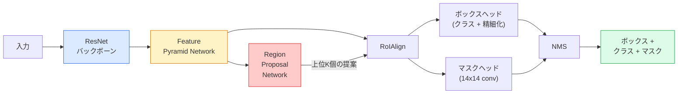

# インスタンスセグメンテーション — Mask R-CNN

> Faster R-CNN検出器に小さなマスクブランチを追加するとインスタンスセグメンテーションになる。難しい部分はRoIAlignで、見た目より難しい。

**タイプ:** 構築 + 学習
**言語:** Python
**前提条件:** フェーズ4 レッスン06（YOLO）、フェーズ4 レッスン07（U-Net）
**所要時間:** 約75分

## 学習目標

- Mask R-CNNのアーキテクチャをエンドツーエンドで辿る：バックボーン、FPN、RPN、RoIAlign、ボックスヘッド、マスクヘッド
- RoIAlignをゼロから実装し、RoIPoolがもはや使われない理由を説明する
- torchvisionの`maskrcnn_resnet50_fpn_v2`事前学習済みモデルを本番品質のインスタンスマスクに使い、その出力形式を正しく読む
- ボックスとマスクヘッドを置き換えてバックボーンを凍結したまま、小さなカスタムデータセットでMask R-CNNをファインチューニングする

## 問題

セマンティックセグメンテーションはクラスごとに1つのマスクを提供する。インスタンスセグメンテーションは、2つのオブジェクトが同じクラスを共有していても、オブジェクトごとに1つのマスクを提供する。個人を数える、フレームをまたいで追跡する、物を測定する（壁のレンガそれぞれのバウンディングボックス、顕微鏡画像の各細胞）はすべてインスタンスセグメンテーションが必要だ。

Mask R-CNN（He et al., 2017）はインスタンスセグメンテーションを「検出+マスク」として再構成することでこれを解決した。その設計は非常にクリーンで、その後の5年間でほぼすべてのインスタンスセグメンテーション論文がMask R-CNNのバリアントとなり、torchvisionの実装は今も小規模から中規模のデータセットの本番デフォルトだ。

難しいエンジニアリング問題はサンプリングだ：提案ボックスの角がピクセル境界と揃っていないとき、固定サイズの特徴領域をどのようにクロップするか？それを間違えると至る所でmAPが数分の一ポイント失われる。RoIAlignがその答えだ。

## コンセプト

### アーキテクチャ



理解すべき5つのピース：

1. **バックボーン** — ImageNetで訓練されたResNet-50またはResNet-101。ストライド4、8、16、32での特徴マップの階層を生成する。
2. **FPN（Feature Pyramid Network）** — トップダウン+ラテラル接続で、すべてのレベルにCチャンネルの意味豊かな特徴量を与える。検出はオブジェクトサイズに合わせたFPNレベルを照会する。
3. **RPN（Region Proposal Network）** — すべてのアンカー位置で「ここにオブジェクトがあるか？」と「ボックスをどのように精細化するか？」を予測する小さな畳み込みヘッド。画像ごとに約1,000個の提案を生成する。
4. **RoIAlign** — FPNの任意のレベルの任意のボックスから固定サイズ（例：7x7）の特徴パッチをサンプリングする。バイリニアサンプリング、量子化なし。
5. **ヘッド** — ボックスを精細化してクラスを選ぶ2層のボックスヘッドと、各提案に対して`28x28`のバイナリマスクを出力する小さな畳み込みヘッド。

### RoIPool ではなく RoIAlign の理由

元のFast R-CNNはRoIPoolを使っていた。これは提案ボックスをグリッドに分割し、各セルで最大特徴量を取り、すべての座標を整数に丸める。その丸めは特徴マップを入力ピクセル座標から最大1特徴マップピクセルずれさせる——224x224の画像では小さいが、特徴マップのストライドが32の場合は壊滅的だ。

```
RoIPool:
  ボックス (34.7, 51.3, 98.2, 142.9)
  丸める -> (34, 51, 98, 142)
  グリッド分割 -> 各セル境界を丸める
  ステップごとにズレが累積する

RoIAlign:
  ボックス (34.7, 51.3, 98.2, 142.9)
  バイリニア補間を使って正確な浮動小数点座標でサンプリング
  どこでも丸めなし
```

RoIAlignはCOCOのマスクAPを無料で3-4ポイント向上させる。局所化を気にするすべての検出器——YOLOv7 seg、RT-DETR、Mask2Former——が今はこれを使っている。

### RPNを1段落で

特徴マップのすべての位置で、異なるサイズと形状のK個のアンカーボックスを配置する。各アンカーのオブジェクト性スコアと、アンカーをより良くフィットするボックスに変える回帰オフセットを予測する。スコアで上位約1,000個のボックスを保持し、IoU 0.7でNMSを適用し、残ったものをヘッドに渡す。RPNは独自のミニ損失で訓練される——レッスン6のYOLO損失と同じ構造で、2クラス（オブジェクト/非オブジェクト）だけだ。

### マスクヘッド

各提案（RoIAlign後）に対して、マスクヘッドは小さなFCN：4つの3x3畳み込み、2倍のdeconv、`28x28`解像度で`num_classes`出力チャンネルを生成する最終1x1畳み込み。予測されたクラスに対応するチャンネルのみが保持され、他は無視される。これによりマスク予測が分類から切り離される。

28x28マスクを提案の元のピクセルサイズにアップサンプルして最終的なバイナリマスクを生成する。

### 損失

Mask R-CNNには足し合わされた4つの損失がある：

```
L = L_rpn_cls + L_rpn_box + L_box_cls + L_box_reg + L_mask
```

- `L_rpn_cls`、`L_rpn_box` — RPN提案のオブジェクト性+ボックス回帰。
- `L_box_cls` — ヘッドの分類器での(C+1)クラス（背景を含む）に対するクロスエントロピー。
- `L_box_reg` — ヘッドのボックス精細化に対するSmooth L1。
- `L_mask` — 28x28マスク出力に対するピクセルごとのバイナリクロスエントロピー。

各損失には独自のデフォルト重みがある；torchvisionの実装はそれらをコンストラクタ引数として公開している。

### 出力形式

`torchvision.models.detection.maskrcnn_resnet50_fpn_v2`は画像ごとに1つの辞書リストを返す：

```
{
    "boxes":  (N, 4) (x1, y1, x2, y2) ピクセル座標,
    "labels": (N,) クラスID、0 = 背景なのでインデックスは1始まり,
    "scores": (N,) 信頼スコア,
    "masks":  (N, 1, H, W) [0, 1]の浮動小数点マスク——バイナリには0.5で閾値,
}
```

マスクはすでに完全な画像解像度だ。28x28ヘッドの出力は内部でアップサンプルされている。

## 構築

### ステップ1: RoIAlignをゼロから

Mask R-CNNの1つのコンポーネントで、散文よりコードとして理解する方が簡単だ。

```python
import torch
import torch.nn.functional as F

def roi_align_single(feature, box, output_size=7, spatial_scale=1 / 16.0):
    """
    feature: (C, H, W) 単一画像の特徴マップ
    box: (x1, y1, x2, y2) 元の画像のピクセル座標
    output_size: 出力グリッドの辺（ボックスヘッドは7、マスクヘッドは14）
    spatial_scale: 特徴マップのストライドの逆数
    """
    C, H, W = feature.shape
    x1, y1, x2, y2 = [c * spatial_scale - 0.5 for c in box]
    bin_w = (x2 - x1) / output_size
    bin_h = (y2 - y1) / output_size

    grid_y = torch.linspace(y1 + bin_h / 2, y2 - bin_h / 2, output_size)
    grid_x = torch.linspace(x1 + bin_w / 2, x2 - bin_w / 2, output_size)
    yy, xx = torch.meshgrid(grid_y, grid_x, indexing="ij")

    gx = 2 * (xx + 0.5) / W - 1
    gy = 2 * (yy + 0.5) / H - 1
    grid = torch.stack([gx, gy], dim=-1).unsqueeze(0)
    sampled = F.grid_sample(feature.unsqueeze(0), grid, mode="bilinear",
                            align_corners=False)
    return sampled.squeeze(0)
```

すべての数値はバイリニアにサンプリングされた位置にある。丸めなし、量子化なし、勾配の欠落なし。

### ステップ2: torchvisionのRoIAlignと比較

```python
from torchvision.ops import roi_align

feature = torch.randn(1, 16, 50, 50)
boxes = torch.tensor([[0, 10, 20, 100, 90]], dtype=torch.float32)  # (batch_idx, x1, y1, x2, y2)

ours = roi_align_single(feature[0], boxes[0, 1:].tolist(), output_size=7, spatial_scale=1/4)
theirs = roi_align(feature, boxes, output_size=(7, 7), spatial_scale=1/4, sampling_ratio=1, aligned=True)[0]

print(f"shape ours:   {tuple(ours.shape)}")
print(f"shape theirs: {tuple(theirs.shape)}")
print(f"max|diff|:    {(ours - theirs).abs().max().item():.3e}")
```

`sampling_ratio=1`と`aligned=True`では、2つは`1e-5`以内で一致する。

### ステップ3: 事前学習済みMask R-CNNをロード

```python
import torch
from torchvision.models.detection import maskrcnn_resnet50_fpn_v2, MaskRCNN_ResNet50_FPN_V2_Weights

model = maskrcnn_resnet50_fpn_v2(weights=MaskRCNN_ResNet50_FPN_V2_Weights.DEFAULT)
model.eval()
print(f"params: {sum(p.numel() for p in model.parameters()):,}")
print(f"classes (including background): {len(model.roi_heads.box_predictor.cls_score.out_features * [0])}")
```

4,600万パラメータ、91クラス（COCO）。最初のクラス（id 0）は背景；モデルが実際に検出するものはすべてid 1から始まる。

### ステップ4: 推論を実行

```python
with torch.no_grad():
    x = torch.randn(3, 400, 600)
    predictions = model([x])
p = predictions[0]
print(f"boxes:  {tuple(p['boxes'].shape)}")
print(f"labels: {tuple(p['labels'].shape)}")
print(f"scores: {tuple(p['scores'].shape)}")
print(f"masks:  {tuple(p['masks'].shape)}")
```

マスクテンソルは形状`(N, 1, H, W)`だ。オブジェクトごとのバイナリマスクを得るには0.5で閾値を設ける：

```python
binary_masks = (p['masks'] > 0.5).squeeze(1)  # (N, H, W) boolean
```

### ステップ5: カスタムクラス数のためにヘッドを交換

一般的なファインチューニングレシピ：バックボーン、FPN、RPNを再利用し、2つの分類ヘッドを置き換える。

```python
from torchvision.models.detection.faster_rcnn import FastRCNNPredictor
from torchvision.models.detection.mask_rcnn import MaskRCNNPredictor

def build_custom_maskrcnn(num_classes):
    model = maskrcnn_resnet50_fpn_v2(weights=MaskRCNN_ResNet50_FPN_V2_Weights.DEFAULT)
    in_features = model.roi_heads.box_predictor.cls_score.in_features
    model.roi_heads.box_predictor = FastRCNNPredictor(in_features, num_classes)
    in_features_mask = model.roi_heads.mask_predictor.conv5_mask.in_channels
    hidden_layer = 256
    model.roi_heads.mask_predictor = MaskRCNNPredictor(in_features_mask, hidden_layer, num_classes)
    return model

custom = build_custom_maskrcnn(num_classes=5)
print(f"custom cls_score.out_features: {custom.roi_heads.box_predictor.cls_score.out_features}")
```

`num_classes`は背景クラスを含まなければならないため、4つのオブジェクトクラスを持つデータセットは`num_classes=5`を使う。

### ステップ6: 訓練が必要ないものを凍結

小さなデータセットでは、バックボーンとFPNを凍結する。RPNのオブジェクト性+回帰と2つのヘッドのみが学習する。

```python
def freeze_backbone_and_fpn(model):
    # torchvision Mask R-CNNはFPNを`model.backbone`内（
    # `model.backbone.fpn`として）にパックするため、`model.backbone.parameters()`を
    # 反復するとResNet特徴層とFPNのlateral/output convの両方がカバーされる。
    for p in model.backbone.parameters():
        p.requires_grad = False
    return model

custom = freeze_backbone_and_fpn(custom)
trainable = sum(p.numel() for p in custom.parameters() if p.requires_grad)
print(f"trainable after freeze: {trainable:,}")
```

500枚の画像データセットでは、これが収束と過学習の差になる。

## 活用

torchvisionのMask R-CNNの完全な訓練ループは40行で、タスク間でほとんど変わらない——データセットを交換して使える。

```python
def train_step(model, images, targets, optimizer):
    model.train()
    loss_dict = model(images, targets)
    losses = sum(loss for loss in loss_dict.values())
    optimizer.zero_grad()
    losses.backward()
    optimizer.step()
    return {k: v.item() for k, v in loss_dict.items()}
```

`targets`リストには、`boxes`、`labels`、`masks`（`(num_instances, H, W)`バイナリテンソルとして）を持つ画像ごとの辞書が必要だ。モデルは訓練中に4つの損失の辞書を返し、評価中は`model.training`をキーにした予測のリストを返す。

`pycocotools`エバリュエータはボックスとマスクの両方でmAP@IoU=0.5:0.95を生成する；ボックスヘッドとマスクヘッドのどちらがボトルネックかを知るために両方の数値が必要だ。

## 出力

このレッスンでは以下を生成する：

- `outputs/prompt-instance-vs-semantic-router.md` — 3つの質問をして、インスタンスvsセマンティックvsパノプティックと、開始する正確なモデルを選ぶプロンプト。
- `outputs/skill-mask-rcnn-head-swapper.md` — 新しい`num_classes`が与えられると、任意のtorchvision検出モデルのヘッドを交換する10行のコードを生成するスキル。

## 演習

1. **(簡単)** 100個のランダムなボックスでRoIAlignを`torchvision.ops.roi_align`に対して検証する。最大絶対差を報告する。また、RoIPool（2017年以前の動作）を実行し、境界近くのボックスで約1-2特徴マップピクセルの差が生じることを示す。
2. **(中程度)** 50枚のカスタムデータセット（任意の2クラス：バルーン、魚、ポットホール、ロゴ）で`maskrcnn_resnet50_fpn_v2`をファインチューニングする。バックボーンを凍結し、20エポック訓練し、マスクAP@0.5を報告する。
3. **(難しい)** Mask R-CNNのマスクヘッドを28x28ではなく56x56で予測するものに置き換える。前後でmAP@IoU=0.75を測定する。向上（または欠如）が期待される境界精度/メモリのトレードオフとどのように一致するかを説明する。

## キーワード

| 用語 | 人々が言うこと | 実際の意味 |
|------|----------------|----------------------|
| Mask R-CNN | 「検出+マスク」 | Faster R-CNN + 提案ごと、クラスごとに28x28マスクを予測する小さなFCNヘッド |
| FPN | 「特徴ピラミッド」 | すべてのストライドレベルにCチャンネルの意味豊かな特徴量を与えるトップダウン+ラテラル接続 |
| RPN | 「領域提案器」 | 画像ごとに約1,000個のオブジェクト/非オブジェクト提案を生成する小さな畳み込みヘッド |
| RoIAlign | 「丸めなしクロップ」 | 任意の浮動小数点座標ボックスから固定サイズの特徴グリッドをバイリニアにサンプリングする |
| RoIPool | 「2017年以前のクロップ」 | RoIAlignと同じ目的だがボックス座標を丸める；廃止 |
| マスクAP | 「インスタンスmAP」 | ボックスIoUの代わりにマスクIoUで計算された平均適合率；COCOインスタンスセグメンテーションメトリクス |
| バイナリマスクヘッド | 「クラスごとのマスク」 | 各提案についてクラスごとに1つのバイナリマスクを予測する；予測されたクラスのチャンネルのみが保持される |
| 背景クラス | 「クラス0」 | 「オブジェクトなし」のキャッチオールクラス；実際のクラスのインデックスは1から始まる |

## 参考文献

- [Mask R-CNN (He et al., 2017)](https://arxiv.org/abs/1703.06870) — 論文；セクション3のRoIAlignが重要な読み物
- [FPN: Feature Pyramid Networks (Lin et al., 2017)](https://arxiv.org/abs/1612.03144) — FPN論文；すべての現代的な検出器が使っている
- [torchvision Mask R-CNN tutorial](https://pytorch.org/tutorials/intermediate/torchvision_tutorial.html) — ファインチューニングループのリファレンス
- [Detectron2 model zoo](https://github.com/facebookresearch/detectron2/blob/main/MODEL_ZOO.md) — ほぼすべての検出とセグメンテーションバリアントの訓練済み重みを持つ本番実装
