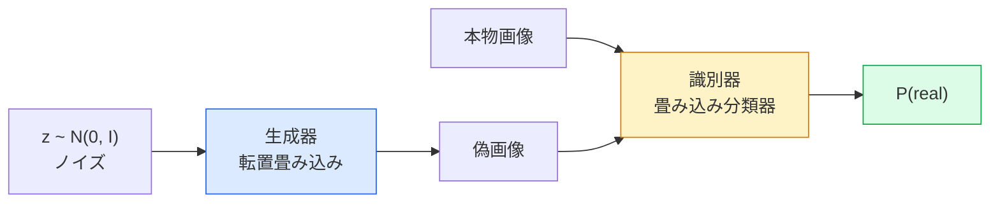
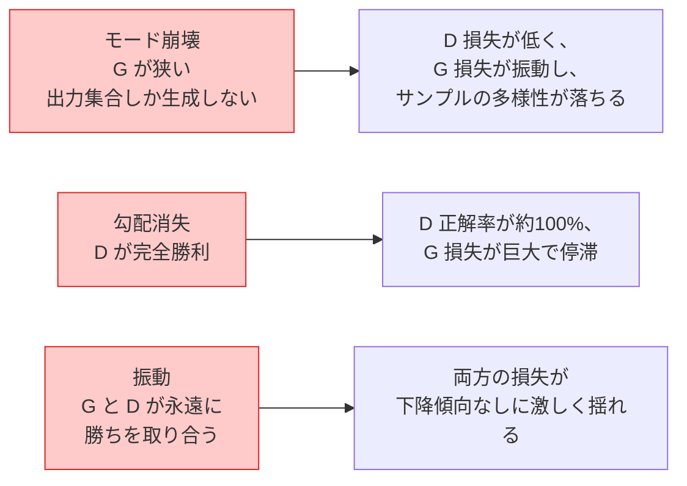

# 画像生成 — GAN

> GAN は、固定されたゲームの中の2つのニューラルネットワークである。一方が描き、もう一方が批評する。両者は、描かれた絵が批評者を欺くまで、一緒に上達していく。

**タイプ:** Build
**言語:** Python
**前提条件:** Phase 4 Lesson 03 (CNNs), Phase 3 Lesson 06 (Optimizers), Phase 3 Lesson 07 (Regularization)
**所要時間:** 約75分

## 学習目標

- 生成器と識別器の間のミニマックスゲームと、なぜ均衡が p_model = p_data に対応するのかを説明する
- PyTorch で DCGAN を実装し、60行未満で一貫性のある32x32の合成画像を生成させる
- 3つの標準的なテクニックで GAN の訓練を安定化させる: 非飽和損失、スペクトル正規化、TTUR(two-timescale update rule)
- 健全な収束と、モード崩壊、振動、識別器の完全勝利を区別する訓練曲線を読み取る

## 問題

分類は、ネットワークに画像をラベルに対応付けることを教える。生成はこの問題を反転させる。すなわち、同じ分布から来たように見える新しい画像をサンプリングするのだ。差分を取って比較できる「正しい」出力は存在しない。模倣したい分布があるだけである。

標準的な損失関数(MSE、交差エントロピー)は「このサンプルは本物の分布から来たか」を測ることができない。ピクセル単位の誤差を最小化すると、現実的なサンプルではなく、ぼやけた平均が生成される。ブレークスルーは、損失そのものを学習することだった。本物と偽物を見分けることを仕事とする2つ目のネットワークを訓練し、その判断を使って生成器を押し進めるのだ。

GAN(Goodfellow et al., 2014)はこの枠組みを定義した。2018年までに StyleGAN は写真と見分けがつかない1024x1024の顔を生成していた。その後、拡散モデルが品質と制御性で王座を奪ったが、拡散を実用的にするすべてのテクニック — 正規化の選択、潜在空間、特徴損失 — は最初に GAN で理解されたものである。

## コンセプト

### 2つのネットワーク



**生成器 (generator)** G はノイズベクトル `z` を受け取り、画像を出力する。**識別器 (discriminator)** D は画像を受け取り、単一のスカラー、すなわちその画像が本物である確率を出力する。

### ゲーム

G は D に間違ってほしい。D は正しくありたい。形式的には次のとおり。

```
min_G max_D  E_x[log D(x)] + E_z[log(1 - D(G(z)))]
```

右から左に読む。D は本物(`log D(real)`)と偽物(`log (1 - D(fake))`)の画像に対する正解率を最大化している。G は偽物に対する D の正解率を最小化している。すなわち `D(G(z))` を高くしたいのである。

Goodfellow は、このミニマックスには `p_G = p_data` となる大域的均衡が存在し、D はあらゆる場所で0.5を出力し、生成分布と本物分布の間の Jensen-Shannon ダイバージェンスがゼロになることを証明した。難しいのはそこにたどり着くことである。

### 非飽和損失

上記の形式は数値的に不安定だ。訓練の初期では、すべての偽物に対して `D(G(z))` がほぼゼロになるため、`log(1 - D(G(z)))` は G に関する勾配が消失する。対策は、G の損失を反転させることだ。

```
L_D = -E_x[log D(x)] - E_z[log(1 - D(G(z)))]
L_G = -E_z[log D(G(z))]                          # 非飽和
```

これで `D(G(z))` がほぼゼロのとき、G の損失は大きくなり、その勾配は有益になる。あらゆる現代の GAN はこのバリアントで訓練する。

### DCGAN のアーキテクチャ規則

Radford, Metz, Chintala(2015)は、長年の失敗実験を、GAN 訓練を安定させる5つの規則に蒸留した。

1. プーリングをストライド付き畳み込みに置き換える(両方のネット)。
2. 生成器と識別器の両方でバッチ正規化を使う。ただし G の出力と D の入力を除く。
3. より深いアーキテクチャでは全結合層を取り除く。
4. G は出力以外のすべての層で ReLU を使う(出力には [-1, 1] のための tanh)。
5. D はすべての層で LeakyReLU(negative_slope=0.2)を使う。

あらゆる現代の畳み込みベースの GAN(StyleGAN、BigGAN、GigaGAN)は、いまだにこれらの規則から始まり、一度に1つずつ部品を置き換えている。

### 失敗モードとそのサイン



- **モード崩壊**: G が D を欺く1枚の画像を見つけ、それだけを生成する。対策: ミニバッチ識別、スペクトル正規化、またはラベル条件付けを追加する。
- **識別器の勝利**: D が速すぎるペースで強くなりすぎ、G の勾配が消失する。対策: より小さい D、より低い D の学習率、または本物ラベルへのラベル平滑化を適用する。
- **振動**: 2つのネットが均衡に近づくことなく勝ちを取り合う。対策: TTUR(D が G より2〜4倍速く学習する)、または Wasserstein 損失への切り替え。

### 評価

GAN にはグラウンドトゥルースがないので、どうやって機能していると分かるのか?

- **サンプル検査** — 各エポックの終わりに64個のサンプルを見るだけ。これは絶対に欠かせない。
- **FID (Fréchet Inception Distance)** — 本物集合と生成集合の Inception-v3 特徴分布間の距離。低いほど良い。コミュニティの標準。
- **Inception Score** — 古く、より脆い。FID を優先する。
- **生成モデルのための Precision/Recall** — 品質(precision)とカバレッジ(recall)を別々に測る。FID 単独より情報量が多い。

小規模な合成データの実行では、サンプル検査で十分だ。

## ビルドする

### ステップ1: 生成器

64次元のノイズを受け取り、32x32の画像を生成する小さな DCGAN 生成器。

```python
import torch
import torch.nn as nn

class Generator(nn.Module):
    def __init__(self, z_dim=64, img_channels=3, feat=64):
        super().__init__()
        self.net = nn.Sequential(
            nn.ConvTranspose2d(z_dim, feat * 4, kernel_size=4, stride=1, padding=0, bias=False),
            nn.BatchNorm2d(feat * 4),
            nn.ReLU(inplace=True),
            nn.ConvTranspose2d(feat * 4, feat * 2, kernel_size=4, stride=2, padding=1, bias=False),
            nn.BatchNorm2d(feat * 2),
            nn.ReLU(inplace=True),
            nn.ConvTranspose2d(feat * 2, feat, kernel_size=4, stride=2, padding=1, bias=False),
            nn.BatchNorm2d(feat),
            nn.ReLU(inplace=True),
            nn.ConvTranspose2d(feat, img_channels, kernel_size=4, stride=2, padding=1, bias=False),
            nn.Tanh(),
        )

    def forward(self, z):
        return self.net(z.view(z.size(0), -1, 1, 1))
```

4つの転置畳み込みで、それぞれ `kernel_size=4, stride=2, padding=1` を使うため、空間サイズがきれいに倍になる。出力活性化は tanh により [-1, 1] になる。

### ステップ2: 識別器

生成器の鏡像。LeakyReLU、ストライド付き畳み込み、最後はスカラーのロジットで終わる。

```python
class Discriminator(nn.Module):
    def __init__(self, img_channels=3, feat=64):
        super().__init__()
        self.net = nn.Sequential(
            nn.Conv2d(img_channels, feat, kernel_size=4, stride=2, padding=1),
            nn.LeakyReLU(0.2, inplace=True),
            nn.Conv2d(feat, feat * 2, kernel_size=4, stride=2, padding=1, bias=False),
            nn.BatchNorm2d(feat * 2),
            nn.LeakyReLU(0.2, inplace=True),
            nn.Conv2d(feat * 2, feat * 4, kernel_size=4, stride=2, padding=1, bias=False),
            nn.BatchNorm2d(feat * 4),
            nn.LeakyReLU(0.2, inplace=True),
            nn.Conv2d(feat * 4, 1, kernel_size=4, stride=1, padding=0),
        )

    def forward(self, x):
        return self.net(x).view(-1)
```

最後の畳み込みは `4x4` の特徴マップを `1x1` に縮小する。出力は画像ごとに単一のスカラーである。シグモイドは損失計算のときだけ適用する。

### ステップ3: 訓練ステップ

交互に行う。バッチごとに D を1回更新し、それから G を1回更新する。

```python
import torch.nn.functional as F

def train_step(G, D, real, z, opt_g, opt_d, device):
    real = real.to(device)
    bs = real.size(0)

    # D step
    opt_d.zero_grad()
    d_real = D(real)
    d_fake = D(G(z).detach())
    loss_d = (F.binary_cross_entropy_with_logits(d_real, torch.ones_like(d_real))
              + F.binary_cross_entropy_with_logits(d_fake, torch.zeros_like(d_fake)))
    loss_d.backward()
    opt_d.step()

    # G step
    opt_g.zero_grad()
    d_fake = D(G(z))
    loss_g = F.binary_cross_entropy_with_logits(d_fake, torch.ones_like(d_fake))
    loss_g.backward()
    opt_g.step()

    return loss_d.item(), loss_g.item()
```

D ステップの `G(z).detach()` は決定的に重要だ。D の更新中に G へ勾配が流れてほしくないのである。これを忘れるのが古典的な初心者のバグだ。

### ステップ4: 合成図形での完全な訓練ループ

```python
from torch.utils.data import DataLoader, TensorDataset
import numpy as np

def synthetic_images(num=2000, size=32, seed=0):
    rng = np.random.default_rng(seed)
    imgs = np.zeros((num, 3, size, size), dtype=np.float32) - 1.0
    for i in range(num):
        r = rng.uniform(6, 12)
        cx, cy = rng.uniform(r, size - r, size=2)
        yy, xx = np.meshgrid(np.arange(size), np.arange(size), indexing="ij")
        mask = (xx - cx) ** 2 + (yy - cy) ** 2 < r ** 2
        color = rng.uniform(-0.5, 1.0, size=3)
        for c in range(3):
            imgs[i, c][mask] = color[c]
    return torch.from_numpy(imgs)

device = "cuda" if torch.cuda.is_available() else "cpu"
data = synthetic_images()
loader = DataLoader(TensorDataset(data), batch_size=64, shuffle=True)

G = Generator(z_dim=64, img_channels=3, feat=32).to(device)
D = Discriminator(img_channels=3, feat=32).to(device)
opt_g = torch.optim.Adam(G.parameters(), lr=2e-4, betas=(0.5, 0.999))
opt_d = torch.optim.Adam(D.parameters(), lr=2e-4, betas=(0.5, 0.999))

for epoch in range(10):
    for (batch,) in loader:
        z = torch.randn(batch.size(0), 64, device=device)
        ld, lg = train_step(G, D, batch, z, opt_g, opt_d, device)
    print(f"epoch {epoch}  D {ld:.3f}  G {lg:.3f}")
```

`Adam(lr=2e-4, betas=(0.5, 0.999))` は DCGAN のデフォルトである。低い beta1 は、モーメンタム項が敵対的ゲームを過度に安定化させるのを防ぐ。

### ステップ5: サンプリング

```python
@torch.no_grad()
def sample(G, n=16, z_dim=64, device="cpu"):
    G.eval()
    z = torch.randn(n, z_dim, device=device)
    imgs = G(z)
    imgs = (imgs + 1) / 2
    return imgs.clamp(0, 1)
```

サンプリングの前に必ず eval モードに切り替える。DCGAN ではこれが重要だ。なぜなら、バッチの統計量の代わりにバッチ正規化の移動統計量が使われるからである。

### ステップ6: スペクトル正規化

識別器の BN を差し替えるだけで、ネットワークが1-Lipschitz であることを保証する。ほとんどの「D が強く勝ちすぎる」失敗を解決する。

```python
from torch.nn.utils import spectral_norm

def build_sn_discriminator(img_channels=3, feat=64):
    return nn.Sequential(
        spectral_norm(nn.Conv2d(img_channels, feat, 4, 2, 1)),
        nn.LeakyReLU(0.2, inplace=True),
        spectral_norm(nn.Conv2d(feat, feat * 2, 4, 2, 1)),
        nn.LeakyReLU(0.2, inplace=True),
        spectral_norm(nn.Conv2d(feat * 2, feat * 4, 4, 2, 1)),
        nn.LeakyReLU(0.2, inplace=True),
        spectral_norm(nn.Conv2d(feat * 4, 1, 4, 1, 0)),
    )
```

`Discriminator` を `build_sn_discriminator()` に差し替えれば、TTUR のテクニックが不要になることが多い。スペクトル正規化は、適用できる中で最も簡単な単一の頑健性アップグレードである。

## 使ってみる

本格的な生成には、事前学習済みの重みを使うか、拡散に切り替える。2つの標準的なライブラリ。

- `torch_fidelity` は、カスタムの評価コードを書かずに生成器の FID / IS を計算する。
- `pytorch-gan-zoo`(レガシー)と `StudioGAN` は、DCGAN、WGAN-GP、SN-GAN、StyleGAN、BigGAN のテスト済み実装を提供する。

2026年において、GAN は依然として次の用途で最良の選択である。リアルタイム画像生成(レイテンシ <10 ms)、スタイル転送、精密な制御を伴う画像間変換(Pix2Pix、CycleGAN)。拡散はフォトリアリズムとテキスト条件付けで勝る。

## 出荷する

このレッスンは次のものを生成する。

- `outputs/prompt-gan-training-triage.md` — 訓練曲線の記述を読み、失敗モード(モード崩壊、D 勝利、振動)を特定し、推奨される単一の対策を選ぶプロンプト。
- `outputs/skill-dcgan-scaffold.md` — `z_dim`、ターゲットの `image_size`、`num_channels` から、訓練ループとサンプル保存を含む DCGAN のスキャフォールドを書くスキル。

## 演習

1. **(易)** 上記の DCGAN を合成の円データセットで訓練し、各エポックの終わりに16サンプルのグリッドを保存する。生成される円が明確に円形になるのは何エポック目か?
2. **(中)** 識別器のバッチ正規化をスペクトル正規化に置き換える。両バージョンを並べて訓練する。どちらが速く収束するか? 3つのシードにわたって分散が低いのはどちらか?
3. **(難)** 条件付き DCGAN を実装する。クラスラベルを G と D の両方に入力する(G ではノイズに one-hot を連結し、D ではクラス埋め込みチャネルを連結する)。レッスン7の合成「円 vs 四角形」データセットで訓練し、特定のラベルでサンプリングすることでクラス条件付けが機能することを示す。

## 主要用語

| 用語 | 人々が言うこと | 実際の意味 |
|------|----------------|----------------------|
| 生成器 (Generator, G) | 「描く方のネット」 | ノイズを画像に対応付ける。識別器を欺くように訓練される |
| 識別器 (Discriminator, D) | 「批評者」 | 2値分類器。本物と生成画像を区別するように訓練される |
| ミニマックス (Minimax) | 「ゲーム」 | 敵対的損失の、G に関する min と D に関する max。均衡は p_G = p_data |
| 非飽和損失 (Non-saturating loss) | 「数値的に正気なバージョン」 | 訓練初期の勾配消失を避けるため、G の損失が log(1 - D(G(z))) ではなく -log(D(G(z))) になる |
| モード崩壊 (Mode collapse) | 「生成器が1つのものしか作らない」 | G がデータ分布の小さな部分集合しか生成しない。SN、ミニバッチ識別、またはより大きなバッチで修正 |
| TTUR | 「2つの学習率」 | D が G より速く学習する、通常は2〜4倍。訓練を安定化させる |
| スペクトル正規化 (Spectral norm) | 「1-Lipschitz 層」 | 各層の Lipschitz 定数を制限する重み正規化。D が任意に急峻になるのを止める |
| FID | 「Fréchet Inception Distance」 | 本物集合と生成集合の Inception-v3 特徴分布間の距離。標準的な評価指標 |

## 参考文献

- [Generative Adversarial Networks (Goodfellow et al., 2014)](https://arxiv.org/abs/1406.2661) — すべてを始めた論文
- [DCGAN (Radford, Metz, Chintala, 2015)](https://arxiv.org/abs/1511.06434) — GAN を訓練可能にしたアーキテクチャ規則
- [Spectral Normalization for GANs (Miyato et al., 2018)](https://arxiv.org/abs/1802.05957) — 最も有用な単一の安定化テクニック
- [StyleGAN3 (Karras et al., 2021)](https://arxiv.org/abs/2106.12423) — SOTA の GAN。過去10年のあらゆるテクニックのベスト盤アルバムのように読める
