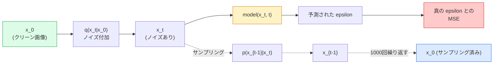

# 画像生成 — 拡散モデル

> 拡散モデルはノイズ除去を学習する。ノイズ付き画像からわずかなノイズを除去する訓練を行い、それを千回逆方向に繰り返すと、画像生成器ができあがる。

**タイプ:** 構築
**言語:** Python
**前提条件:** Phase 4 レッスン07（U-Net）、Phase 1 レッスン06（確率論）、Phase 3 レッスン06（オプティマイザ）
**所要時間:** 約75分

## 学習目標

- 順方向ノイズ付加プロセス `x_0 -> x_1 -> ... -> x_T` を導出し、任意の t に対して閉形式 `q(x_t | x_0)` が成立する理由を説明する
- 各ステップで加えられたノイズを回帰するDDPMスタイルの訓練目的関数と、純粋なノイズから画像へと逆順に辿るサンプラーを実装する
- タイムステップに対してノイズを予測する、時刻条件付きU-Net（CPUで訓練できる程度の小規模なもの）を構築する
- DDPMとDDIMサンプリングの違い、およびそれぞれが適切な場面を説明する（レッスン23ではフローマッチングと整流フローを詳しく扱う）

## 問題

GANは一度で生成する：ノイズを入力して画像を出力し、順伝播は1回で完了する。訓練は速いが難しい。拡散モデルは反復的に生成する：純粋なノイズから始め、小さなステップでノイズを除去しながら画像を生み出す。訓練は遅いが簡単だ。過去5年間、後者の特性が支配的であった：小さなチームでも拡散モデルを訓練して妥当なサンプルを得ることができるが、GANの訓練は何年もの失敗から学んで習得する技巧だ。

訓練の安定性を超えて、拡散のもつ反復的な構造こそが、現代の画像生成が実現するすべてのことを可能にする：テキスト条件付け、インペインティング、画像編集、超解像、制御可能なスタイル。サンプリングループの各ステップは、新しい制約を注入できる場所だ。このフックがあるからこそ、Stable Diffusion、Imagen、DALL-E 3、Midjourney、そして使うことになるすべての制御可能な画像モデルが拡散ベースとなっている。

このレッスンでは最小限のDDPMを構築する：順方向ノイズ付加、逆方向ノイズ除去、訓練ループ。次のレッスン（Stable Diffusion）では、VAE、テキストエンコーダ、クラスフリーガイダンスを組み合わせた本番システムへと発展させる。

## コンセプト

### 順方向プロセス

画像 `x_0` を取る。ガウスノイズをわずかに加えて `x_1` を得る。さらにわずかに加えて `x_2` を得る。T ステップ繰り返すと `x_T` は純粋なガウスノイズとほぼ区別がつかなくなる。

```
q(x_t | x_{t-1}) = N(x_t; sqrt(1 - beta_t) * x_{t-1},  beta_t * I)
```

`beta_t` は小さな分散スケジュールで、T=1000 ステップにわたり通常 0.0001 から 0.02 まで線形に変化する。各ステップで信号をわずかに縮小し、新鮮なノイズを注入する。

### 閉形式ジャンプ

ノイズを一度に一ステップ加えるのはマルコフ連鎖だが、数学的には折りたたむことができる：`x_t` を `x_0` から1ステップで直接サンプリングできる。

```
Define alpha_t = 1 - beta_t
Define alpha_bar_t = prod_{s=1..t} alpha_s

Then:
  q(x_t | x_0) = N(x_t; sqrt(alpha_bar_t) * x_0,  (1 - alpha_bar_t) * I)

Equivalently:
  x_t = sqrt(alpha_bar_t) * x_0 + sqrt(1 - alpha_bar_t) * epsilon
  where epsilon ~ N(0, I)
```

この単一の式が拡散を実用的にする全ての理由だ。訓練中にランダムな `t` を選び、`x_0` から `x_t` を直接サンプリングして、一ステップで訓練する — 完全なマルコフ連鎖のシミュレーションは不要だ。

### 逆方向プロセス

順方向プロセスは固定されている。逆方向プロセス `p(x_{t-1} | x_t)` がニューラルネットワークの学習対象だ。拡散モデルは `x_{t-1}` を直接予測せず、ステップ t で加えられたノイズ `epsilon` を予測し、そこから `x_{t-1}` を数学的に導出する。



### 訓練損失関数

各訓練ステップで：

1. 実画像 `x_0` をサンプリングする。
2. タイムステップ `t` を [1, T] から一様にサンプリングする。
3. ノイズ `epsilon ~ N(0, I)` をサンプリングする。
4. `x_t = sqrt(alpha_bar_t) * x_0 + sqrt(1 - alpha_bar_t) * epsilon` を計算する。
5. ネットワークで `epsilon_theta(x_t, t)` を予測する。
6. `|| epsilon - epsilon_theta(x_t, t) ||^2` を最小化する。

それだけだ。ニューラルネットワークは任意のタイムステップでノイズを予測することを学習する。損失関数はMSEだ。敵対的なゲームも、崩壊も、振動もない。

### サンプラー（DDPM）

生成するには：`x_T ~ N(0, I)` から始めて、一度に一ステップずつ逆方向に辿る。

```
for t = T, T-1, ..., 1:
    eps = model(x_t, t)
    x_{t-1} = (1 / sqrt(alpha_t)) * (x_t - (beta_t / sqrt(1 - alpha_bar_t)) * eps) + sqrt(beta_t) * z
    where z ~ N(0, I) if t > 1, else 0
return x_0
```

重要なのは、一般に逆方向の条件付き分布は閉形式では知られていないが、このガウス順方向プロセスの場合には成立するということだ。見かけ上は醜い係数がベイズの定理から得られるものだ。

### なぜ1000ステップか

順方向ノイズスケジュールは、各ステップが十分なノイズを加えて逆ステップがほぼガウス分布になるように設計される。ステップ数が少なすぎると逆ステップがガウス分布から離れ、ネットワークがうまくモデル化できない。多すぎるとサンプリングが高価になり得られる恩恵が薄れる。T=1000の線形スケジュールがDDPMのデフォルトだ。

### DDIM：20倍高速なサンプリング

訓練は同じ。サンプリングが変わる。DDIM（Song ら、2020年）は再訓練なしにタイムステップをスキップする決定論的な逆方向プロセスを定義する。DDIMの50ステップサンプリングはDDPM1000ステップに近い品質を達成する。すべての本番システムはDDIMまたはより高速なバリアント（DPM-Solver、Euler ancestral）を使用する。

### 時刻条件付け

ネットワーク `epsilon_theta(x_t, t)` は、どのタイムステップのノイズ除去を行っているかを知る必要がある。現代の拡散モデルは、トランスフォーマーの位置符号化と同じアイデアである正弦波時刻埋め込みを使って `t` を注入し、U-Netの各レベルの特徴マップに加算する。

```
t_embedding = sinusoidal(t)
feature_map += MLP(t_embedding)
```

時刻条件付けがなければ、ネットワークは画像自体からノイズレベルを推測しなければならず、動作はするがサンプル効率がはるかに低下する。

## 実装

### ステップ1：ノイズスケジュール

```python
import torch

def linear_beta_schedule(T=1000, beta_start=1e-4, beta_end=2e-2):
    return torch.linspace(beta_start, beta_end, T)


def precompute_schedule(betas):
    alphas = 1.0 - betas
    alphas_cumprod = torch.cumprod(alphas, dim=0)
    return {
        "betas": betas,
        "alphas": alphas,
        "alphas_cumprod": alphas_cumprod,
        "sqrt_alphas_cumprod": torch.sqrt(alphas_cumprod),
        "sqrt_one_minus_alphas_cumprod": torch.sqrt(1.0 - alphas_cumprod),
        "sqrt_recip_alphas": torch.sqrt(1.0 / alphas),
    }

schedule = precompute_schedule(linear_beta_schedule(T=1000))
```

一度だけ事前計算し、訓練とサンプリング中はインデックスで取得する。

### ステップ2：順方向拡散（q_sample）

```python
def q_sample(x0, t, noise, schedule):
    sqrt_a = schedule["sqrt_alphas_cumprod"][t].view(-1, 1, 1, 1)
    sqrt_one_minus_a = schedule["sqrt_one_minus_alphas_cumprod"][t].view(-1, 1, 1, 1)
    return sqrt_a * x0 + sqrt_one_minus_a * noise
```

一行の閉形式。`t` はバッチ内の各画像に対応するタイムステップのバッチだ。

### ステップ3：小さな時刻条件付きU-Net

```python
import torch.nn as nn
import torch.nn.functional as F
import math

def timestep_embedding(t, dim=64):
    half = dim // 2
    freqs = torch.exp(-math.log(10000) * torch.arange(half, device=t.device) / half)
    args = t[:, None].float() * freqs[None]
    emb = torch.cat([args.sin(), args.cos()], dim=-1)
    return emb


class TinyUNet(nn.Module):
    def __init__(self, img_channels=3, base=32, t_dim=64):
        super().__init__()
        self.t_mlp = nn.Sequential(
            nn.Linear(t_dim, base * 4),
            nn.SiLU(),
            nn.Linear(base * 4, base * 4),
        )
        self.t_dim = t_dim
        self.enc1 = nn.Conv2d(img_channels, base, 3, padding=1)
        self.enc2 = nn.Conv2d(base, base * 2, 4, stride=2, padding=1)
        self.mid = nn.Conv2d(base * 2, base * 2, 3, padding=1)
        self.dec1 = nn.ConvTranspose2d(base * 2, base, 4, stride=2, padding=1)
        self.dec2 = nn.Conv2d(base * 2, img_channels, 3, padding=1)
        self.time_proj = nn.Linear(base * 4, base * 2)

    def forward(self, x, t):
        t_emb = timestep_embedding(t, self.t_dim)
        t_emb = self.t_mlp(t_emb)
        t_proj = self.time_proj(t_emb)[:, :, None, None]

        h1 = F.silu(self.enc1(x))
        h2 = F.silu(self.enc2(h1)) + t_proj
        h3 = F.silu(self.mid(h2))
        d1 = F.silu(self.dec1(h3))
        d2 = torch.cat([d1, h1], dim=1)
        return self.dec2(d2)
```

ボトルネックに時刻条件付けを注入する2レベルU-Net。実際の画像には深さと幅をスケールアップすること。

### ステップ4：訓練ループ

```python
def train_step(model, x0, schedule, optimizer, device, T=1000):
    model.train()
    x0 = x0.to(device)
    bs = x0.size(0)
    t = torch.randint(0, T, (bs,), device=device)
    noise = torch.randn_like(x0)
    x_t = q_sample(x0, t, noise, schedule)
    pred = model(x_t, t)
    loss = F.mse_loss(pred, noise)
    optimizer.zero_grad()
    loss.backward()
    optimizer.step()
    return loss.item()
```

これが訓練ループの全てだ。GANのゲームも、特殊な損失も、MSEの呼び出し一つだけだ。

### ステップ5：サンプラー（DDPM）

```python
@torch.no_grad()
def sample(model, schedule, shape, T=1000, device="cpu"):
    model.eval()
    x = torch.randn(shape, device=device)
    betas = schedule["betas"].to(device)
    sqrt_one_minus_a = schedule["sqrt_one_minus_alphas_cumprod"].to(device)
    sqrt_recip_alphas = schedule["sqrt_recip_alphas"].to(device)

    for t in reversed(range(T)):
        t_batch = torch.full((shape[0],), t, dtype=torch.long, device=device)
        eps = model(x, t_batch)
        coef = betas[t] / sqrt_one_minus_a[t]
        mean = sqrt_recip_alphas[t] * (x - coef * eps)
        if t > 0:
            x = mean + torch.sqrt(betas[t]) * torch.randn_like(x)
        else:
            x = mean
    return x
```

1000回の順伝播で1バッチのサンプルを生成する。実際のコードではDDIM 50ステップサンプラーに差し替えること。

### ステップ6：DDIMサンプラー（決定論的、約20倍高速）

```python
@torch.no_grad()
def sample_ddim(model, schedule, shape, steps=50, T=1000, device="cpu", eta=0.0):
    model.eval()
    x = torch.randn(shape, device=device)
    alphas_cumprod = schedule["alphas_cumprod"].to(device)

    ts = torch.linspace(T - 1, 0, steps + 1).long()
    for i in range(steps):
        t = ts[i]
        t_prev = ts[i + 1]
        t_batch = torch.full((shape[0],), t, dtype=torch.long, device=device)
        eps = model(x, t_batch)
        a_t = alphas_cumprod[t]
        a_prev = alphas_cumprod[t_prev] if t_prev >= 0 else torch.tensor(1.0, device=device)
        x0_pred = (x - torch.sqrt(1 - a_t) * eps) / torch.sqrt(a_t)
        sigma = eta * torch.sqrt((1 - a_prev) / (1 - a_t) * (1 - a_t / a_prev))
        dir_xt = torch.sqrt(1 - a_prev - sigma ** 2) * eps
        noise = sigma * torch.randn_like(x) if eta > 0 else 0
        x = torch.sqrt(a_prev) * x0_pred + dir_xt + noise
    return x
```

`eta=0` は完全に決定論的（同じノイズ入力は常に同じ出力を生成する）。`eta=1` はDDPMに戻る。

## 活用

本番作業には `diffusers` を使う：

```python
from diffusers import DDPMScheduler, UNet2DModel

unet = UNet2DModel(sample_size=32, in_channels=3, out_channels=3, layers_per_block=2)
scheduler = DDPMScheduler(num_train_timesteps=1000)
```

このライブラリは既製のスケジューラー（DDPM、DDIM、DPM-Solver、Euler、Heun）、設定可能なU-Net、テキスト→画像・画像→画像パイプライン、LoRAファインチューニングヘルパーを提供する。

研究には `k-diffusion`（Katherine Crowson）が最も忠実なリファレンス実装と最良のサンプリングバリアントを持つ。

## 成果物

このレッスンの成果物：

- `outputs/prompt-diffusion-sampler-picker.md` — 品質目標、レイテンシ予算、条件付けタイプに基づいてDDPM / DDIM / DPM-Solver / Eulerを選ぶプロンプト。
- `outputs/skill-noise-schedule-designer.md` — T と目標腐敗レベルを指定してリニア・コサイン・シグモイドのベータスケジュールを生成し、時間ごとの信号対雑音比の診断プロットも作成するスキル。

## 演習

1. **（簡単）** 順方向プロセスを可視化する：1枚の画像を取り、`t in [0, 100, 250, 500, 750, 1000]` での `x_t` をプロットする。`x_1000` が純粋なガウスノイズに見えることを確認する。
2. **（中級）** 合成円データセットでTinyUNetを20エポック訓練し、16個の円をサンプリングする。DDPM（1000ステップ）とDDIM（50ステップ）サンプリングを比較する — 同じノイズシードから類似した画像が生成されるか？
3. **（上級）** コサインノイズスケジュール（Nichol & Dhariwal, 2021）を実装する：`alpha_bar_t = cos^2((t/T + s) / (1 + s) * pi / 2)`。同じモデルをリニアとコサインスケジュールで訓練し、コサインがステップ数が少ない場合により良いサンプルを生成することを示す。

## 用語集

| 用語 | 人々が言うこと | 実際の意味 |
|------|----------------|------------|
| 順方向プロセス | "時間をかけてノイズを加える" | T ステップにわたって画像をガウスノイズに腐敗させる固定マルコフ連鎖 |
| 逆方向プロセス | "一歩ずつノイズを除去する" | ノイズから画像へと逆方向に辿る学習された分布 |
| イプシロン予測 | "ノイズを予測する" | 訓練目標：`epsilon_theta(x_t, t)` はステップ t で加えられたノイズを予測する |
| ベータスケジュール | "ノイズ量" | 各ステップに入るノイズ量を定義するT個の小さな分散の列 |
| alpha_bar_t | "累積保持係数" | 時刻 t までの (1 - beta_s) の積；t が大きいほど残る信号は少ない |
| DDPMサンプラー | "先祖確率的" | 各 x_{t-1} をその条件付きガウス分布からサンプリングする；1000ステップ |
| DDIMサンプラー | "決定論的、高速" | サンプリングを決定論的なODEとして書き直す；同等の品質で20〜100ステップ |
| 時刻条件付け | "どの t かをモデルに伝える" | U-Netに注入されるtの正弦波埋め込みにより、ノイズレベルを知ることができる |

## 参考文献

- [Denoising Diffusion Probabilistic Models (Ho et al., 2020)](https://arxiv.org/abs/2006.11239) — 拡散を実用的にしてFIDでGANを上回った論文
- [Improved DDPM (Nichol & Dhariwal, 2021)](https://arxiv.org/abs/2102.09672) — コサインスケジュールとv-パラメータ化
- [DDIM (Song, Meng, Ermon, 2020)](https://arxiv.org/abs/2010.02502) — リアルタイム推論を可能にした決定論的サンプラー
- [Elucidating the Design Space of Diffusion (Karras et al., 2022)](https://arxiv.org/abs/2206.00364) — すべての拡散設計選択に関する統一的な視点；現在の最良のリファレンス
