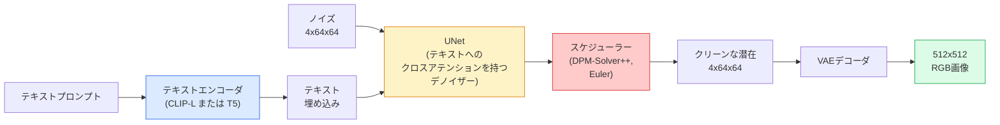

# Stable Diffusion — アーキテクチャとファインチューニング

> Stable Diffusion は、事前学習済みVAEの潜在空間で動作するDDPMであり、クロスアテンションでテキスト条件付けを行い、高速な決定論的ODEソルバーでサンプリングし、クラスフリーガイダンスで誘導する。

**タイプ:** 学習 + 活用
**言語:** Python
**前提条件:** Phase 4 レッスン10（拡散モデル）、Phase 7 レッスン02（自己アテンション）
**所要時間:** 約75分

## 学習目標

- Stable Diffusion パイプラインの5つのコンポーネント（VAE、テキストエンコーダ、U-Net、スケジューラー、安全チェッカー）とそれぞれが実際に行うことをトレースする
- 潜在拡散と、4x64x64の潜在空間での訓練（3x512x512画像の代わり）が品質損失なしに計算量を48分の1に削減する理由を説明する
- `diffusers` を使って画像を生成し、画像→画像変換、インペインティング、ControlNet誘導生成を実行する
- 小さなカスタムデータセットでLoRAを使ってStable Diffusionをファインチューニングし、推論時にLoRAアダプターを読み込む

## 問題

512x512 RGBで直接DDPMを訓練するのは高コストだ。各訓練ステップで3x512x512 = 786,432個の入力値を持つU-Netを通じてバックプロパゲーションを行い、サンプリングは同じU-Netを通じた50回以上の順伝播が必要だ。Stable Diffusion 1.5（2022年リリース）の品質レベルでは、ピクセル空間の拡散には約256GPU月の訓練と民生GPUで1画像あたり10〜30秒が必要だろう。

オープンウェイトのテキスト→画像を実用的にした手法は**潜在拡散**（Rombach ら、CVPR 2022）だ。3x512x512画像を4x64x64の潜在テンソルにマップして元に戻すVAEを訓練し、その潜在空間で拡散を行う。計算量は `(3*512*512)/(4*64*64) = 48倍` に削減される。サンプリングは同じGPUで数十秒から2秒未満に短縮される。

ほぼすべての現代的な画像生成モデル — SDXL、SD3、FLUX、HunyuanDiT、Wan-Video — はオートエンコーダ、デノイザー（U-NetまたはDiT）、テキスト条件付けにバリエーションを持つ潜在拡散モデルだ。Stable Diffusionを学べばテンプレートを習得したことになる。

## コンセプト

### パイプライン



- **VAE** — フリーズされたオートエンコーダ。エンコーダは画像を潜在表現に変換する（img2imgと訓練に使用）。デコーダは潜在表現を画像に戻す。
- **テキストエンコーダ** — CLIPテキストエンコーダ（SD 1.x/2.x）、CLIP-L + CLIP-G（SDXL）、T5-XXL（SD3/FLUX）。トークン埋め込みの列を生成する。
- **U-Net** — デノイザー。各解像度レベルでテキスト埋め込みへのクロスアテンション層を持つ。
- **スケジューラー** — サンプリングアルゴリズム（DDIM、Euler、DPM-Solver++）。シグマを選択し、予測されたノイズを潜在表現に戻す。
- **安全チェッカー** — 出力画像に対するオプショナルなNSFW/違法コンテンツフィルター。

### クラスフリーガイダンス（CFG）

通常のテキスト条件付けは各プロンプト `c` に対して `epsilon_theta(x_t, t, c)` を学習する。CFGは同じネットワークを `c` を10%の確率でドロップ（空の埋め込みに置換）して訓練し、条件付きと無条件のノイズの両方を予測できる単一のモデルを得る。推論時：

```
eps = eps_uncond + w * (eps_cond - eps_uncond)
```

`w` はガイダンススケールだ。`w=0` は無条件、`w=1` は通常の条件付き、`w>1` は多様性を犠牲にして出力を「プロンプトにより強く条件付けられた」方向に押し進める。SDのデフォルトは `w=7.5` だ。

CFGがテキスト→画像を本番品質で機能させる理由だ。なければプロンプトは出力に弱くしか影響しないが、CFGがあればプロンプトが支配的になる。

### 潜在空間の幾何学

VAEの4チャンネル潜在表現は単なる圧縮画像ではない。算術演算がほぼ意味的な編集に対応するマニフォールド（プロンプトエンジニアリングと補間の両方がここに存在する）であり、拡散U-Netがモデリング能力のすべてを使って訓練された空間だ。ランダムな4x64x64潜在表現をデコードしてもランダムな画像は得られない — ゴミができる。なぜなら潜在表現の特定のサブマニフォールドだけが有効な画像にデコードされるからだ。

2つの結果：

1. **img2img** = 画像を潜在表現にエンコード、部分的なノイズを加える、デノイザーを実行、デコード。エンコーディングはほぼ可逆なので画像構造は保たれ、コンテンツはプロンプトに基づいて変化する。
2. **インペインティング** = img2imgと同じだがデノイザーはマスクされた領域のみを更新し、マスクされていない領域はエンコードされた潜在表現のまま保たれる。

### U-Netアーキテクチャ

SD U-Netはレッスン10のTinyUNetを3つの追加要素で大きくしたものだ：

- **トランスフォーマーブロック** — 各空間解像度で、自己アテンション + テキスト埋め込みへのクロスアテンションを含む。
- **時刻埋め込み** — 正弦波エンコーディングのMLPを通じて。
- **スキップ接続** — 対応する解像度でエンコーダとデコーダ間を結ぶ。

SD 1.5の総パラメータ数：約860M。SDXL：約2.6B。FLUX：約12B。パラメータ数の急増はほとんどアテンション層によるものだ。

### LoRAファインチューニング

Stable Diffusionの完全ファインチューニングは20GB以上のVRAMが必要で860Mパラメータを更新する。LoRA（低ランク適応）はベースモデルをフリーズしたまま、アテンション層に小さなランク分解行列を注入する。SDのLoRAアダプターは通常10〜50MBで、民生GPUで10〜60分で訓練でき、推論時にドロップインの変更として読み込める。

```
Original: W_q : (d_in, d_out)   frozen
LoRA:     W_q + alpha * (A @ B)   where A : (d_in, r), B : (r, d_out)

r is typically 4-32.
```

LoRAはほぼすべてのコミュニティファインチューンが配布される方法だ。CivitAIとHugging Faceには何百万ものLoRAが公開されている。

### よく見るスケジューラー

- **DDIM** — 決定論的、約50ステップ、シンプル。
- **Euler ancestral** — 確率論的、30〜50ステップ、若干創造的なサンプル。
- **DPM-Solver++ 2M Karras** — 決定論的、20〜30ステップ、本番デフォルト。
- **LCM / TCD / Turbo** — 整合性モデルと蒸留バリアント；品質を多少犠牲にして1〜4ステップ。

スケジューラーの切り替えは `diffusers` で1行変更であり、再訓練なしにサンプルの問題が解決されることもある。

## 実装

このレッスンはStable Diffusionをゼロから再構築するのではなく、`diffusers` をエンドツーエンドで使用する。再構築が必要なコンポーネント（VAE、テキストエンコーダ、U-Net、スケジューラー）はそれぞれ独自のレッスンのトピックだ；ここでの目標は本番APIへの習熟だ。

### ステップ1：テキスト→画像

```python
import torch
from diffusers import StableDiffusionPipeline

pipe = StableDiffusionPipeline.from_pretrained(
    "runwayml/stable-diffusion-v1-5",
    torch_dtype=torch.float16,
).to("cuda")

image = pipe(
    prompt="a dog riding a skateboard in tokyo, studio ghibli style",
    guidance_scale=7.5,
    num_inference_steps=25,
    generator=torch.Generator("cuda").manual_seed(42),
).images[0]
image.save("dog.png")
```

`float16` はVRAMを半減させ、画質の可視的な損失はない。デフォルトのDPM-Solver++での `num_inference_steps=25` はDDIMの `num_inference_steps=50` に匹敵する。

### ステップ2：スケジューラーの切り替え

```python
from diffusers import DPMSolverMultistepScheduler, EulerAncestralDiscreteScheduler

pipe.scheduler = DPMSolverMultistepScheduler.from_config(pipe.scheduler.config)
pipe.scheduler = EulerAncestralDiscreteScheduler.from_config(pipe.scheduler.config)
```

スケジューラーの状態はU-Netの重みと切り離されている。DDPMで訓練して任意のスケジューラーでサンプリングできる。

### ステップ3：画像→画像

```python
from diffusers import StableDiffusionImg2ImgPipeline
from PIL import Image

img2img = StableDiffusionImg2ImgPipeline.from_pretrained(
    "runwayml/stable-diffusion-v1-5",
    torch_dtype=torch.float16,
).to("cuda")

init_image = Image.open("dog.png").convert("RGB").resize((512, 512))
out = img2img(
    prompt="a dog riding a skateboard, oil painting",
    image=init_image,
    strength=0.6,
    guidance_scale=7.5,
).images[0]
```

`strength` はノイズ除去前に加えるノイズの量（0.0 = 変化なし、1.0 = 完全再生成）。スタイル転送には0.5〜0.7が標準的な範囲だ。

### ステップ4：インペインティング

```python
from diffusers import StableDiffusionInpaintPipeline

inpaint = StableDiffusionInpaintPipeline.from_pretrained(
    "runwayml/stable-diffusion-inpainting",
    torch_dtype=torch.float16,
).to("cuda")

image = Image.open("dog.png").convert("RGB").resize((512, 512))
mask = Image.open("dog_mask.png").convert("L").resize((512, 512))

out = inpaint(
    prompt="a cat",
    image=image,
    mask_image=mask,
    guidance_scale=7.5,
).images[0]
```

マスクの白ピクセルが再生成する領域だ。黒ピクセルは保持される。

### ステップ5：LoRAの読み込み

```python
pipe.load_lora_weights("sayakpaul/sd-lora-ghibli")
pipe.fuse_lora(lora_scale=0.8)

image = pipe(prompt="a village square in ghibli style").images[0]
```

`lora_scale` は強度を制御する；0.0 = 効果なし、1.0 = フル効果。`fuse_lora` はアダプターを速度のために重みにベイクするが、切り替えができなくなる。別のアダプターを読み込む前に `pipe.unfuse_lora()` を呼ぶこと。

### ステップ6：LoRA訓練（概要）

実際のLoRA訓練は `peft` または `diffusers.training` に存在する。概要：

```python
# Pseudocode
for step, batch in enumerate(dataloader):
    images, prompts = batch
    latents = vae.encode(images).latent_dist.sample() * 0.18215

    t = torch.randint(0, num_train_timesteps, (batch_size,))
    noise = torch.randn_like(latents)
    noisy_latents = scheduler.add_noise(latents, noise, t)

    text_emb = text_encoder(tokenizer(prompts))

    pred_noise = unet(noisy_latents, t, text_emb)  # LoRA weights injected here

    loss = F.mse_loss(pred_noise, noise)
    loss.backward()
    optimizer.step()
```

LoRA行列のみが勾配を受け取る；ベースU-Net、VAE、テキストエンコーダはフリーズされる。バッチサイズ1と勾配チェックポインティングで8GBのVRAMに収まる。

## 活用

本番環境では実際に行う決定：

- **モデルファミリー**：オープンソースコミュニティファインチューン用にSD 1.5、高忠実度にはSDXL、最先端および厳格なライセンス要件にはSD3/FLUX。
- **スケジューラー**：20〜30ステップにはDPM-Solver++ 2M Karras、レイテンシが1秒未満の場合はLCM-LoRA。
- **精度**：4080/4090には `float16`、A100以降には `bfloat16`、VRAMが不足している場合は `int8`（`bitsandbytes` または `compel` 経由）。
- **条件付け**：通常のテキストは機能する；より強い制御には、ベースパイプラインの上にControlNet（canny、depth、pose）を追加する。

バッチ生成には `AUTO1111` / `ComfyUI` がコミュニティツールとして存在し、本番APIには `diffusers` + `accelerate` またはTensorRTコンパイルを伴う `optimum-nvidia` を使う。

## 成果物

このレッスンの成果物：

- `outputs/prompt-sd-pipeline-planner.md` — レイテンシ予算、忠実度目標、ライセンス制約を考慮してSD 1.5 / SDXL / SD3 / FLUXとスケジューラーおよび精度を選択するプロンプト。
- `outputs/skill-lora-training-setup.md` — キャプション、ランク、バッチサイズ、学習率を含むカスタムデータセット用の完全なLoRA訓練設定を作成するスキル。

## 演習

1. **（簡単）** `guidance_scale` を `[1, 3, 5, 7.5, 10, 15]` で同じプロンプトを生成する。画像がどのように変化するかを説明する。どのガイダンス値でアーティファクトが現れるか？
2. **（中級）** 実際の写真を取り、`strength` を `[0.2, 0.4, 0.6, 0.8, 1.0]` で `StableDiffusionImg2ImgPipeline` に通す。どのstrengthがスタイルを変えながら構図を保持するか？1.0が入力を完全に無視する理由は何か？
3. **（上級）** 1つの被写体（ペット、ロゴ、キャラクター）の10〜20枚の画像でLoRAを訓練し、その被写体を含む新しいシーンを生成する。入力画像への過学習なしに最良のアイデンティティ保持を実現したLoRAランクと訓練ステップ数を報告する。

## 用語集

| 用語 | 人々が言うこと | 実際の意味 |
|------|----------------|------------|
| 潜在拡散 | "潜在表現で拡散する" | DDPMの全体をピクセル空間（3x512x512）の代わりにVAEの潜在空間（4x64x64）で実行する；48倍の計算量削減 |
| VAEスケールファクター | "0.18215" | VAEの生の潜在表現をおよそ単位分散にリスケールする定数；すべてのSDパイプラインにハードコードされている |
| クラスフリーガイダンス | "CFG" | 条件付きと無条件のノイズ予測を混合する；最も影響力のある推論ノブ |
| スケジューラー | "サンプラー" | ノイズとモデル予測をノイズ除去された潜在軌跡に変換するアルゴリズム |
| LoRA | "低ランクアダプター" | ベース重みに触れずにアテンション層をファインチューニングする小さなランク分解行列 |
| クロスアテンション | "テキスト-画像アテンション" | 潜在トークンからテキストトークンへのアテンション；各U-Netレベルでプロンプト情報を注入する |
| ControlNet | "構造条件付け" | 追加入力（canny、depth、pose、セグメンテーション）でSDを誘導する別途訓練されたアダプター |
| DPM-Solver++ | "デフォルトスケジューラー" | 2次決定論的ODEソルバー；2026年現在、低ステップ数（20〜30）での最良品質 |

## 参考文献

- [High-Resolution Image Synthesis with Latent Diffusion (Rombach et al., 2022)](https://arxiv.org/abs/2112.10752) — Stable Diffusion論文；設計を正当化するすべてのアブレーションを含む
- [Classifier-Free Diffusion Guidance (Ho & Salimans, 2022)](https://arxiv.org/abs/2207.12598) — CFG論文
- [LoRA: Low-Rank Adaptation of Large Language Models (Hu et al., 2021)](https://arxiv.org/abs/2106.09685) — LoRAはNLPが先だったが、ほぼ変更なしにSDに移植された
- [diffusers documentation](https://huggingface.co/docs/diffusers) — すべてのSD / SDXL / SD3 / FLUXパイプラインのリファレンス
