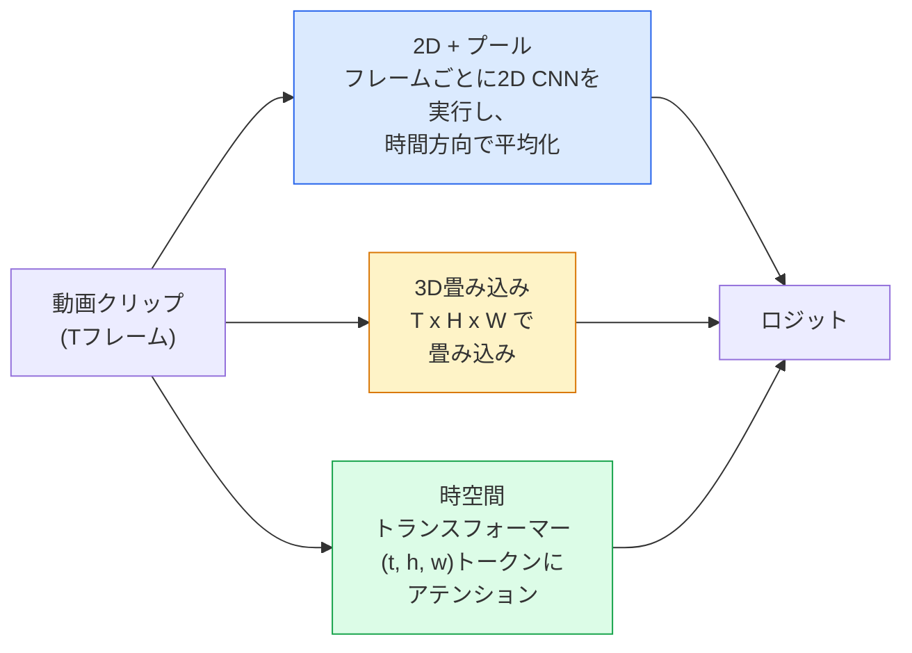

# 動画理解 — 時系列モデリング

> 動画は画像の列に、それらを結ぶ物理法則を加えたものだ。すべての動画モデルは、時間を追加の軸（3D畳み込み）、アテンションを取る列（トランスフォーマー）、または一度抽出してプーリングする特徴量（2D+プール）のいずれかとして扱う。

**タイプ:** 学習 + 構築
**言語:** Python
**前提条件:** Phase 4 レッスン03（CNN）、Phase 4 レッスン04（画像分類）
**所要時間:** 約45分

## 学習目標

- 3つの主要な動画モデリングアプローチ（2D+プール、3D畳み込み、時空間トランスフォーマー）を区別し、コストと精度のトレードオフを予測する
- PyTorchでフレームサンプリング、時間プーリング、2D+プールベースライン分類器を実装する
- I3Dの「膨張した」3Dカーネルがなぜ ImageNet の重みからうまく転移するか、および因子化(2+1)D畳み込みが何を違うことをするかを説明する
- 標準的な行動認識データセットと評価指標を理解する：Kinetics-400/600、UCF101、Something-Something V2；クリップとビデオレベルでのトップ1精度

## 問題

30fpsで30秒の動画は900枚の画像だ。単純には、動画分類は画像分類を900回実行して何らかの集約を行うことだ。これは行動がほぼすべてのフレームで見える場合（スポーツ、料理、エクササイズ動画）は機能し、行動が動き自体で定義される場合はひどく失敗する：「何かを左から右に押す」はすべての単一フレームで2つの静止物体のように見える。

すべての動画アーキテクチャの核心的な問いは：時間的な構造はいつモデル化され、どのようにモデル化されるか？という点だ。この答えが他のすべてを左右する — 計算コスト、事前学習戦略、ImageNetの重みを再利用できるか、モデルがどのデータセットで訓練されるか。

このレッスンは静的画像のレッスンより意図的に短い。コアの画像機械はすでに揃っており、動画理解は主に時間的な話：サンプリング、モデリング、集約についてだ。

## コンセプト

### 3つのアーキテクチャファミリー



### 2D + プール

2D CNN（ResNet、EfficientNet、ViT）を取る。各サンプリングフレームに独立して実行する。フレームごとの埋め込みを平均化（またはmax-pool、アテンションプール）する。プールされたベクトルを分類器に渡す。

利点：
- ImageNetの事前学習が直接転移する。
- 実装が最もシンプル。
- 安価：Tフレーム × 単一画像の推論コスト。

欠点：
- 動きをモデル化できない。行動 = 外観の集約。
- 時間プーリングは順序不変；「ドアを開ける」と「ドアを閉める」は同じに見える。

使用場面：外観重視のタスク、小さな動画データセットでの転移学習、初期ベースライン。

### 3D畳み込み

2D（H、W）カーネルを3D（T、H、W）カーネルに置き換える。ネットワークは空間と時間の両方で畳み込む。初期ファミリー：C3D、I3D、SlowFast。

I3Dのトリック：事前学習済み2D ImageNetモデルを取り、各2Dカーネルを新しい時間軸に沿ってコピーして「膨張」させる。3x3の2D畳み込みは3x3x3の3D畳み込みになる。これにより3Dモデルはゼロから訓練するのではなく、強力な事前学習済み重みを持てる。

利点：
- 動きを直接モデル化する。
- I3D膨張でフリーの転移学習が得られる。

欠点：
- 2Dの対応物と比べてFLOPsがT/8増加する（3回重ねた時間カーネル3に対して）。
- 時間カーネルが小さい；長距離の動きにはピラミッドまたはデュアルストリームアプローチが必要。

使用場面：動きが信号となる行動認識（Something-Something V2、動き主体のクラスを持つKinetics）。

### 時空間トランスフォーマー

動画を時空間パッチのグリッドにトークン化し、すべてにアテンションを取る。TimeSformer、ViViT、Video Swin、VideoMAE。

重要なアテンションパターン：
- **結合** — (t, h, w)に対して大きなアテンション1つ。`T*H*W`に対して2乗のオーダー；高コスト。
- **分割** — ブロックごとに2つのアテンション：時間に1つ、空間に1つ。ほぼ線形スケーリング。
- **因子化** — ブロックをまたいで時間アテンションと空間アテンションが交互。

利点：
- すべての主要ベンチマークでSOTA精度。
- パッチ膨張によりViTなどの画像トランスフォーマーから転移可能。
- スパースアテンションを通じた長コンテキスト動画に対応。

欠点：
- 計算量が多い。
- 注意深いアテンションパターン選択が必要でないとランタイムが膨れ上がる。

使用場面：大規模データセット、高忠実度の動画理解、マルチモーダル動画+テキストタスク。

### フレームサンプリング

10秒のクリップが30fpsで300フレーム；すべての300フレームをモデルに送るのは無駄だ。標準的な戦略：

- **均一サンプリング** — クリップ全体でTフレームを均等に選ぶ。2D+プールのデフォルト。
- **密サンプリング** — ランダムな連続したTフレームウィンドウ。動きには隣接フレームが必要なため3D畳み込みによく使われる。
- **マルチクリップ** — 同じ動画から複数のTフレームウィンドウをサンプリングし、各々を分類し、テスト時に予測を平均化する。

Tは通常8、16、32、または64。Tが高いほど = より多くの時間的信号を、より多くの計算コストで。

### 評価

2つのレベル：
- **クリップレベル精度** — モデルは1つのTフレームクリップを見て、トップkを報告する。
- **動画レベル精度** — 動画ごとに複数のクリップにわたってクリップレベル予測を平均化する；より高く安定。

両方を常に報告する。78%クリップ / 82%動画のモデルはテスト時の平均化に大きく依存している；80%クリップ / 81%は1クリップあたりのロバスト性が高い。

### 接することになるデータセット

- **Kinetics-400 / 600 / 700** — 汎用行動データセット。40万クリップ；YouTube URL（多くは今は無効）。
- **Something-Something V2** — 動きで定義された行動（「Xを左から右に動かす」）。2D+プールでは解けない。
- **UCF-101**, **HMDB-51** — 古い、小さい、まだ報告される。
- **AVA** — 空間と時間における行動の*局所化*；分類より難しい。

## 実装

### ステップ1：フレームサンプラー

フレームのリスト（または動画テンソル）で動作する均一サンプラーと密サンプラー。

```python
import numpy as np

def sample_uniform(num_frames_total, T):
    if num_frames_total <= T:
        return list(range(num_frames_total)) + [num_frames_total - 1] * (T - num_frames_total)
    step = num_frames_total / T
    return [int(i * step) for i in range(T)]


def sample_dense(num_frames_total, T, rng=None):
    rng = rng or np.random.default_rng()
    if num_frames_total <= T:
        return list(range(num_frames_total)) + [num_frames_total - 1] * (T - num_frames_total)
    start = int(rng.integers(0, num_frames_total - T + 1))
    return list(range(start, start + T))
```

両方とも動画テンソルをスライスするために使用するTインデックスを返す。

### ステップ2：2D+プールベースライン

フレームごとに2D ResNet-18を実行し、特徴量を平均プールして分類する。

```python
import torch
import torch.nn as nn
from torchvision.models import resnet18, ResNet18_Weights

class FramePool(nn.Module):
    def __init__(self, num_classes=400, pretrained=True):
        super().__init__()
        weights = ResNet18_Weights.IMAGENET1K_V1 if pretrained else None
        backbone = resnet18(weights=weights)
        self.features = nn.Sequential(*(list(backbone.children())[:-1]))  # global avg pool kept
        self.head = nn.Linear(512, num_classes)

    def forward(self, x):
        # x: (N, T, 3, H, W)
        N, T = x.shape[:2]
        x = x.view(N * T, *x.shape[2:])
        feats = self.features(x).view(N, T, -1)
        pooled = feats.mean(dim=1)
        return self.head(pooled)

model = FramePool(num_classes=10)
x = torch.randn(2, 8, 3, 224, 224)
print(f"output: {model(x).shape}")
print(f"params: {sum(p.numel() for p in model.parameters()):,}")
```

1100万パラメータ、ImageNet事前学習済み、フレームごとに実行し、平均化し、分類する。このベースラインは外観重視のタスクでは適切な3Dモデルから5〜10ポイント以内に収まることが多い — より強力なImageNetバックボーンを再利用するため、場合によっては優れることもある。

### ステップ3：I3Dスタイルの膨張3D畳み込み

2D畳み込みを新しい時間軸に沿って重みを繰り返すことで3D畳み込みに変換する。

```python
def inflate_2d_to_3d(conv2d, time_kernel=3):
    out_c, in_c, kh, kw = conv2d.weight.shape
    weight_3d = conv2d.weight.data.unsqueeze(2)  # (out, in, 1, kh, kw)
    weight_3d = weight_3d.repeat(1, 1, time_kernel, 1, 1) / time_kernel
    conv3d = nn.Conv3d(in_c, out_c, kernel_size=(time_kernel, kh, kw),
                        padding=(time_kernel // 2, conv2d.padding[0], conv2d.padding[1]),
                        stride=(1, conv2d.stride[0], conv2d.stride[1]),
                        bias=False)
    conv3d.weight.data = weight_3d
    return conv3d

conv2d = nn.Conv2d(3, 64, kernel_size=3, padding=1, bias=False)
conv3d = inflate_2d_to_3d(conv2d, time_kernel=3)
print(f"2D weight shape:  {tuple(conv2d.weight.shape)}")
print(f"3D weight shape:  {tuple(conv3d.weight.shape)}")
x = torch.randn(1, 3, 8, 56, 56)
print(f"3D output shape:  {tuple(conv3d(x).shape)}")
```

`time_kernel` での除算は活性化値の大きさをほぼ一定に保つ — 最初のパスでバッチ正規化の統計を壊さないために重要だ。

### ステップ4：因子化(2+1)D畳み込み

3D畳み込みを2D（空間）と1D（時間）の畳み込みに分割する。同じ受容野、パラメータ数が少なく、一部のベンチマークでより高い精度。

```python
class Conv2Plus1D(nn.Module):
    def __init__(self, in_c, out_c, kernel_size=3):
        super().__init__()
        mid_c = (in_c * out_c * kernel_size * kernel_size * kernel_size) \
                // (in_c * kernel_size * kernel_size + out_c * kernel_size)
        self.spatial = nn.Conv3d(in_c, mid_c, kernel_size=(1, kernel_size, kernel_size),
                                 padding=(0, kernel_size // 2, kernel_size // 2), bias=False)
        self.bn = nn.BatchNorm3d(mid_c)
        self.act = nn.ReLU(inplace=True)
        self.temporal = nn.Conv3d(mid_c, out_c, kernel_size=(kernel_size, 1, 1),
                                  padding=(kernel_size // 2, 0, 0), bias=False)

    def forward(self, x):
        return self.temporal(self.act(self.bn(self.spatial(x))))

c = Conv2Plus1D(3, 64)
x = torch.randn(1, 3, 8, 56, 56)
print(f"(2+1)D output: {tuple(c(x).shape)}")
```

完全なR(2+1)Dネットワークは、すべての3x3畳み込みを `Conv2Plus1D` に置き換えたResNet-18と同じだ。

## 活用

本番の動画作業をカバーする2つのライブラリ：

- `torchvision.models.video` — 事前学習済みKinetics重みを持つR(2+1)D、MViT、Swin3D。画像モデルと同じAPI。
- `pytorchvideo`（Meta）— モデルズー、Kinetics / SSv2 / AVA用データローダー、標準変換。

視覚言語動画モデル（動画キャプション、動画QA）には `transformers`（`VideoMAE`、`VideoLLaMA`、`InternVideo`）を使う。

## 成果物

このレッスンの成果物：

- `outputs/prompt-video-architecture-picker.md` — 外観対動き、データセットサイズ、計算予算に基づいて2D+プール / I3D / (2+1)D / トランスフォーマーを選ぶプロンプト。
- `outputs/skill-frame-sampler-auditor.md` — 動画パイプラインのサンプラーを検査し、よくあるバグ（off-by-oneインデックス、`num_frames < T`での不均一サンプリング、アスペクト比保持クロップの欠如など）を指摘するスキル。

## 演習

1. **（簡単）** T=8のFramePoolとT=8のI3Dスタイル3D ResNetのFLOPs（概算）を計算する。2D+プールが3〜5倍安価な理由を正当化する。
2. **（中級）** 合成動画データセットを生成する：ランダムな方向に動くランダムなボール、動きの方向でラベル付け（「左から右」「右から左」「対角上」）。FramePoolで訓練する。チャンス精度に近い精度を達成することを示し、外観だけでは動作タスクに不十分であることを証明する。
3. **（上級）** ResNet-18のすべてのConv2dを `Conv2Plus1D` に置き換えてR(2+1)D-18を構築する。最初の畳み込みの重みをImageNet事前学習済みResNet-18から膨張させる。演習2の動作データセットで訓練し、FramePoolを上回る。

## 用語集

| 用語 | 人々が言うこと | 実際の意味 |
|------|----------------|------------|
| 2D + プール | "フレーム単位分類器" | すべてのサンプリングフレームに2D CNNを実行し、時間方向に特徴量を平均プールして分類する |
| 3D畳み込み | "時空間カーネル" | (T, H, W)に対して畳み込むカーネル；動きをネイティブにモデル化できる |
| 膨張 | "2D重みを3Dに持ち上げる" | 2D畳み込みの重みを新しい時間軸に沿って繰り返し、その後kernel_Tで割ることで活性化スケールを保持して3D畳み込み重みを初期化する |
| (2+1)D | "因子化畳み込み" | 3Dを2D空間 + 1D時間に分割；パラメータが少なく、間に追加の非線形性がある |
| 分割アテンション | "時間次に空間" | 1層あたり2つのアテンションを持つトランスフォーマーブロック：同じフレームのトークンに1つ、同じ位置のトークンに1つ |
| クリップ | "Tフレームウィンドウ" | Tフレームのサンプリングされた部分列；動画モデルが消費する単位 |
| クリップ対動画精度 | "2つの評価設定" | クリップ = 動画あたり1サンプル、動画 = 複数のサンプリングクリップにわたる平均 |
| Kinetics | "動画のImageNet" | 400〜700の行動クラス、30万以上のYouTubeクリップ、標準的な動画事前学習コーパス |

## 参考文献

- [I3D: Quo Vadis, Action Recognition (Carreira & Zisserman, 2017)](https://arxiv.org/abs/1705.07750) — 膨張とKineticsデータセットを導入
- [R(2+1)D: A Closer Look at Spatiotemporal Convolutions (Tran et al., 2018)](https://arxiv.org/abs/1711.11248) — 因子化畳み込み、依然として強力なベースライン
- [TimeSformer: Is Space-Time Attention All You Need? (Bertasius et al., 2021)](https://arxiv.org/abs/2102.05095) — 最初の強力な動画トランスフォーマー
- [VideoMAE (Tong et al., 2022)](https://arxiv.org/abs/2203.12602) — 動画のためのマスク付きオートエンコーダ事前学習；現在の主要な事前学習レシピ
