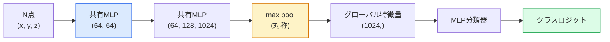

# 3D視覚 — 点群とNeRF

> 3D視覚には2つの種類がある。点群はセンサーの生の出力だ。NeRFは学習された体積フィールドだ。どちらも「空間のどこに何があるか」に答える。

**タイプ:** 学習 + 構築
**言語:** Python
**前提条件:** Phase 4 レッスン03（CNN）、Phase 1 レッスン12（テンソル演算）
**所要時間:** 約45分

## 学習目標

- 明示的表現（点群、メッシュ、ボクセル）と暗示的表現（符号付き距離フィールド、NeRF）の3D表現を区別し、それぞれの使用場面を理解する
- PointNetの対称関数のトリックを理解し、それが順序のない点の集合に対してニューラルネットワークを置換不変にする方法を理解する
- NeRFの順伝播をトレースする：レイキャスティング、体積レンダリング、位置符号化、MLP密度+色ヘッド
- ポーズ付きの少数の画像から事前学習済み3D再構築のために `nerfstudio` または `instant-ngp` を使用する

## 問題

カメラは2D画像を生成する。LIDARは順序のない3D点の集合を生成する。structure-from-motionパイプラインは疎な3Dキーポイントのクラウドを生成する。NeRFはいくつかのポーズ付き画像から3Dシーン全体を再構築する。これらはすべて「視覚」だが、どれもCNNが扱いたい密なテンソルには見えない。

3D視覚が重要なのは、高価値なロボットタスクのほぼすべてが3Dで実行されるからだ：把持、障害物回避、ナビゲーション、ARオクルージョン、3Dコンテンツキャプチャ。2D画像しか理解しない視覚エンジニアは、最も急成長しているフィールドの一部（AR/VRコンテンツ、ロボティクス、自律走行スタック、不動産や建設のためのNeRFベース3D再構築）から閉め出される。

2つの表現が異なる理由で支配的だ。点群はセンサーがタダで提供するものだ。NeRFとその後継（3Dガウシアンスプラッティング、ニューラルSDF）は、ニューラルネットワークにシーンを学習させたときに得られるものだ。

## コンセプト

### 点群

点群はR^3内のN個の点の順序のない集合で、オプションで各点に特徴量（色、強度、法線）を持つ。

```
cloud = [
  (x1, y1, z1, r1, g1, b1),
  (x2, y2, z2, r2, g2, b2),
  ...
  (xN, yN, zN, rN, gN, bN),
]
```

グリッドも接続性もない。2つの特性がニューラルネットワークにとって難しくする：

- **置換不変性** — 出力は点の順序に依存してはならない。
- **可変N** — 単一のモデルが異なるサイズの点群を扱える必要がある。

PointNet（Qi ら、2017年）は1つのアイデアで両方を解決した：共有MLPをすべての点に適用し、対称関数（max pool）で集約する。結果は順序に依存しない固定サイズのベクトルだ。

```
f(P) = max_{p in P} MLP(p)
```

これがPointNetのコア全体だ。より深いバリアント（PointNet++、Point Transformer）は階層的サンプリングとローカル集約を追加するが、対称関数のトリックは変わらない。

### PointNetアーキテクチャ



「共有MLP」は同じMLPがすべての点に独立して実行されることを意味する。効率のため、点次元にわたる1x1畳み込みとして実装される。

### Neural Radiance Fields（NeRF）

NeRF（Mildenhall ら、2020年）は「N枚の写真から3Dシーンを再構築できるか？」という問いを取り、シーン自体であるニューラルネットワークで答えた。このネットワークは `(x, y, z, viewing_direction)` を `(density, colour)` にマッピングする。新しい視点のレンダリングはこのネットワーク上のレイキャスティングループだ。

```
NeRF MLP:  (x, y, z, theta, phi) -> (sigma, r, g, b)

To render a pixel (u, v) of a new view:
  1. Cast a ray from the camera through pixel (u, v)
  2. Sample points along the ray at distances t_1, t_2, ..., t_N
  3. Query the MLP at each point
  4. Composite the colours weighted by (1 - exp(-sigma * dt))
  5. The sum is the rendered pixel colour
```

損失関数はレンダリングされたピクセルを訓練写真の正解ピクセルと比較する。レンダリングステップを通じたバックプロパゲーションがMLPを更新する。3Dの正解もなく、明示的なジオメトリもない — シーンはMLPの重みに格納される。

### NeRFの位置符号化

`(x, y, z)` のバニラMLPは、MLPがスペクトル的に低周波に偏っているため、高周波の詳細を表現できない。NeRFはMLP前に各座標をフーリエ特徴ベクトルにエンコードすることでこれを修正する：

```
gamma(p) = (sin(2^0 pi p), cos(2^0 pi p), sin(2^1 pi p), cos(2^1 pi p), ...)
```

L=10の周波数レベルまで。これはトランスフォーマーが位置に使用するのと同じトリックであり、拡散の時刻条件付けにも再び現れる（レッスン10）。これがないとNeRFはぼやける。

### 体積レンダリング

```
C(r) = sum_i T_i * (1 - exp(-sigma_i * delta_i)) * c_i

T_i  = exp(- sum_{j<i} sigma_j * delta_j)
delta_i = t_{i+1} - t_i
```

`T_i` は透過率 — 点iまで生き残る光の量だ。`(1 - exp(-sigma_i * delta_i))` は点iでの不透明度だ。`c_i` は色だ。最終ピクセルはレイに沿った重み付き和だ。

### NeRFに取って代わったもの

純粋なNeRFは訓練が遅く（時間単位）レンダリングも遅い（画像あたり秒単位）。それ以降の系譜：

- **Instant-NGP**（2022年）— ハッシュグリッドエンコーディングがMLPの位置入力を置き換える；秒単位で訓練。
- **Mip-NeRF 360** — 無制限シーンとアンチエイリアシングを処理。
- **3Dガウシアンスプラッティング**（2023年）— 体積フィールドを何百万個もの3Dガウシアンに置き換える；分単位で訓練、リアルタイムレンダリング。現在の本番デフォルト。

2026年現在のほぼすべてのリアルなNeRF製品は実際には3Dガウシアンスプラッティングだ。概念モデルはNeRFのままだ。

### データセットとベンチマーク

- **ShapeNet** — 点群としての3D CADモデルの分類とセグメンテーション。
- **ScanNet** — セグメンテーション用の実際の屋内スキャン。
- **KITTI** — 自律走行用の屋外LIDARポイントクラウド。
- **NeRF Synthetic** / **Blended MVS** — 視点合成のためのポーズ付き画像データセット。
- **Mip-NeRF 360** データセット — 無制限の実シーン。

## 実装

### ステップ1：PointNet分類器

```python
import torch
import torch.nn as nn

class PointNet(nn.Module):
    def __init__(self, num_classes=10):
        super().__init__()
        self.mlp1 = nn.Sequential(
            nn.Conv1d(3, 64, 1),    nn.BatchNorm1d(64),   nn.ReLU(inplace=True),
            nn.Conv1d(64, 64, 1),   nn.BatchNorm1d(64),   nn.ReLU(inplace=True),
        )
        self.mlp2 = nn.Sequential(
            nn.Conv1d(64, 128, 1),  nn.BatchNorm1d(128),  nn.ReLU(inplace=True),
            nn.Conv1d(128, 1024, 1), nn.BatchNorm1d(1024), nn.ReLU(inplace=True),
        )
        self.head = nn.Sequential(
            nn.Linear(1024, 512),   nn.BatchNorm1d(512),  nn.ReLU(inplace=True),
            nn.Dropout(0.3),
            nn.Linear(512, 256),    nn.BatchNorm1d(256),  nn.ReLU(inplace=True),
            nn.Dropout(0.3),
            nn.Linear(256, num_classes),
        )

    def forward(self, x):
        # x: (N, 3, num_points) — transposed for Conv1d
        x = self.mlp1(x)
        x = self.mlp2(x)
        x = torch.max(x, dim=-1)[0]       # (N, 1024)
        return self.head(x)

pts = torch.randn(4, 3, 1024)
net = PointNet(num_classes=10)
print(f"output: {net(pts).shape}")
print(f"params: {sum(p.numel() for p in net.parameters()):,}")
```

約160万パラメータ。点群あたり1,024点で動作する。

### ステップ2：位置符号化

```python
def positional_encoding(x, L=10):
    """
    x: (..., D) -> (..., D * 2 * L)
    """
    freqs = 2.0 ** torch.arange(L, dtype=x.dtype, device=x.device)
    args = x.unsqueeze(-1) * freqs * 3.141592653589793
    sinc = torch.cat([args.sin(), args.cos()], dim=-1)
    return sinc.reshape(*x.shape[:-1], -1)

x = torch.randn(5, 3)
y = positional_encoding(x, L=10)
print(f"input:  {x.shape}")
print(f"encoded: {y.shape}     # (5, 60)")
```

`2^l * pi` を掛けることで次第に高い周波数が得られる。

### ステップ3：Tiny NeRF MLP

```python
class TinyNeRF(nn.Module):
    def __init__(self, L_pos=10, L_dir=4, hidden=128):
        super().__init__()
        self.L_pos = L_pos
        self.L_dir = L_dir
        pos_dim = 3 * 2 * L_pos
        dir_dim = 3 * 2 * L_dir
        self.trunk = nn.Sequential(
            nn.Linear(pos_dim, hidden), nn.ReLU(inplace=True),
            nn.Linear(hidden, hidden),  nn.ReLU(inplace=True),
            nn.Linear(hidden, hidden),  nn.ReLU(inplace=True),
            nn.Linear(hidden, hidden),  nn.ReLU(inplace=True),
        )
        self.sigma = nn.Linear(hidden, 1)
        self.color = nn.Sequential(
            nn.Linear(hidden + dir_dim, hidden // 2), nn.ReLU(inplace=True),
            nn.Linear(hidden // 2, 3), nn.Sigmoid(),
        )

    def forward(self, x, d):
        x_enc = positional_encoding(x, self.L_pos)
        d_enc = positional_encoding(d, self.L_dir)
        h = self.trunk(x_enc)
        sigma = torch.relu(self.sigma(h)).squeeze(-1)
        rgb = self.color(torch.cat([h, d_enc], dim=-1))
        return sigma, rgb

nerf = TinyNeRF()
x = torch.randn(128, 3)
d = torch.randn(128, 3)
s, c = nerf(x, d)
print(f"sigma: {s.shape}   rgb: {c.shape}")
```

オリジナルのNeRF（深さ8のMLPトランク2つ）と比べて小さい。アーキテクチャを示すのに十分だ。

### ステップ4：レイに沿った体積レンダリング

```python
def volumetric_render(sigma, rgb, t_vals):
    """
    sigma: (..., N_samples)
    rgb:   (..., N_samples, 3)
    t_vals: (N_samples,) distances along the ray
    """
    delta = torch.cat([t_vals[1:] - t_vals[:-1], torch.full_like(t_vals[:1], 1e10)])
    alpha = 1.0 - torch.exp(-sigma * delta)
    trans = torch.cumprod(torch.cat([torch.ones_like(alpha[..., :1]), 1.0 - alpha + 1e-10], dim=-1), dim=-1)[..., :-1]
    weights = alpha * trans
    rendered = (weights.unsqueeze(-1) * rgb).sum(dim=-2)
    depth = (weights * t_vals).sum(dim=-1)
    return rendered, depth, weights


N = 64
t_vals = torch.linspace(2.0, 6.0, N)
sigma = torch.rand(N) * 0.5
rgb = torch.rand(N, 3)
rendered, depth, weights = volumetric_render(sigma, rgb, t_vals)
print(f"rendered colour: {rendered.tolist()}")
print(f"depth:           {depth.item():.2f}")
```

1本のレイ、64サンプル、単一のRGBピクセルと深度に合成する。

## 活用

実際の作業には：

- `nerfstudio`（Tancik ら）— NeRF / Instant-NGP / ガウシアンスプラッティングの現在のリファレンスライブラリ。コマンドラインとウェブビューアー。
- `pytorch3d`（Meta）— 微分可能レンダリング、点群ユーティリティ、メッシュ操作。
- `open3d` — 点群処理、位置合わせ、可視化。

デプロイメントには、3Dガウシアンスプラッティングが100倍高速にレンダリングするため、純粋なNeRFをほぼ置き換えた。再構築品質は同等だ。

## 成果物

このレッスンの成果物：

- `outputs/prompt-3d-task-router.md` — タスクと入力データに基づいて正しい3D表現（点群、メッシュ、ボクセル、NeRF、ガウシアンスプラット）にルーティングするプロンプト。
- `outputs/skill-point-cloud-loader.md` — 正しい正規化、中心化、点サンプリングを含む .ply / .pcd / .xyz ファイル用のPyTorch `Dataset` を作成するスキル。

## 演習

1. **（簡単）** PointNetが置換不変であることを示す：同じ点群を2回通す、1回は点をシャッフルして。浮動小数点ノイズの範囲内で出力が同一であることを確認する。
2. **（中級）** カメラの内部パラメータとポーズが与えられたとき、HxW画像のすべてのピクセルに対してレイの起点と方向を生成する最小限のレイ生成関数を実装する。
3. **（上級）** 色付き立方体のレンダリングビューの合成データセット（微分可能レンダリングまたは単純なレイトレーサーで生成）でTinyNeRFを訓練する。エポック1、10、100での損失を報告する。何エポックでモデルが認識可能なビューを生成するか？

## 用語集

| 用語 | 人々が言うこと | 実際の意味 |
|------|----------------|------------|
| 点群 | "LIDARからの3D点" | 点ごとにオプションの特徴量を持つ(x, y, z)の順序のない集合 |
| PointNet | "点群上の最初のニューラルネット" | 点ごとの共有MLP + 対称（max）プール；設計上置換不変 |
| NeRF | "シーン自体であるMLP" | (x, y, z, dir)を(密度, 色)にマッピングするネットワーク；レイキャスティングでレンダリング |
| 位置符号化 | "フーリエ特徴量" | MLP低周波バイアスを克服するため、各座標を複数の周波数でsin/cosにエンコードする |
| 体積レンダリング | "レイ積分" | 透過率とアルファを使ってレイに沿ったサンプルを単一ピクセルに合成する |
| Instant-NGP | "ハッシュグリッドNeRF" | NeRFの座標MLPをマルチ解像度ハッシュグリッドに置き換える；100〜1000倍高速 |
| 3Dガウシアンスプラッティング | "何百万個ものガウシアン" | シーン = 3Dガウシアンの集合；リアルタイムレンダリング、分単位で訓練 |
| SDF | "符号付き距離フィールド" | 最も近い表面までの符号付き距離を返す関数；もう1つの暗示的表現 |

## 参考文献

- [PointNet (Qi et al., 2017)](https://arxiv.org/abs/1612.00593) — 置換不変分類器
- [NeRF (Mildenhall et al., 2020)](https://arxiv.org/abs/2003.08934) — 写真からの3D再構築をニューラルネットの問題にした論文
- [Instant-NGP (Müller et al., 2022)](https://arxiv.org/abs/2201.05989) — ハッシュグリッド、1000倍の高速化
- [3D Gaussian Splatting (Kerbl et al., 2023)](https://arxiv.org/abs/2308.04079) — 本番でNeRFに取って代わったアーキテクチャ
