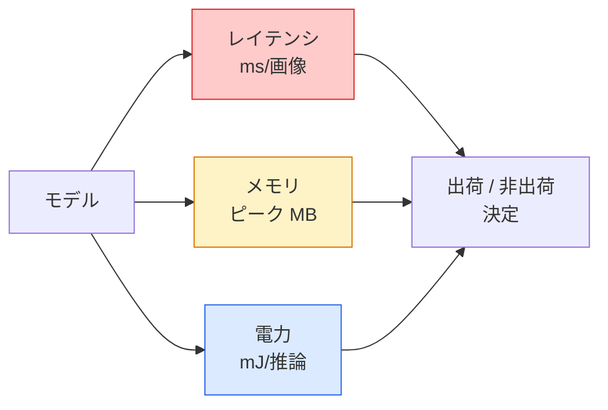

# リアルタイム視覚 — エッジデプロイメント

> エッジ推論とは、90%精度のモデルを2GBのRAMを持つデバイスで30fpsで動作させる規律だ。精度の1パーセントポイントごとにレイテンシのミリ秒と交換される。

**タイプ:** 学習 + 構築
**言語:** Python
**前提条件:** Phase 4 レッスン04（画像分類）、Phase 10 レッスン11（量子化）
**所要時間:** 約75分

## 学習目標

- PyTorchモデルの推論レイテンシ、ピークメモリ、スループットを測定し、FLOPs / パラメータ数 / レイテンシのトレードオフを理解する
- PyTorchのポスト訓練量子化を使って視覚モデルをINT8に量子化し、精度損失が1%未満であることを確認する
- ONNXにエクスポートし、ONNX RuntimeまたはTensorRTでコンパイルする；最も一般的な3つのエクスポート失敗とその修正を挙げる
- エッジ制約に対してMobileNetV3、EfficientNet-Lite、ConvNeXt-Tiny、MobileViTのどれを選ぶべきかを説明する

## 問題

訓練時の視覚モデルは浮動小数点の怪物だ。1億パラメータ、1順伝播あたり10GFLOPs、2GBのVRAM。これらはどれも携帯電話、車のインフォテインメントユニット、産業用カメラ、ドローンには収まらない。視覚システムを出荷するということは、100倍小さい予算に同じ予測を収めることを意味する。

3つのノブがほとんどの仕事をする：モデル選択（同じレシピの小さなアーキテクチャ）、量子化（FP32の代わりにINT8）、推論ランタイム（ONNX Runtime、TensorRT、Core ML、TFLite）。これらを正しく設定することが、ワークステーションで動くデモと30ドルのカメラモジュールで出荷できる製品の違いだ。

このレッスンでは測定の規律を最初に確立し（測定できないものは最適化できない）、その後3つのノブを説明する。すべてのエッジランタイムを学ぶことが目標ではなく、どのレバーが存在するか、そして各レバーが自分が思う通りに動作することを確認する方法を知ることが目標だ。

## コンセプト

### 3つの予算



- **レイテンシ**：p50、p95、p99。p50だけを平均化するとリアルタイムシステムで重要なテール動作が隠れる。
- **ピークメモリ**：デバイスが見る最大値、定常状態の平均ではない。組み込みターゲットではOOMが致命的なため重要。
- **電力/エネルギー**：バッテリー駆動デバイスでの推論あたりのミリジュール。CPU/GPU利用率 × 時間でよくプロキシされる。

（モデル、レイテンシ、メモリ、精度）の表がエッジ決定の根拠となる。すべてのセルはワークステーションではなくターゲットデバイスで測定される。

### 測定の規律

すべてのエッジプロファイルが従うべき3つのルール：

1. 測定前に5〜10回のダミー順伝播でモデルを**ウォームアップ**する。コールドキャッシュとJITコンパイルが代表的でない最初の数値を生成する。
2. タイミングブロックの前後で `torch.cuda.synchronize()` を使ってGPUワークロードを**同期**する。これなしではカーネル実行ではなくカーネルディスパッチを測定している。
3. **入力サイズを本番解像度に固定**する。224x224でのレイテンシは512x512でのレイテンシではない。

### プロキシとしてのFLOPs

FLOPs（推論あたりの浮動小数点演算数）はレイテンシのための安価でデバイスに依存しないプロキシだ。アーキテクチャ比較に有用だが、絶対的な実際の時間としては誤解を招く。FLOPsが10%多いモデルが実際には2倍高速な場合もある（深さ方向畳み込みはハードウェアフレンドリーでよくコンパイルされるが、大きな7x7畳み込みはそうでない）。

ルール：アーキテクチャ探索にはFLOPsを使い、デプロイメント決定にはオンデバイスレイテンシを使う。

### 量子化を1段落で

FP32の重みと活性化をINT8に置き換える。モデルサイズは4倍減、メモリ帯域幅は4倍減、INT8カーネルを持つハードウェア（すべての現代的なモバイルSoC、テンサーコアを持つすべてのNVIDIA GPU）では計算量が2〜4倍減。視覚タスクでのポスト訓練静的量子化による精度損失は通常0.1〜1パーセントポイントだ。

種類：

- **動的** — 重みをINT8に量子化し、活性化はFPで計算。簡単、小さな高速化。
- **静的（ポスト訓練）** — 重みを量子化し、小さな較正セットで活性化範囲を較正。動的よりはるかに高速。
- **量子化対応訓練（QAT）** — 訓練中に量子化をシミュレートしてモデルがそれに対応して学習する。最良の精度、ラベル付きデータが必要。

視覚のために、ポスト訓練静的量子化は5%の労力で95%の恩恵を与える。PTQからの精度損失が許容できない場合のみQATを使う。

### プルーニングと蒸留

- **プルーニング** — 重要でない重み（大きさベース）やチャンネル（構造化）を除去する。過剰パラメータ化されたモデルでよく機能する；すでにコンパクトなアーキテクチャではあまり有用でない。
- **蒸留** — 大きなティーチャーのロジットを模倣するように小さなスチューデントを訓練する。モデルを縮小することで失われた精度のほとんどを回復することが多い。本番エッジモデルの標準。

### 推論ランタイム

- **PyTorchイーガー** — 遅い、デプロイメントには使わない。開発のみ。
- **TorchScript** — レガシー。`torch.compile` とONNXエクスポートに取って代わられた。
- **ONNX Runtime** — 中立なランタイム。CPU、CUDA、CoreML、TensorRT、OpenVINOはすべてONNXプロバイダーを持つ。ここから始める。
- **TensorRT** — NVIDIAのコンパイラ。NVIDIA GPU（ワークステーションとJetson）での最良のレイテンシ。ONNX Runtimeまたはスタンドアロンと統合。
- **Core ML** — AppleのiOS/macOS用ランタイム。`.mlmodel` または `.mlpackage` が必要。
- **TFLite** — Googleのアンドロイド/ARM用ランタイム。`.tflite` が必要。
- **OpenVINO** — IntelのCPU/VPU用ランタイム。`.xml` + `.bin` が必要。

実際のところ：PyTorch -> ONNX -> ターゲット用のランタイムを選ぶ。ONNXが共通言語だ。

### エッジアーキテクチャ選択表

| 予算 | モデル | 理由 |
|------|--------|------|
| < 3Mパラメータ | MobileNetV3-Small | どこでもコンパイルでき、良いベースライン |
| 3〜10M | EfficientNet-Lite-B0 | TFLiteでのパラメータあたりの最良精度 |
| 10〜20M | ConvNeXt-Tiny | パラメータあたりの最良精度、CPU対応 |
| 20〜30M | MobileViT-SまたはEfficientViT | ImageNet精度を持つトランスフォーマー |
| 30〜80M | Swin-V2-Tiny | スタックがウィンドウアテンションをサポートする場合 |

特定の理由がない限り、これらすべてをINT8に量子化する。

## 実装

### ステップ1：レイテンシの正しい測定

```python
import time
import torch

def measure_latency(model, input_shape, device="cpu", warmup=10, iters=50):
    model = model.to(device).eval()
    x = torch.randn(input_shape, device=device)
    with torch.no_grad():
        for _ in range(warmup):
            model(x)
        if device == "cuda":
            torch.cuda.synchronize()
        times = []
        for _ in range(iters):
            if device == "cuda":
                torch.cuda.synchronize()
            t0 = time.perf_counter()
            model(x)
            if device == "cuda":
                torch.cuda.synchronize()
            times.append((time.perf_counter() - t0) * 1000)
    times.sort()
    return {
        "p50_ms": times[len(times) // 2],
        "p95_ms": times[int(len(times) * 0.95)],
        "p99_ms": times[int(len(times) * 0.99)],
        "mean_ms": sum(times) / len(times),
    }
```

ウォームアップ、同期、`time.perf_counter()` を使用。平均だけでなくパーセンタイルを報告する。

### ステップ2：パラメータ数とFLOPカウント

```python
def parameter_count(model):
    return sum(p.numel() for p in model.parameters())

def flops_estimate(model, input_shape):
    """
    Rough FLOP count for a conv/linear-only model. For production use `fvcore` or `ptflops`.
    """
    total = 0
    def conv_hook(m, inp, out):
        nonlocal total
        c_out, c_in, kh, kw = m.weight.shape
        h, w = out.shape[-2:]
        total += 2 * c_in * c_out * kh * kw * h * w
    def linear_hook(m, inp, out):
        nonlocal total
        total += 2 * m.in_features * m.out_features
    hooks = []
    for m in model.modules():
        if isinstance(m, torch.nn.Conv2d):
            hooks.append(m.register_forward_hook(conv_hook))
        elif isinstance(m, torch.nn.Linear):
            hooks.append(m.register_forward_hook(linear_hook))
    model.eval()
    with torch.no_grad():
        model(torch.randn(input_shape))
    for h in hooks:
        h.remove()
    return total
```

実際のプロジェクトには `fvcore.nn.FlopCountAnalysis` または `ptflops` を使う；すべてのモジュールタイプを正しく処理する。

### ステップ3：ポスト訓練静的量子化

```python
def quantise_ptq(model, calibration_loader, backend="x86"):
    import torch.ao.quantization as tq
    model = model.eval().cpu()
    model.qconfig = tq.get_default_qconfig(backend)
    tq.prepare(model, inplace=True)
    with torch.no_grad():
        for x, _ in calibration_loader:
            model(x)
    tq.convert(model, inplace=True)
    return model
```

3つのステップ：設定、準備（オブザーバーの挿入）、実データで較正、変換（融合 + 量子化）。モデルは融合されている必要があり（`Conv -> BN -> ReLU` -> `ConvBnReLU`）、`torch.ao.quantization.fuse_modules` がこれを処理する。

### ステップ4：ONNXへのエクスポート

```python
def export_onnx(model, sample_input, path="model.onnx"):
    model = model.eval()
    torch.onnx.export(
        model,
        sample_input,
        path,
        input_names=["input"],
        output_names=["output"],
        dynamic_axes={"input": {0: "batch"}, "output": {0: "batch"}},
        opset_version=17,
    )
    return path
```

`opset_version=17` は2026年現在の安全なデフォルトだ。`dynamic_axes` により任意のバッチサイズでONNXモデルを実行できる。

### ステップ5：ベンチマークと各設定の比較

```python
import torch.nn as nn
from torchvision.models import mobilenet_v3_small

def compare_regimes():
    model = mobilenet_v3_small(weights=None, num_classes=10)
    params = parameter_count(model)
    flops = flops_estimate(model, (1, 3, 224, 224))
    lat_fp32 = measure_latency(model, (1, 3, 224, 224), device="cpu")
    print(f"FP32 MobileNetV3-Small: {params:,} params  {flops/1e9:.2f} GFLOPs  "
          f"p50={lat_fp32['p50_ms']:.2f}ms  p95={lat_fp32['p95_ms']:.2f}ms")
```

`resnet50`、`efficientnet_v2_s`、`convnext_tiny` で同じ関数を実行すれば、デプロイメント決定に必要な比較表が得られる。

## 活用

本番スタックは3つのパスの1つに収束する：

- **Web / サーバーレス**：PyTorch -> ONNX -> ONNX Runtime（CPUまたはCUDAプロバイダー）。最も簡単、ほとんどの場合に十分。
- **NVIDIAエッジ（Jetson、GPUサーバー）**：PyTorch -> ONNX -> TensorRT。最良のレイテンシ、最大のエンジニアリング労力。
- **モバイル**：PyTorch -> ONNX -> Core ML（iOS）またはTFLite（Android）。エクスポート前に量子化する。

測定には、`torch-tb-profiler`、`nvprof` / `nsys`、macOSのInstrumentsがレイヤーごとの内訳を提供する。`benchmark_app`（OpenVINO）と `trtexec`（TensorRT）はスタンドアロンCLI数値を提供する。

## 成果物

このレッスンの成果物：

- `outputs/prompt-edge-deployment-planner.md` — ターゲットデバイスとレイテンシSLAを考慮してバックボーン、量子化戦略、ランタイムを選ぶプロンプト。
- `outputs/skill-latency-profiler.md` — ウォームアップ、同期、パーセンタイル、メモリ追跡を含む完全なレイテンシベンチマークスクリプトを作成するスキル。

## 演習

1. **（簡単）** CPUで224x224の `resnet18`、`mobilenet_v3_small`、`efficientnet_v2_s`、`convnext_tiny` のp50レイテンシを測定する。表を報告し、精度/ms比が最も良いアーキテクチャを特定する。
2. **（中級）** `mobilenet_v3_small` にポスト訓練静的量子化を適用する。CIFAR-10または類似の保留テストサブセットでのFP32対INT8レイテンシと精度損失を報告する。
3. **（上級）** `convnext_tiny` をONNXにエクスポートし、`CPUExecutionProvider` を使って `onnxruntime` で実行し、PyTorchイーガーベースラインとレイテンシを比較する。ONNX Runtimeが高速な最初の層を特定してその理由を説明する。

## 用語集

| 用語 | 人々が言うこと | 実際の意味 |
|------|----------------|------------|
| レイテンシ | "どれだけ速いか" | 入力から出力までの時間；p50/p95/p99パーセンタイル、平均ではない |
| FLOPs | "モデルサイズ" | 順伝播あたりの浮動小数点演算数；計算コストの概算プロキシ |
| INT8量子化 | "8ビット" | FP32の重み/活性化を8ビット整数に置き換える；約4倍小さく、2〜4倍高速 |
| PTQ | "ポスト訓練量子化" | 再訓練なしで訓練済みモデルを量子化する；簡単、通常は十分 |
| QAT | "量子化対応訓練" | 訓練中に量子化をシミュレートする；最良の精度、ラベル付きデータが必要 |
| ONNX | "中立フォーマット" | すべての主要推論ランタイムがサポートするモデル交換フォーマット |
| TensorRT | "NVIDIAコンパイラ" | ONNXをNVIDIA GPU向けの最適化されたエンジンにコンパイルする |
| 蒸留 | "ティーチャー -> スチューデント" | 大きなモデルのロジットを模倣するように小さなモデルを訓練する；失われた精度のほとんどを回復 |

## 参考文献

- [EfficientNet (Tan & Le, 2019)](https://arxiv.org/abs/1905.11946) — 効率的なアーキテクチャのための複合スケーリング
- [MobileNetV3 (Howard et al., 2019)](https://arxiv.org/abs/1905.02244) — h-swishとスクイーズエキサイトを持つモバイルファーストアーキテクチャ
- [A Practical Guide to TensorRT Optimization (NVIDIA)](https://developer.nvidia.com/blog/accelerating-model-inference-with-tensorrt-tips-and-best-practices-for-pytorch-users/) — 実際に論文の数値を達成する方法
- [ONNX Runtime docs](https://onnxruntime.ai/docs/) — 量子化、グラフ最適化、プロバイダー選択
