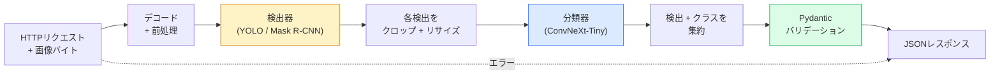

# 完全な視覚パイプラインの構築 — 総合演習

> 本番の視覚システムはデータコントラクトで繋がれたモデルとルールの連鎖だ。コンポーネントはすでにこのPhaseに揃っている；総合演習でエンドツーエンドに繋ぐ。

**タイプ:** 構築
**言語:** Python
**前提条件:** Phase 4 レッスン01〜15
**所要時間:** 約120分

## 学習目標

- 物体を検出し、それらを分類し、すべての失敗パスを処理しながら構造化JSONを出力する本番視覚パイプラインを設計する
- 検出器（Mask R-CNNまたはYOLO）、分類器（ConvNeXt-Tiny）、データコントラクト（Pydantic）を1つのサービスに組み込む
- エンドツーエンドのパイプラインをベンチマークし、最初のボトルネック（通常は前処理、次に検出器）を特定する
- 画像アップロードを受け付け、パイプラインを実行し、分類付きの検出結果を返す最小限のFastAPIサービスを出荷する

## 問題

個々の視覚モデルは有用だ；視覚製品はそれらの連鎖だ。小売棚の監査は検出器と商品分類器と価格OCRパイプラインだ。自律走行は2D検出器と3D検出器とセグメンターとトラッカーとプランナーだ。医療予備スクリーニングはセグメンターと領域分類器と医療従事者UIだ。

そのような連鎖を繋ぐことが、MLプロトタイプと製品を分けるものだ。モデル間のすべてのインターフェースは新しいバグの場所だ。すべての座標変換、すべての正規化、すべてのマスクリサイズはサイレントな失敗候補だ。パイプラインはその最も弱いインターフェースと同じ強さだ。

この総合演習では最小限の実用的なパイプラインを設定する：検出 + 分類 + 構造化出力 + サービングレイヤー。Phase 4の他のすべてはこのスケルトンに組み込まれる：Mask R-CNNをYOLOv8に交換し、OCRヘッドを追加し、セグメンテーションブランチを追加し、トラッカーを追加する。アーキテクチャは安定しており、コンポーネントはプラグ可能だ。

## コンセプト

### パイプライン



7つのステージ。2つのモデルステージが高コストで、残りの5つにバグが住む。

### Pydanticによるデータコントラクト

すべてのモデルの境界が型付きオブジェクトになる。サイレントな失敗をうるさい失敗に変える。

```
Detection(
    box: tuple[float, float, float, float],   # (x1, y1, x2, y2), absolute pixels
    score: float,                              # [0, 1]
    class_id: int,                             # from detector's label map
    mask: Optional[list[list[int]]],           # RLE-encoded if present
)

PipelineResult(
    image_id: str,
    detections: list[Detection],
    classifications: list[Classification],
    inference_ms: float,
)
```

検出器が `(x1, y1, x2, y2)` の代わりに `(cx, cy, w, h)` でボックスを返すと、Pydanticのバリデーションが境界で失敗し、空のリージョンをサイレントに返すダウンストリームクロップをデバッグする代わりにすぐに判明する。

### レイテンシの分布

ほぼすべての視覚パイプラインで3つの真実が成立する：

1. **前処理が最大の単一ブロックであることが多い。** JPEGのデコード、色空間の変換、リサイズ — これらはCPUバウンドで忘れやすい。
2. **検出器がGPU時間を支配する。** GPU時間の70〜90%が検出の順伝播だ。
3. **後処理（NMS、RLEエンコード/デコード）はGPUでは安価だが、CPUでは高価だ。** 実際のターゲットでプロファイルを常に取ること。

分布を知ることが最適化を優先順位付けされたリストに変える。

### 失敗モード

- **空の検出** — 空のリストを返す、クラッシュしない。ログを取る。
- **境界外のボックス** — クロップ前に画像サイズにクランプする。
- **小さなクロップ** — 分類器の最小入力サイズより小さいボックスの分類をスキップする。
- **破損したアップロード** — 500ではなく特定のエラーコードで400レスポンスを返す。
- **モデル読み込み失敗** — 最初のリクエスト時ではなく、サービス起動時に失敗させる。

本番パイプラインは失敗を隠す汎用的な `try/except` を書かずにこれらを処理する。各失敗は名前付きコードとレスポンスを持つ。

### バッチング

本番サービスは複数のクライアントにサービスする。リクエストをまたいだ検出と分類のバッチングがスループットを増加させる。トレードオフ：バッチが埋まるのを待つための追加レイテンシ。典型的な設定：最大20msリクエストを収集し、バッチ処理し、レスポンスを配布する。`torchserve` と `triton` はこれをネイティブで行う；予測可能な負荷の小さなサービスは独自のマイクロバッチャーを作る。

## 実装

### ステップ1：データコントラクト

```python
from pydantic import BaseModel, Field
from typing import List, Optional, Tuple

class Detection(BaseModel):
    box: Tuple[float, float, float, float]
    score: float = Field(ge=0, le=1)
    class_id: int = Field(ge=0)
    mask_rle: Optional[str] = None


class Classification(BaseModel):
    detection_index: int
    class_id: int
    class_name: str
    score: float = Field(ge=0, le=1)


class PipelineResult(BaseModel):
    image_id: str
    detections: List[Detection]
    classifications: List[Classification]
    inference_ms: float
```

5秒のコードが本格的なパイプラインでの1時間のデバッグを節約する。

### ステップ2：最小限のPipelineクラス

```python
import time
import numpy as np
import torch
from PIL import Image

class VisionPipeline:
    def __init__(self, detector, classifier, class_names,
                 device="cpu", min_crop=32):
        self.detector = detector.to(device).eval()
        self.classifier = classifier.to(device).eval()
        self.class_names = class_names
        self.device = device
        self.min_crop = min_crop

    def preprocess(self, image):
        """
        image: PIL.Image or np.ndarray (H, W, 3) uint8
        returns: CHW float tensor on device
        """
        if isinstance(image, Image.Image):
            image = np.asarray(image.convert("RGB"))
        tensor = torch.from_numpy(image).permute(2, 0, 1).float() / 255.0
        return tensor.to(self.device)

    @torch.no_grad()
    def detect(self, image_tensor):
        return self.detector([image_tensor])[0]

    @torch.no_grad()
    def classify(self, crops):
        if len(crops) == 0:
            return []
        batch = torch.stack(crops).to(self.device)
        logits = self.classifier(batch)
        probs = logits.softmax(-1)
        scores, cls = probs.max(-1)
        return list(zip(cls.tolist(), scores.tolist()))

    def run(self, image, image_id="anonymous"):
        t0 = time.perf_counter()
        tensor = self.preprocess(image)
        det = self.detect(tensor)

        crops = []
        detections = []
        valid_indices = []
        for i, (box, score, cls) in enumerate(zip(det["boxes"], det["scores"], det["labels"])):
            x1, y1, x2, y2 = [max(0, int(b)) for b in box.tolist()]
            x2 = min(x2, tensor.shape[-1])
            y2 = min(y2, tensor.shape[-2])
            detections.append(Detection(
                box=(x1, y1, x2, y2),
                score=float(score),
                class_id=int(cls),
            ))
            if (x2 - x1) < self.min_crop or (y2 - y1) < self.min_crop:
                continue
            crop = tensor[:, y1:y2, x1:x2]
            crop = torch.nn.functional.interpolate(
                crop.unsqueeze(0),
                size=(224, 224),
                mode="bilinear",
                align_corners=False,
            )[0]
            crops.append(crop)
            valid_indices.append(i)

        class_preds = self.classify(crops)

        classifications = []
        for valid_idx, (cls_id, cls_score) in zip(valid_indices, class_preds):
            classifications.append(Classification(
                detection_index=valid_idx,
                class_id=int(cls_id),
                class_name=self.class_names[cls_id],
                score=float(cls_score),
            ))

        return PipelineResult(
            image_id=image_id,
            detections=detections,
            classifications=classifications,
            inference_ms=(time.perf_counter() - t0) * 1000,
        )
```

すべてのインターフェースが型付きだ。すべての失敗パスに具体的な処理決定がある。

### ステップ3：検出器と分類器の接続

```python
from torchvision.models.detection import maskrcnn_resnet50_fpn_v2
from torchvision.models import convnext_tiny

# Use ImageNet-pretrained weights for a realistic pipeline without training
detector = maskrcnn_resnet50_fpn_v2(weights="DEFAULT")
classifier = convnext_tiny(weights="DEFAULT")
class_names = [f"imagenet_class_{i}" for i in range(1000)]

pipe = VisionPipeline(detector, classifier, class_names)

# Smoke test with a synthetic image
test_image = (np.random.rand(400, 600, 3) * 255).astype(np.uint8)
result = pipe.run(test_image, image_id="demo")
print(result.model_dump_json(indent=2)[:500])
```

### ステップ4：FastAPIサービス

```python
from fastapi import FastAPI, UploadFile, HTTPException
from io import BytesIO

app = FastAPI()
pipe = None  # initialised on startup

@app.on_event("startup")
def load():
    global pipe
    detector = maskrcnn_resnet50_fpn_v2(weights="DEFAULT").eval()
    classifier = convnext_tiny(weights="DEFAULT").eval()
    pipe = VisionPipeline(detector, classifier, class_names=[f"c{i}" for i in range(1000)])

@app.post("/detect")
async def detect_endpoint(file: UploadFile):
    if file.content_type not in {"image/jpeg", "image/png", "image/webp"}:
        raise HTTPException(status_code=400, detail="unsupported image type")
    data = await file.read()
    try:
        img = Image.open(BytesIO(data)).convert("RGB")
    except Exception:
        raise HTTPException(status_code=400, detail="cannot decode image")
    result = pipe.run(img, image_id=file.filename or "upload")
    return result.model_dump()
```

`uvicorn main:app --host 0.0.0.0 --port 8000` で実行する。`curl -F 'file=@dog.jpg' http://localhost:8000/detect` でテストする。

### ステップ5：パイプラインのベンチマーク

```python
import time

def benchmark(pipe, num_runs=20, image_size=(400, 600)):
    img = (np.random.rand(*image_size, 3) * 255).astype(np.uint8)
    pipe.run(img)  # warm up

    stages = {"preprocess": [], "detect": [], "classify": [], "total": []}
    for _ in range(num_runs):
        t0 = time.perf_counter()
        tensor = pipe.preprocess(img)
        t1 = time.perf_counter()
        det = pipe.detect(tensor)
        t2 = time.perf_counter()
        crops = []
        for box in det["boxes"]:
            x1, y1, x2, y2 = [max(0, int(b)) for b in box.tolist()]
            x2 = min(x2, tensor.shape[-1])
            y2 = min(y2, tensor.shape[-2])
            if (x2 - x1) >= pipe.min_crop and (y2 - y1) >= pipe.min_crop:
                crop = tensor[:, y1:y2, x1:x2]
                crop = torch.nn.functional.interpolate(
                    crop.unsqueeze(0), size=(224, 224), mode="bilinear", align_corners=False
                )[0]
                crops.append(crop)
        pipe.classify(crops)
        t3 = time.perf_counter()
        stages["preprocess"].append((t1 - t0) * 1000)
        stages["detect"].append((t2 - t1) * 1000)
        stages["classify"].append((t3 - t2) * 1000)
        stages["total"].append((t3 - t0) * 1000)

    for stage, times in stages.items():
        times.sort()
        print(f"{stage:12s}  p50={times[len(times)//2]:7.1f} ms  p95={times[int(len(times)*0.95)]:7.1f} ms")
```

CPUでの典型的な出力：前処理約3ms、検出300〜500ms、分類20〜40ms、合計350〜550ms。GPUでは検出が20〜40msになり、前処理と分類の相対的な重要度が高まる。

## 活用

本番テンプレートは同じ構造に収束し、さらに：

- **モデルバージョニング** — レスポンスには常にモデル名と重みハッシュをログする。
- **リクエストごとのトレースID** — 遅いレスポンスをステージと関連付けられるように、すべてのリクエストのすべてのステージタイミングをログする。
- **フォールバックパス** — 分類器がタイムアウトした場合、リクエスト全体を失敗させるのではなく、分類なしで検出結果を返す。
- **安全フィルター** — NSFW/PIIフィルターが分類後、レスポンスがサービスを出る前に実行される。
- **バッチエンドポイント** — 一括処理のための画像URLのリストを受け入れる `/detect_batch`。

本番サービングには `torchserve`、`Triton Inference Server`、`BentoML` がバッチング、バージョニング、メトリクス、ヘルスチェックをそのまま処理する。`FastAPI` を直接実行することはプロトタイプと小規模製品には問題ない。

## 成果物

このレッスンの成果物：

- `outputs/prompt-vision-service-shape-reviewer.md` — 視覚サービスのコードをコントラクト/レスポンス形状の違反でレビューし、最初の重大なバグを指摘するプロンプト。
- `outputs/skill-pipeline-budget-planner.md` — ターゲットレイテンシとスループットを考慮して、各パイプラインステージに時間予算を割り当て、最初に予算を超えるステージを指摘するスキル。

## 演習

1. **（簡単）** 任意のオープンデータセットから10枚の画像でパイプラインを実行する。ステージごとの平均時間と画像ごとの検出数の分布を報告する。
2. **（中級）** `Detection` にマスク出力フィールドを追加してRLEとしてエンコードする。10オブジェクト画像でもJSONが1MB未満であることを確認する。
3. **（上級）** 分類器の前にマイクロバッチャーを追加する：最大10msのクロップを収集し、1回のGPU呼び出しですべてを分類し、リクエストごとに結果を返す。毎秒5同時リクエストでのスループット向上と追加されたレイテンシを測定する。

## 用語集

| 用語 | 人々が言うこと | 実際の意味 |
|------|----------------|------------|
| パイプライン | "システム" | 各ペア間に型付きインターフェースを持つ前処理、推論、後処理の順序付きチェーン |
| データコントラクト | "スキーマ" | すべてのステージの入力と出力が従うPydantic/データクラス定義；境界で統合バグを検出 |
| 前処理 | "モデルの前" | デコード、色変換、リサイズ、正規化；通常最大のCPU時間シンク |
| 後処理 | "モデルの後" | NMS、マスクリサイズ、閾値処理、RLEエンコード；GPUでは安価、CPUでは高価 |
| マイクロバッチャー | "収集してから順伝播" | 複数のリクエストに対して固定ウィンドウ待機し、単一のバッチ順伝播を実行するアグリゲーター |
| トレースID | "リクエストID" | 遅いリクエストをエンドツーエンドで追跡できるように各ステージでログされるリクエストごとの識別子 |
| 失敗コード | "名前付きエラー" | 汎用500の代わりに失敗クラスごとの特定のエラーコード；クライアントのリトライロジックを可能にする |
| ヘルスチェック | "レディネスプローブ" | サービスがリクエストに答えられるかを報告する安価なエンドポイント；ロードバランサーがこれに依存する |

## 参考文献

- [Full Stack Deep Learning — Deploying Models](https://fullstackdeeplearning.com/course/2022/lecture-5-deployment/) — 本番MLデプロイメントの標準的な概要
- [BentoML docs](https://docs.bentoml.com) — バッチング、バージョニング、メトリクスを持つサービングフレームワーク
- [torchserve docs](https://pytorch.org/serve/) — PyTorchの公式サービングライブラリ
- [NVIDIA Triton Inference Server](https://developer.nvidia.com/triton-inference-server) — バッチングとマルチモデルサポートを持つ高スループットサービング
