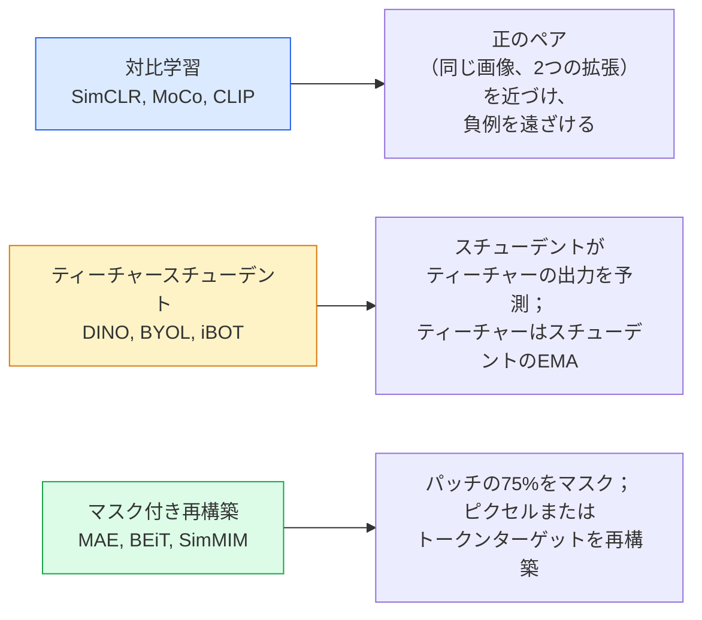

# 自己教師あり視覚学習 — SimCLR、DINO、MAE

> ラベルが教師あり視覚学習のボトルネックだ。自己教師あり事前学習はそれを取り除く：1億枚のラベルなし画像から視覚的特徴を学習し、1万枚のラベル付き画像でファインチューニングする。

**タイプ:** 学習 + 構築
**言語:** Python
**前提条件:** Phase 4 レッスン04（画像分類）、Phase 4 レッスン14（ViT）
**所要時間:** 約75分

## 学習目標

- 3つの主要な自己教師ありファミリー — 対比学習（SimCLR）、ティーチャースチューデント（DINO）、マスク付き再構築（MAE）— をトレースし、各々が最適化するものを述べる
- InfoNCE損失をゼロから実装し、なぜバッチサイズ512は機能するが32は失敗するかを説明する
- MAEの75%マスク比率が恣意的でない理由と、テキスト向けBERTの15%との違いを説明する
- DINOv2またはMAE ImageNetチェックポイントを線形プローブとゼロショット検索に使用する

## 問題

教師ありImageNetには130万枚のラベル付き画像があり、アノテーションに推定1000万ドルかかった。医療と産業のデータセットはより小さく、ラベル付けにさらにコストがかかる。すべての視覚チームが問う：安価なラベルなしデータ — YouTubeフレーム、ウェブクロール、ウェブカムの映像、衛星スキャン — で事前学習し、小さなラベル付きセットでファインチューニングできるか？

自己教師あり学習がその答えだ。LAIONまたはJFTで訓練された現代の自己教師ありViTは、ファインチューニング時に教師ありImageNetの精度と同等かそれ以上に達する。また、教師あり事前学習よりも下流タスク（検出、セグメンテーション、深度）への転移が優れている。DINOv2（Meta、2023年）とMAE（Meta、2022年）は転移可能な視覚特徴の現在の本番デフォルトだ。

概念的な転換は、プレテキストタスク — モデルが訓練されること — が下流タスクである必要はないということだ。重要なのは、モデルが有用な特徴を学習することを強制することだ。グレースケール画像の色を予測する、画像を回転させてモデルに回転を分類させる、パッチをマスクして再構築させる — これらすべてが機能した。スケールする3つのアプローチは対比学習、ティーチャースチューデント蒸留、マスク付き再構築だ。

## コンセプト

### 3つのファミリー



### 対比学習（SimCLR）

1枚の画像を取り、2つのランダムな拡張を適用して2つのビューを得る。同じエンコーダと射影ヘッドを通じて両方を送る。「これら2つの埋め込みは近くにあるべきだ」および「この埋め込みはバッチ内の他のすべての画像の埋め込みから遠くにあるべきだ」という損失関数を最小化する。

```
Loss for positive pair (z_i, z_j) among 2N views per batch:

   L_ij = -log( exp(sim(z_i, z_j) / tau) / sum_k in batch \ {i} exp(sim(z_i, z_k) / tau) )

sim = cosine similarity
tau = temperature (0.1 standard)
```

これがInfoNCE損失だ。正例あたり多くの負例が必要なため、バッチサイズが重要 — SimCLRには512〜8192が必要だ。MoCoは負例数をバッチサイズから切り離すために過去のバッチのモメンタムキューを導入した。

### ティーチャースチューデント（DINO）

同じアーキテクチャの2つのネットワーク：スチューデントとティーチャー。ティーチャーはスチューデントの重みの指数移動平均（EMA）だ。両方が画像の拡張ビューを見る。スチューデントの出力はティーチャーのものと一致するように訓練される — 明示的な負例なし。

```
loss = CE( student_output(view_1),  teacher_output(view_2) )
     + CE( student_output(view_2),  teacher_output(view_1) )

teacher_weights = m * teacher_weights + (1 - m) * student_weights   (m ≈ 0.996)
```

なぜ「定数を予測する」に崩壊しないか：ティーチャーの出力は中心化され（次元ごとの平均を引く）、鋭化される（小さな温度で割る）。中心化は1つの次元が支配的になるのを防ぐ；鋭化は一様への出力崩壊を防ぐ。

DINOはDINOv2が1億4200万枚のキュレーションされた画像でスケールアップしたものだ。得られた特徴はゼロショット視覚検索と密な予測の現在のSOTAだ。

### マスク付き再構築（MAE）

ViT入力のパッチの75%をマスクする。見えている25%だけをエンコーダに通す。小さなデコーダがエンコーダの出力とマスクされた位置のマスクトークンを受け取り、マスクされたパッチのピクセルを再構築するように訓練される。

```
Encoder:  visible 25% of patches -> features
Decoder:  features + mask tokens at masked positions -> reconstructed pixels
Loss:     MSE between reconstructed and original pixels on masked patches only
```

MAEを機能させる重要な設計選択：

- **75%マスク比率** — 高い。エンコーダが意味的特徴を学習することを強制する；25%を再構築するのはほぼ自明だ（隣接ピクセルは非常に相関しているためCNNで解ける）。
- **非対称エンコーダ/デコーダ** — 大きなViTエンコーダは見えているパッチのみを処理；小さなデコーダ（8層、512次元）が再構築を処理。ナイーブなBEiTより3倍高速な事前学習。
- **ピクセル空間再構築ターゲット** — BEiTのトークン化ターゲットよりシンプルで、ViTではより良く機能する。

事前学習後、デコーダを捨てる。エンコーダが特徴抽出器だ。

### なぜ75%で15%でないか

BERTはトークンの15%をマスクする。MAEはパッチの75%をマスクする。違いは情報密度にある。

- 自然言語はトークンあたりの高いエントロピーを持つ。15%のトークンを予測するのは、各マスクされた位置に多くの妥当な補完があるため、依然として難しい。
- 画像パッチは低いエントロピーを持つ — マスクされていない近傍がマスクされたパッチのピクセルをほぼ正確に決定することが多い。予測が意味的理解を必要とするようにするには、積極的にマスクしなければならない。

75%は単純な空間外挿でタスクが解けないほど高い；エンコーダは画像コンテンツを表現しなければならない。

### 線形プローブ評価

自己教師あり事前学習後の標準的な評価は**線形プローブ**だ：エンコーダをフリーズし、ImageNetラベルで上部に単一の線形分類器を訓練する。トップ1精度を報告する。

- SimCLR ResNet-50：約71%（2020年）
- DINO ViT-S/16：約77%（2021年）
- MAE ViT-L/16：約76%（2022年）
- DINOv2 ViT-g/14：約86%（2023年）

線形プローブは特徴品質の純粋な測定だ；ファインチューニングは通常2〜5ポイント追加するが、ヘッドの再訓練の効果も混在する。

## 実装

### ステップ1：2ビューデータ拡張パイプライン

```python
import torch
import torchvision.transforms as T

two_view_train = lambda: T.Compose([
    T.RandomResizedCrop(96, scale=(0.2, 1.0)),
    T.RandomHorizontalFlip(),
    T.ColorJitter(0.4, 0.4, 0.4, 0.1),
    T.RandomGrayscale(p=0.2),
    T.ToTensor(),
])


class TwoViewDataset(torch.utils.data.Dataset):
    def __init__(self, base):
        self.base = base
        self.aug = two_view_train()

    def __len__(self):
        return len(self.base)

    def __getitem__(self, i):
        img, _ = self.base[i]
        v1 = self.aug(img)
        v2 = self.aug(img)
        return v1, v2
```

各 __getitem__ は同じ画像の2つの拡張ビューを返す；ラベルは不要だ。

### ステップ2：InfoNCE損失

```python
import torch.nn.functional as F

def info_nce(z1, z2, tau=0.1):
    """
    z1, z2: (N, D) L2-normalised embeddings of paired views
    """
    N, D = z1.shape
    z = torch.cat([z1, z2], dim=0)  # (2N, D)
    sim = z @ z.T / tau              # (2N, 2N)

    mask = torch.eye(2 * N, dtype=torch.bool, device=z.device)
    sim = sim.masked_fill(mask, float("-inf"))

    targets = torch.cat([torch.arange(N, 2 * N), torch.arange(0, N)]).to(z.device)
    return F.cross_entropy(sim, targets)
```

呼び出す前に埋め込みをL2正規化する。`tau=0.1` はSimCLRのデフォルト；低くすると損失が鋭くなり、より多くの負例が必要になる。

### ステップ3：InfoNCEの健全性チェック

```python
z1 = F.normalize(torch.randn(16, 32), dim=-1)
z2 = z1.clone()
loss_same = info_nce(z1, z2, tau=0.1).item()
z2_random = F.normalize(torch.randn(16, 32), dim=-1)
loss_random = info_nce(z1, z2_random, tau=0.1).item()
print(f"InfoNCE with identical pairs:  {loss_same:.3f}")
print(f"InfoNCE with random pairs:     {loss_random:.3f}")
```

同一のペアは低い損失を与えるべきだ（大きなバッチと低温では0に近い）。ランダムなペアはlog(2N-1) = 約log(31) = 約3.4を16ペアバッチで与えるべきだ。

### ステップ4：MAEスタイルのマスキング

```python
def random_mask_indices(num_patches, mask_ratio=0.75, seed=0):
    g = torch.Generator().manual_seed(seed)
    n_keep = int(num_patches * (1 - mask_ratio))
    perm = torch.randperm(num_patches, generator=g)
    visible = perm[:n_keep]
    masked = perm[n_keep:]
    return visible.sort().values, masked.sort().values


num_patches = 196
visible, masked = random_mask_indices(num_patches, mask_ratio=0.75)
print(f"visible: {len(visible)} / {num_patches}")
print(f"masked:  {len(masked)} / {num_patches}")
```

シンプル、高速、与えられたシードに対して決定論的。実際のMAE実装はこれをバッチ化し、サンプルごとのマスクを保持する。

## 活用

DINOv2は2026年の本番標準だ：

```python
import torch
from transformers import AutoImageProcessor, AutoModel

processor = AutoImageProcessor.from_pretrained("facebook/dinov2-base")
model = AutoModel.from_pretrained("facebook/dinov2-base")
model.eval()

# Per-image embeddings for zero-shot retrieval
with torch.no_grad():
    inputs = processor(images=[pil_image], return_tensors="pt")
    outputs = model(**inputs)
    embedding = outputs.last_hidden_state[:, 0]  # CLS token
```

得られた768次元の埋め込みは現代の画像検索、密な対応付け、ゼロショット転移パイプラインのバックボーンだ。下流タスクへのファインチューニングはほとんどの場合線形ヘッドだけで十分だ。

画像-テキスト埋め込みには、SigLIPまたはOpenCLIPが同等のもので；MAEスタイルのファインチューニングには `timm` リポジトリがすべてのMAEチェックポイントを提供する。

## 成果物

このレッスンの成果物：

- `outputs/prompt-ssl-pretraining-picker.md` — データセットサイズ、計算量、下流タスクを考慮してSimCLR / MAE / DINOv2を選ぶプロンプト。
- `outputs/skill-linear-probe-runner.md` — 任意のフリーズされたエンコーダとラベル付きデータセットに対して線形プローブ評価を書くスキル。

## 演習

1. **（簡単）** 整列した埋め込みに対して温度を下げるとInfoNCE損失が下がり、ランダムな埋め込みに対して温度を下げると上がることを確認する。`tau in [0.05, 0.1, 0.2, 0.5]` 対損失のプロットを作成する。
2. **（中級）** DINOスタイルの中心バッファを実装する。中心化なしでは、スチューデントが数エポック以内に定数ベクトルに崩壊することを示す。
3. **（上級）** レッスン10のTinyUNetをバックボーンとしてCIFAR-100でMAEを訓練する。10、50、200エポックでの線形プローブ精度を報告する。MAE事前学習済み線形プローブが同じ1000枚画像サブセットでのゼロから始めた教師ありの線形プローブを上回ることを示す。

## 用語集

| 用語 | 人々が言うこと | 実際の意味 |
|------|----------------|------------|
| 自己教師あり | "ラベルなし" | ラベルなしデータから有用な表現を生成するプレテキストタスク |
| プレテキストタスク | "偽のタスク" | SSL中に使用される目的（パッチの再構築、ビューの一致）；事前学習後に捨てられる |
| 線形プローブ | "フリーズされたエンコーダ + 線形ヘッド" | 標準的なSSL評価：フリーズされた特徴量の上部に線形分類器のみを訓練する |
| InfoNCE | "対比損失" | コサイン類似度上のsoftmax；正のペアがターゲットクラス、他はすべて負例 |
| EMAティーチャー | "移動平均ティーチャー" | 重みがスチューデントの指数移動平均であるティーチャー；BYOL、MoCo、DINOが使用 |
| マスク比率 | "隠されるパッチの%" | MAE中にマスクされるパッチの割合；視覚では75%、テキストでは15% |
| 表現崩壊 | "定数出力" | エンコーダがすべての入力に対して定数ベクトルを出力するSSLの失敗；中心化、鋭化、または負例によって防がれる |
| DINOv2 | "本番SSLバックボーン" | Metaの2023年の自己教師ありViT；2026年現在、最強の汎用画像特徴 |

## 参考文献

- [SimCLR (Chen et al., 2020)](https://arxiv.org/abs/2002.05709) — 対比学習のリファレンス
- [DINO (Caron et al., 2021)](https://arxiv.org/abs/2104.14294) — モメンタム、中心化、鋭化を持つティーチャースチューデント
- [MAE (He et al., 2022)](https://arxiv.org/abs/2111.06377) — ViTのマスク付きオートエンコーダ事前学習
- [DINOv2 (Oquab et al., 2023)](https://arxiv.org/abs/2304.07193) — 自己教師ありViTを本番特徴にスケールアップ
