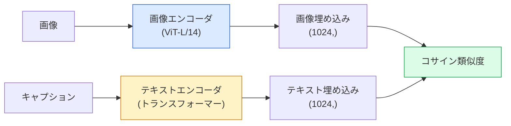

# オープンボキャブラリービジョン — CLIP

> 画像エンコーダとテキストエンコーダを同時に学習させ、マッチングする（画像、キャプション）ペアが共有空間の同じ点に収まるようにする。それがすべてのトリックだ。

**タイプ:** 構築 + 活用
**言語:** Python
**前提条件:** Phase 4 レッスン 14 (ViT)、Phase 4 レッスン 17 (自己教師あり学習)
**所要時間:** 約45分

## 学習目標

- CLIPの二塔アーキテクチャとコントラスト学習の目的関数を説明できる
- 事前学習済みCLIP（またはSigLIP）を使って、タスク固有の学習なしにゼロショット分類を実行できる
- ゼロショット分類をゼロから実装できる：クラスプロンプトをエンコードし、コサイン類似度を計算し、argmaxを取る
- CLIP、SigLIP、OpenCLIP、LLaVA/LLaMA-visionモデルを区別できる — 2026年における各モデルの用途を理解する

## 問題

従来の分類器はクローズドボキャブラリーだった：1000クラスのImageNetモデルは1000個のラベルしか予測できない。新しいカテゴリーを追加するたびに、ラベル付きデータとヘッドの再学習が必要になる。

CLIP（Radford et al.、OpenAI 2021）は、ウェブからスクレイピングした4億組の（画像、キャプション）ペアで学習させると、推論時に自然言語だけで記述された任意のカテゴリーセットに分類できるモデルが生まれることを示した。新しいクラスを追加するには文を書くだけでいい。

この能力 — ゼロショット転移 — こそが、あらゆる現代的なビジョンシステムがCLIPファミリーのチェックポイントから始まる理由だ。検出（Grounding DINO、OWL-ViT）、セグメンテーション（CLIPSeg、SAM）、検索、コンテンツモデレーション、VLM、テキストから画像への生成、これらすべてがCLIPスタイルの結合埋め込みの上に構築されている。

## コンセプト

### 二つの塔



両方のエンコーダは同じ埋め込み次元への線形射影で終わる（CLIP-B/32は512次元、CLIP-L/14は1024次元）。L2正規化してコサイン類似度を計算する。

### 目的関数

N組の（画像、キャプション）ペアが与えられたとき、NxNの類似度行列を構築する。対角成分（マッチするペア）の類似度が高く、非対角成分（マッチしないペア）の類似度が低くなるように両エンコーダを学習させる。

```
sim_matrix = image_embeddings @ text_embeddings.T / tau

loss_i2t = cross_entropy(sim_matrix,       targets=arange(N))
loss_t2i = cross_entropy(sim_matrix.T,     targets=arange(N))
loss = (loss_i2t + loss_t2i) / 2
```

対称なのは、画像からテキスト、テキストから画像の両方の検索が機能する必要があるからだ。`tau`（温度）は通常、スカラーパラメータとして学習され、0.07で初期化される。

### SigLIP：より優れた損失関数

SigLIP（Zhai et al.、2023）はソフトマックスをペア単位のシグモイドに置き換えた：

```
loss = mean over pairs of log(1 + exp(-y_ij * sim_ij))
y_ij = +1 if matching, -1 otherwise
```

ペア単位の損失により、CLIPが必要とするバッチレベルの正規化が不要になる。SigLIPは小さいバッチサイズでもより良く学習でき、同等のデータでCLIPに匹敵するか上回る。

### ゼロショット分類

学習済みCLIPが与えられたとき：

1. 各クラスのプロンプトを作成する：「a photo of a {class}」。
2. テキストエンコーダで全クラスプロンプトをエンコードする -> 形状(C, d)の`T`。
3. テスト画像をエンコードする -> 形状(1, d)の`I`。
4. 類似度 = `I @ T.T` 形状(1, C)。
5. argmax -> 予測クラス。

プロンプトエンジニアリングが重要だ。OpenAIはImageNet用に80種類のプロンプトテンプレートを公開した（「a photo of a {}」、「a blurry photo of a {}」、「a sketch of a {}」…）。クラスごとに全テンプレートの埋め込みを平均すると、top-1精度がさらに1〜3%向上する。

### 2026年におけるCLIPスタイルモデルの用途

- **ゼロショット分類** — 直接利用。
- **画像検索** — すべての画像を一度エンコードし、推論時にクエリを埋め込む。
- **テキスト条件付き検出** — Grounding DINO、OWL-ViTはCLIPテキストタワーを検出器に組み合わせる。
- **テキスト条件付きセグメンテーション** — CLIPSeg；SAMはCLIPを通じてテキストプロンプト入力を使用する。
- **VLM** — LLaVA、Qwen-VL、InternVLはCLIPファミリーのビジョンエンコーダをLLMに接続する。
- **テキストから画像への生成** — Stable Diffusion、DALL-E 3はCLIPテキスト埋め込みを条件として使用する。

共有埋め込み空間が得られれば、すべてのビジョン+言語タスクは距離計算になる。

## 構築

### ステップ1：小さな二塔モデル

実際のCLIPはViT+トランスフォーマーだ。このレッスンでは、CPU上でも学習シグナルが見えるように、事前抽出済み特徴量に対する小さなMLPを塔として使う。

```python
import torch
import torch.nn as nn
import torch.nn.functional as F


class TwoTower(nn.Module):
    def __init__(self, img_in=128, txt_in=64, emb=64):
        super().__init__()
        self.image_proj = nn.Sequential(nn.Linear(img_in, 128), nn.ReLU(), nn.Linear(128, emb))
        self.text_proj = nn.Sequential(nn.Linear(txt_in, 128), nn.ReLU(), nn.Linear(128, emb))
        self.logit_scale = nn.Parameter(torch.ones([]) * 2.6592)  # ln(1/0.07)

    def forward(self, img_feats, txt_feats):
        i = F.normalize(self.image_proj(img_feats), dim=-1)
        t = F.normalize(self.text_proj(txt_feats), dim=-1)
        return i, t, self.logit_scale.exp()
```

二つの射影、共有次元の出力、学習済み温度。実際のCLIP APIと同じ形状だ。

### ステップ2：コントラスト損失関数

```python
def clip_loss(image_emb, text_emb, logit_scale):
    N = image_emb.size(0)
    sim = logit_scale * image_emb @ text_emb.T
    targets = torch.arange(N, device=sim.device)
    l_i = F.cross_entropy(sim, targets)
    l_t = F.cross_entropy(sim.T, targets)
    return (l_i + l_t) / 2
```

対称型。logit_scaleが高いほどソフトマックスが鋭くなり、自信が高まるが不安定になるリスクもある。

### ステップ3：ゼロショット分類器

```python
@torch.no_grad()
def zero_shot_classify(model, image_feats, class_text_feats, class_names):
    """
    image_feats:      (N, img_in)
    class_text_feats: (C, txt_in)   one averaged embedding per class
    """
    i = F.normalize(model.image_proj(image_feats), dim=-1)
    t = F.normalize(model.text_proj(class_text_feats), dim=-1)
    sim = i @ t.T
    pred = sim.argmax(dim=-1)
    return [class_names[p] for p in pred.tolist()]
```

ステップごとに一行。これは本番CLIPチェックポイントで使われる正確なゼロショット手順だ。

### ステップ4：動作確認

```python
torch.manual_seed(0)
model = TwoTower()

img = torch.randn(8, 128)
txt = torch.randn(8, 64)
i, t, scale = model(img, txt)
loss = clip_loss(i, t, scale)
print(f"batch size: {i.size(0)}   loss: {loss.item():.3f}")
```

損失はランダム初期化されたモデルでは`log(N) = log(8) = 2.08`に近いはずだ — 構造がまだ学習されていない場合の対称クロスエントロピーターゲット。

## 活用

OpenCLIPは2026年のコミュニティのデフォルトだ：

```python
import open_clip
import torch
from PIL import Image

model, _, preprocess = open_clip.create_model_and_transforms("ViT-B-32", pretrained="laion2b_s34b_b79k")
tokenizer = open_clip.get_tokenizer("ViT-B-32")

image = preprocess(Image.open("dog.jpg")).unsqueeze(0)
text = tokenizer(["a photo of a dog", "a photo of a cat", "a photo of a car"])

with torch.no_grad():
    image_features = model.encode_image(image)
    text_features = model.encode_text(text)
    image_features = image_features / image_features.norm(dim=-1, keepdim=True)
    text_features = text_features / text_features.norm(dim=-1, keepdim=True)
    probs = (100.0 * image_features @ text_features.T).softmax(dim=-1)

print(probs)
```

SigLIPはより新しく、小規模でも良く学習でき、新しい研究では好まれる：`google/siglip-base-patch16-224`。Hugging Faceは両方を提供している。

## 成果物

このレッスンで生成されるもの：

- `outputs/prompt-zero-shot-class-picker.md` — クラスリストとドメインが与えられたとき、ゼロショットCLIP用のクラステンプレートを設計するプロンプト。
- `outputs/skill-image-text-retriever.md` — 任意のCLIPチェックポイントで画像埋め込みインデックスを構築し、テキストや画像によるクエリをサポートするスキル。

## 演習

1. **(易)** 事前学習済みOpenCLIP ViT-B/32を使い、80テンプレートのプロンプトセットでCIFAR-10のゼロショット分類を行う。top-1精度を報告する；85〜90%程度になるはずだ。
2. **(中)** 単一テンプレート（「a photo of a {}」）と80テンプレート平均埋め込みを同じCIFAR-10タスクで比較する。差を定量化し、テンプレートが効果的な理由を説明する。
3. **(難)** ゼロショット画像検索インデックスを構築する：CLIPで1,000枚の画像を埋め込み、FAISSインデックスを構築し、自然言語の記述でクエリを実行する。手作りした20個のホールドアウトクエリでretrieval recall@5を報告する。

## キーワード

| 用語 | よく言われること | 実際の意味 |
|------|----------------|----------------------|
| 二塔（Two-tower） | 「デュアルエンコーダ」 | 共有次元の射影ヘッドで終わる、別々の画像エンコーダとテキストエンコーダ |
| ゼロショット | 「タスク固有の学習なし」 | 推論時にテキストだけで記述されたクラスに分類する；ラベルは一切使わない |
| 温度 / logit_scale | 「tau」 | ソフトマックスの前に類似度行列をスケーリングする学習済みスカラー |
| プロンプトテンプレート | 「A photo of a {}」 | クラス名を囲む自然言語のラッパー；多くのテンプレートを平均するとゼロショット精度が向上する |
| CLIP | 「画像+テキストモデル」 | 2021年のOpenAIモデル；2026年の分野の共通語彙 |
| SigLIP | 「シグモイドCLIP」 | ソフトマックスをペア単位のシグモイドに置き換え；小さいバッチでも良く学習できる |
| OpenCLIP | 「オープン再現実装」 | LAIONで学習したコミュニティのCLIPバリアント；オープンソースパイプラインの本番デフォルト |
| VLM | 「ビジョン言語モデル」 | CLIPファミリーのエンコーダとLLMを組み合わせ、画像について質問に答えるよう学習されたモデル |

## 参考文献

- [CLIP: Learning Transferable Visual Models from Natural Language Supervision (Radford et al., 2021)](https://arxiv.org/abs/2103.00020)
- [SigLIP: Sigmoid Loss for Language-Image Pre-Training (Zhai et al., 2023)](https://arxiv.org/abs/2303.15343)
- [OpenCLIP](https://github.com/mlfoundations/open_clip) — コミュニティのコードベース
- [DINOv2 vs CLIP vs MAE: a features comparison](https://huggingface.co/blog/dinov2) — HFガイド、ユースケースの並列比較付き
