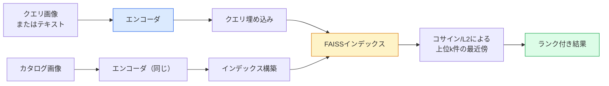

# 画像検索とメトリック学習

> 検索システムは埋め込み空間内の距離によって候補をランク付けする。メトリック学習とは、距離が意図した意味を持つようにその空間を形成する学問だ。

**タイプ:** 構築
**言語:** Python
**前提条件:** Phase 4 レッスン 14 (ViT)、Phase 4 レッスン 18 (CLIP)
**所要時間:** 約45分

## 学習目標

- トリプレット、コントラスト、プロキシベースのメトリック学習損失関数を説明し、特定のデータセットに対して適切なものを選択できる
- L2正規化とコサイン類似度を正しく実装し、「同じアイテム」と「同じクラス」の検索の違いを把握できる
- FAISSインデックスを構築し、テキストと画像でクエリを実行し、ホールドアウトクエリセットのrecall@Kを報告できる
- DINOv2、CLIP、SigLIPをオフザシェルフの埋め込みバックボーンとして使用し、それぞれがいつ優れるかを知ることができる

## 問題

検索は本番ビジョンのいたるところにある：重複検出、逆画像検索、ビジュアル検索（「類似製品を見つける」）、顔の再識別、監視用人物再識別、EC向けのインスタンスレベルマッチング。製品の問いはいつも同じだ：「このクエリ画像が与えられたとき、カタログをランク付けする。」

システム全体を形成する二つの設計上の決定がある。埋め込み — どのモデルがベクトルを生成するか。インデックス — スケールで最近傍を見つける方法。2026年では両方とも商品化されている（埋め込みにDINOv2、インデックスにFAISS）。それは基準を上げる：難しい部分はアプリケーションに対して*何が類似しているか*を定義し、距離がそれと一致するように埋め込み空間を形成することだ。

その形成がメトリック学習だ。小さいが高レバレッジな学問だ。

## コンセプト

### 検索の概要



### 四つの損失関数族

| 損失関数 | 必要なもの | 利点 | 欠点 |
|------|----------|------|------|
| **コントラスト** | (アンカー、ポジティブ) + ネガティブ | シンプル、任意のペアラベルで機能 | 多くのネガティブなしでは収束が遅い |
| **トリプレット** | (アンカー、ポジティブ、ネガティブ) | 直感的；マージンを直接制御 | ハードトリプレットマイニングが高コスト |
| **NT-Xent / InfoNCE** | ペア + バッチマイニングネガティブ | 大きなバッチにスケール | 大きなバッチまたはモメンタムキューが必要 |
| **プロキシベース（ProxyNCA）** | クラスラベルのみ | 高速、安定、マイニング不要 | 小さなデータセットではプロキシに過学習する可能性 |

ほとんどの本番ユースケースでは、事前学習済みバックボーンから始め、オフザシェルフ埋め込みがテストセットで十分でない場合にのみメトリック学習のファインチューニングを追加する。

### トリプレット損失の形式的定義

```
L = max(0, ||f(a) - f(p)||^2 - ||f(a) - f(n)||^2 + margin)
```

アンカー`a`をポジティブ`p`に引き寄せ、ネガティブ`n`から遠ざける。`margin`はギャップを確保する。三つの画像構造は任意の類似性順序付けに一般化される。

マイニングが重要だ：簡単なトリプレット（`n`がすでに`a`から遠い）はゼロの損失しか寄与しない；難しいトリプレットだけがネットワークを教える。セミハードマイニング（`n`が`p`より遠いがマージン内にある）は2016年のFaceNetのレシピであり、今でも主流だ。

### コサイン類似度とL2

二つの指標、二つの慣習：

- **コサイン**：ベクトル間の角度。L2正規化された埋め込みが必要。
- **L2**：ユークリッド距離。生または正規化された埋め込みで機能するが、通常はL2正規化 + 二乗L2と組み合わせる。

ほとんどの現代的なネットは、`||a|| = ||b|| = 1`のとき`||a - b||^2 = 2 - 2 cos(a, b)`なので、二つは等価だ。埋め込み学習の慣習と一致するものを選ぶ；混ぜると「最近傍」の意味が静かに変わる。

### Recall@K

標準的な検索指標：

```
recall@K = 少なくとも一つの正しいマッチが上位K件の結果に入っているクエリの割合
```

recall@1、@5、@10を並べて報告する。recall@10が0.95を超えているのにrecall@1が0.5未満の場合、埋め込み空間は正しい構造を持っているが、ランキングがノイズっぽい — より長いファインチューニングまたは再ランク付けステップを試す。

重複検出では、すべての偽陽性がユーザーに見えるミスになるためprecision@Kの方が重要だ。ビジュアル検索では、recall@Kが製品シグナルだ。

### FAISSを一段落で

Facebook AI Similarity Search。最近傍探索の事実上のライブラリ。三つのインデックス選択肢：

- `IndexFlatIP` / `IndexFlatL2` — ブルートフォース、厳密、学習不要。約100万ベクトルまで使用。
- `IndexIVFFlat` — K個のセルに分割し、最も近いいくつかのセルだけを探索。近似、高速、学習データが必要。
- `IndexHNSW` — グラフベース、多くのクエリに対して最速、インデックスサイズが大きい。

100kベクトルには`IndexFlatIP`のコサイン類似度が良い。1000万には`IndexIVFFlat`。1億以上には積量子化との組み合わせ（`IndexIVFPQ`）。

### インスタンスレベルvsカテゴリーレベル検索

同じ名前の非常に異なる二つの問題：

- **カテゴリーレベル** — 「カタログ内の猫を見つける。」クラス条件付き類似性；オフザシェルフのCLIP / DINOv2埋め込みが良く機能する。
- **インスタンスレベル** — 「カタログ内の*この正確な製品*を見つける。」同じクラスの視覚的に類似したオブジェクト間の細粒度識別が必要；オフザシェルフ埋め込みは性能が低い；メトリック学習によるファインチューニングが重要。

モデルを選ぶ前に、常にどちらを解いているかを確認する。

## 構築

### ステップ1：トリプレット損失関数

```python
import torch
import torch.nn.functional as F

def triplet_loss(anchor, positive, negative, margin=0.2):
    d_ap = F.pairwise_distance(anchor, positive, p=2)
    d_an = F.pairwise_distance(anchor, negative, p=2)
    return F.relu(d_ap - d_an + margin).mean()
```

一行。L2正規化または生の埋め込みで機能する。

### ステップ2：セミハードマイニング

埋め込みとラベルのバッチが与えられたとき、各アンカーに対して最も難しいセミハードネガティブを見つける。

```python
def semi_hard_negatives(emb, labels, margin=0.2):
    dist = torch.cdist(emb, emb)
    same_class = labels[:, None] == labels[None, :]
    diff_class = ~same_class
    N = emb.size(0)

    positives = dist.clone()
    positives[~same_class] = float("-inf")
    positives.fill_diagonal_(float("-inf"))
    pos_idx = positives.argmax(dim=1)

    semi_hard = dist.clone()
    semi_hard[same_class] = float("inf")
    d_ap = dist[torch.arange(N), pos_idx].unsqueeze(1)
    semi_hard[dist <= d_ap] = float("inf")
    neg_idx = semi_hard.argmin(dim=1)

    fallback_mask = semi_hard[torch.arange(N), neg_idx] == float("inf")
    if fallback_mask.any():
        hardest = dist.clone()
        hardest[same_class] = float("inf")
        neg_idx = torch.where(fallback_mask, hardest.argmin(dim=1), neg_idx)
    return pos_idx, neg_idx
```

各アンカーはクラス内で最も難しいポジティブと、ポジティブより遠いがマージン内のセミハードネガティブを得る。

### ステップ3：Recall@K

```python
def recall_at_k(query_emb, gallery_emb, query_labels, gallery_labels, k=1):
    sim = query_emb @ gallery_emb.T
    _, top_k = sim.topk(k, dim=-1)
    matches = (gallery_labels[top_k] == query_labels[:, None]).any(dim=-1)
    return matches.float().mean().item()
```

L2正規化された埋め込みの内積による上位kは、コサインによる上位kと等しい。少なくとも一つの正しい近傍を持つクエリの平均割合を報告する。

### ステップ4：まとめる

```python
import torch
import torch.nn as nn
from torch.optim import Adam

class Encoder(nn.Module):
    def __init__(self, in_dim=128, emb_dim=64):
        super().__init__()
        self.net = nn.Sequential(
            nn.Linear(in_dim, 128), nn.ReLU(),
            nn.Linear(128, emb_dim),
        )

    def forward(self, x):
        return F.normalize(self.net(x), dim=-1)

torch.manual_seed(0)
num_classes = 6
protos = F.normalize(torch.randn(num_classes, 128), dim=-1)

def sample_batch(bs=32):
    labels = torch.randint(0, num_classes, (bs,))
    x = protos[labels] + 0.15 * torch.randn(bs, 128)
    return x, labels

enc = Encoder()
opt = Adam(enc.parameters(), lr=3e-3)

for step in range(200):
    x, y = sample_batch(32)
    emb = enc(x)
    pos_idx, neg_idx = semi_hard_negatives(emb, y)
    loss = triplet_loss(emb, emb[pos_idx], emb[neg_idx])
    opt.zero_grad(); loss.backward(); opt.step()
```

数百ステップ後、埋め込みクラスターはクラスごとに一つのクラスターを形成する。

## 活用

2026年の本番スタック：

- **DINOv2 + FAISS** — 汎用ビジュアル検索。オフザシェルフで機能する。
- **CLIP + FAISS** — クエリがテキストのとき。
- **ファインチューニング済みDINOv2 + FAISS** — インスタンスレベル検索、顔再識別、ファッション、EC。
- **Milvus / Weaviate / Qdrant** — FAISSまたはHNSWのラッパーとしてのマネージドベクターDB。

SOTAインスタンス検索のレシピ：DINOv2バックボーン、埋め込みヘッドを追加し、インスタンスラベル付きペアでトリプレットまたはInfoNCE損失でファインチューニングし、FAISSでインデックスを構築する。

## 成果物

このレッスンで生成されるもの：

- `outputs/prompt-retrieval-loss-picker.md` — 特定の検索問題に対してトリプレット / InfoNCE / ProxyNCAを選択するプロンプト。
- `outputs/skill-recall-at-k-runner.md` — train/val/galleryのスプリットと適切なデータ契約を持つrecall@Kのクリーンな評価ハーネスを書くスキル。

## 演習

1. **(易)** 上記のトイの例を実行する。学習前後の埋め込みをPCAでプロットして、六つのクラスターが形成されるのを見る。
2. **(中)** ProxyNCA損失の実装を追加する：クラスごとに一つの学習済み「プロキシ」、コサイン類似度の標準クロスエントロピー。トイデータでトリプレット損失との収束速度を比較する。
3. **(難)** 1,000枚のImageNet検証画像を取り、HuggingFaceのDINOv2で埋め込み、FAISSフラットインデックスを構築し、同じ画像をクエリとして使ったrecall@{1, 5, 10}（1.0になるはず）と、ImageNetラベルを正解としたホールドアウトスプリットのrecall@{1, 5, 10}を報告する。

## キーワード

| 用語 | よく言われること | 実際の意味 |
|------|----------------|----------------------|
| メトリック学習 | 「空間を形成する」 | 出力空間の距離がターゲット類似度を反映するようにエンコーダを学習させること |
| トリプレット損失 | 「引き寄せて遠ざける」 | L = max(0, d(a, p) - d(a, n) + margin)；正規のメトリック学習損失 |
| セミハードマイニング | 「有用なネガティブ」 | アンカーよりポジティブより遠いがマージン内のネガティブ；経験的に最も有益 |
| プロキシベース損失 | 「クラスプロトタイプ」 | クラスごとに一つの学習済みプロキシ；プロキシへの類似度のクロスエントロピー；ペアマイニング不要 |
| Recall@K | 「上位Kヒット率」 | 上位Kに少なくとも一つの正しい結果を持つクエリの割合 |
| インスタンス検索 | 「この正確なものを見つける」 | 細粒度マッチング；オフザシェルフ特徴量は通常性能が低い |
| FAISS | 「NNライブラリ」 | Facebookの最近傍ライブラリ；厳密および近似インデックスをサポート |
| HNSW | 「グラフインデックス」 | 階層的ナビゲブル小世界；小さいメモリオーバーヘッドで高速な近似NN |

## 参考文献

- [FaceNet: A Unified Embedding for Face Recognition (Schroff et al., 2015)](https://arxiv.org/abs/1503.03832) — トリプレット損失 / セミハードマイニングの論文
- [In Defense of the Triplet Loss for Person Re-Identification (Hermans et al., 2017)](https://arxiv.org/abs/1703.07737) — トリプレットファインチューニングの実践ガイド
- [FAISS documentation](https://github.com/facebookresearch/faiss/wiki) — すべてのインデックス、すべてのトレードオフ
- [SMoT: Metric Learning Taxonomy (Kim et al., 2021)](https://arxiv.org/abs/2010.06927) — 現代的な損失とその関係の調査
