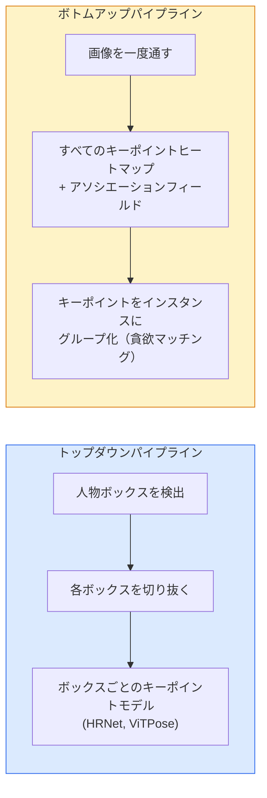

# キーポイント検出とポーズ推定

> ポーズは順序付けられたキーポイントの集合だ。キーポイント検出器はヒートマップ回帰器だ。それ以外はすべて管理業務だ。

**タイプ:** 構築
**言語:** Python
**前提条件:** Phase 4 レッスン 06 (検出)、Phase 4 レッスン 07 (U-Net)
**所要時間:** 約45分

## 学習目標

- トップダウンとボトムアップのポーズ推定を区別し、それぞれがいつ使われるかを述べることができる
- キーポイントごとのガウスターゲットでK個のキーポイントのヒートマップを回帰し、推論時にキーポイント座標を抽出できる
- Part Affinity Fields（PAF）と、ボトムアップパイプラインがキーポイントをインスタンスに関連付ける方法を説明できる
- 本番キーポイント推定にMediaPipe PoseまたはMMPoseを使用し、その出力形式を理解できる

## 問題

キーポイントタスクには多くの名前が隠れている：人体ポーズ（17関節）、顔ランドマーク（68または478点）、手（21点）、動物ポーズ、ロボットのオブジェクトポーズ、医療解剖ランドマーク。それらはすべて同じ構造を持つ：オブジェクト上のK個の離散点を検出し、その(x, y)座標を出力する。

ポーズ推定はモーションキャプチャ、フィットネスアプリ、スポーツ分析、ジェスチャーコントロール、アニメーション、ARトライオン、ロボット把持の基盤だ。2Dの場合は成熟している；3Dポーズ（単一カメラからの世界座標での関節位置推定）は現在の研究フロンティアだ。

エンジニアリングの問いはスケールだ。単一画像、単一人物のポーズは20msの問題だ。30fpsでの群衆における多人物ポーズは、異なるアーキテクチャを必要とする別の問題だ。

## コンセプト

### トップダウンvsボトムアップ



- **トップダウン** — まず人物を検出し、次に各クロップに人物ごとのキーポイントモデルを実行する。最高精度；人物数に対してリニアにスケールする。
- **ボトムアップ** — 一度のフォワードパスですべてのキーポイントとアソシエーションフィールドを予測；それらをグループ化する。群衆サイズに関わらず一定時間。

トップダウン（HRNet、ViTPose）は精度リーダー；ボトムアップ（OpenPose、HigherHRNet）は混雑したシーンのスループットリーダー。

### ヒートマップ回帰

`(x, y)`を直接回帰する代わりに、真の位置を中心としたガウスブロブを持つキーポイントごとの`H x W`ヒートマップを予測する。

```
target[k, y, x] = exp(-((x - cx_k)^2 + (y - cy_k)^2) / (2 sigma^2))
```

推論時、各ヒートマップのargmaxが予測キーポイント位置だ。

ヒートマップが直接回帰より良く機能する理由：ネットワークの空間的構造（畳み込み特徴マップ）が空間的出力と自然に整合する。ガウスターゲットも正則化する — 小さな位置誤差は小さな損失を生み、ゼロにはならない。

### サブピクセル位置特定

argmaxは整数座標を与える。サブピクセル精度のためには、argmaxとその隣接ピクセルに放物線を当てはめるか、よく知られたオフセット`(dx, dy) = 0.25 * (heatmap[y, x+1] - heatmap[y, x-1], ...)`の方向を使う。

### Part Affinity Fields（PAF）

ボトムアップアソシエーションのためのOpenPoseのトリック。接続されたキーポイントの各ペア（例：左肩から左肘）に対して、一方から他方へ向く単位ベクトルをエンコードする2チャンネルフィールドを予測する。肩をその肘に関連付けるには、候補ペアを結ぶ線に沿ってPAFを積分する；最高の積分を持つペアがマッチングされる。

```
For each connection (limb):
  PAF channels: 2 (unit vector x, y)
  Line integral: sum over sample points of (PAF . line_direction)
  Higher integral = stronger match
```

エレガントで、人物ごとのクロップなしに任意の群衆サイズにスケールする。

### COCOキーポイント

標準的な体ポーズデータセット：人物ごとに17キーポイント、指標としてPCK（Percentage of Correct Keypoints）とOKS（Object Keypoint Similarity）。OKSはキーポイントのIoUアナログで、COCO mAP@OKSが報告するものだ。

### 2Dと3D

- **2Dポーズ** — 画像座標；本番品質で解決済み（MediaPipe、HRNet、ViTPose）。
- **3Dポーズ** — ワールド/カメラ座標；まだ活発な研究。一般的なアプローチ：
  - 2D予測を小さなMLPで3Dに持ち上げる（VideoPose3D）。
  - 画像から直接3D回帰（PyMAF、MHFormer）。
  - 正解データのためのマルチビュー設定（CMU Panoptic）。

## 構築

### ステップ1：ガウスヒートマップターゲット

```python
import numpy as np
import torch

def gaussian_heatmap(size, cx, cy, sigma=2.0):
    yy, xx = np.meshgrid(np.arange(size), np.arange(size), indexing="ij")
    return np.exp(-((xx - cx) ** 2 + (yy - cy) ** 2) / (2 * sigma ** 2)).astype(np.float32)

hm = gaussian_heatmap(64, 32, 32, sigma=2.0)
print(f"peak: {hm.max():.3f} at ({hm.argmax() % 64}, {hm.argmax() // 64})")
```

チャンネル軸に沿ってスタックされたキーポイントごとのヒートマップが、完全なターゲットテンソルを与える。

### ステップ2：小さなキーポイントヘッド

Kヒートマップチャンネルを出力するU-Netスタイルのモデル。

```python
import torch.nn as nn
import torch.nn.functional as F

class TinyKeypointNet(nn.Module):
    def __init__(self, num_keypoints=4, base=16):
        super().__init__()
        self.down1 = nn.Sequential(nn.Conv2d(3, base, 3, 2, 1), nn.ReLU(inplace=True))
        self.down2 = nn.Sequential(nn.Conv2d(base, base * 2, 3, 2, 1), nn.ReLU(inplace=True))
        self.mid = nn.Sequential(nn.Conv2d(base * 2, base * 2, 3, 1, 1), nn.ReLU(inplace=True))
        self.up1 = nn.ConvTranspose2d(base * 2, base, 2, 2)
        self.up2 = nn.ConvTranspose2d(base, num_keypoints, 2, 2)

    def forward(self, x):
        h1 = self.down1(x)
        h2 = self.down2(h1)
        h3 = self.mid(h2)
        u1 = self.up1(h3)
        return self.up2(u1)
```

入力`(N, 3, H, W)`、出力`(N, K, H, W)`。損失はガウスターゲットに対するピクセルごとのMSEだ。

### ステップ3：推論 — キーポイント座標の抽出

```python
def heatmap_to_coords(heatmaps):
    """
    heatmaps: (N, K, H, W)
    returns:  (N, K, 2) float coordinates in image pixels
    """
    N, K, H, W = heatmaps.shape
    hm = heatmaps.reshape(N, K, -1)
    idx = hm.argmax(dim=-1)
    ys = (idx // W).float()
    xs = (idx % W).float()
    return torch.stack([xs, ys], dim=-1)

coords = heatmap_to_coords(torch.randn(2, 4, 32, 32))
print(f"coords: {coords.shape}")  # (2, 4, 2)
```

推論時に一行。サブピクセル精度のためには、argmaxの周りを補間する。

### ステップ4：合成キーポイントデータセット

シンプル：白いキャンバスに4点を描き、それを予測することを学ぶ。

```python
def make_synthetic_sample(size=64):
    img = np.ones((3, size, size), dtype=np.float32)
    rng = np.random.default_rng()
    kps = rng.integers(8, size - 8, size=(4, 2))
    for cx, cy in kps:
        img[:, cy - 2:cy + 2, cx - 2:cx + 2] = 0.0
    hms = np.stack([gaussian_heatmap(size, cx, cy) for cx, cy in kps])
    return img, hms, kps
```

小さなモデルが1分で学習するのに十分なほど簡単だ。

### ステップ5：学習

```python
model = TinyKeypointNet(num_keypoints=4)
opt = torch.optim.Adam(model.parameters(), lr=3e-3)

for step in range(200):
    batch = [make_synthetic_sample() for _ in range(16)]
    imgs = torch.from_numpy(np.stack([b[0] for b in batch]))
    hms = torch.from_numpy(np.stack([b[1] for b in batch]))
    pred = model(imgs)
    # Upsample pred to full resolution
    pred = F.interpolate(pred, size=hms.shape[-2:], mode="bilinear", align_corners=False)
    loss = F.mse_loss(pred, hms)
    opt.zero_grad(); loss.backward(); opt.step()
```

## 活用

- **MediaPipe Pose** — Googleの本番ポーズ推定器；WebGL + モバイルランタイムを搭載、10ms未満のレイテンシ。
- **MMPose**（OpenMMLab） — 包括的な研究コードベース；事前学習済み重みを持つすべてのSOTAアーキテクチャ。
- **YOLOv8-pose** — 単一フォワードパスで最速のリアルタイム多人物ポーズ。
- **transformers HumanDPT / PoseAnything** — オープンボキャブラリーポーズ（任意のオブジェクト、任意のキーポイントセット）のための新しい視覚言語アプローチ。

## 成果物

このレッスンで生成されるもの：

- `outputs/prompt-pose-stack-picker.md` — レイテンシ、群衆サイズ、2Dvs3Dのニーズが与えられたとき、MediaPipe / YOLOv8-pose / HRNet / ViTPoseを選択するプロンプト。
- `outputs/skill-heatmap-to-coords.md` — すべての本番ポーズモデルで使われるサブピクセルヒートマップ-座標ルーティンを書くスキル。

## 演習

1. **(易)** 合成4点データセットで小さなキーポイントモデルを学習させる。200ステップ後の予測と真のキーポイント間の平均L2誤差を報告する。
2. **(中)** サブピクセル精度を追加する：argmax位置が与えられたとき、隣接ピクセルからxとyに沿って1D放物線を当てはめる。整数argmaxとの精度向上を報告する。
3. **(難)** 各画像に4キーポイントパターンの2インスタンスが写る2人合成データセットを構築する。各キーポイントがどのインスタンスに属するかを予測するPAF付きのボトムアップパイプラインを学習させ、OKSを評価する。

## キーワード

| 用語 | よく言われること | 実際の意味 |
|------|----------------|----------------------|
| キーポイント | 「ランドマーク」 | オブジェクト上の特定の順序付けられた点（関節、コーナー、特徴） |
| ポーズ | 「骨格」 | 一つのインスタンスに属する順序付けられたキーポイントの集合 |
| トップダウン | 「検出してからポーズ」 | 二段階パイプライン：人物検出器 + クロップごとのキーポイントモデル；最高精度 |
| ボトムアップ | 「先にポーズ、後でグループ化」 | シングルパスの全キーポイント予測 + グループ化；群衆サイズに対して一定時間 |
| ヒートマップ | 「ガウスターゲット」 | 真の位置にピークを持つキーポイントごとのH x Wテンソル；好ましい回帰ターゲット |
| PAF | 「Part Affinity Field」 | 肢の方向をエンコードする2チャンネル単位ベクトルフィールド；キーポイントをインスタンスにグループ化するために使用 |
| OKS | 「キーポイントIoU」 | Object Keypoint Similarity；ポーズのCOCO指標 |
| HRNet | 「高解像度ネット」 | 主要なトップダウンキーポイントアーキテクチャ；高解像度特徴量を全体を通じて保持する |

## 参考文献

- [OpenPose (Cao et al., 2017)](https://arxiv.org/abs/1812.08008) — PAF付きボトムアップ；アプローチの最良の解説
- [HRNet (Sun et al., 2019)](https://arxiv.org/abs/1902.09212) — トップダウンリファレンスアーキテクチャ
- [ViTPose (Xu et al., 2022)](https://arxiv.org/abs/2204.12484) — プレーンViTのポーズバックボーン；多くのベンチマークで現在のSOTA
- [MediaPipe Pose](https://developers.google.com/mediapipe/solutions/vision/pose_landmarker) — 本番リアルタイムポーズ；2026年で最速のデプロイ済みスタック
