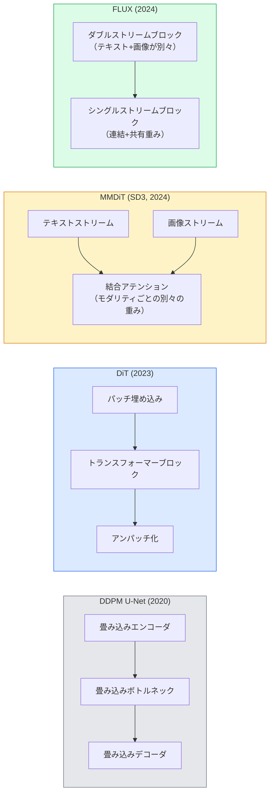

# 拡散トランスフォーマーと整流フロー

> U-Netは拡散の秘密ではない。それをトランスフォーマーに置き換え、ノイズスケジュールを直線フローに置き換えると、突然SD3、FLUX、そして2026年のすべてのテキストから画像へのモデルが生まれる。

**タイプ:** 学習 + 構築
**言語:** Python
**前提条件:** Phase 4 レッスン 10 (拡散 DDPM)、Phase 4 レッスン 14 (ViT)、Phase 7 レッスン 02 (セルフアテンション)
**所要時間:** 約75分

## 学習目標

- U-Net DDPM（レッスン10）から拡散トランスフォーマー（DiT）、MMDiT（SD3）、シングル+ダブルストリームDiT（FLUX）への進化をたどることができる
- 整流フローを説明できる：ノイズとデータ間の直線軌跡がなぜモデルを1000ステップではなく20ステップでサンプリングできるようにするのか
- 100行以下の小さなDiTブロックと整流フロー学習ループを実装できる
- モデルバリアント（SD3、FLUX.1-dev、FLUX.1-schnell、Z-Image、Qwen-Image）をアーキテクチャ、パラメータ数、ライセンスで区別できる

## 問題

レッスン10はU-Netデノイザーを持つDDPMを構築した。そのレシピが2020〜2023年を支配した：U-Net + ベータスケジュール + ノイズ予測損失。Stable Diffusion 1.5、2.1、DALL-E 2を生み出した。

2026年のすべてのState-of-the-artなテキストから画像へのモデルはそれを超えた。Stable Diffusion 3、FLUX、SD4、Z-Image、Qwen-Image、Hunyuan-Image — どれもU-Netを使わない。拡散トランスフォーマー（DiT）を使う。SD3とFLUXもDDPMノイズスケジュールを整流フローに置き換え、ノイズからデータへのパスを真っ直ぐにし、整合性または蒸留バリアントで1〜4ステップの推論を可能にする。

この変化が重要なのは、拡散ベースの画像生成が制御可能で、プロンプトに正確（SD3/SD4はテキストレンダリングを解決した）で、本番で高速になった理由だからだ。DiT + 整流フローを理解することは2026年の生成画像スタックを理解することだ。

## コンセプト

### U-Netからトランスフォーマーへ



- **DiT**（Peebles & Xie、2023）— U-NetをViTライクなトランスフォーマーで潜在パッチに置き換える。適応的レイヤーノルム（AdaLN）を介した条件付け。
- **MMDiT**（SD3、Esser et al.、2024）— 結合アテンションを共有するテキストと画像トークンのための別々の重みを持つ二つのストリーム。
- **FLUX**（Black Forest Labs、2024）— 最初のNブロックがSD3のようにダブルストリーム、後のブロックは効率のために連結して重みを共有（シングルストリーム）。
- **Z-Image**（2025）— 6Bパラメータの効率的なシングルストリームDiT、「コストのためのスケール」に挑戦する。

### 整流フローを一段落で

DDPMは`x_t`が徐々に破損する前向きプロセスをノイズSDEとして定義する。学習済み逆プロセスは第二のSDE、1000の小さなステップで解く。

整流フローはクリーンなデータと純粋なノイズ間の**直線**補間を定義する：

```
x_t = (1 - t) * x_0 + t * epsilon,     t in [0, 1]
```

速度`v_theta(x_t, t) = epsilon - x_0` — クリーンデータからノイズへの直線パスに沿った前向き方向（`dx_t/dt`）を予測するネットワークを学習させる。サンプリング中は、この速度を逆向きに積分して、ノイズからデータへとステップする。結果として得られるODEは直線に非常に近いので、サンプリングに必要な積分ステップははるかに少なくなる。

SD3はこれを**整流フローマッチング**と呼ぶ。FLUX、Z-Image、ほとんどの2026年のモデルが同じ目的関数を使用する。典型的な推論：20〜30のオイラーステップ（決定論的）、古いDDPMレジームの50+のDDIMステップに対して。蒸留/ターボ/schnell/LCMバリアントは1〜4ステップまで下げる。

### AdaLN条件付け

DiTはタイムステップとクラス/テキストを**適応的レイヤーノルム**を介して条件付けする：条件付けベクトルから`scale`と`shift`を予測し、LayerNormの後に適用する。U-NetのFiLMスタイルのモジュレーションよりもはるかにクリーンで、すべての現代的なDiTのデフォルトだ。

```
cond -> MLP -> (scale, shift, gate)
norm(x) * (1 + scale) + shift, then residual add * gate
```

### SD3とFLUXのテキストエンコーダ

- **SD3**は三つのテキストエンコーダを使用する：二つのCLIPモデル + T5-XXL。埋め込みを連結し、テキスト条件付けとして画像ストリームに送る。
- **FLUX**は一つのCLIP-L + T5-XXLを使用する。
- **Qwen-Image / Z-Image**バリアントは基盤LLMと整合した独自のインハウステキストエンコーダを使用する。

テキストエンコーダは、SD3/FLUXがSD1.5よりもはるかに良くプロンプトを推論できる大きな理由だ。T5-XXLだけで4.7Bパラメータがある。

### 分類器フリーガイダンスは依然として機能する

整流フローはサンプラーを変えるが、条件付けは変えない。分類器フリーガイダンス（学習中10%の確率でテキストをドロップし、推論時に条件付きと無条件の予測を混ぜる）は整流フローでも同様に機能する。ほとんどの2026年のモデルはガイダンススケール3.5〜5を使用する — 整流フローモデルがデフォルトでプロンプトにより密接に従うため、SD1.5の7.5より低い。

### 整合性、ターボ、Schnell、LCM

同じアイデアの四つの名前：遅い多ステップモデルを速い少ステップモデルに蒸留する。

- **LCM（Latent Consistency Model）** — 一つのステップで任意の中間`x_t`から最終`x_0`を予測する学生を学習させる。
- **SDXL Turbo / FLUX schnell** — 敵対的拡散蒸留で学習した1〜4ステップモデル。
- **SD Turbo** — 潜在拡散に適応したOpenAIスタイルの整合性モデル。

どの新しいモデルの本番サービングも「フル品質」チェックポイントと「ターボ/schnell」バリアントの両方を搭載する。Schnell（ドイツ語で「速い」、Black Forest Labsの慣習）は1〜4ステップで実行され、リアルタイムパイプラインに対応する。

### 2026年のモデルランドスケープ

| モデル | サイズ | アーキテクチャ | ライセンス |
|-------|------|--------------|---------|
| Stable Diffusion 3 Medium | 2B | MMDiT | SAI Community |
| Stable Diffusion 3.5 Large | 8B | MMDiT | SAI Community |
| FLUX.1-dev | 12B | ダブル+シングルストリームDiT | 非商用 |
| FLUX.1-schnell | 12B | 同じ、蒸留済み | Apache 2.0 |
| FLUX.2 | — | FLUX.1の反復 | mixed |
| Z-Image | 6B | S3-DiT (Scalable Single-Stream) | permissive |
| Qwen-Image | ~20B | DiT + Qwenテキストタワー | Apache 2.0 |
| Hunyuan-Image-3.0 | ~80B | DiT | research |
| SD4 Turbo | 3B | DiT + 蒸留 | SAI Commercial |

FLUX.1-schnellは2026年のオープンソースデフォルトだ。Z-Imageは効率リーダーだ。FLUX.2とSD4は現在の品質の先端だ。

### なぜこのフェーズシフトが重要なのか

DDPM + U-Netは機能した。DiT + 整流フローは**より良く、より速く、よりクリーンにスケールする**。この移行はNLPでのRNNからトランスフォーマーへの移行に対応する：両方のアーキテクチャが同じ問題を解決したが、トランスフォーマーはスケールし今や支配する。2026年の画像、ビデオ、または3D生成に関するすべての論文は、DiT形状のデノイザーと通常は整流フロー目的関数を使用する。U-Net DDPMは今や主に教育的だ（レッスン10）。

## 構築

### ステップ1：AdaLN付きDiTブロック

```python
import torch
import torch.nn as nn


class AdaLNZero(nn.Module):
    """
    Adaptive LayerNorm with a gate. Predicts (scale, shift, gate) from the conditioning.
    Init such that the whole block starts as identity ("zero init").
    """

    def __init__(self, dim, cond_dim):
        super().__init__()
        self.norm = nn.LayerNorm(dim, elementwise_affine=False)
        self.mlp = nn.Linear(cond_dim, dim * 3)
        nn.init.zeros_(self.mlp.weight)
        nn.init.zeros_(self.mlp.bias)

    def forward(self, x, cond):
        scale, shift, gate = self.mlp(cond).chunk(3, dim=-1)
        h = self.norm(x) * (1 + scale.unsqueeze(1)) + shift.unsqueeze(1)
        return h, gate.unsqueeze(1)


class DiTBlock(nn.Module):
    def __init__(self, dim=192, heads=3, mlp_ratio=4, cond_dim=192):
        super().__init__()
        self.adaln1 = AdaLNZero(dim, cond_dim)
        self.attn = nn.MultiheadAttention(dim, heads, batch_first=True)
        self.adaln2 = AdaLNZero(dim, cond_dim)
        self.mlp = nn.Sequential(
            nn.Linear(dim, dim * mlp_ratio),
            nn.GELU(),
            nn.Linear(dim * mlp_ratio, dim),
        )

    def forward(self, x, cond):
        h, gate1 = self.adaln1(x, cond)
        a, _ = self.attn(h, h, h, need_weights=False)
        x = x + gate1 * a
        h, gate2 = self.adaln2(x, cond)
        x = x + gate2 * self.mlp(h)
        return x
```

`AdaLNZero`はMLPの重みがゼロに初期化されているため、恒等マッピングとして開始する。学習はブロックを恒等から遠ざける；これにより深いトランスフォーマー拡散モデルが劇的に安定する。

### ステップ2：小さなDiT

```python
def timestep_embedding(t, dim):
    import math
    half = dim // 2
    freqs = torch.exp(-math.log(10000) * torch.arange(half, device=t.device) / half)
    args = t[:, None].float() * freqs[None]
    return torch.cat([args.sin(), args.cos()], dim=-1)


class TinyDiT(nn.Module):
    def __init__(self, image_size=16, patch_size=2, in_channels=3, dim=96, depth=4, heads=3):
        super().__init__()
        self.patch_size = patch_size
        self.num_patches = (image_size // patch_size) ** 2
        self.patch = nn.Conv2d(in_channels, dim, kernel_size=patch_size, stride=patch_size)
        self.pos = nn.Parameter(torch.zeros(1, self.num_patches, dim))
        self.time_mlp = nn.Sequential(
            nn.Linear(dim, dim * 2),
            nn.SiLU(),
            nn.Linear(dim * 2, dim),
        )
        self.blocks = nn.ModuleList([DiTBlock(dim, heads, cond_dim=dim) for _ in range(depth)])
        self.norm_out = nn.LayerNorm(dim, elementwise_affine=False)
        self.head = nn.Linear(dim, patch_size * patch_size * in_channels)

    def forward(self, x, t):
        n = x.size(0)
        x = self.patch(x)
        x = x.flatten(2).transpose(1, 2) + self.pos
        t_emb = self.time_mlp(timestep_embedding(t, self.pos.size(-1)))
        for blk in self.blocks:
            x = blk(x, t_emb)
        x = self.norm_out(x)
        x = self.head(x)
        return self._unpatchify(x, n)

    def _unpatchify(self, x, n):
        p = self.patch_size
        h = w = int(self.num_patches ** 0.5)
        x = x.view(n, h, w, p, p, -1).permute(0, 5, 1, 3, 2, 4).reshape(n, -1, h * p, w * p)
        return x
```

### ステップ3：整流フロー学習

```python
import torch.nn.functional as F

def rectified_flow_train_step(model, x0, optimizer, device):
    model.train()
    x0 = x0.to(device)
    n = x0.size(0)
    t = torch.rand(n, device=device)
    epsilon = torch.randn_like(x0)
    x_t = (1 - t[:, None, None, None]) * x0 + t[:, None, None, None] * epsilon

    target_velocity = epsilon - x0
    pred_velocity = model(x_t, t)

    loss = F.mse_loss(pred_velocity, target_velocity)
    optimizer.zero_grad()
    loss.backward()
    optimizer.step()
    return loss.item()
```

DDPMのノイズ予測損失（レッスン10）と比較する：同じ構造、異なるターゲット。ノイズ`epsilon`を予測する代わりに、直線補間に沿ってデータからノイズへ向く**速度**`epsilon - x_0`を予測する。

### ステップ4：オイラーサンプラー

整流フローはODEだ。オイラー法は最もシンプルで、20ステップ以上では高次ソルバーとほぼ同じ精度だ。

```python
@torch.no_grad()
def rectified_flow_sample(model, shape, steps=20, device="cpu"):
    model.eval()
    x = torch.randn(shape, device=device)
    dt = 1.0 / steps
    t = torch.ones(shape[0], device=device)
    for _ in range(steps):
        v = model(x, t)
        x = x - dt * v
        t = t - dt
    return x
```

20ステップ。学習済みモデルでは、1000ステップのDDPMに匹敵するサンプルを生成する。

### ステップ5：エンドツーエンドのスモークテスト

```python
import numpy as np

def synthetic_blobs(num=200, size=16, seed=0):
    rng = np.random.default_rng(seed)
    out = np.zeros((num, 3, size, size), dtype=np.float32)
    yy, xx = np.meshgrid(np.arange(size), np.arange(size), indexing="ij")
    for i in range(num):
        cx, cy = rng.uniform(4, size - 4, size=2)
        r = rng.uniform(2, 4)
        mask = (xx - cx) ** 2 + (yy - cy) ** 2 < r ** 2
        colour = rng.uniform(-1, 1, size=3)
        for c in range(3):
            out[i, c][mask] = colour[c]
    return torch.from_numpy(out)
```

これを使って整流フローで`TinyDiT`を学習させる。500ステップ後、サンプリングされた出力は淡い色のブロブのように見えるはずだ。

## 活用

FLUX / SD3 / Z-Imageを使った実際の画像生成には、`diffusers`がすべてに統一APIを提供している：

```python
from diffusers import FluxPipeline, StableDiffusion3Pipeline
import torch

pipe = FluxPipeline.from_pretrained(
    "black-forest-labs/FLUX.1-schnell",
    torch_dtype=torch.bfloat16,
).to("cuda")

out = pipe(
    prompt="a golden retriever surfing a tsunami, hyperrealistic, studio lighting",
    guidance_scale=0.0,           # schnell was trained without CFG
    num_inference_steps=4,
    max_sequence_length=256,
).images[0]
out.save("surf.png")
```

三行。`FLUX.1-schnell`で四ステップ。より高品質には、20〜30ステップとCFGを使って`black-forest-labs/FLUX.1-dev`にモデルIDを置き換える。

SD3の場合：

```python
pipe = StableDiffusion3Pipeline.from_pretrained(
    "stabilityai/stable-diffusion-3.5-large",
    torch_dtype=torch.bfloat16,
).to("cuda")
out = pipe(prompt, guidance_scale=3.5, num_inference_steps=28).images[0]
```

## 成果物

このレッスンで生成されるもの：

- `outputs/prompt-dit-model-picker.md` — 品質、レイテンシ、ライセンス制約が与えられたとき、SD3、FLUX.1-dev、FLUX.1-schnell、Z-Image、SD4 Turboを選択する。
- `outputs/skill-rectified-flow-trainer.md` — AdaLN DiTとオイラーサンプリングを使った整流フローの完全な学習ループを書く。

## 演習

1. **(易)** 上記のTinyDiTを合成ブロブデータセットで500ステップ学習させる。10、20、50オイラーステップで生成されたサンプルを比較する。
2. **(中)** 学習済みクラス埋め込みをタイム埋め込みに連結することでテキスト条件付けを追加する（色による10個のブロブ「クラス」）。クラス0、5、9でサンプリングし、色が一致することを確認する。
3. **(難)** 同じデータで同じステップ数学習した同サイズのネットワークの整流フローバージョンとDDPMバージョンから生成されたサンプルのフレシェ距離（FIDプロキシ）を計算する。どちらが速く収束するか報告する。

## キーワード

| 用語 | よく言われること | 実際の意味 |
|------|----------------|----------------------|
| DiT | 「拡散トランスフォーマー」 | 拡散デノイザーとしてU-Netを置き換えるトランスフォーマー；パッチ化された潜在変数上で動作する |
| AdaLN | 「適応的レイヤーノルム」 | LayerNormの後に適用される学習済みscale、shift、gateによるタイムステップ/テキスト条件付け；すべての現代的なDiTの標準 |
| MMDiT | 「マルチモーダルDiT（SD3）」 | 結合セルフアテンションを共有するテキストと画像トークンのための別々の重みストリーム |
| シングルストリーム/ダブルストリーム | 「FLUXのトリック」 | 最初のNブロックがダブルストリーム（モダリティごとに別々の重み）、後のブロックが効率のためにシングルストリーム（連結+共有重み） |
| 整流フロー | 「直線ノイズからデータへ」 | データとノイズの線形補間；ネットワークが速度を予測；推論時に必要なODEステップが少ない |
| 速度ターゲット | 「epsilon - x_0」 | 整流フローの回帰ターゲット；クリーンなデータからノイズへ向く |
| CFGガイダンス | 「分類器フリーガイダンス」 | 条件付きと無条件の予測を混ぜる；整流フローモデルでも使用される |
| Schnell / ターボ / LCM | 「1〜4ステップ蒸留」 | フル品質モデルから蒸留された少ステップバリアント；本番リアルタイム |

## 参考文献

- [Scalable Diffusion Models with Transformers (Peebles & Xie, 2023)](https://arxiv.org/abs/2212.09748) — DiT論文
- [Scaling Rectified Flow Transformers (Esser et al., SD3論文)](https://arxiv.org/abs/2403.03206) — スケールでのMMDiTと整流フロー
- [FLUX.1 model card and technical report (Black Forest Labs)](https://huggingface.co/black-forest-labs/FLUX.1-dev) — ダブル+シングルストリームの詳細
- [Z-Image: Efficient Image Generation Foundation Model (2025)](https://arxiv.org/html/2511.22699v1) — 6BのシングルストリームDiT
- [Elucidating the Design Space of Diffusion (Karras et al., 2022)](https://arxiv.org/abs/2206.00364) — すべての拡散設計のトレードオフのリファレンス
- [Latent Consistency Models (Luo et al., 2023)](https://arxiv.org/abs/2310.04378) — LCM-LoRAが4ステップ推論を可能にする方法
