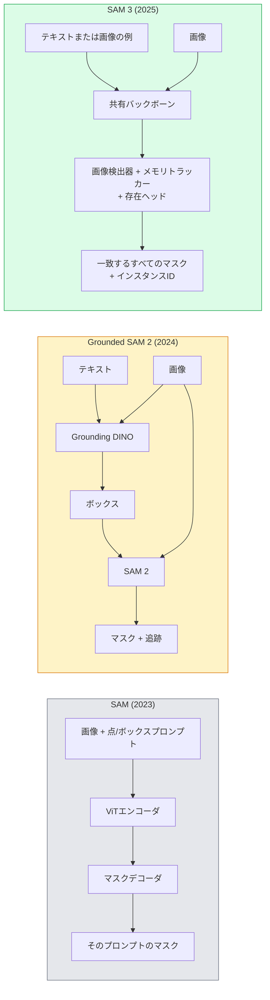

# SAM 3とオープンボキャブラリーセグメンテーション

> モデルにテキストプロンプトと画像を与えると、一致するすべてのオブジェクトのマスクが得られる。SAM 3はそれを単一のフォワードパスにした。

**タイプ:** 活用 + 構築
**言語:** Python
**前提条件:** Phase 4 レッスン 07 (U-Net)、Phase 4 レッスン 08 (Mask R-CNN)、Phase 4 レッスン 18 (CLIP)
**所要時間:** 約60分

## 学習目標

- SAM（視覚プロンプトのみ）、Grounded SAM / SAM 2（検出器 + SAM）、SAM 3（Promptable Concept Segmentationによるネイティブテキストプロンプト）を区別できる
- SAM 3のアーキテクチャを説明できる：共有バックボーン + 画像検出器 + メモリベースビデオトラッカー + 存在ヘッド + 疎結合検出器トラッカー設計
- Hugging Faceの`transformers` SAM 3統合をテキストプロンプトによる検出、セグメンテーション、ビデオトラッキングに使用できる
- レイテンシ、概念の複雑さ、デプロイターゲットに基づいてSAM 3、Grounded SAM 2、YOLO-World、SAM-MIを選択できる

## 問題

2023年のSAMは視覚プロンプトのみのモデルだった：点をクリックするかボックスを描くとマスクが返る。「この写真のすべてのオレンジを見つけて」には、ボックスを生成する検出器（Grounding DINO）と各ボックスをセグメントするSAMが必要だった。Grounded SAMはこれをパイプラインにしたが、避けられないエラー蓄積を持つ二つの凍結モデルのカスケードだった。

SAM 3（Meta、2025年11月、ICLR 2026）はそのカスケードを崩壊させた。短い名詞句または画像の例を入力として受け取り、一度のフォワードパスで一致するすべてのマスクとインスタンスIDを返す。これが**Promptable Concept Segmentation（PCS）**だ。2026年3月のObject Multiplex更新（SAM 3.1）と組み合わせると、同じ概念の複数のインスタンスをビデオ全体で効率的に追跡する。

このレッスンはこれが表す構造的変化についてだ。2Dセグメンテーション、検出、テキスト画像グラウンディングが一つのモデルに統合された。本番の問いはもはや「どのパイプラインを連鎖させるか」ではなく「どのプロンプタブルモデルが私のユースケースをエンドツーエンドで処理するか」だ。

## コンセプト

### 三世代



### Promptable Concept Segmentation

「概念プロンプト」は短い名詞句（`"yellow school bus"`、`"striped red umbrella"`、`"hand holding a mug"`）または画像の例だ。モデルは画像内で概念に一致するすべてのインスタンスのセグメンテーションマスクと、マッチごとに一意のインスタンスIDを返す。

これは古典的な視覚プロンプトSAMと三つの点で異なる：

1. インスタンスごとのプロンプトが不要 — 一つのテキストプロンプトがすべての一致を返す。
2. オープンボキャブラリー — 概念は自然言語で記述できるものなら何でも良い。
3. プロンプトごとに一つのマスクではなく、複数のインスタンスを一度に返す。

### 主要なアーキテクチャの部品

- **共有バックボーン** — 単一のViTが画像を処理する。検出ヘッドとメモリベーストラッカーの両方がそれから読み取る。
- **存在ヘッド** — 概念が画像に存在するかどうかをまず予測する。「これはここにあるか？」を「どこにあるか？」から切り離す。不在概念の偽陽性を削減する。
- **疎結合検出器トラッカー** — 画像レベルの検出とビデオレベルの追跡は相互に干渉しないよう別々のヘッドを持つ。
- **メモリバンク** — ビデオ追跡のためにフレームをまたいでインスタンスごとの特徴を保存する（SAM 2が使用したのと同じ機構）。

### スケールでの学習

SAM 3は、AIと人間のレビューを使って反復的にアノテーションし修正するデータエンジンによって生成された**400万個のユニークな概念**で学習された。新しい**SA-COベンチマーク**は270Kのユニークな概念を含み、以前のベンチマークの50倍大きい。SAM 3はSA-COで人間のパフォーマンスの75〜80%に達し、画像+ビデオのPCSで既存システムの二倍を達成した。

### SAM 3.1 Object Multiplex

2026年3月の更新：**Object Multiplex**は同じ概念の多くのインスタンスの結合追跡のための共有メモリ機構を導入する。以前はNインスタンスを追跡するにはN個の別々のメモリバンクが必要だった。Multiplexはそれをインスタンスごとのクエリを持つ一つの共有メモリに崩壊させる。結果：精度を損なうことなく大幅に速いマルチオブジェクト追跡。

### 2026年でもGrounded SAMが重要な場面

- 特定のオープンボキャブラリー検出器を入れ替える必要があるとき（DINO-X、Florence-2）。
- SAM 3のライセンス（HFでゲート）がブロッカーのとき。
- SAM 3が公開する閾値よりも検出器の閾値をより細かく制御が必要なとき。
- 検出器コンポーネントの研究/アブレーション作業のとき。

モジュール式パイプラインには依然として場所がある。ほとんどの本番作業では、SAM 3がよりシンプルな答えだ。

### YOLO-WorldとSAM 3

- **YOLO-World** — オープンボキャブラリー検出器のみ（マスクなし）。リアルタイム。高fpsでボックスが必要なときに最適。
- **SAM 3** — 完全なセグメンテーション + 追跡。遅いがより豊富な出力。

本番の分割：YOLO-Worldは高速な検出のみのパイプライン（ロボットナビゲーション、高速ダッシュボード）、SAM 3はマスクや追跡が必要なもの。

### SAM-MIの効率

SAM-MI（2025〜2026）はSAMのデコーダボトルネックに対処する。主なアイデア：

- **スパース点プロンプト** — 密なプロンプトの代わりに慎重に選ばれた少数の点を使用；デコーダ呼び出しを96%削減。
- **シャローマスク集約** — 大まかなマスク予測をより鮮明な一つのマスクに統合。
- **疎結合マスクインジェクション** — デコーダは再実行する代わりに事前計算されたマスク特徴を受け取る。

結果：オープンボキャブラリーベンチマークでGrounded-SAMより約1.6倍の高速化。

### 三つのモデルの出力フォーマット

すべて同じ一般的な構造（ボックス + ラベル + スコア + マスク + ID）を返す。これは役立つ — どのモデルが実行されたかによって下流パイプラインが分岐する必要がない。

## 構築

### ステップ1：プロンプト構築

ユーザーの文をSAM 3の概念プロンプトのリストに変換するヘルパーを構築する。これは「ユーザーがタイプしたもの」と「モデルが消費するもの」が出会う境界だ。

```python
def split_concepts(sentence):
    """
    Heuristic splitter for multi-concept prompts.
    Returns list of short noun phrases.
    """
    for sep in [",", ";", "and", "or", "&"]:
        if sep in sentence:
            parts = [p.strip() for p in sentence.replace("and ", ",").split(",")]
            return [p for p in parts if p]
    return [sentence.strip()]

print(split_concepts("cats, dogs and balloons"))
```

SAM 3はフォワードパスごとに一つの概念を受け取る；マルチ概念クエリにはループするかバッチ処理する。

### ステップ2：後処理ヘルパー

SAM 3の生の出力を、Phase 4 レッスン 16のパイプライン契約に合うクリーンな検出リストに変換する。

```python
from dataclasses import dataclass
from typing import List

@dataclass
class ConceptDetection:
    concept: str
    instance_id: int
    box: tuple          # (x1, y1, x2, y2)
    score: float
    mask_rle: str       # run-length encoded


def rle_encode(binary_mask):
    flat = binary_mask.flatten().astype("uint8")
    runs = []
    prev, count = flat[0], 0
    for v in flat:
        if v == prev:
            count += 1
        else:
            runs.append((int(prev), count))
            prev, count = v, 1
    runs.append((int(prev), count))
    return ";".join(f"{v}x{c}" for v, c in runs)
```

RLEは多くの高解像度マスクでもレスポンスペイロードを小さく保つ。同じフォーマットがSAM 2、SAM 3、Grounded SAM 2で機能する。

### ステップ3：統合されたオープンボキャブラリーセグメンテーションインターフェース

持っているバックエンド（SAM 3、Grounded SAM 2、YOLO-World + SAM 2）を単一メソッドの後ろにラップする。バックエンドが変わっても下流コードは変更しない。

```python
from abc import ABC, abstractmethod
import numpy as np

class OpenVocabSeg(ABC):
    @abstractmethod
    def detect(self, image: np.ndarray, concept: str) -> List[ConceptDetection]:
        ...


class StubOpenVocabSeg(OpenVocabSeg):
    """
    Deterministic stub used for pipeline testing when real models are not loaded.
    """
    def detect(self, image, concept):
        h, w = image.shape[:2]
        return [
            ConceptDetection(
                concept=concept,
                instance_id=0,
                box=(w * 0.2, h * 0.3, w * 0.5, h * 0.8),
                score=0.89,
                mask_rle="0x100;1x50;0x200",
            ),
            ConceptDetection(
                concept=concept,
                instance_id=1,
                box=(w * 0.55, h * 0.25, w * 0.85, h * 0.75),
                score=0.74,
                mask_rle="0x80;1x40;0x220",
            ),
        ]
```

実際の`SAM3OpenVocabSeg`サブクラスは`transformers.Sam3Model`と`Sam3Processor`をラップする。

### ステップ4：Hugging Face SAM 3の使用（リファレンス）

実際のモデルの場合、`transformers`の統合：

```python
from transformers import Sam3Processor, Sam3Model
import torch

processor = Sam3Processor.from_pretrained("facebook/sam3")
model = Sam3Model.from_pretrained("facebook/sam3").eval()

inputs = processor(images=pil_image, return_tensors="pt")
inputs = processor.set_text_prompt(inputs, "yellow school bus")

with torch.no_grad():
    outputs = model(**inputs)

masks = processor.post_process_masks(
    outputs.masks, inputs.original_sizes, inputs.reshaped_input_sizes
)
boxes = outputs.boxes
scores = outputs.scores
```

一つのプロンプト、すべての一致が一度の呼び出しで返される。

### ステップ5：Grounded SAM 2が無償で提供していたものを測定する

正直なベンチマーク：実際のパイプラインでGrounded SAM 2をSAM 3に置き換えるとどうなるか？

- レイテンシ：SAM 3は一つのフォワードパス（別々の検出器なし）を節約するが、モデル自体が重い；通常はネット中立またはわずかな高速化。
- 精度：稀または複合的な概念（「striped red umbrella」）でSAM 3が大幅に優れる。一般的な単語の概念では類似。
- 柔軟性：Grounded SAM 2は検出器を入れ替えられる（DINO-X、Florence-2、Grounding DINO 1.5）；SAM 3はモノリシック。

結論：SAM 3は2026年のオープンボキャブラリーセグメンテーションのデフォルトだ。Grounded SAM 2は検出器の柔軟性や異なるライセンス条件が必要なときに依然として正しい答えだ。

## 活用

本番デプロイメントパターン：

- **リアルタイムアノテーション** — SAM 3 + CVATのラベル-テキストプロンプト機能。アノテーターがラベル名を選択；SAM 3が一致するすべてのインスタンスを事前ラベル付け。確認して修正する。
- **ビデオ分析** — SAM 3.1 Object Multiplexでマルチオブジェクト追跡；フレームをメモリベーストラッカーに送る。
- **ロボット工学** — オープンボキャブラリー操作のためのSAM 3（「赤いカップを持ち上げる」）；計画プリミティブとして実行。
- **医療イメージング** — 医療概念でファインチューニングされたSAM 3；HFでのアクセスリクエストが必要。

UltralyticsはSAM 3をPythonパッケージにラップしている：

```python
from ultralytics import SAM

model = SAM("sam3.pt")
results = model(image_path, prompts="yellow school bus")
```

YOLOとSAM 2と同じインターフェース。

## 成果物

このレッスンで生成されるもの：

- `outputs/prompt-open-vocab-stack-picker.md` — レイテンシ、概念の複雑さ、ライセンスに基づいてSAM 3 / Grounded SAM 2 / YOLO-World / SAM-MIを選択するプロンプト。
- `outputs/skill-concept-prompt-designer.md` — ユーザーの発話を適切に形成されたSAM 3概念プロンプトに変換するスキル（分割、曖昧さ解消、フォールバック）。

## 演習

1. **(易)** 自分が選んだ概念プロンプトで10枚の画像にSAM 3を実行する。同じ画像でSAM 2 + Grounding DINO 1.5と比較する。各モデルが見逃した概念を報告する。
2. **(中)** SAM 3の上に「クリックして含める / クリックして除外する」UIを構築する：テキストプロンプトが候補インスタンスを返す；ユーザーのクリックでどれが陽性にカウントされるかを決定する。最終概念セットをJSONとして出力する。
3. **(難)** SAM 3をカスタム概念セット（例：5種類の電子部品）でファインチューニングする（各20枚のラベル付き画像）。同じテストセットでゼロショットSAM 3と比較；マスクIoUの改善を測定する。

## キーワード

| 用語 | よく言われること | 実際の意味 |
|------|----------------|----------------------|
| オープンボキャブラリーセグメンテーション | 「テキストでセグメント」 | 固定ラベルセットではなく自然言語で記述されたオブジェクトのマスクを生成する |
| PCS | 「Promptable Concept Segmentation」 | SAM 3のコアタスク — 名詞句または画像の例が与えられたとき、一致するすべてのインスタンスをセグメントする |
| 概念プロンプト | 「テキスト入力」 | 短い名詞句または画像の例；完全な文ではない |
| 存在ヘッド | 「それはここにあるか？」 | 位置特定前に概念が画像に存在するかを決定するSAM 3モジュール |
| SA-CO | 「SAM 3ベンチマーク」 | 270K概念のオープンボキャブラリーセグメンテーションベンチマーク；以前のオープンボキャブラリーベンチマークの50倍大きい |
| Object Multiplex | 「SAM 3.1の更新」 | 共有メモリのマルチオブジェクト追跡；多くのインスタンスの高速な結合追跡 |
| Grounded SAM 2 | 「モジュール式パイプライン」 | 検出器 + SAM 2のカスケード；検出器の入れ替えが重要なときに依然として適切 |
| SAM-MI | 「効率的なSAMバリアント」 | Grounded-SAMより1.6倍高速化のためのマスクインジェクション |

## 参考文献

- [SAM 3: Segment Anything with Concepts (arXiv 2511.16719)](https://arxiv.org/abs/2511.16719)
- [SAM 3.1 Object Multiplex (Meta AI, March 2026)](https://ai.meta.com/blog/segment-anything-model-3/)
- [SAM 3 model page on Hugging Face](https://huggingface.co/facebook/sam3)
- [Grounded SAM 2 tutorial (PyImageSearch)](https://pyimagesearch.com/2026/01/19/grounded-sam-2-from-open-set-detection-to-segmentation-and-tracking/)
- [Ultralytics SAM 3 docs](https://docs.ultralytics.com/models/sam-3/)
- [SAM3-I: Instruction-aware SAM (arXiv 2512.04585)](https://arxiv.org/abs/2512.04585)
