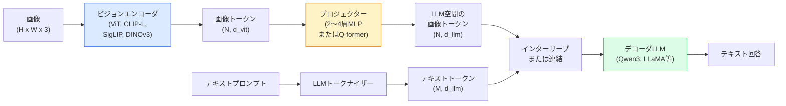

# ビジョン言語モデル — ViT-MLP-LLMパターン

> ビジョンエンコーダが画像をトークンに変換する。MLPプロジェクターがそれらのトークンをLLMの埋め込み空間にマッピングする。言語モデルが残りを行う。そのパターン — ViT-MLP-LLM — が2026年のすべての本番VLMだ。

**タイプ:** 学習 + 活用
**言語:** Python
**前提条件:** Phase 4 レッスン 14 (ViT)、Phase 4 レッスン 18 (CLIP)、Phase 7 レッスン 02 (セルフアテンション)
**所要時間:** 約75分

## 学習目標

- ViT-MLP-LLMアーキテクチャを述べ、三つの各コンポーネントが何を貢献するかを説明できる
- Qwen3-VL、InternVL3.5、LLaVA-Next、GLM-4.6Vをパラメータ数、コンテキスト長、ベンチマーク性能で比較できる
- DeepStackを説明できる：なぜ複数レベルのViT特徴量が単一の最終層特徴量より視覚言語アライメントを密にするのか
- Cross-Modal Error Rate（CMER）で本番VLMの幻覚を測定し、シグナルに対処できる

## 問題

CLIP（Phase 4 レッスン 18）は画像とテキストの共有埋め込み空間を与え、ゼロショット分類と検索には十分だ。しかしCLIPは「この画像に赤い車は何台ありますか？」に答えられない — CLIPはテキストを生成せず、類似度をスコアリングするだけだからだ。

ビジョン言語モデル（VLM）— Qwen3-VL、InternVL3.5、LLaVA-Next、GLM-4.6V — はCLIPファミリーの画像エンコーダを完全な言語モデルにボルトで固定する。モデルは画像と質問を見て答えを生成する。2026年のオープンソースVLMはマルチモーダルベンチマーク（MMMU、MMBench、DocVQA、ChartQA、MathVista、OSWorld）でGPT-5やGemini-2.5-Proに匹敵するか上回る。

三つのピース（ViT、プロジェクター、LLM）が標準だ。モデル間の違いは、どのViT、どのプロジェクター、どのLLM、学習データ、アライメントレシピだ。パターンを理解すれば、どのコンポーネントも置き換えることが機械的になる。

## コンセプト

### ViT-MLP-LLMアーキテクチャ



1. **ビジョンエンコーダ** — 事前学習済みViT（CLIP-L/14、SigLIP、DINOv3、またはファインチューニングされたバリアント）。パッチトークンを生成する。
2. **プロジェクター** — ビジョントークンをLLMの埋め込み次元にマッピングする小さなモジュール（2〜4層MLP、またはQ-former）。ほとんどのファインチューニングがここで行われる。
3. **LLM** — デコーダのみの言語モデル（Qwen3、Llama、Mistral、GLM、InternLM）。シーケンス内のビジョン + テキストトークンを読み取り、テキストを生成する。

三つのピースはすべて原理的には学習可能だ。実際には、ビジョンエンコーダとLLMはほぼ凍結したままで、プロジェクターが学習する — 安価な数十億パラメータのシグナル。

### DeepStack

バニラの射影は最後のViT層だけを使用する。DeepStack（Qwen3-VL）は複数のViT深さから特徴量をサンプリングして積み重ねる。より深い層は高レベルのセマンティクスを持つ；より浅い層はきめ細かい空間的および質感情報を持つ。両方をLLMに供給することで、「画像には何が含まれているか」（セマンティクス）と「正確にどこに」（空間的グラウンディング）のギャップが埋まる。

### 三つの学習段階

現代のVLMは段階的に学習する：

1. **アライメント** — ViTとLLMを凍結する。画像キャプションのペアでプロジェクターのみを学習させる。プロジェクターがビジョン空間から言語空間にマッピングすることを教える。
2. **事前学習** — すべてを凍結解除する。大規模なインターリーブされた画像テキストデータ（5億以上のペア）で学習する。モデルのビジュアル知識を構築する。
3. **インストラクションチューニング** — キュレートされた（画像、質問、回答）トリプルでファインチューニングする。会話行動とタスク形式を教える。これが「ビジョン対応LM」を使えるアシスタントにする。

ほとんどのLoRAファインチューニングは、小さなラベル付きデータセットでステージ3を対象とする。

### モデルファミリー比較（2026年初頭）

| モデル | パラメータ | ビジョンエンコーダ | LLM | コンテキスト | 強み |
|-------|--------|----------------|-----|---------|-----------|
| Qwen3-VL-235B-A22B (MoE) | 235B (22Bアクティブ) | カスタムViT + DeepStack | Qwen3 | 256K | 汎用SOTA、GUIエージェント |
| Qwen3-VL-30B-A3B (MoE) | 30B (3Bアクティブ) | カスタムViT + DeepStack | Qwen3 | 256K | より小さいMoEの代替 |
| Qwen3-VL-8B (dense) | 8B | カスタムViT | Qwen3 | 128K | 本番密デフォルト |
| InternVL3.5-38B | 38B | InternViT-6B | Qwen3 + GPT-OSS | 128K | 強いMMBench / MMVet |
| InternVL3.5-241B-A28B | 241B (28Bアクティブ) | InternViT-6B | Qwen3 | 128K | GPT-4oと競合 |
| LLaVA-Next 72B | 72B | SigLIP | Llama-3 | 32K | オープン、ファインチューニングが容易 |
| GLM-4.6V | ~70B | カスタム | GLM | 64K | オープンソース、強いOCR |
| MiniCPM-V-2.6 | 8B | SigLIP | MiniCPM | 32K | エッジフレンドリー |

### ビジュアルエージェント

Qwen3-VL-235BはOSWorld — GUI（デスクトップ、モバイル、ウェブ）を操作する**ビジュアルエージェント**のベンチマーク — でグローバルトップパフォーマンスに達する。モデルはスクリーンショットを見て、UIを理解し、アクション（クリック、タイプ、スクロール）を発行する。ツールと組み合わせると、一般的なデスクタスクのループを閉じる。これが2026年のほとんどの「AI PC」デモの下で実行されているものだ。

### エージェント能力 + RoPEバリアント

VLMはビデオ内のフレームが**いつ**かを知る必要がある。Qwen3-VLはT-RoPE（時間的回転位置埋め込み）から**テキストベースの時間アライメント** — ビデオフレームとインターリーブされた明示的なタイムスタンプテキストトークン — に進化した。モデルは「`<timestamp 00:32>` フレーム、プロンプト」を見て、時間的関係を推論できる。

### アライメントの問題

クロールされたデータセット内の画像テキストペアの12%には、画像に完全に根拠を置かない記述が含まれる。これで学習されたVLMは静かに幻覚を学習する — オブジェクトを捏造し、数字を誤読し、関係を作り出す。本番ではこれが主要な失敗モードだ。

Skywork.aiはそれを追跡するために**Cross-Modal Error Rate（CMER）**を導入した：

```
CMER = テキスト信頼度が高いが画像テキスト類似度（CLIPファミリーチェッカー経由）が低い出力の割合
```

高いCMERはモデルが画像に根拠を置かないことを自信を持って言っていることを意味する。CMERを監視し、本番KPIとして扱うことで、彼らのデプロイメントで幻覚率を約35%削減した。トリックは「モデルを修正する」ではなく「高CMER出力を人間のレビューにルーティングする」だ。

### LoRA / QLoRAによるファインチューニング

70B VLMの完全なファインチューニングはほとんどのチームには手が届かない。アテンション + プロジェクター層でのLoRA（ランク16〜64）、または4ビットベース重みのQLoRAは、単一のA100 / H100に収まる。コスト：5,000〜50,000サンプル、$100〜$5,000の計算コスト、2〜10時間の学習。

### 空間推論はまだ弱い

現在のVLMは空間推論ベンチマーク（上下、左右、カウント、距離）で50〜60%のスコアを出す。「どのオブジェクトが上にあるか」に依存するユースケースには、大量に検証する — 汎用VLMの性能は人間を下回る。純粋な空間タスクでのVLMより優れた代替手段：専門的なキーポイント/ポーズ推定器、深度モデル、またはボックス幾何を後処理する検出モデル。

## 構築

### ステップ1：プロジェクター

最も頻繁に学習するパーツ。GELUを持つ2〜4層MLP。

```python
import torch
import torch.nn as nn


class Projector(nn.Module):
    def __init__(self, vit_dim=768, llm_dim=4096, hidden=4096):
        super().__init__()
        self.net = nn.Sequential(
            nn.Linear(vit_dim, hidden),
            nn.GELU(),
            nn.Linear(hidden, llm_dim),
        )

    def forward(self, x):
        return self.net(x)
```

入力は`(N_patches, d_vit)`のトークンテンソル。出力は`(N_patches, d_llm)`。LLMは各出力行を別のトークンとして扱う。

### ステップ2：ViT-MLP-LLMをエンドツーエンドで組み立てる

最小VLMのフォワードパスのスケルトン。実際のコードは`transformers`を使用；これは概念的なレイアウトだ。

```python
class MinimalVLM(nn.Module):
    def __init__(self, vit, projector, llm, image_token_id):
        super().__init__()
        self.vit = vit
        self.projector = projector
        self.llm = llm
        self.image_token_id = image_token_id  # placeholder token in text prompt

    def forward(self, image, input_ids, attention_mask):
        # 1. vision features
        vision_tokens = self.vit(image)                     # (B, N_patches, d_vit)
        vision_embeds = self.projector(vision_tokens)       # (B, N_patches, d_llm)

        # 2. text embeddings
        text_embeds = self.llm.get_input_embeddings()(input_ids)  # (B, M, d_llm)

        # 3. replace image placeholder tokens with vision embeds
        merged = self._merge(text_embeds, vision_embeds, input_ids)

        # 4. run LLM
        return self.llm(inputs_embeds=merged, attention_mask=attention_mask)

    def _merge(self, text_embeds, vision_embeds, input_ids):
        out = text_embeds.clone()
        expected = vision_embeds.size(1)
        for b in range(input_ids.size(0)):
            positions = (input_ids[b] == self.image_token_id).nonzero(as_tuple=True)[0]
            if len(positions) != expected:
                raise ValueError(
                    f"batch item {b} has {len(positions)} image tokens but vision_embeds has {expected} patches."
                    " Every sample in the batch must be pre-padded to the same number of image placeholder tokens.")
            out[b, positions] = vision_embeds[b]
        return out
```

テキスト内の`<image>`プレースホルダートークンが実際の画像埋め込みに置き換えられる — LLaVA、Qwen-VL、InternVLが使う同じパターン。

### ステップ3：CMERの計算

軽量なランタイムチェック。

```python
import torch.nn.functional as F


def cross_modal_error_rate(image_emb, text_emb, text_confidence, sim_threshold=0.25, conf_threshold=0.8):
    """
    image_emb, text_emb: embeddings of image and generated text (normalised internally)
    text_confidence:     mean per-token probability in [0, 1]
    Returns:             fraction of high-confidence outputs with low image-text alignment
    """
    image_emb = F.normalize(image_emb, dim=-1)
    text_emb = F.normalize(text_emb, dim=-1)
    sim = (image_emb * text_emb).sum(dim=-1)        # cosine similarity
    high_conf_low_sim = (text_confidence > conf_threshold) & (sim < sim_threshold)
    return high_conf_low_sim.float().mean().item()
```

CMERを本番KPIとして扱う。エンドポイントごと、プロンプトタイプごと、顧客ごとに監視する。CMERの上昇はモデルが一部の入力分布で幻覚し始めていることを示す。

### ステップ4：トイVLM分類器（実行可能）

プロジェクターが学習することを示す。偽の「ViT特徴量」が入力；小さなLLMスタイルのトークンがクラスを予測する。

```python
class ToyVLM(nn.Module):
    def __init__(self, vit_dim=32, llm_dim=64, num_classes=5):
        super().__init__()
        self.projector = Projector(vit_dim, llm_dim, hidden=64)
        self.head = nn.Linear(llm_dim, num_classes)

    def forward(self, vision_tokens):
        projected = self.projector(vision_tokens)
        pooled = projected.mean(dim=1)
        return self.head(pooled)
```

200ステップ以内で合成（特徴量、クラス）ペアにフィットできる — プロジェクターパターンが機能することを示すのに十分だ。

## 活用

2026年の本番チームがVLMを使う三つの方法：

- **ホスト型API** — OpenAI Vision、Anthropic Claude Vision、Google Gemini Vision。インフラなし、ベンダーリスクあり。
- **オープンソース自己ホスト** — `transformers`と`vllm`を使ったQwen3-VLまたはInternVL3.5。完全なコントロール、初期の労力が大きい。
- **ドメインでのファインチューニング** — Qwen2.5-VL-7BまたはLLaVA-1.6-7Bをロードし、5k〜50kのカスタムサンプルでLoRAを適用し、`vllm`または`TGI`でサービング。

```python
from transformers import AutoProcessor, AutoModelForVision2Seq
import torch
from PIL import Image

model_id = "Qwen/Qwen3-VL-8B-Instruct"
processor = AutoProcessor.from_pretrained(model_id)
model = AutoModelForVision2Seq.from_pretrained(model_id, torch_dtype=torch.bfloat16, device_map="auto")

messages = [{
    "role": "user",
    "content": [
        {"type": "image", "image": Image.open("plot.png")},
        {"type": "text", "text": "What does this chart show?"},
    ],
}]
inputs = processor.apply_chat_template(messages, add_generation_prompt=True, tokenize=True, return_dict=True, return_tensors="pt").to("cuda")
generated = model.generate(**inputs, max_new_tokens=256)
answer = processor.decode(generated[0][inputs["input_ids"].shape[1]:], skip_special_tokens=True)
```

`apply_chat_template`は`<image>`プレースホルダートークン化を隠す；モデルが内部でマージを処理する。

## 成果物

このレッスンで生成されるもの：

- `outputs/prompt-vlm-selector.md` — 精度、レイテンシ、コンテキスト長、予算が与えられたとき、Qwen3-VL / InternVL3.5 / LLaVA-Next / APIを選択する。
- `outputs/skill-cmer-monitor.md` — クロスモーダル誤り率、エンドポイントごとのダッシュボード、アラートしきい値で本番VLMエンドポイントを計装するコードを出力する。

## 演習

1. **(易)** 5枚の画像に対して三つのプロンプト（「what is this?」、「count the objects」、「describe the scene」）をオープンVLMで実行する。各回答を正解 / 部分的に正解 / 幻覚として手動でスコアリングする。最初のCMERに似た率を計算する。
2. **(中)** Qwen2.5-VL-3BまたはLLaVA-1.6-7BをLoRA（ランク16）で500枚のターゲットドメイン画像とキャプションでファインチューニングする。ゼロショットとファインチューニング済みのMMBenchスタイル精度を比較する。
3. **(難)** VLMの画像エンコーダをデフォルトのSigLIP/CLIPの代わりにDINOv3に置き換える。プロジェクターのみを再学習する（LLMとDINOv3は凍結）。密な予測タスク（カウント、空間推論）が改善するかどうかを測定する。

## キーワード

| 用語 | よく言われること | 実際の意味 |
|------|----------------|----------------------|
| ViT-MLP-LLM | 「VLMパターン」 | ビジョンエンコーダ + プロジェクター + 言語モデル；2026年のすべてのVLM |
| プロジェクター | 「ブリッジ」 | ビジョントークンをLLM埋め込み空間にマッピングする2〜4層MLP（またはQ-former） |
| DeepStack | 「Qwen3-VL特徴量トリック」 | 最終層のみではなく複数レベルのViT特徴量を積み重ねる |
| 画像トークン | 「<image>プレースホルダー」 | 射影されたビジョン埋め込みで置き換えられるテキストストリームの特殊トークン |
| CMER | 「幻覚KPI」 | Cross-Modal Error Rate；テキスト信頼度が高いが画像テキスト類似度が低いとき高くなる |
| ビジュアルエージェント | 「クリックするVLM」 | ツール呼び出しでGUI（OSWorld、モバイル、ウェブ）を操作するVLM |
| Q-former | 「固定数トークンブリッジ」 | BLIP-2スタイルのプロジェクター、固定数のビジュアルクエリトークンを生成する |
| アライメント / 事前学習 / インストラクションチューニング | 「三段階」 | 標準的なVLM学習パイプライン |

## 参考文献

- [Qwen3-VL Technical Report (arXiv 2511.21631)](https://arxiv.org/abs/2511.21631)
- [InternVL3.5 Advancing Open-Source Multimodal Models (arXiv 2508.18265)](https://arxiv.org/html/2508.18265v1)
- [LLaVA-Next series](https://llava-vl.github.io/blog/2024-05-10-llava-next-stronger-llms/)
- [BentoML: Best Open-Source VLMs 2026](https://www.bentoml.com/blog/multimodal-ai-a-guide-to-open-source-vision-language-models)
- [MMMU: Multi-discipline Multimodal Understanding benchmark](https://mmmu-benchmark.github.io/)
- [VLMs in manufacturing (Robotics Tomorrow, March 2026)](https://www.roboticstomorrow.com/story/2026/03/when-machines-learn-to-see-like-experts-the-rise-of-vision-language-models-in-manufacturing/26335/)
