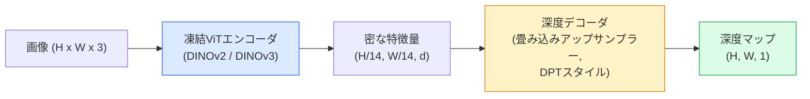

# 単眼深度推定と幾何学的推定

> 深度マップは、各ピクセルがカメラからの距離を表す単チャンネルの画像です。1枚のRGBフレームからそれを予測することは、ステレオカメラやLiDARなしでは不可能とされていました。2026年では、凍結されたViTエンコーダと軽量なヘッドを組み合わせることで、グラウンドトゥルースに数パーセント以内まで迫れます。

**タイプ:** 構築 + 活用
**言語:** Python
**前提条件:** Phase 4 Lesson 14 (ViT)、Phase 4 Lesson 17 (自己教師ありビジョン)、Phase 4 Lesson 07 (U-Net)
**所要時間:** 約60分

## 学習目標

- 相対深度とメトリック深度を区別し、各プロダクションモデル（MiDaS、Marigold、Depth Anything V3、ZoeDepth）がどちらを解くかを述べる
- Depth Anything V3（DINOv2バックボーン）を使って、キャリブレーションなしで任意の単一画像の深度を予測する
- 単眼深度がなぜ1枚の画像から機能するか（透視手がかり、テクスチャ勾配、学習された事前知識）、および何を復元できないか（絶対スケール、遮蔽された幾何形状）を説明する
- 深度マップとピンホールカメラの内部パラメータを使って2D検出を3D点に持ち上げる

## 問題

深度は2Dコンピュータビジョンにおける欠けている軸です。RGBが与えられると、物体が画像平面のどこに現れるかはわかりますが、どれだけ遠いかはわかりません。深度センサー（ステレオリグ、LiDAR、タイムオブフライト）はこれを直接解決しますが、高価で壊れやすく、測距範囲に限界があります。

単眼深度推定——1枚のRGBフレームから深度を予測すること——は、以前はぼやけた不安定な出力しか生成できませんでした。2026年までに、大規模な事前学習済みエンコーダがこれを変えました：Depth Anything V3は凍結されたDINOv2バックボーンを使用し、屋内、屋外、医療、衛星などのドメインにわたって汎化する深度マップを生成します。Marigoldは深度を条件付き拡散問題として再定式化します。ZoeDepthは真のメトリック距離を回帰します。

深度はまた、2D検出と3D理解の橋渡しでもあります：検出されたボックスのピクセルに深度を掛けることで、2Dオブジェクトを3D点群に持ち上げます。これはすべてのAR遮蔽システム、すべての障害物回避パイプライン、そして「カップを拾い上げて」というロボットのコアです。

## コンセプト

### 相対深度とメトリック深度

- **相対深度** — 実世界の単位を持たない順序付き`z`値。「ピクセルAはピクセルBより近いが、距離の比はメートルに固定されていない。」
- **メトリック深度** — カメラからのメートル単位の絶対距離。モデルが画像の手がかりと実際の距離の統計的関係を学習している必要がある。

MiDaSとDepth Anything V3は相対深度を生成します。Marigoldは相対深度を生成します。ZoeDepth、UniDepth、Metric3Dはメトリック深度を生成します。メトリックモデルはカメラの内部パラメータに敏感で、相対モデルはそうではありません。

### エンコーダ-デコーダパターン



Depth Anything V3はエンコーダを凍結し、DPTスタイルのデコーダのみを訓練します。エンコーダは豊富な特徴量を提供し、デコーダはそれらを画像解像度まで補間して深度を回帰します。

### なぜ単一画像から深度が得られるのか

2D画像には、深度と相関する多くの単眼手がかりが含まれています：

- **透視** — 3D空間の平行線は2Dでは収束する。
- **テクスチャ勾配** — 遠くの表面はテクスチャが小さく密になる。
- **遮蔽順序** — 近い物体は遠い物体を遮蔽する。
- **大きさの恒常性** — 既知の物体（車、人間）がおおよそのスケールを提供する。
- **大気遠近法** — 屋外シーンでは遠い物体がより霞んで青みがかって見える。

数十億の画像で訓練されたViTはこれらの手がかりを内面化します。十分なデータと強力なバックボーンがあれば、単眼深度は明示的な3D監督なしに妥当な精度に達します。

### 単眼深度にできないこと

- **絶対メトリックスケール**：内部パラメータやシーン内の既知物体がなければ。ネットワークは「カップはスプーンの2倍遠い」と予測できますが、カップが1mなのか10mなのかは知れません。
- **遮蔽された幾何形状** — 椅子の背面は見えず、確実に推論することはできません。
- **完全に無地の/反射する表面** — 鏡、ガラス、均一な壁。ネットワークはもっともらしいが誤った深度を報告します。

### 2026年のDepth Anything V3

- エンコーダとしてバニラDINOv2 ViT-L/14（凍結）。
- DPTデコーダ。
- 多様なソースからのポーズ付き画像ペアで訓練（光学的一貫性を超えた明示的な深度監督は不要）。
- **任意の数の視覚入力から、既知のカメラポーズの有無にかかわらず**空間的に一貫した幾何形状を予測。
- 単眼深度、任意視点幾何形状、視覚レンダリング、カメラポーズ推定においてSOTA。

これが2026年で深度が必要な場合に呼び出すドロップインモデルです。

### Marigold——拡散による深度推定

Marigold（Ke et al., CVPR 2024）は深度推定を条件付き画像-to-画像拡散として再定式化します。条件付け：RGB。ターゲット：深度マップ。バックボーンとして事前学習済みのStable Diffusion 2 U-Netを使用。出力深度マップは物体境界において特別に鮮明です。トレードオフ：フィードフォワードモデルより推論が遅い（10-50ノイズ除去ステップ）。

### 内部パラメータとピンホールカメラ

深度`d`を持つピクセル`(u, v)`をカメラ座標の3D点`(X, Y, Z)`に持ち上げるには：

```
fx, fy, cx, cy = カメラ内部パラメータ
X = (u - cx) * d / fx
Y = (v - cy) * d / fy
Z = d
```

内部パラメータはEXIFメタデータ、キャリブレーションパターン、または単眼内部パラメータ推定器（Perspective Fields、UniDepth）から得られます。内部パラメータなしでも、60-70°のFOVと適度な解像度の主点を仮定することでポイントクラウドをレンダリングできます——可視化には使えますが、測定には使えません。

### 評価

2つの標準メトリクス：

- **AbsRel**（絶対相対誤差）：`mean(|d_pred - d_gt| / d_gt)`。小さいほど良い。プロダクションモデルで0.05-0.1。
- **delta < 1.25**（閾値精度）：`max(d_pred/d_gt, d_gt/d_pred) < 1.25`となるピクセルの割合。大きいほど良い。SOTAで0.9以上。

相対深度（Depth Anything V3、MiDaS）の評価では、両メトリクスのスケール・シフト不変バージョンを使用します。

## 構築する

### ステップ1：深度メトリクス

```python
import torch

def abs_rel_error(pred, target, mask=None):
    if mask is not None:
        pred = pred[mask]
        target = target[mask]
    return (torch.abs(pred - target) / target.clamp(min=1e-6)).mean().item()


def delta_accuracy(pred, target, threshold=1.25, mask=None):
    if mask is not None:
        pred = pred[mask]
        target = target[mask]
    ratio = torch.maximum(pred / target.clamp(min=1e-6), target / pred.clamp(min=1e-6))
    return (ratio < threshold).float().mean().item()
```

評価前に、無効な深度ピクセル（ゼロ、NaN、飽和）を必ずマスクしてください。

### ステップ2：スケールとシフトのアライメント

相対深度モデルでは、メトリクスを計算する前に予測をグラウンドトゥルースにアライメントします。`a * pred + b = target`の最小二乗フィット：

```python
def align_scale_shift(pred, target, mask=None):
    if mask is not None:
        p = pred[mask]
        t = target[mask]
    else:
        p = pred.flatten()
        t = target.flatten()
    A = torch.stack([p, torch.ones_like(p)], dim=1)
    coeffs, *_ = torch.linalg.lstsq(A, t.unsqueeze(-1))
    a, b = coeffs[:2, 0]
    return a * pred + b
```

MiDaS / Depth Anythingを評価する際は、`abs_rel_error`の前に`align_scale_shift`を実行してください。

### ステップ3：深度をポイントクラウドに持ち上げる

```python
import numpy as np

def depth_to_point_cloud(depth, intrinsics):
    H, W = depth.shape
    fx, fy, cx, cy = intrinsics
    v, u = np.meshgrid(np.arange(H), np.arange(W), indexing="ij")
    z = depth
    x = (u - cx) * z / fx
    y = (v - cy) * z / fy
    return np.stack([x, y, z], axis=-1)


depth = np.random.uniform(0.5, 4.0, (240, 320))
intr = (320.0, 320.0, 160.0, 120.0)
pc = depth_to_point_cloud(depth, intr)
print(f"point cloud shape: {pc.shape}  (H, W, 3)")
```

1つの関数で、すべての3D持ち上げアプリケーションに対応します。ポイントクラウドを`.ply`にエクスポートして、MeshLabやCloudCompareで開けます。

### ステップ4：合成深度シーンでのスモークテスト

```python
def synthetic_depth(size=96):
    yy, xx = np.meshgrid(np.arange(size), np.arange(size), indexing="ij")
    # 床：上から下に向かって近くから遠くへの線形勾配
    depth = 1.0 + (yy / size) * 4.0
    # 中央のボックス：より近い
    mask = (np.abs(xx - size / 2) < size / 6) & (np.abs(yy - size * 0.6) < size / 6)
    depth[mask] = 2.0
    return depth.astype(np.float32)


gt = torch.from_numpy(synthetic_depth(96))
pred = gt + 0.3 * torch.randn_like(gt)  # シミュレートされた予測
aligned = align_scale_shift(pred, gt)
print(f"before align  absRel = {abs_rel_error(pred, gt):.3f}")
print(f"after align   absRel = {abs_rel_error(aligned, gt):.3f}")
```

### ステップ5：Depth Anything V3の使い方（参考）

```python
import torch
from transformers import pipeline
from PIL import Image

pipe = pipeline(task="depth-estimation", model="LiheYoung/depth-anything-v2-large")

image = Image.open("street.jpg").convert("RGB")
out = pipe(image)
depth_np = np.array(out["depth"])
```

3行で完了です。`out["depth"]`はPILグレースケールです。数値計算のためにnumpyに変換してください。Depth Anything V3については、リリース後にモデルIDを変更するだけで、APIは変わりません。

## 活用する

- **Depth Anything V3**（Meta AI / ByteDance、2024-2026）——相対深度のデフォルト。プロダクションで最も速いViT-largeバックボーンモデル。
- **Marigold**（ETH、2024）——最高の視覚品質、低速な推論。
- **UniDepth**（ETH、2024）——カメラ内部パラメータ推定付きのメトリック深度。
- **ZoeDepth**（Intel、2023）——メトリック深度；古いが、まだ信頼性あり。
- **MiDaS v3.1** ——レガシーだが安定；比較の良いベースライン。

典型的な統合パターン：

1. RGBフレームが届く。
2. 深度モデルが深度マップを生成する。
3. 検出器がボックスを生成する。
4. ボックスのセントロイドを深度で3Dに持ち上げ、利用可能ならポイントクラウドとマージする。
5. 下流：AR遮蔽、経路計画、物体サイズ推定、ステレオ置き換え。

リアルタイム使用では、Depth Anything V2 Small（INT8量子化）が518x518でコンシューマGPUにて約30 fpsを達成します。

## 出力成果物

このレッスンでは以下を生成します：

- `outputs/prompt-depth-model-picker.md` ——レイテンシ、メトリック対相対の必要性、シーンタイプに応じてDepth Anything V3、Marigold、UniDepth、MiDaSを選択。
- `outputs/skill-depth-to-pointcloud.md` ——正しい内部パラメータ処理と`.ply`へのエクスポートを用いて深度マップからポイントクラウドを構築するスキル。

## 演習

1. **(Easy)** 机の上の任意の10枚の画像でDepth Anything V2を実行する。深度をグレースケールPNGとして保存して確認する。予測深度が間違って見える1つの物体を特定し、なぜ単眼手がかりが失敗したかを説明する。
2. **(Medium)** Depth Anything V2からのRGB+深度を使ってポイントクラウドに持ち上げ、`open3d`でレンダリングする。2つのシーン（屋内/屋外）を比較し、どちらがより説得力があるかを記録する。
3. **(Hard)** 既知の物体の位置だけが異なる5組の画像ペアを撮影する（例：ボトルを30cm近くに移動）。UniDepthを使って両方のメトリック深度を予測する。予測された距離デルタと真の30cmを報告する。

## 用語集

| 用語 | よく言われること | 実際の意味 |
|------|----------------|----------------------|
| 単眼深度 | 「単一画像深度」 | ステレオやLiDARなしの1枚のRGBフレームからの深度推定 |
| 相対深度 | 「順序付き深度」 | 実世界の単位を持たない順序付きz値 |
| メトリック深度 | 「絶対距離」 | メートル単位の深度；キャリブレーションまたはメトリック監督で訓練されたモデルが必要 |
| AbsRel | 「絶対相対誤差」 | |d_pred - d_gt| / d_gtの平均；標準深度メトリクス |
| デルタ精度 | 「delta < 1.25」 | グラウンドトゥルースの25%以内の予測を持つピクセルの割合 |
| ピンホールカメラ | 「fx, fy, cx, cy」 | (u, v, d)を(X, Y, Z)に持ち上げるために使用されるカメラモデル |
| DPT | 「Dense Prediction Transformer」 | 深度のための凍結ViTエンコーダの上で使用される畳み込みベースのデコーダ |
| DINOv2バックボーン | 「機能する理由」 | 深度ラベルなしでドメインにわたって汎化する自己教師あり特徴量 |

## 参考文献

- [Depth Anything V3 論文ページ](https://depth-anything.github.io/) — DINOv2エンコーダを用いたSOTA単眼深度
- [Marigold (Ke et al., CVPR 2024)](https://marigoldmonodepth.github.io/) — 拡散ベースの深度推定
- [UniDepth (Piccinelli et al., 2024)](https://arxiv.org/abs/2403.18913) — 内部パラメータ付きのメトリック深度
- [MiDaS v3.1 (Intel ISL)](https://github.com/isl-org/MiDaS) — 正規の相対深度ベースライン
- [DINOv3 ブログ記事 (Meta)](https://ai.meta.com/blog/dinov3-self-supervised-vision-model/) — 深度精度を向上させるエンコーダファミリー
