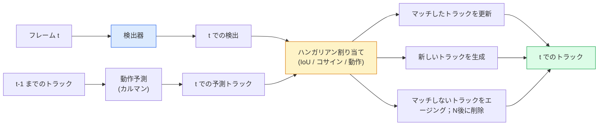

# マルチオブジェクトトラッキングとビデオメモリ

> トラッキングは検出とアソシエーションの組み合わせです。毎フレーム検出する。IDによって今フレームの検出を前フレームのトラックに対応付ける。

**タイプ:** 構築
**言語:** Python
**前提条件:** Phase 4 Lesson 06 (YOLO検出)、Phase 4 Lesson 08 (Mask R-CNN)、Phase 4 Lesson 24 (SAM 3)
**所要時間:** 約60分

## 学習目標

- 検出ベーストラッキングとクエリベーストラッキングを区別し、アルゴリズムファミリー（SORT、DeepSORT、ByteTrack、BoT-SORT、SAM 2メモリトラッカー、SAM 3.1 Object Multiplex）を名付ける
- 古典的な検出ベーストラッキングのためのIoU + ハンガリアン割り当てをスクラッチから実装する
- SAM 2のメモリバンクを説明し、なぜIoUベースのアソシエーションより遮蔽をうまく処理できるかを説明する
- 3つのトラッキングメトリクス（MOTA、IDF1、HOTA）を読み解き、特定のユースケースに対してどれが重要かを選ぶ

## 問題

検出器は1つのフレームにおける物体の位置を教えてくれます。トラッカーはフレーム`t`のどの検出がフレーム`t-1`の検出と同じ物体かを教えてくれます。それがなければ、ライン上を横断する物体を数えることも、遮蔽を経てボールを追跡することも、「車#4は8秒間その車線にいた」ということを知ることもできません。

トラッキングはあらゆるビデオ向け製品に不可欠です：スポーツ分析、監視、自律走行、医療ビデオ分析、野生動物モニタリング、ロゴカウント。コアの構成要素は共通しています：フレームごとの検出器、動作モデル（カルマンフィルタやより高度なもの）、アソシエーションステップ（IoU / コサイン / 学習された特徴量のハンガリアンアルゴリズム）、そしてトラックライフサイクル（誕生、更新、終了）。

2026年には2つの新しいパターンが登場しました：**SAM 2メモリベーストラッキング**（動作モデルアソシエーションの代わりに特徴量メモリ）と**SAM 3.1 Object Multiplex**（同じコンセプトの多数のインスタンスに対する共有メモリ）。このレッスンでは古典的なスタックを先に説明し、次にメモリベースのアプローチを説明します。

## コンセプト

### 検出ベーストラッキング



2026年に遭遇するすべてのトラッカーはこのループのバリエーションです。違いは：

- **SORT**（2016）：カルマンフィルタ + IoUハンガリアン。シンプルで高速、外観モデルなし。
- **DeepSORT**（2017）：SORT + トラックごとのCNNベース外観特徴量（ReID埋め込み）。交差をより良く処理。
- **ByteTrack**（2021）：低信頼度の検出を第2段階としてアソシエート；外観特徴量不要だがMOT17でトップパフォーマー。
- **BoT-SORT**（2022）：Byte + カメラ動作補正 + ReID。
- **StrongSORT / OC-SORT** ——より良い動作と外観を持つByteTackの派生。

### カルマンフィルタをひと言で

カルマンフィルタはトラックごとの状態`(x, y, w, h, dx, dy, dw, dh)`を共分散と共に維持します。各フレームで、定速モデルを使って状態を**予測**し、次にマッチした検出で**更新**します。予測の不確実性が高い場合、更新は検出をより信頼します。これにより滑らかな軌跡が得られ、短い遮蔽（1-5フレーム）を通じてトラックを継続できます。

すべての古典的トラッカーは動作予測ステップでカルマンフィルタを使用します。

### ハンガリアンアルゴリズム

`M x N`のコスト行列（トラック x 検出）を与えられ、総コストを最小化する1対1の割り当てを見つけます。コストは通常`1 - IoU(track_bbox, detection_bbox)`または外観特徴量の負のコサイン類似度です。実行時間はO((M+N)^3)；M、Nが〜1000までの場合、`scipy.optimize.linear_sum_assignment`経由でPythonで十分高速です。

### ByteTrackの核心的なアイデア

標準トラッカーは低信頼度の検出（< 0.5）を除外します。ByteTrackはそれらを**第2段階の候補**として保持します：高信頼度の検出にトラックをマッチングした後、マッチしないトラックはわずかに緩いIoU閾値で低信頼度の検出にマッチを試みます。短い遮蔽やクラウド近辺でのIDスイッチを回復します。

### SAM 2メモリベーストラッキング

SAM 2はインスタンスごとの時空間特徴量の**メモリバンク**を保持することでビデオを処理します。1つのフレームでプロンプト（クリック、ボックス、テキスト）が与えられると、インスタンスをメモリにエンコードします。後続のフレームでは、メモリが新しいフレームの特徴量にクロスアテンションされ、デコーダが新しいフレームの同じインスタンスのマスクを生成します。

カルマンフィルタもハンガリアン割り当てもありません。アソシエーションはメモリアテンション操作に暗黙的に含まれています。

長所：
- 大きな遮蔽に対して頑健（メモリは多くのフレームにわたってインスタンスのアイデンティティを持ち続ける）。
- SAM 3のテキストプロンプトと組み合わせるとオープンボキャブラリー。
- 別個の動作モデルなしで機能。

短所：
- 多数物体トラッキングではByteTackより遅い。
- メモリバンクが成長し、コンテキストウィンドウが制限される。

### SAM 3.1 Object Multiplex

以前のSAM 2 / SAM 3トラッキングはインスタンスごとに別個のメモリバンクを保持していました。50個の物体に対して50個のメモリバンク。Object Multiplex（2026年3月）はそれらを**インスタンスごとのクエリトークン**を持つ1つの共有メモリに統合します。コストはインスタンス数に対してサブ線形にスケールします。

Multiplexは2026年のクラウドトラッキングの新しいデフォルトです：コンサートの群衆、倉庫の作業員、交差点。

### 知っておくべき3つのメトリクス

- **MOTA（Multi-Object Tracking Accuracy）** — 1 - (FN + FP + IDスイッチ) / GT。エラータイプで重み付け；検出とアソシエーションの失敗を混在させた単一メトリクス。
- **IDF1（ID F1）** — IDの適合率と再現率の調和平均。各グラウンドトゥルーストラックが時間をかけてIDを保つ方法に特化。IDスイッチに敏感なタスクではMOTAより優れている。
- **HOTA（Higher Order Tracking Accuracy）** — 検出精度（DetA）とアソシエーション精度（AssA）に分解。2020年以来のコミュニティ標準；最も包括的。

監視（誰が誰か）：IDF1を報告。スポーツ分析（パスを数える）：HOTA。一般的な学術比較：HOTA。

## 構築する

### ステップ1：IoUベースのコスト行列

```python
import numpy as np


def bbox_iou(a, b):
    """
    a, b: (N, 4) arrays of [x1, y1, x2, y2].
    Returns (N_a, N_b) IoU matrix.
    """
    ax1, ay1, ax2, ay2 = a[:, 0], a[:, 1], a[:, 2], a[:, 3]
    bx1, by1, bx2, by2 = b[:, 0], b[:, 1], b[:, 2], b[:, 3]
    inter_x1 = np.maximum(ax1[:, None], bx1[None, :])
    inter_y1 = np.maximum(ay1[:, None], by1[None, :])
    inter_x2 = np.minimum(ax2[:, None], bx2[None, :])
    inter_y2 = np.minimum(ay2[:, None], by2[None, :])
    inter = np.clip(inter_x2 - inter_x1, 0, None) * np.clip(inter_y2 - inter_y1, 0, None)
    area_a = (ax2 - ax1) * (ay2 - ay1)
    area_b = (bx2 - bx1) * (by2 - by1)
    union = area_a[:, None] + area_b[None, :] - inter
    return inter / np.clip(union, 1e-8, None)
```

### ステップ2：最小限のSORTスタイルトラッカー

簡略のため、固定された定速カルマンは省略——ここでは単純なIoUアソシエーションを使用します；プロダクションではカルマン予測が不可欠です。`sort`Pythonパッケージが完全バージョンを提供しています。

```python
from scipy.optimize import linear_sum_assignment


class Track:
    def __init__(self, tid, bbox, frame):
        self.id = tid
        self.bbox = bbox
        self.last_frame = frame
        self.hits = 1

    def update(self, bbox, frame):
        self.bbox = bbox
        self.last_frame = frame
        self.hits += 1


class SimpleTracker:
    def __init__(self, iou_threshold=0.3, max_age=5):
        self.tracks = []
        self.next_id = 1
        self.iou_threshold = iou_threshold
        self.max_age = max_age

    def step(self, detections, frame):
        if not self.tracks:
            for d in detections:
                self.tracks.append(Track(self.next_id, d, frame))
                self.next_id += 1
            return [(t.id, t.bbox) for t in self.tracks]

        track_boxes = np.array([t.bbox for t in self.tracks])
        det_boxes = np.array(detections) if len(detections) else np.empty((0, 4))

        iou = bbox_iou(track_boxes, det_boxes) if len(det_boxes) else np.zeros((len(track_boxes), 0))
        cost = 1 - iou
        cost[iou < self.iou_threshold] = 1e6

        matched_track = set()
        matched_det = set()
        if cost.size > 0:
            row, col = linear_sum_assignment(cost)
            for r, c in zip(row, col):
                if cost[r, c] < 1.0:
                    self.tracks[r].update(det_boxes[c], frame)
                    matched_track.add(r); matched_det.add(c)

        for i, d in enumerate(det_boxes):
            if i not in matched_det:
                self.tracks.append(Track(self.next_id, d, frame))
                self.next_id += 1

        self.tracks = [t for t in self.tracks if frame - t.last_frame <= self.max_age]
        return [(t.id, t.bbox) for t in self.tracks]
```

60行。フレームごとの検出を受け取り、フレームごとのトラックIDを返します。実際のシステムにはカルマン予測、ByteTrackの第2段階再マッチ、外観特徴量が追加されます。

### ステップ3：合成軌跡テスト

```python
def synthetic_frames(num_frames=20, num_objects=3, H=240, W=320, seed=0):
    rng = np.random.default_rng(seed)
    starts = rng.uniform(20, 200, size=(num_objects, 2))
    velocities = rng.uniform(-5, 5, size=(num_objects, 2))
    frames = []
    for f in range(num_frames):
        dets = []
        for i in range(num_objects):
            cx, cy = starts[i] + f * velocities[i]
            dets.append([cx - 10, cy - 10, cx + 10, cy + 10])
        frames.append(dets)
    return frames


tracker = SimpleTracker()
for f, dets in enumerate(synthetic_frames()):
    tracks = tracker.step(dets, f)
```

直線上を移動する3つの物体は、20フレームすべてにわたってIDを保持するはずです。

### ステップ4：IDスイッチメトリクス

```python
def count_id_switches(tracks_per_frame, gt_per_frame):
    """
    tracks_per_frame:  list of list of (track_id, bbox)
    gt_per_frame:      list of list of (gt_id, bbox)
    Returns number of ID switches.
    """
    prev_assignment = {}
    switches = 0
    for tracks, gts in zip(tracks_per_frame, gt_per_frame):
        if not tracks or not gts:
            continue
        t_boxes = np.array([b for _, b in tracks])
        g_boxes = np.array([b for _, b in gts])
        iou = bbox_iou(g_boxes, t_boxes)
        for g_idx, (gt_id, _) in enumerate(gts):
            j = iou[g_idx].argmax()
            if iou[g_idx, j] > 0.5:
                t_id = tracks[j][0]
                if gt_id in prev_assignment and prev_assignment[gt_id] != t_id:
                    switches += 1
                prev_assignment[gt_id] = t_id
    return switches
```

これはIDF1に近い簡略化されたメトリクスです：グラウンドトゥルースの物体が割り当てられた予測トラックIDを何回変更するかを数えます。実際のMOTA / IDF1 / HOTAのツールは`py-motmetrics`と`TrackEval`にあります。

## 活用する

2026年のプロダクショントラッカー：

- `ultralytics` ——YOLOv8 + ByteTrack / BoT-SORT内蔵。`results = model.track(source, tracker="bytetrack.yaml")`。デフォルト。
- `supervision`（Roboflow）——ByteTrackラッパーとアノテーションユーティリティ。
- SAM 2 / SAM 3.1 ——`processor.track()`経由のメモリベーストラッキング。
- カスタムスタック：検出器（YOLOv8 / RT-DETR）+ `sort-tracker` / `OC-SORT` / `StrongSORT`。

選択指針：

- 30+ fpsでの歩行者/車/ボックス：**ByteTrackとultralytics**。
- クラウド内の1クラスの多数インスタンス：**SAM 3.1 Object Multiplex**。
- 識別可能な外観を持つ重度の遮蔽：**DeepSORT / StrongSORT**（ReID特徴量）。
- スポーツ/複雑なインタラクション：**BoT-SORT**または学習トラッカー（MOTRv3）。

## 出力成果物

このレッスンでは以下を生成します：

- `outputs/prompt-tracker-picker.md` ——シーンタイプ、遮蔽パターン、レイテンシ予算に応じてSORT / ByteTrack / BoT-SORT / SAM 2 / SAM 3.1を選択。
- `outputs/skill-mot-evaluator.md` ——グラウンドトゥルーストラックに対するMOTA / IDF1 / HOTAの完全な評価ハーネスを書く。

## 演習

1. **(Easy)** 上記の合成トラッカーを3、10、30個の物体で実行する。それぞれの場合のIDスイッチ数を報告する。単純なIoUのみのアソシエーションが失敗し始める場所を特定する。
2. **(Medium)** アソシエーション前に定速カルマン予測ステップを追加する。短い（2-3フレーム）遮蔽がIDスイッチを引き起こさなくなることを示す。
3. **(Hard)** SAM 2のメモリベーストラッカー（`transformers`経由）を代替トラッカーバックエンドとして統合する。群衆の30秒クリップでSimpleTrackerとSAM 2の両方を実行し、5人の目立つ人のグラウンドトゥルースIDを手動でラベル付けしてIDスイッチ数を比較する。

## 用語集

| 用語 | よく言われること | 実際の意味 |
|------|----------------|----------------------|
| 検出ベーストラッキング | 「検出してアソシエート」 | フレームごとの検出器 + IoU/外観のハンガリアン割り当て |
| カルマンフィルタ | 「動作予測」 | 滑らかなトラック予測と遮蔽処理のための線形ダイナミクス + 共分散 |
| ハンガリアンアルゴリズム | 「最適割り当て」 | 最小コスト二部マッチング問題を解く；`scipy.optimize.linear_sum_assignment` |
| ByteTrack | 「低信頼度の第2パス」 | 短い遮蔽を回復するためにマッチしないトラックを低信頼度の検出に再マッチ |
| DeepSORT | 「SORT + 外観」 | クロスフレームマッチングのためのReID特徴量を追加；ID保持に優れる |
| メモリバンク | 「SAM 2のトリック」 | フレームをまたいで保存されたインスタンスごとの時空間特徴量；クロスアテンションが明示的アソシエーションを置き換える |
| Object Multiplex | 「SAM 3.1の共有メモリ」 | 高速な多数物体トラッキングのためのインスタンスごとのクエリを持つ単一共有メモリ |
| HOTA | 「現代のトラッキングメトリクス」 | 検出とアソシエーションの精度に分解；コミュニティ標準 |

## 参考文献

- [SORT (Bewley et al., 2016)](https://arxiv.org/abs/1602.00763) — 最小限の検出ベーストラッキング論文
- [DeepSORT (Wojke et al., 2017)](https://arxiv.org/abs/1703.07402) — 外観特徴量を追加
- [ByteTrack (Zhang et al., 2022)](https://arxiv.org/abs/2110.06864) — 低信頼度の第2パス
- [BoT-SORT (Aharon et al., 2022)](https://arxiv.org/abs/2206.14651) — カメラ動作補正
- [HOTA (Luiten et al., 2020)](https://arxiv.org/abs/2009.07736) — 分解されたトラッキングメトリクス
- [SAM 2 ビデオセグメンテーション (Meta, 2024)](https://ai.meta.com/sam2/) — メモリベーストラッカー
- [SAM 3.1 Object Multiplex (Meta, 2026年3月)](https://ai.meta.com/blog/segment-anything-model-3/)
