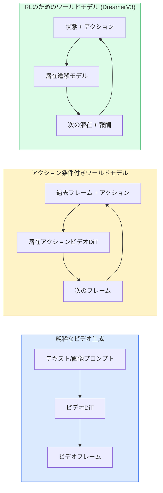

# ワールドモデルとビデオ拡散

> シーンの次の数秒を予測するビデオモデルはワールドシミュレータです。その予測をアクションで条件付けると、学習可能なゲームエンジンになります。

**タイプ:** 学習 + 構築
**言語:** Python
**前提条件:** Phase 4 Lesson 10 (拡散)、Phase 4 Lesson 12 (ビデオ理解)、Phase 4 Lesson 23 (DiT + Rectified Flow)
**所要時間:** 約75分

## 学習目標

- 純粋なビデオ生成モデル（Sora 2）とアクション条件付きワールドモデル（Genie 3、DreamerV3）の違いを説明する
- ビデオDiTを説明する：時空間パッチ、3D位置エンコーディング、(T, H, W)トークンにわたる統合アテンション
- ワールドモデルがロボティクスにどのように組み込まれるかを追跡する：VLMが計画 → ビデオモデルがシミュレート → 逆ダイナミクスがアクションを生成
- 与えられたユースケース（クリエイティブビデオ、インタラクティブシム、自律走行合成）に対してSora 2、Genie 3、Runway GWM-1 Worlds、Wan-Video、HunyuanVideoを選択する

## 問題

ビデオ生成とワールドモデリングは2026年に収束しました。一貫した1分のビデオを生成できるモデルは、ある意味で世界がどのように動くかを学習しています：物体の永続性、重力、因果関係、スタイル。その予測をアクション（左に歩く、ドアを開ける）で条件付けると、ビデオモデルはゲームエンジン、走行シミュレータ、またはロボティクス環境を置き換えられる学習可能なシミュレータになります。

その賭けは具体的です。Genie 3は単一の画像からプレイ可能な環境を生成します。Runway GWM-1 Worldsは無限に探索可能なシーンを合成します。Sora 2は同期した音声とモデル化された物理学を持つ1分間のビデオを生成します。NVIDIA Cosmos-Drive、Wayve Gaia-2、Tesla DrivingWorldは自律走行の訓練データのためのリアルな走行ビデオを生成します。ワールドモデルのパラダイムは静かにロボティクスのシム-to-リアルを引き継いでいます。

このレッスンはPhase 4の「ビッグピクチャー」レッスンです。画像生成、ビデオ理解、エージェント的推論を、現在の主要研究が向かっているアーキテクチャパターンに結び付けます。

## コンセプト

### ワールドモデリングの3つのファミリー



- **Sora 2**はプロンプトで条件付けられた純粋なビデオ生成です。アクションインターフェースなし。ロールアウト途中で「操舵」することはできません。
- **Genie 3**、**GWM-1 Worlds**、**Mirage / Magica**はアクション条件付きワールドモデルです。観測されたビデオから潜在アクションを推論し、次のフレーム予測をアクションで条件付けます。インタラクティブ——キーを押したりカメラを動かしたりするとシーンが反応します。
- **DreamerV3**と古典的なRLワールドモデルファミリーは、報酬信号で訓練された明示的なアクション条件付きで潜在空間で予測します。視覚的ではありませんが、サンプル効率の良いRLに対してより有用です。

### ビデオDiTアーキテクチャ

```
ビデオ潜在：          (C, T, H, W)
パッチ化（空間）：    フレームごとのP_h x P_wパッチのグリッド
パッチ化（時間）：    P_tフレームを時間パッチにグループ化
結果トークン：        (T / P_t) * (H / P_h) * (W / P_w) トークン
```

位置エンコーディングは3D：(t, h, w)座標ごとの回転式または学習済み埋め込み。アテンションは：

- **完全結合** ——すべてのトークンがすべてのトークンにアテンション。N個のトークンでO(N^2)。長いビデオでは禁止的。
- **分割** ——時間アテンション（同じ空間位置、時間を超えて：`(H*W) * T^2`）と空間アテンション（同じタイムステップ、空間を超えて：`T * (H*W)^2`）を交互に。TimeSformerとほとんどのビデオDiTで使用。
- **ウィンドウ** ——(t, h, w)のローカルウィンドウ。Video Swinで使用。

2026年のすべてのビデオ拡散モデルは、AdaLN条件付け（Lesson 23）とRectified Flowに加えて、これら3つのパターンのいずれかを使用しています。

### アクションの条件付け：潜在アクションモデル

Genieは、連続するフレームペア間のアクションを識別的に予測することで、フレームごとの**潜在アクション**を学習します。モデルのデコーダは推論された潜在アクションで条件付けられます——明示的なキーボードキーではなく。推論時、ユーザーは潜在アクションを指定（または新しい事前分布からサンプリング）でき、モデルはそのアクションと一致する次のフレームを生成します。

Soraはアクションインターフェースを完全にスキップします。そのデコーダは過去の時空間トークンから次の時空間トークンを予測します。プロンプトが開始を条件付けし、何も生成途中で操舵しません。

### 物理的妥当性

Sora 2の2026年リリースは明示的に**物理的妥当性**を宣伝しました：重量、バランス、物体の永続性、因果関係。チームが手動評価の妥当性スコアで測定；モデルは落下する物体、衝突するキャラクター、意図的な失敗（ジャンプの失敗）においてSora 1より明らかに改善されています。

妥当性は依然として主要な失敗モードです。2024-2025年のスパゲッティを食べる人やグラスから飲む人のビデオは、モデルの持続的な物体表現の欠如を明らかにしました。2026年のモデル（Sora 2、Runway Gen-5、HunyuanVideo）はこれらを減少させますが排除しません。

### 自律走行ワールドモデル

走行ワールドモデルは、軌跡、バウンディングボックス、またはナビゲーションマップで条件付けられたリアルな道路シーンを生成します。使用法：

- **Cosmos-Drive-Dreams**（NVIDIA）——RL訓練のための数分の走行ビデオを生成。
- **Gaia-2**（Wayve）——方策評価のための軌跡条件付きシーン合成。
- **DrivingWorld**（Tesla）——様々な天気、時刻、交通状況をシミュレート。
- **Vista**（ByteDance）——反応性走行シーン合成。

これらは、実世界のデータ収集が何百万マイルもの走行を必要とするコーナーケース——夜の歩行者の横断、凍った交差点、珍しい車両タイプ——のための高価なデータ収集を置き換えます。

### ロボティクススタック：VLM + ビデオモデル + 逆ダイナミクス

新たな3コンポーネントロボティクスループ：

1. **VLM**が目標を解析し（「赤いカップを拾い上げる」）、高レベルのアクションシーケンスを計画する。
2. **ビデオ生成モデル**が各アクションを実行するとどのように見えるかをシミュレートする——N フレーム先の観測を予測する。
3. **逆ダイナミクスモデル**がそれらの観測を生成する具体的なモーターコマンドを抽出する。

これは報酬シェーピングとサンプルヘビーなRLを置き換えます。ワールドモデルが想像を担い、逆ダイナミクスがアクチュエーションのループを閉じます。Genie Envisioner はその一例であり、多くの研究グループがこの構造に収束しています。

### 評価

- **視覚品質** ——FVD（Fréchet Video Distance）、ユーザースタディ。
- **プロンプトアライメント** ——フレームごとのCLIPScore、VQAスタイル評価。
- **物理的妥当性** ——ベンチマークスイート（Sora 2の内部ベンチマーク、VBench）での手動評価。
- **制御可能性**（インタラクティブワールドモデルの場合）——アクション → 観測の一貫性；以前の状態に戻れるか？

### 2026年のモデル景観

| モデル | 用途 | パラメータ | 出力 | ライセンス |
|-------|-----|------------|--------|---------|
| Sora 2 | テキスト-to-ビデオ、音声 | — | 1分 1080p + 音声 | APIのみ |
| Runway Gen-5 | テキスト/画像-to-ビデオ | — | 10秒クリップ | API |
| Runway GWM-1 Worlds | インタラクティブワールド | — | 無限3Dロールアウト | API |
| Genie 3 | 画像からのインタラクティブワールド | 11B+ | プレイ可能なフレーム | リサーチプレビュー |
| Wan-Video 2.1 | オープンテキスト-to-ビデオ | 14B | 高品質クリップ | 非商業 |
| HunyuanVideo | オープンテキスト-to-ビデオ | 13B | 10秒クリップ | 許容的 |
| Cosmos / Cosmos-Drive | 自律走行シム | 7-14B | 走行シーン | NVIDIAオープン |
| Magica / Mirage 2 | AIネイティブゲームエンジン | — | 変更可能なワールド | 製品 |

## 構築する

### ステップ1：ビデオの3Dパッチ化

```python
import torch
import torch.nn as nn


class VideoPatch3D(nn.Module):
    def __init__(self, in_channels=4, dim=64, patch_t=2, patch_h=2, patch_w=2):
        super().__init__()
        self.proj = nn.Conv3d(
            in_channels, dim,
            kernel_size=(patch_t, patch_h, patch_w),
            stride=(patch_t, patch_h, patch_w),
        )
        self.patch_t = patch_t
        self.patch_h = patch_h
        self.patch_w = patch_w

    def forward(self, x):
        # x: (N, C, T, H, W)
        x = self.proj(x)
        n, c, t, h, w = x.shape
        tokens = x.reshape(n, c, t * h * w).transpose(1, 2)
        return tokens, (t, h, w)
```

カーネルと同じストライドを持つ3D畳み込みが時空間パッチャーとして機能します。`(T, H, W) -> (T/2, H/2, W/2)`のトークングリッド。

### ステップ2：3D回転位置エンコーディング

`t`、`h`、`w`軸に沿って別々に適用されたRotary Position Embeddings（RoPE）：

```python
def rope_3d(tokens, t_dim, h_dim, w_dim, grid):
    """
    tokens: (N, T*H*W, D)
    grid: (T, H, W) sizes
    t_dim + h_dim + w_dim == D
    """
    T, H, W = grid
    n, seq, d = tokens.shape
    if t_dim + h_dim + w_dim != d:
        raise ValueError(f"t_dim+h_dim+w_dim ({t_dim}+{h_dim}+{w_dim}) must equal D={d}")
    assert seq == T * H * W
    t_idx = torch.arange(T, device=tokens.device).repeat_interleave(H * W)
    h_idx = torch.arange(H, device=tokens.device).repeat_interleave(W).repeat(T)
    w_idx = torch.arange(W, device=tokens.device).repeat(T * H)
    # 簡略化：チャンネルを周波数でスケーリングするだけ。実際のRoPEはペアを回転させる。
    freqs_t = torch.exp(-torch.log(torch.tensor(10000.0)) * torch.arange(t_dim // 2, device=tokens.device) / (t_dim // 2))
    freqs_h = torch.exp(-torch.log(torch.tensor(10000.0)) * torch.arange(h_dim // 2, device=tokens.device) / (h_dim // 2))
    freqs_w = torch.exp(-torch.log(torch.tensor(10000.0)) * torch.arange(w_dim // 2, device=tokens.device) / (w_dim // 2))
    emb_t = torch.cat([torch.sin(t_idx[:, None] * freqs_t), torch.cos(t_idx[:, None] * freqs_t)], dim=-1)
    emb_h = torch.cat([torch.sin(h_idx[:, None] * freqs_h), torch.cos(h_idx[:, None] * freqs_h)], dim=-1)
    emb_w = torch.cat([torch.sin(w_idx[:, None] * freqs_w), torch.cos(w_idx[:, None] * freqs_w)], dim=-1)
    return tokens + torch.cat([emb_t, emb_h, emb_w], dim=-1)
```

加算形式の簡略版。実際のRoPEは周波数でペアになったチャンネルを回転させます；位置情報は同じです。

### ステップ3：分割アテンションブロック

```python
class DividedAttentionBlock(nn.Module):
    def __init__(self, dim=64, heads=2):
        super().__init__()
        self.time_attn = nn.MultiheadAttention(dim, heads, batch_first=True)
        self.space_attn = nn.MultiheadAttention(dim, heads, batch_first=True)
        self.ln1 = nn.LayerNorm(dim)
        self.ln2 = nn.LayerNorm(dim)
        self.ln3 = nn.LayerNorm(dim)
        self.mlp = nn.Sequential(nn.Linear(dim, 4 * dim), nn.GELU(), nn.Linear(4 * dim, dim))

    def forward(self, x, grid):
        T, H, W = grid
        n, seq, d = x.shape
        # 時間アテンション：同じ(h, w)、t をまたいで
        xt = x.view(n, T, H * W, d).permute(0, 2, 1, 3).reshape(n * H * W, T, d)
        a, _ = self.time_attn(self.ln1(xt), self.ln1(xt), self.ln1(xt), need_weights=False)
        xt = (xt + a).reshape(n, H * W, T, d).permute(0, 2, 1, 3).reshape(n, seq, d)
        # 空間アテンション：同じt、(h, w) をまたいで
        xs = xt.view(n, T, H * W, d).reshape(n * T, H * W, d)
        a, _ = self.space_attn(self.ln2(xs), self.ln2(xs), self.ln2(xs), need_weights=False)
        xs = (xs + a).reshape(n, T, H * W, d).reshape(n, seq, d)
        xs = xs + self.mlp(self.ln3(xs))
        return xs
```

時間アテンションは時間をまたいで各空間位置内でアテンションし、空間アテンションは位置をまたいで各フレーム内でアテンションします。1つのO((THW)^2)の代わりに、2つのO(T^2 + (HW)^2)操作。これはTimeSformerとすべての現代のビデオDiTのコアです。

### ステップ4：小さなビデオDiTを構成する

```python
class TinyVideoDiT(nn.Module):
    def __init__(self, in_channels=4, dim=64, depth=2, heads=2):
        super().__init__()
        self.patch = VideoPatch3D(in_channels=in_channels, dim=dim, patch_t=2, patch_h=2, patch_w=2)
        self.blocks = nn.ModuleList([DividedAttentionBlock(dim, heads) for _ in range(depth)])
        self.out = nn.Linear(dim, in_channels * 2 * 2 * 2)

    def forward(self, x):
        tokens, grid = self.patch(x)
        for blk in self.blocks:
            tokens = blk(tokens, grid)
        return self.out(tokens), grid
```

動作するビデオジェネレータではありません；すべてのピースが正しく形成されることを示す構造デモです。

### ステップ5：形状の確認

```python
vid = torch.randn(1, 4, 8, 16, 16)  # (N, C, T, H, W)
model = TinyVideoDiT()
out, grid = model(vid)
print(f"input  {tuple(vid.shape)}")
print(f"tokens grid {grid}")
print(f"output {tuple(out.shape)}")
```

パッチ化後に`grid = (4, 8, 8)`、`out = (1, 256, 32)`が期待されます；ヘッドはトークンごとの時空間パッチに投影し、ビデオにアンパッチ化できる状態になります。

## 活用する

2026年のプロダクションアクセスパターン：

- **Sora 2 API**（OpenAI）——テキスト-to-ビデオ、同期した音声。プレミアム料金。
- **Runway Gen-5 / GWM-1**（Runway）——画像-to-ビデオ、インタラクティブワールド。
- **Wan-Video 2.1 / HunyuanVideo** ——オープンソースセルフホスト。
- **Cosmos / Cosmos-Drive**（NVIDIA）——走行シミュレーションオープンウェイト。
- **Genie 3** ——リサーチプレビュー、アクセスリクエスト。

インタラクティブなワールドモデルデモの構築：品質のためにWan-Videoから始め、インタラクティビティのために潜在アクションアダプターを重ねます。自律走行シミュレーションには：Cosmos-Driveが2026年のオープンリファレンスです。

ロボティクス向け、実際のスタック：

1. 言語目標 -> VLM（Qwen3-VL）-> 高レベル計画。
2. 計画 -> 潜在アクションビデオモデル -> 想像されたロールアウト。
3. ロールアウト -> 逆ダイナミクスモデル -> 低レベルアクション。
4. アクション実行 -> 観測がステップ1にフィードバック。

## 出力成果物

このレッスンでは以下を生成します：

- `outputs/prompt-video-model-picker.md` ——タスク、ライセンス、レイテンシに応じてSora 2 / Runway / Wan / HunyuanVideo / Cosmosを選択。
- `outputs/skill-physical-plausibility-checks.md` ——生成されたビデオを出荷前に実行する自動チェック（物体の永続性、重力、連続性）を定義するスキル。

## 演習

1. **(Easy)** patch-t=2、patch-h=8、patch-w=8でのパッチ数を5秒の360pビデオで計算する。このサイズでのアテンションのメモリについて考える。
2. **(Medium)** 上の分割アテンションブロックを完全な結合アテンションブロックに入れ替え、形状とパラメータ数を測定する。実際のビデオモデルで分割アテンションが必要な理由を説明する。
3. **(Hard)** 最小限の潜在アクションビデオモデルを構築する：(frame_t, action_t, frame_{t+1})トリプルのデータセット（任意のシンプルな2Dゲーム）を取り、アクション埋め込みで条件付けた小さなビデオDiTを訓練し、異なるアクションが異なる次のフレームを生成することを示す。

## 用語集

| 用語 | よく言われること | 実際の意味 |
|------|----------------|----------------------|
| ワールドモデル | 「学習されたシミュレータ」 | 状態とアクションが与えられた将来の観測を予測するモデル |
| ビデオDiT | 「時空間トランスフォーマー」 | 3Dパッチ化と分割アテンションを持つ拡散トランスフォーマー |
| 潜在アクション | 「推論された制御」 | フレームペアから推論された離散または連続アクション潜在；次フレーム生成を条件付けるために使用 |
| 分割アテンション | 「時間、次に空間」 | ブロックごとの2つのアテンション操作——時間を超えてから空間を超えて——O(N^2)を管理可能に保つ |
| 物体の永続性 | 「物は実在し続ける」 | ビデオモデルが学習しなければならないシーン特性；食品、ガラス器具での古典的な失敗モード |
| FVD | 「Fréchet Video Distance」 | FIDのビデオ相当；主要な視覚品質メトリクス |
| 逆ダイナミクスモデル | 「観測からアクションへ」 | (状態、次の状態)を与えられ、それらをつなぐアクションを出力；ロボティクスのループを閉じる |
| Cosmos-Drive | 「NVIDIAの走行シム」 | RLと評価のためのオープンウェイト自律走行ワールドモデル |

## 参考文献

- [Sora テクニカルレポート (OpenAI)](https://openai.com/index/video-generation-models-as-world-simulators/)
- [Genie: Generative Interactive Environments (Bruce et al., 2024)](https://arxiv.org/abs/2402.15391) — 潜在アクションワールドモデル
- [TimeSformer (Bertasius et al., 2021)](https://arxiv.org/abs/2102.05095) — ビデオトランスフォーマーのための分割アテンション
- [DreamerV3 (Hafner et al., 2023)](https://arxiv.org/abs/2301.04104) — RLのためのワールドモデル
- [Cosmos-Drive-Dreams (NVIDIA, 2025)](https://research.nvidia.com/labs/toronto-ai/cosmos-drive-dreams/) — 走行ワールドモデル
- [Top 10 Video Generation Models 2026 (DataCamp)](https://www.datacamp.com/blog/top-video-generation-models)
- [From Video Generation to World Model — サーベイリポジトリ](https://github.com/ziqihuangg/Awesome-From-Video-Generation-to-World-Model/)
