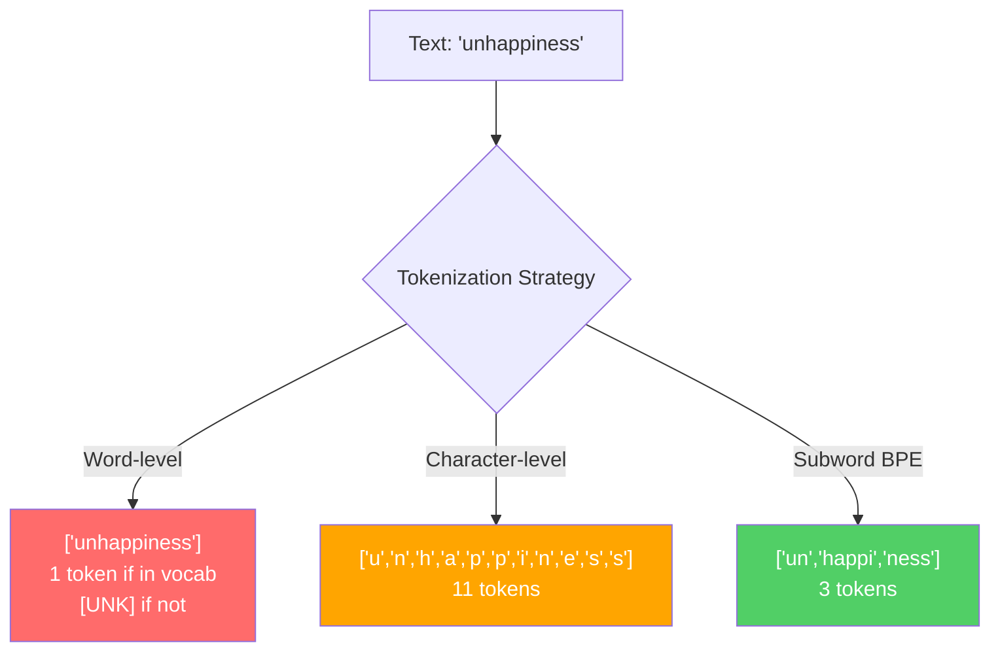
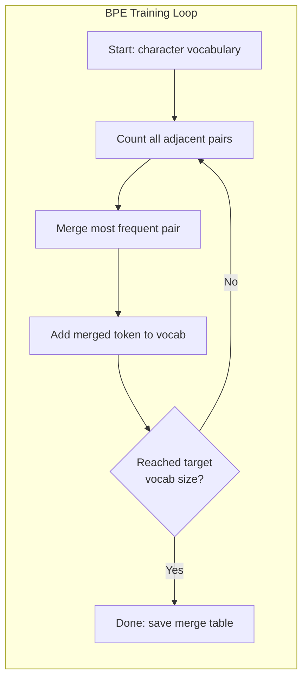
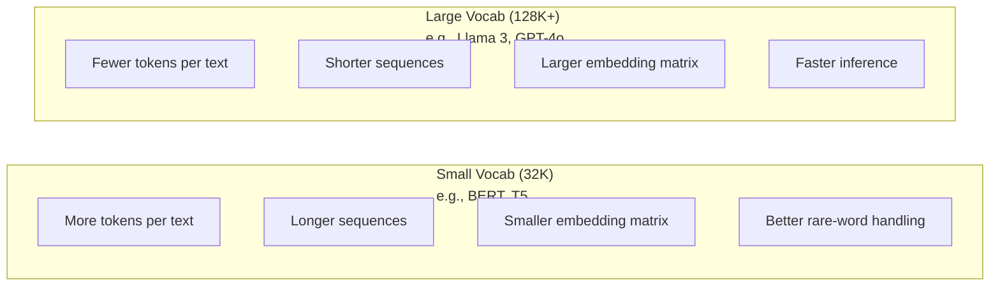

# トークナイザー：BPE、WordPiece、SentencePiece

> LLMは英語を読まない。整数を読む。トークナイザーはその整数が意味を運ぶか、それを無駄にするかを決める。

**タイプ:** Build
**言語:** Python
**前提条件:** Phase 05 (NLP Foundations)
**所要時間:** ~90分

## 学習目標

- スクラッチから BPE、WordPiece、Unigramトークン化アルゴリズムを実装してマージ戦略を比較
- 語彙サイズが モデル効率にどう影響するか説明：小さすぎるは長いシーケンスを作成、大きすぎるは埋め込みパラメータを無駄
- トークン化アーティファクトを言語とコード全体で分析、特定トークナイザーが破壊する場所を特定
- tiktoken と sentencepiece ライブラリを使ってテキストをトークン化し、結果トークンIDを検査

## 問題

LLM は英語を読まない。言語を読まない。数字を読む。

「Hello, world!」と [15496, 11, 995, 0] 間のギャップはトークナイザー。あらゆる単語、あらゆるスペース、あらゆる句読点は、モデルが処理する前に整数に変換されなければならない。この変換は中立ではない。モデルに後で元に戻せない仮定を焼き込む。

これを間違って獲得し、モデルは一般的単語を複数トークンでエンコード容量浪費。「unfortunately」は1つではなく4トークンになる。128Kコンテキストウィンドウはマルチシラバス単語で重いテキストで75%収縮。正しくそして同じコンテキストウィンドウが意味の倍を保つ。「このモデルはコードハンドル良」と「このモデルはPythonで窒息」間の差はしばしばトークナイザーがどう訓練されたから来。

API呼び出しをGPT-4またはClaudeに毎回トークンで料金。生成するトークンは計算コスト。出力を表現するのに必要なトークンが少ないほど、終了エンドツーエンド推論が速い。トークン化は前処理ではない。それはアーキテクチャ。

## コンセプト

### 失敗した3つアプローチ（そして勝った1つ）

テキストを数字に変換する3つの明らかな方法。スケールで2つは機能しない。

**単語レベルトークン化** はスペースと句読点で分割。「The cat sat」は [「The」、「cat」、「sat」] になる。シンプル。しかし「tokenization」？「GPT-4o」？ドイツ複合単語「Geschwindigkeitsbegrenzung」？ 単語レベルはすべての言語のすべての単語をカバーするのに巨大語彙が必要。単語をミスして、あなたは恐ろしい `[UNK]` トークン得る — モデルが「これが何か全く分かる」いう方法。英語のみ百万単語形式以上。コード、URL、科学記法、100他の言語追加、あなたは無限語彙が必要。

**文字レベルトークン化** は他の方向。「hello」は [「h」、「e」、「l」、「l」、「o」] になる。語彙は小さい（数百文字）。不明トークンなし。しかしシーケンスは極度に長くなる。10単語レベルトークンになる文は50文字レベルトークンになる。モデルは「t」、「h」、「e」が一緒に「the」を意味することを学ぶ必要 — 注意容量を燃やす何かの人間は3才で学ぶ。

**サブワードトークン化** は甘い点見つけ。一般的単語は全体に留まる：「the」は1トークン。稀な単語は意味ピースに分解：「unhappiness」は [「un」、「happi」、「ness」] になる。語彙は管理可能（30Kから128Kトークン）。シーケンスは短く留まる。不明トークンは本質的に消える。なぜならあらゆる単語はサブワードピースから構築されるから。

すべての最新LLMはサブワードトークン化を使う。GPT-2、GPT-4、BERT、Llama 3、Claude — すべて。問題はどのアルゴリズム。



### BPE：バイトペア符号化

BPE はトークン化のために用途を変えた圧縮アルゴリズム。考え方は索引カード上適合に十分簡潔。

個々文字から開始。訓練コーパスでアジャセント毎ペアをカウント。最も頻繁なペアを新トークンにマージ。ターゲット語彙サイズに達するまで反復。

これは「lower」、「lowest」、「newest」の単語を持つ小コーパス上実行BPE：

```
Corpus (with word frequencies):
  "lower"  x5
  "lowest" x2
  "newest" x6

Step 0 -- Start with characters:
  l o w e r       (x5)
  l o w e s t     (x2)
  n e w e s t     (x6)

Step 1 -- Count adjacent pairs:
  (e,s): 8    (s,t): 8    (l,o): 7    (o,w): 7
  (w,e): 13   (e,r): 5    (n,e): 6    ...

Step 2 -- Merge most frequent pair (w,e) -> "we":
  l o we r        (x5)
  l o we s t      (x2)
  n e we s t      (x6)

Step 3 -- Recount and merge (e,s) -> "es":
  l o we r        (x5)
  l o we s t      (x2)    <- 'es' only forms from 'e'+'s', not 'we'+'s'
  n e we s t      (x6)    <- wait, the 'e' before 'we' and 's' after 'we'

Actually tracking this precisely:
  After "we" merge, remaining pairs:
  (l,o): 7   (o,we): 7   (we,r): 5   (we,s): 8
  (s,t): 8   (n,e): 6    (e,we): 6

Step 3 -- Merge (we,s) -> "wes" or (s,t) -> "st" (tied at 8, pick first):
  Merge (we,s) -> "wes":
  l o we r        (x5)
  l o wes t       (x2)
  n e wes t       (x6)

Step 4 -- Merge (wes,t) -> "west":
  l o we r        (x5)
  l o west        (x2)
  n e west        (x6)

...continue until target vocab size reached.
```

マージテーブルはトークナイザー。新テキストをエンコードするのに、学習順序でマージを適用。訓練コーパスはどのマージ存在決定、その選択はモデルが見るもの永久に形成。



### バイトレベルBPE (GPT-2、GPT-3、GPT-4)

標準BPE はUnicode文字上で作動。バイトレベルBPE はraw バイト上で作動 (0-255)。これはあなたに正確に256の基礎語彙を与え、あらゆる言語またはエンコーディングを処理、不明トークン生産しない。

GPT-2はこのアプローチを導入。基礎語彙はあらゆる可能バイトをカバー。BPE はその上でマージを構築。OpenAI の tiktoken ライブラリはこれら語彙サイズを持つバイトレベルBPEを実装：

- GPT-2：50,257トークン
- GPT-3.5/GPT-4：~100,256トークン (cl100k_baseエンコーディング)
- GPT-4o：200,019トークン (o200k_baseエンコーディング)

### WordPiece (BERT)

WordPiece は BPE に似えが異なったマージを選ぶ。生周波数の代わりに、訓練データの尤度を最大化：

```
BPE merge criterion:      count(A, B)
WordPiece merge criterion: count(AB) / (count(A) * count(B))
```

BPE は「ペアがもっとも頻繁に表示される？」を言う。WordPiece は「ペアは機会より一緒に表示される？」を言う。このデリケート差異は異なった語彙を生じる。WordPiece は単に頻繁だけではなく、共出現が驚きなマージを優遇。

WordPiece もクリーンアップ詞の「##」プレフィックスを使う：

```
"unhappiness" -> ["un", "##happi", "##ness"]
"embedding"   -> ["em", "##bed", "##ding"]
```

「##」プレフィックスはこのピースが前のトークンを続けると伝える。BERTはWordPiece を30,522トークンの語彙で使う。すべてのBERT変種 -- DistilBERT、RoBERTaのトークナイザーは実は BPE だが、BERT 自体はWordPiece。

### SentencePiece (Llama、T5)

SentencePiece はスペースを含むUnicode文字列のraw ストリームとして入力を扱う。事前トークン化ステップなし。単語境界についての言語固有ルールなし。これは本当に言語不可知にする — スペースが単語を分離しない中国語、日本語、タイ語、他の言語で機能。

SentencePiece は2つのアルゴリズムサポート：
- **BPEモード**：raw 文字シーケンスに適用される標準BPE と同じマージロジック
- **Unigram モード**：大きい語彙から開始し、全体的尤度にもっとも影響する影響が少ないトークムを反復削除。BPE の逆 — マージの代わりに剪定。

Llama 2 は32,000トークン語彙を持つSentencePiece BPE を使う。T5 は32,000トークンを持つSentencePiece Unigram を使う。注：Llama 3 は 128,256トークンを持つtiktoken ベースバイトレベルBPEトークナイザーに切り替え。

### 語彙サイズ トレードオフ

これは測定可能な結果を持つ本物エンジニアリング決定。



具体的数。128K 語彙を持つ4,096次元埋め込みの場合、埋め込みマトリックスのみは128,000 x 4,096 = 524百万パラメータ。32K 語彙について、131百万パラメータ。これは トークナイザー選択のみから400M パラメータ差。

しかし大きい語彙はテキストをより積極的に圧縮。同じ英語段落は32K語彙を持つ100トークンかかる可能性あり、128K語彙を持つ70トークを取る可能性。つまり生成中30% より少ないフォワードパス。100万リクエストを奉仕するモデル、それは計算コストの直接削減。

傾向は明確：語彙サイズは成長。GPT-2 は50,257使用。GPT-4 は~100K。Llama 3 は128K。GPT-4o は200K。

| モデル | 語彙サイズ | トークナイザー タイプ | 英語単語あたり平均トークン |
|-------|-----------|----------------|---------------------------|
| BERT | 30,522 | WordPiece | ~1.4 |
| GPT-2 | 50,257 | バイトレベルBPE | ~1.3 |
| Llama 2 | 32,000 | SentencePiece BPE | ~1.4 |
| GPT-4 | ~100,256 | バイトレベルBPE | ~1.2 |
| Llama 3 | 128,256 | バイトレベルBPE (tiktoken) | ~1.1 |
| GPT-4o | 200,019 | バイトレベルBPE | ~1.0 |

### マルチリンガル税

主にenglish で訓練されたトークナイザーは他の言語に厳しい。GPT-2 のトークナイザーの朝鮮語テキスト単語あたり平均 2-3 トークン。中国語はより悪くなり得。これは朝鮮ユーザーはeffectively 英語ユーザーの倍小さいコンテキストウィンドウを持つことを意味 — 同じ価格を支払い、より少ない情報密度。

これは Llama 3 が 32K から 128K へ4倍に語彙をQuadrupled な理由。非英語スクリプトに献身更多トークンは言語を超えた公正圧縮。

## 構築する

### ステップ1：文字レベルトークナイザー

基礎で開始。文字レベルトークナイザーはそれぞれ文字をそのUnicodeコードポイントにマップ。訓練不要。不明トークンなし。直接マッピング。

```python
class CharTokenizer:
    def encode(self, text):
        return [ord(c) for c in text]

    def decode(self, tokens):
        return "".join(chr(t) for t in tokens)
```

「hello」は [104, 101, 108, 108, 111] になる。あらゆる文字は独自トークン。これはベースライン私たちが改善。

### ステップ2：スクラッチからのBPEトークナイザー

本物実装。raw バイトで訓練、ペアをカウント、もっと頻繁なマージ、順序でマージを記録。マージテーブルがトークナイザー。

```python
from collections import Counter

class BPETokenizer:
    def __init__(self):
        self.merges = {}
        self.vocab = {}

    def _get_pairs(self, tokens):
        pairs = Counter()
        for i in range(len(tokens) - 1):
            pairs[(tokens[i], tokens[i + 1])] += 1
        return pairs

    def _merge_pair(self, tokens, pair, new_token):
        merged = []
        i = 0
        while i < len(tokens):
            if i < len(tokens) - 1 and tokens[i] == pair[0] and tokens[i + 1] == pair[1]:
                merged.append(new_token)
                i += 2
            else:
                merged.append(tokens[i])
                i += 1
        return merged

    def train(self, text, num_merges):
        tokens = list(text.encode("utf-8"))
        self.vocab = {i: bytes([i]) for i in range(256)}

        for i in range(num_merges):
            pairs = self._get_pairs(tokens)
            if not pairs:
                break
            best_pair = max(pairs, key=pairs.get)
            new_token = 256 + i
            tokens = self._merge_pair(tokens, best_pair, new_token)
            self.merges[best_pair] = new_token
            self.vocab[new_token] = self.vocab[best_pair[0]] + self.vocab[best_pair[1]]

        return self

    def encode(self, text):
        tokens = list(text.encode("utf-8"))
        for pair, new_token in self.merges.items():
            tokens = self._merge_pair(tokens, pair, new_token)
        return tokens

    def decode(self, tokens):
        byte_sequence = b"".join(self.vocab[t] for t in tokens)
        return byte_sequence.decode("utf-8", errors="replace")
```

訓練ループはBPEの中心：ペアをカウント、勝者をマージ、反復。各マージはトークン総数を削減。`num_merges` ラウンド後、語彙256から256 + num_mergesまで成長。

エンコーディングは学習順序で正確にマージを適用。これは重要。マージ1が「th」を作成し、マージ5が「the」を作成した場合、エンコーディング 5 で「the」形成できるように最初マージ 1 を適用する必要。

デコーディングは逆：語彙の各トークンID を見上げ、バイトを連結、UTF-8 にデコード。

### ステップ3：エンコード＆デコード ラウンドトリップ

```python
corpus = (
    "The cat sat on the mat. The cat ate the rat. "
    "The dog sat on the log. The dog ate the frog. "
    "Natural language processing is the study of how computers "
    "understand and generate human language. "
    "Tokenization is the first step in any NLP pipeline."
)

tokenizer = BPETokenizer()
tokenizer.train(corpus, num_merges=40)

test_sentences = [
    "The cat sat on the mat.",
    "Natural language processing",
    "tokenization pipeline",
    "unhappiness",
]

for sentence in test_sentences:
    encoded = tokenizer.encode(sentence)
    decoded = tokenizer.decode(encoded)
    raw_bytes = len(sentence.encode("utf-8"))
    ratio = len(encoded) / raw_bytes
    print(f"'{sentence}'")
    print(f"  Tokens: {len(encoded)} (from {raw_bytes} bytes) -- ratio: {ratio:.2f}")
    print(f"  Roundtrip: {'PASS' if decoded == sentence else 'FAIL'}")
```

圧縮比はトークナイザーがいかに効果的であるか伝える。0.50 の比率はトークナイザーはraw バイトと同じように半分多く token にテキストを圧縮したことを意味。低い方が良い。訓練コーパスで、比率は良い。「unhappiness」のような配布外テキストで（コーパスに現れない），比率は悪化 — トークナイザーはセン見ないパターンのためキャラクターレベルエンコーディングに戻る。

### ステップ4：tiktokenと比較

```python
import tiktoken

enc = tiktoken.get_encoding("cl100k_base")

texts = [
    "The cat sat on the mat.",
    "unhappiness",
    "Hello, world!",
    "def fibonacci(n): return n if n < 2 else fibonacci(n-1) + fibonacci(n-2)",
    "Geschwindigkeitsbegrenzung",
]

for text in texts:
    our_tokens = tokenizer.encode(text)
    tiktoken_tokens = enc.encode(text)
    tiktoken_pieces = [enc.decode([t]) for t in tiktoken_tokens]
    print(f"'{text}'")
    print(f"  Our BPE:   {len(our_tokens)} tokens")
    print(f"  tiktoken:  {len(tiktoken_tokens)} tokens -> {tiktoken_pieces}")
```

tiktoken はまったく同じアルゴリズムを使いますが、100,000マージを持つ100GB のテキストで訓練。アルゴリズムは同じ。差異は訓練データと マージ数。段落で40マージで訓練のあなたのトークナイザーはこのタスクをそのタスクで100K マージを持つtiktokenと競うことはできない。しかし仕組みは同じ。

### ステップ5：語彙分析

```python
def analyze_vocabulary(tokenizer, test_texts):
    total_tokens = 0
    total_chars = 0
    token_usage = Counter()

    for text in test_texts:
        encoded = tokenizer.encode(text)
        total_tokens += len(encoded)
        total_chars += len(text)
        for t in encoded:
            token_usage[t] += 1

    print(f"Vocabulary size: {len(tokenizer.vocab)}")
    print(f"Total tokens across all texts: {total_tokens}")
    print(f"Total characters: {total_chars}")
    print(f"Avg tokens per character: {total_tokens / total_chars:.2f}")

    print(f"\nMost used tokens:")
    for token_id, count in token_usage.most_common(10):
        token_bytes = tokenizer.vocab[token_id]
        display = token_bytes.decode("utf-8", errors="replace")
        print(f"  Token {token_id:4d}: '{display}' (used {count} times)")

    unused = [t for t in tokenizer.vocab if t not in token_usage]
    print(f"\nUnused tokens: {len(unused)} out of {len(tokenizer.vocab)}")
```

これはあなたの語彙のZipf配布を明かす。いくつかトークンが支配（スペース、「the」、「e」）。ほとんどトークンはまれに使われる。本番トークナイザーはこの配布最適化 — 一般パターンは短いトークンIDを得、稀なパターンはより長い表現。

## 使う

あなたのスクラッチBPE は機能。いまや本番ツールがどう見えるか参照。

### tiktoken (OpenAI)

```python
import tiktoken

enc = tiktoken.get_encoding("cl100k_base")

text = "Tokenizers convert text to integers"
tokens = enc.encode(text)
print(f"Tokens: {tokens}")
print(f"Pieces: {[enc.decode([t]) for t in tokens]}")
print(f"Roundtrip: {enc.decode(tokens)}")
```

tiktoken はRust で書かれていますPython バインディング。毎秒百万トークンをエンコード。同じBPEアルゴリズム、本番グレード実装。

### Hugging Face トークナイザー

```python
from tokenizers import Tokenizer
from tokenizers.models import BPE
from tokenizers.trainers import BpeTrainer
from tokenizers.pre_tokenizers import ByteLevel

tokenizer = Tokenizer(BPE())
tokenizer.pre_tokenizer = ByteLevel()

trainer = BpeTrainer(vocab_size=1000, special_tokens=["<pad>", "<eos>", "<unk>"])
tokenizer.train(["corpus.txt"], trainer)

output = tokenizer.encode("The cat sat on the mat.")
print(f"Tokens: {output.tokens}")
print(f"IDs: {output.ids}")
```

Hugging Face トークナイザーライブラリはRust の下で。ギガバイトスケールコーパス上で秒でBPEを訓練。これはあなたが自身のモデルを訓練するときに使う。

### Llama のトークナイザーロード

```python
from transformers import AutoTokenizer

tokenizer = AutoTokenizer.from_pretrained("meta-llama/Llama-3.1-8B")

text = "Tokenizers are the unsung heroes of LLMs"
tokens = tokenizer.encode(text)
print(f"Token IDs: {tokens}")
print(f"Tokens: {tokenizer.convert_ids_to_tokens(tokens)}")
print(f"Vocab size: {tokenizer.vocab_size}")

multilingual = ["Hello world", "Hola mundo", "Bonjour le monde"]
for text in multilingual:
    ids = tokenizer.encode(text)
    print(f"'{text}' -> {len(ids)} tokens")
```

Llama 3 の 128K 語彙はGPT-2 の50K 語彙よりもずっと非英語テキストを圧縮。あなた自身検証できる — あなたのトークナイザーで複数言語で同じ文をエンコード、トークン数。

## 納入する

このレッスンはテキストとモデル組み合わせのトークン化効率を分析可能な再利用可能なプロンプトを生成。テキストサンプルを与えてください、モデルのトークナイザーがそれをもっとも良く処理を伝える。

## 演習

1. 各マージステップで語彙を印字するようBPEトークナイザーを変更。「t」+ 「h」がどう「th」になり、その後 「th」+ 「e」が「the」になるか watch。一般的英語単語がピースごむピース集めされる。

2. 特別なトークン（`<pad>`、`<eos>`、`<unk>`）をBPEトークナイザーに追加。それらをID 0、1、2割り当てて他のトークン移動。それはBPEを実行する前にスペース分割する事前トークン化ステップを実装。

3. WordPieceマージ基準を実装（周波数の代わりの尤度比）。同じコーパスで同じマージ数を持つBPEとWordPieceの両方を訓練。結果語彙比較 — どちらが言語的に意味深いサブワードを生産？

4. マルチリンガルトークナイザー効率ベンチマーク構築。英語、スペイン語、中国語、朝鮮語、アラビア語で10文を取る。各々をtiktoken (cl100k_base) でトークン化して、平均トークン/文字を測定。言語各々のために「マルチリンガル税」を定量化。

5. より大きいコーパス上でBPEトークナイザーを訓練（ダウンロードWikipediaアーティクル）。マージ数をチューン、tiktoken をそのテキストで10%の圧縮比内に達成。これはコーパスサイズ、マージ数、圧縮品質間の関係を理解するを強制。

## 重要用語

| 用語 | 人が言うこと | 実際の意味 |
|------|----------------|----------------------|
| トークン | 「単語」 | モデルの語彙のユニット — 文字、サブワード、単語、またはマルチワードチャンクかもしれない |
| BPE | 「いくつかの圧縮事」 | バイトペア符号化 — ターゲット語彙サイズに達するまで、もっとも頻繁なアジャセント ペアを反復的マージ |
| WordPiece | 「BERTのトークナイザー」 | BPE のような、しかし周波数の代わりの尤度比 count(AB)/(count(A)*count(B)) を最大化するマージ |
| SentencePiece | 「トークナイザーライブラリ」 | 事前トークン化なしraw Unicodeで作動する言語不可知トークナイザー、BPEと Unigram アルゴリズムをサポート |
| 語彙サイズ | 「それが知る単語がいくつ」 | ユニークトークン総数：GPT-2 は50,257、BERTは 30,522、Llama 3 は128,256を持つ |
| フェルティリティ | 「トークナイザー用語ではない」 | トークン/単語を平均 — 言語を超えたトークナイザー効率を測定 (1.0は完璧、3.0はモデルはおよそ3倍難しい) |
| バイトレベルBPE | 「GPTのトークナイザー」 | Unicode文字の代わりraw バイト (0-255) で作動するBPE、あらゆる入力で不明トークンなし保証 |
| マージテーブル | 「トークナイザーファイル」 | 訓練中に学習されたペアマージの順序付きリスト — これ*は*トークナイザー、順序が重要。 |
| 事前トークン化 | 「スペース分割」 | サブワードトークン化前に適用されるルール：スペース分割、数字分離、句読点処理 |
| 圧縮比 | 「トークナイザーがいかに効率的」 | トークン出力 / 入力バイト — 低い方がいい圧縮と推論速度。 |

## 参考文献

- [Sennrich et al.、2016 -- 「ニューラル機械翻訳稀単語を持つサブワードユニット」](https://arxiv.org/abs/1508.07909) — BPEをNLPに導入したペーパー、1994圧縮アルゴリズムを最新トークン化の基礎に変え
- [Kudo & Richardson、2018 -- 「SentencePiece：簡潔で言語独立なサブワードトークナイザー」](https://arxiv.org/abs/1808.06226) — マルチリンガルモデルを実用的にした言語不可知トークン化
- [OpenAI tiktoken レポジトリ](https://github.com/openai/tiktoken) — Rustでの本番BPE実装。Python バインディング、GPT-3.5/4/4oで使用
- [Hugging Face Tokenizers ドキュメンテーション](https://huggingface.co/docs/tokenizers) — Rust パフォーマンス付きの本番グレードトークナイザー訓練
- [Llama 3 論文 (Meta、2024)](https://arxiv.org/abs/2407.21783) — 128K語彙とトークナイザー訓練詳細
- [SentencePiece (Kudo & Richardson、2018)](https://arxiv.org/abs/1808.06226) — 言語不可知トークン化
- [GPT-2 トークナイザー ソース](https://github.com/openai/gpt-2/blob/master/src/encoder.py) — オリジナル バイト-to-Unicode マッピング
