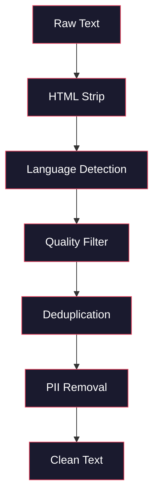
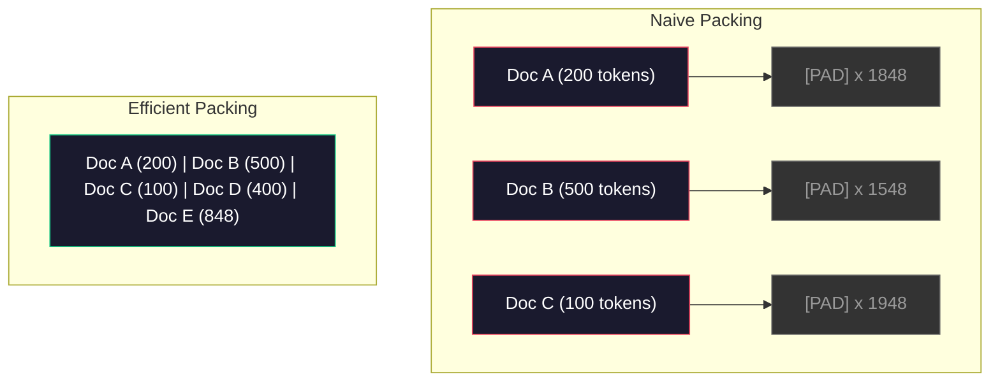

# 事前学習用データパイプライン

> モデルは鏡です。供給されたデータを反射します。ガベージを供給すると、完璧な流暢性でガベージを反射します。

**タイプ:** Build
**言語:** Python
**前提条件:** Phase 10、レッスン 01-02 (トークナイザー、トークナイザーの構築)
**所要時間:** ~90分

## 学習目標

- テラバイトのテキストをメモリに読み込まずにトークン化、チャンク化、シャッフル、バッチ化するストリーミング データ パイプラインを構築する
- 実トレーニング パイプラインで使用される データ品質フィルター (重複排除、言語検出、コンテンツ フィルタリング) を実装する
- 適切なアテンション マスクとドキュメント境界処理を使用して、固定長のトレーニング シーケンスを作成する
- パイプライン スループットをプロフィールして、データローダーが GPU トレーニング速度に追いつくようにする

## 問題

トークナイザーがあります。今、データが必要です。

データセットではありません。CSV ファイルではありません。テラバイトのテキスト — クリーニングされ、重複排除され、品質フィルタリングされ、固定長シーケンスにトークン化され、8-GPU クラスターが次のバッチを待つことはない高速化済みランダムバッチで提供。

ほとんどの人々は LLM をトレーニングすることはモデル アーキテクチャについてだと思う。そうではない。Llama 3 は 15.6 兆トークンを使用。GPT-3 は 3,000 億。DeepSeek-V2 は 8.1 兆。3 つすべてのアーキテクチャはほぼ同じです: 注意とフィードフォワード レイヤーでスタックされたトランスフォーマー ブロック。出力品質の違いは圧倒的にデータから来ます。

DeepMind の Chinchilla 論文はこれを正確にしました。給定されたコンピューティング予算に対して、モデル パラメータとトレーニング トークンの最適比率がある。Chinchilla は 2022 年の大半のモデルが劇的に under-trained を示しました — それらはデータの量にはあまりにも多くのパラメータを持っていました。1.4 兆トークン (Chinchilla 最適) でトレーニングされた 70B パラメータ モデルは、3,000 億トークン (Gopher) でトレーニングされた 280B モデルをアウトパフォーム。

データ パイプラインは、モデルが言語を学習するか、ノイズを学習するかを決定します。

## コンセプト

### データはどこから来るのか

あらゆる大規模言語モデルは、ソースの混合でトレーニングされます。正確な構成は、ほとんどのラボで厳密に守られた秘密ですが、カテゴリーを理解するのに十分です。

| ソース | サイズ | 品質 | 使用済み |
|--------|------|---------|---------|
| Common Crawl | ~250 TB 生 | 低い (ヘビーフィルタリングが必要) | GPT-3、Llama、ほとんどのオープン モデル |
| Wikipedia | ~20 GB | 高い | あらゆる主要 LLM |
| GitHub コード | ~1 TB+ | 中程度 (多くの重複、デッドコード) | StarCoder、CodeLlama、DeepSeek-Coder |
| 書籍 (BookCorpus、Pile) | ~100 GB | 高い | GPT-2、GPT-3、早期モデル |
| アカデミック論文 (arXiv、S2ORC) | ~100 GB | STEM 用に高い | Llama、Galactica |
| StackOverflow、Reddit | ~100 GB | 中程度 | Llama、Falcon |
| キュレーション済みウェブ (C4、RefinedWeb) | ~5 TB | 中程度高い (事前フィルタリング) | T5、Falcon |

Llama 3 はデータミックスを開示: 大体 50% ウェブデータ、25% コード、13% 本とアカデミック論文、8% 数学データ、4% 多言語ウェブデータ。合計は 5 TB を超える生のテキストから 15.6 兆トークンでした。

比率は合計サイズと同じくらい重要です。ウェブデータが多すぎるとモデルは Reddit オウムになります。コードが少なすぎるとプログラムできません。数学が少なすぎると推論に失敗します。このミックスを正しく取得することは LLM をトレーニングするの最も難しい部分の 1 つであり、公式がありません — それは実験と評価が必要です。

### データのクリーニング

生のウェブ データは汚いです。典型的な Common Crawl ダンプが含む:

- HTML タグと JavaScript
- ボイラープレート ヘッダー、フッター、ナビゲーション メニュー
- 重複ページ (正確およびニア重複)
- マシン生成スパム
- 個人識別情報 (PII)
- 低品質テキスト (キーワード リスト、SEO スパム)
- テキストとしてエンコードされた非テキスト コンテンツ

クリーニングはオプションではありません。モデルが、HTML タグを商品リストと混在して出力するコヒーレント段落を生成するのと、出力するの違いです。



各ステップはノイズのカテゴリを排除:

**HTML ストリップ:** すべてのマークアップを削除。可視テキスト コンテンツのみを保持。`trafilatura` または `readability` のようなライブラリは、ナビゲーション、広告、ボイラープレートを捨てながら記事コンテンツを抽出。

**言語検出:** fastText の言語識別モデル (lid.176.bin) を使用して各ドキュメントを分類。ターゲット言語にフィルタリング。0.8 未満の信頼でクリーン英語と分類されたドキュメントはおそらくそうではありません。

**品質フィルタリング:** ここで興味深いものが成る。RefinedWeb (Falcon の背後にあるデータセット) は複雑性ベースのフィルタリングを使用: Wikipedia でトレーニングされた小さな言語モデルを実行してから、各ドキュメントをスコア。高い複雑性は、ドキュメントが Wikipedia と異なることを意味します — スパム、キーワード リスト、またはマシン生成コンテンツの可能性が高い。複雑性が閾値を超えるドキュメントは削除。

**重複排除:** 単一で最も影響的なクリーニング ステップ。Common Crawl は重複ページの膨大な数を含む — 法的免責事項、クッキー通知、利用規約。重複でのトレーニングはコンピューティングを浪費し、モデルが特定の段落を逐語的に暗記と吐き出すことができます。

**PII 削除:** 名前、メール アドレス、電話番号、社会保障番号。構造化 PII の regex ベース検出、コンテキスト内の名前の NER モデル。

### MinHash による重複排除

正確な重複排除は簡単: 各ドキュメントをハッシュし、重複を削除。しかし、ニア重複は本当の問題。同じニュース記事の 2 つのコピーで、それはわずかに異なる広告の周りは ニア重複。コンテンツは 95% 同一ですが、バイト対バイトで異なります。

MinHash + Locality-Sensitive Hashing (LSH) はこれを効率的に解決。


考え:

1. **Shingling:** 各ドキュメントを n-gram (例えば、5-gram の単語または文字) のセットに変換。"the quick brown fox" で 3-word shingles は {"the quick brown", "quick brown fox"} になります。

2. **MinHash:** 各ドキュメントの shingle セットで、k ハッシュ値を計算。各ハッシュ値は、異なるハッシュ関数の下での全 shingle 全体の最小ハッシュ。これは固定サイズの "署名" を作成し、任意の 2 つのドキュメント間の Jaccard 類似性を近似。

3. **LSH:** MinHash 署名のバンドに基づいてドキュメントをバケットにグループ化。同じバケット内のドキュメントはニア重複の候補。すべてのペアを比較することを避ける — 候補を比較するだけ。

4. **検証:** 各候補ペアの場合、正確な Jaccard 類似性を計算。類似性が閾値を超える場合 (通常 0.8) 1 つのコピーを削除。

Llama チームは彼らのウェブ データの約 38% を重複排除を通して削除しました。それは小さい数ではありません。Common Crawl の 3 分の 1 以上は重複またはニア重複コンテンツです。

### シーケンス パッキング

モデルは固定長入力シーケンスを期待。ドキュメントは可変長。いくつかは 50 トークン。いくつかは 50,000 トークン。

素朴なアプローチ: あらゆるドキュメントを最大シーケンス長にパディング。これは学習に寄与しないパディング トークンでコンピューティングを浪費。

より良いアプローチ: 複数のドキュメントを 1 つのシーケンスにパック、それらの間で end-of-sequence トークン分離。2048 トークン シーケンスは、[EOS] トークンで連結された 3 つの短いドキュメント含むかもしれません。



アテンション マスクは正しく設定する必要があります。ドキュメント A のトークンは、同じ パック シーケンス内のドキュメント B のトークンに参加してはいけません。これはブロック対角線の アテンション マスクが必要です。

長いドキュメントはシーケンス境界で切り詰めまたは分割されます。分割ポイントは重要です: 文の中ほどで分割は不完全な思考を見るのでモデルを強制します。いくつかのパイプラインは、可能な場合、段落または文の境界に分割を調整します。

### Chinchilla スケーリング則

固定コンピューティング予算 C (FLOP で測定) のため、最適なモデル サイズ N とデータセット サイズ D は以下を従う:

```
N_opt ~ C^0.5
D_opt ~ C^0.5
```

実際には、これは、モデル サイズとデータセット サイズをほぼ同じようにスケーリングすべきことを意味。10 倍のパラメータを持つモデルは、同じ損失に達するために大体 10 倍のトレーニング トークンが必要です。

| モデル | パラメータ | トレーニング トークン | Chinchilla 最適? |
|-------|-----------|----------------|-------------------|
| GPT-3 | 175B | 300B | いいえ (3-4x under-trained) |
| Chinchilla | 70B | 1.4T | はい (設計による) |
| Llama 2 | 70B | 2T | Over-trained (意図的に) |
| Llama 3 | 70B | 15T | 大幅に over-trained |

Llama 3 は Chinchilla 則を意図的に違反。Meta は、compute 最適化比率をはるかに超えたより多くのデータを超訓練すると、推論用の優れたモデルを生成することを見つけました。余分なトレーニング コストは 1 回支払いますが、より小さなモデルは永遠にサーブするのが安い。これは "推論最適化" スケーリング アプローチと呼ばれることもあり、2024 年以降、業界標準になっています。

## 構築

### ステップ 1: テキスト クリーニング

HTML を削除、ホワイトスペースを正規化、非テキスト コンテンツを削除。小さなコーパスとしてパブリック ドメイン テキスト (Project Gutenberg) を使用。

```python
import re

def clean_text(text):
    text = re.sub(r"<[^>]+>", "", text)
    text = re.sub(r"http\S+", "", text)
    text = re.sub(r"[^\x20-\x7E\n]", "", text)
    text = re.sub(r"\n{3,}", "\n\n", text)
    text = re.sub(r" {2,}", " ", text)
    return text.strip()

def quality_filter(text, min_words=50, max_ratio_caps=0.3, max_ratio_special=0.1):
    words = text.split()
    if len(words) < min_words:
        return False
    caps_ratio = sum(1 for w in words if w.isupper()) / len(words)
    if caps_ratio > max_ratio_caps:
        return False
    special_chars = sum(1 for c in text if not c.isalnum() and not c.isspace())
    if special_chars / max(len(text), 1) > max_ratio_special:
        return False
    return True
```

品質フィルタは SEO スパム (ALL CAPS)、マシン生成ノイズ (高い特殊文字比率)、スタブページ (短すぎる) をキャッチ。これら 3 つのチェックだけで、ウェブ クロールからガベージの驚くほどの量を削除。

### ステップ 2: MinHash 重複排除

ゼロからの MinHash 実装。外部ライブラリは不要 — ただ `hashlib`。

```python
import hashlib
from collections import defaultdict

def get_shingles(text, k=5):
    words = text.lower().split()
    if len(words) < k:
        return set()
    return {" ".join(words[i:i+k]) for i in range(len(words) - k + 1)}

def minhash_signature(shingles, num_hashes=128):
    signature = []
    for i in range(num_hashes):
        min_hash = float("inf")
        for shingle in shingles:
            h = int(hashlib.sha256(f"{i}:{shingle}".encode()).hexdigest(), 16)
            min_hash = min(min_hash, h)
        signature.append(min_hash)
    return signature

def lsh_buckets(signature, bands=16):
    rows_per_band = len(signature) // bands
    buckets = []
    for b in range(bands):
        start = b * rows_per_band
        band_data = tuple(signature[start:start + rows_per_band])
        bucket_hash = hashlib.md5(str(band_data).encode()).hexdigest()
        buckets.append((b, bucket_hash))
    return buckets

def deduplicate(documents, threshold=0.8, num_hashes=128, bands=16):
    signatures = []
    shingle_sets = []
    for doc in documents:
        shingles = get_shingles(doc)
        shingle_sets.append(shingles)
        signatures.append(minhash_signature(shingles, num_hashes))

    bucket_map = defaultdict(list)
    for doc_idx, sig in enumerate(signatures):
        for band_id, bucket_hash in lsh_buckets(sig, bands):
            bucket_map[(band_id, bucket_hash)].append(doc_idx)

    duplicate_pairs = set()
    for bucket_docs in bucket_map.values():
        if len(bucket_docs) < 2:
            continue
        for i in range(len(bucket_docs)):
            for j in range(i + 1, len(bucket_docs)):
                duplicate_pairs.add((bucket_docs[i], bucket_docs[j]))

    removed = set()
    for i, j in duplicate_pairs:
        if i in removed or j in removed:
            continue
        s1, s2 = shingle_sets[i], shingle_sets[j]
        if not s1 or not s2:
            continue
        jaccard = len(s1 & s2) / len(s1 | s2)
        if jaccard >= threshold:
            removed.add(j)

    return [doc for idx, doc in enumerate(documents) if idx not in removed], len(removed)
```

`num_hashes=128` と `bands=16` パラメータは精度-再現率トレードオフを制御。より多くのハッシュはより正確な類似性推定を与える。より多くのバンドは再現率を増加 (より多くの重複をキャッチ) より多くの偽陽性のコスト.でこれらの値は典型的なウェブ テキストに良く機能。

### ステップ 3: シーケンスをトークン化してパック

クリーン、重複排除テキストを、トレーニング用に固定長シーケンスにトークン化してパック。

```python
def tokenize_corpus(documents, tokenizer):
    all_tokens = []
    for doc in documents:
        tokens = tokenizer.encode(doc)
        all_tokens.extend(tokens)
        all_tokens.append(tokenizer.eos_id)
    return all_tokens

def pack_sequences(token_ids, seq_length, pad_id=0):
    sequences = []
    attention_masks = []
    for i in range(0, len(token_ids), seq_length):
        seq = token_ids[i:i + seq_length]
        mask = [1] * len(seq)
        if len(seq) < seq_length:
            pad_count = seq_length - len(seq)
            seq = seq + [pad_id] * pad_count
            mask = mask + [0] * pad_count
        sequences.append(seq)
        attention_masks.append(mask)
    return sequences, attention_masks
```

### ステップ 4: トレーニング用データローダー

パック シーケンスのランダム化されたバッチを得ます。これはトレーニング ループが消費するものです。

```python
import random

class PreTrainingDataLoader:
    def __init__(self, sequences, attention_masks, batch_size, shuffle=True):
        self.sequences = sequences
        self.attention_masks = attention_masks
        self.batch_size = batch_size
        self.shuffle = shuffle

    def __len__(self):
        return (len(self.sequences) + self.batch_size - 1) // self.batch_size

    def __iter__(self):
        indices = list(range(len(self.sequences)))
        if self.shuffle:
            random.shuffle(indices)
        for start in range(0, len(indices), self.batch_size):
            batch_idx = indices[start:start + self.batch_size]
            batch_seqs = [self.sequences[i] for i in batch_idx]
            batch_masks = [self.attention_masks[i] for i in batch_idx]
            yield batch_seqs, batch_masks
```

### ステップ 5: データセット統計

問題のある数: 合計トークン、ユニークトークン、圧縮率、ドキュメント長分布。

```python
from collections import Counter

def compute_statistics(documents, token_ids, sequences, tokenizer_vocab_size):
    total_chars = sum(len(d) for d in documents)
    total_tokens = len(token_ids)
    unique_tokens = len(set(token_ids))
    compression_ratio = total_chars / total_tokens

    doc_lengths = [len(d.split()) for d in documents]
    avg_doc_length = sum(doc_lengths) / max(len(doc_lengths), 1)
    max_doc_length = max(doc_lengths) if doc_lengths else 0
    min_doc_length = min(doc_lengths) if doc_lengths else 0

    token_counts = Counter(token_ids)
    top_tokens = token_counts.most_common(10)

    non_pad_tokens = sum(sum(1 for t in seq if t != 0) for seq in sequences)
    total_positions = sum(len(seq) for seq in sequences)
    utilization = non_pad_tokens / max(total_positions, 1)

    stats = {
        "total_documents": len(documents),
        "total_characters": total_chars,
        "total_tokens": total_tokens,
        "unique_tokens": unique_tokens,
        "vocab_utilization": unique_tokens / tokenizer_vocab_size,
        "compression_ratio": compression_ratio,
        "avg_doc_length_words": avg_doc_length,
        "max_doc_length_words": max_doc_length,
        "min_doc_length_words": min_doc_length,
        "num_sequences": len(sequences),
        "sequence_utilization": utilization,
        "top_10_tokens": top_tokens,
    }
    return stats
```

圧縮率はこのコーパスにトークナイザーがどのくらい効率的であるかを示します。英語テキストは通常、トークンごと約 3-4 文字に圧縮。1.5 文字を見たら、トークナイザーは太積極的に分割。8+ を見たら、非常に領域固有のマージを学習しました。

シーケンス利用率は、パック シーケンスの多くが実データ対パディング トークンであるかを示します。90% 以下は、パッキングが非効率 — パディング トークンで計算を浪費。

## 使用

### HuggingFace Datasets と比較

同じコーパスを HuggingFace のデータセット ライブラリをとおして読んで、パイプライン速度を比較。

```python
from datasets import load_dataset
from transformers import AutoTokenizer

ds = load_dataset("wikitext", "wikitext-2-raw-v1", split="train")
tokenizer = AutoTokenizer.from_pretrained("meta-llama/Meta-Llama-3-8B")

import time

start = time.time()
tokenized = ds.map(
    lambda x: tokenizer(x["text"], truncation=True, max_length=2048),
    batched=True,
    num_proc=4,
)
hf_time = time.time() - start
total_tokens = sum(len(t) for t in tokenized["input_ids"])
print(f"HuggingFace: {total_tokens:,} tokens in {hf_time:.2f}s ({total_tokens/hf_time:,.0f} tokens/sec)")
```

HuggingFace パイプラインはフードの下で Rust トークナイザーを使用し、4 コア全体での並列処理。純粋 Python パイプラインは 10-50 倍遅くなります。そのギャップは、本番チームが Rust トークナイザーを使用する理由。アルゴリズムは同じです。実装言語は違い。

## 配信

このレッスンは LLM トレーニング パイプラインのデータ品質を検証しデバッグするためのプロンプトを生成します。`outputs/prompt-data-quality-checker.md` を参照してください。

## 演習

1. **簡単:** 簡単なヒューリスティック (文字セット分析) を使用して言語検出をクリーニング パイプラインに追加。英語ドキュメントのみにフィルタリングし、削除されるドキュメント数を測定。
2. **中程度:** SHA-256 ハッシュを使用した正確な重複排除を MinHash ニア重複排除とともに実装。web-scraped コーパスで各メソッドによってキャッチされた重複数を比較。
3. **難しい:** 複雑性ベースの品質フィルターを構築。Wikipedia テキストで小さい bigram 言語モデルをトレーニングし、複雑性でドキュメントをスコアし、下位 20% を削除。フィルタリング対フィルター前のモデル出力品質を比較してトレーニング。

## キーワード

| 用語 | 人々が言う | 実際の意味 |
|------|----------------|----------------------|
| Common Crawl | "インターネット" | 月次でウェブをクロールする非営利団体 — ~250TB 生、ほとんどの LLM トレーニング データの開始点 |
| MinHash | "いくつかのハッシング トリック" | セットの Jaccard 類似性を推定する技術、固定サイズの署名を使用 — スケールでニア重複検出を有効にします |
| LSH | "Locality-Sensitive Hashing" | 類似したアイテムを同じバケットにグループ化する方法 — O(n^2) からほぼ線形への pairwise 比較を削減 |
| シーケンス パッキング | "ドキュメントの連結" | 複数のドキュメントを適切なアテンション マスクを持つ固定長シーケンスに適合 — パディング浪費を排除 |
| Chinchilla スケーリング | "より多くのデータでトレーニング" | 固定コンピューティング予算のため、最適なパフォーマンスはモデル サイズとトレーニング トークンをほぼ同じようにスケーリングする必要 |
| 受胎能力 | "単語ごとのトークン" | 平均的なトークン数ごと単語 — GPT-4 では英語で 1.3、非ラテン文字のスクリプトの場合より高い |
| データ混合 | "トレーニング データを選択" | コード、テキスト、数学、多言語データの比率 — 公式がない、実験が必要 |
| 複雑性フィルタ | "品質スコアリング" | ドキュメントをスコアするため小さい言語モデルを使用 — 高い複雑性はテキストがクリーン参照データと異なることを意味 |
| 重複排除 | "コピーを削除" | 正確またはニア重複ドキュメントを排除 — 通常、生のウェブ データの 30-40% を削除 |
| アテンション マスク | "どのトークンを見るか" | パック シーケンス内のドキュメント境界を越えた アテンションを防ぐ二進マスク |

## 参考文献

- [Hoffmann et al., 2022 -- Training Compute-Optimal Large Language Models (Chinchilla)](https://arxiv.org/abs/2203.15556) -- データ スケールについて考える方法を変えた論文
- [Penedo et al., 2023 -- The RefinedWeb Dataset for Falcon LLM](https://arxiv.org/abs/2306.01116) -- Common Crawl を高品質にフィルタリングする方法
- [Touvron et al., 2023 -- Llama 2: Open Foundation and Fine-Tuned Chat Models](https://arxiv.org/abs/2307.09288) -- Llama 2 のデータ パイプラインの詳細
- [Lee et al., 2022 -- Deduplicating Training Data Makes Language Models Better](https://arxiv.org/abs/2107.06499) -- 重複排除がなぜ考えるより重要であるか
- [Broder, 1997 -- On the Resemblance and Containment of Documents](https://ieeexplore.ieee.org/document/666900) -- 元の MinHash 論文
- [Meta, 2024 -- Llama 3 Technical Report](https://arxiv.org/abs/2407.21783) -- 15.6T トークン、データ混合比率、フィルタリング パイプライン
