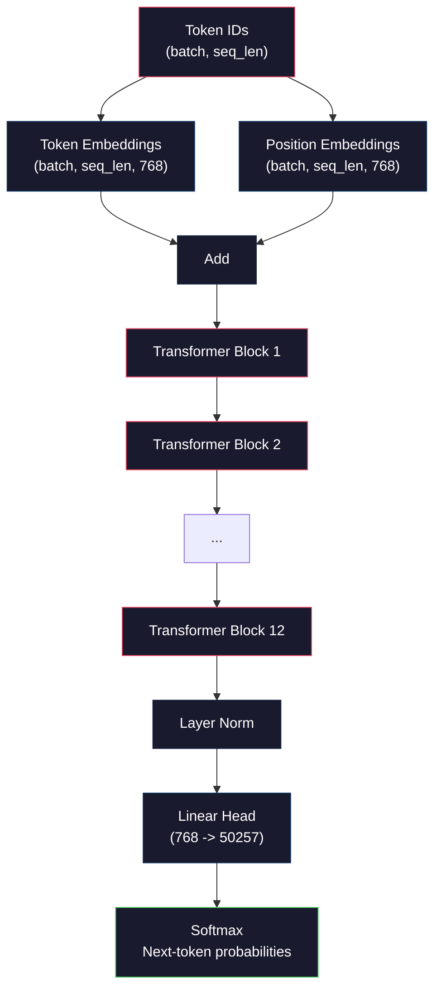
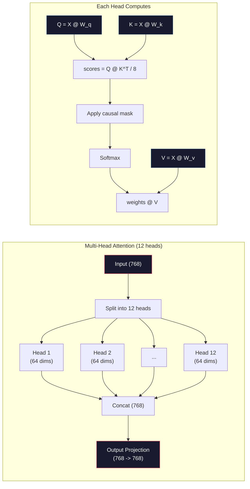
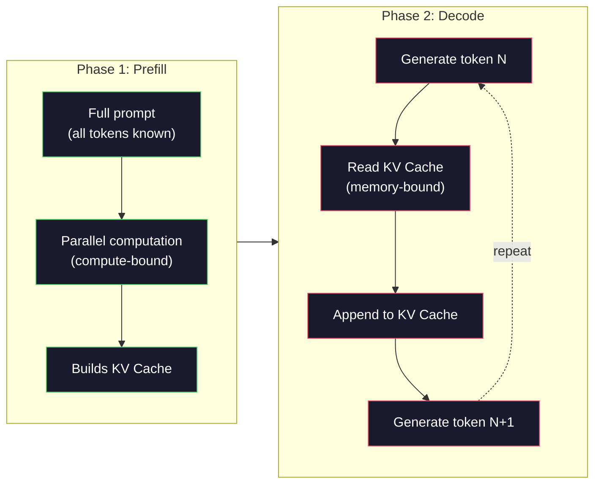

# ミニGPT事前学習(124Mパラメータ)

> GPT-2 Smallは124百万パラメータを持つ。それは12個のトランスフォーマー層、12個のアテンション・ヘッド、768次元の埋め込みだ。単一のGPUで数時間以内にゼロから学習できる。ほとんどの人はそれをやらない。事前学習されたチェックポイントを使う。だがもしあなた自身で学習しなければ、あなたが構築している製品の基盤のモデルの内部で何が起こっているのか、実際には理解していないのだ。

**タイプ:** ビルド
**言語:** Python (numpyあり)
**前提条件:** Phase 10、Lessons 01-03 (トークナイザー、トークナイザー構築、データパイプライン)
**所要時間:** 約120分

## 学習目標

- ゼロからGPT-2アーキテクチャ全体(124Mパラメータ)を実装する: トークン埋め込み、位置埋め込み、トランスフォーマー・ブロック、言語モデル・ヘッド
- クロスエントロピー損失を使用した次トークン予測によってテキストコーパスでGPTモデルを学習する
- 温度サンプリングとtop-k/top-pフィルタリングを使用してテキスト自動回帰生成を実装する
- 学習損失曲線を監視して、モデルがコヒーレントな言語パターンを学習していることを検証する

## 問題

あなたはトランスフォーマーが何であるかを知っている。図を読んだ。「Attention Is All You Need」と言えて、ホワイトボードに「Multi-Head Attention」というラベルのボックスを描くことができる。

これらのいずれもが、モデルがテキストを生成するときに何が起こるかを理解していることを意味しない。

GPT-2 Smallには124,438,272個のパラメータがある(重み結合あり)。それらすべてが学習ループを実行することによって設定された: 順伝播、損失計算、逆伝播、重みの更新。12個のトランスフォーマー・ブロック。ブロックごとに12個のアテンション・ヘッド。768次元の埋め込み空間。50,257トークンのボキャブラリー。モデルが毎回トークンを生成するときに、すべての124百万個のパラメータが単一の行列乗算チェーンに参加し、トークンIDの列を取得して次のトークンにおける確率分布を生成する。

もしあなたがこれを自分で構築したことがなければ、あなたはブラックボックスを扱っている。APIを使うことができる。ファインチューニングができる。だがもし何かが悪くなったとき -- モデルが幻覚を見るとき、自分自身を繰り返すとき、指示に従うことを拒否するとき -- あなたは*なぜ*かについての精神モデルを持たない。

このレッスンはゼロからGPT-2 Smallを構築する。PyTorchではなく。numpyで。すべての行列乗算が見える。すべての勾配があなたのコードで計算される。あなたは124百万個の数がどのように次の単語を予測するために結託しているかを正確に見るだろう。

## コンセプト

### GPTアーキテクチャ

GPTは自動回帰言語モデルだ。「自動回帰」はそれが一度に1トークンを生成し、各々が以前のすべてのトークンを条件とすることを意味する。アーキテクチャはトランスフォーマー・デコーダ・ブロックの積み重ねだ。

トークンIDから次トークン確率への完全な計算グラフを以下に示す:

1. トークンIDが入力される。形状: (batch_size, seq_len)。
2. トークン埋め込みルックアップ。各IDが768次元ベクトルにマップされる。形状: (batch_size, seq_len, 768)。
3. 位置埋め込みルックアップ。各位置(0, 1, 2, ...)が768次元ベクトルにマップされる。同じ形状。
4. トークン埋め込み + 位置埋め込みを加算。
5. 12個のトランスフォーマー・ブロックを通す。
6. 最終層正規化。
7. ボキャブラリーサイズへの線形投影。形状: (batch_size, seq_len, vocab_size)。
8. ソフトマックスで確率を取得。

これがモデル全体だ。畳み込みなし。再帰なし。埋め込み、アテンション、フィードフォワード・ネットワーク、層正規化を12回積み重ねただけだ。



### トランスフォーマー・ブロック

12個のブロックのそれぞれが同じパターンに従う。事前正規化アーキテクチャ(GPT-2は事前正規化を使用し、オリジナルのトランスフォーマーのような事後正規化ではない):

1. LayerNorm
2. マルチヘッド自己アテンション
3. 残差接続(入力を加算)
4. LayerNorm
5. フィードフォワード・ネットワーク(MLP)
6. 残差接続(入力を加算)

残差接続は重要だ。それらなしでは、勾配は逆伝播中にブロック1に到達するまでに消失する。それらを使用すると、勾配は損失から「スキップ」パスを通して任意のレイヤーに直接流れることができる。これが12個、32個、あるいは96個のブロックまで積み重ねることができる理由だ(GPT-4は120を使用すると言われている)。

### アテンション: コアメカニズム

自己アテンションは、すべてのトークンが他のすべての前のトークンを見て、各々にどのくらい注意を払うかを決定することを可能にする。ここに数学がある。

各トークン位置について、入力から3つのベクトルを計算する:
- **Query (Q)**: 「私は何を探しているか?」
- **Key (K)**: 「私は何を含んでいるか?」
- **Value (V)**: 「私はどの情報を運んでいるか?」

```
Q = input @ W_q    (768 -> 768)
K = input @ W_k    (768 -> 768)
V = input @ W_v    (768 -> 768)

attention_scores = Q @ K^T / sqrt(d_k)
attention_scores = mask(attention_scores)   # causal mask: -inf for future positions
attention_weights = softmax(attention_scores)
output = attention_weights @ V
```

因果マスクはGPTを自動回帰にするものだ。位置5は位置0-5に注意できるが、6、7、8などにはできない。これはモデルが訓練中に将来のトークンを見ることで「カンニング」することを防ぐ。

**マルチヘッド・アテンション** は768次元空間を64次元の12個のヘッドに分割する。各ヘッドは異なるアテンション・パターンを学習する。一つのヘッドは構文的関係(主語-動詞一致)を追跡するかもしれない。別のヘッドは意味的類似性(類義語)を追跡するかもしれない。また別のヘッドは位置的近接性(近い単語)を追跡するかもしれない。すべての12個のヘッドからの出力は連結され、768次元に投影し直される。



sqrt(d_k)による除算 -- sqrt(64) = 8 -- はスケーリングだ。これなしでは、高次元ベクトルのドット積が大きくなり、ソフトマックスを勾配がほぼゼロの領域に押し込む。これはオリジナルの「Attention Is All You Need」論文の重要な洞察の一つだった。

### KV キャッシュ: 推論が速い理由

訓練中は、全シーケンスを一度に処理する。推論中は、一度に1トークンを生成する。最適化なしに、トークンNを生成するには、すべてのN-1個の前のトークンに対するアテンションを再計算する必要がある。これは生成されたトークンごとにO(N^2)、または長さNのシーケンスに対してO(N^3)の合計だ。

KVキャッシュがこれを解決する。各トークンのKとVを計算した後、それらを保存する。トークンN+1を生成するときは、新しいトークン用のQだけを計算し、すべての前のトークンからキャッシュされたKとVをルックアップする。これにより、KとVの計算の1トークンあたりのコストをO(N)からO(1)に削減する。アテンション・スコア計算はすべての前の位置に注意するため、まだO(N)だが、入力上の冗長な行列乗算を避ける。

12層と12ヘッド、64次元のGPT-2の場合、KVキャッシュは2(K + V) x 12層 x 12ヘッド x 64次元 = トークンあたり18,432値を保存する。1024トークン列の場合、FP32で約75MB。Llama 3 405B(128層)では、単一シーケンスのKVキャッシュが10GBを超える可能性がある。これが長いコンテキスト推論がメモリバウンドである理由だ。

### Prefill vs Decode: 推論の2つのフェーズ

LLMにプロンプトを送信すると、推論は2つの異なるフェーズで発生する。

**Prefill** はプロンプト全体を並列で処理する。すべてのトークンが知られているため、モデルはすべての位置に対するアテンションを同時に計算できる。このフェーズは計算バウンド -- GPUが完全スループットで行列乗算を実行している。A100上の1000トークン・プロンプトの場合、prefillはおよそ20-50msを取る。

**Decode** は一度に1トークンを生成する。各新しいトークンはすべての前のトークンに依存する。このフェーズはメモリバウンド -- ボトルネックは行列演算ではなく、GPU メモリからモデルの重みとKVキャッシュを読むことだ。GPUの計算コアはメモリ読み込みを待つ間、ほぼ遊んでいる。GPT-2の場合、各デコード・ステップはmatmulが必要とするFLOPの量に関わらず、ほぼ同じ時間がかかる。メモリ帯域幅が制約だからだ。

この区別は本番システムにとって重要だ。PrefillスループットはGPU計算(より多いFLOPS = より速いprefill)に伸びる。Decodeスループットはメモリ帯域幅(より速いメモリ = より速いdecode)に伸びる。NVIDIAのH100がA100に対するメモリ帯域幅の改善に焦点を当てた理由はこれだ -- トークン生成を直接高速化する。



### 学習ループ

LLMの訓練は次トークン予測だ。トークン[0, 1, 2, ..., N-1]が与えられ、トークン[1, 2, 3, ..., N]を予測する。損失関数はモデルの予測確率分布と実際の次トークン間のクロスエントロピーだ。

1つの訓練ステップ:

1. **順伝播**: すべての12ブロックを通してバッチを実行する。各位置のロジット(事前ソフトマックス・スコア)を取得する。
2. **損失計算**: ロジットと目標トークン間のクロスエントロピー(入力を1位置シフトしたもの)。
3. **逆伝播**: 逆伝播を使用してすべての124Mパラメータの勾配を計算する。
4. **オプティマイザステップ**: 重みを更新。GPT-2はアダムをアダムで使用し、学習率ウォームアップとコサイン減衰。

学習率スケジュールは予想以上に重要だ。GPT-2は最初の2,000ステップ上で0からピーク学習率にウォームアップし、その後コサイン曲線に従って減衰する。高い学習率で開始すると、モデルが発散する。定数高率を保つと、後期の訓練で振動を引き起こす。ウォームアップ後減衰パターンはすべての主要なLLMで使用される。

### GPT-2 Small: 数値

| コンポーネント | 形状 | パラメータ |
|-----------|-------|------------|
| トークン埋め込み | (50257, 768) | 38,597,376 |
| 位置埋め込み | (1024, 768) | 786,432 |
| ブロック当たりアテンション(W_q, W_k, W_v, W_out) | 4 x (768, 768) | 2,359,296 |
| ブロック当たりFFN(アップ + ダウン) | (768, 3072) + (3072, 768) | 4,718,592 |
| ブロック当たりLayerNorms(2x) | 2 x 768 x 2 | 3,072 |
| 最終LayerNorm | 768 x 2 | 1,536 |
| **ブロック当たり合計** | | **7,080,960** |
| **(12ブロック合計)** | | **85,054,464 + 39,383,808 = 124,438,272** |

出力投影(ロジット・ヘッド)はトークン埋め込み行列と重みを共有する。これは重み結合と呼ばれる -- パラメータ数を38M削減し、入力と出力のための同じ表現空間を使用するようにモデルを強制するため、パフォーマンスを改善する。

## ビルド

### ステップ1: 埋め込みレイヤー

トークン埋め込みは50,257個の可能なトークンのそれぞれを768次元ベクトルにマップする。位置埋め込みは各トークンがシーケンスのどこに位置するかについての情報を追加する。2つは合算される。

```python
import numpy as np

class Embedding:
    def __init__(self, vocab_size, embed_dim, max_seq_len):
        self.token_embed = np.random.randn(vocab_size, embed_dim) * 0.02
        self.pos_embed = np.random.randn(max_seq_len, embed_dim) * 0.02

    def forward(self, token_ids):
        seq_len = token_ids.shape[-1]
        tok_emb = self.token_embed[token_ids]
        pos_emb = self.pos_embed[:seq_len]
        return tok_emb + pos_emb
```

初期化のための0.02標準偏差はGPT-2論文から来ている。大きすぎると初期順伝播は極端な値を生成し、訓練を不安定にする。小さすぎるとすべての入力に対する初期出力はほぼ同じで、初期の勾配信号は無用だ。

### ステップ2: 因果マスク付きセルフアテンション

最初に単一ヘッド・アテンション。因果マスクはソフトマックス前に将来の位置を負の無限大に設定し、各位置がそれ自身と前の位置にのみ注意できることを確保する。

```python
def attention(Q, K, V, mask=None):
    d_k = Q.shape[-1]
    scores = Q @ K.transpose(0, -1, -2 if Q.ndim == 4 else 1) / np.sqrt(d_k)
    if mask is not None:
        scores = scores + mask
    weights = np.exp(scores - scores.max(axis=-1, keepdims=True))
    weights = weights / weights.sum(axis=-1, keepdims=True)
    return weights @ V
```

ソフトマックス実装は指数化する前に最大値を引く。これなしでは、exp(large_number)は無限大にオーバーフローする。これはソフトマックス(x - c) = ソフトマックス(x)は任意の定数cに対して成立しているため、出力を変えない数値安定性トリックだ。

### ステップ3: マルチヘッド・アテンション

768次元入力を64次元の12ヘッドに分割する。各ヘッドは独立にアテンションを計算する。結果を連結し、768次元に投影し直す。

```python
class MultiHeadAttention:
    def __init__(self, embed_dim, num_heads):
        self.num_heads = num_heads
        self.head_dim = embed_dim // num_heads
        self.W_q = np.random.randn(embed_dim, embed_dim) * 0.02
        self.W_k = np.random.randn(embed_dim, embed_dim) * 0.02
        self.W_v = np.random.randn(embed_dim, embed_dim) * 0.02
        self.W_out = np.random.randn(embed_dim, embed_dim) * 0.02

    def forward(self, x, mask=None):
        batch, seq_len, d = x.shape
        Q = (x @ self.W_q).reshape(batch, seq_len, self.num_heads, self.head_dim).transpose(0, 2, 1, 3)
        K = (x @ self.W_k).reshape(batch, seq_len, self.num_heads, self.head_dim).transpose(0, 2, 1, 3)
        V = (x @ self.W_v).reshape(batch, seq_len, self.num_heads, self.head_dim).transpose(0, 2, 1, 3)

        scores = Q @ K.transpose(0, 1, 3, 2) / np.sqrt(self.head_dim)
        if mask is not None:
            scores = scores + mask
        weights = np.exp(scores - scores.max(axis=-1, keepdims=True))
        weights = weights / weights.sum(axis=-1, keepdims=True)
        attn_out = weights @ V

        attn_out = attn_out.transpose(0, 2, 1, 3).reshape(batch, seq_len, d)
        return attn_out @ self.W_out
```

reshape-transpose-reshape ダンスはマルチヘッド・アテンションの最も混乱させる部分だ。ここで何が起こっているかを示す: (batch, seq_len, 768)テンソルは(batch, seq_len, 12, 64)になり、その後(batch, 12, seq_len, 64)になる。今や12ヘッドのそれぞれはアテンションを実行する独自の(seq_len, 64)行列を持つ。アテンション後、プロセスを逆転させる: (batch, 12, seq_len, 64)は(batch, seq_len, 12, 64)になり、その後(batch, seq_len, 768)になる。

### ステップ4: トランスフォーマー・ブロック

1つの完全なトランスフォーマー・ブロック: LayerNorm、残差付きマルチヘッド・アテンション、LayerNorm、残差付きフィードフォワード。

```python
class LayerNorm:
    def __init__(self, dim, eps=1e-5):
        self.gamma = np.ones(dim)
        self.beta = np.zeros(dim)
        self.eps = eps

    def forward(self, x):
        mean = x.mean(axis=-1, keepdims=True)
        var = x.var(axis=-1, keepdims=True)
        return self.gamma * (x - mean) / np.sqrt(var + self.eps) + self.beta


class FeedForward:
    def __init__(self, embed_dim, ff_dim):
        self.W1 = np.random.randn(embed_dim, ff_dim) * 0.02
        self.b1 = np.zeros(ff_dim)
        self.W2 = np.random.randn(ff_dim, embed_dim) * 0.02
        self.b2 = np.zeros(embed_dim)

    def forward(self, x):
        h = x @ self.W1 + self.b1
        h = np.maximum(0, h)  # GELU approximation: ReLU for simplicity
        return h @ self.W2 + self.b2


class TransformerBlock:
    def __init__(self, embed_dim, num_heads, ff_dim):
        self.ln1 = LayerNorm(embed_dim)
        self.attn = MultiHeadAttention(embed_dim, num_heads)
        self.ln2 = LayerNorm(embed_dim)
        self.ffn = FeedForward(embed_dim, ff_dim)

    def forward(self, x, mask=None):
        x = x + self.attn.forward(self.ln1.forward(x), mask)
        x = x + self.ffn.forward(self.ln2.forward(x))
        return x
```

フィードフォワード・ネットワークは768次元入力を3,072次元(4倍)に拡張し、非線形性を適用し、その後768次元に投影し直す。この拡張縮小パターンは各位置でモデルに「より幅広い」内部表現を与える。GPT-2はGELU活性化を使用するが、簡潔性のためここではReLUを使用する -- 違いはアーキテクチャを理解するには小さい。

### ステップ5: 完全なGPTモデル

12個のトランスフォーマー・ブロックを積み重ねる。前に埋め込みレイヤーを追加し、後ろに出力投影を追加する。

```python
class MiniGPT:
    def __init__(self, vocab_size=50257, embed_dim=768, num_heads=12,
                 num_layers=12, max_seq_len=1024, ff_dim=3072):
        self.embedding = Embedding(vocab_size, embed_dim, max_seq_len)
        self.blocks = [
            TransformerBlock(embed_dim, num_heads, ff_dim)
            for _ in range(num_layers)
        ]
        self.ln_f = LayerNorm(embed_dim)
        self.vocab_size = vocab_size
        self.embed_dim = embed_dim

    def forward(self, token_ids):
        seq_len = token_ids.shape[-1]
        mask = np.triu(np.full((seq_len, seq_len), -1e9), k=1)

        x = self.embedding.forward(token_ids)
        for block in self.blocks:
            x = block.forward(x, mask)
        x = self.ln_f.forward(x)

        logits = x @ self.embedding.token_embed.T
        return logits

    def count_parameters(self):
        total = 0
        total += self.embedding.token_embed.size
        total += self.embedding.pos_embed.size
        for block in self.blocks:
            total += block.attn.W_q.size + block.attn.W_k.size
            total += block.attn.W_v.size + block.attn.W_out.size
            total += block.ffn.W1.size + block.ffn.b1.size
            total += block.ffn.W2.size + block.ffn.b2.size
            total += block.ln1.gamma.size + block.ln1.beta.size
            total += block.ln2.gamma.size + block.ln2.beta.size
        total += self.ln_f.gamma.size + self.ln_f.beta.size
        return total
```

重み結合に注目: `logits = x @ self.embedding.token_embed.T`。出力投影はトークン埋め込み行列を再利用する(転置)。これはパラメータ節約トリックではない。モデルが理解トークン(埋め込み)と予測(出力)のための同じベクトル空間を使用することを意味する。

### ステップ6: 訓練ループ

124Mパラメータの実際の訓練実行の場合、GPUとPyTorchが必要になる。この訓練ループは小さいモデル上でメカニクスを示す。実用的にするため、小さいモデル(4層、4ヘッド、128次元)を使用する。

```python
def cross_entropy_loss(logits, targets):
    batch, seq_len, vocab_size = logits.shape
    logits_flat = logits.reshape(-1, vocab_size)
    targets_flat = targets.reshape(-1)

    max_logits = logits_flat.max(axis=-1, keepdims=True)
    log_softmax = logits_flat - max_logits - np.log(
        np.exp(logits_flat - max_logits).sum(axis=-1, keepdims=True)
    )

    loss = -log_softmax[np.arange(len(targets_flat)), targets_flat].mean()
    return loss


def train_mini_gpt(text, vocab_size=256, embed_dim=128, num_heads=4,
                   num_layers=4, seq_len=64, num_steps=200, lr=3e-4):
    tokens = np.array(list(text.encode("utf-8")[:2048]))
    model = MiniGPT(
        vocab_size=vocab_size, embed_dim=embed_dim, num_heads=num_heads,
        num_layers=num_layers, max_seq_len=seq_len, ff_dim=embed_dim * 4
    )

    print(f"Model parameters: {model.count_parameters():,}")
    print(f"Training tokens: {len(tokens):,}")
    print(f"Config: {num_layers} layers, {num_heads} heads, {embed_dim} dims")
    print()

    for step in range(num_steps):
        start_idx = np.random.randint(0, max(1, len(tokens) - seq_len - 1))
        batch_tokens = tokens[start_idx:start_idx + seq_len + 1]

        input_ids = batch_tokens[:-1].reshape(1, -1)
        target_ids = batch_tokens[1:].reshape(1, -1)

        logits = model.forward(input_ids)
        loss = cross_entropy_loss(logits, target_ids)

        if step % 20 == 0:
            print(f"Step {step:4d} | Loss: {loss:.4f}")

    return model
```

損失は約ln(vocab_size)から始まる -- 256トークンのバイトレベル・ボキャブラリーでは、ln(256) = 5.55だ。ランダムモデルはすべてのトークンに対して等しい確率を割り当てる。訓練が進む上で、モデルが一般的なパターンを学習するため、損失が低下する: 「t」の後の「th」、期間の後の空間、など。

本番環境では、勾配蓄積、学習率ウォームアップ、勾配クリッピング付きアダム・オプティマイザを使用するだろう。順伝播-損失計算-逆伝播-更新ループは同じだ。オプティマイザはより精密だ。

### ステップ7: テキスト生成

訓練されたモデルを使用して一度に1トークンを予測する。各予測は出力分布からサンプリングされる(またはargmaxとして貪欲に取られる)。

```python
def generate(model, prompt_tokens, max_new_tokens=100, temperature=0.8):
    tokens = list(prompt_tokens)
    seq_len = model.embedding.pos_embed.shape[0]

    for _ in range(max_new_tokens):
        context = np.array(tokens[-seq_len:]).reshape(1, -1)
        logits = model.forward(context)
        next_logits = logits[0, -1, :]

        next_logits = next_logits / temperature
        probs = np.exp(next_logits - next_logits.max())
        probs = probs / probs.sum()

        next_token = np.random.choice(len(probs), p=probs)
        tokens.append(next_token)

    return tokens
```

温度はランダム性を制御する。温度1.0は生の分布を使用する。温度0.5はそれをシャープにする(より決定的 -- モデルはトップ選択肢をより頻繁に選ぶ)。温度1.5はそれを平坦にする(より多くランダム -- 低確率トークンはより大きなチャンスを得る)。温度0.0は貪欲なデコーディング(常に最高確率トークンを選ぶ)。

`tokens[-seq_len:]` ウィンドウは必要だ。モデルは最大コンテキスト長(GPT-2の場合1024)を持つため。それを超える場合、古いトークンをドロップする必要がある。これが「コンテキスト・ウィンドウ」で、みんなが話すやつだ。

## 利用

### 完全な訓練と生成デモ

```python
corpus = """The transformer architecture has revolutionized natural language processing.
Attention mechanisms allow the model to focus on relevant parts of the input.
Self-attention computes relationships between all pairs of positions in a sequence.
Multi-head attention splits the representation into multiple subspaces.
Each attention head can learn different types of relationships.
The feedforward network provides nonlinear transformations at each position.
Residual connections enable gradient flow through deep networks.
Layer normalization stabilizes training by normalizing activations.
Position embeddings give the model information about token ordering.
The causal mask ensures autoregressive generation during training.
Pre-training on large text corpora teaches the model general language understanding.
Fine-tuning adapts the pre-trained model to specific downstream tasks."""

model = train_mini_gpt(corpus, num_steps=200)

prompt = list("The transformer".encode("utf-8"))
output_tokens = generate(model, prompt, max_new_tokens=100, temperature=0.8)
generated_text = bytes(output_tokens).decode("utf-8", errors="replace")
print(f"\nGenerated: {generated_text}")
```

小さいコーパスと小さいモデルでは、生成されたテキストは最高でも半コヒーレント。それはトレーニング・テキストからいくつかのバイトレベル・パターンを学習するが、GPT-2が40GBの訓練データと完全な124M パラメータ・アーキテクチャで行う方法では一般化できない。ポイントは出力品質ではない。ポイントはあなたがすべてのステップを追跡できることだ: 埋め込みルックアップ、アテンション計算、フィードフォワード変換、ロジット投影、ソフトマックス、サンプリング。すべての操作が見える。

## シップ

このレッスンは`outputs/prompt-gpt-architecture-analyzer.md`を生成する -- 任意のGPT風モデルのアーキテクチャ選択を分析するプロンプト。モデル・カードまたはテクニカル・レポートをフィードしてそれはパラメータ割り当て、アテンション設計、スケーリング決定を分解する。

## 演習

1. モデルを24層、16ヘッドを12/12の代わりに使用するように変更する。パラメータをカウントする。深さを2倍にすることは幅(埋め込み次元)を2倍にすることとどう比較されるか?

2. GELU活性化関数(GELU(x) = x * 0.5 * (1 + erf(x / sqrt(2))))を実装し、フィードフォワード・ネットワークのReLUに置き換える。各活性化で500ステップの訓練を実行し、最終損失を比較する。

3. KVキャッシュを生成関数に追加する。最初の順伝播後に各レイヤーのKとVテンソルを保存し、後続トークンで再利用する。スピードアップを測定: キャッシュありと無しで200トークンを生成し、実時間を比較する。

4. トップ・k サンプリング(最高確率トークンのk個だけを考慮)とトップ・p サンプリング(核サンプリング: 累積確率がpを超える最小トークン集合を考慮)を実装する。温度0.8でのtop-k=50対top-p=0.95の出力品質を比較する。

5. 訓練損失曲線プロッター を構築。1000ステップに対してモデルを訓練し、損失対ステップをプロット。3つのフェーズを識別: 急速初期下降(一般的バイト学習)、遅い中フェーズ(バイト・パターン学習)、プラトー(小コーパスでの過学習)。この曲線の形は128次元モデルを訓練するかGPT-4を訓練するかに関わらず同じだ。

## キー用語

| 用語 | 人が言うこと | 実際の意味 |
|------|----------------|----------------------|
| 自動回帰 | 「それは一度に1単語を生成する」 | 各出力トークンはすべての前のトークンを条件とする -- モデルはP(token_n \| token_0, ..., token_{n-1})を予測する |
| 因果マスク | 「それは将来を見ることができない」 | 訓練中に将来の位置への注意を防ぐ負の無限大値の上三角行列 |
| マルチヘッド・アテンション | 「複数のアテンション・パターン」 | Q、K、Vを並列ヘッドに分割(例えば、GPT-2の場合64次元の12ヘッド)、各ヘッドが異なる関係型を学習できるようにする |
| KVキャッシュ | 「スピードのための キャッシング」 | 自動回帰生成中に冗長計算を避けるため、前のトークンから計算されたキーとバリュー・テンソルを保存する |
| Prefill | 「プロンプトを処理する」 | すべてのプロンプト・トークンが並列で処理される最初の推論フェーズ -- GPU FLOPsでコンピュート・バウンド |
| Decode | 「トークンを生成する」 | トークンが一度に1つ生成される2番目の推論フェーズ -- GPU帯域幅でメモリ・バウンド |
| 重み結合 | 「埋め込みを共有する」 | 入力トークン埋め込みと出力投影ヘッドのための同じ行列を使用する -- GPT-2で38Mパラメータを保存 |
| 残差接続 | 「スキップ接続」 | 入力をサブレイヤー出力に直接追加(x + sublayer(x)) -- 深いネットワークで勾配フローを可能にする |
| 層正規化 | 「活性化を正規化する」 | 特徴次元全体で平均0と分散1に正規化し、学習可能なスケールとバイアス・パラメータを用いる |
| クロスエントロピー損失 | 「予測がどのくらい間違っているか」 | -log(正しい次トークンに割り当てられた確率)、すべての位置で平均化される -- 標準的なLLM訓練目的 |

## さらに読む

- [Radford et al., 2019 -- "Language Models are Unsupervised Multitask Learners" (GPT-2)](https://cdn.openai.com/better-language-models/language_models_are_unsupervised_multitask_learners.pdf) -- 124Mから1.5Bパラメータ族を導入したGPT-2論文
- [Vaswani et al., 2017 -- "Attention Is All You Need"](https://arxiv.org/abs/1706.03762) -- スケール・ドット積アテンションとマルチヘッド・アテンション付きオリジナル・トランスフォーマー論文
- [Llama 3 Technical Report](https://arxiv.org/abs/2407.21783) -- Metaが16K GPUで405Bパラメータにスケーリングした方法
- [Pope et al., 2022 -- "Efficiently Scaling Transformer Inference"](https://arxiv.org/abs/2211.05102) -- prefill対decodeとKVキャッシュ分析を形式化した論文
