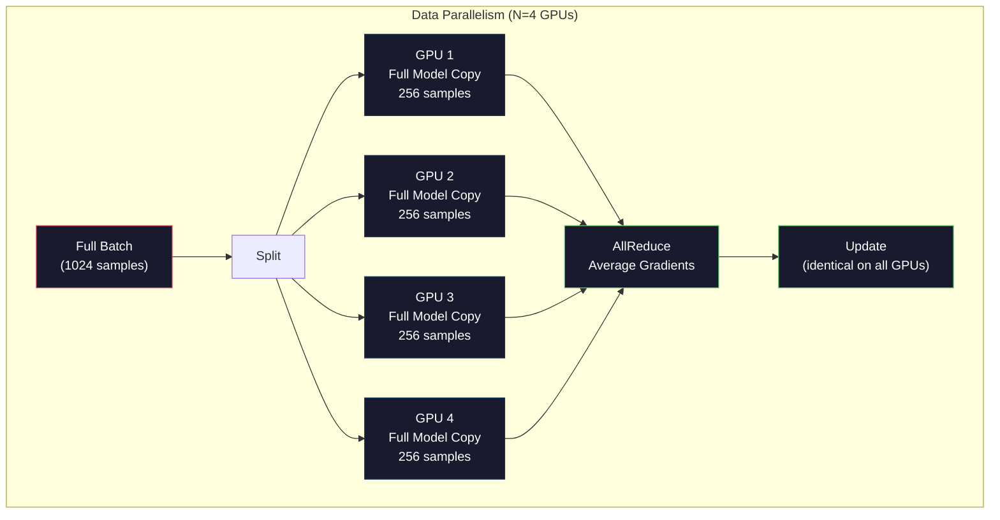
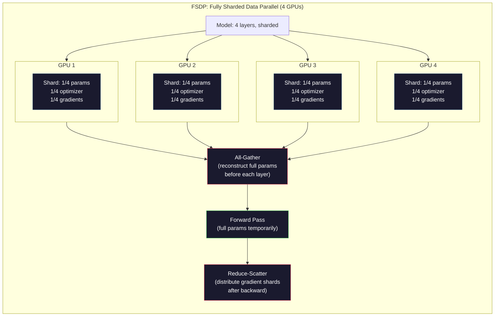
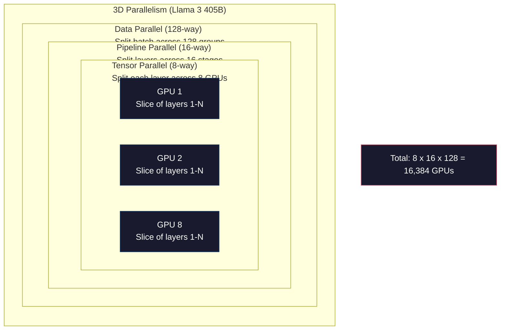

# スケーリング: 分散訓練、FSDP、DeepSpeed

> あなたの124Mモデルは1つのGPUで訓練された。今70億パラメータを試してみよう。モデルはメモリに適合しない。データは単一マシンで週を取る。分散訓練はスケールで選択肢ではない。それは唯一の前方への道だ。

**タイプ:** ビルド
**言語:** Python
**前提条件:** Phase 10、Lesson 04 (Mini GPTの事前学習)
**所要時間:** 約120分

## 学習目標

- 3種類の並列性(データ、テンソル、パイプライン)を説明し、モデルとクラスタサイズに基づいてそれぞれが必要な場合を説明する
- PyTorch DDPを使用した勾配同期を伴う複数GPU間のデータ並列訓練を実装する
- 与えられたモデルサイズのメモリ予算(重み + オプティマイザ状態 + 勾配 + 活性化)を計算して最小ハードウェアを決定する
- FSDP またはDeepSpeed ZeRO ステージを構成してモデル状態をGPU間に分割し、単一GPU メモリを超えるモデルに適合させる

## 問題

7B パラメータモデルはFP16で14GBの重みだけが必要だ。アダム・オプティマイザは各パラメータの2つの追加コピーを保存する(第1および第2モーメント推定)。それはさらに28GBだ。逆伝播中の勾配はさらに14GBを追加する。あなたは単一活性化が保存される前に56GBで消費されている。

NVIDIAのA100は80GBのメモリを持っている。

80GBのうち56GB消費。それはactivations用に24GBを残す -- 逆伝播のためにアライブに保つ必要がある順伝播中に計算される中間値。2048トークン・シーケンスと4096次元モデルの場合、単一レイヤーの活性化はおよそ64MBを使用する。32層で、サンプルごとに2GB必要。バッチサイズ8は16GBが必要。あなたは24GBを持っている。バッチサイズ12は吹き飛ぶ。

今70Bパラメータを試す。重みだけ: FP16で140GB。1つのGPUに適合しない。少なくとも2つのA100s (2 x 80GB = 160GB)が重みだけを保持する必要がある。オプティマイザ状態と勾配を追加し、あなたはさらに多く必要とする: シャーディング戦略に応じて最小3+ GPU、実際には8-16。

Llama 3 405Bは16,384 NVIDIA H100 GPUで訓練された。訓練実行は推定100百万ドルのコンピュート・コストだった。DeepSeek V3はアーキテクチャ(Mixture of Expertはトークンあたりパラメータの一部だけを活性化)と訓練効率について賢明であることによって、比較可能なモデルを約560万ドルで訓練した。

このレッスンは大規模訓練を可能にする4つの戦略をカバーする: データ並列性、テンソル並列性、パイプライン並列性、完全シャード・データ並列性。あなたは分散訓練フレームワークに触れる前に理解するメカニクスのために純粋なPythonでそれぞれを シミュレートするだろう。

## コンセプト

### なぜ分布が必要か

実際のモデルのメモリ数学。すべての数値は推定ではなく計算される。

| モデル | パラメータ | 重み(FP16) | アダム状態 | 勾配(FP16) | 合計(活性化なし) |
|-------|--------|----------------|-------------|------------------|----------------------|
| GPT-2 Small | 124M | 248 MB | 992 MB | 248 MB | 1.5 GB |
| Llama 3 8B | 8B | 16 GB | 64 GB | 16 GB | 96 GB |
| Llama 3 70B | 70B | 140 GB | 560 GB | 140 GB | 840 GB |
| Llama 3 405B | 405B | 810 GB | 3,240 GB | 810 GB | 4,860 GB |

「アダム状態」列は殺人者だ。アダムはすべてのパラメータの実行平均(m)と実行分散(v)を保存し、両方ともFP32。70Bモデルの場合、それは70B x 4バイト x 2 = 560GB。オプティマイザだけで7つのA100が必要。

単一のH100は80GBを持つ。Llama 3 405Bは重み、オプティマイザ、勾配を保持するために最少61 H100が必要。活性化を追加すると数はさらに成長。Metaは16,384 GPUを使用していなかった -- 彼らは持たなかったから -- 彼らが持つ必要があったからだ。

### データ並列性

最も単純な分散戦略。完全なモデルをNつのGPUにコピー。各訓練バッチをN等分。各GPUはそのデータシャードで順伝播と逆伝播を実行。逆伝播後、すべてのGPU間で勾配を平均。すべてのGPUは同じ平均化勾配で重みを更新し、すべてのコピーを同期に保つ。

**良い点:** 線形スループット・スケーリング。N GPU は1ステップあたりN倍のデータを処理。通信は勾配平均に制限され、計算と重なる。

**悪い点:** すべてのGPUが完全なモデル、オプティマイザ状態、勾配を保持。70Bモデルの場合、各GPUは840GB必要。データ並列性はGPUあたりのメモリを削減するのに何もしない。それは訓練時間を削減するだけだ。

**数学:** 有効バッチサイズ = per_gpu_batch_size x N。N=64 GPU でper-GPU バッチ16の場合、有効バッチは1,024。Llama 3はステップあたり1600万トークンの有効バッチサイズを使用。



### テンソル並列性

個別レイヤーをGPU間に分割。単一の行列乗算はGPU間に分割され、各々がもたらしたのの一部を計算。

フィードフォワード・レイヤーで形状(8192, 8192)の重み行列を考えよ。4-ウェイ・テンソル並列性で、各GPUは(8192, 2048)シャードを保持。各GPUは入力に自身のシャードを乗じ、部分的な結果を生成。部分的な結果は完全な出力を生成するために組み合わせられる(all-reduce またはall-gather経由)。

**良い点:** モデル重みのGPUあたりメモリを削減。8 GPUに分割される70Bモデルは、各GPUが約8.75B パラメータ分の重みを保持。

**悪い点:** すべてのレイヤー後にGPU間の高速相互通信を必要とする。各matmul後のall-reduceはレイテンシを追加する。これはNVLink (同じノード上のGPU間で900 GB/s)でうまく機能するが、InfiniBand (400 Gb/s、約50 GB/s)で接続されたノード全体で悪い。テンソル並列性はほぼ常に単一ノード内(8 GPU)に制限される。

**実際の使用:** Megatron-LM がテンソル並列性を開拓。Llama 3 405Bは各ノード内で8-ウェイ・テンソル並列性を使用。

### パイプライン並列性

レイヤーによってモデルを分割。GPU 1は層1-8を実行。GPU 2は層9-16を実行。GPU 3は層17-24を実行。GPU 4は層25-32を実行。データはパイプラインを通して流れ: GPU 1はその層を計算し活性化をGPU 2に送り、GPU 2はその層を計算しGPU 3に送り、など。

**良い点:** GPU間の最小通信 -- 層境界での活性化だけ、それは勾配または重みと比べて小さい。ノード間で動作することができる。バンド幅要件は低い。

**悪い点:** パイプライン・バブル。GPU 4はマイクロバッチ1に対して順伝播を計算しているとき、GPU 1、2、3はアイドル(それらはすでに分量を転送)。逆伝播の間、パターンは反転。素朴なパイプライン処理で、GPU利用率はN パイプライン・ステージに対してただ1/N。

**GPipe and PipeDream** はバッチをマイクロバッチに分割することでバブル問題を解決。GPU 1はマイクロバッチ1の転送を完了するとすぐマイクロバッチ2で開始。これはパイプライン・ステージ全体の計算をオーバーラップさせる。M マイクロバッチとN ステージで、バブル分数は(N-1)/Mに低下。N=4ステージでM=16マイクロバッチを使用し、バブルは3/16 = 18.75%アイドル時間。

### FSDP: 完全シャード・データ並列

FSDPはデータ並列のスケーラビリティとシャーディングのメモリ効率を結合。完全なモデルのコピーを保持する代わりに、各GPUは1/Nのパラメータ、勾配、オプティマイザ状態だけを保持。

レイヤーの順伝播前に、FSDPはすべてのGPUからパラメータの完全パラメータを各GPU のメモリに収集するために **all-gather** を実行。順伝播後、各GPUは非ローカル・パラメータを破棄。逆伝播の間、all-gather は再度実行され、勾配計算のためにパラメータを再構築。逆伝播後、**reduce-scatter** は勾配シャードを分布させ、各GPUはかだけ1/N の勾配を保存。

**8 GPU上の70Bモデルの数学:**

| コンポーネント | FSDP無し | FSDP付き |
|-----------|-------------|-----------|
| 重み(FP16) | GPUあたり140 GB | GPUあたり17.5 GB |
| アダム状態(FP32) | GPUあたり560 GB | GPUあたり70 GB |
| 勾配(FP16) | GPUあたり140 GB | GPUあたり17.5 GB |
| **合計** | **GPUあたり840 GB** | **GPUあたり105 GB** |

FSDPなしでは、単一80GB GPUに70Bモデルを適合させることはできない。8 GPUのFSDPで、各GPUは105GB を使用する -- 待てよ、それでもフィットしない。160GB以下を得るには少なくとも16 GPU が必要、またはあなたはFSDPを活性化チェックポイント(逆伝播中に活性化を保存する代わりに再計算)と組み合わせる。

バニラ・データ並列性よりも通信コストは高い(各レイヤー前のall-gather のため)。だがメモリ節約は以前不可能だった訓練実行を可能にする。



### DeepSpeed ZeRO

DeepSpeed のZeRO(Zero冗長性オプティマイザ)は概念的にはFSDPと同じだが、Microsoftによって独立して開発。それは3つのステージを定義し、それぞれがより積極的にシャード:

| ステージ | シャード | メモリ節約 | 通信 |
|-------|--------|---------------|---------------|
| ZeRO-1 | オプティマイザ状態だけ | 約4倍削減 | データ並列と同じ |
| ZeRO-2 | + 勾配 | 約8倍削減 | 少し多い |
| ZeRO-3 | + パラメータ | 約N倍削減(N GPU) | レイヤーあたりall-gather |

ZeRO-3はFSDPと等価。命名は異なる、メカニズムは同じ。PyTorchはDeepSpeedが概念を証明した後、FSDPをネイティブ実装として追加。

DeepSpeedは また ZeRO-Offload(CPU RAMにオプティマイザ状態をオフロード、より安く、より大きい)とZeRO-Infinity(NVMe SSDs にオフロード)も導入。これらはメモリ容量のための計算速度をトレード -- オフロードされた操作は遅いがGPU メモリを解放。

### 混合精度訓練

現代の訓練は同時に複数の浮動小数点形式を使用:

- **順伝播**: FP16 またはBF16(16-bit)。FP32の半分のメモリ。Matmulsはテンソル・コアで2倍速く実行。
- **マスター重み**: FP32(32-bit)。重み更新中の数値精度のためオプティマイザによって保持。
- **損失スケーリング**: FP16勾配がゼロにアンダーフローするのを防ぐため、逆伝播前に大きな定数で損失を乗じ。オプティマイザ・ステップ前に同じ定数で割る。

BF16(Brain Float 16)はFP32と同じ指数範囲(8指数ビット)を持つが精度が削減(仮数ビット7対FP32の23)。FP32と同じ値の範囲を表現できるため、損失スケーリングが必要になることはめったにない。FP16は5指数ビットと10仮数ビットを持つ -- それは微粒値を表現することはできるが極端な大きさでオーバーフロー/アンダーフロー。

GoogleのTPUsはBF16をネイティブに使用。NVIDIAのA100とH100は両方ともFP16とBF16をサポート。業界はBF16に大きく移動した。それは損失スケーリングの手間を削除するため。

**7Bモデルのメモリ比較:**

| 精度 | 重み | オプティマイザ | 勾配 | 合計 |
|-----------|---------|-----------|-----------|-------|
| FP32全体 | 28 GB | 56 GB | 28 GB | 112 GB |
| 混合(BF16 + FP32マスター) | 14 GB | 56 GB | 14 GB | 84 GB |

混合精度はこのモデルで28GB保存。オプティマイザ状態はどの精度でもFP32のまま -- これはメモリの大部分が行く場所だ。

### Megatron-LMと3D並列性

実際の大規模訓練は3つの並列性すべてを結合:

- **データ並列性** ノード・グループ全体(バッチサイズをスケール)
- **テンソル並列性** ノード内(8 GPU全体でレイヤーを分割)
- **パイプライン並列性** ノード全体(マシン全体でレイヤー・グループを分割)

Llama 3 405B on 16,384 H100s:
- 各ノード内で8-ウェイ・テンソル並列性(ノードあたり8 GPU)
- ノード全体で16-ウェイ・パイプライン並列性(16パイプライン・ステージ)
- 残りの次元全体で128-ウェイ・データ並列性(16,384 / 8 / 16 = 128)

この3D分解(8 x 16 x 128 = 16,384)は数千のGPUへどうスケール。各GPUは異なるデータシャード(データ並列)を見、各レイヤーの1つのスライスを保持(テンソル並列)、異なるレイヤー・セットを計算(パイプライン並列)。

DeepSeek V3は異なるアプローチを取った。それのMixture of Experts アーキテクチャはトークンあたり671B パラメータのうち37B だけを活性化。これは各GPUが活性化パラメータだけを計算して保存する必要があることを意味。それらは2,048 H800 GPU上で訓練した -- Metaの1/8未満 -- 560万ドル対Metaの推定100百万ドル。



## ビルド

### ステップ1: データ並列性をシミュレート

バッチをシミュレートされたGPU全体に分割。各GPUはそのシャードで順伝播を計算。「勾配」を平均(シミュレートで損失値として)。

```python
import numpy as np

def simulate_data_parallelism(data, num_gpus, model_fn):
    batch_size = len(data)
    shard_size = batch_size // num_gpus
    remainder = batch_size % num_gpus

    gpu_losses = []
    gpu_gradients = []

    offset = 0
    for gpu_id in range(num_gpus):
        extra = 1 if gpu_id < remainder else 0
        shard = data[offset:offset + shard_size + extra]
        offset += shard_size + extra

        loss, grad = model_fn(shard)
        gpu_losses.append(loss)
        gpu_gradients.append(grad)

    avg_loss = np.mean(gpu_losses)
    avg_gradient = np.mean(gpu_gradients, axis=0)

    return avg_loss, avg_gradient
```

all-reduce操作(勾配の平均化)はデータ並列性での唯一の通信。実際には、これはNVIDIA GPUのNCCL ライブラリを使用し、リング all-reduce を実装: 各GPUは隣人への勾配の1/N を送信、他の隣人から1/N を受け取り、N-1ステップ後、すべてのGPUが完全な平均を持つ。総通信ボリューム: 2 x gradient_size x (N-1)/N、大きなNのための2xの勾配サイズに近付く。

### ステップ2: テンソル並列性をシミュレート

重み行列をGPU全体に分割。各GPUは部分行列乗算を計算。結果を結合。

```python
def simulate_tensor_parallelism(input_data, weight_matrix, num_gpus):
    d_in, d_out = weight_matrix.shape
    assert d_out % num_gpus == 0, f"d_out {d_out} not divisible by num_gpus {num_gpus}"
    shard_size = d_out // num_gpus

    partial_results = []
    for gpu_id in range(num_gpus):
        start = gpu_id * shard_size
        end = start + shard_size
        weight_shard = weight_matrix[:, start:end]

        partial = input_data @ weight_shard
        partial_results.append(partial)

    full_output = np.concatenate(partial_results, axis=-1)

    direct_output = input_data @ weight_matrix
    error = np.abs(full_output - direct_output).max()

    return full_output, error
```

エラーはちょうどゼロ(またはマシン・エプシロン)であるべき。テンソル並列性は数学的に正確 -- それは1つのGPU上の完全なmatmulと同じ結果を生成。分割は出力次元に沿って、各GPUは異なるコラムのチャンクを生成、連結は完全な結果を再構成。

列並列線形層(出力次元を分割)のため、あなたは連結。行並列(入力次元を分割)のため、あなたは合計。トランスフォーマーFFNで、最初の線形(拡張)は列並列を使用し、2番目の線形(コンパクト)は行並列を使用。これは2つのレイヤー間のall-reduceを避ける。

### ステップ3: パイプライン並列性をシミュレート

仮想GPU全体にモデルのレイヤーを分割。初期ステージがその後のステージ計算の間、アイドルで座るバブル問題を示す。

```python
def simulate_pipeline_parallelism(num_layers, num_stages, num_microbatches):
    layers_per_stage = num_layers // num_stages

    timeline = {}
    clock = 0

    for mb in range(num_microbatches):
        for stage in range(num_stages):
            start_time = max(
                timeline.get((stage, mb - 1, "fwd"), (0, 0))[1] if mb > 0 else 0,
                timeline.get((stage - 1, mb, "fwd"), (0, 0))[1] if stage > 0 else 0,
            )
            end_time = start_time + layers_per_stage
            timeline[(stage, mb, "fwd")] = (start_time, end_time)

    last_fwd_end = max(v[1] for v in timeline.values())

    for mb in range(num_microbatches - 1, -1, -1):
        for stage in range(num_stages - 1, -1, -1):
            deps = [last_fwd_end]
            if mb < num_microbatches - 1 and (stage, mb + 1, "bwd") in timeline:
                deps.append(timeline[(stage, mb + 1, "bwd")][1])
            if stage < num_stages - 1 and (stage + 1, mb, "bwd") in timeline:
                deps.append(timeline[(stage + 1, mb, "bwd")][1])
            start_time = max(deps)
            end_time = start_time + layers_per_stage
            timeline[(stage, mb, "bwd")] = (start_time, end_time)

    total_time = max(v[1] for v in timeline.values())
    compute_time = num_microbatches * num_stages * layers_per_stage * 2
    bubble_fraction = 1.0 - compute_time / (total_time * num_stages)

    return timeline, total_time, bubble_fraction
```

4ステージと1マイクロバッチで、バブル分数は75% -- 任意の時点で4つのGPUのうち3つはアイドル。16マイクロバッチで、それは約19%に低下。バブルを排除するコストはメモリ: 同時にフライ中のすべてのマイクロバッチの活性化を保存する必要がある。

### ステップ4: メモリ計算機

任意のモデル・サイズの正確なメモリ要件を計算。

```python
def memory_calculator(
    params_billions,
    precision_bytes=2,
    optimizer="adam",
    num_gpus=1,
    sharding="none",
    sequence_length=2048,
    batch_size_per_gpu=1,
    hidden_dim=None,
    num_layers=None,
):
    params = params_billions * 1e9

    weight_memory = params * precision_bytes

    if optimizer == "adam":
        optimizer_memory = params * 4 * 2
    elif optimizer == "sgd":
        optimizer_memory = params * 4
    else:
        optimizer_memory = 0

    gradient_memory = params * precision_bytes

    total_no_activation = weight_memory + optimizer_memory + gradient_memory

    if hidden_dim and num_layers:
        activation_per_layer = (
            sequence_length * batch_size_per_gpu * hidden_dim * precision_bytes * 4
        )
        activation_memory = activation_per_layer * num_layers
    else:
        activation_memory = params * precision_bytes * 0.5

    if sharding == "fsdp" or sharding == "zero3":
        weight_memory /= num_gpus
        optimizer_memory /= num_gpus
        gradient_memory /= num_gpus
    elif sharding == "zero2":
        optimizer_memory /= num_gpus
        gradient_memory /= num_gpus
    elif sharding == "zero1":
        optimizer_memory /= num_gpus

    per_gpu_total = weight_memory + optimizer_memory + gradient_memory + activation_memory

    return {
        "params_billions": params_billions,
        "weights_gb": weight_memory / 1e9,
        "optimizer_gb": optimizer_memory / 1e9,
        "gradients_gb": gradient_memory / 1e9,
        "activations_gb": activation_memory / 1e9,
        "per_gpu_total_gb": per_gpu_total / 1e9,
        "total_across_gpus_gb": per_gpu_total * num_gpus / 1e9,
        "fits_on_80gb": per_gpu_total / 1e9 <= 80,
        "num_gpus": num_gpus,
        "sharding": sharding,
    }
```

この計算機は各ML エンジニアが尋ねる質問に答える: 「いくつのGPUが必要か?」モデル・サイズをフィード し、それがフィットするかどうか見よ。シャーディング戦略を調整しGPUあたりの合計が80GBの下にドロップするまで。

### ステップ5: 混合精度シミュレーション

FP32、FP16、混合精度訓練間のメモリ使用を比較。

```python
def mixed_precision_comparison(params_billions):
    params = params_billions * 1e9

    fp32_weights = params * 4
    fp32_optimizer = params * 4 * 2
    fp32_gradients = params * 4
    fp32_total = fp32_weights + fp32_optimizer + fp32_gradients

    fp16_weights = params * 2
    fp16_master = params * 4
    fp16_optimizer = params * 4 * 2
    fp16_gradients = params * 2
    fp16_total = fp16_weights + fp16_master + fp16_optimizer + fp16_gradients

    mixed_weights = params * 2
    mixed_optimizer = params * 4 * 2
    mixed_gradients = params * 2
    mixed_total = mixed_weights + mixed_optimizer + mixed_gradients

    return {
        "fp32_total_gb": fp32_total / 1e9,
        "fp16_with_master_gb": fp16_total / 1e9,
        "mixed_bf16_gb": mixed_total / 1e9,
        "savings_vs_fp32": 1 - mixed_total / fp32_total,
    }
```

ほとんどの人のために最大の驚き: 混合精度はメモリを半分にしない。オプティマイザ状態(アダムのmとv)は精度に関わらずFP32のまま。7Bモデルの場合、FP32訓練は112GBを使用。混合精度は84GBを使用。それは50%削減ではなく25%削減。オプティマイザが支配する。

## 使用

### すべてのシミュレーションを実行

```python
def run_all_demos():
    print("=" * 70)
    print("DATA PARALLELISM SIMULATION")
    print("=" * 70)

    np.random.seed(42)
    data = np.random.randn(64, 32)
    weight = np.random.randn(32, 16)

    def model_fn(batch):
        output = batch @ weight
        loss = np.mean(output ** 2)
        grad = 2 * batch.T @ (batch @ weight) / len(batch)
        return loss, grad

    for n_gpus in [1, 2, 4, 8]:
        loss, grad = simulate_data_parallelism(data, n_gpus, model_fn)
        print(f"  {n_gpus} GPUs: loss={loss:.4f}, grad_norm={np.linalg.norm(grad):.4f}")

    print()
    print("=" * 70)
    print("TENSOR PARALLELISM SIMULATION")
    print("=" * 70)

    x = np.random.randn(4, 8192)
    W = np.random.randn(8192, 8192)

    for n_gpus in [1, 2, 4, 8]:
        output, error = simulate_tensor_parallelism(x, W, n_gpus)
        print(f"  {n_gpus} GPUs: output_shape={output.shape}, max_error={error:.2e}")

    print()
    print("=" * 70)
    print("PIPELINE PARALLELISM SIMULATION")
    print("=" * 70)

    for n_mb in [1, 4, 8, 16, 32]:
        _, total_t, bubble = simulate_pipeline_parallelism(32, 4, n_mb)
        print(f"  {n_mb:2d} micro-batches: total_time={total_t:4d}, bubble={bubble:.1%}")

    print()
    print("=" * 70)
    print("MEMORY CALCULATOR")
    print("=" * 70)

    configs = [
        (7, "none", 1),
        (7, "fsdp", 8),
        (70, "none", 1),
        (70, "fsdp", 8),
        (70, "fsdp", 16),
        (405, "fsdp", 64),
        (405, "fsdp", 128),
    ]

    print(f"  {'Model':>8} {'Sharding':>8} {'GPUs':>5} {'Per-GPU':>10} {'Fits 80GB':>10}")
    print("  " + "-" * 50)
    for params, shard, gpus in configs:
        result = memory_calculator(params, num_gpus=gpus, sharding=shard)
        fits = "Yes" if result["fits_on_80gb"] else "No"
        print(f"  {params:>6}B {shard:>8} {gpus:>5} {result['per_gpu_total_gb']:>8.1f}GB {fits:>10}")

    print()
    print("=" * 70)
    print("MIXED PRECISION COMPARISON")
    print("=" * 70)

    for params_b in [7, 13, 70, 405]:
        result = mixed_precision_comparison(params_b)
        print(f"  {params_b}B: FP32={result['fp32_total_gb']:.0f}GB, "
              f"Mixed BF16={result['mixed_bf16_gb']:.0f}GB, "
              f"Savings={result['savings_vs_fp32']:.0%}")
```

## シップ

このレッスンは`outputs/prompt-distributed-training-planner.md` を生成する -- モデル・サイズと利用可能なハードウェアを取得し、完全な分散訓練計画を生成するプロンプト: 並列性戦略、メモリ予算、通信オーバーヘッド、予想スループット。

## 演習

1. 活性化チェックポイント含めるようにメモリ計算機を変更。チェックポイント付きで、K番目のレイヤー(典型的K=1、すべてを再計算する意味)でだけ活性化を保存。メモリ計算トレードオフを示す: チェックポイント量は多いメモリを保存し、訓練を遅くする(完全なチェックポイント用に大体33%より多い計算)。

2. パイプライン並列性シミュレーションを拡張してPipeDreamで使用される1F1B(1つの順伝播、1つの逆伝播)スケジュールを実装。4ステージと8マイクロバッチに対して素朴なスケジュール対バブル分数を比較。1F1B スケジュールはそれが逆伝播を早く開始するため、小さいピーク・メモリを持つべき。

3. 勾配蓄積シミュレータを実装。すべてのマイクロバッチ後にall-reduce する代わりに、勾配をKステップ局所的に蓄積し、その後all-reduce。通信がK倍削減するが同じ最終勾配(したがって同じ訓練)を生成することを示す。

4. コスト推定器を構築。モデル・サイズ、目標トークン数、GPU種(A100 at $2/hr, H100 at $3.50/hr)、並列性戦略が与えられた場合、ドルで総訓練コストを推定。既知コスト対検証: Llama 3 405B報告により約$100M、DeepSeek V3コスト約$5.6M。

5. ZeRO-Offloadをメモリ計算機に追加。CPURAMが512GBのノードとNVMeが2TBと仮定。オプティマイザ状態をCPUにオフロードすることが16 GPU の代わりに4 GPU上の70B モデルが訓練できること示し、オプティマイザ・ステップで30-50%遅いコストで。

## キー用語

| 用語 | 人が言うこと | 実際の意味 |
|------|----------------|----------------------|
| データ並列性 | 「モデルをすべてのGPUにコピー」 | 各GPUは異なるデータシャードを処理; 勾配はすべてのステップ後のall-reduce経由で平均化 |
| テンソル並列性 | 「レイヤーをGPU全体に分割」 | 重み行列をパーティション し、各GPUが行列の一部を計算; 高速NVLinkインターコネクトを必要とする |
| パイプライン並列性 | 「レイヤーをGPU全体に分割」 | 各GPUは異なるレイヤー・グループを実行; マイクロバッチでバブルを削減するため、データはパイプラインを通して流れ |
| FSDP | 「すべてをシャード」 | 完全シャード・データ並列 -- 各GPUは1/N の重み、勾配、オプティマイザ状態を保持; 計算前のall-gather |
| ZeRO | 「DeepSpeedのFSDP版」 | Zero冗長性オプティマイザ、3ステージ: シャード・オプティマイザ(ステージ1)、+ 勾配(ステージ2)、+ パラメータ(ステージ3) |
| All-reduce | 「GPU全体で平均」 | 集約操作で、すべてのGPUはすべてのGPUの入力の合計(または平均)で終わる -- 通常、リングall-reduce として実装 |
| All-gather | 「すべてのGPUから収集」 | 集約操作で、すべてのGPUはすべてのGPUのデータの連結で終わる -- FSDPでフル・パラメータを再構築するために使用 |
| Reduce-scatter | 「合計して分散」 | 集約操作で、データを削減(合計)し、異なる部分を異なるGPUに分散 -- FSDPで勾配シャーディングのために使用 |
| 混合精度 | 「半精度で訓練」 | 順伝播/逆伝播にはFP16/BF16を、オプティマイザ状態にはFP32を使用 -- メモリの約25%節約、50%ではなくなぜなら、オプティマイザが支配 |
| パイプライン・バブル | 「パイプラインのアイドル時間」 | GPU が前のステージからデータを待つ間、アイドル時間の分数 -- より多くのマイクロバッチで削減 |

## さらに読む

- [Rajbhandari et al., 2020 -- "ZeRO: Memory Optimizations Toward Training Trillion Parameter Models"](https://arxiv.org/abs/1910.02054) -- 3つのシャーディング・ステージを定義したDeepSpeed ZeRO論文
- [Shoeybi et al., 2020 -- "Megatron-LM: Training Multi-Billion Parameter Language Models Using Model Parallelism"](https://arxiv.org/abs/1909.08053) -- トランスフォーマーのためのNVIDIAのテンソル並列性
- [Narayanan et al., 2021 -- "Efficient Large-Scale Language Model Training on GPU Clusters Using Megatron-LM"](https://arxiv.org/abs/2104.04473) -- 3D並列性データ、テンソル、パイプラインを結合
- [Zhao et al., 2023 -- "PyTorch FSDP: Experiences on Scaling Fully Sharded Data Parallel"](https://arxiv.org/abs/2304.11277) -- PyTorchのネイティブFSDPの実装
- [Llama 3 Technical Report](https://arxiv.org/abs/2407.21783) -- 3D並列性の詳細との16,384 GPU訓練
- [DeepSeek-V3 Technical Report](https://arxiv.org/abs/2412.19437) -- MoEアーキテクチャがどのように訓練コストをオーダーの大きさで削減するか
