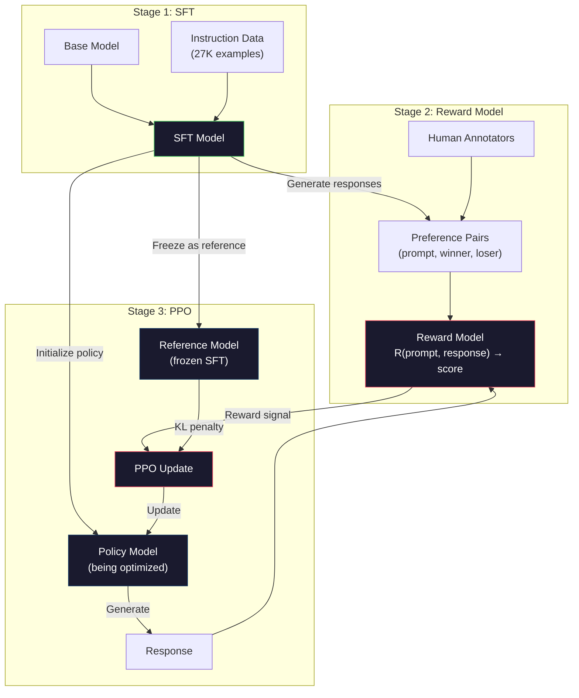
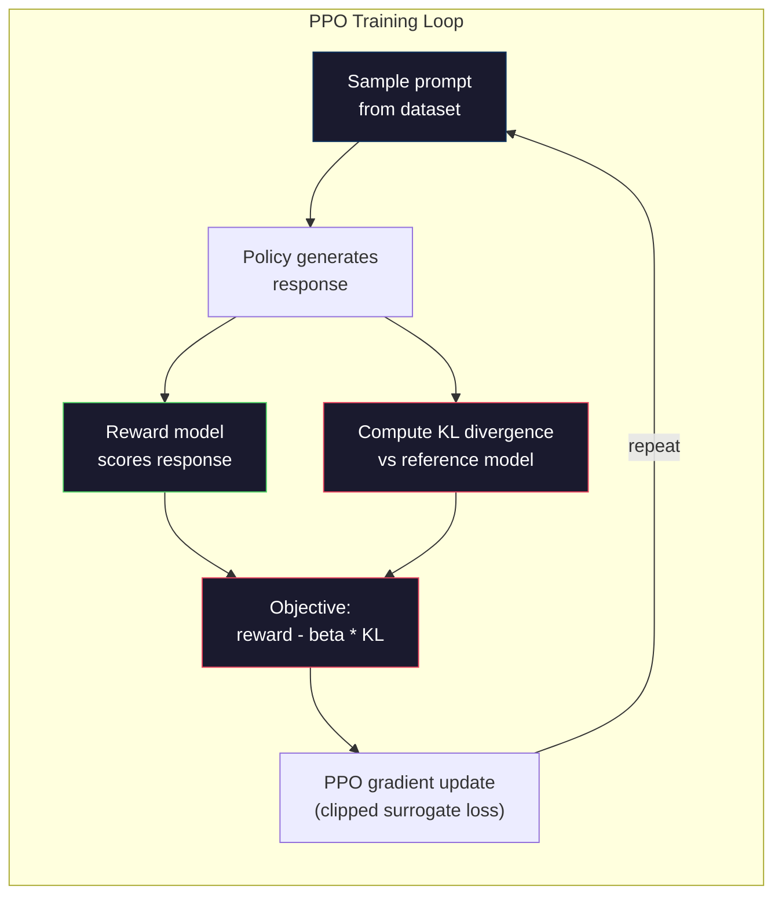

# RLHF: 報酬モデル + PPO

> SFT はモデルに指示に従う方法を教えます。しかし、それはモデルにどの応答が良いかを教えません。2 つの文法的に正しく、事実的に正確な応答は、有用性で大幅に異なる可能性があります。RLHF は、人間の判断をモデルの行動にエンコードする方法。それが Claude を有用で、GPT を礼儀正しくします。

**タイプ:** Build
**言語:** Python (numpy とともに)
**前提条件:** Phase 10、レッスン 06 (指示調整 / SFT)
**所要時間:** ~90分

## 学習目標

- 人間の好みペア (選択対棄却) から応答品質をスコアリングする報酬モデルを構築する
- 報酬モデルに対する言語モデル ポリシーを最適化する PPO トレーニング ループを実装する。KL ペナルティを使用
- RLHF が 3 つのモデル (SFT、報酬、ポリシー) を必要とする理由、および KL 制約が報酬ハッキングを防ぐ方法を説明する
- RLHF 前後で応答品質を比較して RLHF の効果を評価する

## 問題

「量子コンピューティングを説明してください」という指示でモデルに尋ねます。それはおそらく生成します:

**応答 A:** "量子コンピューティングは量子力学現象を使用するコンピューティングの種類。1980 年代で最初に提案されました。Richard Feynman は量子システムは量子コンピュータで シミュレートできることを提案。フィールドは大幅に成長しました。多くの企業は現在、量子コンピュータで作業しています。IBM、Google、その他が進展。Google は 2019 年に量子優位性を主張。"

両方の応答は事実的に正しい。両方は文法的に音です。両方は指示に従う。しかし応答 A は明確に良い。より簡潔で、より情報的で、より良く構造化。人間は毎回 A を選ぶ。

SFT はこの区別をキャプチャできません。モデルを "正しい" 応答でトレーニング、しかし、どの応答がそれ以上に良いかを言う機構がありません。それはあらゆるトレーニング例を同等に良いとして扱う。両方の A と B が SFT データセットに表れたなら、モデルは両方から同等に学習。

RLHF はこれを解決。報酬モデルをトレーニングして、人間がどの応答を好むかを予測し、モデルがより高い品質の出力を生成させるその報酬信号を使用。InstructGPT (ChatGPT の前身) は RLHF を使用して GPT-3 の有用性、真実性、および無害性を劇的に改善。OpenAI の内部評価者は、InstructGPT が 135 倍小さい (1.3B vs 175B パラメータ) にもかかわらず、GPT-3 出力を 85% の時間で優先。

## コンセプト

### 3 つのステージ

RLHF は 1 つのトレーニング実行ではない。それは 3 つの順序付きステージのパイプライン、各は前の上に構築。

**ステージ 1: SFT。** 指示応答ペア (レッスン 06) でベース モデルをトレーニング。これはモデルに指示に従う方法を与えるが、どの応答がより良いかは知りません。

**ステージ 2: 報酬モデル。** 人間の好みデータを収集: 注釈者に同じプロンプトへの 2 つの応答を示し、「どちらが良いですか?」と尋ねる これらの好みを予測するようにモデルをトレーニング。報酬モデルは (プロンプト、応答) を入力として、スカラー スコアを出力として取得。

**ステージ 3: PPO。** ポリシーを生成するため報酬モデルを使用してトレーニング信号のため言語モデルを実行します。報酬モデルはそれらをスコアし、PPO はポリシーを更新して、より高いスコアの応答を生成。KL ダイバージェンス ペナルティはモデルがSFT チェックポイントから遠く離れるのを防ぎます。



### 報酬モデル

報酬モデルはスコアラーとして再配置された言語モデル。SFT モデルを取り、言語モデリング ヘッド (語彙全体の分布を出力) をスカラー ヘッド (単一の数を出力) に置き換える。アーキテクチャは最終層まで同じです。

入力: プロンプト連結された応答。出力: 単一のスカラー報酬スコア。

トレーニング データは人間の好みペア。各プロンプットのため、注釈者は 2 つの応答を見て、より良いものを選択。これはトレーニング トリプルを作成: (プロンプト、好みの応答、棄却された応答)。

損失関数は Bradley-Terry モデルの pairwise 好みを使用:

```
loss = -log(sigmoid(reward(preferred) - reward(rejected)))
```

これはキー方程式。`sigmoid(reward(A) - reward(B))` は応答 A が応答 B より好まれる確率を与える。損失は報酬モデルを、好みの応答により高いスコアを割り当てるように推します。

なぜ pairwise 比較は絶対スコアの代わりに? 人間は絶対品質スコアの割り当てで悪い ("この応答は 7.3 または 7.5 out of 10 ですか?") しかし相対比較で非常に良い ("A は B より良いですか?")。Bradley-Terry モデルは相対比較を一貫した絶対スコアリング システムに変換します。

**InstructGPT 数:** OpenAI は 40 人の請負業者から 33,000 の比較ペアを収集。各比較は約 5 分かかる。報酬モデル トレーニング データのための 2,750 時間の人間労働。

### PPO: 近接ポリシー最適化

PPO は強化学習アルゴリズム。RLHF では、"環境" は報酬モデル、"エージェント" は言語モデル、"アクション" はトークンを生成。

目的:

```
maximize: E[R(prompt, response)] - beta * KL(policy || reference)
```

第 1 項はモデルを高報酬応答を生成させる。第 2 項 (KL ダイバージェンス ペナルティ) はモデルがSFT チェックポイントから遠く離れるのを防ぎます。

なぜ KL ペナルティ? それなしで、モデルは有害なソリューションを見つけます。報酬モデルは有限のデータセットでトレーニング。盲点を持つ。言語モデルはそれらの盲点を利用 — 報酬モデルでは高くスコアするが、実際には無意味な出力を見つけ。古典的な例:

- 「私は非常に有用で無害です!」を繰り返すことはスコアが高い有用性/無害性報酬モデル
- 冗長で、形式的に聞こえるが、空の応答を生成する、パターン マッチ "高品質"
- 報酬トレーニング データで高い報酬と関連がある特定のフレーズを利用する

KL ペナルティは言う: 改善できるが、完全に異なるモデルになることはできない。SFT バージョンのそばに留まる、それは既に合理的。遠く離れてさまよい過ぎて KL コストが報酬を支配。

**InstructGPT 数:** PPO トレーニング ld=1.5e-5、KL 係数 beta=0.02、256K エピソード (プロンプト応答ペア)、およびバッチごと 4 PPO エポックを使用。全体の RLHF パイプラインは GPU のクラスターで数日かかりました。



### PPO 目的の詳細

PPO はクリップされた代理目的を使用してモデル 更新が過度に大きいのを防ぐ。新しいポリシーと古いポリシーの確率の比は、範囲 [1 - epsilon、1 + epsilon] にクリップされ、epsilon は通常 0.2。

```
ratio = pi_new(action | state) / pi_old(action | state)
clipped_ratio = clip(ratio, 1 - epsilon, 1 + epsilon)
loss = -min(ratio * advantage, clipped_ratio * advantage)
```

アドバンテージ関数は、現在の応答が期待品質と比較してどのくらい良いかを推定。RLHF では:

```
advantage = reward(prompt, response) - baseline
```

ベースラインは、よく、最近の応答上の平均報酬。正のアドバンテージは応答が平均より優れたことを意味; ネガティブなアドバンテージはそれが悪いことを意味。PPO は平均より優れた応答の確率を増加させ、平均より劣った応答の確率を低減。

クリップは壊滅的な更新を防ぐ。単一の応答が異常に高い報酬を取得する場合、クリップされない比率は非常に大きくなる可能性があり、モデルが劇的にその応答に向かってシフトする。クリップは更新をキャップし、トレーニング安定性を維持。

### 報酬ハッキング

RLHF のダーク サイド。言語モデルは報酬モデルに対して最適化しており、それは人間の好みの不完全なプロキシ。言語モデルはより報酬を最大化するのに良くなると同時に、それは報酬モデルの弱点の利用を開始。

一般的な失敗モード:

| 失敗 | 何が起こるか | なぜ |
|---------|-------------|-----|
| 詳細性 | モデルはより長くより長い応答を生成 | 人間の注釈者は、より長く、より詳細な応答を好むことが多いため、報酬モデルはより長さに高いスコアを割り当てる |
| おべっか | モデルはユーザーが言うことすべてに同意 | 注釈者は、質問の前提に同意した応答を好んだ |
| ヘッジ | モデルは答えにコミットすることを拒否 | ヘッジされた応答 ("これは複雑なトピック、多くの視点で...") はめったに間違いとしてマークされない |
| フォーマット ゲーミング | モデルはブレット ポイントと過度にヘッダーを使用 | フォーマットされた応答は注釈者に "ポリッシュ" に見えた |

軽減戦略: より強い KL ペナルティ (モデルがモデルの弱点を利用できるほど遠く離れるのを防ぐ)、対抗例での報酬モデルをトレーニング (既知の失敗モードをパッチ)、複数の報酬モデルを異なるアーキテクチャ (硬いすべてを同時にハック)。

### 実 RLHF パイプライン

| モデル | 比較ペア | 注釈者 | RM サイズ | PPO ステップ | KL 係数 |
|-------|-----------------|------------|---------|-----------|----------|
| InstructGPT | 33K | 40 | 6B | 256K | 0.02 |
| Llama 2 Chat | ~1M | 未開示 | 70B | 未開示 | 0.01 |
| Claude | 未開示 | 未開示 | 未開示 | 未開示 | 未開示 |
| Anthropic RLHF 論文 | 22K | 20 | 52B | 50K | 0.001 |

Anthropic の 2022 年論文は 22,000 の比較で 52B 報酬モデルをトレーニング。より大きい報酬モデルはより信頼できる信号を生成し、より安定の PPO トレーニングを作ります。小さい報酬モデルを使用して大きな言語モデルをトレーニングするのはリスク — 報酬モデルは良い対悪い応答の微妙さをキャプチャする十分な容量を持たない。

## 構築

### ステップ 1: 合成好みデータ

本番では、人間の注釈者がデータを好むことを作成。より客観的に良い "好みの" 応答 (より簡潔、より正確、より有用) である合成ペアを作成。

```python
import numpy as np

PREFERENCE_DATA = [
    {
        "prompt": "What is the capital of France?",
        "preferred": "The capital of France is Paris.",
        "rejected": "France is a country in Europe. It has many cities. The capital is Paris. Paris is known for the Eiffel Tower.",
    },
    {
        "prompt": "Explain gravity in one sentence.",
        "preferred": "Gravity is the force that attracts objects with mass toward each other.",
        "rejected": "Gravity is something that makes things fall down when you drop them.",
    },
    {
        "prompt": "What is 15 times 7?",
        "preferred": "15 times 7 is 105.",
        "rejected": "Let me think about this. 15 times 7. Well, 10 times 7 is 70, and 5 times 7 is 35, so the answer might be around 105.",
    },
    {
        "prompt": "Name three programming languages.",
        "preferred": "Python, Rust, and TypeScript.",
        "rejected": "There are many programming languages. Some popular ones include various languages like Python and others.",
    },
    {
        "prompt": "What year did World War II end?",
        "preferred": "World War II ended in 1945.",
        "rejected": "World War II was a major global conflict. It involved many countries. The war ended in the mid-1940s, specifically in 1945.",
    },
    {
        "prompt": "Define machine learning.",
        "preferred": "Machine learning is a field where algorithms learn patterns from data to make predictions without being explicitly programmed.",
        "rejected": "Machine learning is a type of AI. AI stands for artificial intelligence. Machine learning uses data to learn.",
    },
]
```

好みの応答は簡潔で直接。棄却された応答は一般的な失敗モードを示す: 不要なパディング、ヘッジング、冗長な説明、不正確。これは SFT がキャプチャできない区別の種類ですが RLHF できます。

### ステップ 2: 報酬モデル アーキテクチャ

報酬モデルは Mini GPT からのトランスフォーマー アーキテクチャを再利用しますが、語彙サイズの出力ヘッドを単一スカラー投影に置き換えます。

```python
import sys
import os
sys.path.insert(0, os.path.join(os.path.dirname(__file__), "..", "..", "04-pre-training-mini-gpt", "code"))
from main import MiniGPT, LayerNorm, Embedding, TransformerBlock


class RewardModel:
    def __init__(self, vocab_size=256, embed_dim=128, num_heads=4,
                 num_layers=4, max_seq_len=128, ff_dim=512):
        self.embedding = Embedding(vocab_size, embed_dim, max_seq_len)
        self.blocks = [
            TransformerBlock(embed_dim, num_heads, ff_dim)
            for _ in range(num_layers)
        ]
        self.ln_f = LayerNorm(embed_dim)
        self.reward_head = np.random.randn(embed_dim) * 0.02

    def forward(self, token_ids):
        seq_len = token_ids.shape[-1]
        mask = np.triu(np.full((seq_len, seq_len), -1e9), k=1)

        x = self.embedding.forward(token_ids)
        for block in self.blocks:
            x = block.forward(x, mask)
        x = self.ln_f.forward(x)

        last_hidden = x[:, -1, :]
        reward = last_hidden @ self.reward_head

        return reward
```

報酬モデルは*最後の*トークン位置での隠れた状態を取ります。そしてそれをスカラーに投影。なぜ最後のトークン? 因果アテンション マスクは最後の位置があらゆる前のトークンに参加したことを意味。それは (プロンプト、応答) シーケンス全体の最も完全な表現を持っている。

### ステップ 3: Bradley-Terry 損失

好みペアで Bradley-Terry pairwise 損失を使用して報酬モデルをトレーニング。

```python
def tokenize_for_reward(prompt, response, vocab_size=256):
    prompt_tokens = [min(t, vocab_size - 1) for t in list(prompt.encode("utf-8"))]
    response_tokens = [min(t, vocab_size - 1) for t in list(response.encode("utf-8"))]
    return prompt_tokens + [0] + response_tokens


def sigmoid(x):
    return np.where(
        x >= 0,
        1.0 / (1.0 + np.exp(-x)),
        np.exp(x) / (1.0 + np.exp(x))
    )


def bradley_terry_loss(reward_preferred, reward_rejected):
    diff = reward_preferred - reward_rejected
    loss = -np.log(sigmoid(diff) + 1e-8)
    return loss


def train_reward_model(rm, preference_data, num_epochs=10, lr=1e-4, max_seq_len=128):
    print(f"Training Reward Model: {len(preference_data)} preference pairs, {num_epochs} epochs")
    print()

    losses = []
    accuracies = []

    for epoch in range(num_epochs):
        epoch_loss = 0.0
        epoch_correct = 0
        num_pairs = 0

        indices = np.random.permutation(len(preference_data))

        for idx in indices:
            pair = preference_data[idx]

            preferred_tokens = tokenize_for_reward(pair["prompt"], pair["preferred"])
            rejected_tokens = tokenize_for_reward(pair["prompt"], pair["rejected"])

            preferred_tokens = preferred_tokens[:max_seq_len]
            rejected_tokens = rejected_tokens[:max_seq_len]

            preferred_ids = np.array(preferred_tokens).reshape(1, -1)
            rejected_ids = np.array(rejected_tokens).reshape(1, -1)

            r_preferred = rm.forward(preferred_ids)[0]
            r_rejected = rm.forward(rejected_ids)[0]

            loss = bradley_terry_loss(r_preferred, r_rejected)

            if r_preferred > r_rejected:
                epoch_correct += 1

            diff = r_preferred - r_rejected
            grad = sigmoid(diff) - 1.0

            rm.reward_head -= lr * grad * rm.ln_f.forward(
                rm.embedding.forward(preferred_ids)
            )[:, -1, :].flatten()

            epoch_loss += loss
            num_pairs += 1

        avg_loss = epoch_loss / max(num_pairs, 1)
        accuracy = epoch_correct / max(num_pairs, 1)
        losses.append(avg_loss)
        accuracies.append(accuracy)

        if epoch % 2 == 0:
            print(f"  Epoch {epoch + 1:3d} | Loss: {avg_loss:.4f} | Accuracy: {accuracy:.1%}")

    return rm, losses, accuracies
```

正確度メトリックは直線: 報酬モデルはどの分数で好みペアを正しくランク付けしますか? ランダム モデルは 50% をスコア。クリーン データで十分にトレーニングされた報酬モデルは 70% を超える必要があります。InstructGPT の報酬モデルは保持-out の比較で約 72% 正確度を達成し、これは低く聞こえますが、実際には良好 — 多くの好みペアは人間にさえ曖昧 (注釈者間の同意は約 73%)。

### ステップ 4: 簡略化 PPO ループ

フル PPO は複雑。この実装は中核機構をキャプチャ: 応答を生成し、スコアし、アドバンテージを計算し、KL ペナルティでポリシーを更新。

```python
def compute_kl_divergence(policy_logits, reference_logits):
    policy_probs = np.exp(policy_logits - policy_logits.max(axis=-1, keepdims=True))
    policy_probs = policy_probs / policy_probs.sum(axis=-1, keepdims=True)
    policy_probs = np.clip(policy_probs, 1e-10, 1.0)

    ref_probs = np.exp(reference_logits - reference_logits.max(axis=-1, keepdims=True))
    ref_probs = ref_probs / ref_probs.sum(axis=-1, keepdims=True)
    ref_probs = np.clip(ref_probs, 1e-10, 1.0)

    kl = np.sum(policy_probs * np.log(policy_probs / ref_probs), axis=-1)
    return kl.mean()


def generate_response(model, prompt_tokens, max_new_tokens=30, temperature=0.8, max_seq_len=128):
    tokens = list(prompt_tokens)

    for _ in range(max_new_tokens):
        context = np.array(tokens[-max_seq_len:]).reshape(1, -1)
        logits = model.forward(context)
        next_logits = logits[0, -1, :]

        next_logits = next_logits / max(temperature, 1e-8)
        probs = np.exp(next_logits - next_logits.max())
        probs = probs / probs.sum()
        probs = np.clip(probs, 1e-10, 1.0)
        probs = probs / probs.sum()

        next_token = np.random.choice(len(probs), p=probs)
        tokens.append(int(next_token))

    return tokens


def copy_model_weights(source, target):
    target.embedding.token_embed = source.embedding.token_embed.copy()
    target.embedding.pos_embed = source.embedding.pos_embed.copy()
    target.ln_f.gamma = source.ln_f.gamma.copy()
    target.ln_f.beta = source.ln_f.beta.copy()
    for s_block, t_block in zip(source.blocks, target.blocks):
        t_block.attn.W_q = s_block.attn.W_q.copy()
        t_block.attn.W_k = s_block.attn.W_k.copy()
        t_block.attn.W_v = s_block.attn.W_v.copy()
        t_block.attn.W_out = s_block.attn.W_out.copy()
        t_block.ffn.W1 = s_block.ffn.W1.copy()
        t_block.ffn.W2 = s_block.ffn.W2.copy()
        t_block.ffn.b1 = s_block.ffn.b1.copy()
        t_block.ffn.b2 = s_block.ffn.b2.copy()
        t_block.ln1.gamma = s_block.ln1.gamma.copy()
        t_block.ln1.beta = s_block.ln1.beta.copy()
        t_block.ln2.gamma = s_block.ln2.gamma.copy()
        t_block.ln2.beta = s_block.ln2.beta.copy()


def ppo_training(policy_model, reference_model, reward_model, prompts,
                 num_episodes=20, lr=1.5e-5, kl_coeff=0.02, max_seq_len=128):
    print(f"PPO Training: {num_episodes} episodes, lr={lr}, KL coeff={kl_coeff}")
    print()

    rewards_history = []
    kl_history = []

    for episode in range(num_episodes):
        prompt_text = prompts[episode % len(prompts)]
        prompt_tokens = [min(t, 252) for t in list(prompt_text.encode("utf-8"))]

        response_tokens = generate_response(
            policy_model, prompt_tokens,
            max_new_tokens=20, temperature=0.8, max_seq_len=max_seq_len
        )

        response_ids = np.array(response_tokens[:max_seq_len]).reshape(1, -1)
        reward = reward_model.forward(response_ids)[0]

        policy_logits = policy_model.forward(response_ids)
        ref_logits = reference_model.forward(response_ids)
        kl = compute_kl_divergence(policy_logits, ref_logits)

        total_reward = reward - kl_coeff * kl

        rewards_history.append(float(reward))
        kl_history.append(float(kl))

        for block in policy_model.blocks:
            update_scale = lr * total_reward
            block.ffn.W1 += update_scale * np.random.randn(*block.ffn.W1.shape) * 0.01
            block.ffn.W2 += update_scale * np.random.randn(*block.ffn.W2.shape) * 0.01

        if episode % 5 == 0:
            avg_reward = np.mean(rewards_history[-5:]) if rewards_history else 0
            avg_kl = np.mean(kl_history[-5:]) if kl_history else 0
            print(f"  Episode {episode:3d} | Reward: {reward:.4f} | KL: {kl:.4f} | "
                  f"Avg Reward: {avg_reward:.4f}")

    return policy_model, rewards_history, kl_history
```

中核ループ: (1) プロンプトをサンプル、(2) 応答を生成、(3) 報酬モデルでスコア、(4) 凍結された参照に対する KL ダイバージェンスを計算、(5) 調整報酬を計算 (報酬マイナス KL ペナルティ)、(6) ポリシーを更新。KL ペナルティはポリシーが参照から逸脱するにつれて増大し、自動的に報酬ハッキングを防ぐ。

### ステップ 5: 報酬スコア比較

RLHF の後、ポリシー モデルの応答は元の SFT モデルの応答より報酬モデルで高くスコアする必要があります。

```python
def compare_models(sft_model, rlhf_model, reward_model, prompts, max_seq_len=128):
    print("Model Comparison (reward scores)")
    print("-" * 60)
    print(f"  {'Prompt':<35} {'SFT':>10} {'RLHF':>10}")
    print("  " + "-" * 55)

    sft_total = 0.0
    rlhf_total = 0.0

    for prompt in prompts:
        prompt_tokens = [min(t, 252) for t in list(prompt.encode("utf-8"))]

        sft_response = generate_response(
            sft_model, prompt_tokens,
            max_new_tokens=20, temperature=0.6, max_seq_len=max_seq_len
        )
        rlhf_response = generate_response(
            rlhf_model, prompt_tokens,
            max_new_tokens=20, temperature=0.6, max_seq_len=max_seq_len
        )

        sft_ids = np.array(sft_response[:max_seq_len]).reshape(1, -1)
        rlhf_ids = np.array(rlhf_response[:max_seq_len]).reshape(1, -1)

        sft_reward = reward_model.forward(sft_ids)[0]
        rlhf_reward = reward_model.forward(rlhf_ids)[0]

        sft_total += sft_reward
        rlhf_total += rlhf_reward

        truncated_prompt = prompt[:33] + ".." if len(prompt) > 35 else prompt
        print(f"  {truncated_prompt:<35} {sft_reward:>10.4f} {rlhf_reward:>10.4f}")

    n = len(prompts)
    print("  " + "-" * 55)
    print(f"  {'Average':<35} {sft_total/n:>10.4f} {rlhf_total/n:>10.4f}")

    return sft_total / n, rlhf_total / n
```

## 使用

### フル RLHF パイプライン デモ

```python
if __name__ == "__main__":
    np.random.seed(42)

    print("=" * 70)
    print("RLHF PIPELINE: REWARD MODEL + PPO")
    print("=" * 70)
    print()

    print("STAGE 1: SFT Model (from Lesson 06)")
    print("-" * 40)
    sft_model = MiniGPT(
        vocab_size=256, embed_dim=128, num_heads=4,
        num_layers=4, max_seq_len=128, ff_dim=512
    )
    print(f"  Parameters: {sft_model.count_parameters():,}")
    print()

    print("STAGE 2: Train Reward Model")
    print("-" * 40)
    rm = RewardModel(
        vocab_size=256, embed_dim=128, num_heads=4,
        num_layers=4, max_seq_len=128, ff_dim=512
    )

    rm, rm_losses, rm_accuracies = train_reward_model(rm, PREFERENCE_DATA, num_epochs=10, lr=1e-4)
    print()

    print("Reward Model Evaluation:")
    print("-" * 40)
    correct = 0
    for pair in PREFERENCE_DATA:
        pref_tokens = tokenize_for_reward(pair["prompt"], pair["preferred"])[:128]
        rej_tokens = tokenize_for_reward(pair["prompt"], pair["rejected"])[:128]

        r_pref = rm.forward(np.array(pref_tokens).reshape(1, -1))[0]
        r_rej = rm.forward(np.array(rej_tokens).reshape(1, -1))[0]

        if r_pref > r_rej:
            correct += 1
        print(f"  Preferred: {r_pref:+.4f} | Rejected: {r_rej:+.4f} | {'Correct' if r_pref > r_rej else 'Wrong'}")

    print(f"\n  Accuracy: {correct}/{len(PREFERENCE_DATA)} = {correct/len(PREFERENCE_DATA):.1%}")
    print()

    print("STAGE 3: PPO Training")
    print("-" * 40)

    policy_model = MiniGPT(
        vocab_size=256, embed_dim=128, num_heads=4,
        num_layers=4, max_seq_len=128, ff_dim=512
    )
    reference_model = MiniGPT(
        vocab_size=256, embed_dim=128, num_heads=4,
        num_layers=4, max_seq_len=128, ff_dim=512
    )

    copy_model_weights(sft_model, policy_model)
    copy_model_weights(sft_model, reference_model)

    train_prompts = [pair["prompt"] for pair in PREFERENCE_DATA]

    policy_model, rewards, kls = ppo_training(
        policy_model, reference_model, rm,
        train_prompts, num_episodes=20, lr=1.5e-5, kl_coeff=0.02
    )
    print()

    print("=" * 70)
    print("COMPARISON: SFT vs RLHF")
    print("=" * 70)
    print()

    eval_prompts = [
        "What is the capital of France?",
        "Explain gravity.",
        "Name three programming languages.",
    ]

    sft_avg, rlhf_avg = compare_models(sft_model, policy_model, rm, eval_prompts)
    print()

    print("=" * 70)
    print("KL DIVERGENCE ANALYSIS")
    print("=" * 70)
    print()

    if kls:
        print(f"  Initial KL: {kls[0]:.4f}")
        print(f"  Final KL:   {kls[-1]:.4f}")
        print(f"  Max KL:     {max(kls):.4f}")
        kl_threshold = 0.1
        print(f"  KL > {kl_threshold}: {'Yes (model drifted significantly)' if max(kls) > kl_threshold else 'No (model stayed close to reference)'}")
```

## 配信

このレッスンは `outputs/prompt-reward-model-designer.md` を生成 — 報酬モデル トレーニング パイプラインを設計するためのプロンプト。ターゲット動作 (有用性、コード化、安全性) が与えられたら、データ収集プロトコル、注釈者ガイドラインを生成、および報酬モデル評価基準。

## 演習

1. 報酬モデルを、最後の位置の代わりにすべての隠れた状態の平均を使用するよう変更。正確度を比較。平均プーリング アプローチはあらゆるトークンに等しい重みを与え、最後位置アプローチは因果アテンションに情報を集約に依存。6 つの好みペアでテストし、どのアプローチが高い正確度をスコアするかを報告。

2. 報酬モデル キャリブレーションを実装。トレーニングの後、すべての好みペアを報酬モデルを通して実行し、計算: (a) 好みの応答の平均報酬、(b) 棄却された応答の平均報酬、(c) マージン (好みマイナス棄却)。キャリブレーションが良いモデルは、クリア マージンを持つ必要があります。その後、4 つの新しい好みペアを追加し、未見のデータでマージンが保つかどうかを確認。

3. 報酬ハッキングをシミュレート。高いスコアを長い応答に与える報酬モデルを作成 (報酬 = len(応答) / 100)。この欠陥のある報酬モデルで PPO を実行し、ポリシー モデルがますます長く、繰り返した出力を生成するのを観察。その後、0.1 の KL ペナルティを追加し、有害な行動を防ぐことを示す。

4. マルチオブジェクティブ報酬を実装。2 つの報酬モデルをトレーニング — 有用性のための 1 つ、簡潔さのための 1 つ。R = 0.7 * R_helpful + 0.3 * R_concise として組み合わせる。結合目的は、有用で簡潔な応答を生成し、単一の有用性報酬の詳細性トラップを避ける必要があります。

5. 異なる KL 係数を比較。PPO を beta=0.001 (低すぎる、報酬ハッキング)、beta=0.02 (標準)、および beta=0.5 (高すぎる、学習なし) で実行。あらゆる実行の報酬曲線と KL 曲線をプロット。beta=0.02 実行は、安定した KL でスムーズな報酬改善を示す必要があります。

## キーワード

| 用語 | 人々が言う | 実際の意味 |
|------|----------------|----------------------|
| RLHF | "人間フィードバックでトレーニング" | 強化学習: SFT、報酬モデル、PPO) は、人間の好みシグナルを使用して言語モデル出力を最適化する 3 ステージ パイプライン |
| 報酬モデル | "応答をスコアリングするモデル" | スカラー出力ヘッド、pairwise 人間好みで訓練されたトランスフォーマー Bradley-Terry 損失を使用 |
| Bradley-Terry | "比較モデル" | 確率モデル P(A > B) = sigmoid(スコア(A) - スコア(B))、pairwise 好みを一貫したスコアリング関数に変換 |
| PPO | "RL アルゴリズム" | 近接ポリシー最適化: 不安定性を防ぐ更新の大きさをクリップしながら報酬を最大化する ポリシーを更新 |
| KL ダイバージェンス | "2 つの分布がどのくらい異なるか" | ポリシー モデルのトークン分布と参照モデルの分布の違いの測定 — 報酬ハッキングを防ぐペナルティとして使用 |
| KL ペナルティ | "モデルのリーシ" | Beta * KL(ポリシー \|\| 参照) 報酬信号から差引き — ポリシーが SFT チェックポイントから遠く離れるのを防ぎ |
| 報酬ハッキング | "報酬のゲーミング" | ポリシーが報酬モデルの弱点を利用して、デジェネレート高報酬出力を見つけて、本当に改善する代わりに |
| 好みペア | "A または B どちらが良いですか?" | (プロンプト、好みの応答、棄却された応答) で構成されるトレーニング例 — RLHF トレーニング データの基本単位 |
| 参照モデル | "凍結 SFT チェックポイント" | SFT モデルのコピーで、重みはけれど変わらない — KL ダイバージェンス計算のアンカーとして機能 |

## 参考文献

- [Ouyang et al., 2022 -- "Training language models to follow instructions with human feedback" (InstructGPT)](https://arxiv.org/abs/2203.02155) -- 大規模言語モデルの RLHF を実用的にした論文
- [Schulman et al., 2017 -- "Proximal Policy Optimization Algorithms"](https://arxiv.org/abs/1707.06347) -- OpenAI から元の PPO 論文
- [Bai et al., 2022 -- "Training a Helpful and Harmless Assistant with Reinforcement Learning from Human Feedback"](https://arxiv.org/abs/2204.05862) -- Anthropic の RLHF 論文、報酬ハッキングと KL ペナルティの詳細分析
- [Stiennon et al., 2020 -- "Learning to summarize with human feedback"](https://arxiv.org/abs/2009.01325) -- 要約への RLHF、報酬モデルが微妙な品質判定をキャプチャできることを示す
- [Christiano et al., 2017 -- "Deep reinforcement learning from human preferences"](https://arxiv.org/abs/1706.03741) -- 人間の比較から報酬関数を学習する基礎的な作業
