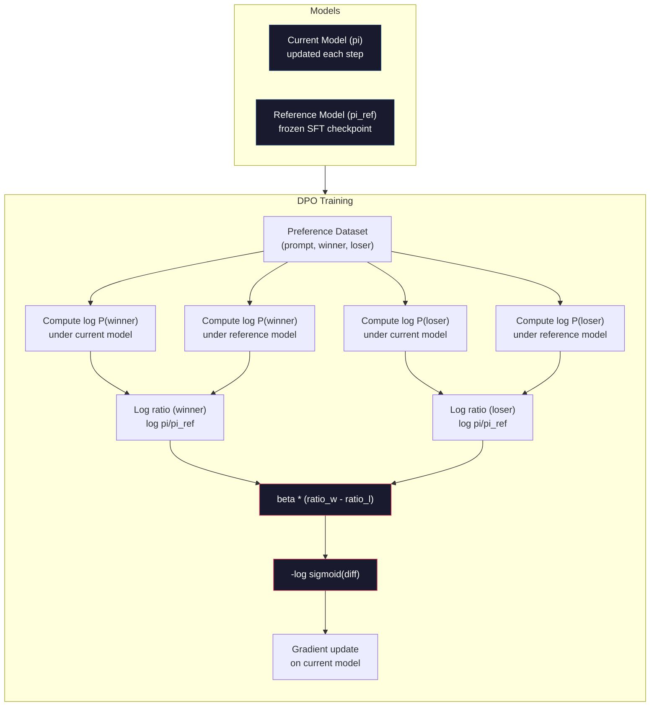

# DPO: 直接好み最適化

> RLHF は機能します。3 つのモデル (SFT、報酬モデル、ポリシー) をトレーニング、PPO の不安定性を管理、KL ペナルティをチューニングすることも必要とします。DPO はこれをすべてスキップできたらどうか、と聞きます。DPO は言語モデルを好みペアで直接最適化。報酬モデルがない。PPO がない。1 つのトレーニング ループ。同じ結果。

**タイプ:** Build
**言語:** Python (numpy とともに)
**前提条件:** Phase 10、レッスン 07 (RLHF)
**所要時間:** ~90分

## 学習目標

- 別個の報酬モデルなしで好みペアで言語モデルを直接最適化する DPO トレーニングを実装する
- DPO 損失関数を導出し、ポリシーのログ確率を通して implicit に報酬モデルを表す方法を説明する
- トレーニング安定性、計算コスト、必要なモデル数についての DPO 対 RLHF を比較する
- トレーニングされたポリシーが参照モデルからどのくらい逸脱するか制御する beta パラメータをチューニング

## 問題

レッスン 07 で RLHF パイプラインを構築しました。3 つのステージ。3 つのモデル。SFT モデル、報酬モデル、PPO で最適化されたポリシー モデル。報酬モデル 1 つは数千の人間の好みペアと別個のトレーニング ループが必要でした。PPO トレーニングは KL 係数、学習率、クリップ比率、エポック数の注意深いチューニングが必要でした。

実際には、PPO トレーニングは悪名高く不安定。小さなハイパーパラメータ変更はトレーニングの分散を引き起こす。報酬モデルは人間の好みの不完全なプロキシであり、ポリシーはその弱点を利用する方法を見つける。KL ペナルティは助けますが、自身のチューニング — 低すぎて報酬ハッキング、高すぎてモデルがほぼ学習しない が必要。

この複雑さは、InstructGPT が公開された後、ほとんどのオープンソース モデルが RLHF でさせた理由です。3 ステージ パイプラインは脆い。各ステージは独自の失敗モードを持ち、エラーは複合。

2023 年 5 月、Rafael Rafailov、Archit Sharma、Stanford の同僚が "Direct Preference Optimization: Your Language Model is Secretly a Reward Model" を公開。キー洞察: 別個の報酬モデルは必要がない。最適な報酬関数は言語モデルのトークン確率によって数学的に決定。報酬モデルを完全にスキップして、好みペアで言語モデルを直接最適化できます。

DPO は RLHF を 1 つの監督学習ステップに削減。1 つのモデル。1 つの損失関数。1 つのトレーニング ループ。強化学習がない。Zephyr-7B、DPO をスケールで使用する最初のモデルの 1 つ、複数のベンチマークでフル RLHF に合わせた、またはアウトパフォーム。Meta は DPO を Llama 3 のアライメント パイプラインの一部として使用。Anthropic は、彼らのアライメント研究で DPO スタイル メソッドを引用しました。

## コンセプト

### キー洞察

RLHF はこの目的を最適化:

```
maximize: E[R(x, y)] - beta * KL(pi || pi_ref)
```

ここで R は報酬モデル、pi はポリシー、pi_ref は参照モデル、beta は KL 係数。

DPO 論文はこの目的は閉形式の最適解を持つことを示しました。任意の報酬関数 R に対して、最適ポリシーは:

```
pi*(y | x) = pi_ref(y | x) * exp(R(x, y) / beta) / Z(x)
```

ここで Z(x) は正規化定数。整理:

```
R(x, y) = beta * log(pi*(y | x) / pi_ref(y | x)) + beta * log Z(x)
```

これはブレークスルー。報酬はポリシー モデルの確率と参照モデルの確率の観点から全く表現。別個の報酬モデルをトレーニングする必要がない。報酬は*implicit* ポリシーの確率比。

Bradley-Terry 好み モデルに代替:

```
P(y_w > y_l | x) = sigmoid(R(x, y_w) - R(x, y_l))
                  = sigmoid(beta * (log pi(y_w|x)/pi_ref(y_w|x) - log pi(y_l|x)/pi_ref(y_l|x)))
```

Z(x) 項はキャンセル、なぜなら両方応答は同じプロンプト x に条件. 残っているのは、ポリシー モデルのログ確率と参照モデルのログ確率、好みと棄却された応答のみの関数。

### DPO 損失

```
L_DPO = -log(sigmoid(beta * (log pi(y_w|x)/pi_ref(y_w|x) - log pi(y_l|x)/pi_ref(y_l|x))))
```

各ピースをアンパック:

- **y_w** = 好みの (ウィニング) 応答
- **y_l** = 棄却 (負け) 応答
- **x** = プロンプト
- **pi** = 現在のモデル (トレーニング中)
- **pi_ref** = 参照モデル (凍結 SFT チェックポイント)
- **beta** = 参照からの逸脱を制御する温度パラメータ (通常 0.1 から 0.5)

比 `log pi(y|x) / pi_ref(y|x)` はログ確率比。この比が正のとき、現在のモデルは応答 y に参照より高い確率を割り当てる。ネガティブなとき、現在のモデルより低い確率を割り当てます。

DPO 損失はモデルを、好みの応答のログ確率比を増加させ、棄却された応答を減らすよう推します。beta パラメータはモデルがどのくらい積極的に参照から逸脱できるか制御 — 小さい beta は大きい逸脱を許可、大きい beta はモデルを参照に閉じたままに。



### なぜ DPO はシンプルか

| 側面 | RLHF (PPO) | DPO |
|--------|-----------|-----|
| トレーニングするモデル | 3 (SFT + 報酬 + ポリシー) | 1 (ポリシーのみ) |
| トレーニング ループ | 3 (SFT、RM トレーニング、PPO) | 2 (SFT、DPO) |
| ハイパーパラメータ | lr、KL 係数、クリップ比率、RM lr、epochs x3 | lr、beta、epochs |
| 報酬モデル | 必要 (別個トレーニング) | Implicit モデル確率 |
| RL アルゴリズム | PPO (複雑、不安定) | 監督学習 (安定) |
| GPU メモリ | PPO 中に メモリで 3-4 モデル | 2 モデル (現在 + 参照) |
| トレーニング安定性 | ハイパーパラメータに敏感 | 堅牢、SFT に類似 |

DPO はトレーニング中メモリで 2 つのモデルが必要 — 現在のモデルと凍結された参照。RLHF はポリシー、参照、報酬モデルが必要、およびオプション価値関数ベースライン。70B モデルの場合、各コピーは FP16 で 140GB を取得。報酬モデルを排除する メモリ節約は substantial。

### DPO が RLHF を打つとき

**小さいデータセット。** 5,000-20,000 好みペアで、DPO は多くの場合 RLHF を合わせるか、超え。RLHF の報酬モデルは一般化するため十分なデータを必要 — 限定データ で、それは過度適合し、不信頼できる報酬信号を生産。DPO は報酬モデルを全く必要としないことでこの問題をバイパス。

**限定されたコンピューティング。** DPO はフル RLHF の大体 1/3 計算が必要 (3 つのループの代わりに 1 つ)。大きな GPU クラスタのないチームのため、これは実用的な選択。

**迅速な反復。** 10 異なる好みデータセットを試して、最高の結果をするもの を見たい? DPO は各実験を時間で実行できます。RLHF は各データセット の報酬モデルを再トレーニングが必要。

### RLHF が DPO を打つとき

**大規模トレーニング。** GPT-4 または Claude のスケールで、RLHF の別個の報酬モデルはより微妙な好みシグナルをキャプチャできます。報酬モデルは複雑な品質基準に適応する学習された損失関数として機能します。

**複雑な報酬シグナル。** "良い" が複数の次元 (有用性、無害性、正直性) を含む場合、報酬モデルはこのマルチオブジェクティブ トレードオフを学習できます。DPO は各好みペアを二進信号として扱う — 1 つはより良い、1 つはより悪い — 理由をモデル化しない。

**反復的アライメント。** RLHF パイプラインは現在のポリシーで新しい応答を生成、それらを人間にレート、オンライン ループで報酬モデルを再トレーニングできます。DPO は好みペアの固定データセットで機能。Constitutional AI (Anthropic のアプローチ) はこの RLHF の反復性質を広く使用。

### DPO の先へ: KTO、ORPO、SimPO

DPO は、簡略化された配置メソッドのファミリーをインスパイア。

**KTO (Kahneman-Tversky 最適化、2024):** ペアが必要ではありません。KTO は paired されていない feedback で機能 — "良い" または "悪い" として各応答をラベルするだけで、それを代替と比較することなく。これはデータ収集をドラマティック に簡略化。代わりに 2 つの応答を示して注釈者に "どちらが良い?" と尋ねるのの代わりに、1 つの応答を示して "これは良い?" と尋ねます。損失関数は見通し理論からの損失不在を適用: 悪い応答は良い応答が報酬より多く罰せられます。

**ORPO (Odds Ratio 好み最適化、2024):** SFT とアライメント を 1 つのトレーニング ステップに組み合わせ。最初に SFT して DPO をする代わりに、ORPO は SFT 損失に好みシグナルを含めるよう変更。損失は 2 つの項を持つ: 好みの応答での標準ネクスト トークン予測損失、加えて好みと棄却された応答の確率の間のギャップを増加させる odds 比項。1 つのトレーニング ループが、2 つの代わりに。

**SimPO (シンプル好み最適化、2024):** 参照モデル全く排除。凍結参照に対する対数確率比を計算する代わりに、SimPO は応答の平均 log-probability (長さで正規化) を implicit 報酬として使用。メモリを節約 (参照モデルが必要ない) とトレーニングを簡略化。長さ正規化はモデルが短い応答に好むのを防ぎ。

| メソッド | 年 | メモリ内のモデル | ペアが必要? | 参照が必要? | トレーニング ループ |
|--------|------|-----------------|-------------|-----------------|----------------|
| RLHF | 2022 | 3-4 | はい (RM のため) | はい | 3 |
| DPO | 2023 | 2 | はい | はい | 2 |
| KTO | 2024 | 2 | いいえ (paired されていない) | はい | 2 |
| ORPO | 2024 | 1 | はい | いいえ | 1 |
| SimPO | 2024 | 1 | はい | いいえ | 1 |

トレンドは明確: 各メソッドはもう 1 つの複雑さを排除。RLHF は報酬モデルと PPO が必要でした。DPO は両方を排除。KTO は paired データを排除。ORPO は別個 SFT ステージを排除。SimPO は参照モデルを排除。配置税 — ベース モデルから配置モデルに行くのに必要なコンピューティングと複雑さのコスト — 下り続け。

### 実 DPO デプロイ

**Zephyr-7B (HuggingFace、2023 年 10 月):** Mistral 7B ベース、UltraChat (200K 例) で SFT、その後 UltraFeedback (60K 好みペア) で DPO。MT-Bench で 6.47 をスコア — 時間で最高の 7B モデル。比較のため、Llama 2 Chat 70B は 6.86 をスコア、Zephyr は 10 倍のサイズのモデル内 6% になった DPO アライメントのみを使用します。

**Llama 3 (Meta、2024 年 4 月):** 初期 RLHF ステージの後 DPO を使用。組み合わせはそれが DPO と RLHF が相補的できることを示唆 — 広い配置のため RLHF、ターゲット細化のため DPO。

**Neural Magic / nm-chat (2024):** DPO を複数のオープンソース モデルに適用、一貫してSFT 単独ベースラインより配置ベンチマーク で 5-15% 改善を示す。

## 構築

### ステップ 1: 好みデータセット

RLHF と同じフォーマット — (プロンプト、好みの、棄却された) トリプル。DPO はこのデータを直接消費する。報酬モデルなし。

```python
import numpy as np
import sys
import os
sys.path.insert(0, os.path.join(os.path.dirname(__file__), "..", "..", "04-pre-training-mini-gpt", "code"))
from main import MiniGPT, LayerNorm, Embedding, TransformerBlock

PREFERENCE_DATA = [
    {
        "prompt": "What is the capital of France?",
        "preferred": "The capital of France is Paris.",
        "rejected": "France is a country in Europe. It has many cities. The capital is Paris. Paris is known for the Eiffel Tower.",
    },
    {
        "prompt": "Explain gravity in one sentence.",
        "preferred": "Gravity is the force that attracts objects with mass toward each other.",
        "rejected": "Gravity is something that makes things fall down when you drop them.",
    },
    {
        "prompt": "What is 15 times 7?",
        "preferred": "15 times 7 is 105.",
        "rejected": "Let me think about this. 15 times 7. Well, 10 times 7 is 70, and 5 times 7 is 35, so the answer might be around 105.",
    },
    {
        "prompt": "Name three programming languages.",
        "preferred": "Python, Rust, and TypeScript.",
        "rejected": "There are many programming languages. Some popular ones include various languages like Python and others.",
    },
    {
        "prompt": "What year did World War II end?",
        "preferred": "World War II ended in 1945.",
        "rejected": "World War II was a major global conflict. It involved many countries. The war ended in the mid-1940s, specifically in 1945.",
    },
    {
        "prompt": "Define machine learning.",
        "preferred": "Machine learning is a field where algorithms learn patterns from data to make predictions without being explicitly programmed.",
        "rejected": "Machine learning is a type of AI. AI stands for artificial intelligence. Machine learning uses data to learn.",
    },
]
```

### ステップ 2: シーケンス ログ確率

DPO 損失は応答の全 ログ確率を計算する必要。これはプロンプト + 応答シーケンス全体のモデルを実行し、各応答トークンのログ確率を合算することを意味。

```python
def tokenize_sequence(text, vocab_size=256):
    return [min(t, vocab_size - 1) for t in list(text.encode("utf-8"))]


def compute_sequence_log_prob(model, prompt_tokens, response_tokens, max_seq_len=128):
    full_sequence = prompt_tokens + response_tokens
    if len(full_sequence) > max_seq_len:
        full_sequence = full_sequence[:max_seq_len]

    if len(full_sequence) < 2:
        return 0.0

    input_ids = np.array(full_sequence[:-1]).reshape(1, -1)
    target_ids = np.array(full_sequence[1:])

    logits = model.forward(input_ids)
    logits = logits[0]

    max_logits = logits.max(axis=-1, keepdims=True)
    log_probs = logits - max_logits - np.log(
        np.exp(logits - max_logits).sum(axis=-1, keepdims=True)
    )

    prompt_len = len(prompt_tokens)
    response_start = max(0, prompt_len - 1)
    response_end = len(target_ids)

    if response_start >= response_end:
        return 0.0

    response_log_probs = log_probs[response_start:response_end, :]
    response_targets = target_ids[response_start:response_end]

    total_log_prob = 0.0
    for i, target in enumerate(response_targets):
        total_log_prob += response_log_probs[i, target]

    return total_log_prob
```

この関数は DPO の workhorse。各好みペア、それは 4 回実行: 好みの応答の現在のモデル、棄却された応答の現在のモデル、好みの応答の参照、棄却された応答の参照。それは RLHF の生成 + 報酬スコアリング + 価値推定 + PPO 更新対の 4 つの前方パスです。より単純、より速い、より安定。

### ステップ 3: DPO 損失

論文のコア、コード. 1 つの関数。1 つの損失。報酬モデルがない。

```python
def sigmoid(x):
    return np.where(
        x >= 0,
        1.0 / (1.0 + np.exp(-x)),
        np.exp(x) / (1.0 + np.exp(x))
    )


def dpo_loss(policy_logprob_preferred, policy_logprob_rejected,
             ref_logprob_preferred, ref_logprob_rejected, beta=0.1):
    preferred_ratio = policy_logprob_preferred - ref_logprob_preferred
    rejected_ratio = policy_logprob_rejected - ref_logprob_rejected

    logit = beta * (preferred_ratio - rejected_ratio)

    loss = -np.log(sigmoid(logit) + 1e-8)

    preferred_reward = beta * preferred_ratio
    rejected_reward = beta * rejected_ratio

    return loss, {
        "preferred_ratio": float(preferred_ratio),
        "rejected_ratio": float(rejected_ratio),
        "logit": float(logit),
        "implicit_preferred_reward": float(preferred_reward),
        "implicit_rejected_reward": float(rejected_reward),
        "reward_margin": float(preferred_reward - rejected_reward),
    }
```

`preferred_ratio` と `rejected_ratio` は DPO 導出からのログ確率比。現在のモデルが好みの応答により高い確率を割り当てるとき (参照に相対的) かつ棄却された応答により低い確率、logit は正そして損失は低い。トレーニング信号はモデルを正確こう方向に推す。

`implicit_preferred_reward` と `implicit_rejected_reward` は DPO 損失が implicit に割り当てる報酬。トレーニングがいているかを検証するためそれらを抽出できる — 好みと棄却報酬の間マージンはトレーニング全体で増加する必要があります。

### ステップ 4: DPO トレーニング ループ

標準監督トレーニング ループ。PPO がない。報酬モデルがない。ただ前方パスと勾配更新。

```python
def copy_model_weights(source, target):
    target.embedding.token_embed = source.embedding.token_embed.copy()
    target.embedding.pos_embed = source.embedding.pos_embed.copy()
    target.ln_f.gamma = source.ln_f.gamma.copy()
    target.ln_f.beta = source.ln_f.beta.copy()
    for s_block, t_block in zip(source.blocks, target.blocks):
        t_block.attn.W_q = s_block.attn.W_q.copy()
        t_block.attn.W_k = s_block.attn.W_k.copy()
        t_block.attn.W_v = s_block.attn.W_v.copy()
        t_block.attn.W_out = s_block.attn.W_out.copy()
        t_block.ffn.W1 = s_block.ffn.W1.copy()
        t_block.ffn.W2 = s_block.ffn.W2.copy()
        t_block.ffn.b1 = s_block.ffn.b1.copy()
        t_block.ffn.b2 = s_block.ffn.b2.copy()
        t_block.ln1.gamma = s_block.ln1.gamma.copy()
        t_block.ln1.beta = s_block.ln1.beta.copy()
        t_block.ln2.gamma = s_block.ln2.gamma.copy()
        t_block.ln2.beta = s_block.ln2.beta.copy()


def dpo_train(policy_model, reference_model, preference_data,
              num_epochs=5, lr=5e-6, beta=0.1, max_seq_len=128):
    print(f"DPO Training: {len(preference_data)} pairs, {num_epochs} epochs, "
          f"lr={lr}, beta={beta}")
    print()

    losses = []
    margins = []

    for epoch in range(num_epochs):
        epoch_loss = 0.0
        epoch_margin = 0.0
        num_examples = 0

        indices = np.random.permutation(len(preference_data))

        for idx in indices:
            pair = preference_data[idx]

            prompt_tokens = tokenize_sequence(pair["prompt"])
            preferred_tokens = tokenize_sequence(pair["preferred"])
            rejected_tokens = tokenize_sequence(pair["rejected"])

            pi_logprob_w = compute_sequence_log_prob(
                policy_model, prompt_tokens, preferred_tokens, max_seq_len
            )
            pi_logprob_l = compute_sequence_log_prob(
                policy_model, prompt_tokens, rejected_tokens, max_seq_len
            )
            ref_logprob_w = compute_sequence_log_prob(
                reference_model, prompt_tokens, preferred_tokens, max_seq_len
            )
            ref_logprob_l = compute_sequence_log_prob(
                reference_model, prompt_tokens, rejected_tokens, max_seq_len
            )

            loss, metrics = dpo_loss(
                pi_logprob_w, pi_logprob_l,
                ref_logprob_w, ref_logprob_l, beta
            )

            update_direction = 1.0 if metrics["logit"] < 0 else -0.1
            for block in policy_model.blocks:
                block.ffn.W1 += lr * update_direction * np.random.randn(*block.ffn.W1.shape) * 0.01
                block.ffn.W2 += lr * update_direction * np.random.randn(*block.ffn.W2.shape) * 0.01

            epoch_loss += loss
            epoch_margin += metrics["reward_margin"]
            num_examples += 1
            losses.append(float(loss))
            margins.append(metrics["reward_margin"])

        avg_loss = epoch_loss / max(num_examples, 1)
        avg_margin = epoch_margin / max(num_examples, 1)

        print(f"  Epoch {epoch + 1}/{num_epochs} | Loss: {avg_loss:.4f} | "
              f"Avg Margin: {avg_margin:.4f}")

    return policy_model, losses, margins
```

トレーニング ループは RLHF に比較して爽快にシンプル。各好みペア: 4 つのログ確率を計算 (2 つのモデル、2 つの応答)、DPO 損失に接続、勾配を計算、ポリシーを更新。生成ステップがない。報酬モデル推論がない。アドバンテージ推定がない。クリップがない。

### ステップ 5: DPO 対 RLHF を比較

implicit 報酬マージンと対数確率シフトを測定して、レッスン 07 の RLHF モデルに対して DPO を比較。

```python
def evaluate_preference_accuracy(model, reference_model, preference_data, beta=0.1, max_seq_len=128):
    correct = 0
    total = 0

    for pair in preference_data:
        prompt_tokens = tokenize_sequence(pair["prompt"])
        preferred_tokens = tokenize_sequence(pair["preferred"])
        rejected_tokens = tokenize_sequence(pair["rejected"])

        pi_w = compute_sequence_log_prob(model, prompt_tokens, preferred_tokens, max_seq_len)
        pi_l = compute_sequence_log_prob(model, prompt_tokens, rejected_tokens, max_seq_len)
        ref_w = compute_sequence_log_prob(reference_model, prompt_tokens, preferred_tokens, max_seq_len)
        ref_l = compute_sequence_log_prob(reference_model, prompt_tokens, rejected_tokens, max_seq_len)

        preferred_reward = beta * (pi_w - ref_w)
        rejected_reward = beta * (pi_l - ref_l)

        if preferred_reward > rejected_reward:
            correct += 1
        total += 1

    return correct / max(total, 1)


def analyze_implicit_rewards(model, reference_model, preference_data, beta=0.1, max_seq_len=128):
    print("Implicit Reward Analysis:")
    print("-" * 65)
    print(f"  {'Prompt':<30} {'Pref Reward':>12} {'Rej Reward':>12} {'Margin':>10}")
    print("  " + "-" * 60)

    for pair in preference_data:
        prompt_tokens = tokenize_sequence(pair["prompt"])
        preferred_tokens = tokenize_sequence(pair["preferred"])
        rejected_tokens = tokenize_sequence(pair["rejected"])

        pi_w = compute_sequence_log_prob(model, prompt_tokens, preferred_tokens, max_seq_len)
        pi_l = compute_sequence_log_prob(model, prompt_tokens, rejected_tokens, max_seq_len)
        ref_w = compute_sequence_log_prob(reference_model, prompt_tokens, preferred_tokens, max_seq_len)
        ref_l = compute_sequence_log_prob(reference_model, prompt_tokens, rejected_tokens, max_seq_len)

        pref_reward = beta * (pi_w - ref_w)
        rej_reward = beta * (pi_l - ref_l)
        margin = pref_reward - rej_reward

        truncated = pair["prompt"][:28] + ".." if len(pair["prompt"]) > 30 else pair["prompt"]
        print(f"  {truncated:<30} {pref_reward:>12.4f} {rej_reward:>12.4f} {margin:>10.4f}")

    print()
```

### ステップ 6: Beta 感度分析

Beta パラメータはRLHF の KL 係数の DPO の等価物。制御する参照から逸脱するモデル がどのくらい遠く。この実験はその効果を示します。

```python
def beta_sensitivity_analysis(sft_model, preference_data, betas, max_seq_len=128):
    print("Beta Sensitivity Analysis")
    print("-" * 60)
    print(f"  {'Beta':>8} {'Final Loss':>12} {'Final Margin':>14} {'Accuracy':>10}")
    print("  " + "-" * 55)

    results = []

    for beta in betas:
        policy = MiniGPT(
            vocab_size=256, embed_dim=128, num_heads=4,
            num_layers=4, max_seq_len=max_seq_len, ff_dim=512
        )
        reference = MiniGPT(
            vocab_size=256, embed_dim=128, num_heads=4,
            num_layers=4, max_seq_len=max_seq_len, ff_dim=512
        )
        copy_model_weights(sft_model, policy)
        copy_model_weights(sft_model, reference)

        policy, losses, margins_list = dpo_train(
            policy, reference, preference_data,
            num_epochs=3, lr=5e-6, beta=beta, max_seq_len=max_seq_len
        )

        accuracy = evaluate_preference_accuracy(
            policy, reference, preference_data, beta, max_seq_len
        )

        final_loss = losses[-1] if losses else 0
        final_margin = margins_list[-1] if margins_list else 0

        print(f"  {beta:>8.3f} {final_loss:>12.4f} {final_margin:>14.4f} {accuracy:>10.1%}")
        results.append({
            "beta": beta,
            "final_loss": final_loss,
            "final_margin": final_margin,
            "accuracy": accuracy,
        })

        print()

    return results
```

小さい beta (0.01) はモデル に参照から自由に逸脱することを許可 — 速い学習が代償削減のリスク。大きい beta (1.0) はモデルを参照に閉じたままに — 安定だがスロー学習。ほとんどのアプリケーション の甘い点は 0.1 から 0.3 です。

## 使用

### フル DPO パイプライン デモ

```python
if __name__ == "__main__":
    np.random.seed(42)

    print("=" * 70)
    print("DPO: DIRECT PREFERENCE OPTIMIZATION")
    print("=" * 70)
    print()

    print("STEP 1: Initialize SFT Model (from Lesson 06)")
    print("-" * 50)
    sft_model = MiniGPT(
        vocab_size=256, embed_dim=128, num_heads=4,
        num_layers=4, max_seq_len=128, ff_dim=512
    )
    print(f"  Parameters: {sft_model.count_parameters():,}")
    print()

    print("STEP 2: DPO Training")
    print("-" * 50)

    policy_model = MiniGPT(
        vocab_size=256, embed_dim=128, num_heads=4,
        num_layers=4, max_seq_len=128, ff_dim=512
    )
    reference_model = MiniGPT(
        vocab_size=256, embed_dim=128, num_heads=4,
        num_layers=4, max_seq_len=128, ff_dim=512
    )
    copy_model_weights(sft_model, policy_model)
    copy_model_weights(sft_model, reference_model)

    policy_model, losses, margins = dpo_train(
        policy_model, reference_model, PREFERENCE_DATA,
        num_epochs=5, lr=5e-6, beta=0.1
    )
    print()

    print("=" * 70)
    print("STEP 3: Evaluate")
    print("=" * 70)
    print()

    pre_accuracy = evaluate_preference_accuracy(
        sft_model, reference_model, PREFERENCE_DATA, beta=0.1
    )
    post_accuracy = evaluate_preference_accuracy(
        policy_model, reference_model, PREFERENCE_DATA, beta=0.1
    )

    print(f"  Preference accuracy (pre-DPO):  {pre_accuracy:.1%}")
    print(f"  Preference accuracy (post-DPO): {post_accuracy:.1%}")
    print()

    analyze_implicit_rewards(policy_model, reference_model, PREFERENCE_DATA, beta=0.1)

    print("=" * 70)
    print("STEP 4: Training Dynamics")
    print("=" * 70)
    print()

    if losses:
        print("  Loss curve:")
        window = max(1, len(losses) // 5)
        for i in range(0, len(losses), window):
            chunk = losses[i:i + window]
            avg = sum(chunk) / len(chunk)
            print(f"    Steps {i:3d}-{i + len(chunk) - 1:3d}: loss = {avg:.4f}")
        print()

    if margins:
        print("  Reward margin curve:")
        window = max(1, len(margins) // 5)
        for i in range(0, len(margins), window):
            chunk = margins[i:i + window]
            avg = sum(chunk) / len(chunk)
            print(f"    Steps {i:3d}-{i + len(chunk) - 1:3d}: margin = {avg:.4f}")
        print()

    print("=" * 70)
    print("STEP 5: Beta Sensitivity")
    print("=" * 70)
    print()

    beta_results = beta_sensitivity_analysis(
        sft_model, PREFERENCE_DATA, betas=[0.01, 0.1, 0.3, 1.0]
    )

    print("=" * 70)
    print("DPO vs RLHF COMPARISON")
    print("=" * 70)
    print()
    print("  DPO advantages:")
    print("    - 1 training loop (vs 3 for RLHF)")
    print("    - 2 models in memory (vs 3-4 for RLHF)")
    print("    - Supervised learning (vs RL, more stable)")
    print("    - No reward model to train or maintain")
    print()
    print("  RLHF advantages:")
    print("    - Separate reward model captures complex preferences")
    print("    - Online learning: generate, rate, retrain")
    print("    - Better for multi-objective alignment")
    print("    - Proven at largest scales (GPT-4, Claude)")
    print()
    print("  Practical guidance:")
    print("    - Start with DPO. It's simpler and often sufficient.")
    print("    - Switch to RLHF if DPO plateaus on your eval metrics.")
    print("    - Many production systems use both: RLHF first, DPO to refine.")
```

## 配信

このレッスンは `outputs/prompt-alignment-method-selector.md` を生成 — 正しい配置メソッドを選ぶのに助け (SFT、RLHF、DPO、KTO、ORPO、SimPO) をするプロンプト。データ利用可能性、コンピューティング予算、配置目標が与えられたら、メソッドを推奨し、トレーニング計画を推奨。

## 演習

1. KTO を実装 (Kahneman-Tversky 最適化)。KTO は、対になっていない— ただ各応答を "良い" または "悪い" としてラベル。良い応答の損失は `-log(sigmoid(beta * log_ratio))`、悪い応答は `-log(1 - sigmoid(beta * log_ratio))` で損失不在乗数 (通常 1.5x) が悪い応答損失。同じデータ (好みを "良い"、棄却を "悪い" として独立して扱う) でトレーニングし、正確度を DPO に対して比較。

2. 長さ正規化 DPO を実装。生のログ確率の代わりに、応答トークン数で分割: `normalized_logprob = total_logprob / num_tokens`。これはモデルが短い応答を好むのを防ぎ (より高い合計 log-prob を持つ)。正規化なしで implicit 報酬マージンを比較。

3. ORPO スタイルの結合損失を構築。DPO 損失に標準ネクスト トークン予測損失を追加: `L = L_sft(preferred) + alpha * L_dpo`。Alpha 値 0.1、0.5、1.0 を試します。結合損失は、指示に従う (SFT 項から) と優れた応答を好むようにしながら (DPO 項から)、別個 SFT ステージの必要を排除するモデルを生成する必要があります。

4. 反復的 DPO を実装。3 エポック DPO を実行、その後、トレーニングされたモデルから新しい応答を生成し、元の好みの応答とペアにして新しい好みペアとし、もう一度 DPO を実行。2 ラウンドのこの "self-play" プロセス。ラウンド 1 とラウンド 2 の後、反復細化を助けるかどうかを見るため好みの正確度を比較。

5. 異なる参照モデルで DPO を比較。SFT チェックポイントを参照として使う代わりに、試してください: (a) ベース モデル (事前 SFT)、(b) DPO の epoch 1 からのチェックポイント、(c) ポリシー モデルの指数移動平均。高い好み正確度を生成し、最も安定した訓練曲線を持つ参照を報告。

## キーワード

| 用語 | 人々が言う | 実際の意味 |
|------|----------------|----------------------|
| DPO | "RL なしの RLHF" | 直接好み最適化: 好みペアで言語モデルを直接最適化する監督学習アルゴリズム、報酬モデルと PPO をバイパス |
| Implicit 報酬 | "報酬はモデルのなか" | 報酬関数はポリシーと参照モデルのログ確率比で決定 — 別個の報酬モデルは不要 |
| Beta (DPO) | "温度" | ポリシーが参照モデルから逸脱する程度を制御 — 小さい beta は大きい逸脱を許可、大きい beta はモデルを接近させたままに |
| ログ確率比 | "モデルがどのくらい変わったか" | log pi(y\|x) - log pi_ref(y\|x) — 正は現在のモデルが参照より高い確率を割り当てることを意味 |
| 参照モデル | "凍結 SFT チェックポイント" | SFT モデルのコピー、重みはけれど変わらない — 確率比計算のアンカーとして機能 |
| KTO | "ペア なしの DPO" | Kahneman-Tversky 最適化: ペアを必要とする代わりに "好き" または "嫌い" ラベルで機能 |
| ORPO | "1 ステップのアライメント" | Odds 比好み最適化: SFT とアライメント を単一トレーニング ループに組み合わせて、SFT 損失に好みの項を追加することによる |
| SimPO | "参照が不要" | シンプル好み最適化: 長さ正規化平均 log-probability を implicit 報酬として使用して参照モデルを排除 |
| 配置税 | "モデルを安全にするためのコスト" | ベース モデルから配置モデルに行くのに必要なコンピューティング、データ、複雑さ — DPO はこれを著しく削減 |

## 参考文献

- [Rafailov et al., 2023 -- "Direct Preference Optimization: Your Language Model is Secretly a Reward Model"](https://arxiv.org/abs/2305.18290) -- RLHF を監督学習に簡略化した DPO 論文
- [Tunstall et al., 2023 -- "Zephyr: Direct Distillation of LM Alignment"](https://arxiv.org/abs/2310.16944) -- Zephyr-7B、DPO が UltraFeedback でベンチマーク で RLHF に合わせることを示す
- [Ethayarajh et al., 2024 -- "KTO: Model Alignment as Prospect Theoretic Optimization"](https://arxiv.org/abs/2402.01306) -- ペア好みの必要を排除
- [Hong et al., 2024 -- "ORPO: Monolithic Preference Optimization without Reference Model"](https://arxiv.org/abs/2403.07691) -- 1 ステップでの SFT とアライメント を組み合わせる
- [Meng et al., 2024 -- "SimPO: Simple Preference Optimization with a Reference-Free Reward"](https://arxiv.org/abs/2405.14734) -- 参照モデル全く排除
- [Llama 3 Technical Report](https://arxiv.org/abs/2407.21783) -- RLHF と DPO を組み合わせたメタの配置パイプライン
