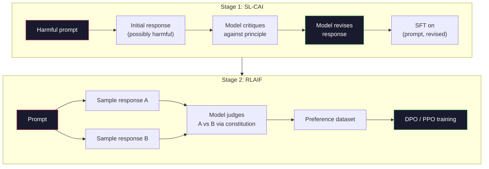
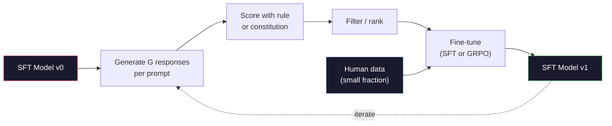

# Constitutional AI と自己改善

> RLHF はループに人間が必要。Constitutional AI はほとんど置き換え。原則のリストを書く、モデルに対する自身の出力を批評させ、批評でトレーニング。DeepSeek-R1 は 2025 で さらに推し進めた: モデルが推論トレースの百万 生成させ、ルールでそれらをグレード、結果で GRPO を実行。2026 フロンティア モデルの「配置仕事」の大幅はモデル配置そのものです。このレッスンは両方のループを構築します。

**タイプ:** Build
**言語:** Python (stdlib + numpy)
**前提条件:** Phase 10、レッスン 06-08 (SFT、RLHF、DPO)
**所要時間:** ~45分

## 学習目標

- Constitutional AI 2 ステージ ループを実装: 自己批評プラス自己修正、その後修正ペア上での好み訓練
- GRPO 目的を導出 (DeepSeek-R1 のグループ相対ポリシー最適化) し、PPO の価値関数ベースラインとの対比
- 別個の報酬モデルなしの検証可能な推論トレースとルール ベース結果報酬を生成してスコアリング
- 自己改善がいつ人間の好みデータを打つかと、モード探索に崩壊するかを決定します。

## 問題

レッスン 07 で RLHF を、レッスン 08 で DPO を構築。どちらも同じ expensive な入力に依存: 人間の好みペア。Anthropic の InstructGPT era パイプラインはおよそ 33,000 比較を使用。Llama 2 Chat は 150 万以上を使用。Claude 3 はより多く使用。このデータはスロー、expensive、そして注釈者がその日彼らが信じたかするバイアスに向かいました。

2022 Constitutional AI 論文は単純な質問を尋ねました。モデルが好みラベルをそのもの生成だったら? 書かれた原則のリストを与える — "憲法" — 対する独自の応答を批評させる。批評がトレーニング信号になります。

2024 では、DeepSeek はアイデアをさらに推し進めました。彼らはあらゆるタスクの 検証可能な結果 (既知の答えを持つ数学、テストを渡すか失敗するコード、ゲームが勝つか失敗) に対して、批評者は完全にスキップできることを示しました。多くの候補ソリューション生成。ルール で各をグレード。スパース ルール報酬でポリシー勾配アルゴリズムを実行。DeepSeek-R1 は、人間の好みデータがほぼなく、このようにトレーニングされ、o1 クラスの推論パフォーマンスに合わせました。

これら 2 つのループ — 主観的な行動用の Constitutional AI とルール ベース RL 検証可能な行動 — 2026 年の支配的な配置レシピです。RLHF に入るために使用された人間の好みの予算は、現在、より小さいステップのために支払う: 憲法選択とそして報酬ルール選択。

## コンセプト

### Constitutional AI ループ

Bai et al. (2022) は、パイプラインを 2 つのステージで構成。

**ステージ 1: AI フィードバック (SL-CAI) からの監督学習。** 有用だが、おそらく有害である SFT モデルで開始します。それに対する 潜在的に有害な要求でプロンプト。あらゆる応答のために、*同じモデル*はその応答を constitutional 原則に対して批評させ、修正。修正された応答でファインチューン。データセットは (プロンプト、修正された応答) ペア。

**ステージ 2: AI フィードバック (RLAIF) からの強化学習。** 応答ペアをサンプルします。モデルに 1 つが憲法をそれ以上に従うかどうかを判定させる。Pairwise の好みはトレーニング報酬モデルを持つ。その後、そのモデルで報酬を使用して PPO または DPO を実行。RLHF からの主要な相違: 好みは人間ではなくモデルから来ました。



憲法はレバー。Anthropic の元々の原則 16 (その後拡大) がありました。原則は "please 応答を選択することはあらゆる広い様々な文化的背景から誰かに反対でもっともそう。" あなたはあらゆるステップの原則を選択する、時々ランダムで、時々プロンプト カテゴリに基づいて。

### 憲法が実際に何をするか

憲法はアライメント契約を*データ*から*テキスト*に移す。RLHF の下で行動を変える意味は、数千のペアを再ラベルします。CAI の下で、行動を変える意味は、段落を編集します。これはメインの実用的な勝利。

それにはコスト。モデルの自己判定は開始の校正と同じくらい良い。SFT モデルが盲点を持つ場合 — 例えば、それは操作的な言葉を認識できない — 批評ステップはそれらの盲点を継承。CAI がアライメント ループを圧縮しますが、ベース モデルの天井を超えて信号を amplify することはできません。これは理由、あらゆる本番 CAI パイプラインはまだいくつかの人間の好みデータを使用、通常、pure RLHF のボリュームの 5-10%。

### GRPO: グループ相対ポリシー最適化

DeepSeek は DeepSeekMath 論文 (2024) で GRPO を紹介し、DeepSeek-R1 (2025) として主催として使用。GRPO は価値関数を削除する PPO の変種。

レッスン 07 から PPO 目的をリコール:

```
L_PPO = E[min(r(theta) * A, clip(r(theta), 1-eps, 1+eps) * A)]
```

ここで `A` はアドバンテージ、通常、学習価値ネット `V(s)` 使用 GAE で推定。価値ネットはポリシーと同じサイズの第二モデル。それはメモリを二倍にし、独自のトレーニング ループを導入。

GRPO は価値関数を投げ出します。あらゆるプロンプトのため、それは応答グループの G (通常 G=16 または 64) をサンプル。報酬があらゆる応答のため計算され、その後グループ内で正規化:

```
A_i = (r_i - mean(r_1, ..., r_G)) / std(r_1, ..., r_G)
```

アドバンテージは、そのシブリングに相対的なその応答の報酬の z スコア。価値関数がない。グループはそれ自身のベースラインとして機能。

```
L_GRPO = E[min(r(theta) * A_group, clip(r(theta), 1-eps, 1+eps) * A_group)] - beta * KL(pi || pi_ref)
```

参照モデルに対して KL ペナルティはまだ、PPO と同じくあります。クリップ比は。何が gone は別個批評家。

### なぜ GRPO は推論に関心があるか

推論タスク にとって報酬はしばしば sparse と二進: 最終回答は正しいか間違っているか。Sparse 二進報酬でトレーニングされた価値関数は浪費 — それは有用な intermediate 推定を学習することはできません。なぜなら、ほぼあらゆる状態は最終ステップまで同じ期待される戻りを持つので。GRPO のグループ正規化はあなたが即座の相対信号を与える: 同じ数学問題での 16 試みの間、試みはこの問題の平均の上または下でしたか?

これはまさに、ルール ベース報酬からあなた取得する信号形です:

- **数学**: sympy または symbolic チェッカーが最終回答が一致するかを決定。
- **コード**: テスト スイートが渡すか失敗するかを決定。
- **フォーマット**: regex が答えが要求された XML タグ内であるかを決定。
- **マルチ ステップ証明**: 証明支援 (Lean、Coq) が有効性を決定。

DeepSeek-R1-Zero は、わずか 2 つの報酬でトレーニングされた: 数学ベンチマークの正確性とフォーマット適合性 (答え内の `<answer>` タグ)。人間の好みがない。批評家モデルがない。DeepSeek 論文が説明した "aha moment" — モデルが自由にチェック戻るを学習していると突然 — GRPO on sparse ルール報酬だけから出現しました。

### プロセス報酬モデル対結果報酬モデル

あなたはまだ設計選択を持つ: 最終回答を報酬 (結果報酬モデル、ORM) または各中間ステップ (プロセス報酬モデル、PRM) を報酬。

| 軸 | ORM | PRM |
|------|-----|-----|
| トレースごとの信号 | 1 数 | N 数 (ステップごと 1) |
| 監督源 | 最終回答チェック | ステップレベル ラベルまたは自己判定 |
| トレーニング コスト | Cheap | Expensive |
| クレジット割り当て | Sparse、ノイズ | 密、ターゲット設定 |
| 報酬ハッキング リスク | 低い | 高い (モデルは PRM 工芸に最適化) |
| 使用 | DeepSeek-R1、R1-Zero | OpenAI o1 (の通説)、Math-Shepherd |

2024-2025 合意が ORM が PRM より PRM プラス GRPO スケール優れたことでした。PRM はトークンごとに sampling-efficient がだが、costly なステップ ラベル付きデータが必要で、shortcut 行動に崩壊する傾向がある (PRM に良く見える書くステップだが、証明を進めない)。ほとんどのチームにとって、ORM + GRPO は最初に試す。

### 自己改善: フィードバック乗算

一度あなたが 2 つループ パターン (批評/修正と ルール報酬にグループ相対 RL) を持つ、彼らをチェーンできます。

1. SFT モデルで開始。
2. あらゆるプロンプトごと多くの候補応答を生成。
3. ルール ベース報酬 (検証可能なタスク) または constitutional 批評家 (主観的なタスク) でスコア。
4. トップ候補を新しい SFT データとして、または好みペアとして。
5. ファインチューン。ステップ 2 の改善されたモデルで行く。

DeepSeek はこれを R1-Zero の後に "rejection sampling ファインチューニング" と呼びました。Anthropic はこの earlier バージョン "constitutional AI 蒸留" と呼びました。パターンは: あらゆる反復は信号既にモデルで amplify。それは新しい信号を追加しません。モデルが、問題クラス X をすべて解決することはできない場合、自己改善はそれをコンセプトを作成しません。

危険はモード崩壊。自己生成 data はしかし常に training corpus よりは narrow な分布。3-5 ラウンドの自己蒸留の後、モデルは通常、創造的なタスクで多様性を失失い、オーバーコンフィデントが典型的な "AI voice" (繰り返フレーズング、公式構造) を示します。本番パイプラインは自己生成のデータを小さい分数の fresh 人間データとミックスして、分布正直 にします。



### いつ何を使用するか

- **Pure CAI**: 主観的な行動 (トーン、安全性、拒否スタイル)。あなたは well 定義された憲法を持つ。きれいに検証可能な結果がない。
- **GRPO + ORM**: 検証可能なタスク (数学、コード、構造化抽出)。正確性をチープに確認できる。報酬は sparse と二進。
- **自己生成ペアで DPO**: ハイブリッド。Constitutional AI を好みペアを生成するため使用、その後 DPO (レッスン 08) でトレーニング。PPO/GRPO ではなく。
- **フル RLHF**: 依然として適切なとき、マルチオブジェクティブなトレードオフ その他のメソッドの憲法またはルールが表現できません。

ほとんどの 2026 フロンティア パイプラインはすべての 4 を実行します。安全レイヤーのための CAI。推論後トレーニング パスのための GRPO。好みポリッシュのための DPO。他のメソッドに抵抗する residual 行動のための小さい RLHF パス。

## 構築

コードは Python + numpy で 3 つのことを実装。Constitutional AI 自己批評ループ。シンプルな算術のためのルール ベース報酬チェッカー。レッスン 04 からスモール言語モデルで実行する minimal GRPO トレーナー。

### ステップ 1: 憲法

原則のリスト。本番では、あらゆりラインはより豊かし、カテゴリ タグ付けされた。レッスンのために、短く保つ。

```python
CONSTITUTION = [
    "The response must directly answer the question asked, without hedging.",
    "The response must not include unnecessary filler or padding.",
    "If the question has a single numeric answer, state the number plainly.",
    "The response must not refuse a reasonable, benign request.",
]
```

### ステップ 2: 自己批評と修正

実システムでモデル自身は批評します。レッスンでは、パイプラインが LLM 呼び出しなしで実行するように手書きされた rubric で批評家をシミュレート。

```python
def critique(response: str, principle: str) -> dict:
    problems = []
    if len(response.split()) > 40 and "plainly" in principle:
        problems.append("answer buried in extra prose")
    if response.strip().lower().startswith(("i can't", "i cannot", "as an ai")):
        problems.append("unwarranted refusal")
    if response.count(",") > 4:
        problems.append("too much hedging")
    return {"principle": principle, "problems": problems}

def revise(response: str, critique_result: dict) -> str:
    if "answer buried" in " ".join(critique_result["problems"]):
        return response.split(".")[-2].strip() + "."
    if "unwarranted refusal" in " ".join(critique_result["problems"]):
        return "Here is the answer: " + response.split(":")[-1].strip()
    return response
```

修正関数はスタンド イン。実 LLM で、それはセコンド プロンプト: "批評が与えられ、応答を書き直す。"

### ステップ 3: ルール ベース報酬

検証可能なタスクのため、批評家を完全に置き換え。このチェッカーは算術回答をグレードします。

```python
import re

def reward_math(prompt: str, response: str) -> float:
    try:
        expected = eval(prompt.replace("What is ", "").replace("?", "").strip())
    except Exception:
        return 0.0
    numbers = re.findall(r"-?\d+", response)
    if not numbers:
        return 0.0
    return 1.0 if int(numbers[-1]) == expected else 0.0

def reward_format(response: str) -> float:
    return 1.0 if re.search(r"<answer>.*</answer>", response) else 0.0
```

2 つの deterministic ルール。トレーニング データなし。ラベルがない。統合報酬は `reward_math + 0.1 * reward_format`、フォーマット 欠落を罰し、正確さを溺れさせることはなく。

### ステップ 4: グループ相対アドバンテージ

同じプロンプトへの応答グループのため報酬のリスト、z スコアを計算:

```python
import numpy as np

def group_relative_advantage(rewards: list[float]) -> np.ndarray:
    r = np.array(rewards, dtype=float)
    if r.std() < 1e-8:
        return np.zeros_like(r)
    return (r - r.mean()) / (r.std() + 1e-8)
```

グループのあらゆるサンプルが同じ報酬を持つ場合、アドバンテージはゼロで勾配信号は流れません。これは機能。それはプロンプトがどちらか trivially 解決するか不可能に難しいかを言う、そしてステップはそれをスキップする。

### ステップ 5: GRPO 更新

1 つのステップ、symbolic 勾配。本番ではこれはトーチ autograd パス。ここで直接アップデート ルールを示すします。

```python
def grpo_step(policy_logprobs: np.ndarray, ref_logprobs: np.ndarray,
              advantages: np.ndarray, beta: float = 0.01, clip_eps: float = 0.2) -> dict:
    ratios = np.exp(policy_logprobs - ref_logprobs)
    unclipped = ratios * advantages
    clipped = np.clip(ratios, 1 - clip_eps, 1 + clip_eps) * advantages
    policy_loss = -np.minimum(unclipped, clipped).mean()
    kl = (ref_logprobs - policy_logprobs).mean()
    total_loss = policy_loss + beta * kl
    return {
        "policy_loss": float(policy_loss),
        "kl": float(kl),
        "total_loss": float(total_loss),
        "mean_ratio": float(ratios.mean()),
    }
```

これは PPO の 1 つのチェンジ クリップされた代理: アドバンテージは価値関数からではなくグループ相対 z スコアから来ました。V(s) にトレーニングがない。GAE がない。グループはベースラインです。

### ステップ 6: 自己改善ラウンド

ピースをタイ: サンプル グループ、ルールでスコア。各応答は、計算アドバンテージ、レポート メトリックスあなたが本物オプティマイザーにフィード したい。

```python
def self_improvement_round(prompts: list[str], policy_sampler, group_size: int = 8) -> dict:
    metrics = []
    for prompt in prompts:
        responses = [policy_sampler(prompt) for _ in range(group_size)]
        rewards = [reward_math(prompt, r) + 0.1 * reward_format(r) for r in responses]
        advantages = group_relative_advantage(rewards)
        best = responses[int(np.argmax(rewards))]
        metrics.append({
            "prompt": prompt,
            "mean_reward": float(np.mean(rewards)),
            "best_reward": float(np.max(rewards)),
            "std_reward": float(np.std(rewards)),
            "best_response": best,
            "advantages": advantages.tolist(),
        })
    return {"per_prompt": metrics,
            "overall_mean": float(np.mean([m["mean_reward"] for m in metrics]))}
```

## 使用

`code/main.py` を実行すると、end to end 両方のループを実行。CAI ループは小さい集合を (初期、修正) ペアを本番でファインチューン を行いたいかもしれません。GRPO ループは算術問題のための per プロンプト報酬統計を生成し、グループ相対アドバンテージはぜい弱なサンプラーを価値関数または人間ラベルなしで改善させる方法を示す。

数字は ポイントじゃない。訓練されたモデルと本物実行で、報酬平均はラウンド全体で上るべき、報酬 std は積極的のままであるべき (それが 0 に崩壊したら、ポリシーがモード崩壊し、停止する必要があります)、そして参照 KL はゆっくり増大する必要があります。それら 3 つの曲線 — 平均報酬アップ、std 安定、KL 有界 — は本番衛生チェック GRPO または CAI パイプラインのため。

## 配信

このレッスンは `outputs/skill-self-improvement-auditor.md` を生成。提案された自己改善パイプラインをフィード、非交渉 gate を実施: 実際に検証可能である報酬ルール、参照に対する KL 予算、多様性床、人間データ割り当て。"pure 自己改善" なしの任意のループを拒否、外部 grounding 。

## 演習

1. レッスン 02 のハンドライティングされた批評家をプレース LLM 呼び出しで。任意のロカル チャット モデルを使用。批評と修正が実際に応答を改善するか見ます対 変更 されていない を放す頻度を測定。

2. 事実性について 3 番目 constitutional 原則を追加。事実上の主張 (首都、日付) が必要なプロンプトでパイプラインを実行し、修正が事実上エラーを削除するか対 新しい導入するか を測定。

3. レッスン 08 から CAI ステージ 2 によって生産される好みペアで DPO を実装。20 プロンプト、生成 2 応答あらゆりもののため、批評家がペアを選択するウィンナー、その後DPO 損失を実行。GRPO 道を同じデータで比較。

4. GRPO 目的に エントロピー 正規化を追加。項 `-alpha * entropy(policy)` で alpha=0.01 diverse サンプリングを励まし。5 ラウンド自己改善全体でそれがモード崩壊を遅延させるかどうかを測定。

5. 2 ステップ算術問題 プロセス報酬スコアラーを構築。"(3+4)*5 はなか?" が与えられ、モデルは中間 3+4=7 ステップを示す必要。中間ステップを最終回答とは分けてグレード、PRM 加重 GRPO をORM 加重 GRPO に対して 10 ラウンド以上で比較。

## キーワード

| 用語 | 人々が言う | 実際の意味 |
|------|----------------|----------------------|
| Constitutional AI | "モデルがそのもの配置" | 2 ステージ パイプライン (自己批評 + RLAIF) ほとんど人間好みラベルをモデル自己判定で置き換え written 憲法に対して |
| RLAIF | "RLHF 人間なし" | AI フィードバック から強化学習 — ポリシー上の PPO または DPO、モデルによって生成された好みます。 |
| GRPO | "価値関数なし PPO" | グループ相対ポリシー最適化 — G 応答をあらゆりプロンプトサンプル、z スコア グループ報酬をアドバンテージとして使用 |
| ORM | "回答を報酬" | 結果報酬モデル — 最終回答のみで 1 つのスカラー報酬 |
| PRM | "あらゆりステップを報酬" | プロセス報酬モデル — あらゆり中間推論ステップで報酬、多くの場合 ステップ ラベル付きデータから訓練 |
| ルール ベース報酬 | "Deterministic グレーダー" | 検証 (regex、sympy、テスト スイート) 学習モデルなしにスコアを返す |
| 拒否サンプリング FT | "ウィナーを保つ、リトレーン" | 多くの応答をサンプル、最高報酬フィルタ、SFT データに追加、リトレーン |
| モード崩壊 | "モデルが多様である止めた" | 後 トレーニング ポリシーは応答スペースの narrow な領域に集中; グループ全体でドロップから報酬 std として測定 |
| KL 予算 | "どのくらい遠く逃走できるか" | 完全な KL ダイバージェンス 参照モデル から トレーニングが停止する前に accumulate オプティマイザーが許可された |
| R1 モーメント | "モデルが戻る を学習したバックトラック" | DeepSeek の結果報酬で訓練されたポリシーが spontaneously チェーン オブ thoughts 検査と backtracking を開発した |

## 参考文献

- [Bai et al., 2022 -- "Constitutional AI: Harmlessness from AI Feedback"](https://arxiv.org/abs/2212.08073) -- Anthropic の元の CAI 2 ステージ SL-CAI + RLAIF パイプラインを含む論文
- [Shao et al., 2024 -- "DeepSeekMath: Pushing the Limits of Mathematical Reasoning in Open Language Models"](https://arxiv.org/abs/2402.03300) -- GRPO を導入
- [DeepSeek-AI, 2025 -- "DeepSeek-R1: Incentivizing Reasoning Capability in LLMs via Reinforcement Learning"](https://arxiv.org/abs/2501.12948) -- R1 と R1-Zero、GRPO + ルール報酬をスケール
- [Lightman et al., 2023 -- "Let's Verify Step by Step"](https://arxiv.org/abs/2305.20050) -- OpenAI の PRM800K とプロセス報酬モデルのケース
- [Wang et al., 2024 -- "Math-Shepherd: Verify and Reinforce LLMs Step-by-step without Human Annotations"](https://arxiv.org/abs/2312.08935) -- Monte Carlo ロールアウト経由自動ラベル PRM
- [Huang et al., 2024 -- "Large Language Models Cannot Self-Correct Reasoning Yet"](https://arxiv.org/abs/2310.01798) -- 自己改善なし外部 grounding への懐疑的 counterpoint
