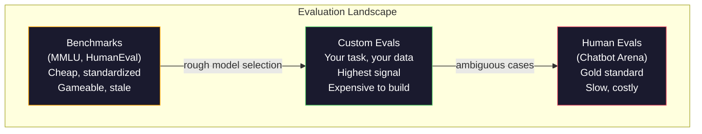
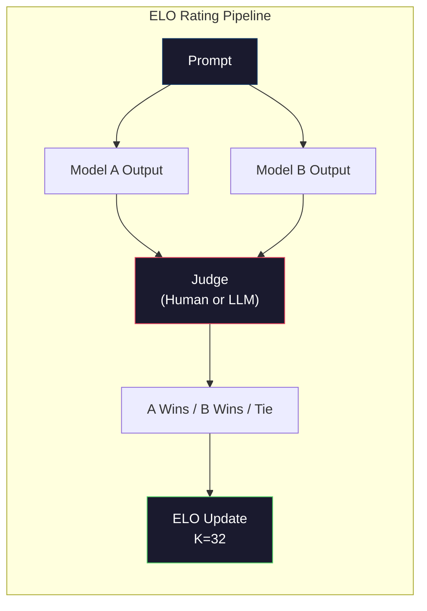

# 評価: ベンチマーク、Evals、LM ハーネス

> Goodhart の則: 測定がターゲットになると、それは良い測定でなくなる。あらゆりフロンティア ラボはベンチマークをゲーム。MMLU スコアが上がるが、モデルは依然として "strawberry" の R の数を信頼できるカウント できない。唯一の eval 重要なのは自分の — あなたのタスク上、あなたのデータ、あなたの失敗モード上。

**タイプ:** Build
**言語:** Python
**前提条件:** Phase 10、レッスン 01-05 (LLM ゼロからの構築)
**所要時間:** ~90分

## 学習目標

- 言語モデルに対して複数の選択と開放終了ベンチマークを実行する カスタム評価ハーネスを構築する
- 標準ベンチマーク (MMLU、HumanEval) がなぜ飽和し、フロンティア モデルを微分できないかを説明する
- タスク固有の evals を適切なメトリクスで実装: 正確なマッチ、F1、BLEU、LLM as judge スコアリング
- 公開リーダーボードのみに依存するのではなく、特定のユースケースを狙ったカスタム評価スイートを設計する

## 問題

MMLU は 2020 年に 57 サブジェクト全体 15,908 質問で公開。3 年以内、フロンティア モデル飽和。GPT-4 スコア 86.4%。Claude 3 Opus は 86.8%。Llama 3 405B は 88.6%。リーダーボードは統計的ノイズではなく real 機能ギャップ ではない 3 ポイント範囲に圧縮。

同時に、それら同じモデルは 10 歳児は考えずに処理するタスクで失敗。Claude 3.5 Sonnet、MMLU で 88.7% スコアする、初期と "strawberry" 内の文字をカウント できなかった — ゼロの世界知識とゼロの推論を必要とするタスク、ただ文字レベル反復。HumanEval は 164 問題でコード生成をテスト。モデル 90%+ をスコア。しかし、あらゆり junior 開発者がキャッチする edge case でクラッシュするコードを生産する。

ベンチマーク パフォーマンスと実世界の信頼性の間のギャップは LLM 評価の中央の問題。ベンチマークはその モデル ベンチマークをするのはお伝えします。それは、モデルがあなたの固有のタスク、あなたの固有のデータ、あなたの固有の失敗モードでいかに機能するかについてはほぼないのです。あなたが顧客サポート ボットを構築する場合、MMLU は無関です。あなたが コード アシスタントを構築する場合、HumanEval は関数レベルの生成のみをカバー — debugging、リファクタリング、またはファイル全体でのコード説明について何も言っていません。

カスタム evals が必要。ベンチマークが無用であるので — 彼らは本当に粗いモデル選択のため有用である — 最終評価が配置条件と正確に合わなければならないため。

## コンセプト

### Eval ランドスケープ

3 つのカテゴリーの評価があります、あらゆりは異なるコスト と信号品質を持つ。

**ベンチマーク**は標準化されたテスト スイートです。MMLU、HumanEval、SWE-bench、MATH、ARC、HellaSwag。モデルに対してベンチマーク を実行、スコアを得ます。利点: あらゆりはモデルを比較できるように同じテストを使用。欠点: モデルとトレーニング データはますますこれらのベンチマークを汚す。スコアが上がります。機能はしない可能性。

**カスタム evals** は固有のユースケースのためあなたが構築するテスト スイート。入力、期待される出力、スコアリング関数を定義。法的ドキュメント サマライザーは法的ドキュメントで評価される。SQL ジェネレータはあなたのデータベース スキーマで評価。build するため expense；それらは本番パフォーマンスを予測する唯一の評価です。

**人間の evals**有料の注釈者を使用して、有用性、正確性、流動性、安全性など基準でモデル出力を判定。開放終了タスクで自動スコアリングが失敗する。Chatbot Arena は、100 以上のモデル全体 200 万を超える人間好み投票を収集。欠点: コスト ($0.10-$2.00 per 判定) と速度 (時間から日)。



### ベンチマークが破綻する理由

3 つのメカニズムがベンチマーク スコアが real 機能を反映するのを止める。

**データ汚染。** トレーニング コーパスはインターネット スクレイプ。ベンチマーク質問がインターネット上に生きる。モデル回答トレーニング中に見ます。これはそのラボがベンチマーク データを意図的に含むわけではない — web スケール スクレイピング はほぼ불가능なため。

**テストに教える。** ラボがベンチマーク パフォーマンスのため訓練混合を最適化。5% MMLU スタイルの複数の選択肢がトレーニング ミックス にあれば、モデルはフォーマットを学びかつ回答分布。MMLU は 4 方向複数の選択肢。モデルが学ぶ回答分布はおよそ均一、A/B/C/D を通じて、モデルがそれを知らないときでさえ助けます。

**飽和。** あらゆりフロンティア モデルがベンチマーク 85-90% をスコアする場合、ベンチマークが微分するのを止めます。残り 10-15% 質問はあるかもしれません曖昧、不適切にラベル、または不明瞭なドメイン知識が必要。MMLU 上 87% から 89% の改善は、モデルがより賢く得た、2 つ以上の不明瞭な質問を暗記したことを意味するかもしれません。

### パープレキシティ: クイック衛生チェック

パープレキシティ どのくらいの token シーケンスにモデルは驚いている です。正式には、exponentiated 平均 negative ログ尤度です:

```
PPL = exp(-1/N * sum(log P(token_i | context)))
```

パープレキシティ 10 は、モデルが各トークン位置で 10 オプション全体で均等に選択すると同じくらい不確実であることを意味。低いは better。GPT-2 は WikiText-103 で ~30 のパープレキシティを取得。GPT-3 は ~20 を取得。Llama 3 8B は ~7 を取得。

パープレキシティは同じテスト セット上でモデルを比較するため有用ですが、盲点を持つ。モデルはかもしれません。一般的なパターンを予測することが良いことで低いパープレキシティを持つが、rare しかし重要なパターンで恐ろしい。それはまた、instruction 適性、推論、事実上の正確性について何も言う。それをサニティ チェックとして使用し、最終の判定ではない。

### LLM as Judge

強いモデルを使用して弱いモデル出力を評価。アイデアはシンプル: GPT-4o または Claude Sonnet に応答をレート 要求、正確性、有用性、安全性 1-5 スケール。これは GPT-4o ミニで ~$0.01 per 判定を費やし、約 80% 合意を持つ human 判定へのコスト。

スコアリング プロンプトはモデルより重要。曖昧なプロンプト ("この応答をレート") が noisy スコアを生成。構造化されたプロンプト rubric ("スコア 5 回答が事実的に correct かつ ソース を引用、4 が正しいしかし unsourced、3 が部分的に正しい...") が一貫したスコア 再現可能を生成。

失敗モード: judge モデル位置 バイアスを示す (pairwise 比較で最初の応答を好む)、verbose バイアス (より長い応答を好む)、自己好み (GPT-4 は Claude 出力より高い GPT-4 出力をレート)。軽減: ランダムに注文を設定、長さのために正規化、質問中のモデルと異なる judge を使用。

### Pairwise 比較から ELO レーティング

Chatbot Arena の アプローチ。同じプロンプトから 2 異なる モデルから 2 つの応答を表示。人間 (または LLM judge) は より良いことを選ぶ。数千このような比較から、あらゆりモデルの ELO レーティングを計算 — chess で使用される同じシステム。

ELO 利点: 相対順位は絶対スコアリングより信頼でき、タイをゆるく処理し、そして すべての出力を独立して スコアリングより少ない比較で転帰。2026 初期に関しては、Chatbot Arena ランク GPT-4o、Claude 3.5 Sonnet、Gemini 1.5 Pro を トップで 20 ELO ポイント以内として表示します。



### Eval フレームワーク

**lm-evaluation-harness** (EleutherAI): 標準開くソース eval フレームワーク。200 以上のベンチマークサポート。あらゆる HuggingFace モデルを MMLU、HellaSwag、ARC など全て 1 つのコマンドで実行。オープン LLM リーダーボード で使用。

**RAGAS**: RAG パイプラインのための特に評価フレームワーク。faithfulness を測定 (答えが取得コンテキストに合致するか)、relevance (取得コンテキストは質問に関連するか)、回答正確性。

**promptfoo**: プロンプト エンジニアリングのための config 駆動の eval。YAML でテスト ケース を定義、複数モデルに対して実行、pass/fail レポートを取得。プロンプト回帰テスト用有用 — 確認プロンプト変更が既存テスト ケース を破綻しない。

### カスタム Evals を構築

本番のための唯一 eval 重要。プロセス:

1. **タスクを定義。** 正確にモデルは何をすべきですか? Be 正確。"質問に回答する" は曖昧。"顧客不満申し立てメール を与えられ、product name、issue カテゴリ、sentiment を抽出" はあなたが評価できるタスク。

2. **テスト ケースを作成。** プロトタイプ eval のため最少 50、本番 のため 200+。あらゆり test ケースは (入力、期待される出力) ペア。含 edge ケース: 空の入力、adversarial 入力、曖昧な入力、他の言語の入力。

3. **スコアリングを定義。** 構造化出力のため 正確なマッチ。テキスト類似のため BLEU/ROUGE。開放終了の質 のため LLM as judge。F1 抽出タスク。単一メトリクスを複数の重みで組み合わせ。

4. **自動化。** あらゆり eval は 1 つのコマンドで実行。手動のステップがない。比較上の時間を有効にする format で 結果を保存。

5. **時間で追跡。** 孤立の eval スコアは meaningless。あなたは trendline が必要。最後のプロンプト変更の後、スコア改善しましたか? モデル スイッチの後 regress しましたか? バージョン eval あなたのプロンプトと共に。

| Eval タイプ | 判定ごとのコスト | Human との合意 | 最適 |
|-----------|------------------|----------------------|----------|
| 正確なマッチ | ~$0 | 100% (該当する場合) | 構造化出力、分類 |
| BLEU/ROUGE | ~$0 | ~60% | 翻訳、要約 |
| LLM as judge | ~$0.01 | ~80% | 開放終了生成 |
| Human eval | $0.10-$2.00 | N/A (ground truth である) | 曖昧、高リスク タスク |

## 構築

### ステップ 1: 最小の Eval フレームワーク

中核 abstractions を定義。Eval ケースが入力、期待される出力、optional メタデータ dict を持つ。スコアラーは予測と参照をとり、0 と 1 の間のスコアを返す。

```python
import json
from collections import Counter

class EvalCase:
    def __init__(self, input_text, expected, metadata=None):
        self.input_text = input_text
        self.expected = expected
        self.metadata = metadata or {}

class EvalSuite:
    def __init__(self, name, cases, scorers):
        self.name = name
        self.cases = cases
        self.scorers = scorers

    def run(self, model_fn):
        results = []
        for case in self.cases:
            prediction = model_fn(case.input_text)
            scores = {}
            for scorer_name, scorer_fn in self.scorers.items():
                scores[scorer_name] = scorer_fn(prediction, case.expected)
            results.append({
                "input": case.input_text,
                "expected": case.expected,
                "prediction": prediction,
                "scores": scores,
            })
        return results
```

### ステップ 2: スコアリング関数

正確なマッチ、トークン F1、シミュレート LLM as judge スコアラーを構築。

```python
def exact_match(prediction, expected):
    return 1.0 if prediction.strip().lower() == expected.strip().lower() else 0.0

def token_f1(prediction, expected):
    pred_tokens = set(prediction.lower().split())
    exp_tokens = set(expected.lower().split())
    if not pred_tokens or not exp_tokens:
        return 0.0
    common = pred_tokens & exp_tokens
    precision = len(common) / len(pred_tokens)
    recall = len(common) / len(exp_tokens)
    if precision + recall == 0:
        return 0.0
    return 2 * (precision * recall) / (precision + recall)

def llm_judge_simulated(prediction, expected):
    pred_words = set(prediction.lower().split())
    exp_words = set(expected.lower().split())
    if not exp_words:
        return 0.0
    overlap = len(pred_words & exp_words) / len(exp_words)
    length_penalty = min(1.0, len(prediction) / max(len(expected), 1))
    return round(overlap * 0.7 + length_penalty * 0.3, 3)
```

### ステップ 3: ELO レーティング システム

Pairwise 比較から ELO アップデート を実装。これは Chatbot Arena が モデルを rank するために使用する正確なシステム。

```python
class ELOTracker:
    def __init__(self, k=32, initial_rating=1500):
        self.ratings = {}
        self.k = k
        self.initial_rating = initial_rating
        self.history = []

    def _ensure_player(self, name):
        if name not in self.ratings:
            self.ratings[name] = self.initial_rating

    def expected_score(self, rating_a, rating_b):
        return 1 / (1 + 10 ** ((rating_b - rating_a) / 400))

    def record_match(self, player_a, player_b, outcome):
        self._ensure_player(player_a)
        self._ensure_player(player_b)

        ea = self.expected_score(self.ratings[player_a], self.ratings[player_b])
        eb = 1 - ea

        if outcome == "a":
            sa, sb = 1.0, 0.0
        elif outcome == "b":
            sa, sb = 0.0, 1.0
        else:
            sa, sb = 0.5, 0.5

        self.ratings[player_a] += self.k * (sa - ea)
        self.ratings[player_b] += self.k * (sb - eb)

        self.history.append({
            "a": player_a, "b": player_b,
            "outcome": outcome,
            "rating_a": round(self.ratings[player_a], 1),
            "rating_b": round(self.ratings[player_b], 1),
        })

    def leaderboard(self):
        return sorted(self.ratings.items(), key=lambda x: -x[1])
```

### ステップ 4: パープレキシティ計算

トークン確率を使用してパープレキシティを計算。実際には、モデルのlogits からこれらを取得。ここで確率分布でシミュレート。

```python
import numpy as np

def perplexity(log_probs):
    if not log_probs:
        return float("inf")
    avg_neg_log_prob = -np.mean(log_probs)
    return float(np.exp(avg_neg_log_prob))

def token_log_probs_simulated(text, model_quality=0.8):
    np.random.seed(hash(text) % 2**31)
    tokens = text.split()
    log_probs = []
    for i, token in enumerate(tokens):
        base_prob = model_quality
        if len(token) > 8:
            base_prob *= 0.6
        if i == 0:
            base_prob *= 0.7
        prob = np.clip(base_prob + np.random.normal(0, 0.1), 0.01, 0.99)
        log_probs.append(float(np.log(prob)))
    return log_probs
```

### ステップ 5: 結果を集約

Eval 実行全体で: mean、median、threshold で pass レート、メトリックごとの分解。

```python
def summarize_results(results, threshold=0.8):
    all_scores = {}
    for r in results:
        for metric, score in r["scores"].items():
            all_scores.setdefault(metric, []).append(score)

    summary = {}
    for metric, scores in all_scores.items():
        arr = np.array(scores)
        summary[metric] = {
            "mean": round(float(np.mean(arr)), 3),
            "median": round(float(np.median(arr)), 3),
            "std": round(float(np.std(arr)), 3),
            "min": round(float(np.min(arr)), 3),
            "max": round(float(np.max(arr)), 3),
            "pass_rate": round(float(np.mean(arr >= threshold)), 3),
            "n": len(scores),
        }
    return summary

def print_summary(summary, suite_name="Eval"):
    print(f"\n{'=' * 60}")
    print(f"  {suite_name} Summary")
    print(f"{'=' * 60}")
    for metric, stats in summary.items():
        print(f"\n  {metric}:")
        print(f"    Mean:      {stats['mean']:.3f}")
        print(f"    Median:    {stats['median']:.3f}")
        print(f"    Std:       {stats['std']:.3f}")
        print(f"    Range:     [{stats['min']:.3f}, {stats['max']:.3f}]")
        print(f"    Pass rate: {stats['pass_rate']:.1%} (threshold >= 0.8)")
        print(f"    N:         {stats['n']}")
```

### ステップ 6: フル パイプラインを実行

すべてをつなぐ。タスク定義、テスト ケース作成、2 つのモデルをシミュレート、evals を実行、pairwise 比較から ELO を計算、リーダーボードをプリント。

```python
def demo_model_good(prompt):
    responses = {
        "What is the capital of France?": "Paris",
        "What is 2 + 2?": "4",
        "Who wrote Hamlet?": "William Shakespeare",
        "What language is PyTorch written in?": "Python and C++",
        "What is the boiling point of water?": "100 degrees Celsius",
    }
    return responses.get(prompt, "I don't know")

def demo_model_bad(prompt):
    responses = {
        "What is the capital of France?": "Paris is the capital city of France",
        "What is 2 + 2?": "The answer is four",
        "Who wrote Hamlet?": "Shakespeare",
        "What language is PyTorch written in?": "Python",
        "What is the boiling point of water?": "212 Fahrenheit",
    }
    return responses.get(prompt, "Unknown")

cases = [
    EvalCase("What is the capital of France?", "Paris"),
    EvalCase("What is 2 + 2?", "4"),
    EvalCase("Who wrote Hamlet?", "William Shakespeare"),
    EvalCase("What language is PyTorch written in?", "Python and C++"),
    EvalCase("What is the boiling point of water?", "100 degrees Celsius"),
]

suite = EvalSuite(
    name="General Knowledge",
    cases=cases,
    scorers={
        "exact_match": exact_match,
        "token_f1": token_f1,
        "llm_judge": llm_judge_simulated,
    },
)

results_good = suite.run(demo_model_good)
results_bad = suite.run(demo_model_bad)

print_summary(summarize_results(results_good), "Model A (concise)")
print_summary(summarize_results(results_bad), "Model B (verbose)")
```

"良い" モデル はきちんとした回答を与えます。"悪い" モデルは冗長paraphrases を与えます。正確なマッチは verbose モデルを severe に罰。トークン F1 と LLM as judge は許容以上。これは同じモデルが素晴らしい見えるか恐ろしい見えるいかに測定選択の重要さを示す: 同じモデルで、スコアリング。

### ステップ 7: ELO トーナメント

モデル全体複数ラウンド pairwise 比較を実行。

```python
elo = ELOTracker(k=32)

for case in cases:
    pred_a = demo_model_good(case.input_text)
    pred_b = demo_model_bad(case.input_text)

    score_a = token_f1(pred_a, case.expected)
    score_b = token_f1(pred_b, case.expected)

    if score_a > score_b:
        outcome = "a"
    elif score_b > score_a:
        outcome = "b"
    else:
        outcome = "tie"

    elo.record_match("model_a_concise", "model_b_verbose", outcome)

print("\nELO Leaderboard:")
for name, rating in elo.leaderboard():
    print(f"  {name}: {rating:.0f}")
```

### ステップ 8: パープレキシティ比較

異なる品質レベルの "モデル" 全体パープレキシティを比較。

```python
test_text = "The quick brown fox jumps over the lazy dog in the garden"

for quality, label in [(0.9, "Strong model"), (0.7, "Medium model"), (0.4, "Weak model")]:
    log_probs = token_log_probs_simulated(test_text, model_quality=quality)
    ppl = perplexity(log_probs)
    print(f"  {label} (quality={quality}): perplexity = {ppl:.2f}")
```

## 使用

### lm-evaluation-harness (EleutherAI)

あらゆるモデルでベンチマークを実行するための標準ツール。

```python
# pip install lm-eval
# コマンド ライン:
# lm_eval --model hf --model_args pretrained=meta-llama/Llama-3.1-8B --tasks mmlu --batch_size 8

# Python API:
# import lm_eval
# results = lm_eval.simple_evaluate(
#     model="hf",
#     model_args="pretrained=meta-llama/Llama-3.1-8B",
#     tasks=["mmlu", "hellaswag", "arc_easy"],
#     batch_size=8,
# )
# print(results["results"])
```

### promptfoo

プロンプト エンジニアリング のための config 駆動の eval。YAML でテストを定義してから複数プロバイダー全体で実行。

```yaml
# promptfoo.yaml
providers:
  - openai:gpt-4o-mini
  - anthropic:claude-3-haiku

prompts:
  - "Answer in one word: {{question}}"

tests:
  - vars:
      question: "What is the capital of France?"
    assert:
      - type: contains
        value: "Paris"
  - vars:
      question: "What is 2 + 2?"
    assert:
      - type: equals
        value: "4"
```

### RAGAS for RAG 評価

```python
# pip install ragas
# from ragas import evaluate
# from ragas.metrics import faithfulness, answer_relevancy, context_precision
#
# result = evaluate(
#     dataset,
#     metrics=[faithfulness, answer_relevancy, context_precision],
# )
# print(result)
```

RAGAS は汎用 evals が見落とすものを測定: モデルの回答が取得されたコンテキストで接地されるか、ただ大きく "正しい"。

## 配信

このレッスンは `outputs/prompt-eval-designer.md` を生成 — あらゆりタスク のため カスタム eval スイートを設計する再利用可能なプロンプト。タスク説明を与え、テスト ケース、スコアリング関数、pass/fail threshold recommendation を生成。

また `outputs/skill-llm-evaluation.md` を生成 — タスク タイプ、予算、レイテンシー要件に基づいて正しい評価戦略を選ぶためのアイデア枠組み。

## 演習

1. "一貫性" スコアラーを追加、同じ入力を 5 回モデルを実行、出力がどのくらい頻繁にマッチするかを測定。非決定論的入力での一貫性のない回答は reveal fragile プロンプト または高い温度設定。

2. ELO トラッカーを複数の judge 関数 (正確なマッチ、F1、LLM as judge) をサポートするため拡張し、重みを設定。exact マッチに heavily 重みが付いている場合 対 F1 に heavily 重み付けられている場合、リーダーボードがどのように変更されるかを比較。

3. 固有のタスク のための eval スイート を構築: メール分類 5 カテゴリーに。異なるサンプル (複数カテゴリーに属する可能性があるメール、empty メール、他の言語のメール) を含めて 100 テストケースを作成。measure 異なる "モデル" (ルール ベース、キーワード マッチング、シミュレート LLM) がパフォーマンス。

4. 汚染検出を実装: eval 質問の集合とトレーニング コーパスが与えられ、eval 質問のどのくか（または接近 paraphrases） がトレーニング データに表示されるかをチェック。これはベンチマーク有効性をどう研究者が監査するかです。

5. "model diff" ツール を構築。2 つのモデル バージョンから eval 結果が与えられ、どの固有のテスト ケースが改善し、どれが regressed、どれが同じ のままあるかをハイライト。これはコード diff の eval 等価性 — 変更が助けたか傷つけたかを理解するため必須。

## キーワード

| 用語 | 人々が言う | 実際の意味 |
|------|----------------|----------------------|
| MMLU | "ベンチマーク" | 大規模マルチタスク言語理解 — 57 サブジェクト全体 15,908 複数の選択肢質問、2025 で 88% ところで飽和 |
| HumanEval | "コード eval" | OpenAI からの 164 Python 関数 completion の問題、isolated 関数生成のみをテスト |
| SWE-bench | "本物のコード eval" | 12 Python repos から 2,294 GitHub issues、テストが実装を含む end to end bug fixing を測定 |
| パープレキシティ | "モデルがどのくらい mixed アップさせるか" | exp(-avg(log P(token_i given context))) — 低いは モデルが実際のトークンにより高い確率を割り当てることを意味 |
| ELO レーティング | "モデルのチェス ランキング" | Pairwise win/loss レコード から計算される相対スキル レーティング、Chatbot Arena で 100+ モデルをランク付けするため使用 |
| LLM as judge | "AI を AI をグレード するのに使用" | 強いモデルが rubric に対して弱いモデルの出力をスコア、human judge との ~80% 合意で ~$0.01/判定 |
| データ汚染 | "モデルがテストを見た" | トレーニング データはベンチマーク質問を含みます。本当の機能改善せずにスコアをインフレさせる |
| Eval スイート | "テストの束" | 版化されたコレクション (入力、期待される出力、スコアラー) が固有の機能を測定 |
| Pass レート | "正確な % はなか" | threshold 上スコアリングする eval ケースの分数 — 平均スコアより信頼性を測定することので実行可能 |
| Chatbot Arena | "モデル ランキング ウェブサイト" | ELO レーティング経由 2M+ human 好み投票を生成する最も信頼最も LLM リーダーボード、LMSYS プラットフォーム |

## 参考文献

- [Hendrycks et al., 2021 -- "Measuring Massive Multitask Language Understanding"](https://arxiv.org/abs/2009.03300) -- MMLU 論文、その飽和にもかかわらず、依然として最も引用 LLM ベンチマーク
- [Chen et al., 2021 -- "Evaluating Large Language Models Trained on Code"](https://arxiv.org/abs/2107.03374) -- OpenAI からの HumanEval 論文、コード生成評価メソドロジーを設立
- [Zheng et al., 2023 -- "Judging LLM-as-a-Judge"](https://arxiv.org/abs/2306.05685) -- LLM を評価するため使用の体系的分析、位置バイアス と冗長性バイアスを含む発見
- [LMSYS Chatbot Arena](https://chat.lmsys.org/) — 2M+ 投票を持つ群衆ソースの モデル比較プラットフォーム、最も信頼できる real ワールド LLM ランキング
