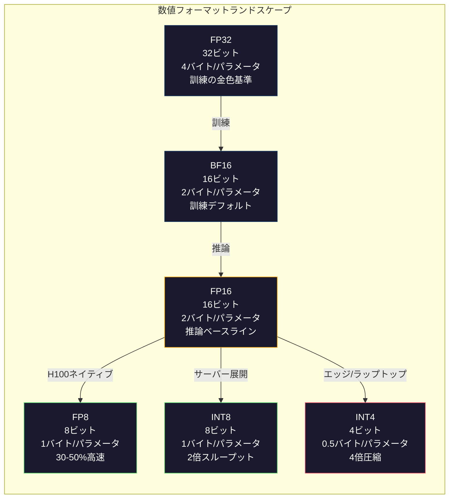
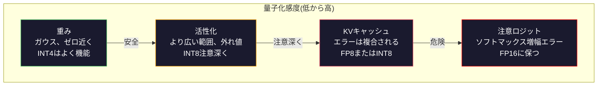
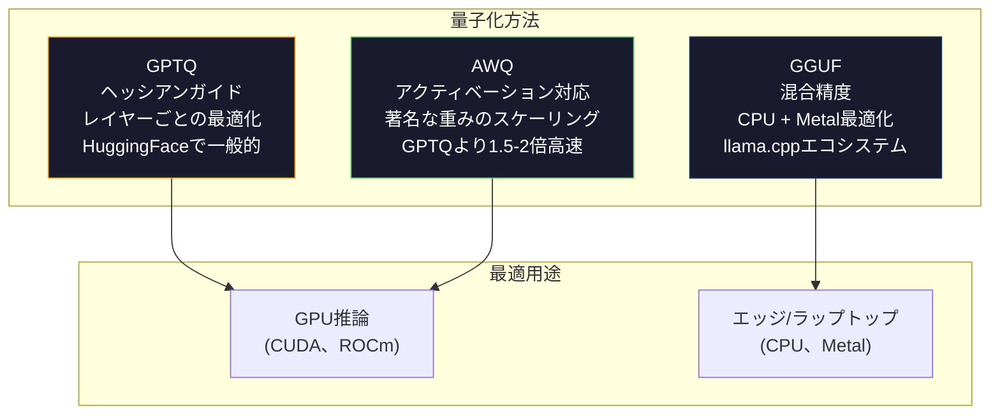

# 量子化: モデルを小さくする

> 70BモデルのFP16は140GB必要。重みだけでA100 2個。FP8に量子化:80GB GPU 1個。INT4:MacBook。

**タイプ:** ビルド
**言語:** Python (numpy付き)
**前提条件:** フェーズ10、レッスン01-10 (LLMsをゼロから)
**所要時間:** 約120分

## 学習目標

- FP16からINT8とINT4への対称量子化と非対称量子化を実装。テンソルごと・チャネルごとのスケーリングを含む
- 量子化による メモリ節約を計算し、与えられたGPUのVRAMに収まる精度を決定する
- ポスト訓練量子化(PTQ)と量子化認識訓練(QAT)の違いを説明する
- GPTQまたはAWQを使って実際のモデルを量子化し、ベンチマークで精度とメモリのトレードオフを測定する

## 問題

Llama 3 70Bには70億個のパラメータがある。各パラメータは16ビット浮動小数点数。つまり1400億バイト。140GB。1つのA100は80GBのVRAM。1つのGPUでさえ重みを読み込むことはできない。推論はもちろんのこと。1時間あたり2ドルの2つのA100が必要だ。

しかし、パラメータあたり16ビットは浪費的だ。ニューラルネットワークのほとんどの重みはゼロの近くにクラスタしている。FP16の全ダイナミックレンジ(0.000000059から65504)はほぼ完全に未使用だ。Llama 3 70Bの重みの実際の分布を測定すると、95%が-0.1から+0.1の間である。4で表現できる値を表現するために16ビットを使い切っている。

量子化は高精度数を低精度数に置き換える。FP16からFP8へ メモリが半分になる。FP16からINT4へ4分の1になる。その140GBモデルは35GBになる。1つのコンシューマGPUに収まる。2ビット量子化(積極的、ロッシー、いくつかのタスクでは使用可能)に進むと、同じモデルは16GBラップトップで動作する。

コストは精度だ。削除するすべてのビットが情報を破壊する。質問は、どれだけの精度を失うか、どこで失うかである。よく量子化されたINT4モデルは、ほとんどのベンチマークで元の品質の95-99%を保持する。INT4への素朴な量子化はモデルを完全に破壊できる。違いはテクニックだ。

LlamaをGPTQでINT4に量子化するコミュニティの量子化は、WikiTextでおよそ1-2パープレキシティポイント失われたことを示している。MistraalはMixtral 8x22BのFP8チェックポイントをリリースし、MMULでゼロの測定可能な品質損失を示した。GGUF形式はllama.cppに電力を供給し、M シリーズチップを搭載したMacBookで70Bモデルを実行する。量子化はハックではない。7Bより大きなすべてのモデルの標準展開パスだ。

## コンセプト

### 数値フォーマット: 各ビットが何をするか

すべての浮動小数点数には3つの部分がある:符号、指数、仮数(有効数字とも呼ばれる)。符号は1ビット。指数は範囲を決定する(数値がどれほど大きいか小さいか)。仮数は精度を決定する(小数点以下の桁数)。

```
FP32:  [1 符号] [8 指数] [23 仮数]  = 32ビット
FP16:  [1 符号] [5 指数] [10 仮数]  = 16ビット
BF16:  [1 符号] [8 指数] [7  仮数]  = 16ビット
FP8:   [1 符号] [4 指数] [3  仮数]  = 8ビット (E4M3)
FP8:   [1 符号] [5 指数] [2  仮数]  = 8ビット (E5M2)
INT8:  [1 符号] [7 値]                   = 8ビット (均一ステップ)
INT4:  [1 符号] [3 値]                   = 4ビット (合計16レベル)
```

**FP32**は完全精度だ。23の仮数ビットは約7桁の精度を与える。範囲:約1.2 x 10^-38から3.4 x 10^38。訓練はFP32でのみ行われた。累積(行列乗算中の実行中の合計)には今でもそうだ。

**FP16**はビット数を半分にする。10の仮数ビットは約3.3桁の精度を与える。指数は5ビットに縮小し、範囲を劇的に削減する(最大値~65504)。これは重み(ゼロの近くにクラスタされている)には問題ないが、訓練中にスパイクする可能性のあるアクティベーションと勾配には危険だ。FP16訓練はアンダーフロー防止のために損失スケーリングが必要だ。

**BF16**(Brain Float 16)はFP32から8ビット指数を保持しているが、仮数を7ビットに縮小している。FP32と同じ範囲、FP16より精度が低い。Googleは深い学習のために特別に設計した。直感:ニューラルネットワークでは精度よりも範囲が重要だ。FP16でアンダーフロー してゼロになる10^-20の勾配はBF16で生き残る。BF16で0.0734に丸まる0.07342の重みは十分に近い。すべての最新の訓練実行はBF16またはBF16/FP32ミックスを使用する。

**FP8**には2つのフレーバーがある。E4M3(4指数、3仮数)は推論中の重みと活性化に使用される。E5M2(5指数、2仮数)は訓練中の勾配に使用され、精度よりも範囲が重要である。H100 GPU上のFP8推論はFP16より30-50%高速化を達成し、品質損失は無視できる。

**INT8**は整数フォーマット。指数なし、仮数なし。-128から127まで均等に間隔を空けた256の値。浮動小数点の重みをこの範囲にマップするスケール係数が必要だ。利点:整数演算は浮動小数点より高速で、より電力効率が良い。A100上のINT8行列乗算は624 TOPSで実行され、FP16の312 TFLOPSと比較される。

**INT4**はさらに進む。可能な値は16個だけだ。スケール係数は大きな仕事をしている。品質はスケールの選択方法と量子化するデータに完全に依存する。最先端のINT4方法(GPTQ、AWQ)は元のモデル品質の95%以上を保持する。



### 量子化の仕組み

コア操作はシンプルだ。浮動小数点値のテンソルを取る。スケール係数を探す。乗算し、最も近い整数に丸める。整数とスケール係数を保存する。

**量子化:**
```
scale = max(abs(tensor)) / max_int_value
quantized = round(tensor / scale)
```

**逆量子化:**
```
reconstructed = quantized * scale
```

対称範囲(-127から127)のINT8の場合:
```
scale = max(abs(tensor)) / 127
quantized = clamp(round(tensor / scale), -128, 127)
```

エラーは丸め誤差だ。各値は最大で`scale / 2`オフになる可能性がある。レイヤー全体の総エラーは、何個の重みがあり、それらの重みの摂動にモデルがどれほど敏感であるかに依存する。

**テンソルごと vs チャネルごと量子化。** テンソルごとは重み行列全体に1つのスケール係数を使用する。シンプルだがロッシーだ:1つの列に大きな値があり、別の列に小さな値があれば、小さな値はほとんどの精度を失う。チャネルごとは出力チャネルごと(重み行列の各行または列)に1つのスケール係数を使用する。より多くのオーバーヘッド(1個ではなくNスケール係数を保存する)しかし劇的に良い品質。すべての本番量子化方法はチャネルごとまたはより細かい粒度を使用する。

**非対称量子化**はゼロポイントオフセットを追加する:`quantized = round(tensor / scale) + zero_point`。これは0を中心とした分布を処理する。ReLUアクティベーション、例えば、常に非負だ。対称量子化は決して表示されない負の値に整数範囲の半分を浪費する。非対称量子化は実際の範囲[min、max]を完全な整数範囲にマップする。

### 感度階層

モデルのすべてが量子化に同じように耐えるわけではない。明確な階層がある。

**重み(最も堅牢)。** モデルの重みは訓練中にゆっくり変化し、ゼロの近くを中心とした大まかにガウス分布に従う。それらはよく量子化する。チャネルスケールのINT8重みはほぼロスレス結果を生成する。INT4はより洗練された方法を必要としているが、機能している。

**アクティベーション(中程度の感度)。** アクティベーションは推論中にネットワークを流れる中間値だ。重みより広いダイナミックレンジを持ち、外れ値を含んでいる。単一の注意ヘッドは平均値より100倍大きいアクティベーション値を生成する可能性がある。これらの外れ値はモデル品質に重要だ。それらを素朴に量子化することは情報を破壊する。解決策:外れ値チャネルを高い精度に保つ(LLM.int8())、トークンごとまたはチャネルごとのアクティベーションスケールを使用する。

**KVキャッシュ(高い感度)。** キー・バリューキャッシュはすべての前のトークンの注意状態を保存する。長いコンテキスト長で、KVキャッシュがメモリを支配する。32Kコンテキストの70Bモデルの場合、KVキャッシュだけはFP16で40GB。KVキャッシュをFP8またはINT8に量子化すると、大規模メモリが節約されるが、エラーはすべての将来の注意計算全体で複合される。品質への影響はシーケンス長とともにスケールされる。

**注意ロジット(最も敏感)。** 注意のソフトマックスはその入力の小さな変化に高く敏感である。事前ソフトマックスロジットの0.01の量子化エラーは注意分布を意味深く変化させることができる。ほとんどの量子化スキームは、他のすべてが量子化されても、注意計算を高い精度(FP16またはBF16)に保つ。



### PTQ vs QAT

**ポスト訓練量子化(PTQ)**は既に訓練されたモデルを量子化する。再訓練なし。FP16重みを取り、スケール係数を計算し、丸め、展開する。高速(分から時間)で安い。INT8とFP8に対してはよく機能する。INT4の場合、素朴なPTQは丸め誤差が蓄積するため、しばしば悪く失敗する。高度なPTQ方法(GPTQ、AWQ)は量子化誤差を最小化するキャリブレーションデータを使用する。

**量子化認識訓練(QAT)**は訓練中のフォワードパスに偽量子化操作を挿入する。モデルは丸め誤差が小さい場所に重みを置くことを学ぶ。勾配はストレート・スルー・エスティメータ(STE)を使用して偽量子化を流れ込む:丸め操作の勾配1を装う。QATはPTQより優れたINT4およびINT2モデルを生成するが、完全な訓練実行が必要だ。Googleは高効率提供のためのGeminiにQATを使用した。MetaはLlamaの展開ターゲットのいくつかにQATを使用した。

| 側面 | PTQ | QAT |
|--------|-----|-----|
| コスト | 分から数時間 | 完全訓練実行 |
| INT8での品質 | 優秀(< 0.1%損失) | 優秀 |
| INT4での品質 | GPTQ/AWQで優秀(1-3%損失) | より優秀(< 1%損失) |
| INT2での品質 | 貧弱 | いくつかのタスクで使用可能 |
| キャリブレーションデータ | 128-1024の例 | 完全訓練データセット |
| 使用時期 | 展開、反復 | 低ビット幅での最大品質 |

### GPTQ、AWQ、GGUF

**GPTQ (GPT Quantization)**はワンショットPTQ方法だ。レイヤーごとに1つずつ重みを量子化し、小さなキャリブレーションデータセット(通常128の例)を使用してヘッシアン(出力が各重みの摂動にどれほど敏感であるかについての2次情報)を測定する。ヘッシアンが重要だと言う重みはより注意深く量子化される。GPTQはLLMのINT4量子化を実用的にした最初の方法だ。TheBloke on Hugging Faceは何百ものモデルの量子化バージョンをリリースすることでGPTQを普及させた。

**AWQ (Activation-Aware Weight Quantization)**は、重みのわずかな分数(約1%)が大きなアクティベーション値と乗算するため、不釣り合いに重要であることを観察している。AWQはキャリブレーションデータを使用してこれらの著名な重みを識別し、量子化する前にそれらをスケールアップする(その後、対応するアクティベーションをスケールダウンする)。これは重要な重みをINT4量子化が正確な範囲に保つ。AWQは通常、GPTQの品質と一致またはわずかに上回り、適用がはるかに高速だ(1.5-2倍)。

**GGUF (GPT-Generated Unified Format)**はllama.cppと その生態系で使用されるファイル形式だ。混合量子化をサポートする:異なるレイヤーが異なるビット幅を取得する。最初と最後のレイヤー(埋め込みと出力ヘッド)は通常、より高い精度に保たれる。中層はINT4またはINT3を取得する。GGUFファイルは自己完結している:重み、トークナイザー、メタデータすべて1つのファイル。フォーマットはCPU推論とApple Siliconのために設計されており、モデル全体をメモリに読み込み、CPUまたはメタルGPUで行列乗算を実行することが標準パスだ。Q4_K_Mは最も一般的なGGUF量子化バリアント、バランスの品質とサイズ。



### 品質測定

量子化されたモデルがまだ良いかどうか、どうやってわかりますか?

**パープレキシティ。** 最も一般的なメトリック。低いほど良い。ホールドアウトデータセット(WikiText-2は標準)で元と量子化されたモデルの両方のパープレキシティを計算する。デルタはどれだけの情報量子化が破壊したか教えてくれる。経験則:デルタ < 0.5は優秀、0.5-1.0は良い、1.0-2.0はほとんどのタスクで受け入れ可能、> 2.0は何か悪い。

**タスク固有ベンチマーク。** 量子化されたモデルをMMU、HumanEval、GSM8K、またはカスタム評価スイートで実行する。元と比較する。量子化は異なる能力に不均等に影響する。数学とコードタスクは一般的な知識より精度損失に敏感だ。

**出力比較。** 両方のモデルから同じプロンプトで回答を生成し、比較する。LLM-as-judge (レッスン10)ここでうまく機能している。勝率を計算する:どのプロンプトの分数が量子化されたモデルが元の一致またはビートに合致している?

**レイテンシとスループット。** 量子化は存在してモデルを高速化し、より安くなる。トークン/秒、最初のトークンまでの時間、メモリ使用量を測定する。元より遅い量子化されたモデルは無用より悪い。

| モデル | フォーマット | サイズ | パープレキシティ (WikiText-2) | MMLU | トークン/秒 (A100) |
|-------|--------|------|------------------------|------|-------------------|
| Llama 3 70B | FP16 | 140GB | 3.12 | 79.5% | 38 |
| Llama 3 70B | FP8 | 70GB | 3.14 | 79.3% | 55 |
| Llama 3 70B | GPTQ INT4 | 35GB | 4.32 | 77.8% | 72 |
| Llama 3 70B | AWQ INT4 | 35GB | 4.18 | 78.1% | 75 |
| Llama 3 70B | GGUF Q4_K_M | 40GB | 4.25 | 77.9% | 28 (CPU) |

パターン:FP8はほぼ無料だ。INT4は1-2 MMUポイントが必要だが、スループットが2倍になり、メモリが4分の1になる。トレードオフはほぼすべての展開の価値がある。

### 実際の数字

H100上のFP16からFP8:30-50%推論スピードアップ、< 0.1%品質損失。これはノー・ブレーナー量子化だ。すべてのH100展開がそれを使用すべきだ。

FP16からINT8(LLM.int8()):2倍メモリ削減、< 0.5%品質損失。混合精度アプローチは外れ値特徴をFP16に保つが、他のすべてをINT8に量子化する。

FP16からINT4 (GPTQ/AWQ):4倍メモリ削減、モデルと方法に応じて1-3%品質損失。単一の48GB GPUで70Bモデルを有効にする。

FP16からINT4 (GGUF Q4_K_M):3.5倍メモリ削減、1-2%品質損失。CPU推論のために最適化。Q4_K_Mの70Bモデルは約40GBで、64GBのM3 Maxで10-15トークン/秒で実行される。

FP16からINT2:8倍メモリ削減、5-15%品質損失。低下を容認できる特定の狭いタスクにのみ実行可能。研究フロンティア、一般的な使用には本番対応していない。

## ビルドそれ

### ステップ1:数値フォーマット表現

各フォーマットのビット レベル表現を構築して、正確に符号、指数、仮数が何をするかを見る。

```python
import numpy as np


def float_to_fp32_bits(value):
    bits = np.float32(value).view(np.uint32)
    sign = (bits >> 31) & 1
    exponent = (bits >> 23) & 0xFF
    mantissa = bits & 0x7FFFFF
    return {"sign": int(sign), "exponent": int(exponent), "mantissa": int(mantissa),
            "exponent_bits": format(int(exponent), '08b'),
            "mantissa_bits": format(int(mantissa), '023b'),
            "value": float(value),
            "actual_exponent": int(exponent) - 127}


def float_to_fp16_bits(value):
    fp16 = np.float16(value)
    bits = fp16.view(np.uint16)
    sign = (bits >> 15) & 1
    exponent = (bits >> 10) & 0x1F
    mantissa = bits & 0x3FF
    return {"sign": int(sign), "exponent": int(exponent), "mantissa": int(mantissa),
            "exponent_bits": format(int(exponent), '05b'),
            "mantissa_bits": format(int(mantissa), '010b'),
            "value": float(fp16),
            "actual_exponent": int(exponent) - 15}


def float_to_bf16_bits(value):
    fp32_bits = np.float32(value).view(np.uint32)
    bf16_bits = (fp32_bits >> 16).astype(np.uint16)
    sign = (bf16_bits >> 15) & 1
    exponent = (bf16_bits >> 7) & 0xFF
    mantissa = bf16_bits & 0x7F
    reconstructed = np.uint32(bf16_bits.astype(np.uint32) << 16).view(np.float32)
    return {"sign": int(sign), "exponent": int(exponent), "mantissa": int(mantissa),
            "exponent_bits": format(int(exponent), '08b'),
            "mantissa_bits": format(int(mantissa), '07b'),
            "value": float(reconstructed),
            "actual_exponent": int(exponent) - 127}


def simulate_fp8_e4m3(value):
    sign = 1 if value < 0 else 0
    abs_val = abs(value)
    max_val = 448.0
    abs_val = min(abs_val, max_val)
    if abs_val == 0:
        return {"sign": sign, "exponent": 0, "mantissa": 0, "value": 0.0,
                "exponent_bits": "0000", "mantissa_bits": "000"}
    exp = int(np.floor(np.log2(abs_val)))
    exp = max(-6, min(8, exp))
    mantissa_val = abs_val / (2.0 ** exp) - 1.0
    mantissa_quant = round(mantissa_val * 8) / 8
    mantissa_quant = max(0, min(0.875, mantissa_quant))
    reconstructed = (1.0 + mantissa_quant) * (2.0 ** exp)
    if sign:
        reconstructed = -reconstructed
    mantissa_int = int(round(mantissa_quant * 8))
    return {"sign": sign, "exponent": exp + 7, "mantissa": mantissa_int,
            "exponent_bits": format(exp + 7, '04b'),
            "mantissa_bits": format(mantissa_int, '03b'),
            "value": float(reconstructed),
            "actual_exponent": exp}


def display_format_comparison(value):
    fp32 = float_to_fp32_bits(value)
    fp16 = float_to_fp16_bits(value)
    bf16 = float_to_bf16_bits(value)
    fp8 = simulate_fp8_e4m3(value)

    print(f"\n  値: {value}")
    print(f"  {'フォーマット':<8} {'保存された値':>14} {'エラー':>12} {'符号':>5} {'指数ビット':>10} {'仮数ビット':>25}")
    print(f"  {'-'*76}")
    print(f"  {'FP32':<8} {fp32['value']:>14.6f} {abs(fp32['value'] - value):>12.8f} {fp32['sign']:>5} {fp32['exponent_bits']:>10} {fp32['mantissa_bits']:>25}")
    print(f"  {'FP16':<8} {fp16['value']:>14.6f} {abs(fp16['value'] - value):>12.8f} {fp16['sign']:>5} {fp16['exponent_bits']:>10} {fp16['mantissa_bits']:>25}")
    print(f"  {'BF16':<8} {bf16['value']:>14.6f} {abs(bf16['value'] - value):>12.8f} {bf16['sign']:>5} {bf16['exponent_bits']:>10} {bf16['mantissa_bits']:>25}")
    print(f"  {'FP8e4m3':<8} {fp8['value']:>14.6f} {abs(fp8['value'] - value):>12.8f} {fp8['sign']:>5} {fp8['exponent_bits']:>10} {fp8['mantissa_bits']:>25}")
```

### ステップ2:対称量子化(テンソルごと、チャネルごと)

基本的な量子化操作。テンソルごとは行列全体に1つのスケールを使用する。チャネルごとは行または列ごとに1つのスケールを使用する。

```python
def quantize_symmetric(tensor, num_bits=8):
    qmin = -(2 ** (num_bits - 1))
    qmax = 2 ** (num_bits - 1) - 1
    abs_max = np.max(np.abs(tensor))
    if abs_max == 0:
        return np.zeros_like(tensor, dtype=np.int32), 1.0
    scale = abs_max / qmax
    quantized = np.clip(np.round(tensor / scale), qmin, qmax).astype(np.int32)
    return quantized, float(scale)


def dequantize_symmetric(quantized, scale):
    return quantized.astype(np.float64) * scale


def quantize_per_channel(tensor, num_bits=8, axis=0):
    qmin = -(2 ** (num_bits - 1))
    qmax = 2 ** (num_bits - 1) - 1

    if axis == 0:
        abs_max = np.max(np.abs(tensor), axis=1, keepdims=True)
    else:
        abs_max = np.max(np.abs(tensor), axis=0, keepdims=True)

    abs_max = np.where(abs_max == 0, 1.0, abs_max)
    scales = abs_max / qmax
    quantized = np.clip(np.round(tensor / scales), qmin, qmax).astype(np.int32)
    return quantized, scales.squeeze()


def dequantize_per_channel(quantized, scales, axis=0):
    if axis == 0:
        return quantized.astype(np.float64) * scales.reshape(-1, 1)
    else:
        return quantized.astype(np.float64) * scales.reshape(1, -1)


def quantize_asymmetric(tensor, num_bits=8):
    qmin = 0
    qmax = 2 ** num_bits - 1
    t_min = np.min(tensor)
    t_max = np.max(tensor)
    if t_max == t_min:
        return np.zeros_like(tensor, dtype=np.int32), 1.0, 0
    scale = (t_max - t_min) / (qmax - qmin)
    zero_point = int(np.round(qmin - t_min / scale))
    zero_point = max(qmin, min(qmax, zero_point))
    quantized = np.clip(np.round(tensor / scale + zero_point), qmin, qmax).astype(np.int32)
    return quantized, float(scale), int(zero_point)


def dequantize_asymmetric(quantized, scale, zero_point):
    return (quantized.astype(np.float64) - zero_point) * scale
```

### ステップ3:品質測定

量子化が破壊する情報の量を測定する。平均二乗誤差、信号対ノイズ比、元と再構成テンソル間のコサイン類似性。

```python
def quantization_error(original, reconstructed):
    diff = original - reconstructed
    mse = float(np.mean(diff ** 2))
    rmse = float(np.sqrt(mse))
    max_error = float(np.max(np.abs(diff)))
    signal_power = float(np.mean(original ** 2))
    snr_db = 10 * np.log10(signal_power / max(mse, 1e-20))

    orig_flat = original.flatten()
    recon_flat = reconstructed.flatten()
    norm_orig = np.linalg.norm(orig_flat)
    norm_recon = np.linalg.norm(recon_flat)
    if norm_orig == 0 or norm_recon == 0:
        cosine_sim = 0.0
    else:
        cosine_sim = float(np.dot(orig_flat, recon_flat) / (norm_orig * norm_recon))

    return {"mse": mse, "rmse": rmse, "max_error": max_error,
            "snr_db": float(snr_db), "cosine_similarity": cosine_sim}


def compare_quantization_methods(tensor, num_bits=8):
    q_pt, s_pt = quantize_symmetric(tensor, num_bits)
    recon_pt = dequantize_symmetric(q_pt, s_pt)
    err_pt = quantization_error(tensor, recon_pt)

    q_pc, s_pc = quantize_per_channel(tensor, num_bits, axis=0)
    recon_pc = dequantize_per_channel(q_pc, s_pc, axis=0)
    err_pc = quantization_error(tensor, recon_pc)

    q_asym, s_asym, zp = quantize_asymmetric(tensor, num_bits)
    recon_asym = dequantize_asymmetric(q_asym, s_asym, zp)
    err_asym = quantization_error(tensor, recon_asym)

    print(f"\n  量子化比較({num_bits}ビット、テンソル形状 {tensor.shape}):")
    print(f"  {'方法':<20} {'MSE':>12} {'SNR (dB)':>10} {'コサイン類似性':>12} {'最大エラー':>12}")
    print(f"  {'-'*68}")
    print(f"  {'テンソルごと対称':<20} {err_pt['mse']:>12.8f} {err_pt['snr_db']:>10.2f} {err_pt['cosine_similarity']:>12.8f} {err_pt['max_error']:>12.8f}")
    print(f"  {'チャネルごと対称':<20} {err_pc['mse']:>12.8f} {err_pc['snr_db']:>10.2f} {err_pc['cosine_similarity']:>12.8f} {err_pc['max_error']:>12.8f}")
    print(f"  {'非対称':<20} {err_asym['mse']:>12.8f} {err_asym['snr_db']:>10.2f} {err_asym['cosine_similarity']:>12.8f} {err_asym['max_error']:>12.8f}")

    return {"per_tensor": err_pt, "per_channel": err_pc, "asymmetric": err_asym}
```

### ステップ4:ビット幅スイープ

異なるビット幅(2、3、4、8、16)の同じテンソルを量子化し、各レベルで品質を測定する。これは品質が悪化する場所を正確に示している。

```python
def bit_width_sweep(tensor):
    print(f"\n  ビット幅スイープ(テンソル形状 {tensor.shape}):")
    print(f"  {'ビット':>6} {'レベル':>8} {'MSE':>14} {'SNR (dB)':>10} {'コサイン類似性':>12} {'圧縮':>12}")
    print(f"  {'-'*64}")

    results = []
    for bits in [2, 3, 4, 8, 16]:
        q, s = quantize_per_channel(tensor, bits, axis=0)
        recon = dequantize_per_channel(q, s, axis=0)
        err = quantization_error(tensor, recon)
        levels = 2 ** bits
        compression = 32.0 / bits

        print(f"  {bits:>6} {levels:>8} {err['mse']:>14.8f} {err['snr_db']:>10.2f} {err['cosine_similarity']:>12.8f} {compression:>11.1f}x")
        results.append({"bits": bits, "levels": levels, "error": err, "compression": compression})

    return results
```

### ステップ5:感度実験

トランスフォーマーの異なる部分を量子化することをシミュレートし、どのコンポーネントが最も敏感であるかを測定する。これは感度階層を示す:重み < アクティベーション < KVキャッシュ < 注意。

```python
def simulate_transformer_layer(input_data, weights, kv_scale=1.0):
    hidden = input_data @ weights["qkv"]
    seq_len = hidden.shape[1]
    d_model = weights["qkv"].shape[1] // 3
    q, k, v = hidden[:, :, :d_model], hidden[:, :, d_model:2*d_model], hidden[:, :, 2*d_model:]

    attn_scores = (q @ k.transpose(0, 2, 1)) / np.sqrt(d_model) * kv_scale
    attn_max = np.max(attn_scores, axis=-1, keepdims=True)
    attn_exp = np.exp(attn_scores - attn_max)
    attn_weights = attn_exp / np.sum(attn_exp, axis=-1, keepdims=True)

    attn_output = attn_weights @ v
    output = attn_output @ weights["out"]
    return output, {"q": q, "k": k, "v": v, "attn_scores": attn_scores,
                    "attn_weights": attn_weights, "attn_output": attn_output}


def sensitivity_experiment(batch_size=2, seq_len=16, d_model=64, num_bits=8):
    np.random.seed(42)
    input_data = np.random.randn(batch_size, seq_len, d_model) * 0.1

    weights = {
        "qkv": np.random.randn(d_model, 3 * d_model) * (2.0 / d_model) ** 0.5,
        "out": np.random.randn(d_model, d_model) * (2.0 / d_model) ** 0.5,
    }

    baseline_output, baseline_internals = simulate_transformer_layer(input_data, weights)

    experiments = {}

    q_qkv, s_qkv = quantize_per_channel(weights["qkv"], num_bits, axis=0)
    q_out, s_out = quantize_per_channel(weights["out"], num_bits, axis=0)
    quantized_weights = {
        "qkv": dequantize_per_channel(q_qkv, s_qkv, axis=0),
        "out": dequantize_per_channel(q_out, s_out, axis=0),
    }
    weight_quant_output, _ = simulate_transformer_layer(input_data, quantized_weights)
    experiments["重みのみ"] = quantization_error(baseline_output, weight_quant_output)

    _, fresh_internals = simulate_transformer_layer(input_data, weights)
    q_act, s_act = quantize_per_channel(
        fresh_internals["attn_output"].reshape(-1, d_model), num_bits, axis=0
    )
    quant_attn_out = dequantize_per_channel(q_act, s_act, axis=0).reshape(batch_size, seq_len, d_model)
    act_quant_output = quant_attn_out @ weights["out"]
    experiments["アクティベーションのみ"] = quantization_error(baseline_output, act_quant_output)

    q_k, s_k = quantize_per_channel(fresh_internals["k"].reshape(-1, d_model), num_bits, axis=0)
    q_v, s_v = quantize_per_channel(fresh_internals["v"].reshape(-1, d_model), num_bits, axis=0)
    quant_k = dequantize_per_channel(q_k, s_k, axis=0).reshape(batch_size, seq_len, d_model)
    quant_v = dequantize_per_channel(q_v, s_v, axis=0).reshape(batch_size, seq_len, d_model)
    attn_scores_kv = (fresh_internals["q"] @ quant_k.transpose(0, 2, 1)) / np.sqrt(d_model)
    attn_max_kv = np.max(attn_scores_kv, axis=-1, keepdims=True)
    attn_exp_kv = np.exp(attn_scores_kv - attn_max_kv)
    attn_weights_kv = attn_exp_kv / np.sum(attn_exp_kv, axis=-1, keepdims=True)
    kv_quant_output = (attn_weights_kv @ quant_v) @ weights["out"]
    experiments["KVキャッシュのみ"] = quantization_error(baseline_output, kv_quant_output)

    noise_scale = np.std(fresh_internals["attn_scores"]) * 0.05
    noisy_scores = fresh_internals["attn_scores"] + np.random.randn(*fresh_internals["attn_scores"].shape) * noise_scale
    noisy_max = np.max(noisy_scores, axis=-1, keepdims=True)
    noisy_exp = np.exp(noisy_scores - noisy_max)
    noisy_weights = noisy_exp / np.sum(noisy_exp, axis=-1, keepdims=True)
    attn_quant_output = (noisy_weights @ fresh_internals["v"]) @ weights["out"]
    experiments["注意ロジット(5%ノイズ)"] = quantization_error(baseline_output, attn_quant_output)

    print(f"\n  感度実験({num_bits}ビット量子化):")
    print(f"  {'コンポーネント':<30} {'MSE':>14} {'SNR (dB)':>10} {'コサイン類似性':>12}")
    print(f"  {'-'*68}")
    for name, err in sorted(experiments.items(), key=lambda x: x[1]["mse"]):
        print(f"  {name:<30} {err['mse']:>14.8f} {err['snr_db']:>10.2f} {err['cosine_similarity']:>12.8f}")

    return experiments
```

### ステップ6:シミュレートされたGPTQ

GPTQは一度に1列を量子化し、ヘッシアン を使ってセット丸め誤差の分布方法を決定する。これは簡略版でコア思想を捉える:キャリブレーションデータを使用して重みの重要度を測定し、最も重要でない重みをより積極的に量子化する。

```python
def simulated_gptq(weight_matrix, calibration_inputs, num_bits=4):
    n_in, n_out = weight_matrix.shape
    qmin = -(2 ** (num_bits - 1))
    qmax = 2 ** (num_bits - 1) - 1

    H = np.zeros((n_in, n_in))
    for x in calibration_inputs:
        x = x.reshape(-1, 1) if x.ndim == 1 else x
        for row in range(x.shape[0]):
            xi = x[row].reshape(-1, 1)
            H += xi @ xi.T
    H /= len(calibration_inputs)
    H += np.eye(n_in) * 1e-4

    weight_importance = np.diag(H)

    quantized = np.zeros_like(weight_matrix, dtype=np.int32)
    scales = np.zeros(n_out)
    errors = np.zeros(n_out)

    W = weight_matrix.copy()

    for col in range(n_out):
        w_col = W[:, col]
        abs_max = np.max(np.abs(w_col))
        if abs_max == 0:
            scales[col] = 1.0
            continue
        scale = abs_max / qmax
        scales[col] = scale

        q_col = np.clip(np.round(w_col / scale), qmin, qmax).astype(np.int32)
        quantized[:, col] = q_col

        quant_error = w_col - q_col * scale
        errors[col] = np.sqrt(np.mean(quant_error ** 2))

        if col < n_out - 1:
            importance_weights = weight_importance / (np.max(weight_importance) + 1e-10)
            for next_col in range(col + 1, min(col + 4, n_out)):
                compensation = quant_error * importance_weights * 0.1
                W[:, next_col] += compensation

    return quantized, scales, {"column_errors": errors,
                               "mean_error": float(np.mean(errors)),
                               "max_error": float(np.max(errors))}


def dequantize_gptq(quantized, scales):
    result = np.zeros_like(quantized, dtype=np.float64)
    for col in range(quantized.shape[1]):
        result[:, col] = quantized[:, col] * scales[col]
    return result
```

### ステップ7:AWQシミュレーション

AWQは著名な重み(大きなアクティベーション値と乗算する重み)を特定し、量子化前にスケーリングすることで保護する。

```python
def simulated_awq(weight_matrix, calibration_inputs, num_bits=4, salient_fraction=0.01):
    n_in, n_out = weight_matrix.shape
    qmin = -(2 ** (num_bits - 1))
    qmax = 2 ** (num_bits - 1) - 1

    activation_magnitudes = np.zeros(n_in)
    for x in calibration_inputs:
        if x.ndim == 1:
            activation_magnitudes += np.abs(x)
        else:
            activation_magnitudes += np.mean(np.abs(x), axis=0)
    activation_magnitudes /= len(calibration_inputs)

    n_salient = max(1, int(n_in * salient_fraction))
    salient_indices = np.argsort(activation_magnitudes)[-n_salient:]

    scale_factors = np.ones(n_in)
    for idx in salient_indices:
        col_max = np.max(np.abs(weight_matrix[idx, :]))
        if col_max > 0:
            scale_factors[idx] = min(4.0, 1.0 / (col_max + 1e-8) * np.mean(np.abs(weight_matrix)))

    scaled_weights = weight_matrix * scale_factors.reshape(-1, 1)

    quantized, scales = quantize_per_channel(scaled_weights, num_bits, axis=0)
    dequantized = dequantize_per_channel(quantized, scales, axis=0)

    result = dequantized / scale_factors.reshape(-1, 1)

    err = quantization_error(weight_matrix, result)

    return result, {"salient_indices": salient_indices,
                    "scale_factors": scale_factors[salient_indices],
                    "error": err,
                    "n_salient": n_salient}
```

### ステップ8:完全なパイプライン

すべてをまとめよう。同じ重み行列上で、素朴な量子化、チャネルごと、GPTQ、AWQを比較する。

```python
def full_quantization_comparison(d_in=256, d_out=512, num_bits=4, n_calibration=32):
    np.random.seed(42)

    weight = np.random.randn(d_in, d_out) * 0.02
    outlier_rows = np.random.choice(d_in, size=5, replace=False)
    weight[outlier_rows] *= 10

    calibration = [np.random.randn(8, d_in) * 0.1 for _ in range(n_calibration)]

    q_naive, s_naive = quantize_symmetric(weight, num_bits)
    recon_naive = dequantize_symmetric(q_naive, s_naive)
    err_naive = quantization_error(weight, recon_naive)

    q_pc, s_pc = quantize_per_channel(weight, num_bits, axis=0)
    recon_pc = dequantize_per_channel(q_pc, s_pc, axis=0)
    err_pc = quantization_error(weight, recon_pc)

    q_gptq, s_gptq, gptq_info = simulated_gptq(weight, calibration, num_bits)
    recon_gptq = dequantize_gptq(q_gptq, s_gptq)
    err_gptq = quantization_error(weight, recon_gptq)

    recon_awq, awq_info = simulated_awq(weight, calibration, num_bits)
    err_awq = awq_info["error"]

    print(f"\n  完全な量子化比較({num_bits}ビット、{d_in}x{d_out}行列)")
    print(f"  行列は{len(outlier_rows)}外れ値行(10倍スケール)")
    print()
    print(f"  {'方法':<20} {'MSE':>14} {'SNR (dB)':>10} {'コサイン類似性':>12}")
    print(f"  {'-'*58}")
    print(f"  {'素朴テンソルごと':<20} {err_naive['mse']:>14.8f} {err_naive['snr_db']:>10.2f} {err_naive['cosine_similarity']:>12.8f}")
    print(f"  {'チャネルごと':<20} {err_pc['mse']:>14.8f} {err_pc['snr_db']:>10.2f} {err_pc['cosine_similarity']:>12.8f}")
    print(f"  {'シミュレートされたGPTQ':<20} {err_gptq['mse']:>14.8f} {err_gptq['snr_db']:>10.2f} {err_gptq['cosine_similarity']:>12.8f}")
    print(f"  {'シミュレートされたAWQ':<20} {err_awq['mse']:>14.8f} {err_awq['snr_db']:>10.2f} {err_awq['cosine_similarity']:>12.8f}")

    test_input = np.random.randn(4, d_in) * 0.1
    baseline = test_input @ weight
    output_naive = test_input @ recon_naive
    output_pc = test_input @ recon_pc
    output_gptq = test_input @ recon_gptq
    output_awq = test_input @ recon_awq

    print(f"\n  エンドツーエンド出力エラー(テスト入力とのmatmul):")
    print(f"  {'方法':<20} {'出力MSE':>14} {'出力コサイン':>14}")
    print(f"  {'-'*50}")
    for name, output in [("素朴", output_naive), ("チャネルごと", output_pc),
                          ("GPTQ", output_gptq), ("AWQ", output_awq)]:
        out_err = quantization_error(baseline, output)
        print(f"  {name:<20} {out_err['mse']:>14.8f} {out_err['cosine_similarity']:>14.8f}")

    return {"naive": err_naive, "per_channel": err_pc, "gptq": err_gptq, "awq": err_awq}


def memory_calculator(num_params_billions, bits_per_param):
    bytes_per_param = bits_per_param / 8
    total_bytes = num_params_billions * 1e9 * bytes_per_param
    total_gb = total_bytes / (1024 ** 3)
    return total_gb


def print_memory_table():
    print("\n  モデルと精度別メモリ要件:")
    print(f"  {'モデル':<15} {'FP32':>8} {'FP16':>8} {'FP8':>8} {'INT8':>8} {'INT4':>8} {'INT2':>8}")
    print(f"  {'-'*64}")
    for name, params in [("7B", 7), ("13B", 13), ("34B", 34), ("70B", 70), ("405B", 405)]:
        fp32 = memory_calculator(params, 32)
        fp16 = memory_calculator(params, 16)
        fp8 = memory_calculator(params, 8)
        int8 = memory_calculator(params, 8)
        int4 = memory_calculator(params, 4)
        int2 = memory_calculator(params, 2)
        print(f"  {name:<15} {fp32:>7.1f}G {fp16:>7.1f}G {fp8:>7.1f}G {int8:>7.1f}G {int4:>7.1f}G {int2:>7.1f}G")


if __name__ == "__main__":
    np.random.seed(42)

    print("=" * 70)
    print("量子化:モデルを小さくする")
    print("=" * 70)

    print("\nステップ1:数値フォーマット比較")
    print("-" * 50)
    for val in [0.1, 3.14159, -0.00073, 42.5, 0.0000012]:
        display_format_comparison(val)

    print("\n\nステップ2:メモリ要件")
    print("-" * 50)
    print_memory_table()

    print("\n\nステップ3:量子化方法比較")
    print("-" * 50)
    weight_matrix = np.random.randn(128, 256) * 0.02
    weight_matrix[0] *= 15
    weight_matrix[42] *= 8
    compare_quantization_methods(weight_matrix, num_bits=8)
    compare_quantization_methods(weight_matrix, num_bits=4)

    print("\n\nステップ4:ビット幅スイープ")
    print("-" * 50)
    sweep_tensor = np.random.randn(64, 128) * 0.05
    bit_width_sweep(sweep_tensor)

    print("\n\nステップ5:感度実験")
    print("-" * 50)
    print("\n  INT8:")
    sensitivity_experiment(num_bits=8)
    print("\n  INT4:")
    sensitivity_experiment(num_bits=4)

    print("\n\nステップ6:GPTQ vs AWQ vs 素朴(INT4)")
    print("-" * 50)
    full_quantization_comparison(d_in=256, d_out=512, num_bits=4)

    print("\n\nステップ7:分布分析")
    print("-" * 50)
    np.random.seed(0)
    simulated_weights = np.random.randn(1000) * 0.02
    abs_vals = np.abs(simulated_weights)
    pct_in_range = np.mean(abs_vals < 0.1) * 100
    print(f"\n  シミュレートされた重み分布(1000パラメータ、std=0.02):")
    print(f"  [-0.1、0.1]の重み:{pct_in_range:.1f}%")
    print(f"  [-0.05、0.05]の重み:{np.mean(abs_vals < 0.05) * 100:.1f}%")
    print(f"  [-0.01、0.01]の重み:{np.mean(abs_vals < 0.01) * 100:.1f}%")
    print(f"  最大絶対値:{np.max(abs_vals):.6f}")
    print(f"  平均絶対値:{np.mean(abs_vals):.6f}")

    histogram = np.histogram(simulated_weights, bins=20)
    print(f"\n  重みヒストグラム:")
    max_count = max(histogram[0])
    for i in range(len(histogram[0])):
        bar_len = int(histogram[0][i] / max_count * 40)
        lo = histogram[1][i]
        hi = histogram[1][i + 1]
        print(f"  [{lo:>7.4f}, {hi:>7.4f}] {'#' * bar_len} ({histogram[0][i]})")

    print("\n\n" + "=" * 70)
    print("完了")
    print("=" * 70)
```

## 使う

### AutoGPTQで量子化

```python
# pip install auto-gptq transformers
# from auto_gptq import AutoGPTQForCausalLM, BaseQuantizeConfig
# from transformers import AutoTokenizer
#
# model_id = "meta-llama/Llama-3.1-8B"
# quantize_config = BaseQuantizeConfig(
#     bits=4,
#     group_size=128,
#     desc_act=False,
# )
#
# tokenizer = AutoTokenizer.from_pretrained(model_id)
# model = AutoGPTQForCausalLM.from_pretrained(model_id, quantize_config)
#
# calibration = [tokenizer(t, return_tensors="pt") for t in calibration_texts[:128]]
# model.quantize(calibration)
# model.save_quantized("llama-8b-gptq-int4")
```

### AutoAWQで量子化

```python
# pip install autoawq
# from awq import AutoAWQForCausalLM
# from transformers import AutoTokenizer
#
# model_id = "meta-llama/Llama-3.1-8B"
# model = AutoAWQForCausalLM.from_pretrained(model_id)
# tokenizer = AutoTokenizer.from_pretrained(model_id)
#
# model.quantize(tokenizer, quant_config={"zero_point": True, "q_group_size": 128, "w_bit": 4})
# model.save_quantized("llama-8b-awq-int4")
```

### GGUFに変換

```bash
# pip install llama-cpp-python
# python convert_hf_to_gguf.py meta-llama/Llama-3.1-8B --outtype q4_k_m --outfile llama-8b-q4km.gguf
# llama-server -m llama-8b-q4km.gguf -c 4096 -ngl 99
```

### vLLMで提供

```python
# pip install vllm
# vllm serve model-awq --quantization awq --dtype half --max-model-len 8192
```

vLLMはAWQとGPTQモデルをネイティブでサポートしている。行列乗算中に逆量子化を処理し、KVキャッシュにはページングアテンションを使用する。H100上のFP8の場合、`--dtype float8_e4m3fn`を追加する。

## 船運

このレッスンは`outputs/skill-quantization.md`を生成し、正しい量子化戦略を選択するための意思決定フレームワークだ。モデルサイズ、ターゲットハードウェア、品質要件を考慮して、どのフォーマット、方法、検証ステップを使用するかを教える。メモリバジェット計算、コンポーネントごとの精度推奨、vLLM、llama.cpp、TensorRT-LLMの展開レシピを含む。

## 演習

1. グループ量子化を実装する。1つのスケルごとに128の重みのグループごと に1つのスケールを使用する代わりに。これはGPTQとAWQが実際に使用するものだ。同じ重み行列で32、64、128、256のグループサイズを比較する。小さいグループは品質が優れているがスケール係数に対して より多くのストレージオーバーヘッドがある。

2. 混合精度量子化ツールを構築する。最初と最後のレイヤーをINT8で量子化しながら、中層をINT4で量子化する。エンドツーエンド出力品質を均一なINT4および均一なINT8と比較する。すべてのINT8と比較してメモリ節約を測定する。

3. 量子化認識訓練のための直線通行推定(STE)を実装する。回帰タスクで訓練された単純な2層ネットワークのフォワードパスに偽量子化/逆量子化操作を挿入する。通常訓練されたモデル(その後INT4にPTQ)の最終損失と、最初からQATで訓練されたモデルを比較する。

4. LLM.int8()に触発されたアウトライア対応量子化器を構築する。アクティベーション大きさが平均値の6倍を超えるチャネルを検出する。それらのチャネルをFP16に保つが、他のすべてをINT8に量子化する。ステップ5のトランスフォーマーレイヤーで異なるアウトライア閾値(3倍、6倍、10倍)を使用してエンドツーエンド品質を測定する。

5. 量子化品質ダッシュボードを実装する。重み行列を考えると、計算して表示する:重み分布ヒストグラム、量子化誤差分布、チャネルごとのスケール係数、最悪の量子化チャネル(最高再構成誤差)、および100ランダム入力全体の元と量子化出力間のコサイン類似性。より高い精度に保つべきチャネルを特定する。

## キーターム

| 用語 | 人々が言う | 実際に意味するもの |
|------|----------------|----------------------|
| FP16 | "半精度" | 5指数ビットと10仮数ビット、最大値65504、標準推論フォーマットを使用した16ビット浮動小数点 |
| BF16 | "ブレインフロート" | 8指数ビット(FP32と同じ範囲)と7仮数ビットを持つ16ビット浮動小数点、Googleが訓練のために設計 |
| FP8 | "8ビット浮動小数点" | 2つの亜種:E4M3(推論、より精度)とE5M2(訓練、より範囲)、H100でネイティブ |
| INT8 | "8ビット整数" | -128から127までの256均等に間隔を空けた値、浮動小数点からマップするスケール係数が必要 |
| INT4 | "4ビット整数" | 合計16レベル、洗練された方法(GPTQ、AWQ)が必要です品質を保つ |
| チャネルごと量子化 | "1スケル/行" | 全テンソルではなく各出力チャネルの代わりに個別のスケール係数を使用、劇的にエラーを削減 |
| GPTQ | "ヘッシアン方法" | ポスト訓練量子化は2次情報を使用して出力エラーを最小化、レイヤーごと |
| AWQ | "活性化対応" | 量子化前に著名な重み(大きなアクティベーションと乗算)をスケール |
| GGUF | "llama.cppフォーマット" | CPU およびApple Silicon推論のために最適化された、混合精度レイヤー、自己完結型モデルファイル |
| PTQ | "訓練後量子化" | 再訓練せずに訓練済みモデルの重みを低い精度に変換、高速だが極端な圧縮では制限されている |
| QAT | "訓練中に量子化" | フォワードパスに偽量子化を挿入して、モデルが丸め誤差を許容することを学ぶ、INT4/INT2に優れている |
| キャリブレーションデータ | "128の例" | スケール係数を設定するための活性化統計を計算するために小さなデータセット実行 |
| スケール係数 | "乗数" | 浮動小数点範囲と整数範囲の間に変換:`float_val = int_val * scale` |
| パープレキシティデルタ | "どれだけ悪いか" | 元と量子化モデル間のパープレキシティの違い、< 0.5は優秀、> 2.0は問題 |

## 参考文献

- [Frantar et al., 2022 -- "GPTQ: Accurate Post-Training Quantization for Generative Pre-trained Transformers"](https://arxiv.org/abs/2210.17323) -- LLMのヘッシアンガイド重み丸め を使用してINT4量子化を実用的にした論文
- [Lin et al., 2023 -- "AWQ: Activation-aware Weight Quantization for LLM Compression and Acceleration"](https://arxiv.org/abs/2306.00978) -- 量子化前のスケール著名な重みによってGPTQに一致または勝る
- [Dettmers et al., 2022 -- "LLM.int8(): 8-bit Matrix Multiplication for Transformers at Scale"](https://arxiv.org/abs/2208.07339) -- 外れ値特徴をFP16に保つ混合精度INT8、品質損失なしでINT8推論を有効にする
- [Xiao et al., 2023 -- "SmoothQuant: Accurate and Efficient Post-Training Quantization for Large Language Models"](https://arxiv.org/abs/2211.10438) -- W8A8展開のために活性化から重みへ量子化困難を移動
- [Micikevicius et al., 2022 -- "FP8 Formats for Deep Learning"](https://arxiv.org/abs/2209.05433) -- H100でネイティブなNVIDIA/ARM/Intelペーパー定義E4M3およびE5M2フォーマット
