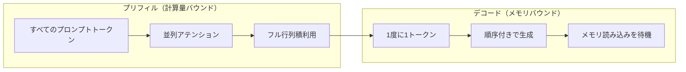
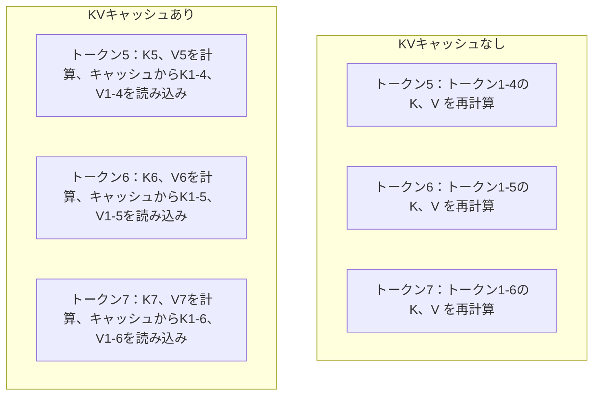
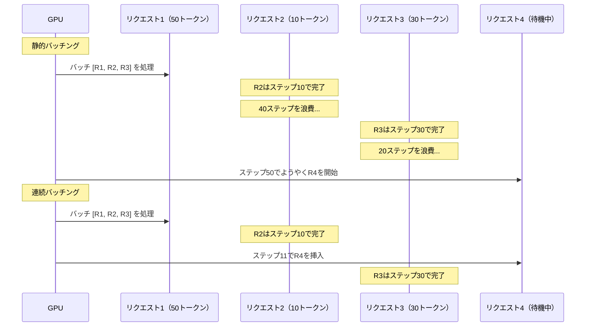
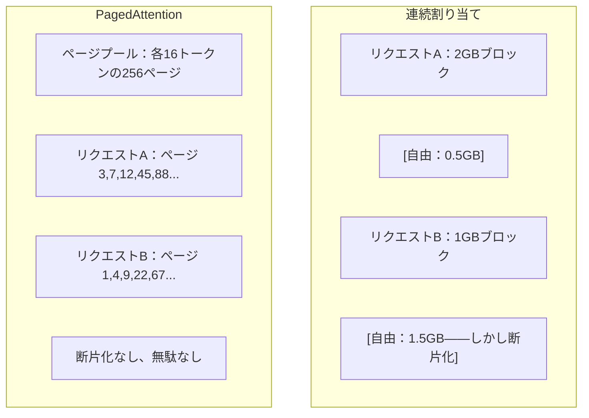
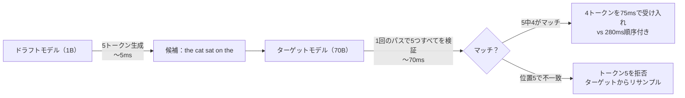

# 推論最適化

> LLM推論は2つのフェーズに分かれます。プリフィルはプロンプトを並列処理します（計算量バウンド）。デコードは1度に1トークン生成します（メモリバウンド）。すべての最適化はこの1つ、または両方をターゲットにしています。

**タイプ:** ビルド
**言語:** Python
**前提条件:** フェーズ10、レッスン01-08（トランスフォーマーアーキテクチャ、アテンション）
**所要時間:** 約120分

## 学習目標

- 自己回帰トークン生成中の冗長な計算を排除するためにKVキャッシュを実装する
- LLM推論のプリフィルとデコードフェーズを説明し、各フェーズが異なるボトルネック（計算量バウンドvs メモリバウンド）を持つ理由を理解する
- 連続バッチング処理とPagedAttentionの概念を実装し、同時リクエストの下でのGPU利用率を最大化する
- 推論最適化技術（KVキャッシュ、投機的デコーディング、Flash Attention）を比較し、スループット/レイテンシのトレードオフを理解する

## 問題

Llama 3 70BをA100 GPU 4台にデプロイします。単一ユーザーは1秒あたり約50トークンを取得します。速く感じます。その後、100人のユーザーが同時にエンドポイントにアクセスします。スループットは1ユーザーあたり3トークン/秒に低下します。あなたの月額$25,000のGPU請求額は、人間が入力する速度より遅い応答を提供しています。

1ユーザーから100ユーザーの間でモデル自体は変わりません。同じウェイト、同じアーキテクチャ、同じ数学です。変わるのは作業のスケジュール方法です。素朴な推論はGPUコンピュートの90%以上を浪費します。47番目のトークンを待つユーザーがバッチスロット全体を占有しながら、GPUメモリバスは行列積間でアイドル状態になります。一方、新しいユーザーの2,000トークンプロンプトはその死時間を有用なコンピュートで埋めることができます。

これはスケーリングの問題ではありません。スケジューリングの問題です。このレッスンのテクニック（KVキャッシング、連続バッチング、PagedAttention、投機的デコーディング、プリフィックスキャッシング）は、$25k/月の推論請求額と同じトラフィックを処理する$5k/月の請求額の差を生み出します。

vLLMでLlama 3 70BをA100-80GB 4台で提供するとき、低同時実行性では1ユーザーあたり約50トークン/秒を達成し、連続バッチング処理とPagedAttentionにより100同時リクエストで1ユーザーあたり15-25 TPS を維持します。これらの最適化なしでは、同じハードウェアはその同時実行性で1ユーザーあたり5 TPS を提供します。同じGPU、同じモデル、4倍のスループット。

## コンセプト

### プリフィルとデコード

すべてのLLM推論リクエストは2つの異なるフェーズを持ちます。

**プリフィル** は入力プロンプト全体を処理します。すべてのトークンが既知なので、アテンションは完全なシーケンス全体に渡って並列に計算できます。これは大規模な行列乗算です。GPUコアはビジーのままです。ボトルネックはコンピュート：ハードウェアが1秒あたり配信できるFLOPSの数です。A100は312 TFLOPS (BF16)を実行します。4,096トークンプロンプトの70Bモデルに対するプリフィルは単一A100で約400msかかります。

**デコード** は出力トークンを1度に1つ生成します。各新しいトークンは前のすべてのトークンに注目しますが、1回のフォワードパスで1トークンだけ生成されます。ウェイト行列はプリフィル中と同じサイズですが、行列の代わりに単一のベクトルでそれらを乗算しています。GPUコアはマイクロ秒で完了し、次のウェイトのバッチがメモリから到着するのを待ちます。ボトルネックはメモリバンド幅：モデルウェイトをHBMからコンピュートユニットにストリーミングできる速度です。A100は2 TB/s のバンド幅を持ちます。FP16の70Bモデルは140 GBです。モデル全体を1度読み込むには70msかかります。これが単一デコードステップの下限です。



**演算：バイト比** （算術強度とも呼ばれる）はこのトレードオフを捉えています。メモリから読み込まれたバイトあたりで実行する演算の数を測定します。

```
演算：バイト比 = トークンあたりのFLOPs / メモリから読み込まれたバイト
```

4,096トークンのバッチでプリフィル中に、読み込まれたウェイトあたり約4,096の乗算蓄積演算を実行します。比は高いです。あなたは計算量バウンドです。バッチサイズ1でのデコード中に、読み込まれたウェイトあたり約1つの演算を実行します。比は低いです。あなたはメモリバウンドです。

基本的な洞察：*デコードはメモリバウンドです。単一のトークンを生成するためにモデル全体を読むから*。下記のすべての最適化は、読む内容を減らすか、読み込みあたりで処理されるトークンのバッチを増やすか、読み込みを完全に避けるかのいずれかです。

### KVキャッシュ

アテンション中に、各トークンのクエリはすべての前のトークンのキーとバリューベクトルに注目します。キャッシュなしで、トークンNを生成するには前のすべてのN-1トークンのキーとバリュー投影を再計算する必要があります。トークン1はトークン2を生成するときに投影され、トークン3を生成するときに再度、トークン4を生成するときに再度投影されます。トークン1,000では、トークン1を合計999回投影しました。

KVキャッシュはすべての前のトークンからキーとバリュー投影を保存します。トークンNを生成するときに、トークンNのキーとバリューだけを計算し、トークン1からN-1の通常K/Vに連結します。



**KVキャッシュのメモリ式：**

```
KVキャッシュサイズ = 2 * num_layers * num_kv_heads * head_dim * seq_len * bytes_per_param
```

Llama 3 70B（80層、GQA付き8 KVヘッド、head_dim=128、BF16）の場合：

```
トークンあたり：2 * 80 * 8 * 128 * 2バイト = 327,680バイト = 320 KB
4,096トークン時：320 KB * 4,096 = 1.28 GB
128Kトークン時：320 KB * 131,072 = 40 GB
```

Llama 3 70Bの単一の128Kコンテキスト会話は40 GBのKVキャッシュを消費します。A100のメモリの半分です。100同時ユーザーが各4Kトークンを使用すると、KVキャッシュだけで128 GBが必要です。これはKVキャッシュ管理が推論最適化の中心的な課題である理由です。

### 連続バッチング処理

静的バッチングはNリクエストのバッチが到着するまで待機し、それらを一緒に処理し、*すべて* 完了するまで新しいリクエストを受け入れるまで待機します。1つのリクエストが500トークンを必要とし、別のリクエストが10を必要とする場合、短いリクエストは完了後490デコードステップの間アイドル状態になります。

連続バッチング処理（反復レベルバッチングとも呼ばれる）は、リクエストが完了するとすぐに新しいリクエストをバッチに挿入します。バッチは毎回のデコードステップで再評価されます。10トークン後に完了するリクエストは、待機中のリクエストですぐに置き換えられます。



スループット改善は出力長がどの程度異なるかに依存します。均一な長さの場合、連続バッチングは静的バッチングと一致します。可変長（一般的な場合）の場合、連続バッチングはGPUスロットが空にならないため、2～5倍高いスループットを提供できます。

### PagedAttention

各リクエストのKVキャッシュは連続メモリブロックです。リクエストが到着して出発するとき、メモリは断片化されます。オペレーティングシステムのRAM断片化とちょうど同じです。4Kトークンリクエストには1.28 GB連続が必要です。合計で2 GB自由があっても、1.28 GB *連続* がないかもしれません。メモリを浪費するかリクエストを拒否します。

PagedAttention（vLLMより）はKVキャッシュにOS スタイルの仮想メモリを適用します。リクエストあたり1つの連続ブロックを割り当てる代わりに、固定サイズの「ページ」（通常各16トークン）を割り当てます。ページは物理GPUメモリのどこでもあります。ページテーブルは各リクエストの論理シーケンス位置を物理ページ位置にマップします。



PagedAttentionはまた、共有プリフィックスの**コピーオンライト** を有効にします。50リクエストが同じシステムプロンプトを共有する場合、そのシステムプロンプトのKVキャッシュページは1度保存され、50リクエストすべてで参照されます。リクエストが分岐するだけで（異なるユーザーメッセージ）、独自のページを取得します。これは共有システムプロンプトを持つアプリケーションのメモリ使用量を劇的に削減します。

vLLMは、PagedAttentionにより、ほぼゼロのメモリ浪費（素朴な割り当てでは約4%対60-80%）を報告します。

### 投機的デコーディング

デコードは遅いのは順序付きだからです。1トークンを生成し、それをフィードバックし、次のトークンを生成します。しかし、次の5トークンを安価に推測し、それらすべてを1度に検証できるならどうでしょう？

投機的デコーディングは小さく、高速な**ドラフトモデル** を使用してKつの候補トークンを生成します。大きな**ターゲットモデル** はその後、すべてのK候補を単一のフォワードパスで処理します（プリフィルのように見えます――並列、計算量バウンド、効率的）。ターゲットモデルがドラフトモデルの予測に同意する場合、K個すべてのトークンを1つのターゲットフォワードパスの時間で受け入れます。位置jで同意しない場合、トークン1～j-1を受け入れて残りを破棄します。



スピードアップは**受容率** に依存します。ドラフトモデルの予測がターゲットと一致する頻度です。Llama 3 8B がLlama 3 70Bのドラフトをする場合、自然言語での受容率は70-85%が典型的です。これは2～3倍のデコードスピードアップに翻訳されます。

投機的デコーディングへの3つのアプローチ：

| 方法 | ドラフトソース | 受容率 | オーバーヘッド |
|--------|-------------|-----------------|----------|
| ドラフト-ターゲット（Leviathan等） | 別の小さいモデル | 70-85% | ドラフトモデルメモリ |
| EAGLE | ターゲットの軽量ヘッド | 75-90% | 約1%追加パラメータ |
| Nグラム検索 | トークンNグラムテーブル | 40-60% | 無視できる |

**EAGLE** はターゲットモデルの隠れた状態の上に小さい自己回帰ヘッドを訓練します。次のトークンの埋め込みをターゲットモデルの2番目から最後のレイヤ機能を使用して予測します。別のモデルの表現ではなくターゲットモデル独自の表現で演算するため、最小限の追加メモリで高い受容率を達成します。EAGLE-2はコンテキストに基づいて候補数を調整する動的ドラフトツリーを追加します。

**Nグラム投機的デコーディング** は現在のコンテキストまたは事前構築されたコーパスからのNグラム継続のテーブルを維持します。ドラフトが同じ会話で前に現れたもの（繰り返しパターン、コード、構造化出力）と一致する場合、ニューラルネットワークオーバーヘッドなしでそれが発生します。受容率は平均より低いですが、推測あたりのコスト本質的に無料です。

投機的デコーディングは *数学的に正確* です。出力分布はターゲットモデルの分布と同一です。それは近似ではありません。検証ステップは、すべての受け入れたトークンが、ターゲットモデルが割り当てた確率と正確にあることを保証します。

### プリフィックスキャッシング

多くのリクエストは同じプリフィックスを共有します。チャットボットシステムプロンプト。RAGコンテキストブロック。少数ショット例セット。プリフィックスキャッシングなしで、すべてのリクエストはこれらの共有トークンのKVキャッシュを最初から再計算します。

プリフィックスキャッシングは一般的なプリフィックスのKVキャッシュを保存し、リクエスト間で再利用します。既知のプリフィックスを持つ新しいリクエストが到着すると、システムは通常K/Vエントリをコピー（または参照）し、ユニークなサフィックスのみのKVを計算します。

2,000トークンシステムプロンプトはすべてのリクエスト間で共有され、プリフィックスキャッシングはリクエストあたり約400msのプリフィル計算を排除します。100リクエスト/秒では、これはGPU計算あたり40秒を節約します。1つのGPU分以上の作業。

SGLangのRadixAttentionはプリフィックスをそれらのトークンコンテンツでインデックス化する基数木（トライ）によってプリフィックスキャッシングを実装します。保存されたプリフィックスに一致するリクエストはその無料のKVキャッシュを取得します。ツリーは部分プリフィックスマッチを有効にします。2,000プリフィックストークンの1,500を通常エントリと共有する場合、1,500を再利用し、500のみを再計算します。

### 推論エンジン

3つのエンジンが本番LLM提供を支配します：

| エンジン | 主要なイノベーション | 最適用途 |
|--------|---------------|----------|
| vLLM | PagedAttention、連続バッチング | 一般的な提供、最高互換性 |
| SGLang | RadixAttention（プリフィックスキャッシング）、構造化生成 | マルチターンチャットボット、制約付きデコーディング |
| TensorRT-LLM | NVIDIAカーネルフュージョン、FP8量子化 | NVIDIAハードウェアのシングルGPU最大スループット |

**vLLM** はデフォルトの開始点です。モデルの最も広い範囲をサポートし、どのGPUベンダー（NVIDIA、AMD、Intel）でも実行でき、PagedAttention +連続バッチングにより強いスループットを達成します。OpenAI互換APIは、OpenAI APIコールの代わりにそれをドロップインできることを意味します。

**SGLang** はvLLMと同じ基礎上に構築しますが、プリフィックスキャッシングのためのRadixAttentionと構造化LLMプログラムのためのドメイン固有言語を追加します。あなたのワークロードがマルチターン会話、ツール使用、または制約付きデコーディング（JSON出力、正規表現ガイド生成）を含む場合、SGLangはプリフィックス再利用により2～5倍のパフォーマンスvLLMを上回ります。

**TensorRT-LLM** はモデルを最適化されたNVIDIA GPUカーネルにコンパイルします。演算を融合（アテンション+線形+活性化を1つのカーネルで）し、H100 GPUでFP8を使用し、本番デプロイメント用のNVIDIA Triton推論サーバーと統合します。NVIDIAハードウェア上のシングルGPU最大スループットを達成しますが、より多くのセットアップが必要で、NVIDIAの GPU のみで動作します。

Llama 3 70B（A100-80GB 4台、BF16）の実世界の数：

| メトリック | vLLM | SGLang | TensorRT-LLM |
|--------|------|--------|---------------|
| スループット（1ユーザー） | 約50 TPS | 約55 TPS | 約65 TPS |
| スループット（100ユーザー） | 約2,500総 TPS | 約3,200総 TPS | 約3,000総 TPS |
| 最初のトークンまでの時間 | 約400ms | 約300ms（プリフィックスヒット） | 約350ms |
| 最大コンテキスト | 128K | 128K | 128K |

### 演算：バイト框架

測定しないことは最適化できません。演算：バイト比は、あなたが計算量バウンドまたはメモリバウンドかどうかを教えて、どの最適化が重要かを決定します。

```
計算ルーフ：GPUのピークFLOPS
メモリルーフ： ピークバンド幅 * 演算：バイト比
```

演算：バイトが低い（デコード、小さいバッチ）とき、メモリバンド幅ルーフをヒットします。より多くのコンピュート（高いクロック、より多くのコア）を追加しても助けになりません。メモリ読み込みを減らす（量子化、KVキャッシュ圧縮）か、バッチサイズを増やして、より有用な作業全体に読み込みを分割する必要があります。

演算：バイトが高い（プリフィル、大きいバッチ）とき、計算ルーフをヒットします。メモリバンド幅最適化は助けになりません。より速いGPU、カーネルフュージョン、または低精度でより多くのFLOPSを絞る必要があります。

| シナリオ | 演算：バイト | バウンド | 最適化対象 |
|----------|----------|-------|---------------|
| プリフィル、バッチ=1 | 約4,096 | 計算 | カーネルフュージョン、FP8 |
| デコード、バッチ=1 | 約1 | メモリ | 量子化、KVキャッシュ圧縮 |
| デコード、バッチ=32 | 約32 | メモリ | より大きいバッチ、連続バッチング |
| デコード、バッチ=256 | 約256 | 推移中 | 両方重要 |
| デコード、バッチ=1024 | 約1,024 | 計算 | カーネルフュージョン、テンサーパラレリズム |

A100のクロスオーバーポイントは約演算：バイト = 156（312 TFLOPS / 2 TB/s）です。156以下の場合、メモリバウンドです。156以上の場合、計算量バウンドです。連続バッチングはイテレーション毎により多くのトークンをパックしてデコードをこのクロスオーバーに向かわせます。

## ビルド

### ステップ1：スクラッチからKVキャッシュ

マルチヘッドKVキャッシュを構築して、層、ヘッド毎のキーとバリュー投影を保存し、メモリ成長パターンを実証します。

```python
import numpy as np

class KVCache:
    def __init__(self, num_layers, num_heads, head_dim, max_seq_len, dtype=np.float16):
        self.num_layers = num_layers
        self.num_heads = num_heads
        self.head_dim = head_dim
        self.max_seq_len = max_seq_len
        self.dtype = dtype

        self.k_cache = np.zeros(
            (num_layers, num_heads, max_seq_len, head_dim), dtype=dtype
        )
        self.v_cache = np.zeros(
            (num_layers, num_heads, max_seq_len, head_dim), dtype=dtype
        )
        self.seq_len = 0

    def update(self, layer_idx, new_keys, new_values):
        num_new = new_keys.shape[1]
        end = self.seq_len + num_new
        self.k_cache[layer_idx, :, self.seq_len:end, :] = new_keys
        self.v_cache[layer_idx, :, self.seq_len:end, :] = new_values
        return (
            self.k_cache[layer_idx, :, :end, :],
            self.v_cache[layer_idx, :, :end, :]
        )

    def advance(self, num_tokens):
        self.seq_len += num_tokens

    def memory_bytes(self):
        return self.k_cache.nbytes + self.v_cache.nbytes

    def used_bytes(self):
        per_token = 2 * self.num_layers * self.num_heads * self.head_dim * np.dtype(self.dtype).itemsize
        return per_token * self.seq_len
```

### ステップ2：KVキャッシュでのアテンション

デコードステップのためにKVキャッシュを使用する簡略化されたマルチヘッドアテンション。

```python
def scaled_dot_product_attention(query, keys, values):
    head_dim = query.shape[-1]
    scores = np.matmul(query, keys.transpose(0, 1, 3, 2)) / np.sqrt(head_dim)
    seq_len_q = scores.shape[-2]
    seq_len_k = scores.shape[-1]
    if seq_len_q > 1:
        mask = np.triu(np.ones((seq_len_q, seq_len_k), dtype=np.float32), k=seq_len_k - seq_len_q + 1)
        scores = scores + mask * (-1e9)
    max_scores = np.max(scores, axis=-1, keepdims=True)
    exp_scores = np.exp(scores - max_scores)
    attn_weights = exp_scores / np.sum(exp_scores, axis=-1, keepdims=True)
    return np.matmul(attn_weights, values)


class MultiHeadAttention:
    def __init__(self, d_model, num_heads):
        self.num_heads = num_heads
        self.head_dim = d_model // num_heads
        scale = np.sqrt(2.0 / d_model)
        self.W_q = np.random.randn(d_model, d_model).astype(np.float32) * scale
        self.W_k = np.random.randn(d_model, d_model).astype(np.float32) * scale
        self.W_v = np.random.randn(d_model, d_model).astype(np.float32) * scale
        self.W_o = np.random.randn(d_model, d_model).astype(np.float32) * scale

    def forward(self, x, kv_cache=None, layer_idx=0):
        batch, seq_len, d_model = x.shape
        Q = np.matmul(x, self.W_q).reshape(batch, seq_len, self.num_heads, self.head_dim).transpose(0, 2, 1, 3)
        K = np.matmul(x, self.W_k).reshape(batch, seq_len, self.num_heads, self.head_dim).transpose(0, 2, 1, 3)
        V = np.matmul(x, self.W_v).reshape(batch, seq_len, self.num_heads, self.head_dim).transpose(0, 2, 1, 3)

        if kv_cache is not None:
            K_full, V_full = kv_cache.update(layer_idx, K[0], V[0])
            K = K_full[np.newaxis, :, :, :]
            V = V_full[np.newaxis, :, :, :]
            if seq_len == 1:
                kv_cache.advance(1)

        attn_out = scaled_dot_product_attention(Q, K, V)
        attn_out = attn_out.transpose(0, 2, 1, 3).reshape(batch, -1, d_model)
        return np.matmul(attn_out, self.W_o)
```

### ステップ3：連続バッチング処理シミュレーター

これは静的バッチングと連続バッチング処理の間のスケジューリング差をシミュレートします。

```python
import heapq

class Request:
    def __init__(self, request_id, prompt_tokens, output_tokens, arrival_step):
        self.request_id = request_id
        self.prompt_tokens = prompt_tokens
        self.output_tokens = output_tokens
        self.arrival_step = arrival_step
        self.tokens_generated = 0
        self.start_step = None
        self.end_step = None

    def is_done(self):
        return self.tokens_generated >= self.output_tokens


def simulate_static_batching(requests, batch_size):
    step = 0
    completed = []
    queue = list(requests)
    queue.sort(key=lambda r: r.arrival_step)

    while queue:
        batch = []
        while queue and len(batch) < batch_size:
            r = queue.pop(0)
            r.start_step = max(step, r.arrival_step)
            batch.append(r)

        if batch:
            step = max(step, max(r.start_step for r in batch))
            max_output = max(r.output_tokens for r in batch)
            for r in batch:
                r.tokens_generated = r.output_tokens
                r.end_step = step + max_output
            step += max_output
            completed.extend(batch)

    return completed


def simulate_continuous_batching(requests, batch_size):
    step = 0
    completed = []
    queue = sorted(requests, key=lambda r: r.arrival_step)
    queue_idx = 0
    active = []
    waiting = []

    while queue_idx < len(queue) or active or waiting:
        while queue_idx < len(queue) and queue[queue_idx].arrival_step <= step:
            waiting.append(queue[queue_idx])
            queue_idx += 1

        while waiting and len(active) < batch_size:
            r = waiting.pop(0)
            r.start_step = step
            active.append(r)

        if not active:
            if waiting:
                step += 1
                continue
            elif queue_idx < len(queue):
                step = queue[queue_idx].arrival_step
                continue
            else:
                break

        for r in active:
            r.tokens_generated += 1

        done = [r for r in active if r.is_done()]
        for r in done:
            r.end_step = step + 1
            completed.append(r)
        active = [r for r in active if not r.is_done()]

        step += 1

    return completed


def batching_stats(completed):
    latencies = [r.end_step - r.arrival_step for r in completed]
    total_time = max(r.end_step for r in completed) - min(r.arrival_step for r in completed)
    total_tokens = sum(r.output_tokens for r in completed)
    return {
        "avg_latency": np.mean(latencies),
        "p50_latency": np.median(latencies),
        "p99_latency": np.percentile(latencies, 99),
        "total_time": total_time,
        "throughput": total_tokens / total_time if total_time > 0 else 0,
    }
```

### ステップ4：プリフィックスキャッシュ

共有プリフィックスのKVエントリを保存するトライベースプリフィックスキャッシュ。

```python
class TrieNode:
    def __init__(self):
        self.children = {}
        self.kv_data = None
        self.hit_count = 0


class PrefixCache:
    def __init__(self, max_entries=1000):
        self.root = TrieNode()
        self.max_entries = max_entries
        self.total_entries = 0
        self.hits = 0
        self.misses = 0

    def _walk(self, token_ids):
        node = self.root
        depth = 0
        for tid in token_ids:
            if tid not in node.children:
                break
            node = node.children[tid]
            depth += 1
        return node, depth

    def lookup(self, token_ids):
        node, depth = self._walk(token_ids)
        if depth > 0:
            self.hits += 1
            current = self.root
            for tid in token_ids[:depth]:
                current = current.children[tid]
                current.hit_count += 1
            kv_entries = []
            current = self.root
            for tid in token_ids[:depth]:
                current = current.children[tid]
                if current.kv_data is not None:
                    kv_entries.append(current.kv_data)
            return depth, kv_entries
        self.misses += 1
        return 0, []

    def insert(self, token_ids, kv_per_token):
        node = self.root
        for i, tid in enumerate(token_ids):
            if tid not in node.children:
                if self.total_entries >= self.max_entries:
                    return i
                node.children[tid] = TrieNode()
                self.total_entries += 1
            node = node.children[tid]
            if i < len(kv_per_token):
                node.kv_data = kv_per_token[i]
        return len(token_ids)

    def hit_rate(self):
        total = self.hits + self.misses
        return self.hits / total if total > 0 else 0.0
```

### ステップ5：投機的デコーディングシミュレーター

設定可能な受容率によるドラフト-ターゲット投機的デコーディングをシミュレートします。

```python
class DraftModel:
    def __init__(self, vocab_size, acceptance_rate=0.8):
        self.vocab_size = vocab_size
        self.acceptance_rate = acceptance_rate

    def generate(self, context, num_tokens):
        tokens = np.random.randint(0, self.vocab_size, size=num_tokens)
        return tokens

    def get_probs(self, context, token):
        probs = np.random.dirichlet(np.ones(self.vocab_size))
        return probs


class TargetModel:
    def __init__(self, vocab_size):
        self.vocab_size = vocab_size

    def get_probs(self, context, tokens=None):
        if tokens is not None:
            return [np.random.dirichlet(np.ones(self.vocab_size)) for _ in tokens]
        return np.random.dirichlet(np.ones(self.vocab_size))


def speculative_decode(draft_model, target_model, context, num_speculative=5,
                       draft_cost=1.0, target_cost=10.0, verify_cost=12.0):
    total_tokens = 0
    total_cost = 0.0
    accepted_counts = []
    context = list(context)

    max_tokens = 100

    while total_tokens < max_tokens:
        draft_tokens = draft_model.generate(context, num_speculative)
        total_cost += draft_cost * num_speculative

        target_probs = target_model.get_probs(context, draft_tokens)
        total_cost += verify_cost

        accepted = 0
        for i, token in enumerate(draft_tokens):
            draft_p = draft_model.get_probs(context + list(draft_tokens[:i]), token)
            target_p = target_probs[i]

            r = np.random.random()
            acceptance_prob = min(1.0, target_p[token] / (draft_p[token] + 1e-10))

            if r < draft_model.acceptance_rate:
                accepted += 1
                context.append(token)
                total_tokens += 1
            else:
                new_token = np.random.choice(draft_model.vocab_size, p=target_p)
                context.append(new_token)
                total_tokens += 1
                break

        accepted_counts.append(accepted)

        if accepted == num_speculative:
            bonus_probs = target_model.get_probs(context)
            bonus_token = np.random.choice(draft_model.vocab_size, p=bonus_probs)
            context.append(bonus_token)
            total_tokens += 1

    sequential_cost = total_tokens * target_cost
    return {
        "total_tokens": total_tokens,
        "speculative_cost": total_cost,
        "sequential_cost": sequential_cost,
        "speedup": sequential_cost / total_cost if total_cost > 0 else 1.0,
        "avg_accepted": np.mean(accepted_counts),
        "acceptance_rate": np.mean(accepted_counts) / num_speculative,
    }


def compare_speculation_strategies(vocab_size=1000, num_trials=20):
    results = {}

    for name, acceptance_rate, spec_tokens in [
        ("ドラフト-ターゲット（8B->70B）", 0.78, 5),
        ("EAGLE", 0.85, 6),
        ("Nグラム", 0.50, 4),
        ("投機なし", 0.0, 0),
    ]:
        if spec_tokens == 0:
            results[name] = {
                "speedup": 1.0,
                "acceptance_rate": 0.0,
                "avg_accepted": 0.0,
            }
            continue

        trial_results = []
        for _ in range(num_trials):
            draft = DraftModel(vocab_size, acceptance_rate=acceptance_rate)
            target = TargetModel(vocab_size)
            context = list(np.random.randint(0, vocab_size, size=10))
            result = speculative_decode(draft, target, context, num_speculative=spec_tokens)
            trial_results.append(result)

        results[name] = {
            "speedup": np.mean([r["speedup"] for r in trial_results]),
            "acceptance_rate": np.mean([r["acceptance_rate"] for r in trial_results]),
            "avg_accepted": np.mean([r["avg_accepted"] for r in trial_results]),
        }

    return results
```

### ステップ6：KVキャッシュメモリプロファイラー

実際のモデル構成のKVキャッシュメモリ要件を計算します。

```python
MODEL_CONFIGS = {
    "Llama-3-8B": {
        "num_layers": 32, "num_kv_heads": 8, "head_dim": 128,
        "model_params_b": 8, "gqa": True,
    },
    "Llama-3-70B": {
        "num_layers": 80, "num_kv_heads": 8, "head_dim": 128,
        "model_params_b": 70, "gqa": True,
    },
    "Llama-3-405B": {
        "num_layers": 126, "num_kv_heads": 8, "head_dim": 128,
        "model_params_b": 405, "gqa": True,
    },
    "Mistral-7B": {
        "num_layers": 32, "num_kv_heads": 8, "head_dim": 128,
        "model_params_b": 7, "gqa": True,
    },
    "GPT-4-est": {
        "num_layers": 120, "num_kv_heads": 96, "head_dim": 128,
        "model_params_b": 1800, "gqa": False,
    },
}


def kv_cache_memory(config, seq_len, dtype_bytes=2):
    per_token = 2 * config["num_layers"] * config["num_kv_heads"] * config["head_dim"] * dtype_bytes
    total = per_token * seq_len
    return {
        "per_token_bytes": per_token,
        "per_token_kb": per_token / 1024,
        "total_bytes": total,
        "total_mb": total / (1024 ** 2),
        "total_gb": total / (1024 ** 3),
    }


def memory_budget(config, gpu_memory_gb, model_dtype_bytes=2, kv_dtype_bytes=2):
    model_memory_gb = config["model_params_b"] * 1e9 * model_dtype_bytes / (1024 ** 3)
    overhead_gb = gpu_memory_gb * 0.1
    available_for_kv = gpu_memory_gb - model_memory_gb - overhead_gb

    if available_for_kv <= 0:
        return {"error": "モデルはGPUメモリに適合しません", "model_memory_gb": model_memory_gb}

    per_token = 2 * config["num_layers"] * config["num_kv_heads"] * config["head_dim"] * kv_dtype_bytes
    max_tokens = int(available_for_kv * (1024 ** 3) / per_token)

    return {
        "gpu_memory_gb": gpu_memory_gb,
        "model_memory_gb": round(model_memory_gb, 1),
        "overhead_gb": round(overhead_gb, 1),
        "available_for_kv_gb": round(available_for_kv, 1),
        "max_total_tokens": max_tokens,
        "max_users_at_2k": max_tokens // 2048,
        "max_users_at_4k": max_tokens // 4096,
        "max_users_at_32k": max_tokens // 32768,
    }
```

## 使用方法

vLLMで：

```python
from vllm import LLM, SamplingParams

llm = LLM(
    model="meta-llama/Llama-3-70B-Instruct",
    tensor_parallel_size=4,
    enable_prefix_caching=True,
    max_model_len=8192,
    gpu_memory_utilization=0.9,
)

params = SamplingParams(temperature=0.7, max_tokens=256)
outputs = llm.generate(["1段落で推論最適化を説明してください。"], params)
```

プリフィックスキャッシング+構造化出力のためにSGLangで：

```python
import sglang as sgl

@sgl.function
def classify(s, text):
    s += sgl.system("あなたは分類器です。JSONのみを出力してください。")
    s += sgl.user(f"このテキストを分類してください：{text}")
    s += sgl.assistant(sgl.gen("result", regex=r'\{"label": "(positive|negative|neutral)"\}'))

runtime = sgl.Runtime(model_path="meta-llama/Llama-3-70B-Instruct", tp_size=4)
sgl.set_default_backend(runtime)

results = classify.run_batch([
    {"text": "この製品は素晴らしい！"},
    {"text": "ひどい経験。"},
    {"text": "まあまあだったかな。"},
])
```

TensorRT-LLMで：

```python
import tensorrt_llm
from tensorrt_llm.runtime import ModelRunner

runner = ModelRunner.from_dir("./llama-70b-trt-engine/", rank=0)

outputs = runner.generate(
    batch_input_ids=[tokenizer.encode("KVキャッシングを説明してください。")],
    max_new_tokens=256,
    temperature=0.7,
)
```

## 出荷する

このレッスンは以下を生成します：
- `outputs/skill-inference-optimization.md` -- LLM推論提供の診断と最適化のための技能

## 演習

1. KVキャッシュプロファイラーを修正してFP16対FP8対INT4 KVキャッシュ量子化を比較します。A100-80GB 4台上のLlama 3 70B 4Kコンテキストで、各々の最大同時ユーザーを計算します。KVキャッシュ量子化からINT4はおよそユーザー容量を4倍にするべきです。

2. 連続バッチング処理シミュレーターを拡張してGPU利用率（ステップあたりで満たされたバッチスロットの分数）を追跡します。静的バッチングと連続バッチング処理の両方で時間経過に対する利用率をプロット。出力長がパレート分布（形状=1.5、スケール=20）に従う50リクエストで。連続バッチング処理は>80%利用率を維持するべきです。

3. `num_kv_heads < num_query_heads` グループ化クエリアテンション（GQA）版のKVキャッシュを実装します。Llama 3 70B は 64 クエリヘッドを使用しますが、8 KV ヘッドのみです。完全なマルチヘッドアテンション対メモリ節約を計算します（KVキャッシュサイズで8倍削減）。

4. LRU削除を使用するプリフィックスキャッシュを構築します。max_entriesを500に設定し、1,000リクエストを生成、60%が5つの一般的なプリフィックスの1つを共有します。ヒットレートを測定して、無制限キャッシュと比較します。良い削除でヒットレートは55%を超えてとどまるべきです。

5. 投機的デコーディングシミュレーターを拡張してツリーベースの推測を実装（EAGLE-2スタイル）。Kドラフトトークンの単一の鎖の代わりに、候補のツリーを生成（例、3レベルの各2ブランチ=8葉候補）。検証ラウンドあたりで受け入れたトークン対線形推測の総数を比較します。

## 主要用語

| 用語 | 人々が言うこと | 実際に意味すること |
|------|----------------|----------------------|
| プリフィル | 「プロンプトを処理する」 | 完全な行列乗算がGPUコアをビジーに保つため、計算量バウンドだと、入力トークンすべてに渡ってアテンションを並列に計算 |
| デコード | 「トークンを生成する」 | フォワードパスあたり1トークン生成、毎回モデルウェイト全体を読む。計算が次のウェイトが到着する前に終わるため、メモリバウンド |
| KVキャッシュ | 「アテンション状態をキャッシュする」 | 前のトークンすべてのキーとバリュー投影を保存して、各デコードステップで再計算されないように。メモリとコンピュートのトレード |
| 連続バッチング処理 | 「ダイナミックバッチング」 | リクエストが完了するとすぐに実行中のバッチに新しいリクエストを挿入、毎回のデコード反復で評価。バッチ全体を待つ代わりに |
| PagedAttention | 「KVキャッシュ用仮想メモリ」 | 連続ブロックの代わり固定サイズの「ページ」でKVキャッシュを割り当て、メモリ断片化を排除。共有プリフィックスのコピーオンライト有効化 |
| 投機的デコーディング | 「ドラフト・検証」 | 高速ドラフトモデルを使用して複数トークンを提案、その後1つのターゲットモデルフォワードパスで検証。数学的に正確、2-3倍スピードアップ |
| EAGLE | 「自己投機的デコーディング」 | ターゲットモデル独自の隠れた状態の上に軽量ヘッドを訓練する投機的デコーディング変種、別のドラフトモデルより高い受容率達成 |
| プリフィックスキャッシング | 「システムプロンプトKVを再利用する」 | 一般的なプリフィックス（システムプロンプト、少数ショット例）のKVキャッシュエントリを保存、冗長なプリフィルをスキップするためにリクエスト間で再利用 |
| 演算：バイト比 | 「算術強度」 | コンピュート演算対メモリから読み込まれたバイト数の比。ワークロードが計算量バウンド（高比）またはメモリバウンド（低比）かを決定 |
| 最初のトークンまでの時間 | 「TTFT」 | リクエスト受け取りから最初の出力トークン生成までのレイテンシ。長いプロンプトのプリフィル時間が支配的 |

## 参考文献

- Kwon et al., "Efficient Memory Management for Large Language Model Serving with PagedAttention" (2023) -- vLLM論文はページ化されたKVキャッシュ管理を導入、今は推論提供のための業界標準
- Leviathan et al., "Fast Inference from Transformers via Speculative Decoding" (2023) -- ドラフト-検証推測がターゲットモデル分布を正確に生成しながら2-3倍スピードアップを達成することを証明する基礎論文
- Li et al., "EAGLE: Speculative Sampling Requires Rethinking Feature Uncertainty" (2024) -- 別のドラフトモデルの代わりターゲットモデル独自の機能の上にヘッドを訓練してより高い受容率達成
- Zheng et al., "SGLang: Efficient Execution of Structured Language Model Programs" (2024) -- プリフィックスキャッシング用RadixAttentionとマルチコールLLMプログラムのための教育モデルを導入
- Williams et al., "Roofline: An Insightful Visual Performance Model for Multicore Architectures" (2009) -- コンピュート対メモリボトルネックについて推論するために演算：バイト框架を正式化した元々のルーフラインペーパー
