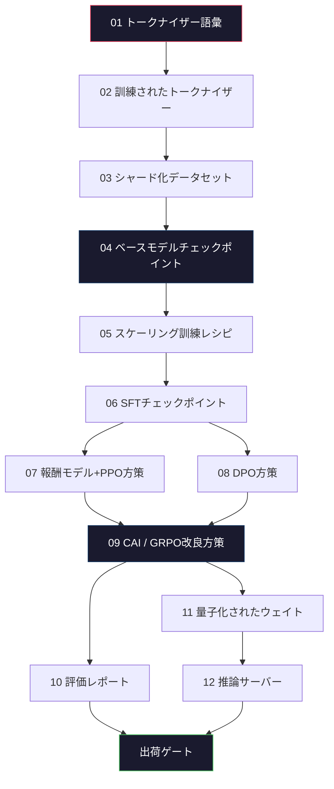
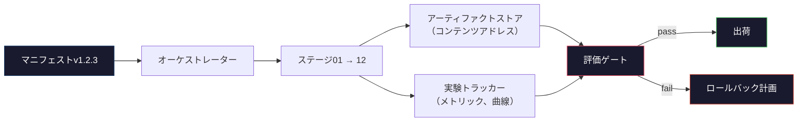

# 完全なLLMパイプラインを構築する

> レッスン01から12すべてが1つのパイプラインの1つのステージです。このレッスンはそれらのステージを単一のエンドツーエンド実行に変えるスキャフォルディングです：トークナイズ、事前学習、スケーリング、SFT、アライメント、評価、量子化、提供。ノートパソコンで70Bモデルを訓練することはありません。2026フロンティアチームが何が出荷されるかを決定するために使用するオーケストレーション層、マニフェスト、評価ゲート、ロールバックプランを生成します。これはキャップストーンです。

**タイプ:** ビルド
**言語:** Python（stdlib）
**前提条件:** すべてのフェーズ10レッスン01-12
**所要時間:** 約120分

## 学習目標

- 11の先行レッスン（トークナイザー、データ、事前学習、スケーリング、SFT、RLHF、DPO、CAI、評価、量子化、推論）を1つの再現可能なパイプライン仕様に構成する
- ステージ間のアーティファクトコントラクトを定義：各ステージが何を消費するか、何を生成するか、次のステージが入力をどのように検証するか
- 実験を追跡し、アーティファクトをハッシュし、評価閾値の出荷決定をゲートするオーケストレーターを構築する
- ロールバックプランを設計：どのアーティファクトが再実行が安いか、どのアーティファクトが高いか、破損したチェックポイントのコストは何か

## 問題

以前のレッスンはそれぞれ機能します。トークナイザー訓練済み。小さいGPT事前学習済み。SFTデータセット組み立て済み。報酬モデル訓練済み。DPO実行。評価測定。量子化されたウェイト出力。推論サーバー起動。それぞれがノートブックです。各々が独自の慣例、独自の出力パス、独自のシードを持ちます。

フロンティア訓練実行はノートブックではありません。Llama 3 405Bはおおよそ54日間で3000万H100時間を要しました。DeepSeek-V3は主な事前学習実行で約280万H800時間を使用しました。その時間中、1つの破損したチェックポイント、1つのデータ汚染、1つの評価回帰はチームに1週間の計算時間と月のGPU予算の経費をかけることができます。チームがこれを生き残る方法はパイプライン衛生を通じてです：すべてのステージは決定的な入力、決定的な出力、マニフェスト、ハッシュ、ゲートを持ちます。

これがキャップストーンです。ノートパソコンでパイプラインをエンドツーエンド実行することはありません。ステージを調整するオーケストレーター、実行を説明するマニフェスト、出荷決定をゲートする検証者、単一のファイルからあなたの作業を再実行するサードパーティを可能にするリプレイプランを書きます。コードは小さい。規律は大きい。

パターンは100MパラメータからITパラメータまで変わらず拡張されます。同じ4つのコンポーネント（マニフェスト、オーケストレーター、評価ゲート、アーティファクトストア）はLlama 3を実行しまた趣味のGPTも実行します。違いは各ステージのコンフィグの内部の数の大きさ、パイプラインの形ではありません。

## コンセプト

### 12ステージ

すべてのフェーズ10レッスンはステージです。完全な依存グラフはここです。



ステージ07と08は並列実行できます。それ以外はすべてハード依存です。ステージ02（トークナイザー）の変更はすべての下流アーティファクトを無効化します。ステージ10（評価）の変更は出荷決定だけを無効化します。

### マニフェスト

マニフェストはそれを再生するのに十分完全に実行を説明する単一のファイルです。パイプラインが生成するものは何もマニフェスト内にない状態に依存するべきではありません。フィールドは退屈で必須です。

```
pipeline_version: 1.2.3
seed: 42
git_commit: a1b2c3d4
stages:
  01_tokenizer:
    recipe: bpe_32k
    input_hash: sha256:...
    output_hash: sha256:...
    wall_clock_sec: 3600
    cost_usd: 12
```

ステージNの出力ハッシュはステージN+1の入力ハッシュです。任意の偏差とパイプラインが停止します。これはデータ破損を早期に捕捉する方法です。また異なる大陸のチームメートがそれらの再生が同じアーティファクトをあなたのものとして生成したことを確認する方法です。

実践では、チームは小さいYAMLスキーマとマニフェストチェッカーを使用し、前の成功した実行と比較します。予期されたフィールド（コスト、計算時間）の外の任意のデルタは赤旗です。

### アーティファクトタイピング

各ステージの出力は型付きアーティファクトです。ディレクトリブロブ、ピックル、名前付き型で既知のスキーマではなく。

| ステージ | アーティファクト型 | 主要フィールド |
|-------|--------------|-----------|
| 01-02 | トークナイザー | vocab.json、merges.txt、config.json、ハッシュ |
| 03 | データセット | シャード[]、行数、トークン数、重複削除統計 |
| 04-05 | チェックポイント | weights.safetensors、config.json、オプティマイザ状態、ステップ数 |
| 06 | SFTモデル | チェックポイント+SFTレシピ+データミックス |
| 07 | 報酬モデル | RMチェックポイント+優先度データハッシュ |
| 08-09 | 方策 | チェックポイント+参照ハッシュ+ベータ+KL予算消費 |
| 10 | 評価レポート | ベンチマークスコア+回帰差分+評価データハッシュ |
| 11 | 量子化モデル | 量子化ウェイト+キャリブレーションデータ+FP16対精度デルタ |
| 12 | サーバー仕様 | エンドポイント+モデルハッシュ+コンフィグ+観測可能性フック |

タイピングは最も一般的な失敗モードを防止します：ステージ08出力をステージ06入力として使用すること、DPO訓練されたモデルをSFTパス経由で出荷。型付きアーティファクトと型付きステージシグネチャはこれらのエラーをコンパイルタイム失敗にする、5日目失敗ではなく。

### 評価ゲート

出荷は「訓練完了」ではありません。出荷は「訓練完了して評価ゲートが合格」です。ゲートは実行開始前に定義されます。

```
gates:
  mmlu:      >= baseline + 0.5   # 回帰なし
  humaneval: >= baseline + 1.0
  truthfulqa: >= baseline         # ドロップなし
  safety_refusal_rate: <= 0.05
  kl_from_reference: <= 25.0
  cost_total_usd: <= 50000
```

すべてのゲートは数値閾値です。「よさそう」ゲートなし。主観的なサインオフなし。すべてのゲートが合格すると、アーティファクトは出荷可能にマークされます。任意のゲートが失敗すると、実行は名前付きレビュアーによる明示的なオーバーライドを待機して保留されます。これは独自にマニフェストに記録されます。

2つのゲートがほとんどの災害を捕捉します。*回帰* ゲート（新しいモデルはコアベンチマーク上で最後のものと同じくらい良い必要があります）訓練バグを捕捉します。*KLバジェット* ゲート（アライメントされた方策はその参照からX以上遠く漂う必要があります）アライメントオーバークッキングを捕捉します。すべての本番パイプラインはしません。

### オーケストレーター

マニフェストを読み、ステージを派遣し、アーティファクトを追跡し、任意のコントラクト違反で停止する小さいコード。これはAirflowではありません。これはKubeflowではありません。パイプライン衛生のために、あなたが書いた退屈なことがほしい。

オーケストレーターのジョブは狭い：

1. マニフェストからDAGを解決します。
2. 各ステージについて、予期された出力が正しいハッシュで既に存在するかチェック（存在する場合はスキップ）。
3. ステージを実行し、stdout/stderrをキャプチャ、計算時間とコストを測定。
4. 出力ハッシュを下流ステージの予期された入力ハッシュに対して検証。
5. 失敗時、正確に失敗中のステージと部分的なマニフェストを書き、ゼロ以外で終了。

これは200行のPythonです。ファイル `code/main.py` をこのレッスン内で見てください。本番パイプラインは個別ステージを実行するために `torchrun` または `ray` を使用します。しかしオーケストレーター自体は単一のボックスで実行します。

### 実験トラッキングとアーティファクトストレージ

2つの外部システムパイプラインを固定します。

**実験トラッカー（wandb、neptune、mlflow）。** 損失曲線、評価メトリック、ステージあたりのシステムテレメトリをログ。トラッカーはあなたが3週間後に実行A対実行Bを比較するのが必要な場所です。チームはほぼ常にこれのためにホストされたトラッカーを使用する。独自のものを書くと訓練に必要な時間を失う。

**アーティファクトストア（S3、R2、GCS）。** チェックポイント、データセット、トークナイザー、評価レポートのための不変オブジェクトストア。アーティファクトはファイル名ではなくハッシュで対応されます。`latest.pt` のようなファイル名は足回しガン。`ckpt-7b-step-20000-sha256:abc123.safetensors` はコントラクトです。

オーケストレーターは両方に書きます。トラッカーはグラフを見ている人間のためです。アーティファクトストアは入力を検索している次のステージのためです。

### コスティング

フロンティア実行は一緒に付けた1ドル番号を持ちます。予算規律は2つの場所で起こります。

**実行前推定。** マニフェストから、予期されるFLOPs（事前学習の場合：6 x params x tokens）、予期されるGPU時間（FLOPs / ピークスループット / 利用率）、現在のレンタルレートでのドルコストを計算します。推定が予算ゲートを超える場合、パイプラインは開始を拒否します。

**実行中追跡。** ステージごとに計算時間とコストはマニフェストに記録されます。すべてのステージの後、残りの予算がチェックされます。ステージが超過した場合、次のステージのゲートは新しい残りの予算で評価されます。VCが呼び出しするとき、あなたはお金がなくなったことを見つけません。

Llama 3の報告されたコストは$61Mでした。DeepSeek-V3は主な事前学習実行で$5.6Mを報告しました。比率はほぼハードウェア効率とMoE――しかし具体的なコストは両方のチームがそれを実行あたりではなくステージあたりで追跡したため目に見えます。

### 再現可能性対決定論

これらは同じではありません。*再現可能* は同じマニフェスト+同じコード+同じインフラストラクチャが等価なダウンストリームメトリックを持つチェックポイントを生成することを意味します。*決定論的* はビットアイデンティカル出力を意味します。

最新のLLM訓練は再現可能ですが決定論的ではありません。分散訓練の削減順序、GPUカーネル非決定論（cuBLAS、flash-attn）、混合精度丸め値が実行間で1e-5レベルで異なるフロートを生成するために結合します。これは最終メトリックのために罰金です。ビットレベルdiffでデバッグしようとしている場合、致命的です。治療はすべてのステージの入力ハッシュ、出力ハッシュ、見出しメトリックをログすることです。それらが一致すると、実行は「再現」される偶数ウェイトがビットアイデンティカルでなくても。



### ロールバック計画

実行開始前に、各ステージの失敗時に何が起こるかを書き下ろします。3つのカテゴリー。

- **再実行が安い**（時間）：トークナイザー、評価、量子化、推論サーバー。ちょうど再実行。
- **中間**（日）：SFT、DPO、CAI。ベースモデルを保持。アライメントステージのみを再実行。
- **高い**（週と百万ドル）：事前学習。ロールバック計画はここに「再実行」ではありません。「最後の良いチェックポイントを使用して、改訂されたデータでより安い下流ステージのみを再実行」です。

ステージの依存関係が型付きとハッシュされているため、オーケストレーターはロールバックセットを自動的に計算できます：失敗したステージとすべての子孫を無効化。ステージ06（SFT）の失敗は06、07、08、09、10、11、12を無効化します。ステージ11（量子化）の失敗は11と12のみを無効化します。これを事前に命名は、チームが朝4時に疲れているときに即席を避けます。

### 2026で観察された本番レシピ

ほとんどのフロンティアチームは同じスケルトンに収束しました。

- トークナイザー：バイトフォールバック付き128k BPE。小さい、バランスの取れた多言語スライスで訓練。
- 事前学習：10-20Tトークン、主にウェブ+コード+合成。MuonまたはAdamWオプティマイザ。FSDP2またはDeepSpeed ZeRO-3。勾配チェックポイント。BF16ウェイト、FP32マスター。
- SFT：500k-2M命令ペア、混合人間と合成、評価セット対厳密な重複削除。
- アライメント：DPOまたはCAI+GRPO。RLHF優先信号は多次元すぎてDPOに対して。
- 評価：MMLU-Pro、MATH、HumanEval+、GPQA、SWE-Bench Verified、LiveBench、プラス公開が決して見ないプライベート保留セット。
- 量子化：提供するための4ビットGPTQまたはAWQ、精度デルタが重要である安全評価のための8ビット。
- 提供：vLLM、TensorRT-LLM、または社内。連続バッチング処理。投機的デコーディング。KVキャッシュ削除。

数字は6ヶ月毎に変わります。スケルトンはしません。

## ビルド

レッスンのコードは12の訓練スクリプトではなくオーケストレーターとマニフェストチェッカーです。各ステージは正しい形とハッシュで出力アーティファクトを生成するプレースホルダーでシミュレートされます。パイプラインのプラミングが本当のステージでGPUお金を燃やす前に機能することをエンドツーエンド実行オーケストレーターが証明します。

完全な実装のために `code/main.py` を見てください。主要な部品：

- `Manifest` データクラス：パイプラインバージョン、シード、gitコミット、ステージ、ゲート。
- `Stage` データクラス：名前、型、入力（ハッシュ）、出力（ハッシュ）、計算時間、コスト。
- `Orchestrator.run()`：DAGを解決、ステージを派遣、ハッシュを検証、マニフェストを更新。
- `EvalGate.check()`：閾値を読み、最新の評価レポートに対して比較、pass/failを返す。
- `ArtifactStore`（メモリ内スタブ）：ハッシュにより put/get、S3をシミュレート。
- `CostTracker`：ステージあたりと累積、キャップを超過するとき停止。

`main.py` 内のパイプラインは12のプレースホルダーステージを実行、マニフェストを生成、失敗中の評価ゲートを行い、保留実行がどのように見えるかを表示します。各プレースホルダーを対応するレッスンからの本当の訓練スクリプトでスワップし、あなたは本当のフロンティアパイプラインが使用するスケルトンを持ちます。

## 使用方法

正規ワークフローは3つのコマンドを持ちます。

```
python code/main.py plan    # マニフェストを検証、コスト推定を計算、DAGを出力
python code/main.py run     # ステージを実行、manifest.out.yamlに書き込み
python code/main.py gate    # manifest.out.yamlを読む、評価ゲートを適用、出荷または保留
```

毎回最初に `plan` を実行します。ほとんどのパイプラインバグが計画時間に表示されます。ゲート閾値がなく、ハッシュが古く、予算オーバーランは。`plan` を実行することは無料です。`run` を実行することは高い。安い側でバグを捕捉してお金を節約します。

`gate` の出力は `SHIP` または `HOLD: <reason>` です。保留実行は失敗ではありません。それは決定ポイントです。名前付きレビュアーは上書き（そして上書きはログされます）、またはロールバックを承認します。

## 出荷

このレッスンは `outputs/skill-llm-pipeline-reviewer.md` を生成します。提案されたパイプラインマニフェストをそれに与え、それはすべてのコントラクトをチェック：ステージ型、ハッシュ鎖、ゲート、ロールバック計画、コスト推定。それは評価ゲート、無限KLバジェット、または評価とトレーニングデータを混ぜている実行が欠けているマニフェストを承認するのを拒否します。

## 演習

1. オーケストレーターをステージ07と08の並列実行をサポートするように拡張します。stdlibの `concurrent.futures` モジュールを使用します。最終的なマニフェストが両方のステージの出力を記録し、ステージ09の入力ハッシュが両方の決定論的組み合わせであることを確認します。

2. 「汚染チェック」ゲートを追加します。評価データセットハッシュと訓練データセットシャードを与えられ、重複を計算（正確な文字列マッチまたは13グラムマッチ）。重複が0.1%を超える場合ゲートが失敗します。汚染された訓練セットをそれに与え、ゲートが実行を保留することを確認します。

3. 最初の原理からコスト推定量を実装します。ステージ04（事前学習）の場合、FLOPsを6 x params x tokensとして推定、H100での40%MFU（モデルFLOPs利用率）を仮定、BF16で989 TFLOPs、$2.50/GPU時間。2Tトークンで訓練された7Bモデルの推定を報告します。公開されたLlama 2の数と比較します。

4. 部分的ロールバックを構築します。ステージ09（CAI）での失敗をシミュレート、その後ステージ09から12を再実行しながら01-08をキャッシュで放置。オーケストレーターはハッシュによるキャッシュされたアーティファクトを検出し、それらをスキップするべきです。完全な再実行対計算時間が節約される測定。

5. 観測可能性を追加します。各ステージのOpenTelemetryスパンを発行、パラメータ、見たトークン、損失、コストの属性とともに。ローカルコレクターにスパンをパイプします。ポイントはダッシュボードではありません。ポイントはすべてのステージの健康が単一のトレースIDから追跡可能であるということです。

## 主要用語

| 用語 | 人々が言うこと | 実際に意味すること |
|------|----------------|----------------------|
| マニフェスト | 「レシピファイル」 | パイプラインバージョン、シード、ステージあたりのコンフィグ、ゲート閾値を説明するYAMLまたはJSON。実行を再生するのに十分 |
| コンテンツアドレス | 「名前でなくハッシュで」 | アーティファクトはそれらのコンテンツのSHA-256により保存され、バージョンA対バージョンBを決して混同できません |
| 評価ゲート | 「出荷基準」 | アーティファクトが出荷可能にマークされる前に合格する必要があるベンチマークメトリック数値閾値と安全スコア |
| KLバジェット | 「アライメントがどの程度漂ったか」 | アライメント段階を横切った累積KL(方策 \|\| 参照)のキャップ、ゲートとして施行 |
| MFU | 「GPUのどのくらいを使用したか」 | モデルFLOPs利用率――達成されたFLOPs対理論ピーク。40%は70B規模で典型的、55%は7B |
| ロールバック計画 | 「それが破く時に何をするか」 | 失敗時、ステージあたりの事前に書かれた一連のアクション：再実行、フォールバック、改訂入力で再訓練 |
| オーケストレーター | 「指揮者」 | マニフェストを読み、ステージを派遣、ハッシュを検証、任意のコントラクト違反で停止するプロセス |
| アーティファクトストア | 「ウェイト用バージョンS3」 | 不変コンテンツアドレスオブジェクトストア。チェックポイント、データセット、評価レポートの単一ソース真実 |
| 再現可能 | 「リプレイで同じメトリック」 | 異なるビットレベルウェイトしかし等価なダウンストリームメトリック。分散LLM訓練の現実的な目標 |
| コストゲート | 「Xを超えることができません」 | 実行前コスト推定プラス実行中トラッカー。推定が予算を超える場合、パイプラインは開始を拒否 |

## 参考文献

- [Dubey et al., 2024 -- "The Llama 3 Herd of Models"](https://arxiv.org/abs/2407.21783) -- データ、訓練、アライメント、評価を含むフロンティアパイプラインの最も詳細な公開説明
- [DeepSeek-AI, 2024 -- "DeepSeek-V3 Technical Report"](https://arxiv.org/abs/2412.19437) -- Llama 3クラス訓練の約1/10のコストで効率優先パイプライン
- [Kaplan et al., 2020 -- "Scaling Laws for Neural Language Models"](https://arxiv.org/abs/2001.08361) -- 元々のコンピュート-データ-パラメータスケーリング関係
- [Hoffmann et al., 2022 -- "Training Compute-Optimal Large Language Models (Chinchilla)"](https://arxiv.org/abs/2203.15556) -- Kaplanへの補正は最新データ予算を再キャリブレート
- [PyTorch FSDP2 documentation](https://pytorch.org/docs/stable/fsdp.html) -- PyTorch 2.4+でFSDP1を置き換えた分散訓練プリミティブ
- [Weights & Biases LLM Reports](https://wandb.ai/site/llms) -- オープンソースLLM実行のためのリアルマニフェストと実験トラッカー出力、テンプレートとして剽窃可能として有用
