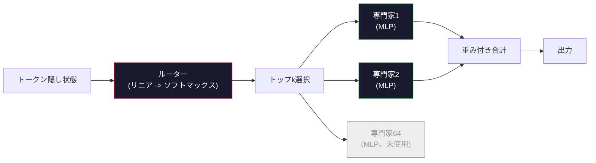

# オープンモデル:アーキテクチャのウォークスルー

> レッスン04でゼロからGPT-2 Smallを構築した。2026年のフロンティアオープンモデルは同じファミリーで5-6個の具体的な変更がある。LayerNormの代わりにRMSNorm。GELUの代わりにSwiGLU。学習された位置の代わりにRoPE。フルMHAの代わりにGQAまたはMLA。規模でのMixture-of-Experts。既に知っている数学は95%をカバーしている。このレッスンはLlama 3、DeepSeek-V3、Mixtral、Qwen、Gemmaを並行して読み、各アーキテクチャが分岐する正確なラインに名前を付ける。

**タイプ:** ラーン
**言語:** Python (標準ライブラリ)
**前提条件:** フェーズ10、レッスン04、05、12 (事前訓練、スケーリング、推論)
**所要時間:** 約45分

## 学習目標

- Llama 3、Mistral、Mixtral、Gemma 2、Qwen 2.5、DeepSeek-V3のconfig.jsonを読み、すべてのフィールドを説明する
- 各モデルがGPT-2 Smallに対して行った特定のアーキテクチャ変更に名前を付け、最初の原理から正当化する
- 任意のオープンモデルのパラメータ数、KVキャッシュサイズ、アクティベーションメモリをその設定だけから計算する
- レイテンシ、メモリ、能力制約を考慮して、展開ターゲットに適したオープンモデルを選択する

## 問題

レッスン04では350行のnumpyを書き、GPT-2型モデルを持っていた。Llama 3 405Bは200ページのテクニカルレポートを持っている。あなたの本能はこれらが異なるものだ。それらはない。200ページは同じオブジェクトを5-6個の良く動機づけられた修正と1000個のスケーリングについての実装の詳細で説明している。スケルトン--埋め込み、トランスフォーマーブロック、注意、MLP、norm、ヘッド--は変わらない。

このレッスンはdiffだ。主要なオープンモデルファミリーごと、GPT-2から何が変わったか、なぜ、何のコストであるかをリストアップした。完了したら、新しいモデルカードを読み、それをGPT-2ベースラインに精神的に変換できる。

実用的なペイオフはMetaがLlama 5をリリースするか、DeepSeekがV4をリリースするとき、新しい精神モデルが必要ではないということだ。設定を見て、既知のノブのどれが動いたかを見て、下流の影響を知る。2026年のアーキテクチャは有限のツールボックス。各新しいモデルは異なるサブセットを選ぶ。

## コンセプト

### 不変のコア

すべてのオートリグレッシブオープンモデルは共有する:

- トークン埋め込み行列(vocab_size x hidden_dim)。
- N個のデコーダブロックのスタック:norm、自己注意、残差、norm、MLP、残差。
- 最終normおよびvocab_sizeに投影するリニアヘッド(多くの場合、埋め込みと重み結合)。
- 因果マスク、次トークンクロスエントロピー損失。

それが形だ。残りはノブだ。

### 実際に動く6つのノブ

2024-2026のすべてのフロンティアオープンモデル全体で、同じ6つの設計選択が何度も何度も選ばれている:

1. **正規化。** LayerNorm -> RMSNorm。
2. **位置符号化。** 学習された絶対 -> RoPE (プラス亜種:YaRN、NTK)。
3. **活性化。** GELU -> SwiGLU (またはGeGLU)。
4. **注意ヘッド共有。** MHA -> GQA -> MQA -> MLA。
5. **密な vs スパースMLP。** Dense -> Mixture-of-Experts。
6. **事前ノーム配置。** 事前ノーム留まる。ポスト ノームは消えた。

他のすべて(学習率スケジュール、データミックス、バッチサイズ、コンテキスト長)は訓練設定に、アーキテクチャではない。6つのノブ。

### ノブ1:RMSNorm

LayerNormは平均を引く、stdで割る、スケール、シフト。RMSNormはスケールだけを保つ:

```
RMSNorm(x) = x / sqrt(mean(x^2) + eps) * gamma
```

平均減算なし。バイアスなし。トークンあたり1つのmatmul少ない。Zhang and Sennrich (2019)は機械翻訳でLayerNormに合致する間、10%高速を論じた。すべての最新のオープンモデルはそれを実行する。

コスト:なし。利点:小さなスループット勝利、よりシンプルなコード。

### ノブ2:RoPE

学習された位置埋め込みはGPT-2で1024スロットルックアップテーブルだった。コンテキスト1025はテーブルの終わり。モデルは訓練長を超えて外挿することはできない。

回転位置埋め込み(RoPE、Su et al. 2021)は各Q およびKベクトルを注意ドット積の前に対でペアで回転することにより位置を注入する。回転の角度は位置の決定論的関数で、学習されるものと使い果たされるものはない。スケーリングトリック(NTK-aware補間、YaRN)付き、8kコンテキストで訓練されたモデルは控えめな精度損失で推論で128kまで拡張できる。

```
q_rotated = rotate(q, angle(pos))
k_rotated = rotate(k, angle(pos))
score = q_rotated . k_rotated
```

すべてのLlama、Mistral、Qwen、DeepSeek、GemmaはRoPEを使用する。Gemma 2はハイブリッド(ほとんどのレイヤー上のRoPE、他の上のローカルスライディングウィンドウ注意)を使用する。

### ノブ3:SwiGLU

GPT-2のMLPは`x -> gelu(xW1 + b1) -> (...)W2 + b2`。SwiGLU (Shazeer 2020)はアクティベーションをゲート積に置き換える:

```
SwiGLU(x) = (xW1) * sigmoid(xW1) * xV
```

2つの平行な投影が1つの代わりに、Swish活性化でゲート。経験的にはパラメータあたりのパープレキシティでより強い。Llama 2はそれを採用し、誰もが続いた。MLPの隠しサイズは通常、元の密なMLPがパラメータ数に合致するように設定される:GPT-2がff_dim = 4 * hiddenを使用した場合、SwiGLUはff_dim = (2/3) * 4 * hidden = 8/3 * hiddenを使用する。

### ノブ4:注意ヘッド共有

GPT-2は**マルチヘッド注意(MHA)**を使用した:すべてのヘッドは独自のQ、K、V投影を持つ。

**マルチクエリ注意(MQA、Shazeer 2019)**すべてのヘッドの1つのKと1つのVを共有する。KVキャッシュをnum_heads切ってください、12倍から32倍削減。精度は固いベンチマークで少しドロップしている。

**グループ化されたクエリ注意(GQA、Ainslie et al. 2023)**中間地:Qヘッドのマグループは1つのKと1つのVを共有する。Llama 3 8BはGQAを使用して32個のQヘッドと8個のKVヘッド(G=8)を使用し、KVキャッシュはフルMHAと比較して4倍縮小する。

**マルチヘッドレーテント注意(MLA、DeepSeek 2024)**KとVを共有ロー ランクレーテントに圧縮し、ヘッドあたりで戻す。KVキャッシュをさらに削減しながら、ヘッドあたりの表現性を保持。DeepSeek-V2およびV3は長いコンテキストパフォーマンスのためにこれに依存する。

| スキーム | KVヘッド | KVキャッシュ | 精度 |
|--------|----------|----------|----------|
| MHA    | num_heads | 完全 | ベスト |
| GQA    | num_groups (G < num_heads) | num_heads / G削減 | 近いMHA |
| MQA    | 1 | num_heads削減 | 小さいヒット |
| MLA    | 潜在、ヘッドあたり減圧 | MQAより小さい | 近いMHA |

13B以上のパラメータのいくつかのモデルについて、GQAまたはMLAは効果的に必須。スケールでのフルMHAはKVキャッシュ災害だ。

### ノブ5:専門知識の混合

密なMLPはすべてのパラメータを毎トークンアクティベートする。MoE MLPはレイヤーあたりK個の専門家を持ち、ルーターはトークンあたりトップk個の専門家を選択する(通常トップ2)。それらの専門家の重みだけがそのトークンのフォワードパスを見る。

```
router_logits = xW_r
indices, weights = top_k(router_logits, k=2)
output = sum_i weights[i] * expert[indices[i]](x)
```

アピール:64人の専門家の各7B(つまり総パラメータ数は巨大)を持つことができる一方、毎トークン2人の実行(つまり、トークンごとのコンピュートは密な7Bモデルに合致)。Mixtral 8x7Bは総47Bパラメータを持つが、毎トークン13Bをアクティベートするだけ。DeepSeek-V3は671B総パラメータを持つが、毎トークン37Bをアクティベートするだけ。



プロス:同じコンピュート、より多くのパラメータ、より良い容量。コンス:専門家メモリはまだどこかに住む必要があります(サービング提供する密な等価より多くのVRAMが必要)、ルーターの負荷バランスは難しい、そして調整中ルーターの微調整は独自の研究エリアです。

### ノブ6:事前ノーム留まる

元のトランスフォーマーは各サブレイヤーの後にレイヤーノームを適用した。GPT-2以降のすべてのオープンモデルは各サブレイヤー*の前に*それを置く。事前ノームは深さで厳密にトレーニングしやすい。議論はない。

### モデルバイモデル差

ここはこれすべてを具体的にする表だ。

| モデル | 年 | 総パラメータ | 活性パラメータ | Norm | 活性化 | 位置 | 注意 | MoE | コンテキスト |
|-------|------|-------------|---------------|------|-----------|----------|-----------|-----|---------|
| GPT-2 Small | 2019 | 124M | 124M | LayerNorm | GELU | 学習 | MHA (12ヘッド) | いいえ | 1k |
| Llama 3 8B | 2024 | 8B | 8B | RMSNorm | SwiGLU | RoPE | GQA (32/8) | いいえ | 128k |
| Llama 3 70B | 2024 | 70B | 70B | RMSNorm | SwiGLU | RoPE | GQA (64/8) | いいえ | 128k |
| Llama 3 405B | 2024 | 405B | 405B | RMSNorm | SwiGLU | RoPE | GQA (128/16) | いいえ | 128k |
| Mistral 7B | 2023 | 7.2B | 7.2B | RMSNorm | SwiGLU | RoPE | GQA | いいえ | 32k |
| Mixtral 8x7B | 2023 | 47B | 13B | RMSNorm | SwiGLU | RoPE | GQA | はい (8専門家、トップ2) | 32k |
| Gemma 2 9B | 2024 | 9B | 9B | RMSNorm (プレ+ポスト) | GeGLU | RoPE +スライディング | GQA | いいえ | 8k |
| Qwen 2.5 72B | 2024 | 72B | 72B | RMSNorm | SwiGLU | RoPE (YaRN) | GQA (64/8) | いいえ | 128k |
| DeepSeek V2 236B | 2024 | 236B | 21B | RMSNorm | SwiGLU | RoPE | MLA | はい (160専門家、トップ6) | 128k |
| DeepSeek V3 | 2024 | 671B | 37B | RMSNorm | SwiGLU | RoPE | MLA | はい (256専門家、トップ8) | 128k |

列をスキャン。RMSNormはユニバーサル。SwiGLUまたはそのGeGLU従兄弟はユニバーサル。RoPEはユニバーサル。GQAはMLAで置き換えられるとき以外の7Bで上ユニバーサル。MoEはトップエンド差別者。

### config.jsonの読み込み

Llama 3 8B config:

```
{
  "hidden_size": 4096,
  "intermediate_size": 14336,
  "num_hidden_layers": 32,
  "num_attention_heads": 32,
  "num_key_value_heads": 8,
  "max_position_embeddings": 131072,
  "rope_theta": 500000.0,
  "rms_norm_eps": 1e-5,
  "vocab_size": 128256
}
```

すべてのフィールドは既に実装したものに対応する。

- `hidden_size`:埋め込み次元。
- `intermediate_size`:MLP隠しサイズ(3.5倍隠し--SwiGLU数学)。
- `num_hidden_layers`:スタック深度。
- `num_attention_heads`:Qヘッド。
- `num_key_value_heads`:KVヘッド(GQA)。
- `max_position_embeddings`:訓練コンテキスト長。
- `rope_theta`:RoPE基本周波数。Metaはデフォルトの10kから長いコンテキスト外挿のために500kにスケールした。
- `rms_norm_eps`:数値安定性。
- `vocab_size`:トークン。

これらだけから総パラメータ、KVキャッシュ、ピークアクティベーションメモリを計算する。正確な公式については`code/main.py`を参照。

### アクティベーションメモリバジェット

アクティベーションは数十億パラメータ上の訓練メモリを支配する。事前訓練のための経験則(勾配チェックポイント付き):

```
activation_mem ~ batch_size * seq_len * hidden_size * num_layers * bytes_per_element
```

バッチ1、seq 8192、BF16、32レイヤー、隠し4096でのLlama 3 8B:チェックポイント付きのアクティベーション 約8GB、チェックポイントなしで40GB。これはフラッシュアテンション とリングアテンションが重要な理由--アテンション計算を書き直して、アクティベーションがフィット。

### KVキャッシュバジェット

最大コンテキスト:

```
kv_cache = 2 * num_layers * num_kv_heads * head_dim * max_seq_len * bytes_per_element
```

Llama 3 8B at 128k context, BF16, head_dim = hidden / num_heads = 128:
`2 * 32 * 8 * 128 * 131072 * 2 = 17.2 GB`毎シーケンス。

8B重みはBF16で16GB。単一128kシーケンスのKVキャッシュは重みより大きい。これはGQA、MLA、KVキャッシュ量子化研究を駆動するメモリ圧力だ。

### 各モデルが勝つとき

- **単一の80GB GPU、MoEなし**:Llama 3 8B、Mistral 7B、Gemma 2 9B。サービング提供しやすい、広いツール。
- **単一ノード(8x80GB)、大容量**:Llama 3 70B、Qwen 2.5 72B。最高密なオープン能力。
- **最高のオープン能力、MoE複雑さを受け入れる**:DeepSeek V3、Mixtral 8x22B。最良のアクティブなFLOP当たり能力。
- **長いコンテキストニーズ**:Llama 3(RoPEスケーリング付き128k)、DeepSeek(MLAアドバンテージ)。
- **低レイテンシサービング**:Gemma 2 9B(スライディングウィンドウカットは長いコンテキストコンピュートを切る)。

## ビルドそれ

レッスンのコードは計算機。任意のconfig.jsonを与えて、コンポーネント別のパラメータ数、最大コンテキスト時のKVキャッシュ、SwiGLU MLPレシオ、およびアーキテクチャの短い評決(密/GQA/MLA/MoE)を印刷する。

```python
config = {
    "hidden_size": 4096, "intermediate_size": 14336,
    "num_hidden_layers": 32, "num_attention_heads": 32,
    "num_key_value_heads": 8, "vocab_size": 128256,
    "max_position_embeddings": 131072,
}
```

スクリプトはアーキテクチャフィールドバイフィールドを歩く、埋め込みのパラメータ数を計算(GQA削減付き)、MLP(SwiGLU膨張付き)、レイヤー ノーム、ヘッド。その後、規定されたコンテキスト長でKVキャッシュを計算し、まとめを印刷する。

実装については`code/main.py`を参照。

## 使う

Llama 3 8B、Mistral 7B、Mixtral 8x7B、DeepSeek V3 configsをスクリプトに束ねて計算機を実行。パラメータ内訳を比較。MoEモデルは総パラメータ数が密なモデルを矮小化することに気づくが、活性パラメータ数はしばしば小さい。DeepSeek V3のKVキャッシュは総パラメータがさらに多くてもLlama 3 405Bより小さいことに気づく--それはアクションのMLAだ。

その後、任意のモデルのローカル設定を接続し、まとめを読み、それがあなたのGPUにフィットするかどうかを決める。

## 船運

このレッスンは`outputs/skill-open-model-picker.md`を生成する。展開ターゲット(GPUタイプ、VRAM、コンテキスト長、レイテンシバジェット)とタスク プロフィール(チャット、コード、推論、長いコンテキスト)を考えるとき、オープンモデル、レッスン11からの量子化スキーム、レッスン12からの推論スタックを推奨し、6つのアーキテクチャノブについての明示的な推論を使用。

## 演習

1. HuggingFaceからQwen 2.5 72B configを読む。スクラッチから総パラメータを計算。HF報告値と比較し、任意のデルタの出発を特定(ヘッドディム丸め、KV共有係数、など)。

2. DeepSeek V3は256人の専門家とトップ8ルーティングを使用。活性化された専門家とMixtral 8x7Bのトップ2の8のトータル専門家の比率を計算。スパース(25%)からよりスパース(3%)へのシフトは1つのFLOPあたり容量について何を含む?

3. FP8およびBF16でLlama 3 405Bのために128kコンテキストでKVキャッシュを計算。FP8で半BF16数。単一の8xH100ノード(各80GB = 640GBトータル、重みメモリマイナス)の並列シーケンスいくつを提供できますか?

4. Gemma 2は完全注意とスライディングウィンドウアテンション層を交互。KVキャッシュの数学を書いて、半レイヤーが4096トークンスライディングウィンドウの代わりに完全コンテキストを使用するとき。8kトータルコンテキストで、メモリをいくつ保存?

5. このレッスンの後にリリースされた最近のフロンティアオープンモデルを見つけ。6つのノブのどれを選んだか、新しい7番目のノブを導入したかどうかを特定。カリキュラムはノブを再構築しなくても新しいアーキテクチャが出荷されることの瞬間に時代遅れに感じるだろう--目標は新しいテーブルとしないメンタルモデルを更新することだ。

## キーターム

| 用語 | 人々が言う | 実際に意味するもの |
|------|----------------|----------------------|
| RMSNorm | "平均のないLayerNorm" | ルート平均二乗のみで正規化し、学習されたスケール--安い およびLayerNormに匹敵 |
| RoPE | "回転位置" | 各Q およびKベクトルを位置に依存する角度で2D対で回転--スケーリングトリック付きで訓練長を超えて外挿 |
| SwiGLU | "新しいMLP活性化" | ゲートされたリニアユニットはSwish:`(xW1) * sigmoid(xW1) * xV`--2024+のすべてのオープンモデルで標準 |
| GQA | "中間地注意" | グループ化されたクエリアテンション:Qヘッドのマグループが1つのKと1つのVヘッドを共有--MQAの精度ヒットなしでKVキャッシュを縮小 |
| MLA | "DeepSeekの注意" | マルチヘッドレーテント注意:K/Vを共有ロー ランクレーテントに圧縮し、ヘッドあたり減圧--大規模モデルの最小KVキャッシュ |
| MoE | "スパース専門家" | ブロックあたりN MLPs、ルーターはトークンあたりトップkを選択--巨大総パラメータ、小さいアクティブパラメータ |
| トップkルーティング | "トークンあたり専門家を選択" | ルーター各専門家でスコアを計算し、最高k活性化--通常kは2(Mixtral)から8(DeepSeek) |
| YaRN | "ストレッチRoPE" | まだ別のRoPE拡張--8kから推論時に128k+へコンテキストを拡張するための補間回転角 |
| スライディングウィンドウ注意 | "すべてに出席しない" | 各トークンは最後のWトークンのみに出席--O(W)あたりのアテンション費用をキャップ、Gemma 2および初期Mistralで使用 |
| 活性パラメータ | "毎トークン実行" | MoEモデル、毎トークンのパラメータ数(総パラメータより遥かに小さい)--毎トークンFLOPを支配 |

## 参考文献

- [Dubey et al., 2024 -- "The Llama 3 Herd of Models"](https://arxiv.org/abs/2407.21783) -- 密なLlama 3ファミリーのアーキテクチャおよび訓練リファレンス
- [DeepSeek-AI, 2024 -- "DeepSeek-V3 Technical Report"](https://arxiv.org/abs/2412.19437) -- MLAプラス補助ロスフリー負荷バランシングプラス671B MoE
- [Jiang et al., 2024 -- "Mixtral of Experts"](https://arxiv.org/abs/2401.04088) -- 標準MoEオープンモデルペーパー
- [Su et al., 2021 -- "RoFormer: Enhanced Transformer with Rotary Position Embedding"](https://arxiv.org/abs/2104.09864) -- RoPEペーパー
- [Shazeer, 2020 -- "GLU Variants Improve Transformer"](https://arxiv.org/abs/2002.05202) -- SwiGLU、GeGLU、仲間
- [Ainslie et al., 2023 -- "GQA: Training Generalized Multi-Query Transformer Models"](https://arxiv.org/abs/2305.13245) -- GQAペーパー
- [Gemma 2 Team, 2024 -- "Gemma 2: Improving Open Language Models at a Practical Size"](https://arxiv.org/abs/2408.00118) -- ハイブリッド完全+スライディング注意、プレ+ポストノーム
- [Qwen Team, 2024 -- "Qwen 2.5 Technical Report"](https://arxiv.org/abs/2412.15115) -- YaRNコンテキスト拡張と長いコンテキスト訓練レシピ
