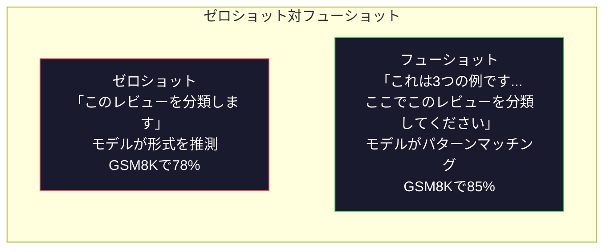
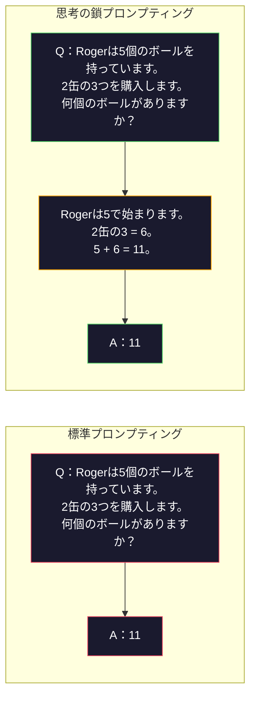
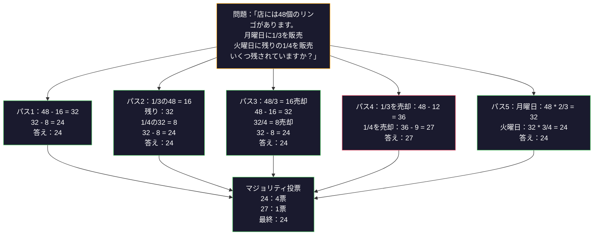
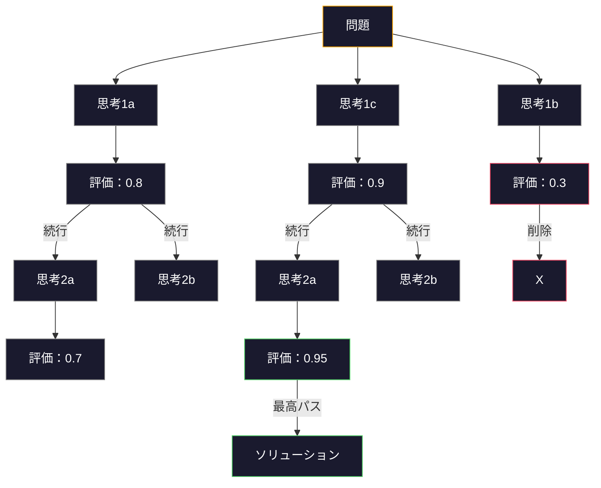

# フューショット、思考の鎖、思考の木

> モデルに何をするかを伝えることはプロンプティングです。どう考えるかを示すことはエンジニアリングです。同じモデル、同じタスク、同じデータで78%から91%精度のギャップは、より良いモデルではありません。それはより良い推論戦略です。

**タイプ:** ビルド
**言語:** Python
**前提条件:** Lesson 11.01（プロンプトエンジニアリング）
**所要時間:** 約45分

## 学習目標

- タスク精度を最大化するためのサンプル的デモンストレーションを選択してフォーマットすることで、フューショットプロンプティングを実装します
- 数学単語問題のような多段階の問題の精度を向上させるために、思考の鎖（CoT）推論を適用します
- 複数の推論パスを探索し、最適なパスを選択する思考の木プロンプトを作成します
- ゼロショット対フューショット対CoTの精度向上を標準ベンチマークで測定します

## 問題

数学チュートリアルアプリを構築します。プロンプトは「この単語問題を解く」と言います。GPT-5はGSM8Kの標準的な小学校数学ベンチマークで94%の時間を正しく取得します。すでにピークに達していると思います。そうではありません - 思考の鎖はまだ3-4ポイント追加します。

5ワード追加してください - 「ステップバイステップで考えましょう」 - 精度が91%にジャンプします。フューショット例を追加してから95%に達します。同じモデル。同じ温度。同じAPI費用。唯一の違いは、モデルにスクラッチペーパーを与えたことです。

これはハックではありません。これは推論がどのように機能するかです。人間は、1つの精神的飛躍で複雑な多段階の問題を解決しません。トランスフォーマーもそうではありません。モデルが中間トークンを生成することを強制するとき、これらのトークンは次のトークンのコンテキストの一部になります。各推論ステップが次のステップを提供します。モデルは文字通り答えに計算されます。

しかし、「ステップバイステップで考える」は始まりであり、終わりではありません。5つの推論パスをサンプリングしてマジョリティ投票を採った場合はどうでしょうか？モデルが可能性の木を探索し、枝を評価・削除することを許可した場合はどうでしょうか？推論とツール使用をインターリーブした場合はどうでしょうか？これらは仮説ではありません。これらは公開されたテクニックであり、測定可能な改善があり、このレッスンですべてを構築します。

## 概念

### ゼロショット対フューショット：例がいつ指示に勝つか

ゼロショットプロンプティングはモデルにタスクと何も与えません。フューショットプロンプティングはそれを最初に例えます。

Wei et al.（2022）は8つのベンチマーク全体でこれを測定しました。感情分類のような単純なタスクでは、ゼロショットとフューショットは相互に2%以内で実行されました。複雑なタスク（複数段階の算術と記号推論）の場合、フューショットは精度を10-25%改善しました。

直感：例は圧縮された命令です。出力形式を説明する代わりに、それを見せてください。推論プロセスを説明する代わりに、それを実証してください。モデルは抽象的な命令よりも例によってパターンマッチングする方が信頼性が高いです。



**フューショットが勝つとき：** 形式に敏感なタスク、分類、構造化抽出、ドメイン固有の専門用語、モデルが特定のパターンに一致する必要があるタスク。

**ゼロショットが勝つとき：** シンプルな事実上の質問、例が創造性を制限するクリエイティブタスク、良い例を見つけることが良い命令を書くより難しいタスク。

### 例の選択：類似が勝つランダム

すべての例が同じではありません。ターゲット入力に埋め込み空間で似ている例を選択すると、分類タスクでランダム選択より5-15%優れています（Liu et al., 2022）。3つの原則：

1. **セマンティック類似性**: 埋め込み空間の入力に最も近い例を選択してください
2. **ラベルの多様性**: 出力カテゴリをすべてカバーします
3. **難易度マッチング**: ターゲット問題の複雑さのレベルを一致させます

ほとんどのタスクの最適な例の数は3-5です。3未満では、モデルにパターンを抽出するための十分な信号がありません。5以上では、減少する利益を得て、コンテキストウィンドウトークンを無駄にします。多くのラベルを持つ分類の場合、ラベルあたり1つの例を使用します。

### 思考の鎖：モデルにスクラッチペーパーを提供

思考の鎖（CoT）プロンプティングはWei et al.（2022）によってGoogle Brainで導入されました。アイデアは単純です。モデルに答えだけを尋ねる代わりに、最初にそれの推論ステップを示すよう尋ねます。



なぜこれが機械的に機能しますか？トランスフォーマーが生成するすべてのトークンは、次のトークンのコンテキストになります。CoTなしでは、モデルはすべての推論を単一の順伝播の隠れ状態に圧縮する必要があります。CoTでは、モデルは中間計算をトークンとして外部化します。各推論トークンは有効な計算深度を拡張します。

**GSM8Kベンチマーク（小学校の数学、8.5K問題）:**

| モデル | ゼロショット | ゼロショットCoT | フューショットCoT |
|-------|-----------|---------------|----------|
| GPT-4o | 78% | 91% | 95% |
| GPT-5 | 94% | 97% | 98% |
| o4-mini（推論） | 97% | — | — |
| Claude Opus 4.7 | 93% | 97% | 98% |
| Gemini 3 Pro | 92% | 96% | 98% |
| Llama 4 70B | 80% | 89% | 94% |
| DeepSeek-V3.1 | 89% | 94% | 96% |

**推論モデルに関する注記。** OpenAIのo-シリーズ（o3、o4-mini）およびDeepSeek-R1のようなモデルは、答えを発行する前に内部で思考の鎖を実行します。推論モデルに「ステップバイステップで考えましょう」を追加すると、冗長で時々逆効果です - 彼らはすでにそれを行っています。

CoTの2つのフレーバー：

**ゼロショットCoT**: 「ステップバイステップで考えましょう」をプロンプトに追加してください。例は必要ありません。Kojima et al.（2022）は、この単一の文が算術、常識、および記号推論タスク全体で精度を改善することを示しました。

**フューショットCoT**: 推論ステップを含む例を提供します。ゼロショットCoTより効果的です。モデルが期待する推論形式を認識するため。

**CoTが傷つくとき：** シンプルな事実の想起（「フランスの首都は何ですか？」）、単一ステップの分類、速度が精度より重要なタスク。CoTは、クエリーあたり50-200トークンの推論オーバーヘッドを追加します。高スループット、低複雑度のタスクでは、それは無駄なコストです。

### 自己一貫性：サンプル多数、投票一度

Wang et al.（2023）は自己一貫性を導入しました。洞察：単一のCoTパスにはエラーが含まれる可能性があります。ただし、N個の独立した推論パスをサンプリング（温度> 0を使用）し、最終的な答えの多数投票を採った場合、エラーはキャンセルされます。



自己一貫性は、元のPaLM 540Bの実験で、単一CoTの56.5%からN=40で74.4%にGSM8Kの精度を改善しました。GPT-5では、改善は小さい（97%から98%）ベース精度が既に飽和しているためです。この技術は、単一パスエラーが頻繁だが体系的でない、モデルの60-85%ベースCoT精度のスイートスポットで最も輝きます。推論モデル（o-シリーズ、R1）の場合、自己一貫性は組み込みの内部サンプリングに統合されます。

トレードオフ：Nサンプルはapi費用とレイテンシーを意味します。実際には、N=5はほとんどのメリットをキャプチャします。N=3は意味のある投票の最小値です。N > 10ほとんどのタスクで減少する利益があります。

### 思考の木：分岐探索

Yao et al.（2023）は思考の木（ToT）を導入しました。CoTが1つの線形推論パスをフォローする場合、ToTは複数の枝を探索し、どちらがまず最も有望であるかを評価してから続行します。



ToTには3つのコンポーネントがあります：

1. **思考生成**: 複数の候補次ステップを生成します
2. **状態評価**: 各候補をスコアリングします（LLM自体を評価者として使用できます）
3. **検索アルゴリズム**: BFSまたはDFSを通じて木をスルーします。低スコアの分岐を削除します

24ゲームのタスク（4つの数字を算術を使用して24を作成）では、標準的なプロンプティングでGPT-4は問題の7.3%を解決します。CoTでは4.0%（CoTは実際に、検索スペースが大きいためここで傷つきます）。ToTでは74%。

ToTは高価です。木の各ノードはLLM呼び出しが必要です。分岐係数3、深さ3の木には最大39のLLM呼び出しが必要です。検索スペースが大きいが評価可能な問題に対してのみ使用してください - 計画、パズル解く、制約を伴う創意工夫の問題解く。

### ReAct：思考+やること

Yao et al.（2022）は、推論トレースをアクションと組み合わせました。モデルは、思考（推論生成）と行為（ツール、検索、計算）の間を交互に切り替えます。

```mermaid
graph LR
    Q["質問：\nエッフェル塔が\n位置している\n国の\n人口は？"]
    T1["思考：探す必要があります\nどの国がエッフェル塔を持っているか"]
    A1["アクション：検索\n「エッフェル塔の場所」"]
    O1["観察：\nパリ、フランス"]
    T2["思考：これで必要です\nフランスの人口"]
    A2["アクション：検索\n「フランスの人口2024」"]
    O2["観察：\n6840万"]
    T3["思考：答えを持っています"]
    F["答え：\n6840万"]

    Q --> T1 --> A1 --> O1 --> T2 --> A2 --> O2 --> T3 --> F

    style Q fill:#1a1a2e,stroke:#ffa500,color:#fff
    style T1 fill:#1a1a2e,stroke:#51cf66,color:#fff
    style A1 fill:#1a1a2e,stroke:#e94560,color:#fff
    style O1 fill:#1a1a2e,stroke:#808080,color:#fff
    style T2 fill:#1a1a2e,stroke:#51cf66,color:#fff
    style A2 fill:#1a1a2e,stroke:#e94560,color:#fff
    style O2 fill:#1a1a2e,stroke:#808080,color:#fff
    style T3 fill:#1a1a2e,stroke:#51cf66,color:#fff
    style F fill:#1a1a2e,stroke:#51cf66,color:#fff
```



ReActはCoTだけの知識集約的なタスクで優れています。実データに推論を接地できるため。HotpotQA（複数ホップ質問応答）では、GPT-4のReActはCoT単独で29.4%に対して35.1%の正確な一致を達成します。本当の力は、推論エラーが観察によって修正されることです - モデルは実行中に計画を更新できます。

ReActは現代的なAIエージェントの基盤です。すべてのエージェントフレームワーク（LangChain、CrewAI、AutoGen）は思想-アクション-観察ループのあるバリアントを実装します。Phase 14でフルエージェントを構築します。このレッスンはプロンプティングパターンをカバーします。

### 構造化プロンプティング：XMLタグ、区切り文字、ヘッダー

プロンプトが複雑になるにつれて、構造はモデルがセクションを混同するのを防ぎます。3つのアプローチ：

**XMLタグ**（Claudeで最適に機能、どこでも確実）：
```
<context>
あなたはプルリクエストをレビューしています。
コードベースはTypeScriptとReactを使用します。
</context>

<task>
バグ、セキュリティの問題、スタイル違反のための以下の差分をレビューしてください。
</task>

<diff>
{diff_content}
</diff>

<output_format>
各問題を以下でリストします：ファイル、行、重要度（重大/警告/情報）、説明。
</output_format>
```

**マークダウンヘッダー**（ユニバーサル）：
```
## ロール
小規模企業のシニアセキュリティエンジニア。

## タスク
このAPIエンドポイントを脆弱性について分析します。

## 入力
{api_code}

## ルール
- OWASP Top 10に焦点を当てます
- 各調査結果：重大、高、中、低を評価します
- 修復ステップを含めます
```

**区切り文字**（最小限だが効果的）：
```
---入力---
{user_text}
---入力終了---

---命令---
上記を3つの箇条書きに要約します。
---命令終了---
```

### プロンプトチェーニング：順序の分解

一部のタスクは、単一のプロンプトでは複雑すぎます。プロンプトチェーニングはそれらをステップに分割します。1つのプロンプトの出力が次のプロンプトの入力になります。


チェーニングが単一プロンプトで勝つ3つの理由：

1. **各ステップがより単純です**：モデルはすべてをジャグリングする代わりに、1つのフォーカスタスクを処理します
2. **中間出力は検査可能です**：ステップ間で検証・修正することができます
3. **異なるステップが異なるモデルを使用できます**：抽出には安いモデル、推論には高価なモデルを使用します

### パフォーマンス比較

| テクニック | 最適なもの | GSM8K精度（GPT-5） | APIコール | トークンオーバーヘッド | 複雑さ |
|-----------|----------|------------------|---------|-------------------|------|
| ゼロショット | 簡単なタスク | 94% | 1 | なし | 簡単 |
| フューショット | フォーマットマッチング | 96% | 1 | 200-500トークン | 低 |
| ゼロショットCoT | 迅速な推論ブースト | 97% | 1 | 50-200トークン | 簡単 |
| フューショットCoT | 単一呼び出し最大精度 | 98% | 1 | 300-600トークン | 低 |
| 自己一貫性（N=5） | 高ステークス推論 | 98.5% | 5 | 5xトークンコスト | 中 |
| 推論モデル（o4-mini） | CoT置換ドロップイン | 97% | 1 | 隠し（2-10x内部） | 簡単 |
| 思考の木 | 検索/計画の問題 | N/A（24ゲームで74%） | 10-40+ | 10-40xトークンコスト | 高 |
| ReAct | 知識に基づく推論 | N/A（HotpotQAで35.1%） | 3-10+ | 変数 | 高 |
| プロンプトチェーニング | 複雑な複数ステップタスク | 96%（パイプライン） | 2-5 | 2-5xトークンコスト | 中 |

正しいテクニックは3つの要因によって異なります。精度要件、レイテンシー予算、および費用寛容。ほとんどの本番システムでは、フューショットCoTと3サンプル自己一貫性フォールバックはユースケースの90%をカバーします。

## ビルド

フューショットプロンプティング、思考の鎖推論、および自己一貫性投票を単一パイプラインに組み合わせる数学の問題解決者を構築します。その後、難しい問題のための思考の木を追加します。

完全な実装は`code/advanced_prompting.py`にあります。重要なコンポーネントです。

### ステップ1：フューショット例ストア

第一のコンポーネントは、フューショット例を管理し、特定の問題に対して最も関連のあるものを選択します。

```python
GSM8K_EXAMPLES = [
    {
        "question": "Janet のアヒルは1日16個の卵を生みます。彼女は毎朝朝食のために3つを食べ、友人のためにマフィンを焼きます4つで毎日。彼女は農民市場で各卵を2ドルで販売しています。彼女は農民市場で毎日いくら稼いでいますか？",
        "reasoning": "Janetのアヒルは1日16個の卵を産みます。彼女は3つ食べて、焼く4つを使用して3 + 4 = 7卵を使用します。つまり、彼女は16 - 7 = 9個の卵を持っています。彼女は各卵を2ドルで売るので、彼女は9 * 2 = 18ドル稼いでいます。",
        "answer": "18"
    },
    ...
]
```

各例には3つの部分があります：質問、推論鎖、および最終答え。推論鎖は、正則フューショット例を思考の鎖フューショット例に変換するものです。

### ステップ2：思考の鎖プロンプトビルダー

プロンプトビルダーは、システムメッセージ、推論チェーン付きのフューショット例、およびターゲット質問を単一のプロンプトに組み立てます。

```python
def build_cot_prompt(question, examples, num_examples=3):
    system = (
        "あなたは数学の問題解決者です。"
        "各問題に対して、ステップバイステップの推論を表示してから、"
        "最後の行で最終数値答えを形式で提供してください"
        "「答えは[数字]」。"
    )

    example_text = ""
    for ex in examples[:num_examples]:
        example_text += f"Q：{ex['question']}\n"
        example_text += f"A：{ex['reasoning']}答えは{ex['answer']}です。\n\n"

    user = f"{example_text}Q：{question}\nA："
    return system, user
```

形式制約（「答えは[数字]」）は批判的です。それがなければ、自己一貫性は標本間で答えを抽出して比較することはできません。

### ステップ3：自己一貫性投票

Nの推論パスをサンプリングして、マジョリティ答えを採択します。

```python
def self_consistency_solve(question, examples, client, model, n_samples=5):
    system, user = build_cot_prompt(question, examples)

    answers = []
    reasonings = []
    for _ in range(n_samples):
        response = client.chat.completions.create(
            model=model,
            messages=[
                {"role": "system", "content": system},
                {"role": "user", "content": user}
            ],
            temperature=0.7
        )
        text = response.choices[0].message.content
        reasonings.append(text)
        answer = extract_answer(text)
        if answer is not None:
            answers.append(answer)

    vote_counts = Counter(answers)
    best_answer = vote_counts.most_common(1)[0][0] if vote_counts else None
    confidence = vote_counts[best_answer] / len(answers) if best_answer else 0

    return best_answer, confidence, reasonings, vote_counts
```

温度0.7は重要です。温度0.0で、すべてのNサンプルは同一になるので、目的を打つことになります。多様な推論パスが必要だが、モデルが無意味を生成するほど十分でありません。

### ステップ4：思考の木解決者

線形推論が失敗する問題の場合、ToTは複数のアプローチを探索し、最も有望な方向を評価します。

```python
def tree_of_thought_solve(question, client, model, breadth=3, depth=3):
    thoughts = generate_initial_thoughts(question, client, model, breadth)
    scored = [(t, evaluate_thought(t, question, client, model)) for t in thoughts]
    scored.sort(key=lambda x: x[1], reverse=True)

    for current_depth in range(1, depth):
        next_thoughts = []
        for thought, score in scored[:2]:
            extensions = extend_thought(thought, question, client, model, breadth)
            for ext in extensions:
                ext_score = evaluate_thought(ext, question, client, model)
                next_thoughts.append((ext, ext_score))
        scored = sorted(next_thoughts, key=lambda x: x[1], reverse=True)

    best_thought = scored[0][0] if scored else ""
    return extract_answer(best_thought), best_thought
```

評価者はそれ自体LLM呼び出しです。質問を解く推論パスとしてどの程度有望であるかを0.0から1.0のスケールで尋ねてください：「」。これはToTの重要な洞察です - モデルは独自の部分的な解決策を評価します。

### ステップ5：完全なパイプライン

パイプラインは、すべてのテクニックをエスカレーション戦略と組み合わせます。

```python
def solve_with_escalation(question, examples, client, model):
    system, user = build_cot_prompt(question, examples)
    single_response = call_llm(client, model, system, user, temperature=0.0)
    single_answer = extract_answer(single_response)

    sc_answer, confidence, _, _ = self_consistency_solve(
        question, examples, client, model, n_samples=5
    )

    if confidence >= 0.8:
        return sc_answer, "self_consistency", confidence

    tot_answer, _ = tree_of_thought_solve(question, client, model)
    return tot_answer, "tree_of_thought", None
```

エスカレーション論理：安い（単一CoT）を最初に試す。自己一貫性の信頼が0.8未満の場合（4/5サンプルの5未満が一致）、ToTにエスカレートします。これはコストと精度のバランスを取ります - ほとんどの問題は安く解決され、難しい問題はより多くのコンピュートを取得します。

## 使用方法

### LangChainで

LangChainは、フューショットとCoTパターンを簡単にするプロンプトテンプレートと出力解析のサポートを提供します：

```python
from langchain_core.prompts import FewShotPromptTemplate, PromptTemplate
from langchain_openai import ChatOpenAI

example_prompt = PromptTemplate(
    input_variables=["question", "reasoning", "answer"],
    template="Q：{question}\nA：{reasoning}答えは{answer}です。"
)

few_shot_prompt = FewShotPromptTemplate(
    examples=examples,
    example_prompt=example_prompt,
    suffix="Q：{input}\nA：ステップバイステップで考えましょう。",
    input_variables=["input"]
)

llm = ChatOpenAI(model="gpt-4o", temperature=0.7)
chain = few_shot_prompt | llm
result = chain.invoke({"input": "列車が2時間で120 kmを移動する場合..."})
```

LangChainは意味的類似性選択のための`ExampleSelector`クラスも持っています：

```python
from langchain_core.example_selectors import SemanticSimilarityExampleSelector
from langchain_openai import OpenAIEmbeddings

selector = SemanticSimilarityExampleSelector.from_examples(
    examples,
    OpenAIEmbeddings(),
    k=3
)
```

### DSPyで

DSPyはプロンプティング戦略を最適化可能なモジュールとして扱います。CoTプロンプトを手作業で設計する代わりに、署名を定義し、DSPyにプロンプトを最適化させます：

```python
import dspy

dspy.configure(lm=dspy.LM("openai/gpt-4o", temperature=0.7))

class MathSolver(dspy.Module):
    def __init__(self):
        self.solve = dspy.ChainOfThought("question -> answer")

    def forward(self, question):
        return self.solve(question=question)

solver = MathSolver()
result = solver(question="Janet のアヒルは1日16個の卵を生みます...")
```

DSPyの`ChainOfThought`は推論トレースを自動的に追加します。`dspy.majority`は自己一貫性を実装します：

```python
result = dspy.majority(
    [solver(question=q) for _ in range(5)],
    field="answer"
)
```

### 比較：ゼロから対フレームワーク

| 機能 | ゼロから（このレッスン） | LangChain | DSPy |
|-------|---------------------------|-----------|------|
| プロンプト形式の制御 | 完全 | テンプレートベース | 自動 |
| 自己一貫性 | 手動投票 | 手動 | 組み込み（`dspy.majority`） |
| 例の選択 | カスタムロジック | `ExampleSelector` | `dspy.BootstrapFewShot` |
| 思考の木 | カスタムツリー検索 | コミュニティチェーン | 組み込みではない |
| プロンプト最適化 | 手動反復 | 手動 | 自動コンパイル |
| 最高のため | 学習、カスタムパイプライン | 標準ワークフロー | リサーチ、最適化 |

## シップ

このレッスンは2つの成果物を生成します。

**1. 推論チェーンプロンプト**（`outputs/prompt-reasoning-chain.md`）：自己一貫性を持つ本番準備フューショットCoT プロンプトテンプレート。例と問題ドメインを接続してください。

**2. Cotパターンセレクションスキル**（`outputs/skill-cot-patterns.md`）：タスクタイプ、精度要件、コスト制約に基づいて正しい推論テクニックを選択するための決定フレームワーク。

## 演習

1. **ギャップを測定します**：10個のGSM8K問題を取得します。各ゼロショット、フューショット、ゼロショットCoT、フューショットCoTで解決してください。各精度を記録してください。どのテクニックがモデルで最大のリフトを提供しますか？

2. **例の選択実験**：同じ10個の問題に対して、ランダム例の選択対手で選択された類似の例を比較してください。精度の違いを測定します。どの時点で、例の品質が例の数より重要になりますか？

3. **自己一貫性コスト曲線**：20個のGSM8K問題でN=1、3、5、7、10で自己一貫性を実行します。精度対費用をプロットしてください（総トークン）。モデルのカーブの膝は何ですか？

4. **ReActループを作成します**：計算機ツールでパイプラインを拡張してください。モデルが数学式を生成する場合、それをPythonの`eval()`（サンドボックス）で実行し、結果を戻してください。CoT純粋対ツール接地推論を打つ場合はどうなりますか。

5. **創意工夫のたてのToT**：創意工夫のあるタスク用のツリーオブソート解決者を適応させます：「面白くて悲しい6ワードの物語を書いてください。」LLMを評価者として使用してください。分岐探索は単一ショット生成より良い創意工夫の出力を生成しますか？

## キーターム

| 用語 | 人が言うこと | 実際の意味 |
|------|-------------|---------|
| フューショットプロンプティング | 「それに例を与える」 | プロンプトに2-10の入出力デモンストレーションを含めて、モデルの出力形式と動作をアンカーします |
| 思考の鎖 | 「ステップバイステップで考えさせる」 | 最終答えを生成する前にモデルを拡張するモデルの有効な計算を拡張する中間推論トークンを引き出します |
| 自己一貫性 | 「複数回実行」 | 温度> 0でN個の多様な推論パスをサンプリングし、マジョリティ投票で最も一般的な最終答えを選択します |
| 思考の木 | 「それが選択肢を探索させる」 | 推論分岐を通じての構造化検索。各部分的な解決策を評価し、有望なパスのみを拡張します |
| ReAct | 「思考+ツール使用」 | 思考トレースを外部アクション（検索、計算、API呼び出し）と観察ループで相互混在させます |
| プロンプトチェーニング | 「それを段階に分割する」 | 複雑なタスクを順序プロンプトに分解します。各出力が次の入力に入ります |
| ゼロショットCoT | 「ただ「ステップバイステップで考える」を追加」 | 例なしでプロンプトに推論トリガー句を追加。モデルの潜在推論能力に依存します |

## 参考文献

- [Chain-of-Thought Prompting Elicits Reasoning in Large Language Models](https://arxiv.org/abs/2201.11903) -- Wei et al. 2022。Google Brainからオリジナルのコット論文。セクション2-3を読んで中心の結果を読んでください。
- [Self-Consistency Improves Chain of Thought Reasoning in Language Models](https://arxiv.org/abs/2203.11171) -- Wang et al. 2023。自己一貫性論文。すべての数字が必要な場合はTable 1。
- [Tree of Thoughts：Deliberate Problem Solving with Large Language Models](https://arxiv.org/abs/2305.10601) -- Yao et al. 2023。ToT論文。セクション4の24ゲーム結果がハイライトです。
- [ReAct：Synergizing Reasoning and Acting in Language Models](https://arxiv.org/abs/2210.03629) -- Yao et al. 2022。現代的なAIエージェントの基礎。セクション3は思想-アクション観測ループを説明します。
- [Large Language Models are Zero-Shot Reasoners](https://arxiv.org/abs/2205.11916) -- Kojima et al. 2022。「ステップバイステップで考えましょう」論文。シンプルなので驚くほど効果的です。
- [DSPy：Compiling Declarative Language Model Calls into Self-Improving Pipelines](https://arxiv.org/abs/2310.03714) -- Khattab et al. 2023。手動プロンプトエンジニアリングを超えて移動したい場合は読んでください。プロンプティングをコンパイル問題として扱います。
- [OpenAI - 推論モデルガイド](https://platform.openai.com/docs/guides/reasoning) -- o-シリーズが内部プロンプトレベルのトリックとしてではなく、価格トークンごとの「推論」モードになっているときの的配置ガイダンス。
- [Lightman et al., "Let's Verify Step by Step" (2023)](https://arxiv.org/abs/2305.20050) -- 各ステップを等級するプロセス報酬モデル（PRM）。結果のみの報酬に成功する推論監督信号。
- [Snell et al., "Scaling LLM Test-Time Compute Optimally" (2024)](https://arxiv.org/abs/2408.03314) -- CoTの長さ、自己一貫性サンプリング、MCTSの体系的な研究。「ステップバイステップで考えます」は、精度がレイテンシーよりも重要な場合に移動する場所。
