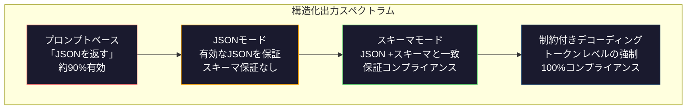
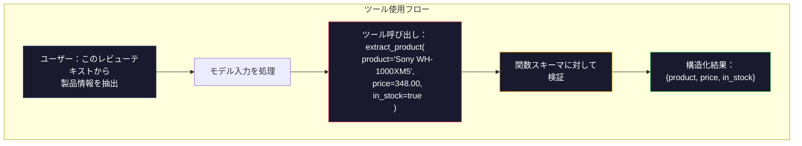

# 構造化出力：JSON、スキーマ検証、制約付きデコーディング

> LLMは文字列を返します。アプリケーションはJSONを必要とします。そのギャップはモデル幻覚より多くの本番システムをクラッシュさせました。構造化出力は、自然言語と型付きデータの間のブリッジです。正しく実行すると、LLMは信頼性のあるAPIになります。誤ると、3時間に正規表現で自由テキストを解析しています。

**タイプ:** ビルド
**言語:** Python
**前提条件:** Phase 10, Lessons 01-05（LLM from Scratch）
**所要時間:** 約90分
**関連:** Phase 5 · 20（構造化出力と制約付きデコーディング）はデコーダレベルの理論（FSM/CFG ロジットプロセッサ、アウトライン、XGrammar）をカバーしています。このレッスンは本番SDKサーフェス（OpenAI `response_format`、Anthropicツール使用、Instructor）に焦点を当てます — Phase 5 · 20を最初に読んでください。APIの下で何が起こっているか理解したい場合。

## 学習目標

- OpenAIおよびAnthropicのAPIパラメータを使用して、JSON モードと スキーマ制約出力を実装します
- LLM出力を検証し、エラーフィードバックで再試行するPydantic検証レイヤーを構築します
- トークンレベルで有効なJSONを強制する制約付きデコーディングを説明する
- 構造化データ構造に無構造テキストを確実に変換する堅牢な抽出プロンプトを設計します

## 問題

LLMに「このテキストからの製品名、価格、可用性を抽出してください」と尋ねます。それは応答します：

```
製品はソニーWH-1000XM5ヘッドフォンであり、現在348.00ドル、現在在庫があります。
```

これは完全に正しい答えです。それはあなたのアプリケーションに完全に役に立たないです。在庫システムは`{"product": "Sony WH-1000XM5", "price": 348.00, "in_stock": true}`が必要です。特定のキー、特定のタイプ、特定の値制約を持つJSONオブジェクトが必要です。文は必要ありません。

素朴な解決策：「JSONで応答」をプロンプトに追加してください。これは90%の時間動作します。他の10%では、モデルはJSONをマークダウンコードフェンスでラップし、「これが、JSONです：」のようなプリアンブルを追加し、括弧を閉じる早期のためにシンタックスを無効なJSONを生成します。JSONパーサーがクラッシュします。パイプラインが破られます。try/exceptと再試行ループを追加します。再試行は時々異なるデータを生成します。これで、解析の問題の上に一貫性の問題があります。

これはプロンプトエンジニアリングの問題ではありません。デコーディング問題です。モデルは左から右にトークンを生成します。各位置で、100K以上の語彙から最も可能性の高い次のトークンを選択します。これらのオプションのほとんどは、任意の位置で無効なJSONを生成します。モデルがちょうど`{"price":`を出力した場合、次のトークンは数字、引用符（文字列の場合）、`null`、`true`、`false`、または負の符号である必要があります。その他のものは無効なJSONを生成します。制約なしで、モデルはシンタックス的に破局的に間違った完全に合理的な英語の単語を選ぶことができます。

## 概念

### 構造化出力スペクトラム

構造化出力制御の4つのレベルがあり、それぞれ最後のより信頼性があります。



**プロンプトベース**（「有効なJSONで応答」）：強制なし。モデルは通常準拠しますが、時々しません。信頼性：約90%。障害モード：マークダウンフェンス、プリアンブルテキスト、切り詰められた出力、間違った構造。

**JSONモード**: APIは出力が有効なJSONであることを保証します。OpenAIの`response_format: { type: "json_object" }`がこれを有効にします。出力はエラーなくパースされます。しかし、予想されるスキーマと一致しない場合があります - 追加のキー、間違ったタイプ、欠落フィールド。

**スキーマモード**: APIはJSONスキーマを受け取り、出力がそれと一致することを保証します。2026年までに、すべての主要プロバイダーはこれをネイティブにサポートしています：OpenAIの`response_format: { type: "json_schema", json_schema: {...} }`（また`tool_choice="required"`として）、Anthropicのツール使用`input_schema`、およびGeminiの`response_schema` + `response_mime_type: "application/json"`。出力には、指定されたとおりに正確なキー、タイプ、制約があります。

**制約付きデコーディング**: 生成中の各トークン位置で、デコーダはすべてのトークンをマスクアウトします。無効な出力を生成します。スキーマが数字を必要とし、モデルが文字を出力しようとしている場合、そのトークンは確率ゼロに設定されます。モデルは、有効な出力につながるトークンのみを生成できます。これはOpenAIの構造化出力モード およびOutlines や Guidance などのライブラリは、フード下の実装です。

### JSONスキーマ：契約言語

JSONスキーマは、モデル（または検証レイヤー）に、出力の形状（機能の内容、必要なパラメータ、パラメータのタイプ）を伝える方法です。すべての主要な構造化出力システムがそれを使用しています。

```json
{
  "type": "object",
  "properties": {
    "product": { "type": "string" },
    "price": { "type": "number", "minimum": 0 },
    "in_stock": { "type": "boolean" },
    "categories": {
      "type": "array",
      "items": { "type": "string" }
    }
  },
  "required": ["product", "price", "in_stock"]
}
```

このスキーマは言います：出力は文字列`product`、0以上の数値`price`、ブール値`in_stock`、およびオプションの文字列配列`categories`を持つオブジェクトである必要があります。一致しない出力は拒否されます。

スキーマは難しいケースを処理します：ネストされたオブジェクト、タイプ付きアイテム、列挙型（文字列を特定の値に制限）、パターンマッチング（文字列の正規表現）、およびコンビネータ（oneOf、anyOf、allOf多形出力用）。

### Pydanticパターン

Pythonでは、JSONスキーマを手で書きません。Pydanticモデルを定義すると、スキーマが生成されます。

```python
from pydantic import BaseModel

class Product(BaseModel):
    product: str
    price: float
    in_stock: bool
    categories: list[str] = []
```

これは上のJSONスキーマと同じを生成します。Instructorライブラリ（およびOpenAI SDK）はPydanticモデルを直接受け入れます。パスモデルクラス、検証済みインスタンスを取得し直します。LLM出力と一致しない場合、Instructorは自動的に再試行します。

### 関数呼び出し/ツール使用

同じ問題のための代替インターフェース。LLMにJSONを直接生成するように依頼する代わりに、「ツール」（機能）を入力パラメータで型付きします。モデルは構造化された引数を持つ関数呼び出しを出力します。OpenAIは「関数呼び出し」と呼びます。Anthropicは「ツール使用」と呼びます。結果は同じです：構造化データ。



ツール使用は、モデルが呼び出す関数を選択する必要がある場合を優先します。パラメータのみを記入する場合ではなく。10種類の異なる抽出スキーマがあり、モデルが入力に基づいて正しいものを選択する必要がある場合、ツール使用はスキーマ選択と構造化出力の両方を提供します。

### 一般的な障害モード

スキーマ強制があってさえ、構造化出力は微妙な方法で失敗できます。

**幻覚価値**: 出力はスキーマと一致しますが、発明されたデータが含まれます。モデルは`{"price": 299.99}`を生成します。テキストが$348と言っても。スキーマ検証はこれをキャッチできません - タイプは正確で、値は間違っています。

**列挙型混乱**: `["in_stock", "out_of_stock", "preorder"]`にフィールドを制限します。モデルは「利用可能」を出力します - 意味的に正確ですが、許可されたセットにはありません。良い制約付きデコーディングはこれを防ぎます。プロンプトベースのアプローチはしません。

**ネストオブジェクト深さ**: 深くネストされたスキーマ（4+レベル）はより多くのエラーを生成します。ネストの各レベルはモデルが構造を失う別の場所です。

**配列長**: モデルは配列に多すぎるまたは少数のアイテムを生成する場合があります。スキーマは`minItems`と`maxItems`をサポートしていますが、すべてのプロバイダがデコーディングレベルで強制しているわけではありません。

**オプションフィールド削除**: モデルが技術的には省略可能なフィールドを省略します。ただし、セマンティック上重要です。ユースケースのスキーマで必須としてそれらを設定します - モデルを明示的に`null`を生成するように強制します。

## ビルド

### ステップ1：JSONスキーマ検証器

Python オブジェクトがJSONスキーマと一致するかどうかをチェックする検証器を構築します。これは検証側で実行されます。

```python
import json

def validate_schema(data, schema):
    errors = []
    _validate(data, schema, "", errors)
    return errors

def _validate(data, schema, path, errors):
    schema_type = schema.get("type")

    if schema_type == "object":
        if not isinstance(data, dict):
            errors.append(f"{path}: expected object, got {type(data).__name__}")
            return
        for key in schema.get("required", []):
            if key not in data:
                errors.append(f"{path}.{key}: required field missing")
        properties = schema.get("properties", {})
        for key, value in data.items():
            if key in properties:
                _validate(value, properties[key], f"{path}.{key}", errors)

    elif schema_type == "array":
        if not isinstance(data, list):
            errors.append(f"{path}: expected array, got {type(data).__name__}")
            return
        min_items = schema.get("minItems", 0)
        max_items = schema.get("maxItems", float("inf"))
        if len(data) < min_items:
            errors.append(f"{path}: array has {len(data)} items, minimum is {min_items}")
        if len(data) > max_items:
            errors.append(f"{path}: array has {len(data)} items, maximum is {max_items}")
        items_schema = schema.get("items", {})
        for i, item in enumerate(data):
            _validate(item, items_schema, f"{path}[{i}]", errors)

    elif schema_type == "string":
        if not isinstance(data, str):
            errors.append(f"{path}: expected string, got {type(data).__name__}")
            return
        enum_values = schema.get("enum")
        if enum_values and data not in enum_values:
            errors.append(f"{path}: '{data}' not in allowed values {enum_values}")

    elif schema_type == "number":
        if not isinstance(data, (int, float)):
            errors.append(f"{path}: expected number, got {type(data).__name__}")
            return
        minimum = schema.get("minimum")
        maximum = schema.get("maximum")
        if minimum is not None and data < minimum:
            errors.append(f"{path}: {data} is less than minimum {minimum}")
        if maximum is not None and data > maximum:
            errors.append(f"{path}: {data} is greater than maximum {maximum}")

    elif schema_type == "boolean":
        if not isinstance(data, bool):
            errors.append(f"{path}: expected boolean, got {type(data).__name__}")

    elif schema_type == "integer":
        if not isinstance(data, int) or isinstance(data, bool):
            errors.append(f"{path}: expected integer, got {type(data).__name__}")
```

### ステップ2：Pydantic風モデル対スキーマ

Python クラスをスキーマに自動的に変換するミニ クラス対スキーマコンバーターを構築します。

```python
class SchemaField:
    def __init__(self, field_type, required=True, default=None, enum=None, minimum=None, maximum=None):
        self.field_type = field_type
        self.required = required
        self.default = default
        self.enum = enum
        self.minimum = minimum
        self.maximum = maximum

def python_type_to_schema(field):
    type_map = {
        str: "string",
        int: "integer",
        float: "number",
        bool: "boolean",
    }

    schema = {}

    if field.field_type in type_map:
        schema["type"] = type_map[field.field_type]
    elif field.field_type == list:
        schema["type"] = "array"
        schema["items"] = {"type": "string"}
    elif isinstance(field.field_type, dict):
        schema = field.field_type

    if field.enum:
        schema["enum"] = field.enum
    if field.minimum is not None:
        schema["minimum"] = field.minimum
    if field.maximum is not None:
        schema["maximum"] = field.maximum

    return schema

def model_to_schema(name, fields):
    properties = {}
    required = []

    for field_name, field in fields.items():
        properties[field_name] = python_type_to_schema(field)
        if field.required:
            required.append(field_name)

    return {
        "type": "object",
        "properties": properties,
        "required": required,
    }
```

### ステップ3：制約付きトークンフィルタ

制約付きデコーディングをシミュレートします。部分的なJSONと スキーマが与えられて、現在の位置で有効なトークンカテゴリを決定します。

```python
def next_valid_tokens(partial_json, schema):
    stripped = partial_json.strip()

    if not stripped:
        return ["{"]

    try:
        json.loads(stripped)
        return ["<EOS>"]
    except json.JSONDecodeError:
        pass

    last_char = stripped[-1] if stripped else ""

    if last_char == "{":
        return ['"', "}"]
    elif last_char == '"':
        if stripped.endswith('":'):
            return ['"', "0-9", "true", "false", "null", "[", "{"]
        return ["a-z", '"']
    elif last_char == ":":
        return [" ", '"', "0-9", "true", "false", "null", "[", "{"]
    elif last_char == ",":
        return [" ", '"', "{", "["]
    elif last_char in "0123456789":
        return ["0-9", ".", ",", "}", "]"]
    elif last_char == "}":
        return [",", "}", "]", "<EOS>"]
    elif last_char == "]":
        return [",", "}", "<EOS>"]
    elif last_char == "[":
        return ['"', "0-9", "true", "false", "null", "{", "[", "]"]
    else:
        return ["any"]

def demonstrate_constrained_decoding():
    partial_states = [
        '',
        '{',
        '{"product"',
        '{"product":',
        '{"product": "Sony"',
        '{"product": "Sony",',
        '{"product": "Sony", "price":',
        '{"product": "Sony", "price": 348',
        '{"product": "Sony", "price": 348}',
    ]

    print(f"{'部分的なJSON':<45} {'有効な次のトークン'}")
    print("-" * 80)
    for state in partial_states:
        valid = next_valid_tokens(state, {})
        display = state if state else "(empty)"
        print(f"{display:<45} {valid}")
```

### ステップ4：抽出パイプライン

すべてをスキーマ定義、シミュレートLLMを実行するパイプラインに組み合わせます。出力を検証し、再試行を処理します。

```python
def simulate_llm_extraction(text, schema, attempt=0):
    if "headphones" in text.lower() or "sony" in text.lower():
        if attempt == 0:
            return '{"product": "Sony WH-1000XM5", "price": 348.00, "in_stock": true, "categories": ["audio", "headphones"]}'
        return '{"product": "Sony WH-1000XM5", "price": 348.00, "in_stock": true}'

    if "laptop" in text.lower():
        return '{"product": "MacBook Pro 16", "price": 2499.00, "in_stock": false, "categories": ["computers"]}'

    return '{"product": "Unknown", "price": 0, "in_stock": false}'

def extract_with_retry(text, schema, max_retries=3):
    for attempt in range(max_retries):
        raw = simulate_llm_extraction(text, schema, attempt)

        try:
            data = json.loads(raw)
        except json.JSONDecodeError as e:
            print(f"  試み{attempt + 1}：JSONパースエラー -- {e}")
            continue

        errors = validate_schema(data, schema)
        if not errors:
            return data

        print(f"  試み{attempt + 1}：スキーマ検証エラー -- {errors}")

    return None

product_schema = {
    "type": "object",
    "properties": {
        "product": {"type": "string"},
        "price": {"type": "number", "minimum": 0},
        "in_stock": {"type": "boolean"},
        "categories": {"type": "array", "items": {"type": "string"}},
    },
    "required": ["product", "price", "in_stock"],
}
```

### ステップ5：完全なパイプラインを実行

```python
def run_demo():
    print("=" * 60)
    print("  構造化出力パイプラインデモ")
    print("=" * 60)

    print("\n--- スキーマ定義 ---")
    product_fields = {
        "product": SchemaField(str),
        "price": SchemaField(float, minimum=0),
        "in_stock": SchemaField(bool),
        "categories": SchemaField(list, required=False),
    }
    generated_schema = model_to_schema("Product", product_fields)
    print(json.dumps(generated_schema, indent=2))

    print("\n--- スキーマ検証 ---")
    test_cases = [
        ({"product": "Test", "price": 10.0, "in_stock": True}, "有効なオブジェクト"),
        ({"product": "Test", "price": -5.0, "in_stock": True}, "負の価格"),
        ({"product": "Test", "in_stock": True}, "価格が不足"),
        ({"product": "Test", "price": "ten", "in_stock": True}, "文字列として価格"),
        ("not an object", "オブジェクトの代わりに文字列"),
    ]

    for data, label in test_cases:
        errors = validate_schema(data, product_schema)
        status = "パス" if not errors else f"失敗：{errors}"
        print(f"  {label}：{status}")

    print("\n--- 制約付きデコーディングシミュレーション ---")
    demonstrate_constrained_decoding()

    print("\n--- 抽出パイプライン ---")
    texts = [
        "ソニーWH-1000XM5ヘッドフォンは348ドルで価格設定され、現在利用可能です。",
        "新しいMacBook Pro 16インチノートパソコンは2499ドルの費用がかかりますが、売上ています。",
        "これは製品情報なしのランダムな文です。",
    ]

    for text in texts:
        print(f"\n  入力：{text[:60]}...")
        result = extract_with_retry(text, product_schema)
        if result:
            print(f"  出力：{json.dumps(result)}")
        else:
            print(f"  出力：再試行後に失敗")
```

## 使用方法

### OpenAI構造化出力

```python
# from openai import OpenAI
# from pydantic import BaseModel
#
# client = OpenAI()
#
# class Product(BaseModel):
#     product: str
#     price: float
#     in_stock: bool
#
# response = client.beta.chat.completions.parse(
#     model="gpt-5-mini",
#     messages=[
#         {"role": "system", "content": "製品情報を抽出します。"},
#         {"role": "user", "content": "ソニーWH-1000XM5、348ドル、在庫"},
#     ],
#     response_format=Product,
# )
#
# product = response.choices[0].message.parsed
# print(product.product, product.price, product.in_stock)
```

OpenAIの構造化出力モードは、内部で制約付きデコーディングを使用します。モデルが生成するすべてのトークンは、Pydanticスキーマと一致する出力を生成することが保証されています。再試行が必要ありません。検証は必要ありません。制約はデコーディングプロセスに焼き付けられます。

### Anthropicツール使用

```python
# import anthropic
#
# client = anthropic.Anthropic()
#
# response = client.messages.create(
#     model="claude-opus-4-7",
#     max_tokens=1024,
#     tools=[{
#         "name": "extract_product",
#         "description": "テキストから製品情報を抽出",
#         "input_schema": {
#             "type": "object",
#             "properties": {
#                 "product": {"type": "string"},
#                 "price": {"type": "number"},
#                 "in_stock": {"type": "boolean"},
#             },
#             "required": ["product", "price", "in_stock"],
#         },
#     }],
#     messages=[{"role": "user", "content": "抽出：ソニーWH-1000XM5、348ドル、在庫"}],
# )
```

Anthropicはツール使用を通じて構造化出力を達成します。モデルは、input_schemaと一致する構造化された引数を持つツール呼び出しを出力します。同じ結果、異なるAPIサーフェス。

### インストラクター ライブラリ

```python
# pip install instructor
# import instructor
# from openai import OpenAI
# from pydantic import BaseModel
#
# client = instructor.from_openai(OpenAI())
#
# class Product(BaseModel):
#     product: str
#     price: float
#     in_stock: bool
#
# product = client.chat.completions.create(
#     model="gpt-5-mini",
#     response_model=Product,
#     messages=[{"role": "user", "content": "ソニーWH-1000XM5、348ドル、在庫"}],
# )
```

インストラクターは任意のLLMクライアントをラップし、自動検証を追加し、失敗する再試行を追加します。最初の試みが検証に失敗した場合、エラーをコンテキストとしてモデルに送信し、出力を修正するように要求します。これはOpenAIだけでなく、あらゆるプロバイダーで動作します。

## シップ

このレッスンは`outputs/prompt-structured-extractor.md`を生成します - スキーマ定義が与えられた任意のテキストから構造化データを抽出する再利用可能なプロンプトテンプレート。JSONスキーマと非構造化テキストをフィードし、検証されたJSONが返されます。

また、`outputs/skill-structured-outputs.md`を生成します - プロバイダー、信頼性要件、スキーマ複雑性に基づいて、正しい構造化出力戦略を選択するための決定フレームワーク。

## 演習

1. スキーマバリデーターを拡張して`oneOf`をサポートしてください（データはいくつかのスキーマの1つと正確に一致する必要があります）。これは多形出力を処理します - たとえば、異なる形の`Product`または`Service`オブジェクトのいずれかである可能性があるフィールド。

2. 「スキーマ差分」ツールを構築します。2つのスキーマを比較し、破壊的な変更（削除された必須フィールド、変更されたタイプ）対非破壊的な変更（追加されたオプションフィールド、緩和された制約）を特定します。これは本番環境での抽出スキーマのバージョニングに不可欠です。

3. より現実的な制約付きデコーディング シミュレータを実装します。JSONスキーマと100トークン（文字、数字、句読点、キーワード）の語彙が与えられて、生成をステップバイステップでウォークスルーし、各位置でトークンを無効にしてマスクします。各ステップで語彙の有効な割合を測定します。

4. 抽出評価スイートを構築します。手でラベル付けされたJSON出力を持つ50個の製品の説明を作成します。すべての50に対して抽出パイプラインを実行し、正確一致、フィールドレベルの精度、およびタイプコンプライアンスを測定します。どのフィールドが最も抽出が難しいかを特定します。

5. 「信頼スコア」を抽出パイプラインに追加します。各抽出フィールドについて、モデルの信頼度を推定してください（トークン確率に基づく、または抽出を3回実行して一貫性を測定）。低信頼フィールドにフラグを立てて人間レビュー用に。

## キーターム

| 用語 | 人が言うこと | 実際の意味 |
|------|-------------|---------|
| JSONモード | 「JSONを返す」 | APIフラグ。シンタックス的に有効なJSONの出力を保証しますが、特定のスキーマを強制しません |
| 構造化出力 | 「型付きJSON」 | 正しいキー、タイプ、制約を持つ特定のJSONスキーマと一致する出力 |
| 制約付きデコーディング | 「ガイド付き生成」 | 各トークン位置で、無効な出力を生成するトークンをマスクアウトします - 100%スキーマコンプライアンスを保証します |
| JSONスキーマ | 「JSONテンプレート」 | JSONデータの構造、タイプ、制約を説明するための宣言言語（OpenAPI、JSONフォーム等で使用） |
| Pydantic | 「Pythonデータクラス+」 | 型検証を持つPythonライブラリがJSONスキーマを生成するために使用されます。FastAPIとInstructorで使用 |
| 関数呼び出し | 「ツール使用」 | LLMは、フリーテキストではなく、構造化関数呼び出し（名前+型付き引数）を出力します - OpenAIとAnthropicの両方がサポート |
| インストラクター | 「LLM用Pydantic」 | LLMクライアントをラップして、検証されたPydanticインスタンスと自動再試行を返すPythonライブラリ |
| トークンマスキング | 「語彙をフィルタリング」 | 生成中に特定のトークン確率をゼロに設定して、モデルがそれらを生成できない |
| スキーマコンプライアンス | 「形状と一致」 | 出力には、すべての必須フィールド、正しいタイプ、制約内の値、許可されていないフィールドなしがあります |
| 再試行ループ | 「それを修正するまで再度やってください」 | 検証エラーをモデルに送信し、出力を修正するように要求します - Instructorは自動的にこれを行い、設定可能な最大値に対して |

## 参考文献

- [OpenAI構造化出力ガイド](https://platform.openai.com/docs/guides/structured-outputs) -- OpenAI APIのJSONスキーマベースの制約付きデコーディング公式ドキュメント
- [Willard & Louf、2023 -- 「効率的なガイド付き生成大規模言語モデル用」](https://arxiv.org/abs/2307.09702) -- アウトラインペーパー。JSONスキーマを有限状態機械にコンパイルする方法を説明してトークンレベルの制約を作成する
- [インストラクタードキュメント](https://python.useinstructor.com/) -- Pydantic検証と再試行を使用してあらゆるLLMから構造化出力を取得するための標準ライブラリ
- [Anthropicツール使用ガイド](https://docs.anthropic.com/en/docs/tool-use) -- ClaudeがJSONスキーマ入力_schemaを介したツール使用を通じて構造化出力をどのように実装するか
- [JSONスキーマ仕様](https://json-schema.org/) -- すべての主要な構造化出力システムで使用されるスキーマ言語の完全な仕様
- [アウトラインライブラリ](https://github.com/outlines-dev/outlines) -- 正規表現とJSONスキーマを有限状態機械にコンパイルする、オープンソースの制約付き生成
- [Dong et al.、「XGrammar：大規模言語モデル用の柔軟で効率的な構造化生成エンジン」（MLSys 2025）](https://arxiv.org/abs/2411.15100) -- 最先端の文法エンジン；約100nsのトークンでマスク検出する後押しオートマトン コンパイル。
- [Beurer-Kellner et al.、「プロンプティングはプログラミング：大規模言語モデル用クエリ言語」（LMQL）](https://arxiv.org/abs/2212.06094) -- LMQL論文。タイプと値の制約を持つクエリ言語として制約付きデコーディングをフレーミング。
- [Microsoft Guidance（フレームワークドキュメント）](https://github.com/guidance-ai/guidance) -- テンプレート駆動の制約付き生成；Outlines と XGrammar のベンダーに依存しない補完。
