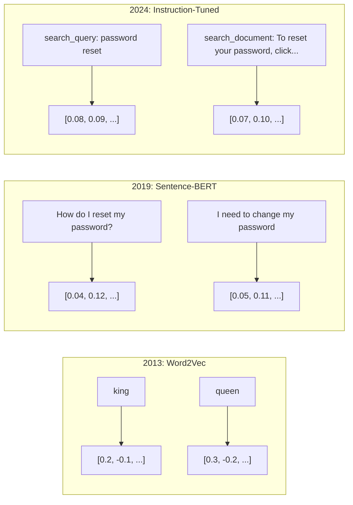
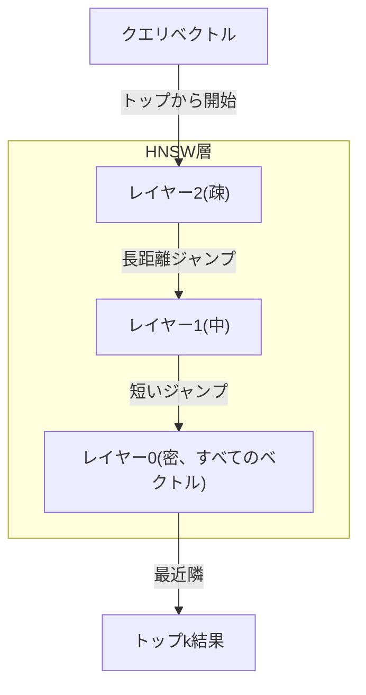

# 埋め込みとベクトル表現

> テキストは離散的です。数学は連続的です。LLMに「似た」ドキュメントを見つけたり、意味を比較したり、キーワード検索を超えて検索させたりするたびに、これらの2つの世界を橋渡しする何かに依存しています。その橋が埋め込みです。埋め込みを理解していなければ、モダンAIを理解していないのです。あなたはそれを使っているだけです。

**タイプ:** ビルド
**言語:** Python
**前提条件:** Phase 11, Lesson 01 (プロンプトエンジニアリング)
**所要時間:** 約75分
**関連:** Phase 5 · 22 (埋め込みモデルの詳細解説)では、密集型、疎型、多ベクトルの比較、マトリョーシカ切り詰め、軸ごとのモデル選択をカバーしています。このレッスンは本番パイプライン(ベクトルDB、HNSW、類似度計算)に焦点を当てています。モデルを選択する前にPhase 5 · 22をお読みください。

## 学習目標

- APIプロバイダーとオープンソースモデルを使用してテキスト埋め込みを生成し、それらの間のコサイン類似度を計算する
- 埋め込みがキーワード検索では対応できない語彙不一致問題をどのように解決するかを説明する
- 正確なキーワード一致ではなく意味によってドキュメントを取得するセマンティック検索インデックスを構築する
- 検索ベンチマーク(precision@k、recall)を使用して埋め込み品質を評価し、タスクに適切な埋め込みモデルを選択する

## 問題

10,000件のサポートチケットがあります。顧客が「payment didn't go through」と書きます。似たような過去のチケットを見つける必要があります。キーワード検索は「payment」と「didn't go through」を含むチケットを見つけます。「transaction failed」「charge was declined」「billing error」を見逃します。これらのチケットはまったく異なる単語で同じ問題を説明しています。

これが語彙不一致問題です。人間の言語には同じことを言う方法が数十あります。キーワード検索は各単語を意味のない独立したシンボルとして扱います。「declined」と「didn't go through」が同じ概念を指していることを知ることができません。

意味が類似性を決める、綴りではなく意味で決まるテキスト表現が必要です。「my payment didn't go through」と「transaction was declined」を数学的空間内で近い位置に配置し、「my payment arrived on time」を「payment」という単語を共有しているにもかかわらず遠い位置に押しやる必要があります。

その表現が埋め込みです。

## コンセプト

### 埋め込みとは何か

埋め込みはテキストの意味を表す浮動小数点数の密ベクトルです。「密」という言葉が重要です。すべての次元が情報を持ちます。疎表現(bag-of-words、TF-IDF)とは異なり、ほとんどの次元がゼロです。

「The cat sat on the mat」は`[0.023, -0.041, 0.087, ..., 0.012]`のようなものになります。モデルに応じて768から3072の数字のリストです。これらの数字は意味をエンコードしています。直接検査することはありません。比較するだけです。

### Word2Vecの突破口

2013年、GoogleのTomas Mikolovと同僚がWord2Vecを発表しました。コアとなる洞察:近くの単語から単語を予測するニューラルネットワークを訓練すれば、隠れ層の重みは意味のあるベクトル表現になるということです。

有名な結果:

```
king - man + woman = queen
```

単語埋め込みのベクトル演算はセマンティック関係を捉えます。「man」から「woman」への方向は、「king」から「queen」への方向とほぼ同じです。幾何学が意味をエンコードできることに気付いた瞬間です。

Word2Vecは300次元ベクトルを生成しました。各単語はコンテキストに関係なく1つのベクトルを取得しました。「river bank」の「bank」と「bank account」の「bank」は同じ埋め込みを持っていました。この制限が次の10年間の研究を推進しました。

### 単語から文へ

単語埋め込みは単一トークンを表します。本番システムは文全体、段落、またはドキュメント全体を埋め込む必要があります。4つのアプローチが出現しました:

**平均化**: 文内のすべての単語ベクトルの平均を取ります。安価で情報損失がありますが、短いテキストの場合は驚くほどまともです。単語の順序を完全に失います。「dog bites man」と「man bites dog」は同じ埋め込みになります。

**CLSトークン**: トランスフォーマーモデル(BERT、2018)は全入力を表す特殊な[CLS]トークン埋め込みを出力します。平均化より優れていますが、[CLS]トークンは次文予測のために訓練されたもので、類似度のためではありません。

**対比学習**: モデルを明示的に訓練して、似たペアを一緒に押し、異なるペアを離します。Sentence-BERT(Reimers & Gurevych、2019)はこのアプローチを使用し、モダン埋め込みモデルの基礎になりました。「How do I reset my password?」と「I need to change my password」では、モデルはこれらがほぼ同一のベクトルを持つべきことを学びます。

**命令チューニング埋め込み**: 最新のアプローチ。E5やGTEのようなモデルはタスクプレフィックス(「search_query:」「search_document:」)を受け入れ、モデルに生成する埋め込みの種類を伝えます。これにより、1つのモデルが複数のタスクに対応できます。



### モダン埋め込みモデル

市場は本番環境向けのオプションに落ち着いています(MTEB v2の2026年初期現在のスコア):

| モデル | プロバイダー | 次元 | MTEB | コンテキスト | コスト / 100万トークン |
|-------|----------|-----------|------|---------|------------------|
| Gemini Embedding 2 | Google | 3072 (マトリョーシカ) | 67.7 (検索) | 8192 | $0.15 |
| embed-v4 | Cohere | 1024 (マトリョーシカ) | 65.2 | 128K | $0.12 |
| voyage-4 | Voyage AI | 1024/2048 (マトリョーシカ) | 66.8 | 32K | $0.12 |
| text-embedding-3-large | OpenAI | 3072 (マトリョーシカ) | 64.6 | 8192 | $0.13 |
| text-embedding-3-small | OpenAI | 1536 (マトリョーシカ) | 62.3 | 8192 | $0.02 |
| BGE-M3 | BAAI | 1024 (密集+疎+ColBERT) | 63.0 多言語 | 8192 | オープンウェイト |
| Qwen3-Embedding | Alibaba | 4096 (マトリョーシカ) | 66.9 | 32K | オープンウェイト |
| Nomic-embed-v2 | Nomic | 768 (マトリョーシカ) | 63.1 | 8192 | オープンウェイト |

MTEB (Massive Text Embedding Benchmark) v2は検索、分類、クラスタリング、リランキング、要約など100以上のタスクをカバーします。高いほど良いです。2026年までに、オープンウェイトモデル(Qwen3-Embedding、BGE-M3)はほとんどの軸でクローズドホストモデルと同等またはそれを上回ります。Gemini Embedding 2は純粋な検索で主導します。Voyage/Cohere特定のドメイン(ファイナンス、法律、コード)で主導します。常にコミットする前に自分のクエリで関連するベンチマークをしてください。

### 類似度メトリクス

2つの埋め込みベクトルが与えられたとき、どのくらい似ているかを測定する3つの方法:

**コサイン類似度**: 2つのベクトル間の角度のコサイン。-1(反対)から1(同じ方向)の範囲です。大きさを無視します。10単語の文と500単語のドキュメントは同じ方向を指している場合、1.0にスコアできます。これはほとんどのユースケースの90%のデフォルトです。

```
cosine_sim(a, b) = dot(a, b) / (||a|| * ||b||)
```

**ドット積**: 2つのベクトルの生のスカラー積。ベクトルが正規化されている場合(単位長)、コサイン類似度と同一です。計算が速いです。OpenAIの埋め込みは正規化されているため、ドット積とコサインは同じランキングを与えます。

```
dot(a, b) = sum(a_i * b_i)
```

**ユークリッド(L2)距離**: ベクトル空間内の直線距離。小さい=より似ています。大きさの違いに敏感です。空間内の絶対位置が重要で、方向だけが重要ではない場合に使用します。

```
L2(a, b) = sqrt(sum((a_i - b_i)^2))
```

どちらを使うかのガイドラインは:

| メトリクス | 使用時 | 避けるべき時 |
|--------|----------|------------|
| コサイン類似度 | 異なる長さのテキストを比較、ほとんどの検索タスク | 大きさが情報を持つ場合 |
| ドット積 | 埋め込みが既に正規化されている、最大速度 | ベクトルが異なる大きさを持つ場合 |
| ユークリッド距離 | クラスタリング、空間最近隣問題 | 大きく異なる長さのドキュメントを比較する場合 |

### ベクトルデータベースとHNSW

ブルートフォース類似度検索は、保存されているすべてのベクトルに対してクエリを比較します。100万のベクトルと1536の次元では、クエリあたり15億の乗算・加算操作になります。遅すぎます。

ベクトルデータベースはApproximate Nearest Neighbor (ANN)アルゴリズムでこれを解決します。支配的なアルゴリズムはHNSW(Hierarchical Navigable Small World)です:

1. ベクトルの多層グラフを構築
2. トップレイヤーはまばら――遠く離れたクラスタ間の長距離接続
3. 下位レイヤーは密――近いベクトル間の細かい接続
4. 検索はトップレイヤーから開始し、貪欲に下降して精緻化
5. O(log n)時間でO(n)ではなく近似的なトップk結果を返す

HNSWは小さな精度低下(通常95-99%リコール)と引き換えに、大幅な速度向上を実現します。1000万ベクトルでは、ブルートフォースは秒かかります。HNSWはミリ秒です。



本番オプション:

| データベース | タイプ | 最適な用途 | 最大規模 |
|----------|------|----------|-----------|
| Pinecone | マネージドSaaS | ゼロ運用本番 | 数十億 |
| Weaviate | オープンソース | セルフホスト、ハイブリッド検索 | 1億以上 |
| Qdrant | オープンソース | 高性能、フィルタリング | 1億以上 |
| ChromaDB | 組み込み | プロトタイピング、ローカル開発 | 100万 |
| pgvector | Postgres拡張 | 既にPostgresを使用 | 1000万 |
| FAISS | ライブラリ | インプロセス、研究 | 10億以上 |

### チャンキング戦略

ドキュメントは単一ベクトルとして埋め込めるには長すぎます。50ページのPDFは数十のトピックをカバーしています。その埋め込みはすべての平均になり、何にも似ていません。ドキュメントをチャンクに分割し、各チャンクを埋め込みます。

**固定サイズチャンキング**: NトークンごとにMトークンのオーバーラップで分割します。シンプルで予測可能です。ドキュメントに明確な構造がない場合に機能します。512トークンチャンク、50トークンオーバーラップ: チャンク1はトークン0-511、チャンク2はトークン462-973です。

**文ベースチャンキング**: 文境界で分割し、文をグループ化してトークン制限に達するまで続けます。各チャンクは最低1つの完全な文です。固定サイズより優れています。考えを半分に切ることはありません。

**再帰的チャンキング**: 最大の境界(セクションヘッダー)から分割を試みます。まだ大きすぎる場合は段落境界を試みます。次に文境界。最後に文字制限です。これはLangChainの`RecursiveCharacterTextSplitter`であり、混合形式のコーパスに適しています。

**セマンティックチャンキング**: 各文を埋め込み、埋め込みが似ている連続文をグループ化します。埋め込み類似度が閾値を下回ると、新しいチャンクを開始します。高価です(各文を個別に埋め込む必要があります)が、最も一貫性のあるチャンクを生成します。

| 戦略 | 複雑性 | 品質 | 最適な用途 |
|----------|-----------|---------|----------|
| 固定サイズ | 低 | まあまあ | 構造化されていないテキスト、ログ |
| 文ベース | 低 | 良好 | 記事、メール |
| 再帰的 | 中 | 良好 | マークダウン、HTML、混合ドキュメント |
| セマンティック | 高 | 最高 | 臨界検索品質 |

ほとんどのシステムの甘い点: 256-512トークンチャンク、50トークンオーバーラップ。

### バイエンコーダ対クロスエンコーダ

バイエンコーダはクエリとドキュメントを独立して埋め込み、次にベクトルを比較します。高速です。クエリを一度埋め込み、事前計算されたドキュメント埋め込みと比較します。これが検索に使用するものです。

クロスエンコーダは、クエリとドキュメントを単一入力として取得し、関連度スコアを出力します。遅いです。各クエリ-ドキュメントペアを完全なモデルの処理を通します。しかし、はるかに正確です。同時にクエリとドキュメントトークンに注目できるからです。

本番パターン: バイエンコーダは上位100候補を検索し、クロスエンコーダが上位10にリランクします。これがretrieve-then-rerankパイプラインです。


リランキングモデル: Cohere Rerank 3.5 (クエリあたり$2/1000)、BGE-reranker-v2(無料、オープンソース)、Jina Reranker v2(無料、オープンソース)。

### マトリョーシカ埋め込み

従来の埋め込みはオールオアナッシングです。1536次元ベクトルは1536個のフロートを使用します。256次元に切り詰めることはできず、再訓練が必要です。

マトリョーシカ表現学習(Kusupati et al., 2022)はこれを修正します。モデルは最初のN次元が最も重要な情報をキャプチャするように訓練されます。ロシアの入れ子人形のように。1536dマトリョーシカ埋め込みを256次元に切り詰めるといくつか精度が失われますが、機能的なままです。

OpenAIのtext-embedding-3-smallとtext-embedding-3-largeは`dimensions`パラメータでマトリョーシカ切り詰めをサポートします。1536ではなく256次元をリクエストすると、ストレージが6倍削減され、MTEBベンチマークで約3-5%精度が失われます。

### バイナリ量子化

1536次元埋め込みをfloat32として保存するのに6,144バイトかかります。1000万ドキュメントを掛けると: ベクトルだけで61GBです。

バイナリ量子化は各フロートを単一ビットに変換します: 正の値は1、負の値は0になります。ストレージは6,144バイトから192バイト――32倍削減――に低下します。類似度はハミング距離(異なるビット数を数える)を使用して計算されます。CPUは単一命令でこれを実行できます。

精度低下は検索リコールで約5-10%です。一般的なパターン: 数百万ベクトルに対する最初のパス検索にバイナリ量子化を使用し、次にトップ1000を完全精度ベクトルで再スコアします。これは完全精度精度の95%以上を32倍少ないメモリで実現します。

## ビルドする

ゼロから検索エンジンを構築します。ベクトルデータベースなし。外部埋め込みAPIなし。numpyを使った純粋なPythonです。

### ステップ1: テキストチャンキング

```python
def chunk_text(text, chunk_size=200, overlap=50):
    words = text.split()
    chunks = []
    start = 0
    while start < len(words):
        end = start + chunk_size
        chunk = " ".join(words[start:end])
        chunks.append(chunk)
        start += chunk_size - overlap
    return chunks


def chunk_by_sentences(text, max_chunk_tokens=200):
    sentences = text.replace("\n", " ").split(".")
    sentences = [s.strip() + "." for s in sentences if s.strip()]
    chunks = []
    current_chunk = []
    current_length = 0
    for sentence in sentences:
        sentence_length = len(sentence.split())
        if current_length + sentence_length > max_chunk_tokens and current_chunk:
            chunks.append(" ".join(current_chunk))
            current_chunk = []
            current_length = 0
        current_chunk.append(sentence)
        current_length += sentence_length
    if current_chunk:
        chunks.append(" ".join(current_chunk))
    return chunks
```

### ステップ2: ゼロから埋め込みを構築する

L2正規化された単純な密埋め込みTF-IDFを実装します。これはニューラル埋め込みではありませんが、同じコントラクトに従います: テキストで、固定サイズベクトル出、似たテキストは似たベクトルを生成します。

```python
import math
import numpy as np
from collections import Counter

class SimpleEmbedder:
    def __init__(self):
        self.vocab = []
        self.idf = []
        self.word_to_idx = {}

    def fit(self, documents):
        vocab_set = set()
        for doc in documents:
            vocab_set.update(doc.lower().split())
        self.vocab = sorted(vocab_set)
        self.word_to_idx = {w: i for i, w in enumerate(self.vocab)}
        n = len(documents)
        self.idf = np.zeros(len(self.vocab))
        for i, word in enumerate(self.vocab):
            doc_count = sum(1 for doc in documents if word in doc.lower().split())
            self.idf[i] = math.log((n + 1) / (doc_count + 1)) + 1

    def embed(self, text):
        words = text.lower().split()
        count = Counter(words)
        total = len(words) if words else 1
        vec = np.zeros(len(self.vocab))
        for word, freq in count.items():
            if word in self.word_to_idx:
                tf = freq / total
                vec[self.word_to_idx[word]] = tf * self.idf[self.word_to_idx[word]]
        norm = np.linalg.norm(vec)
        if norm > 0:
            vec = vec / norm
        return vec
```

### ステップ3: 類似度関数

```python
def cosine_similarity(a, b):
    dot = np.dot(a, b)
    norm_a = np.linalg.norm(a)
    norm_b = np.linalg.norm(b)
    if norm_a == 0 or norm_b == 0:
        return 0.0
    return float(dot / (norm_a * norm_b))


def dot_product(a, b):
    return float(np.dot(a, b))


def euclidean_distance(a, b):
    return float(np.linalg.norm(a - b))
```

### ステップ4: ブルートフォース検索を使用したベクトルインデックス

```python
class VectorIndex:
    def __init__(self):
        self.vectors = []
        self.texts = []
        self.metadata = []

    def add(self, vector, text, meta=None):
        self.vectors.append(vector)
        self.texts.append(text)
        self.metadata.append(meta or {})

    def search(self, query_vector, top_k=5, metric="cosine"):
        scores = []
        for i, vec in enumerate(self.vectors):
            if metric == "cosine":
                score = cosine_similarity(query_vector, vec)
            elif metric == "dot":
                score = dot_product(query_vector, vec)
            elif metric == "euclidean":
                score = -euclidean_distance(query_vector, vec)
            else:
                raise ValueError(f"Unknown metric: {metric}")
            scores.append((i, score))
        scores.sort(key=lambda x: x[1], reverse=True)
        results = []
        for idx, score in scores[:top_k]:
            results.append({
                "text": self.texts[idx],
                "score": score,
                "metadata": self.metadata[idx],
                "index": idx
            })
        return results

    def size(self):
        return len(self.vectors)
```

### ステップ5: セマンティック検索エンジン

```python
class SemanticSearchEngine:
    def __init__(self, chunk_size=200, overlap=50):
        self.embedder = SimpleEmbedder()
        self.index = VectorIndex()
        self.chunk_size = chunk_size
        self.overlap = overlap

    def index_documents(self, documents, source_names=None):
        all_chunks = []
        all_sources = []
        for i, doc in enumerate(documents):
            chunks = chunk_text(doc, self.chunk_size, self.overlap)
            all_chunks.extend(chunks)
            name = source_names[i] if source_names else f"doc_{i}"
            all_sources.extend([name] * len(chunks))
        self.embedder.fit(all_chunks)
        for chunk, source in zip(all_chunks, all_sources):
            vec = self.embedder.embed(chunk)
            self.index.add(vec, chunk, {"source": source})
        return len(all_chunks)

    def search(self, query, top_k=5, metric="cosine"):
        query_vec = self.embedder.embed(query)
        return self.index.search(query_vec, top_k, metric)

    def search_with_scores(self, query, top_k=5):
        results = self.search(query, top_k)
        return [
            {
                "text": r["text"][:200],
                "source": r["metadata"].get("source", "unknown"),
                "score": round(r["score"], 4)
            }
            for r in results
        ]
```

### ステップ6: 類似度メトリクスの比較

```python
def compare_metrics(engine, query, top_k=3):
    results = {}
    for metric in ["cosine", "dot", "euclidean"]:
        hits = engine.search(query, top_k=top_k, metric=metric)
        results[metric] = [
            {"score": round(h["score"], 4), "preview": h["text"][:80]}
            for h in hits
        ]
    return results
```

## 使用する

本番埋め込みAPIで、アーキテクチャは同じです。埋め込め側だけが変わります:

```python
from openai import OpenAI

client = OpenAI()

def openai_embed(texts, model="text-embedding-3-small", dimensions=None):
    kwargs = {"model": model, "input": texts}
    if dimensions:
        kwargs["dimensions"] = dimensions
    response = client.embeddings.create(**kwargs)
    return [item.embedding for item in response.data]
```

OpenAIでマトリョーシカ切り詰め――同じモデル、より少ない次元、より低いストレージ:

```python
full = openai_embed(["semantic search query"], dimensions=1536)
compact = openai_embed(["semantic search query"], dimensions=256)
```

256dベクトルはストレージの6倍を使用します。1000万ドキュメントでは、それは10GBと61GBです。標準ベンチマークで精度低下は約3-5%です。

Cohere でのリランキング:

```python
import cohere

co = cohere.ClientV2()

results = co.rerank(
    model="rerank-v3.5",
    query="What is the refund policy?",
    documents=["Full refund within 30 days...", "No refunds after 90 days..."],
    top_n=3
)
```

APIの依存性がない場合のローカル埋め込み:

```python
from sentence_transformers import SentenceTransformer

model = SentenceTransformer("BAAI/bge-small-en-v1.5")
embeddings = model.encode(["semantic search query", "another document"])
```

ビルドからのVectorIndexクラスはこれらのいずれでも機能します。埋め込み関数をスワップしてください。検索ロジック、チャンキング、プロンプト構築――すべてどのモデルを使うかに関係なく同じです。

## 出荷する

このレッスンは以下を出力します:
- `outputs/prompt-embedding-advisor.md` ――特定のユースケースに対して埋め込みモデルと戦略を選択するためのプロンプト
- `outputs/skill-embedding-patterns.md` ――エージェントが本番環境で埋め込みを効果的に使用する方法を教えるスキル

## 演習

1. **メトリクス比較**: サンプルドキュメントに対して同じ5つのクエリをコサイン類似度、ドット積、ユークリッド距離を使用して実行します。各メトリクスについてトップ3結果を記録します。メトリクスが異なる場合、なぜですか?

2. **チャンク サイズ実験**: サンプルドキュメントを50、100、200、500単語のチャンクサイズでインデックスします。各サイズについて5つのクエリを実行し、トップ1類似度スコアを記録します。チャンクサイズと検索品質の関係をプロットします。より大きなチャンクが傷つけ始める点を見つけます。

3. **マトリョーシカシミュレーション**: 500d ベクトルを生成するSimpleEmbedderを構築します。50、100、200、500次元に切り詰めます。各切り詰めで検索リコールがどの程度低下するかを測定します。これは実際の訓練トリックなしでマトリョーシカ動作をシミュレートします。

4. **バイナリ量子化**: 検索エンジンから埋め込みを取得し、バイナリに変換(正は1、負は0)し、ハミング距離検索を実装します。トップ10結果を完全精度コサイン類似度と比較します。オーバーラップ率を測定します。

5. **文ベースチャンキング**: 固定サイズチャンキングを`chunk_by_sentences`に置き換えます。同じクエリを実行し、検索スコアを比較します。文境界を尊重することは結果を改善しますか?

## 主な用語

| 用語 | 人々が言うこと | 実際に意味すること |
|------|----------------|----------------------|
| 埋め込み | 「テキストを数字に」 | 幾何的近接がセマンティック類似性をエンコードする密ベクトル |
| Word2Vec | 「元祖埋め込み」 | コンテキスト単語を予測することで単語ベクトルを学習した2013年モデル。ベクトル演算が意味をエンコードすることを証明しました |
| コサイン類似度 | 「2つのベクトルはどのくらい似ていますか」 | ベクトル間の角度のコサイン。1 =同一方向、0 =直交、-1 =反対 |
| HNSW | 「高速ベクトル検索」 | 階層的ナビゲーション可能な小世界グラフ――O(log n)近似最近隣検索を可能にする多層構造 |
| バイエンコーダ | 「別々に埋め込み、高速比較」 | クエリとドキュメントを独立してベクトルにエンコード。事前計算と高速検索を可能にします |
| クロスエンコーダ | 「遅いが正確なリランカー」 | クエリ-ドキュメントペアを完全なモデルで共同処理。より高い精度、事前計算なし |
| マトリョーシカ埋め込み | 「切り詰め可能なベクトル」 | 最初のN次元が最も重要な情報をキャプチャするように訓練された埋め込み。可変サイズストレージを有効にします |
| バイナリ量子化 | 「1ビット埋め込み」 | フロートベクトルをバイナリ(符号ビットのみ)に変換。32倍ストレージ削減、ハミング距離検索 |
| チャンキング | 「埋め込みのドキュメント分割」 | ドキュメントを256-512トークンセグメントに分割するので各セグメントは独立して埋め込まれと取得可能 |
| ベクトルデータベース | 「埋め込みの検索エンジン」 | ベクトル保存と規模での近似最近隣検索を最適化するデータストア |
| 対比学習 | 「比較で訓練」 | 似たペア埋め込みを一緒に押し、異なるペア埋め込みを離すことで訓練するアプローチ |
| MTEB | 「埋め込みベンチマーク」 | 多量テキスト埋め込みベンチマーク――8つのタスク間の56データセット。埋め込みモデルの比較標準 |

## 参考文献

- Mikolov et al., "Efficient Estimation of Word Representations in Vector Space" (2013) ――king-queen類推で埋め込み革命を開始したWord2Vecペーパー
- Reimers & Gurevych, "Sentence-BERT: Sentence Embeddings using Siamese BERT-Networks" (2019) ――文レベル類似度のためのバイエンコーダ訓練方法。モダン埋め込みモデルの基礎
- Kusupati et al., "Matryoshka Representation Learning" (2022) ――OpenAIがtext-embedding-3に採用した可変次元埋め込みのテクニック
- Malkov & Yashunin, "Efficient and Robust Approximate Nearest Neighbor using Hierarchical Navigable Small World Graphs" (2018) ――HNSWペーパー。ほとんどの本番ベクトル検索背後のアルゴリズム
- OpenAI Embeddings Guide (platform.openai.com/docs/guides/embeddings) ――マトリョーシカ次元削減を含むtext-embedding-3モデルの実用的なリファレンス
- MTEB Leaderboard (huggingface.co/spaces/mteb/leaderboard) ――タスクと言語間ですべての埋め込みモデルを比較するライブベンチマーク
- [Muennighoff et al., "MTEB: Massive Text Embedding Benchmark" (EACL 2023)](https://arxiv.org/abs/2210.07316) ――リーダーボードが報告する8つのタスクカテゴリ(分類、クラスタリング、ペア分類、リランキング、検索、STS、要約、バイテキストマイニング)を定義するベンチマーク。単一のMTEBスコアを信じる前に読みます。
- [Sentence Transformers documentation](https://www.sbert.net/) ――バイエンコーダ対クロスエンコーダ、プーリング戦略、このレッスンが実装するingest-split-embed-store RAGパイプラインの正式リファレンス。
