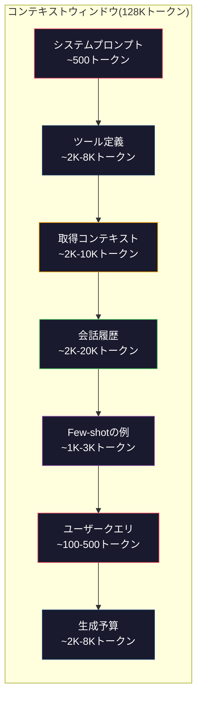
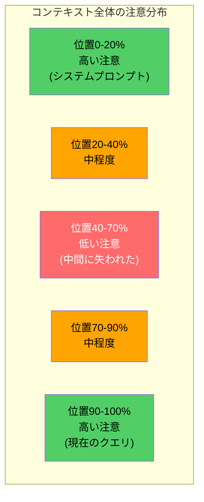
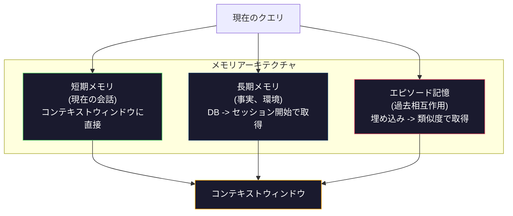

# コンテキストエンジニアリング: ウィンドウ、予算、メモリ、検索

> プロンプトエンジニアリングは部分です。コンテキストエンジニアリングが全体ゲームです。プロンプトは文字列です。コンテキストはモデルのウィンドウに入るすべてです: システム指示、取得されたドキュメント、ツール定義、会話履歴、few-shotの例、プロンプト自体。2026年で最高のAIエンジニアはコンテキストエンジニアです。何が入るか、何が出ているか、どの順序かを決定します。

**タイプ:** ビルド
**言語:** Python
**前提条件:** Phase 10 (LLMsゼロから), Phase 11 Lesson 01-02
**所要時間:** 約90分
**関連:** Phase 11 · 15 (プロンプトキャッシング) ――キャッシュフレンドリーレイアウトはコンテキストエンジニアリングの拡張です。Phase 5 · 28 (長コンテキスト評価)でNIAH/RULERで失われた中間を測定する方法。

## 学習目標

- システムプロンプト、ツール、履歴、取得ドキュメント、生成ヘッドルームに対するトークン予算全体を計算する
- 会話履歴のコンテキストウィンドウ管理戦略を実装: 切り詰め、要約、スライディングウィンドウ
- 最も関連情報へのモデルの注意を最大化するコンテキストコンポーネントを優先度付け・順序付けする
- クエリタイプと利用可能なウィンドウスペースに基づいてトークンを動的に割り当てるコンテキストアセンブラーを構築する

## 問題

Claude Opus 4.7は200Kトークンウィンドウを持っています(ベータで1M)。GPT-5は400K。Gemini 3 Proは2M。Llama 4は10Mを要求しています。これらの数字は本当に大きく見えるまでそれらを埋めます。

実際のコーディングアシスタント分解:システムプロンプト: 500トークン。50ツールのツール定義: 8,000トークン。取得ドキュメント: 4,000トークン。会話履歴(10ターン): 6,000トークン。現在のユーザークエリ: 200トークン。生成予算(最大出力): 4,000トークン。合計: 22,700トークン。これは128K ウィンドウの18%に過ぎません。

しかし注意はコンテキスト長とともに線形にスケーリングしません。128Kトークンのコンテキストを持つモデルは二次注意コスト(Vanilla Transformerではo(n^2)ですが、ほとんどの本番モデルは効率的な注意ハリアントを使用)を支払います。さらに重要なことに、検索精度が低下します。「Needle in a Haystack」テストは、モデルは長いコンテキストの中間に配置された情報を見つけるのに苦労することを示します。Liu et al. (2023)の研究は、LLMが長いコンテキストの開始と終了で情報を検索するのに近完全精度で、しかし中間(コンテキストの位置40-70%)で精度が10-20%低下することを示しました。この「lost-in-the-middle」効果はモデルによって異なります。すべての現在のアーキテクチャに影響を与えます。

実用的な教訓: 200Kトークン利用可能であることは、200Kトークンを使用することが効果的であることを意味しません。注意深くキュレーションされた10Kトークンコンテキストは、ダンプされた100Kトークンコンテキストを上回ることがしばしばあります。コンテキストエンジニアリングはコンテキストウィンドウ内の信号対ノイズ比を最大化する規律です。

ウィンドウに入れるすべてのトークンは、より関連性のある情報を持つトークンを置き換えます。すべての無関連ツール定義、古い会話ターン、質問に回答しない取得テキストの各部分――各部分はモデルをタスクでわずかに悪くします。

## コンセプト

### コンテキストウィンドウは希少リソース

コンテキストウィンドウをディスクではなくRAMと考えてください。高速で直接アクセス可能ですが、制限されています。すべてをフィットさせることはできません。選択する必要があります。



各コンポーネントはスペース用に競合します。ツール定義を追加すると、会話履歴の余地が減ります。取得コンテキストを追加するとfew-shotの例の余地が減ります。コンテキストエンジニアリングはタスク性能を最大化するこの予算を割り当てる芸術です。

### Lost-in-the-Middle

コンテキストエンジニアリングで最も重要な経験的知見。モデルはコンテキスト開始と終了の情報に注目します。中間の情報は注目スコアが低く、無視される可能性が高いです。

Liu et al. (2023)は体系的にこれをテストしました。様々な位置に20個の無関連なドキュメント間に関連ドキュメントを配置し、回答精度を測定しました。関連ドキュメントが最初または最後だと、精度は85-90%でした。中間(20個中10番目)では、精度は60-70%に低下しました。

これはエンジニアリング含意を持っています:

- 最も重要な情報を最初に配置(システムプロンプト、重要な指示)
- 現在のクエリと最も関連するコンテキストを最後に配置(リセンシーバイアスが役立つ)
- コンテキストの中間を最優先度圏として扱う
- 中間に情報を含める必要がある場合、キーポイントを最後に複製



### コンテキストコンポーネント

**システムプロンプト**: ペルソナ、制約、動作規則を設定します。これはターン間で最初に行き、定数です。Claude Codeはツール定義と動作指示を含む約6,000トークンのシステムプロンプトを使用します。タイトトなままに。システムプロンプトのすべての単語がすべてのAPI呼び出しで繰り返されます。

**ツール定義**: 各ツールは50-200トークン(名前、説明、パラメータスキーマ)を追加します。50ツール150トークン各7,500トークン、会話前です。動的ツール選択――現在のクエリに関連するツールのみを含む――これを60-80%削減できます。

**取得コンテキスト**: ベクトルデータベース、検索結果、ファイル内容からのドキュメント。取得品質は直接応答品質を決定します。悪い検索は検索なしより悪いです。ノイズでウィンドウを埋め、モデルを積極的に誤解します。

**会話履歴**: すべての前のユーザーメッセージとアシスタント応答。会話長とともに線形に成長します。200トークンあたりターンの50ターン会話は10,000トークンの履歴です。ほとんずは現在のクエリに無関係です。

**Few-shotの例**: 望ましい動作を実演するの入出力ペア。2-3の良く選択された例は、多くの場合、数千トークンの指示より出力品質を改善します。しかし、スペース費用があります。

**生成予算**: モデル応答に予約されたトークン。ウィンドウを完全に埋めると、モデルは応答する余地がありません。生成のために少なくとも2,000-4,000トークンを予約してください。

### コンテキスト圧縮戦略

**履歴要約**: 以前のターンをすべてメモリのままに保つ代わりに、定期的に会話を要約します。「私たちはXについて議論し、Yに決定し、ユーザーはZ」100トークンで2,000トークンを要した10ターンを置き換えます。履歴が閾値を超えるときに要約を実行(例えば、5,000トークン)。

**関連性フィルタリング**: 現在のクエリに対する各取得ドキュメントを持つスコア、閾値下ドキュメントを破棄。10個のチャンクを取得しましたが、3つだけが関連である場合、他の7つを破棄。10個のまあまあなチャンクより3つの高度に関連あるチャンクがより良い。

**ツール削減**: ユーザークエリ意図を分類し、その意図に関連するツールのみを含めます。コード質問はカレンダーツールを必要としません。スケジューリング質問はファイルシステムツールを必要としません。これはツール定義を8,000トークンから1,000に削減できます。

**再帰的要約**: 非常に長いドキュメントについて、ステージで要約します。最初に各セクションを要約し、次に要約の要約。50ページドキュメントは主要ポイントをキャプチャする500トークンダイジェストになります。

### メモリシステム

コンテキストエンジニアリングは3時間ホライズンにまたがります。

**短期メモリ**: 現在の会話。コンテキストウィンドウに直接保存。各ターンで成長。要約と切り詰めで管理。

**長期メモリ**: 会話間で永続する事実と環境。「ユーザーはTypescriptを好む」「プロジェクトはPostgreSQLを使用」。データベースに保存、セッション開始で取得。Claude Codeはこれをファイルに保存します。ChatGPTはメモリ機能に保存。

**エピソード記憶**: 関連するかもしれない特定の過去相互作用。「先週火曜日、私たちはauth モジュールで似たような問題をデバッグしました」埋め込みとして保存、現在の会話が過去エピソードと一致するときに取得。



### 動的コンテキストアセンブリ

主な洞察: 異なるクエリは異なるコンテキストが必要です。静的システムプロンプト+静的ツール+静的履歴は無駄です。最高のシステムはクエリごとにコンテキストを動的にアセンブルします。

1. クエリ意図を分類
2. 関連ツールを選択(すべてのツールではなく)
3. 関連ドキュメントを取得(固定セットではなく)
4. 関連履歴ターンを含めます(すべての履歴ではなく)
5. タスクタイプと一致するfew-shotの例を追加
6. すべてを重要度でオーダー: 重要なFirst、重要なLast、オプションは中

これは良いAIアプリケーションを優れたものから分ける。モデルは同じ。コンテキストが微分です。

## ビルドする

### ステップ1: トークンカウンター

測定できないものを予算化できません。シンプルなトークンカウンター(正確な数はトークナイザーに依存するため、空白分割を使用した近似)を構築します。

```python
import json
import numpy as np
from collections import OrderedDict

def count_tokens(text):
    if not text:
        return 0
    return int(len(text.split()) * 1.3)

def count_tokens_json(obj):
    return count_tokens(json.dumps(obj))
```

### ステップ2: コンテキスト予算マネージャー

コア抽象。予算マネージャーはトークン数各コンポーネントが使用し、制限を実装するか追跡します。

```python
class ContextBudget:
    def __init__(self, max_tokens=128000, generation_reserve=4000):
        self.max_tokens = max_tokens
        self.generation_reserve = generation_reserve
        self.available = max_tokens - generation_reserve
        self.allocations = OrderedDict()

    def allocate(self, component, content, max_tokens=None):
        tokens = count_tokens(content)
        if max_tokens and tokens > max_tokens:
            words = content.split()
            target_words = int(max_tokens / 1.3)
            content = " ".join(words[:target_words])
            tokens = count_tokens(content)

        used = sum(self.allocations.values())
        if used + tokens > self.available:
            allowed = self.available - used
            if allowed <= 0:
                return None, 0
            words = content.split()
            target_words = int(allowed / 1.3)
            content = " ".join(words[:target_words])
            tokens = count_tokens(content)

        self.allocations[component] = tokens
        return content, tokens

    def remaining(self):
        used = sum(self.allocations.values())
        return self.available - used

    def utilization(self):
        used = sum(self.allocations.values())
        return used / self.max_tokens

    def report(self):
        total_used = sum(self.allocations.values())
        lines = []
        lines.append(f"コンテキスト予算レポート ({self.max_tokens:,}トークンウィンドウ)")
        lines.append("-" * 50)
        for component, tokens in self.allocations.items():
            pct = tokens / self.max_tokens * 100
            bar = "#" * int(pct / 2)
            lines.append(f"  {component:<25} {tokens:>6}トークン ({pct:>5.1f}%) {bar}")
        lines.append("-" * 50)
        lines.append(f"  {'使用済み':<25} {total_used:>6}トークン ({total_used/self.max_tokens*100:.1f}%)")
        lines.append(f"  {'生成予約':<25} {self.generation_reserve:>6}トークン")
        lines.append(f"  {'残り':<25} {self.remaining():>6}トークン")
        return "\n".join(lines)
```

### ステップ3: Lost-in-the-Middle再順序付け

再順序付け戦略を実装: 最も重要なアイテムは最初と最後に行き、最も重要でないアイテムは中間に行きます。

```python
def reorder_lost_in_middle(items, scores):
    paired = sorted(zip(scores, items), reverse=True)
    sorted_items = [item for _, item in paired]

    if len(sorted_items) <= 2:
        return sorted_items

    first_half = sorted_items[::2]
    second_half = sorted_items[1::2]
    second_half.reverse()

    return first_half + second_half

def score_relevance(query, documents):
    query_words = set(query.lower().split())
    scores = []
    for doc in documents:
        doc_words = set(doc.lower().split())
        if not query_words:
            scores.append(0.0)
            continue
        overlap = len(query_words & doc_words) / len(query_words)
        scores.append(round(overlap, 3))
    return scores
```

### ステップ4: 会話履歴コンプレッサー

古い会話ターンを要約してトークン予算を再利用します。

```python
class ConversationManager:
    def __init__(self, max_history_tokens=5000):
        self.turns = []
        self.summaries = []
        self.max_history_tokens = max_history_tokens

    def add_turn(self, role, content):
        self.turns.append({"role": role, "content": content})
        self._compress_if_needed()

    def _compress_if_needed(self):
        total = sum(count_tokens(t["content"]) for t in self.turns)
        if total <= self.max_history_tokens:
            return

        while total > self.max_history_tokens and len(self.turns) > 4:
            old_turns = self.turns[:2]
            summary = self._summarize_turns(old_turns)
            self.summaries.append(summary)
            self.turns = self.turns[2:]
            total = sum(count_tokens(t["content"]) for t in self.turns)

    def _summarize_turns(self, turns):
        parts = []
        for t in turns:
            content = t["content"]
            if len(content) > 100:
                content = content[:100] + "..."
            parts.append(f"{t['role']}: {content}")
        return "前: " + " | ".join(parts)

    def get_context(self):
        parts = []
        if self.summaries:
            parts.append("[会話要約]")
            for s in self.summaries:
                parts.append(s)
        parts.append("[最近の会話]")
        for t in self.turns:
            parts.append(f"{t['role']}: {t['content']}")
        return "\n".join(parts)

    def token_count(self):
        return count_tokens(self.get_context())
```

### ステップ5: 動的ツールセレクター

現在のクエリに関連するツールのみを含めます。意図を分類し、フィルタします。

```python
TOOL_REGISTRY = {
    "read_file": {
        "description": "ファイルの内容を読み取る",
        "tokens": 120,
        "categories": ["code", "files"],
    },
    "write_file": {
        "description": "ファイルに内容を書き込む",
        "tokens": 150,
        "categories": ["code", "files"],
    },
    "search_code": {
        "description": "コードベースでパターンを検索",
        "tokens": 130,
        "categories": ["code"],
    },
    "run_command": {
        "description": "シェルコマンドを実行",
        "tokens": 140,
        "categories": ["code", "system"],
    },
    "create_calendar_event": {
        "description": "新しいカレンダーイベントを作成",
        "tokens": 180,
        "categories": ["calendar"],
    },
    "list_emails": {
        "description": "最近のメールをリストアップ",
        "tokens": 160,
        "categories": ["email"],
    },
    "send_email": {
        "description": "メールメッセージを送信",
        "tokens": 200,
        "categories": ["email"],
    },
    "web_search": {
        "description": "ウェブで情報を検索",
        "tokens": 140,
        "categories": ["research"],
    },
    "query_database": {
        "description": "データベースでSQLクエリを実行",
        "tokens": 170,
        "categories": ["code", "data"],
    },
    "generate_chart": {
        "description": "データからチャートを生成",
        "tokens": 190,
        "categories": ["data", "visualization"],
    },
}

def classify_intent(query):
    query_lower = query.lower()

    intent_keywords = {
        "code": ["code", "function", "bug", "error", "file", "implement", "refactor", "debug", "test"],
        "calendar": ["meeting", "schedule", "calendar", "appointment", "event"],
        "email": ["email", "mail", "send", "inbox", "message"],
        "research": ["search", "find", "what is", "how does", "explain", "look up"],
        "data": ["data", "query", "database", "chart", "graph", "analytics", "sql"],
    }

    scores = {}
    for intent, keywords in intent_keywords.items():
        score = sum(1 for kw in keywords if kw in query_lower)
        if score > 0:
            scores[intent] = score

    if not scores:
        return ["code"]

    max_score = max(scores.values())
    return [intent for intent, score in scores.items() if score >= max_score * 0.5]

def select_tools(query, token_budget=2000):
    intents = classify_intent(query)
    relevant = {}
    total_tokens = 0

    for name, tool in TOOL_REGISTRY.items():
        if any(cat in intents for cat in tool["categories"]):
            if total_tokens + tool["tokens"] <= token_budget:
                relevant[name] = tool
                total_tokens += tool["tokens"]

    return relevant, total_tokens
```

### ステップ6: フルコンテキストアセンブリパイプライン

すべてを一緒に配線。クエリが与えられて、最適コンテキストをアセンブルします。

```python
class ContextEngine:
    def __init__(self, max_tokens=128000, generation_reserve=4000):
        self.budget = ContextBudget(max_tokens, generation_reserve)
        self.conversation = ConversationManager(max_history_tokens=5000)
        self.system_prompt = (
            "あなたは役に立つAIアシスタント。コード編集、ファイル管理、ウェブ検索、データ分析用ツールにアクセスできます。"
            "各タスクに適切なツールを使用。簡潔で正確に。"
        )
        self.knowledge_base = [
            "Python 3.12 ブラケット記法を使用するジェネリッククラスのタイプパラメータ構文を導入しました。",
            "プロジェクトは埋め込みストレージのためpgvectorでPostgreSQL 16を使用。",
            "認証はJWTトークンでSupabase Authで処理。",
            "フロントエンドはApp Routerを持つNext.js 15で構築。",
            "APIレート制限はユーザーあたり分あたり100リクエストに設定。",
            "デプロイパイプラインはDocker マルチステージビルドでGitHub Actionsを使用。",
            "すべての新しいモジュール、テストカバレッジは80%以上である必要。",
            "コードベースはデータアクセスのためリポジトリパターンに従う。",
        ]

    def assemble(self, query):
        self.budget = ContextBudget(self.budget.max_tokens, self.budget.generation_reserve)

        system_content, _ = self.budget.allocate("system_prompt", self.system_prompt, max_tokens=1000)

        tools, tool_tokens = select_tools(query, token_budget=2000)
        tool_text = json.dumps(list(tools.keys()))
        tool_content, _ = self.budget.allocate("tools", tool_text, max_tokens=2000)

        relevance = score_relevance(query, self.knowledge_base)
        threshold = 0.1
        relevant_docs = [
            doc for doc, score in zip(self.knowledge_base, relevance)
            if score >= threshold
        ]

        if relevant_docs:
            doc_scores = [s for s in relevance if s >= threshold]
            reordered = reorder_lost_in_middle(relevant_docs, doc_scores)
            doc_text = "\n".join(reordered)
            doc_content, _ = self.budget.allocate("retrieved_context", doc_text, max_tokens=3000)

        history_text = self.conversation.get_context()
        if history_text.strip():
            history_content, _ = self.budget.allocate("conversation_history", history_text, max_tokens=5000)

        query_content, _ = self.budget.allocate("user_query", query, max_tokens=500)

        return self.budget

    def chat(self, query):
        self.conversation.add_turn("user", query)
        budget = self.assemble(query)
        response = f"[応答: {query[:50]}...]"
        self.conversation.add_turn("assistant", response)
        return budget


def run_demo():
    print("=" * 60)
    print("  コンテキストエンジニアリングパイプラインデモ")
    print("=" * 60)

    engine = ContextEngine(max_tokens=128000, generation_reserve=4000)

    print("\n--- クエリ1: コードタスク ---")
    budget = engine.chat("認証モジュールのバグを修正してください。JWTトークンは早期に有効期限切れになります")
    print(budget.report())

    print("\n--- クエリ2: 研究タスク ---")
    budget = engine.chat("PostgreSQLでベクトル検索を実装する最善の方法は何ですか?")
    print(budget.report())

    print("\n--- クエリ3: 会話履歴が蓄積した後 ---")
    for i in range(8):
        engine.conversation.add_turn("user", f"実装詳細についてのフォローアップ質問{i+1}")
        engine.conversation.add_turn("assistant", f"フォローアップ{i+1}への応答、アーキテクチャの技術詳細")

    budget = engine.chat("私たちが議論した変更を実装してください")
    print(budget.report())

    print("\n--- ツール選択の例 ---")
    test_queries = [
        "auth.pyのバグを修正",
        "火曜日にチームと会議をスケジュール",
        "データベースクエリの性能統計を表示",
        "エラー処理のベストプラクティスを検索",
    ]

    for q in test_queries:
        tools, tokens = select_tools(q)
        intents = classify_intent(q)
        print(f"\n  クエリ: {q}")
        print(f"  意図: {intents}")
        print(f"  ツール: {list(tools.keys())} ({tokens}トークン)")

    print("\n--- Lost-in-the-Middleの再順序付け ---")
    docs = ["Doc A (最も関連)", "Doc B (やや関連)", "Doc C (最も無関連)",
            "Doc D (関連)", "Doc E (やや関連)"]
    scores = [0.95, 0.60, 0.20, 0.80, 0.50]
    reordered = reorder_lost_in_middle(docs, scores)
    print(f"  元の順序: {docs}")
    print(f"  スコア:         {scores}")
    print(f"  再順序付け:      {reordered}")
    print(f"  (最も関連は開始と終了、最も無関連は中間)")
```

## 使用する

### Claude Code のコンテキスト戦略

Claude Code はレイヤーアプローチでコンテキストを管理します。システムプロンプトには動作規則とツール定義(~6Kトークン)が含まれます。ファイルを開くと、その内容がコンテキストとして挿入されます。検索時に結果が追加されます。古い会話ターンが要約されます。CLAUDE.mdはセッション間で永続する長期メモリーを提供します。

主要なエンジニアリング決定: Claude Code はコードベース全体をコンテキストにダンプしません。要求に応じて関連ファイルを取得します。これはアクション中のコンテキストエンジニアリングです。

### Cursor の動的コンテキスト読み込み

Cursor はコードベース全体をベクトル埋め込みにインデックスします。クエリを入力すると、ベクトル類似度を使用して最も関連ファイルとコードブロックを取得します。これらのピースのみがコンテキストウィンドウに入ります。500Kラインコードベースは最も関連する5-10コードブロックに圧縮されます。

これがパターン: すべてを埋め込み、要求で取得、重要なもののみを含める。

### ChatGPT Memory

ChatGPTはユーザー環境設定と事実を長期メモリとして保存します。各会話開始では、関連メモリが取得され、システムプロンプトに含まれます。「ユーザーはPythonを好む」は5トークンコストしますが、会話間で反復指示の数百トークンを保存します。

### RAG as Context Engineering

検索強化生成はコンテキストエンジニアリング形式化です。知識を(訓練)(静的コンテキスト)またはシステムプロンプト(静的コンテキスト)にベーク代わりに、クエリ時に関連ドキュメント取得してコンテキストウィンドウに挿入。全RAGパイプライン――チャンキング、埋め込み、検索、リランキング――は1つの問題を解決: コンテキストウィンドウに正しい情報を入れる。

## 出荷する

このレッスンは`outputs/prompt-context-optimizer.md`を出力します――コンテキスト アセンブリ戦略を監査し、最適化を推奨する再利用可能なプロンプト。システムプロンプト、ツール数、平均履歴長、検索戦略をフィードし、トークン無駄と改善推奨を識別します。

また`outputs/skill-context-engineering.md`を出力します――タスクタイプ、コンテキストウィンドウサイズ、レイテンシ予算に基づいてコンテキストアセンブリパイプライン設計するための決定フレームワーク。

## 演習

1. ContextBudgetクラスに「トークン無駄検出器」を追加。30%以上の予算を使用しているコンポーネントをフラグ立て、各コンポーネント タイプ(履歴を要約、ツールを削減、ドキュメントを再ランク)に固有の圧縮戦略を提案。

2. 取得コンテキストの意味重複除去を実装。2つの取得ドキュメントが80%以上類似(単語オーバーラップまたは埋め込みのコサイン類似度)の場合、より高くスコアリングされたものだけを保持。このトークン予算回復を測定。

3. 「コンテキスト再生」ツールを構築。会話トランスクリプトを与えて、ContextEngine通してリプレイし、予算割り当てがターンバイターンでどのように変わるかを可視化。トークン使用をコンポーネント別に時間でプロット。コンテキストが圧縮を開始するターンを識別。

4. 優先度ベースツールセレクターを実装。バイナリ含める/除外ではなく、各ツールに現在のクエリへの関連度スコアを割り当て。ツール予算が排出されるまで降順でツールを含める。5、10、20、50ツール含めのタスク性能を比較。

5. マルチ戦略コンテキストコンプレッサーを構築。3つの圧縮戦略(切り詰め、要約、キーセンテンス抽出)実装し、20ドキュメントセットでベンチマーク。圧縮比と情報保持のトレードオフを測定(圧縮版は仍つ質問への回答を含んでいますか?)。

## 主な用語

| 用語 | 人々が言うこと | 実際に意味すること |
|------|----------------|----------------------|
| コンテキストウィンドウ | 「モデルが読めるどのくらい」 | モデルが単一フォワードパスで処理する最大トークン数(入力+出力)――GPT-5の400K、Claude Opus 4.7の200K(ベータ1M)、Gemini 3 Proの2M |
| コンテキストエンジニアリング | 「高度なプロンプトエンジニアリング」 | コンテキストウィンドウに何が入るか、どの順序で、どの優先度で決定する規律――検索、圧縮、ツール選択、メモリ管理を包含 |
| Lost-in-the-Middle | 「モデルは中間を忘れる」 | LLMがコンテキスト開始と終了により良く注目するという経験的知見、中央配置情報で10-20%精度低下 |
| トークン予算 | 「どのくらい トークン残ってる」 | コンポーネント(システムプロンプト、ツール、履歴、検索、生成)間コンテキストウィンドウ容量の明示的な割り当て、成分限度 |
| 動的コンテキスト | 「オンザフライでスタッフを読み込む」 | 意図分類、関連ツール選択、検索結果に基づいて各クエリに対して異なるコンテキストウィンドウをアセンブルする |
| 履歴要約 | 「会話を圧縮」 | 言葉どおりの古い会話ターンを簡潔な要約で置き換える、主要情報を保持しながらトークンコストを削減 |
| ツール削減 | 「関連ツールのみを含める」 | クエリ意図を分類し、マッチするツール定義のみを含める、ツールトークンコストを60-80%削減 |
| 長期メモリ | 「セッション間で記憶」 | データベースに保存され、セッション開始で取得された事実と環境――CLAUDE.md、ChatGPT Memory など |
| エピソード記憶 | 「特定の過去イベントを記憶」 | 埋め込みとして保存された過去相互作用で、現在のクエリが過去の会話と似ている場合に取得 |
| 生成予算 | 「回答のための余地」 | 応答のために予約されたトークン――コンテキストがウィンドウを埋めれば、モデルは応答する余地がありません |

## 参考文献

- [Liu et al., 2023 ――「Lost in the Middle: How Language Models Use Long Contexts」](https://arxiv.org/abs/2307.03172) ――位置依存注意の決定的な研究。長いコンテキスト中間の情報でモデルが苦労することを示す
- [Anthropicのコンテキスト取得ブログポスト](https://www.anthropic.com/news/contextual-retrieval) ――Anthropicがコンテキスト認識チャンク取得に近づく、検索失敗を49%削減
- [Simon Willisonの「Context Engineering」](https://simonwillison.net/2025/Jun/27/context-engineering/) ――規律に名前をつけ、プロンプト エンジニアリングと区別するブログポスト
- [LangChain RAGドキュメント](https://python.langchain.com/docs/tutorials/rag/) ――コンテキストエンジニアリングパターンとしてのretrievalaugmented生成の実用的な実装
- [Greg Kamradtの Needle in a Haystack test](https://github.com/gkamradt/LLMTest_NeedleInAHaystack) ――すべての主要モデル間の位置依存検索失敗を明かしたベンチマーク
- [Pope et al., 「Efficiently Scaling Transformer Inference」(2022)](https://arxiv.org/abs/2211.05102) ――コンテキスト長がメモリとレイテンシを駆動する理由、KV cache、MQA、GQAが予算計算を変える方法
- [Agrawal et al., 「SARATHI: Efficient LLM Inference by Piggybacking Decodes with Chunked Prefills」(2023)](https://arxiv.org/abs/2308.16369) ――長いプロンプトがTTFTで高いがTPOTで安い理由の推論の2フェーズ。コンテキスト詰め込みトレードオフの ground truth。
- [Ainslie et al., 「GQA: Training Generalized Multi-Query Transformer Models from Multi-Head Checkpoints」(EMNLP 2023)](https://arxiv.org/abs/2305.13245) ――グループ化クエリ注意ペーパー。本番デコーダでKVメモリを8倍削減、品質損失なし。
