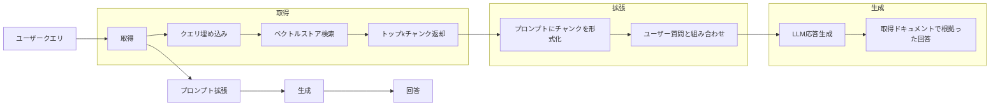
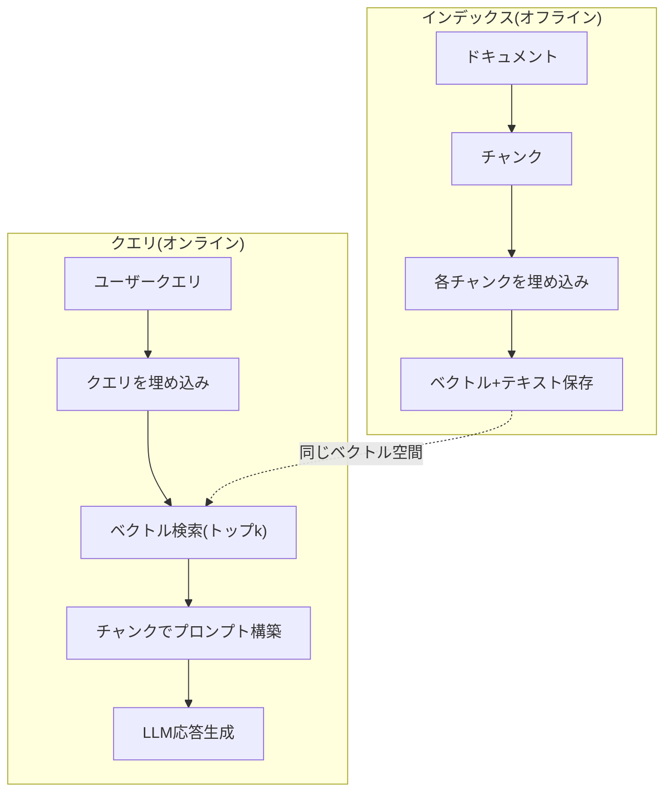

# RAG (検索強化生成)

> あなたのLLMは訓練カットオフまですべてを知っています。あなたの企業のドキュメント、コードベース、先週のミーティングノートについては何も知りません。RAGは関連ドキュメントを取得し、プロンプトに詰め込むことでこれを解決します。本番AIで最もデプロイされたパターン。このコースから1つのもの構築するなら、RAGパイプラインを構築してください。

**タイプ:** ビルド
**言語:** Python
**前提条件:** Phase 10 (LLMsゼロから), Phase 11 Lessons 01-05
**所要時間:** 約90分
**関連:** Phase 5 · 23 (RAG用チャンキング戦略)6つのチャンキングアルゴリズムと各勝つ場合をカバー。Phase 5 · 22 (埋め込みモデル詳細解説)埋め込み選択。Phase 11 · 07 (高度なRAG)ハイブリッド検索、リランキング、クエリ変換。

## 学習目標

- 完全なRAGパイプラインを構築: ドキュメント読み込み、チャンキング、埋め込み、ベクトルストレージ、検索、生成
- ベクトルデータベース(ChromaDB、FAISS、Pinecone)で適切なインデックス作成によるセマンティック検索を実装
- RAGが知識に基づくアプリケーションで微調整より優れる理由を説明(コスト、新鮮性、帰属)
- RAG品質を評価: 検索メトリクス(精度、リコール)と生成メトリクス(忠実度、関連性)

## 問題

あなたの企業のためにチャットボットを構築。顧客が「What's the refund policy for enterprise plans?」と聞きます。LLMは典型的なSaaSリファンドポリシーについての一般的な答えを応答。実際のポリシーは200ページ内部wikiに埋もれたもので、エンタープライズ顧客は60日ウィンドウ、pro-ratedリファンドを取得。LLMはこのドキュメントを見たことがありません。訓練されていないものを知ることはできません。

微調整は1つの解決策。LLMを取得、内部ドキュメントで訓練、更新モデルをデプロイ。機能しますが深刻な問題。微調整は数千ドル計算費用。モデルはドキュメント変更の瞬間古くなる。ソースを知る方法はありません。月次会社が別の製品ライン買収なら、再微調整。

RAGは別の解決策。モデルをそのまま。質問が入るとき、ドキュメントストアから関連パッセージを検索、質問前にプロンプトにペースト、モデルがそのパッセージ文脈を使って回答。ドキュメントストアは数分で更新可能。どのドキュメントが取得されたか見える。モデル自体は変わらない。本番RAG支配的理由: より安い、より新鮮、監査可能、任意のLLMで機能。

## コンセプト

### RAGパターン

全パターンは4ステップフィット:



クエリ -> 取得 -> プロンプト拡張 -> 生成。すべてのRAGシステムはこのパターンに従う。本番RAGシステム間の違いは各ステップの詳細: チャンキング方法、埋め込み方法、検索方法、プロンプト構築方法。

### RAGが微調整を打つ理由

| 懸念 | 微調整 | RAG |
|---------|------------|-----|
| コスト | 訓練実行あたり$1,000-$100,000+ | クエリあたり$0.01-$0.10(埋め込み+LLM) |
| 新鮮性 | 再訓練まで古い | ドキュメント再インデックスで数分で更新 |
| 監査可能性 | 回答をソースにトレース不可 | 正確に取得されたパッセージを表示可 |
| 幻覚 | なお自由に幻覚 | 取得ドキュメントに根拠 |
| データプライバシー | 訓練データを重みに焼き込み | ドキュメントはベクトルストアに保存 |

微調整はモデルの重みを永続的に変更。RAGはモデルのコンテキストを一時的に変更。ほとんどアプリケーション、一時的コンテキストはあなたが望むものです。

微調整が勝つ1つのケース: モデルを特定スタイル、トーン、推論パターン採用が必要な場合、プロンプトアローン達成不可能。事実知識検索のため、RAGは毎回勝つ。

### 埋め込みモデル

埋め込みモデルテキストを密ベクトルに変換。似たテキストはこの高次空間で近い位置にベクトルを生成。「How do I reset my password?」と「I need to change my password」はほぼ同一ベクトル生成ので共有単語は少ないのに。「The cat sat on the mat」は非常に異なるベクトル生成。

一般的な埋め込みモデル(2026ラインアップ――Phase 5 · 22フル分析見):

| モデル | 次元 | プロバイダー | ノート |
|-------|-----------|----------|-------|
| text-embedding-3-small | 1536 (マトリョーシカ) | OpenAI | ほとんどユースケースでベスト価格/性能 |
| text-embedding-3-large | 3072 (マトリョーシカ) | OpenAI | より高い精度、256/512/1024に切り詰め可能 |
| Gemini Embedding 2 | 3072 (マトリョーシカ) | Google | トップMTEB検索。8Kコンテキスト |
| voyage-4 | 1024/2048 (マトリョーシカ) | Voyage AI | ドメイン変種(コード、ファイナンス、法律) |
| Cohere embed-v4 | 1024 (マトリョーシカ) | Cohere | 強い多言語、128Kコンテキスト |
| BGE-M3 | 1024 (密集+疎+ColBERT) | BAAI (オープンウェイト) | 1モデルから3ビュー |
| Qwen3-Embedding | 4096 (マトリョーシカ) | Alibaba (オープンウェイト) | トップオープンウェイト検索スコア |
| all-MiniLM-L6-v2 | 384 | オープンウェイト (Sentence Transformers) | プロトタイピングベースライン |

このレッスン、シンプル埋め込みTF-IDFを使用して構築。TF-IDFが本番で使用する理由ではなく、コンセプトを具体的にするため: テキスト入って、ベクトル出、似たテキストは似たベクトル生成。

### ベクトル類似度

2つのベクトル与えて、どのくらい似ているかを測定? 3つのオプション:

**コサイン類似度**: 2ベクトル間の角度のコサイン。-1(反対)から1(同一)範囲。大きさを無視、方向のみ。RAGのデフォルト。

```
cosine_sim(a, b) = dot(a, b) / (||a|| * ||b||)
```

**ドット積**: 生のスカラー積。より大きいベクトルはより高いスコア。より長いドキュメント関連かもしれない場合に有用。

```
dot(a, b) = sum(a_i * b_i)
```

**L2 (ユークリッド) 距離**: ベクトル空間内直線距離。より小さい=より似ている。大きさの違いに敏感。

```
L2(a, b) = sqrt(sum((a_i - b_i)^2))
```

コサイン類似度が標準。異なる長さのドキュメントをうまく扱う、正規化によって。「ベクトル検索」だれかが言うとき、ほぼ常にコサイン類似度を意味。

### チャンキング戦略

ドキュメントは単一ベクトルとして埋め込めるには長すぎます。50ページPDFは数十トピック生成される、埋め込みはすべてを平均化し、何にも似ていない。代わりにドキュメントをチャンクに分割、各チャンクを埋め込み。

**固定サイズチャンキング**: Nトークンごと分割。シンプル、予測可能。ドキュメント構造ない場合機能。512トークンチャンク、50トークンオーバーラップ: チャンク1トークン0-511、チャンク2トークン462-973。オーバーラップは不運な境界で文を分割しないことを確認。

**セマンティックチャンキング**: 自然な境界で分割。段落、セクション、またはマークダウンヘッダー。各チャンクは意味の一貫ユニット。実装がより複雑ですが、より良い検索を生成。

**再帰的チャンキング**: 最大の境界(セクションヘッダー)からの分割を試み。セクション大きすぎれば、段落境界を試み。段落ま大きすぎれば、文境界を試み。これはLangChainの`RecursiveCharacterTextSplitter`アプローチで、混合形式コーパスで実際機能。

チャンクサイズはしばしば思われるより重要:

- 太小(64-128トークン): 各チャンクはコンテキスト不足。「15%増加」「it」が何かを知らずに意味不明。
- 太大(2048+ トークン): 各チャンク複数トピックカバー、関連性希釈。収益データを検索すると、チャンク10%は収益について、90%は従業員数。
- 甘い点(256-512トークン): 自己完結するのに十分なコンテキスト、関連性に十分焦点。

ほとんど本番RAGシステムは256-512トークンチャンク、50トークンオーバーラップ使用。AnthropicのRAGガイドラインはこの範囲推奨。

### ベクトルデータベース

埋め込みを持ったら、保存・検索する必要。オプション:

| データベース | タイプ | 最適な用途 |
|----------|------|----------|
| FAISS | ライブラリ(インプロセス) | プロトタイピング、小―中データセット |
| Chroma | 軽量DB | ローカル開発、小デプロイメント |
| Pinecone | マネージドサービス | オプスオーバーヘッド無い本番 |
| Weaviate | オープンソースDB | セルフホスト本番 |
| pgvector | Postgres拡張 | 既にPostgres使用 |
| Qdrant | オープンソースDB | 高性能セルフホスト |

このレッスン、シンプルなメモリ内ベクトルストアを構築。ベクトルをリストに保存、ブルートフォースコサイン類似度検索実行。FAISS平坦インデックスと等価。スケール~100,000ベクトルまで多分遅くなる。本番ではHNSWアルゴリズムのようなapproximate nearest neighbor (ANN)を使用百万ベクトルをミリ秒で検索。

### フルパイプライン



インデックスフェーズはドキュメントあたり1回実行(またはドキュメント更新時)。クエリフェーズはすべてのユーザーリクエストで実行。本番では、インデックス数百万ドキュメント時間をかけて処理かもしれません。クエリは秒未満で応答必要。

### 実数

ほとんど本番RAGシステム:

- **k = 5 to 10** クエリあたり取得されたチャンク
- **チャンクサイズ = 256 to 512トークン** 50トークンオーバーラップ
- **コンテキスト予算**: クエリあたり2,500-5,000トークン取得内容
- **総プロンプト**: ~8,000-16,000トークン(システムプロンプト+取得チャンク+会話履歴+ユーザークエリ)
- **埋め込み次元**: モデルに応じて384-3072
- **インデックス処理**: APIエムベディングで毎秒100-1,000ドキュメント
- **クエリレイテンシ**: 検索50-200ms、生成500-3000ms

## ビルドする

### ステップ1: ドキュメントチャンキング

```python
def chunk_text(text, chunk_size=200, overlap=50):
    words = text.split()
    chunks = []
    start = 0
    while start < len(words):
        end = start + chunk_size
        chunk = " ".join(words[start:end])
        chunks.append(chunk)
        start += chunk_size - overlap
    return chunks
```

### ステップ2: TF-IDF埋め込み

シンプルな埋め込み関数を構築。TF-IDF(用語頻度-逆ドキュメント頻度)ニューラル埋め込みではありませんがテキストをベクトルに変換、単語重要度をキャプチャ。ドキュメント内で頻繁な単語はより高いTF。全コーパス内で稀な単語はより高いIDF。積は重要で特有の単語が高い値を持つベクトルを与えます。

```python
import math
from collections import Counter

def build_vocabulary(documents):
    vocab = set()
    for doc in documents:
        vocab.update(doc.lower().split())
    return sorted(vocab)

def compute_tf(text, vocab):
    words = text.lower().split()
    count = Counter(words)
    total = len(words)
    return [count.get(word, 0) / total for word in vocab]

def compute_idf(documents, vocab):
    n = len(documents)
    idf = []
    for word in vocab:
        doc_count = sum(1 for doc in documents if word in doc.lower().split())
        idf.append(math.log((n + 1) / (doc_count + 1)) + 1)
    return idf

def tfidf_embed(text, vocab, idf):
    tf = compute_tf(text, vocab)
    return [t * i for t, i in zip(tf, idf)]
```

### ステップ3: コサイン類似度検索

```python
def cosine_similarity(a, b):
    dot = sum(x * y for x, y in zip(a, b))
    norm_a = math.sqrt(sum(x * x for x in a))
    norm_b = math.sqrt(sum(x * x for x in b))
    if norm_a == 0 or norm_b == 0:
        return 0.0
    return dot / (norm_a * norm_b)

def search(query_embedding, stored_embeddings, top_k=5):
    scores = []
    for i, emb in enumerate(stored_embeddings):
        sim = cosine_similarity(query_embedding, emb)
        scores.append((i, sim))
    scores.sort(key=lambda x: x[1], reverse=True)
    return scores[:top_k]
```

### ステップ4: プロンプト構築

ここで「拡張」RAGで起こります。取得チャンクをプロンプトに形式化、ユーザークエリと組み合わせ、LLMに提供されたコンテキスト基づいて回答するよう聞きます。

```python
def build_rag_prompt(query, retrieved_chunks):
    context = "\n\n---\n\n".join(
        f"[ソース {i+1}]\n{chunk}"
        for i, chunk in enumerate(retrieved_chunks)
    )
    return f"""提供されたコンテキストだけに基づいて質問に回答してください。
コンテキストに十分な情報がなければ、「その質問に答えるために十分な情報がありません」。

コンテキスト:
{context}

質問: {query}

回答:"""
```

### ステップ5: 完全なRAGパイプライン

```python
class RAGPipeline:
    def __init__(self):
        self.chunks = []
        self.embeddings = []
        self.vocab = []
        self.idf = []

    def index(self, documents):
        all_chunks = []
        for doc in documents:
            all_chunks.extend(chunk_text(doc))
        self.chunks = all_chunks
        self.vocab = build_vocabulary(all_chunks)
        self.idf = compute_idf(all_chunks, self.vocab)
        self.embeddings = [
            tfidf_embed(chunk, self.vocab, self.idf)
            for chunk in all_chunks
        ]

    def query(self, question, top_k=5):
        query_emb = tfidf_embed(question, self.vocab, self.idf)
        results = search(query_emb, self.embeddings, top_k)
        retrieved = [(self.chunks[i], score) for i, score in results]
        prompt = build_rag_prompt(
            question, [chunk for chunk, _ in retrieved]
        )
        return prompt, retrieved
```

### ステップ6: 生成(シミュレーション)

本番、ここはLLM APIコール。このレッスン、取得されたコンテキストから最も関連セ ンテンスを抽出することで生成をシミュレート。

```python
def simple_generate(prompt, retrieved_chunks):
    query_words = set(prompt.lower().split("question:")[-1].split())
    best_sentence = ""
    best_score = 0
    for chunk in retrieved_chunks:
        for sentence in chunk.split("."):
            sentence = sentence.strip()
            if not sentence:
                continue
            words = set(sentence.lower().split())
            overlap = len(query_words & words)
            if overlap > best_score:
                best_score = overlap
                best_sentence = sentence
    return best_sentence if best_sentence else "十分な情報がありません。"
```

## 使用する

実埋め込みモデルとLLMで、コードはほぼ変わらない:

```python
from openai import OpenAI

client = OpenAI()

def embed(text):
    response = client.embeddings.create(
        model="text-embedding-3-small",
        input=text
    )
    return response.data[0].embedding

def generate(prompt):
    response = client.chat.completions.create(
        model="gpt-4o-mini",
        messages=[{"role": "user", "content": prompt}],
        temperature=0
    )
    return response.choices[0].message.content
```

またはAnthropicで:

```python
import anthropic

client = anthropic.Anthropic()

def generate(prompt):
    response = client.messages.create(
        model="claude-sonnet-4-20250514",
        max_tokens=1024,
        messages=[{"role": "user", "content": prompt}]
    )
    return response.content[0].text
```

パイプラインは同じ。埋め込み関数をスワップ。生成関数をスワップ。検索ロジック、チャンキング、プロンプト構築――すべてどのモデル使用かに関わらず同じ。

規模でベクトルストレージのため、ブルートフォース検索を適切なベクトルデータベースに置き換え:

```python
import chromadb

client = chromadb.Client()
collection = client.create_collection("my_docs")

collection.add(
    documents=chunks,
    ids=[f"chunk_{i}" for i in range(len(chunks))]
)

results = collection.query(
    query_texts=["返却ポリシーは何ですか?"],
    n_results=5
)
```

Chromaは内部的に埋め込みを処理(デフォルトall-MiniLM-L6-v2使用)、ローカルデータベースにベクトルを保存。パターン同じ、配管異なる。

## 出荷する

このレッスンは以下を出力:
- `outputs/prompt-rag-architect.md` ――特定ユースケースのためRAGシステムを設計するプロンプト
- `outputs/skill-rag-pipeline.md` ――RAGパイプラインの構築とデバッグを教えるスキル

## 演習

1. TF-IDFエムベディングを単純な bag-of-words アプローチ(バイナリ: 単語存在なら1、なければ0)に置き換え。サンプルドキュメントで検索品質を比較。TF-IDFはbag-of-wordsより優れるべき、稀な単語をより高くウェイト。

2. チャンクサイズを試験: 50、100、200、500語をドキュメントセットで試す。各サイズについて同じ5クエリを実行、トップ3で関連チャンク返却するかを数える。検索品質がピークする甘い点を見つけ。

3. 各チャンクに メタデータを追加(ソースドキュメント名、チャンク位置)。プロンプトテンプレートを修正してソース属性を含む、LLMがソースを引用するよう。

4. シンプルな評価を実装: 10 question-answerペアが与えられ、各質問をRAGパイプラインで実行、取得チャンクがいくつ答えを含むかを測定。これが k の検索リコール。

5. 会話認識RAGパイプラインを構築: 最後の3交換の履歴を保持、取得チャンク横にプロンプトに含める。「What about enterprise?」のようなフォローアップクエリで試験。

## 主な用語

| 用語 | 人々が言うこと | 実際に意味すること |
|------|----------------|----------------------|
| RAG | 「あなたのドキュメントを読むAI」 | 関連ドキュメントを取得、それらをプロンプトにペースト、それらのドキュメントに根拠った回答を生成 |
| 埋め込み | 「テキストを数字に変換」 | テキストの密ベクトル表現で似た意味は似たベクトル生成 |
| ベクトルデータベース | 「AIの検索エンジン」 | ベクトル保存と規模での最近隣発見を最適化するデータストア |
| チャンキング | 「ドキュメントをピースに分割」 | ドキュメントを256-512トークンセグメントに分割、各セグメントは独立して埋め込まれ取得可能 |
| コサイン類似度 | 「2つのベクトルはどのくらい似ているか」 | 2つのベクトル間の角度のコサイン。1 =同一方向、0 =直交、-1 =反対 |
| トップk検索 | 「k個最善マッチを取得」 | ベクトルストアからクエリに最も類似k個チャンク返却 |
| コンテキストウィンドウ | 「LLMはどのくらいテキストを見れるか」 | LLMが単一リクエストで処理できる最大トークン数。取得チャンクはこれ内フィット必要 |
| 拡張生成 | 「与えられたコンテキスト使用で回答」 | 訓練知識のみに依存ではなく取得ドキュメント文脈を使用して応答を生成 |
| TF-IDF | 「単語重要度スコアリング」 | 用語頻度かける逆ドキュメント頻度。コーパス内で特有単語でウェイト単語 |
| インデックス | 「検索の準備ドキュメント」 | ドキュメントをチャンク、埋め込み、保存するオフラインプロセス、クエリ時に検索可能 |

## 参考文献

- Lewis et al., "Retrieval-Augmented Generation for Knowledge-Intensive NLP Tasks" (2020) ――Facebook AI Research からretrieve-then-generateパターンを形式化した元のRAGペーパー
- Anthropic RAGドキュメント (docs.anthropic.com) ――チャンクサイズ、プロンプト構築、評価のための実用的ガイドライン
- Pinecone Learning Center、「What is RAG?」――本番考慮によるRAGパイプラインの視覚的説明クリア
- Sentence-BERT: Reimers & Gurevych (2019) ――all-MiniLMエムベディングモデル背後のペーパー、セマンティック類似度のためのバイエンコーダ訓練方法を示す
- [Karpukhin et al., "Dense Passage Retrieval for Open-Domain Question Answering" (EMNLP 2020)](https://arxiv.org/abs/2004.04906) ――DPRペーパー。密バイエンコーダ検索がオープンドメインQAでBM25を勝つことを証明、モダンRAG取得者のパターンを設定。
- [LlamaIndex High-Level Concepts](https://docs.llamaindex.ai/en/stable/getting_started/concepts.html) ――RAGパイプライン構築時に知る主概念: データローダー、ノードパーサー、インデックス、検索者、応答シンセサイザー。
- [LangChain RAGチュートリアル](https://python.langchain.com/docs/tutorials/rag/) ――反対フレーバーオーケストレーター。同じretrieve-then-generateパターンのchain-of-runnables見方。
