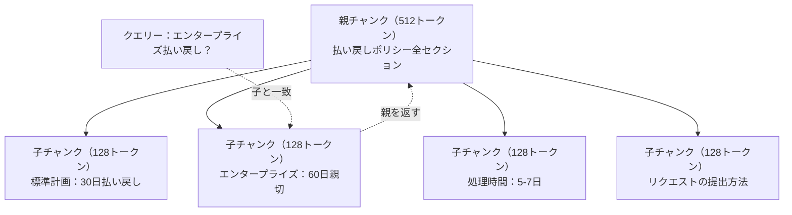

# 高度なRAG（チャンキング、リランキング、ハイブリッド検索）

> 基本的なRAGは上位kの最も類似したチャンクを取得します。それは簡単な質問に対して機能します。複数ホップの推論、曖昧なクエリ、大規模なコーパスで分解します。高度なRAGは、10個のドキュメントで動作するデモと1000万で動作するシステムの間の違いです。

**タイプ:** ビルド
**言語:** Python
**前提条件:** Phase 11, Lesson 06（RAG）
**所要時間:** 約90分
**関連:** Phase 5 · 23（RAGのチャンキング戦略）は、6つのチャンキングアルゴリズム - 再帰的、セマンティック、文、親ドキュメント、遅いチャンキング、コンテキスト検索 - Vectara/Anthropicベンチマーク。このレッスンは上:ハイブリッド検索、リランキング、クエリー変換。

## 学習目標

- ドキュメント構造とコンテキストを保存する高度なチャンキング戦略（セマンティック、再帰的、親子）を実装します
- BM25キーワード マッチングとセマンティック ベクトル検索およびクロスエンコーダー リランカーを組み合わせたハイブリッド検索パイプラインを構築します
- クエリー変換テクニック（HyDE、複数クエリー、ステップバック）を適用して、曖昧または複雑な質問に対する検索を改善します
- RAG障害を診断・修正：誤ったチャンク取得、コンテキストに答えがない、複数ホップの推論分解

## 問題

基本的なRAGパイプラインを Lesson 06でビルドしました。小規模なコーパスで直前の質問に対して動作します。これらを試して:

**曖昧なクエリー**: 「先四半期の収入は何でしたか？」セマンティック検索は、収入戦略、収入予測、CEOの収入成長に関する考えについてのチャンクを返します。すべてクエリーの単語「収入」に意味的に類似。実際の数字を含んでいない。正しいチャンクは「Q3 2025の$47.2M」と言っていますが、「収入」の代わりに「収益」を使用します。埋め込みモデルは、「Q3の収益は$47.2M」より「収入戦略」が質問に近いと考えています。

**複数ホップの質問**: 「どのチームが最高の顧客満足度スコアの改善を持っていましたか？」これには各チームの満足スコアを見つけ、比較し、最大を特定する必要があります。答えはシングルチャンクに含まれていません。情報はチームレポート全体に散在しています。

**大規模なコーパス問題**: 200万チャンクがあります。正しい答えはチャンク#1,847,293です。上位5の検索はチャンク#14、#89,201、#1,200,000、#44、#901,333を取得します。埋め込み空間では閉じていますが、答えを含めません。このスケールでは、概算最近傍検索は十分なエラーを導入し、関連する結果が上位kから押し出されます。

基本的なRAGはベクトル類似度が関連性と同じではないためです。チャンクはセマンティック的にクエリーに類似で、それを答えるのに役立つことなくできます。高度なRAGはこれを4つのテクニックで対処します：ハイブリッド検索（キーワード マッチングを追加）、リランキング（注意深く候補をスコア）、クエリー変換（検索する前にクエリーを修正）、より良いチャンキング（正しい粒度で取得）。

## 概念

### ハイブリッド検索：セマンティック+キーワード

セマンティック検索（ベクトル類似度）は意味を理解するのに優れています。「サブスクリプションをキャンセルするにはどうすればよいですか？」は「プランを終了するためのステップ」と一致します。単語を共有していないにもかかわらず。しかし、正確な一致を逃しています。「エラーコードE-4021」は、埋め込みモデルがそれをノイズとして扱う場合、「E-4021」を含むチャンクと一致しない場合があります。

キーワード検索（BM25）は正反対です。正確な一致で優れています。「E-4021」は完全に一致します。しかし、「サブスクリプションをキャンセルする」はゼロ結果を返します（ドキュメントが「プランを終了する」と言う場合）。

ハイブリッド検索は両方を実行し、結果をマージします。

**BM25**（Best Matching 25）は標準的なキーワード検索アルゴリズムです。1990年代以来、検索エンジンの主力でした。式は：

```
BM25(q, d) = クエリーq内の用語tの合計：
    IDF(t) * (tf(t,d) * (k1 + 1)) / (tf(t,d) + k1 * (1 - b + b * |d| / avgdl))
```

tf(t,d)はドキュメントd内の用語tの用語周波数、IDF(t)は逆ドキュメント周波数、|d|はドキュメント長、avgdlは平均ドキュメント長です。k1は用語周波数飽和を制御し（デフォルト1.2）、bは長さの正規化を制御します（デフォルト0.75）。

平易な言葉：BM25はクエリー用語を含むドキュメントをスコアします（特に稀）。繰り返された用語に対する減少した利益。「収入」という単語が50回のドキュメントは、1回のドキュメントより50倍関連性が高くない。

### 相互ランク融合（RRF）

2つの順位付けられたリストがあります：1つはベクトル検索から、1つはBM25から。どのように組み合わせますか？相互ランク融合は標準的なアプローチです。

```
RRF_score(d) = ランキング分布R上の合計：
    1 / (k + rank_R(d))
```

kは定数（通常60）。上位結果が支配することを防ぎます。

ベクトル検索で#1の順位付けと、BM25で#5の順位付けされたドキュメント：1/(60+1) + 1/(60+5) = 0.0164 + 0.0154 = 0.0318

ベクトル検索で#3、BM25で#2の順位付けされたドキュメント：1/(60+3) + 1/(60+2) = 0.0159 + 0.0161 = 0.0320

RRFは自然なバランス2つの信号。両方のリストに高い順位のドキュメント最適スコアを取得。1つのリストで#1だが、もう1つのリストがない場合、中程度のスコアを取得。これは堅牢です。ランク、生スコアを使用するため、2つのシステム間のスコア分布の違いは重要ではありません。

### リランキング

検索（ベクトル、キーワード、またはハイブリッド）は高速で不正確。バイエンコーダーを使用：クエリーとドキュメントは独立して埋め込まれ、比較されます。埋め込みは事前計算とキャッシュされます。百万ドキュメントまでスケール。

リランキングはクロスエンコーダーを使用：クエリーと候補ドキュメントは一緒にモデルに入れられ、関連性スコアを出力します。モデルはテキストの両方を同時に見て、その間の微妙な相互作用をキャプチャできます。クロスエンコーダーは、バイエンコーダーが接続を逃した場合でも、「Q3の収益は何でしたか？」が「$47.2M内Q3」を含むチャンクに非常に関連していることを理解できます。

トレードオフ：クロスエンコーダーはバイエンコーダーより100-1000倍遅いです。モデルはクエリードキュメント ペアを一緒に処理するため。百万ドキュメントのクロスエンコーダー スコアを事前計算することはできません。解決策：大きな候補セット（ハイブリッド検索から上位50）を取得し、クロスエンコーダーで最終的な上位5に再ランク付けします。

一般的なリランキングモデル（2026ライン）：
- Cohere Rerank 3.5：管理API、多言語、混合コーパス上で最適な回復利益
- Voyage rerank-2.5：管理API、最低のホストオプションレイテンシー
- Jina-Reranker-v2多言語：オープンウェイト、100+言語
- bge-reranker-v2-m3：オープンウェイト、強力なベースラン
- cross-encoder/ms-marco-MiniLM-L-6-v2：オープンウェイト、プロトタイピング用CPUで実行
- ColBERTv2 / Jina-ColBERT-v2：遅い相互作用マルチベクトル リランカー — スコア時間O(トークン)ではなくO(ドキュメント)

### クエリー変換

時々、問題は検索ではなくクエリー自体です。「新しいポリシー変更についてのその事柄は何でしたか？」ひどい検索クエリーです。具体的な用語がない。埋め込みは曖昧。検索システムはこれからは正しいドキュメントを見つけることはできません。

**クエリーの書き換え**: ユーザーのクエリーをより良い検索クエリーに言い換えます。LLMはこれを行うことができます：

```
ユーザー：「新しいポリシー変更についてのその事柄は何でしたか？」
書き換え：「最近のポリシーの変更と更新」
```

**HyDE（仮説ドキュメント埋め込み）**: クエリーを検索する代わりに、仮説的な答えを生成し、それを埋め込み、類似の実ドキュメントを検索します。

```
クエリー：「エンタープライズの払い戻しポリシーは何ですか？」
仮説的な答え：「エンタープライズ顧客は購入後60日以内に完全な払い戻しの資格があります。払い戻しは残りのサブスクリプション期間に基づいて親切に処理され、5-7営業日以内に処理されます。」
```

仮説の答えを埋め込み、それに似た実ドキュメントを検索してください。直感：仮説の答えは、埋め込み空間の元の質問よりも実の答えにより近く住んでいます。質問と答えの言語構造が異なります。仮説的な答えを生成することで、「質問スペース」と「答えスペース」の間のギャップを埋めます。

HyDEは検索の前に1つのLLM呼び出しを追加します。これはレイテンシーを500-2000msで増加させます。検索品質が生クエリーで悪い場合は価値があります。

### 親子チャンキング

標準的なチャンキングは、トレードオフを強制します：正確な検索のための小チャンク、十分なコンテキストのための大チャンク。親子チャンキングはこのトレードオフを排除します。

取得するために小チャンク（128トークン）をインデックス付けしてください。小チャンクが取得されるとき、親チャンク（512トークン）をプロンプトに対して戻してください。小チャンクはクエリーを正確に一致させます。親チャンクはLLMが良い答えを生成するのに十分なコンテキストを提供します。



クエリー「エンタープライズ払い戻し？」は子チャンク C2 を正確に一致させます。しかし、プロンプトは処理時間と提出プロセスに関する周囲のコンテキストを含む完全な親チャンク P を受け取ります。

## キーターム（要約）

より詳細については、英語のドキュメントを参照してください。

| 用語 | 簡潔な定義 |
|------|---------|
| BM25 | キーワード検索の確率的ランキングアルゴリズム |
| ハイブリッド検索 | セマンティック（ベクトル）とキーワード（BM25）検索を並列実行し、ランク融合で結果をマージ |
| リランキング | より高価なクロスエンコーダー モデルで初期取得候補を再スコア |
| HyDE | クエリーの仮説的な答えを生成し、埋め込み、類似ドキュメントを検索 |
| 親子チャンキング | 小チャンク（検索）を取得し、大きな親チャンク（コンテキスト）をプロンプトに返す |
