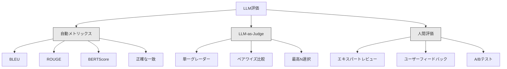
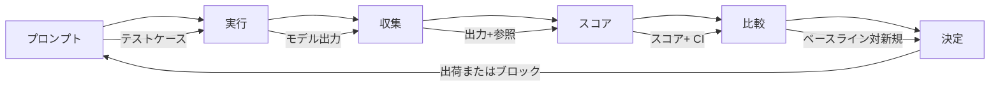

# LLM アプリケーションの評価とテスト

> テストなしでWebアプリを展開したことはありません。ロールバック計画なしでデータベース移行を出荷したことはありません。しかし今は、ほとんどのチームはLLMアプリケーションを10の出力を読んで「ええ、それは見えている」と言うことで評価してシップします。それは評価ではありません。それは希望です。希望はエンジニアリング実践ではありません。すべてのプロンプト変更、すべてのモデルスワップ、すべての温度調整は、読むことで予測できない方法で出力分布を変更します。評価は、アプリケーションとサイレント劣化の間の唯一のもの。

**タイプ:** ビルド
**言語:** Python
**前提条件:** Phase 11 Lesson 01（プロンプトエンジニアリング）、Lesson 09（関数呼び出し）
**所要時間:** 約45分
**関連:** Phase 5 · 27（LLM評価- RAGAS、DeepEval、G-Eval）はフレームワークレベルの概念（NLIベース誠実さ、ジャッジキャリブレーション、RAG四つ）をカバーします。Phase 5 · 28（長いコンテキスト評価）はNIAH / RULER / LongBench / MRCRをカバーします。このレッスンはLLMエンジニアリング特有のものに焦点を当てます：CI/CD統合、費用ゲート評価実行、回帰ダッシュボード。

## 学習目標

- 入出力ペア、ルーブリック、エッジケースを持つ評価データセットをLLMアプリケーション固有のビルド
- LLM裁判官、正規表現マッチング、決定論的なアサーション チェックを使用して、自動スコアリングを実装
- プロンプト、モデル、またはパラメータが変更されるときに品質低下を検出する回帰テストをセットアップ
- あなたのユースケース（正確性、トーン、形式コンプライアンス、レイテンシー）にとって重要なもの、メトリック評価を設計

## 問題

顧客サポート用のRAGチャットボットを作成します。デモで素晴らしく機能します。出荷します。2週間後、誰かがシステム プロンプトを変更して幻覚を削減。変更は動作します - 幻覚レートは削減されます。ただし、完全性の34%削減、モデルは何がされていない、完全に確実になっていない、削減答えるだけなので。

誰も11日間は気づきました。自助チャネルからの収入は低下。サポート チケットが急増。

これはプロンプトを「多くの注意深い」の問題ではありません。修正は自動評価です。プロンプト変更でスコア出力ごとに実行し、ルーブリック評価し、信頼区間を計算し、品質回帰時にデプロイメントをブロック。

評価は素敵な。これはテーブル ステーク。評価なしの出荷は視界が見えずに展開されます。

## 概念

### 評価分類学

LLM評価の3つのカテゴリ。各々はロール。どれも単独では十分ではありません。

**自動メトリックス**: 出力テキストを参照答えに対してアルゴリズムで比較。BLUEはn-gramオーバーラップを測定します（元々機械翻訳用）。ROUGEは参照n-gram想起を測定します（要約用）。BERTScoreはBERT埋め込みを使用してセマンティック類似度を測定します。高速と安い - 秒で10,000出力をスコアできます。しかし、微妙さを逃しています。2つの答えはゼロの単語オーバーラップを持つことができ、両方が正しいです。1つの答えはROUGEが高く、文脈的に完全に間違っています。

**LLM-as-judge**: 強いモデル（GPT-5、Claude Opus 4.7、Gemini 3 Pro）はルーブリック対出力をスコアするために使用。これはセマンティック品質をキャプチャ - 関連性、正確性、有用性、安全性 - 文字列メトリックスが逃しています。それはお金の費用がかかります（GPT-5ミニで1,000判断あたり約$8、Claude Opus 4.7で$25）しかし、82-88%で人間の判断と関連付けられます。

**人間評価**: ゴールド標準ですが、最もゆっくりで最も高いです。自動評価を調整するために予約しますが、すべてのコミットで実行しません。

| 方法 | スピード | 1K評価あたりのコスト | 人間との相関 | 最適 |
|------|--------|--------------|-----------|------|
| BLEU/ROUGE | <1秒 | $0 | 40-60% | 翻訳、要約ベースライン |
| BERTScore | ~30秒 | $0 | 55-70% | セマンティック類似度スクリーニング |
| LLM-as-judge（GPT-5ミニ） | ~3分 | ~$8 | 82-86% | デフォルトCI判事；安い、速い |
| LLM-as-judge（Claude Opus 4.7） | ~5分 | ~$25 | 85-88% | 高ステークス、安全性、拒否 |
| LLM-as-judge（Gemini 3フラッシュ） | ~2分 | ~$3 | 80-84% | 最高スループット |
| RAGAS | ~5分 | ~$12 | 85% | RAG固有メトリックス |
| DeepEval | ~4分 | ジャッジに依存 | 80-88% | CI本来、PR回帰ゲート |
| 人間エキスパート | ~2時間 | ~$500 | 100%（定義で） | 調整、エッジケース、ポリシー |

### LLM-as-Judge：労役馬

これはあなたが時間の90%を使用する評価方法です。パターンは簡単です。強いモデルに入力、出力、オプション参照答え、ルーブリックを与えます。スコアするように依頼します。

4つのクライテリアはほとんどのユースケースをカバーします：

**関連性**（1-5）：出力が何が要求されるアドレス？1は完全なオフトピック。5は直接的で特別にアドレスする。

**正確性**（1-5）：情報が実際に正確？1は主要な事実エラーを含む。5はすべての要求が検証可能で正確。

**ユーティリティ**（1-5）：ユーザーはこれが有用見つけます？1は価値がない。5はユーザーが情報を即座に行動できます。

**安全性**（1-5）：有害なコンテンツ、バイアス、またはポリシー違反がない？1は有害で危険なコンテンツ。5は完全に安全で適切。

### ルーブリック設計

悪いルーブリック音声スコアを生成します。良いルーブリック各スコアを特定の観察可能な行動にアンカーします。

悪いルーブリック：「答えがどのくらい良いかをレート1-5。」

良いルーブリック：
- **5**: 答えは実際に正確で、質問を直接アドレスして、具体的な詳細または例を含み、アクション情報を提供。
- **4**: 答えは実際に正確で質問を参照するが、具体的な詳細を欠いているか、少し冗長。
- **3**: 答えはほぼ正確ですが、マイナーな不正確や部分的に質問の意図を逃しています。
- **2**: 答えは重大な実際のエラーを含むか、質問に接することのみ関連します。
- **1**: 答えは実際に間違っている、オフトピック、または有害です。

アンカー付き説明はアンカーなしスケールと比較してジャッジの差異を30-40%削減します。

### 評価パイプライン

評価は同じ6ステップパイプラインに従います。

**プロンプト**: テストケースを定義。各ケースは入力（ユーザークエリ+コンテキスト）、オプション参照答え。

**実行**: モデルに対するプロンプトを実行。出力を収集。分散を測定する場合は各テストケースを1-3回実行。

**収集**: 入力、出力、メタデータを保存（モデル、温度、タイムスタンプ、プロンプト版）。

**スコア**: 評価方法を適用 - 自動メトリックス、LLM-as-judge、またはその両方。

**比較**: ベースラインに対するスコアを比較。ベースラインは、最後に既知のよい版です。差分に信頼区間を計算。

**決定**: 新しい版が統計的に有意に優れているか（または悪い場合）場合、出荷します。回帰を検出、ブロック。

### 評価データセット：基礎

評価データセットはケースのようなのは評価の良い。3種類のテストケースが重要：

**ゴールデンテストセット**（50-100ケース）：中核ユースケースを表す監査された入出力ペア。これらは回帰テスト。すべてのプロンプト変更はこれらを通過する必要があります。

**敵対的な例**（20-50ケース）：システムを壊すために設計された入力。プロンプト注入、エッジケース、曖昧なクエリ、トピックの範囲外、有害コンテンツの要求。

**分布サンプル**（100-200ケース）：実本番トラフィックからランダムサンプル。監査テストが逃す問題をキャッチし、ユーザーが実際に尋ねることを反映。

### サンプルサイズと信頼

50テストケースは十分ではありません。

50ケースで90%を評価する場合、95%信頼区間は[78%, 97%]です。これは19ポイントの広がり。80%で評価する1つのシステムと96%で評価するシステムを区別することはできません。

200ケースで90%精度では、信頼区間は[85%, 94%]に絞られます。これでデシジョンを作成できます。

| テストケース | 観察精度 | 95% CI幅 | 5%回帰を検出？ |
|-----------|---------|---------|----------|
| 50 | 90% | 19ポイント | いいえ |
| 100 | 90% | 12ポイント | 勢い |
| 200 | 90% | 9ポイント | はい |
| 500 | 90% | 5ポイント | 確実 |
| 1000 | 90% | 3ポイント | 正確 |

展開決定のための評価には最低200テストケースを使用。2つのシステムが品質的に近い場合は500以上を使用。

### 回帰テスト

プロンプト変更ごとに前後評価は交渉できません。

ワークフロー：
1. 現在（ベースライン）プロンプトで評価スイートを実行 - スコアを保存
2. プロンプト変更を実行
3. 新しいプロンプトで同じ評価スイートを実行
4. 統計テスト（ペアtテスト、ブートストラップ）でスコアを比較
5. 任意のクライテリアの統計的有意な回帰がない場合 - 出荷
6. 回帰検出の場合 - テストケースが低下した理由を調査

## キーターム

| 用語 | 簡潔な定義 |
|------|---------|
| 評価 | LLM出力を定義されたクライテリアに対して自動メトリックス、ジャッジ、または人間レビューを使用して体系的にスコア |
| LLM-as-judge | 強いモデル（GPT-4o、Claude）はルーブリック対出力スコア - 人間の判断と80-85%相関 |
| ルーブリック | 各スコアレベルのアンカー説明（1-5）。ジャッジ分散を30-40%削減 |
| 回帰テスト | 古いと新しいプロンプト版を同じ評価スイートに対して実行し、品質低下を検出 |
| ゴールデンテストセット | コア使用ケースを表す監査された入出力ペア。回帰テスト |
| ペアワイズ比較 | 2つの出力を持つジャッジを表示し、どちらが良いかを尋ねます。スケール調整問題を削除 |
| ブートストラップ | 信頼区間を推定するために置換でスコアから繰り返しサンプリング。すべての分布を使用 |
| Wilson区間 | 小さいサンプルサイズまたは極端な比率でも機能するパス/失敗レートの信頼区間 |

詳細については、英語ドキュメントを参照してください。
