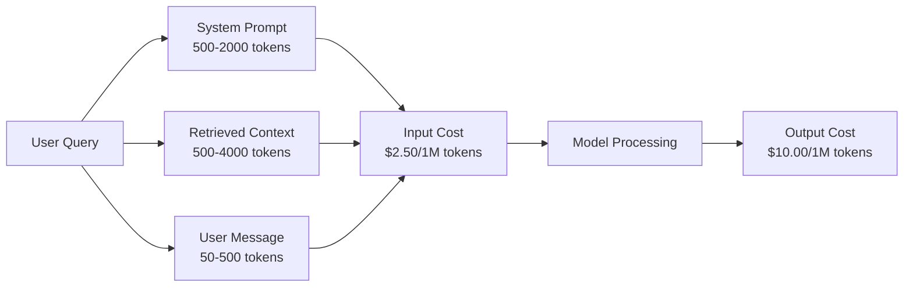
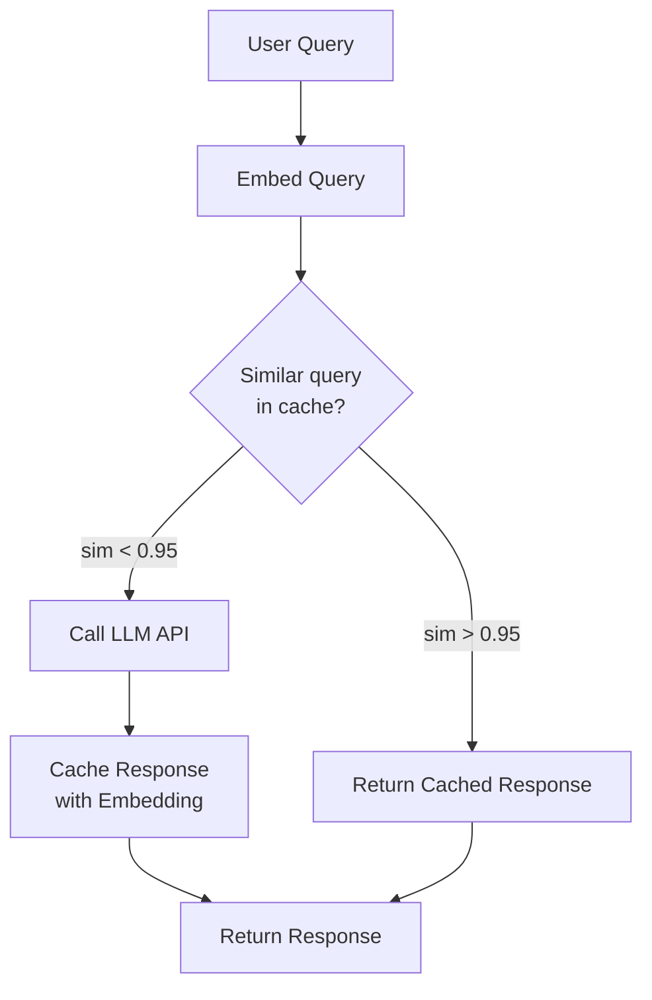
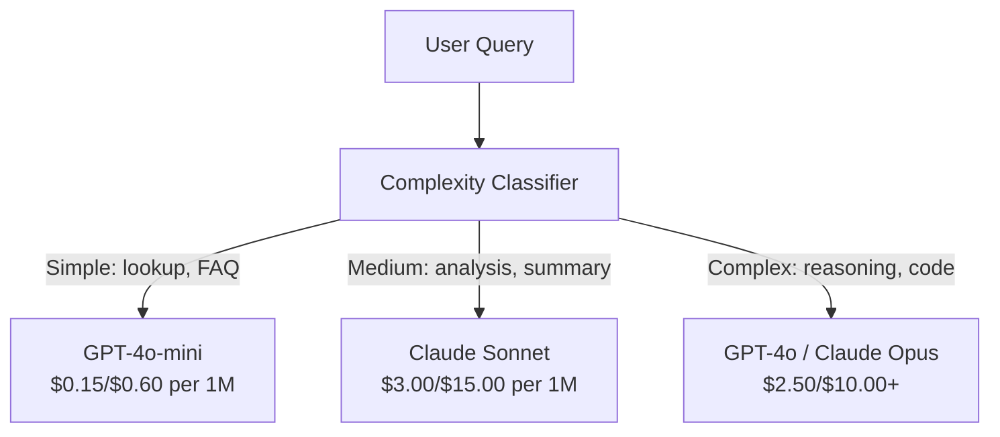

# キャッシング、レート制限とコスト最適化

> ほとんどのAIスタートアップは悪いモデルで死ぬわけではない。悪いユニット経済で死ぬ。1回のGPT-4oコールは数セントの分数である。10,000ユーザーが1日10コールを実行すると、1ドルを請求する前に入力トークンだけで250ドルコストがかかる。生き残る企業は、すべてのAPI呼び出しを関数呼び出しではなく金銭的取引として扱う企業である。

**タイプ:** ビルド
**言語:** Python
**前提条件:** Phase 11 Lesson 09 (Function Calling)
**所要時間:** 約45分
**関連:** Phase 11 · 15 (Prompt Caching) — このレッスンはアプリケーションレイヤーのキャッシング(セマンティックキャッシュ、正確なハッシュキャッシュ、モデルルーティング)をカバーします。レッスン15はプロバイダレイヤーのプロンプトキャッシング(Anthropic cache_control、OpenAI自動、Gemini CachedContent)をカバーします。両方を組み合わせると50-95%のコスト削減が実現します。

## 学習目標

- 繰り返されるまたは類似のクエリをキャッシュから提供し、新しいAPI呼び出しを行わないセマンティックキャッシングを実装する
- プロバイダ全体のリクエストあたりのコストを計算し、トークン対応のレート制限と予算警告を実装する
- プロンプト圧縮、モデルルーティング(高価 vs 安価)、およびレスポンスキャッシングによるコスト最適化レイヤーを構築する
- 異なるクエリタイプのために正確マッチ、セマンティック類似性、プレフィックスキャッシングを使用した段階的キャッシング戦略を設計する

## 問題

RAGチャットボットを構築します。完璧に機能します。ユーザーはそれを気に入ります。

その後、請求書が到着します。

GPT-5は入力トークンあたり500万あたり$5、出力は500万あたり$15です。Claude Opus 4.7は入力$15/出力$75です。Gemini 3 Proは入力$1.25/出力$5です。GPT-5-miniは$0.25/$2です。以下の価格は例示的です。常にプロバイダの現在の価格ページを確認してください。

スタートアップを殺す数学はここにあります：

- 1日あたり10,000のアクティブユーザー
- ユーザーあたり1日10クエリ
- クエリあたり1,000入力トークン(システムプロンプト + コンテキスト + ユーザーメッセージ)
- レスポンスあたり500出力トークン

**日次入力コスト:** 10,000 x 10 x 1,000 / 1,000,000 x $2.50 = **$250/日**
**日次出力コスト:** 10,000 x 10 x 500 / 1,000,000 x $10.00 = **$500/日**
**月間合計:** **$22,500/月**

これはLLMだけです。埋め込み、ベクトルデータベースホスティング、インフラストラクチャを追加します。チャットボット用に月$30,000を見ている状況です。

残酷な部分：それらのクエリの40-60%は準複製です。ユーザーは同じ質問を言葉を微妙に変えて尋ねます。システムプロンプト — すべてのリクエストで同じ — はすべての時間請求されます。RAGによって取得されたコンテキストドキュメントは、同じトピックについて尋ねるユーザー全体で繰り返されます。

冗長計算に対して全額を支払っています。

## コンセプト

### LLMコールのコスト解剖学

すべてのAPI呼び出しには5つのコストコンポーネントがあります。



システムプロンプトは沈黙の殺し屋です。1,500トークンのシステムプロンプトがすべてのリクエストで送信される場合、そのプレフィックスだけで100万リクエストあたり$3.75のコストがかかります。1日100,000リクエストで、それは1日$375 — 1ヶ月$11,250 — 決して変わらないテキストのためです。

### プロバイダキャッシング：組み込みディスカウント

すべての3つのメジャープロバイダは2026年にプロバイダ側プロンプトキャッシングを提供していますが、メカニクスは異なります。詳細はPhase 11 · 15を参照してください。

| プロバイダ | メカニズム | ディスカウント | 最小値 | キャッシュ継続時間 |
|----------|-----------|----------|---------|----------------|
| Anthropic | 明示的なcache_controlマーカー | キャッシュヒットで90%オフ(書き込みで25%追加) | 1,024トークン(Sonnet/Opus)、2,048(Haiku) | デフォルト5分; 1時間拡張(2倍書き込みプレミアム) |
| OpenAI | 自動プレフィックスマッチング | キャッシュヒットで50%オフ | 1,024トークン | 最大1時間(ベストエフォート) |
| Google Gemini | 明示的なCachedContent API | ~75%削減(プラスストレージ) | 4,096(Flash) / 32,768(Pro) | ユーザー設定可能なTTL |

**Anthropicのアプローチ**は明示的です。`cache_control: {"type": "ephemeral"}`を使用してプロンプトのセクションをマークします。最初のリクエストは25%の書き込みプレミアムを支払います。同じプレフィックスを持つ後続のリクエストは90%のディスカウントを取得します。通常$0.005のコストがかかる2,000トークンのシステムプロンプトは、キャッシュヒットで$0.000625のコストになります。100,000リクエストでは、それは1日$437.50を節約します。

**OpenAIのアプローチ**は自動です。前のリクエストと一致するプロンプトプレフィックスは50%のディスカウントを取得します。マーカーは不要です。トレードオフ：より少ないディスカウント、より少ない制御、ゼロ実装の努力。

### セマンティックキャッシング：カスタムレイヤー

プロバイダキャッシングは同一プレフィックスのみで機能します。セマンティックキャッシングはより難しい場合を処理します：同じ意味の異なるクエリ。

「返品ポリシーは何ですか？」と「アイテムを返す方法は？」は異なる文字列ですが、同じ意図です。セマンティックキャッシュは両方のクエリを埋め込み、コサイン類似性を計算し、類似性が閾値を超える場合(通常0.92-0.95)、キャッシュされたレスポンスを返します。



埋め込みコストは無視できます。OpenAIのtext-embedding-3-smallは500万トークンあたり$0.02です。キャッシュの確認は完全なLLM呼び出しと比較してほぼ何もコストがかかりません。

### 正確キャッシング：ハッシュとマッチ

決定論的呼び出し(temperature=0、同じモデル、同じプロンプト)の場合、正確キャッシングがより単純で高速です。完全なプロンプトをハッシュ化し、キャッシュを確認し、見つかった場合は返します。

これは完璧に機能します：
- システムプロンプト + 固定コンテキスト + 同じユーザークエリ
- 同じツール定義を持つ関数呼び出し
- 同じドキュメントが複数回処理されるバッチ処理

### レート制限：予算の保護

レート制限は公平性についてだけではありません。それは生存についてです。

**トークンバケットアルゴリズム：** 各ユーザーはN個のトークンのバケットを取得し、毎秒Rレートで補充されます。リクエストはバケットからトークンを消費します。バケットが空の場合、リクエストは拒否されます。これはバースト(一度に完全なバケットを使用)を許可しながら平均レートを強制します。

**ユーザーあたりのクォータ：** ユーザー層あたり日次/月次トークン制限を設定します。

| ティア | 日次トークン制限 | 最大リクエスト/分 | モデルアクセス |
|------|------------------|------------------|-------------|
| 無料 | 50,000 | 10 | GPT-4o-miniのみ |
| プロ | 500,000 | 60 | GPT-4o、Claude Sonnet |
| エンタープライズ | 5,000,000 | 300 | すべてのモデル |

### モデルルーティング：正しいジョブに正しいモデル

すべてのクエリがGPT-4oを必要とするわけではありません。

「店は何時に閉まりますか？」は$10/M出力モデルを必要としません。GPT-4o-miniが$0.60/M出力でそれを完全に処理します。Claude Haikuが$1.25/M出力でそれを処理します。シンプルなクラシファイアは安いクエリを安いモデルに、複雑なクエリを高価なモデルにルーティングします。



よくチューニングされたルーターは単独でモデルコストの40-70%を節約します。

### コスト追跡：お金がどこに行くかを知る

測定しないものは最適化できません。すべてのAPI呼び出しを以下でログします：

- タイムスタンプ
- モデル名
- 入力トークン
- 出力トークン
- レイテンシ(ms)
- 計算されたコスト($)
- ユーザーID
- キャッシュヒット/ミス
- リクエストカテゴリ

このデータはどの機能が高価であるか、どのユーザーが大量消費者であるか、キャッシングがどこで最大の影響を持つかを明らかにします。

### バッチ処理：バルクディスカウント

OpenAIのBatch APIは非同期でリクエストを50%割引で処理します。最大50,000のリクエストのバッチを送信すると、24時間以内に結果が戻ります。

バッチ処理に使用：
- 夜間ドキュメント処理
- バルク分類
- 評価実行
- データエンリッチメントパイプライン

使用しない：リアルタイムユーザー対面クエリ(レイテンシが重要)。

### 予算警告とサーキットブレーカー

サーキットブレーカーは制限に達したときの支出を停止します。なしでは、バグまたは乱用により月間予算は数時間で消費される可能性があります。

3つのしきい値を設定：
1. **警告**(予算の70%)：アラートを送信
2. **スロットル**(予算の85%)：安いモデルのみに切り替え
3. **停止**(予算の95%)：新しいリクエストを拒否、キャッシュされたレスポンスのみを返す

### 最適化スタック

これらのテクニックを順番に適用します。各レイヤーは前のレイヤーに複合します。

| レイヤー | テクニック | 典型的な節約 | 実装の努力 |
|-------|-----------|----------------|----------------------|
| 1 | プロバイダプロンプトキャッシング | 30-50% | 低(キャッシュマーカーを追加) |
| 2 | 正確キャッシング | 10-20% | 低(ハッシュ + 辞書) |
| 3 | セマンティックキャッシング | 15-30% | 中(埋め込み + 類似性) |
| 4 | モデルルーティング | 40-70% | 中(クラシファイア) |
| 5 | レート制限 | 予算保護 | 低(トークンバケット) |
| 6 | プロンプト圧縮 | 10-30% | 中(プロンプト改正) |
| 7 | バッチ処理 | 適格者で50% | 低(バッチAPI) |

RAGアプリがレイヤー1-5を適用すると、通常コストを月$22,500から$4,000-6,000に削減します。それはランウェイの消費とビジネスの構築の違いです。

### 実際の節約：最適化前後

RAGチャットボット(10,000 DAUをサーブ)の実際の内訳は以下のとおりです。

| メトリック | 最適化前 | 最適化後 | 節約 |
|--------|--------------------|--------------------|---------|
| 月間LLMコスト | $22,500 | $5,200 | 77% |
| クエリあたりの平均コスト | $0.0075 | $0.0017 | 77% |
| キャッシュヒット率 | 0% | 52% | -- |
| ミニにルーティングされたクエリ | 0% | 65% | -- |
| P95レイテンシ | 2,800ms | 900ms(キャッシュヒット: 50ms) | 68% |
| 月間埋め込みコスト | $0 | $180 | (新規コスト) |
| 月間合計コスト | $22,500 | $5,380 | 76% |

セマンティックキャッシングの埋め込みコスト($180/月)は最初のキャッシュヒットの時間内に自動的に支払われます。

## ビルド

### ステップ1：コスト計算器

主要なモデルの現在の価格を知るトークンコスト計算器を構築します。

```python
import hashlib
import time
import json
import math
from dataclasses import dataclass, field


MODEL_PRICING = {
    "gpt-4o": {"input": 2.50, "output": 10.00, "cached_input": 1.25},
    "gpt-4o-mini": {"input": 0.15, "output": 0.60, "cached_input": 0.075},
    "gpt-4.1": {"input": 2.00, "output": 8.00, "cached_input": 0.50},
    "gpt-4.1-mini": {"input": 0.40, "output": 1.60, "cached_input": 0.10},
    "gpt-4.1-nano": {"input": 0.10, "output": 0.40, "cached_input": 0.025},
    "o3": {"input": 2.00, "output": 8.00, "cached_input": 0.50},
    "o3-mini": {"input": 1.10, "output": 4.40, "cached_input": 0.55},
    "o4-mini": {"input": 1.10, "output": 4.40, "cached_input": 0.275},
    "claude-opus-4": {"input": 15.00, "output": 75.00, "cached_input": 1.50},
    "claude-sonnet-4": {"input": 3.00, "output": 15.00, "cached_input": 0.30},
    "claude-haiku-3.5": {"input": 0.80, "output": 4.00, "cached_input": 0.08},
    "gemini-2.5-pro": {"input": 1.25, "output": 10.00, "cached_input": 0.3125},
    "gemini-2.5-flash": {"input": 0.15, "output": 0.60, "cached_input": 0.0375},
}


def calculate_cost(model, input_tokens, output_tokens, cached_input_tokens=0):
    if model not in MODEL_PRICING:
        return {"error": f"Unknown model: {model}"}
    pricing = MODEL_PRICING[model]
    non_cached = input_tokens - cached_input_tokens
    input_cost = (non_cached / 1_000_000) * pricing["input"]
    cached_cost = (cached_input_tokens / 1_000_000) * pricing["cached_input"]
    output_cost = (output_tokens / 1_000_000) * pricing["output"]
    total = input_cost + cached_cost + output_cost
    return {
        "model": model,
        "input_tokens": input_tokens,
        "output_tokens": output_tokens,
        "cached_input_tokens": cached_input_tokens,
        "input_cost": round(input_cost, 6),
        "cached_input_cost": round(cached_cost, 6),
        "output_cost": round(output_cost, 6),
        "total_cost": round(total, 6),
    }
```

### ステップ2：正確キャッシュ

完全なプロンプトをハッシュ化し、同一のリクエストのキャッシュされたレスポンスを返します。

```python
class ExactCache:
    def __init__(self, max_size=1000, ttl_seconds=3600):
        self.cache = {}
        self.max_size = max_size
        self.ttl = ttl_seconds
        self.hits = 0
        self.misses = 0

    def _hash(self, model, messages, temperature):
        key_data = json.dumps({"model": model, "messages": messages, "temperature": temperature}, sort_keys=True)
        return hashlib.sha256(key_data.encode()).hexdigest()

    def get(self, model, messages, temperature=0.0):
        if temperature > 0:
            self.misses += 1
            return None
        key = self._hash(model, messages, temperature)
        if key in self.cache:
            entry = self.cache[key]
            if time.time() - entry["timestamp"] < self.ttl:
                self.hits += 1
                entry["access_count"] += 1
                return entry["response"]
            del self.cache[key]
        self.misses += 1
        return None

    def put(self, model, messages, temperature, response):
        if temperature > 0:
            return
        if len(self.cache) >= self.max_size:
            oldest_key = min(self.cache, key=lambda k: self.cache[k]["timestamp"])
            del self.cache[oldest_key]
        key = self._hash(model, messages, temperature)
        self.cache[key] = {
            "response": response,
            "timestamp": time.time(),
            "access_count": 1,
        }

    def stats(self):
        total = self.hits + self.misses
        return {
            "hits": self.hits,
            "misses": self.misses,
            "hit_rate": round(self.hits / total, 4) if total > 0 else 0,
            "cache_size": len(self.cache),
        }
```

### ステップ3：セマンティックキャッシュ

クエリを埋め込み、類似性が閾値を超える場合、キャッシュされたレスポンスを返します。

```python
def simple_embed(text):
    words = text.lower().split()
    vocab = {}
    for w in words:
        vocab[w] = vocab.get(w, 0) + 1
    norm = math.sqrt(sum(v * v for v in vocab.values()))
    if norm == 0:
        return {}
    return {k: v / norm for k, v in vocab.items()}


def cosine_similarity(a, b):
    if not a or not b:
        return 0.0
    all_keys = set(a) | set(b)
    dot = sum(a.get(k, 0) * b.get(k, 0) for k in all_keys)
    return dot


class SemanticCache:
    def __init__(self, similarity_threshold=0.85, max_size=500, ttl_seconds=3600):
        self.entries = []
        self.threshold = similarity_threshold
        self.max_size = max_size
        self.ttl = ttl_seconds
        self.hits = 0
        self.misses = 0

    def get(self, query):
        query_embedding = simple_embed(query)
        now = time.time()
        best_match = None
        best_sim = 0.0
        for entry in self.entries:
            if now - entry["timestamp"] > self.ttl:
                continue
            sim = cosine_similarity(query_embedding, entry["embedding"])
            if sim > best_sim:
                best_sim = sim
                best_match = entry
        if best_match and best_sim >= self.threshold:
            self.hits += 1
            best_match["access_count"] += 1
            return {"response": best_match["response"], "similarity": round(best_sim, 4), "original_query": best_match["query"]}
        self.misses += 1
        return None

    def put(self, query, response):
        if len(self.entries) >= self.max_size:
            self.entries.sort(key=lambda e: e["timestamp"])
            self.entries.pop(0)
        self.entries.append({
            "query": query,
            "embedding": simple_embed(query),
            "response": response,
            "timestamp": time.time(),
            "access_count": 1,
        })

    def stats(self):
        total = self.hits + self.misses
        return {
            "hits": self.hits,
            "misses": self.misses,
            "hit_rate": round(self.hits / total, 4) if total > 0 else 0,
            "cache_size": len(self.entries),
        }
```

### ステップ4：レート制限器

ユーザーあたりのクォータを持つトークンバケットレート制限器。

```python
class TokenBucketRateLimiter:
    def __init__(self):
        self.buckets = {}
        self.tiers = {
            "free": {"capacity": 50_000, "refill_rate": 500, "max_requests_per_min": 10},
            "pro": {"capacity": 500_000, "refill_rate": 5_000, "max_requests_per_min": 60},
            "enterprise": {"capacity": 5_000_000, "refill_rate": 50_000, "max_requests_per_min": 300},
        }

    def _get_bucket(self, user_id, tier="free"):
        if user_id not in self.buckets:
            tier_config = self.tiers.get(tier, self.tiers["free"])
            self.buckets[user_id] = {
                "tokens": tier_config["capacity"],
                "capacity": tier_config["capacity"],
                "refill_rate": tier_config["refill_rate"],
                "last_refill": time.time(),
                "request_timestamps": [],
                "max_rpm": tier_config["max_requests_per_min"],
                "tier": tier,
                "total_tokens_used": 0,
            }
        return self.buckets[user_id]

    def _refill(self, bucket):
        now = time.time()
        elapsed = now - bucket["last_refill"]
        refill = int(elapsed * bucket["refill_rate"])
        if refill > 0:
            bucket["tokens"] = min(bucket["capacity"], bucket["tokens"] + refill)
            bucket["last_refill"] = now

    def check(self, user_id, tokens_needed, tier="free"):
        bucket = self._get_bucket(user_id, tier)
        self._refill(bucket)
        now = time.time()
        bucket["request_timestamps"] = [t for t in bucket["request_timestamps"] if now - t < 60]
        if len(bucket["request_timestamps"]) >= bucket["max_rpm"]:
            return {"allowed": False, "reason": "rate_limit", "retry_after_seconds": 60 - (now - bucket["request_timestamps"][0])}
        if bucket["tokens"] < tokens_needed:
            deficit = tokens_needed - bucket["tokens"]
            wait = deficit / bucket["refill_rate"]
            return {"allowed": False, "reason": "token_limit", "tokens_available": bucket["tokens"], "retry_after_seconds": round(wait, 1)}
        return {"allowed": True, "tokens_available": bucket["tokens"]}

    def consume(self, user_id, tokens_used, tier="free"):
        bucket = self._get_bucket(user_id, tier)
        bucket["tokens"] -= tokens_used
        bucket["request_timestamps"].append(time.time())
        bucket["total_tokens_used"] += tokens_used

    def get_usage(self, user_id):
        if user_id not in self.buckets:
            return {"error": "User not found"}
        b = self.buckets[user_id]
        return {
            "user_id": user_id,
            "tier": b["tier"],
            "tokens_remaining": b["tokens"],
            "capacity": b["capacity"],
            "total_tokens_used": b["total_tokens_used"],
            "utilization": round(b["total_tokens_used"] / b["capacity"], 4) if b["capacity"] else 0,
        }
```

### ステップ5：コストトラッカー

すべての呼び出しをログしで、実行中の合計を計算します。

```python
class CostTracker:
    def __init__(self, monthly_budget=1000.0):
        self.logs = []
        self.monthly_budget = monthly_budget
        self.alerts = []

    def log_call(self, model, input_tokens, output_tokens, cached_input_tokens=0, latency_ms=0, user_id="anonymous", cache_status="miss"):
        cost = calculate_cost(model, input_tokens, output_tokens, cached_input_tokens)
        entry = {
            "timestamp": time.time(),
            "model": model,
            "input_tokens": input_tokens,
            "output_tokens": output_tokens,
            "cached_input_tokens": cached_input_tokens,
            "latency_ms": latency_ms,
            "cost": cost["total_cost"],
            "user_id": user_id,
            "cache_status": cache_status,
        }
        self.logs.append(entry)
        self._check_budget()
        return entry

    def _check_budget(self):
        total = self.total_cost()
        pct = total / self.monthly_budget if self.monthly_budget > 0 else 0
        if pct >= 0.95 and not any(a["level"] == "stop" for a in self.alerts):
            self.alerts.append({"level": "stop", "message": f"Budget 95% consumed: ${total:.2f}/${self.monthly_budget:.2f}", "timestamp": time.time()})
        elif pct >= 0.85 and not any(a["level"] == "throttle" for a in self.alerts):
            self.alerts.append({"level": "throttle", "message": f"Budget 85% consumed: ${total:.2f}/${self.monthly_budget:.2f}", "timestamp": time.time()})
        elif pct >= 0.70 and not any(a["level"] == "warning" for a in self.alerts):
            self.alerts.append({"level": "warning", "message": f"Budget 70% consumed: ${total:.2f}/${self.monthly_budget:.2f}", "timestamp": time.time()})

    def total_cost(self):
        return round(sum(e["cost"] for e in self.logs), 6)

    def cost_by_model(self):
        by_model = {}
        for e in self.logs:
            m = e["model"]
            if m not in by_model:
                by_model[m] = {"calls": 0, "cost": 0, "input_tokens": 0, "output_tokens": 0}
            by_model[m]["calls"] += 1
            by_model[m]["cost"] = round(by_model[m]["cost"] + e["cost"], 6)
            by_model[m]["input_tokens"] += e["input_tokens"]
            by_model[m]["output_tokens"] += e["output_tokens"]
        return by_model

    def cache_savings(self):
        cache_hits = [e for e in self.logs if e["cache_status"] == "hit"]
        if not cache_hits:
            return {"saved": 0, "cache_hits": 0}
        saved = 0
        for e in cache_hits:
            full_cost = calculate_cost(e["model"], e["input_tokens"], e["output_tokens"])
            saved += full_cost["total_cost"]
        return {"saved": round(saved, 4), "cache_hits": len(cache_hits)}

    def summary(self):
        if not self.logs:
            return {"total_calls": 0, "total_cost": 0}
        total_latency = sum(e["latency_ms"] for e in self.logs)
        cache_hits = sum(1 for e in self.logs if e["cache_status"] == "hit")
        return {
            "total_calls": len(self.logs),
            "total_cost": self.total_cost(),
            "avg_cost_per_call": round(self.total_cost() / len(self.logs), 6),
            "avg_latency_ms": round(total_latency / len(self.logs), 1),
            "cache_hit_rate": round(cache_hits / len(self.logs), 4),
            "cost_by_model": self.cost_by_model(),
            "cache_savings": self.cache_savings(),
            "budget_remaining": round(self.monthly_budget - self.total_cost(), 2),
            "budget_utilization": round(self.total_cost() / self.monthly_budget, 4) if self.monthly_budget > 0 else 0,
            "alerts": self.alerts,
        }
```

### ステップ6：モデルルーター

最も安いモデルがそれらを処理できるクエリをルーティングします。

```python
SIMPLE_KEYWORDS = ["what time", "hours", "address", "phone", "price", "return policy", "hello", "hi", "thanks", "yes", "no"]
COMPLEX_KEYWORDS = ["analyze", "compare", "explain why", "write code", "debug", "architect", "design", "trade-off", "evaluate"]


def classify_complexity(query):
    q = query.lower()
    if len(q.split()) <= 5 or any(kw in q for kw in SIMPLE_KEYWORDS):
        return "simple"
    if any(kw in q for kw in COMPLEX_KEYWORDS):
        return "complex"
    return "medium"


def route_model(query, tier="pro"):
    complexity = classify_complexity(query)
    routing_table = {
        "simple": {"free": "gpt-4.1-nano", "pro": "gpt-4o-mini", "enterprise": "gpt-4o-mini"},
        "medium": {"free": "gpt-4o-mini", "pro": "claude-sonnet-4", "enterprise": "claude-sonnet-4"},
        "complex": {"free": "gpt-4o-mini", "pro": "gpt-4o", "enterprise": "claude-opus-4"},
    }
    model = routing_table[complexity].get(tier, "gpt-4o-mini")
    return {"query": query, "complexity": complexity, "model": model, "tier": tier}
```

### ステップ7：デモを実行

```python
def simulate_llm_call(model, query):
    input_tokens = len(query.split()) * 4 + 500
    output_tokens = 150 + (len(query.split()) * 2)
    latency = 200 + (output_tokens * 2)
    return {
        "model": model,
        "response": f"[Simulated {model} response to: {query[:50]}...]",
        "input_tokens": input_tokens,
        "output_tokens": output_tokens,
        "latency_ms": latency,
    }


def run_demo():
    print("=" * 60)
    print("  Caching, Rate Limiting & Cost Optimization Demo")
    print("=" * 60)

    print("\n--- Model Pricing ---")
    for model, pricing in list(MODEL_PRICING.items())[:6]:
        cost_1k = calculate_cost(model, 1000, 500)
        print(f"  {model}: ${cost_1k['total_cost']:.6f} per 1K in + 500 out")

    print("\n--- Cost Comparison: 100K Requests ---")
    for model in ["gpt-4o", "gpt-4o-mini", "claude-sonnet-4", "claude-haiku-3.5"]:
        cost = calculate_cost(model, 1000 * 100_000, 500 * 100_000)
        print(f"  {model}: ${cost['total_cost']:.2f}")

    print("\n--- Anthropic Cache Savings ---")
    no_cache = calculate_cost("claude-sonnet-4", 2000, 500, 0)
    with_cache = calculate_cost("claude-sonnet-4", 2000, 500, 1500)
    saving = no_cache["total_cost"] - with_cache["total_cost"]
    print(f"  Without cache: ${no_cache['total_cost']:.6f}")
    print(f"  With 1500 cached tokens: ${with_cache['total_cost']:.6f}")
    print(f"  Savings per call: ${saving:.6f} ({saving/no_cache['total_cost']*100:.1f}%)")

    exact_cache = ExactCache(max_size=100, ttl_seconds=300)
    semantic_cache = SemanticCache(similarity_threshold=0.75, max_size=100)
    rate_limiter = TokenBucketRateLimiter()
    tracker = CostTracker(monthly_budget=100.0)

    print("\n--- Exact Cache ---")
    messages_1 = [{"role": "user", "content": "What is the return policy?"}]
    result = exact_cache.get("gpt-4o-mini", messages_1, 0.0)
    print(f"  First lookup: {'HIT' if result else 'MISS'}")
    exact_cache.put("gpt-4o-mini", messages_1, 0.0, "You can return items within 30 days.")
    result = exact_cache.get("gpt-4o-mini", messages_1, 0.0)
    print(f"  Second lookup: {'HIT' if result else 'MISS'} -> {result}")
    result = exact_cache.get("gpt-4o-mini", messages_1, 0.7)
    print(f"  With temp=0.7: {'HIT' if result else 'MISS (non-deterministic, skip cache)'}")
    print(f"  Stats: {exact_cache.stats()}")

    print("\n--- Semantic Cache ---")
    test_queries = [
        ("What is the return policy?", "Items can be returned within 30 days with receipt."),
        ("How do I return an item?", None),
        ("What are your store hours?", "We are open 9am-9pm Monday through Saturday."),
        ("When does the store open?", None),
        ("Tell me about quantum computing", "Quantum computers use qubits..."),
        ("Explain quantum mechanics", None),
    ]
    for query, response in test_queries:
        cached = semantic_cache.get(query)
        if cached:
            print(f"  '{query[:40]}' -> CACHE HIT (sim={cached['similarity']}, original='{cached['original_query'][:40]}')")
        elif response:
            semantic_cache.put(query, response)
            print(f"  '{query[:40]}' -> MISS (stored)")
        else:
            print(f"  '{query[:40]}' -> MISS (no match)")
    print(f"  Stats: {semantic_cache.stats()}")

    print("\n--- Rate Limiting ---")
    for i in range(12):
        check = rate_limiter.check("user_1", 1000, "free")
        if check["allowed"]:
            rate_limiter.consume("user_1", 1000, "free")
        status = "OK" if check["allowed"] else f"BLOCKED ({check['reason']})"
        if i < 5 or not check["allowed"]:
            print(f"  Request {i+1}: {status}")
    print(f"  Usage: {rate_limiter.get_usage('user_1')}")

    print("\n--- Model Routing ---")
    routing_queries = [
        "What time do you close?",
        "Summarize this quarterly earnings report",
        "Analyze the trade-offs between microservices and monoliths",
        "Hello",
        "Write code for a binary search tree with deletion",
    ]
    for q in routing_queries:
        route = route_model(q, "pro")
        print(f"  '{q[:50]}' -> {route['model']} ({route['complexity']})")

    print("\n--- Full Pipeline: Before vs After Optimization ---")
    queries = [
        "What is the return policy?",
        "How do I return something?",
        "What are your hours?",
        "When do you open?",
        "Explain the difference between TCP and UDP",
        "Compare TCP vs UDP protocols",
        "Hello",
        "What is your phone number?",
        "Write a Python function to sort a list",
        "Analyze the pros and cons of serverless architecture",
    ]

    print("\n  [Before: no caching, single model (gpt-4o)]")
    tracker_before = CostTracker(monthly_budget=1000.0)
    for q in queries:
        result = simulate_llm_call("gpt-4o", q)
        tracker_before.log_call("gpt-4o", result["input_tokens"], result["output_tokens"], latency_ms=result["latency_ms"], cache_status="miss")
    before = tracker_before.summary()
    print(f"  Total cost: ${before['total_cost']:.6f}")
    print(f"  Avg cost/call: ${before['avg_cost_per_call']:.6f}")
    print(f"  Avg latency: {before['avg_latency_ms']}ms")

    print("\n  [After: caching + routing + rate limiting]")
    exact_c = ExactCache()
    semantic_c = SemanticCache(similarity_threshold=0.75)
    tracker_after = CostTracker(monthly_budget=1000.0)

    for q in queries:
        messages = [{"role": "user", "content": q}]
        cached = exact_c.get("gpt-4o", messages, 0.0)
        if cached:
            tracker_after.log_call("gpt-4o-mini", 0, 0, latency_ms=5, cache_status="hit")
            continue
        sem_cached = semantic_c.get(q)
        if sem_cached:
            tracker_after.log_call("gpt-4o-mini", 0, 0, latency_ms=15, cache_status="hit")
            continue
        route = route_model(q)
        result = simulate_llm_call(route["model"], q)
        tracker_after.log_call(route["model"], result["input_tokens"], result["output_tokens"], latency_ms=result["latency_ms"], cache_status="miss")
        exact_c.put(route["model"], messages, 0.0, result["response"])
        semantic_c.put(q, result["response"])

    after = tracker_after.summary()
    print(f"  Total cost: ${after['total_cost']:.6f}")
    print(f"  Avg cost/call: ${after['avg_cost_per_call']:.6f}")
    print(f"  Avg latency: {after['avg_latency_ms']}ms")
    print(f"  Cache hit rate: {after['cache_hit_rate']:.0%}")

    if before["total_cost"] > 0:
        savings_pct = (1 - after["total_cost"] / before["total_cost"]) * 100
        print(f"\n  SAVINGS: {savings_pct:.1f}% cost reduction")
        print(f"  Latency improvement: {(1 - after['avg_latency_ms'] / before['avg_latency_ms']) * 100:.1f}% faster")

    print("\n--- Budget Alerts Demo ---")
    alert_tracker = CostTracker(monthly_budget=0.01)
    for i in range(5):
        alert_tracker.log_call("gpt-4o", 5000, 2000, latency_ms=500)
    print(f"  Total spent: ${alert_tracker.total_cost():.6f} / ${alert_tracker.monthly_budget}")
    for alert in alert_tracker.alerts:
        print(f"  ALERT [{alert['level'].upper()}]: {alert['message']}")

    print("\n--- Cost Breakdown by Model ---")
    multi_tracker = CostTracker(monthly_budget=500.0)
    for _ in range(50):
        multi_tracker.log_call("gpt-4o-mini", 800, 200, latency_ms=150)
    for _ in range(30):
        multi_tracker.log_call("claude-sonnet-4", 1500, 500, latency_ms=400)
    for _ in range(10):
        multi_tracker.log_call("gpt-4o", 2000, 800, latency_ms=600)
    for _ in range(10):
        multi_tracker.log_call("claude-opus-4", 3000, 1000, latency_ms=1200)
    breakdown = multi_tracker.cost_by_model()
    for model, data in sorted(breakdown.items(), key=lambda x: x[1]["cost"], reverse=True):
        print(f"  {model}: {data['calls']} calls, ${data['cost']:.6f}, {data['input_tokens']:,} in / {data['output_tokens']:,} out")
    print(f"  Total: ${multi_tracker.total_cost():.6f}")

    print("\n" + "=" * 60)
    print("  Demo complete.")
    print("=" * 60)


if __name__ == "__main__":
    run_demo()
```

## 使用方法

### Anthropic Prompt Caching

```python
# import anthropic
#
# client = anthropic.Anthropic()
#
# response = client.messages.create(
#     model="claude-sonnet-4-20250514",
#     max_tokens=1024,
#     system=[
#         {
#             "type": "text",
#             "text": "You are a helpful customer support agent for Acme Corp...",
#             "cache_control": {"type": "ephemeral"},
#         }
#     ],
#     messages=[{"role": "user", "content": "What is the return policy?"}],
# )
#
# print(f"Input tokens: {response.usage.input_tokens}")
# print(f"Cache creation tokens: {response.usage.cache_creation_input_tokens}")
# print(f"Cache read tokens: {response.usage.cache_read_input_tokens}")
```

最初のコールはキャッシュに書き込みます(25%プレミアム)。同じシステムプロンプトプレフィックスを持つすべての後続のコールはキャッシュから読み込みます(90%割引)。キャッシュは5分続き、すべてのヒットでタイマーをリセットします。

### OpenAI自動キャッシング

```python
# from openai import OpenAI
#
# client = OpenAI()
#
# response = client.chat.completions.create(
#     model="gpt-4o",
#     messages=[
#         {"role": "system", "content": "You are a helpful customer support agent..."},
#         {"role": "user", "content": "What is the return policy?"},
#     ],
# )
#
# print(f"Prompt tokens: {response.usage.prompt_tokens}")
# print(f"Cached tokens: {response.usage.prompt_tokens_details.cached_tokens}")
# print(f"Completion tokens: {response.usage.completion_tokens}")
```

OpenAIは自動的にキャッシュします。1,024トークン以上のプロンプトプレフィックスが最近のリクエストと一致すると、50%の割引が適用されます。コード変更は不要です — レスポンスの`prompt_tokens_details.cached_tokens`を確認して、それが機能していることを検証してください。

### OpenAI Batch API

```python
# import json
# from openai import OpenAI
#
# client = OpenAI()
#
# requests = []
# for i, query in enumerate(queries):
#     requests.append({
#         "custom_id": f"request-{i}",
#         "method": "POST",
#         "url": "/v1/chat/completions",
#         "body": {
#             "model": "gpt-4o-mini",
#             "messages": [{"role": "user", "content": query}],
#         },
#     })
#
# with open("batch_input.jsonl", "w") as f:
#     for r in requests:
#         f.write(json.dumps(r) + "\n")
#
# batch_file = client.files.create(file=open("batch_input.jsonl", "rb"), purpose="batch")
# batch = client.batches.create(input_file_id=batch_file.id, endpoint="/v1/chat/completions", completion_window="24h")
# print(f"Batch ID: {batch.id}, Status: {batch.status}")
```

Batch APIはすべてのトークンで定額50%割引を提供します。結果は24時間以内に到着します。非リアルタイムワークロード：評価、データラベリング、バルク要約に完璧です。

### Redisを使用した本番セマンティックキャッシュ

```python
# import redis
# import numpy as np
# from openai import OpenAI
#
# r = redis.Redis()
# client = OpenAI()
#
# def get_embedding(text):
#     response = client.embeddings.create(model="text-embedding-3-small", input=text)
#     return response.data[0].embedding
#
# def semantic_cache_lookup(query, threshold=0.95):
#     query_emb = np.array(get_embedding(query))
#     keys = r.keys("cache:emb:*")
#     best_sim, best_key = 0, None
#     for key in keys:
#         stored_emb = np.frombuffer(r.get(key), dtype=np.float32)
#         sim = np.dot(query_emb, stored_emb) / (np.linalg.norm(query_emb) * np.linalg.norm(stored_emb))
#         if sim > best_sim:
#             best_sim, best_key = sim, key
#     if best_sim >= threshold and best_key:
#         response_key = best_key.decode().replace("cache:emb:", "cache:resp:")
#         return r.get(response_key).decode()
#     return None
```

本番環境では、線形スキャンをベクトルインデックス(Redis Vector Search、Pinecone、pgvector)に置き換えてください。線形スキャンは<1,000エントリで機能します。それ以上で、O(log n)ルックアップのためにANN(近似最近傍)を使用してください。

## 出荷

このレッスンは`outputs/prompt-cost-optimizer.md`を生成します — LLMアプリケーションを分析し、具体的なコスト最適化を推定節約で推奨する再利用可能なプロンプト。

また、`outputs/skill-cost-patterns.md`も生成します — キャッシング戦略、レート制限設定、およびあなたのユースケースのためのモデルルーティングルールの選択のための意思決定フレームワーク。

## 演習

1. **セマンティックキャッシュにLRU削除を実装します。** 最初に古いものを削除するのではなく、最後に使用されたものを使用します。各エントリの最後のアクセス時刻を追跡し、キャッシュが満杯のときに最後のアクセス時刻が最も古いエントリを削除します。100クエリ以上の両方の戦略のヒット率を比較します。

2. **コスト投影ツールを構築します。** APIコールのログ(CostTrackerログ)を与えると、末尾7日間の平均に基づいて月額コストを投影します。平日/週末パターンを説明します。投影月額コストが予算を20%以上超える場合、アラートをトリガーします。

3. **段階的セマンティックキャッシングを実装します。** 2つの類似性閾値を使用：0.98の高信頼ヒット(即座に返す)および0.90の中程度の信頼ヒット(免責事項で返す：「同様の前の質問に基づいて...」)。各層からのヒットを追跡し、ユーザー満足度の差を測定します。

4. **モデルルーティングクラシファイアを構築します。** キーワードベースのクラシファイアを埋め込みベースのものに置き換えます。50のラベル付きクエリ(シンプル/中程度/複雑)を埋め込み、最も近いラベル付けされた例を見つけることで新しいクエリを分類します。テストセット20クエリに対して分類精度を測定します。

5. **段階的劣化を備えたサーキットブレーカーを実装します。** 予算の70%で警告をログします。85%で、すべてのルーティングを最も安いモデル(gpt-4o-mini)に自動的に切り替えます。95%で、キャッシュされたレスポンスのみを提供し、新しいクエリを拒否します。$1.00予算に対して1,000リクエストをシミュレートしてテストし、各しきい値が正しくトリガーされることを確認します。

## キーワード

| 用語 | 人々が言うこと | 実際の意味 |
|------|----------------|----------------------|
| Prompt caching | "システムプロンプトをキャッシュ" | プロバイダレベルのキャッシング、繰り返されるプロンプトプレフィックスが90% Anthropic、50% OpenAIの割引を取得 — OpenAIのコード変更なし、Anthropicの明示的マーカー |
| Semantic caching | "スマートキャッシング" | クエリを埋め込み、過去のクエリへの類似性を計算し、類似性が閾値を超える場合、キャッシュされたレスポンスを返す — 正確マッチが逃す言い換えを捕捉 |
| Exact caching | "ハッシュキャッシング" | 完全なプロンプト(モデル + メッセージ + 温度)をハッシュ化し、同じ入力のキャッシュされたレスポンスを返す — temperature=0決定論的呼び出しのみで機能 |
| Token bucket | "レート制限器" | 各ユーザーが毎秒Rレートで補充されるNトークンのバケットを持つアルゴリズム — Nまでのバースト許可しながら平均Rレートを強制 |
| Model routing | "安いルーティング" | クラシファイアを使用して安いクエリを安いモデル(GPT-4o-mini、Haiku)に、複雑なクエリを高価なモデル(GPT-4o、Opus)に送信 — モデルコストの40-70%を節約 |
| Cost tracking | "メータリング" | モデル、トークン、レイテンシ、コスト、ユーザーIDを持つすべてのAPI呼び出しをログして、お金がどこに行くか、どの機能が高価であるかを正確に知る |
| Circuit breaker | "キルスイッチ" | 支出が予算制限に近づくと、サービスを自動的に低下(安いモデル、キャッシュのみ)またはリクエストを完全に停止 |
| Batch API | "バルク割引" | OpenAIの非同期処理で50%割引 — 最大50,000リクエストを送信、24時間以内に結果を取得 |
| Prompt compression | "トークンダイエット" | 意味を保持しながらシステムプロンプトとコンテキストを書き換えてトークン数を削減 — より短いプロンプトはコストが低く、多くの場合パフォーマンスが向上 |
| Cache hit rate | "キャッシュ効率" | LLMを呼び出すのではなくキャッシュから提供されるリクエストの割合 — 本番チャットボットで40-60%が典型的、コストに比例的に節約 |

## 参考文献

- [Anthropic Prompt Caching Guide](https://docs.anthropic.com/en/docs/build-with-claude/prompt-caching) — Anthropicの明示的なcache_controlマーカー、価格、およびキャッシュ寿命の動作の公式ドキュメント
- [OpenAI Prompt Caching](https://platform.openai.com/docs/guides/prompt-caching) — OpenAIの自動キャッシング、使用フィールドを介してキャッシュヒットを検証する方法、最小プレフィックス長
- [OpenAI Batch API](https://platform.openai.com/docs/guides/batch) — 非同期処理で50%割引、JSONL形式、24時間完了ウィンドウ、50Kリクエスト制限
- [GPTCache](https://github.com/zilliztech/GPTCache) — 複数の埋め込みバックエンド、ベクトルストア、削除ポリシーをサポートするオープンソースセマンティックキャッシングライブラリ
- [Martian Model Router](https://docs.withmartian.com) — 各クエリを処理できる最も安いモデルを自動的に選択する本番モデルルーティング
- [Not Diamond](https://www.notdiamond.ai) — トラフィックパターンから学習して、プロバイダ全体でコスト/品質トレードオフを最適化するML ベースモデルルーター
- [Helicone](https://www.helicone.ai) — コスト追跡、キャッシング、レート制限、予算警告をプロキシレイヤーとして備えたLLM可視化プラットフォーム
- [Dean & Barroso, "The Tail at Scale" (CACM 2013)](https://research.google/pubs/the-tail-at-scale/) — レイテンシ、スループット、TTFT/TPOT百分位数、および先制的リクエスト；「P95を満たし続ける最も安いモデルを選ぶ」の背後にあるコストモデル
- [Kwon et al., "Efficient Memory Management for Large Language Model Serving with PagedAttention" (SOSP 2023)](https://arxiv.org/abs/2309.06180) — vLLMペーパー；ページ付きKV-キャッシュ + 継続的バッチングがなぜ素朴なサーバーを24倍上回るか、「キャッシングとコスト」の下のインフラレイヤー
- [Dao et al., "FlashAttention-2: Faster Attention with Better Parallelism and Work Partitioning" (ICLR 2024)](https://arxiv.org/abs/2307.08691) — プロンプトキャッシングに直交するカーネルレベルのコスト削減；推測デコードとGQAと一緒に読んで、完全なコスト曲線画像を取得
