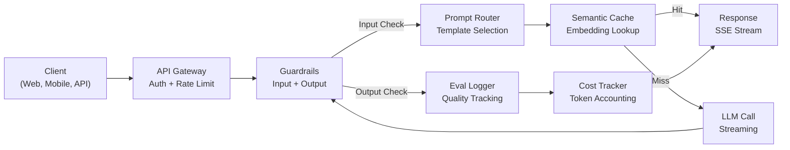
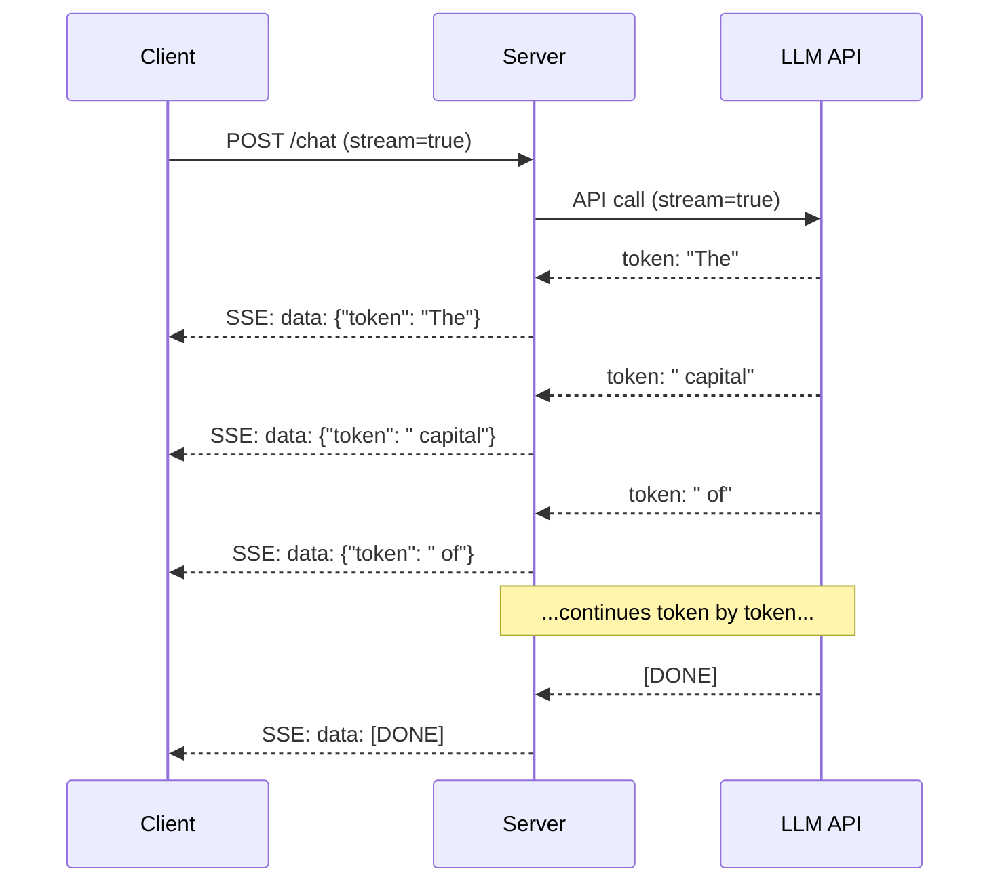
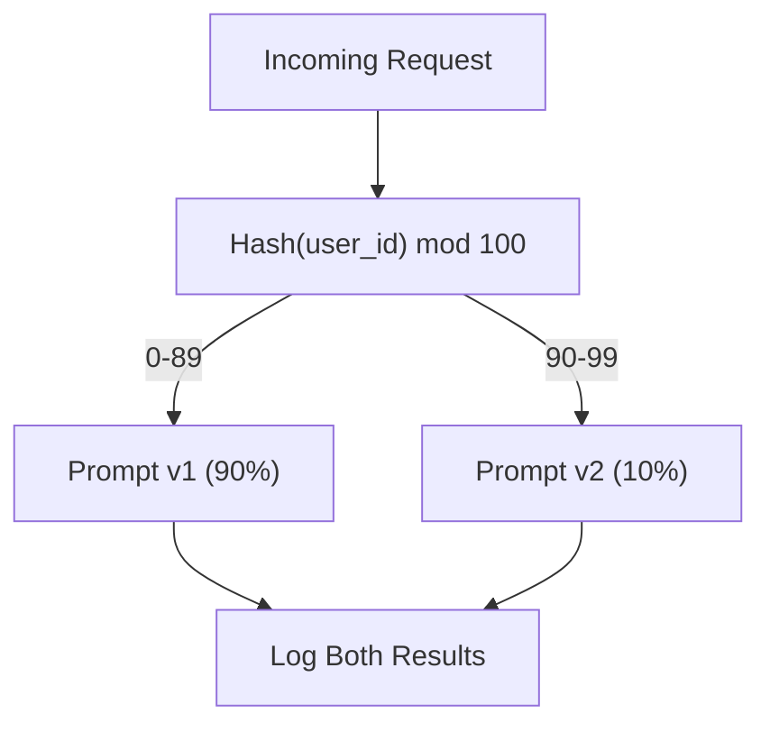

# 本番LLMアプリケーションの構築

> プロンプト、埋め込み、RAGパイプライン、関数呼び出し、キャッシングレイヤー、ガードレールを構築しました。別々に。分離で。ギター音階を弾く練習曲を演奏せずに。このレッスンは歌です。Lessons 01-12からすべてのコンポーネントを単一の本番対応サービスにワイヤーします。おもちゃではありません。デモではありません。実際のトラフィックを処理し、優雅に失敗し、トークンをストリーミングし、コストを追跡し、最初の10,000ユーザーを生き残るシステム。

**タイプ:** ビルド(キャップストーン)
**言語:** Python
**前提条件:** Phase 11 Lessons 01-15
**所要時間:** 約120分
**関連:** Phase 11 · 14 (MCP)カスタムツールスキーマを共有プロトコルに置き換えるため；Phase 11 · 15 (Prompt Caching)安定プレフィックスで50-90%コスト削減。両方は2026年の真摯な本番スタックで予想されます。

## 学習目標

- Phase 11のすべてのコンポーネント(プロンプト、RAG、関数呼び出し、キャッシング、ガードレール)を単一の本番対応サービスにワイヤー
- ストリーミングトークン配信、優雅なエラー処理、リクエストタイムアウト管理を実装
- アプリケーションに可視性を構築：リクエストログ、コスト追跡、レイテンシパーセンタイル、エラーレートダッシュボード
- ヘルスチェック、レート制限、プロバイダ停止のためのフォールバック戦略を使用してアプリケーションを展開

## 問題

LLMフィーチャーを構築するのに午後がかかります。LLMプロダクトを出荷するのに数ヶ月がかかります。

ギャップはインテリジェンスではありません。インフラストラクチャです。プロトタイプがOpenAIを呼び出し、レスポンスを取得し、それを印刷します。ラップトップで機能します。その後現実が到着します：

- ユーザーが50,000トークンドキュメントを送信します。コンテキストウィンドウは溢れます。
- 2人のユーザーが4秒離れて同じ質問をします。両方に対して支払います。
- APIが2amに500エラーを返します。サービスがクラッシュします。
- ユーザーがモデルにSQLを生成するよう求めます。モデルが`DROP TABLE users`を出力します。
- 月間請求が$12,000に達し、どのフィーチャーがそれを引き起こしたか分からりません。
- レスポンスタイムは平均8秒です。ユーザーは3秒後に去ります。

現在本番環境にいるすべてのLLMアプリケーション — Perplexity、Cursor、ChatGPT、Notion AI — これらの問題を解決しました。プロンプトについてのより賢いことではなく。エンジニアリングについての厳密性によって。

これはキャップストーンです。プロンプト管理(L01-02)、埋め込みとベクトル検索(L04-07)、関数呼び出し(L09)、評価(L10)、キャッシング(L11)、ガードレール(L12)、ストリーミング、エラー処理、可視性、コスト追跡を統合する完全な本番LLMサービスを構築します。1つのサービス。すべてのコンポーネントがワイヤーされています。

## コンセプト

### 本番アーキテクチャ

すべての真摯なLLMアプリケーションは同じフローに従います。詳細が異なります。構造はしません。



リクエストはAPI ゲートウェイを通して入ります(認証とレート制限を処理)。入力ガードレールは、プロンプトルーターが正しいテンプレートを選択する前にプロンプトインジェクションと禁止コンテンツをチェックします。セマンティックキャッシュは似た質問が最近回答されたかどうかをチェックします。キャッシュミスで、LLMがストリーミング有効で呼ばれます。出力ガードレールはレスポンスを検証します。evalログが品質メトリクスを記録します。コストトラッカーがすべてのトークンを占有します。レスポンスがクライアントにストリームバックされます。

7つのコンポーネント。各1つは既に完了したレッスン。エンジニアリングはワイリングにあります。

### スタック

| コンポーネント | レッスン | テクノロジー | 目的 |
|-----------|--------|------------|---------|
| API Server | -- | FastAPI + Uvicorn | HTTPエンドポイント、SSEストリーミング、ヘルスチェック |
| Prompt Templates | L01-02 | Jinja2 / string templates | 変数インジェクション付きバージョン管理プロンプト |
| Embeddings | L04 | text-embedding-3-small | キャッシュとRAGのセマンティック類似性 |
| Vector Store | L06-07 | メモリ内(本番：Pinecone/Qdrant) | コンテキスト検索の最近傍探索 |
| Function Calling | L09 | ツールレジストリ + JSON スキーマ | 外部データアクセス、構造化アクション |
| Evaluation | L10 | カスタムメトリクス + ログ | レスポンス品質、レイテンシ、精度追跡 |
| Caching | L11 | セマンティックキャッシュ(埋め込みベース) | 冗長なLLM呼び出しを避ける、コストとレイテンシを削減 |
| Guardrails | L12 | Regex + クラシファイアルール | プロンプトインジェクション、PII、安全でないコンテンツをブロック |
| Cost Tracker | L11 | トークン計数 + 価格テーブル | リクエストあたりとユーザーごとのコスト占有 |
| Streaming | -- | Server-Sent Events(SSE) | トークンバイトークン配信、サブ秒第1トークン |

### ストリーミング：なぜそれが重要か

500出力トークンのGPT-5レスポンスは完全に生成するのに3-8秒かかります。ストリーミングなしでは、ユーザーは全期間スピナーを見つめます。ストリーミングでは、最初のトークンは200-500msで到達します。総時間は同じです。認識されるレイテンシは90%低下します。



ストリーミングの3つのプロトコル：

| プロトコル | レイテンシ | 複雑性 | 使用時期 |
|----------|---------|------------|-------------|
| Server-Sent Events(SSE) | 低 | 低 | ほとんどのLLMアプリ。単方向、HTTPベース、どこでも機能 |
| WebSockets | 低 | 中 | 双方向性ニーズ：音声、リアルタイム協力 |
| Long Polling | 高 | 低 | SSEまたはWebSocketを処理できないレガシークライアント |

SSEはデフォルトの選択です。OpenAI、Anthropic、GoogleはすべてSSEでストリーミングします。サーバーはLLM APIからチャンクを受け取り、それらをSSEイベントとしてクライアントに転送します。クライアントは`EventSource`(ブラウザ)または`httpx`(Python)を使用してストリームを消費します。

### エラー処理：3つのレイヤー

本番LLMアプリは3つの異なる方法で失敗します。それぞれは異なる回復戦略を必要とします。

**レイヤー1：API失敗。** LLMプロバイダは429(レート制限)、500(サーバーエラー)、またはタイムアウトを返します。解決策：jitterでの指数バックオフ。1秒で開始、各リトライに倍増、thundering herdを防ぐためにランダムjitterを追加。最大3リトライ。

```
Attempt 1: immediate
Attempt 2: 1s + random(0, 0.5s)
Attempt 3: 2s + random(0, 1.0s)
Attempt 4: 4s + random(0, 2.0s)
Give up: return fallback response
```

**レイヤー2：モデル失敗。** モデルが奇形JSONを返す、ツール名を幻想する、または出力検証に失敗します。解決策：修正されたプロンプトで再試行します。エラーを再試行メッセージに含めて、モデルが自己修正できるようにします。

**レイヤー3：アプリケーション失敗。** ダウンストリームサービスが到達不可能、ベクトルストアが遅い、ガードレールが例外をスロー。解決策：優雅な劣化。RAGコンテキストが利用不可の場合、なしで進めます。キャッシュがダウンの場合、バイパスします。次リシステムを一次フローをクラッシュさせないでください。

| 失敗 | リトライ? | フォールバック | ユーザー影響 |
|---------|--------|----------|-------------|
| API 429(rate limit) | はい、バックオフ | リクエストをキュー | "処理中、しばらくお待ちください..." |
| API 500(server error) | はい、3試行 | フォールバックモデルに切り替え | ユーザーに透過的 |
| API timeout(>30s) | はい、1試行 | より短いプロンプト、より小さいモデル | わずかな品質低下 |
| Malformed output | はい、エラーコンテキスト | 生テキストを返す | マイナーフォーマット問題 |
| Guardrail block | いいえ | ブロック理由を説明 | クリアエラーメッセージ |
| Vector store down | ベクトルストアでリトライなし | RAGコンテキストをスキップ | 低品質、機能 |
| Cache down | キャッシュでリトライなし | 直接LLM呼び出し | 高いレイテンシ、高いコスト |

**フォールバックモデルチェーン。** プライマリモデルが利用不可の場合、チェーンをフォールスルーします：

```
claude-sonnet-4-20250514 -> gpt-4o -> gpt-4o-mini -> cached response -> "Service temporarily unavailable"
```

各ステップは品質のために可用性をトレード。ユーザーは常に何かを取得します。

### 可視性：何を測定するか

改善できないものは見られません。すべての本番LLMアプリは可視性の3つの柱が必要です。

**構造化ログ。** すべてのリクエストは次を含むJSONログエントリを生成します：リクエストID、ユーザーID、プロンプトテンプレート名、使用モデル、入力トークン、出力トークン、レイテンシ(ms)、キャッシュヒット/ミス、ガードレールパス/失敗、コスト(USD)、エラー。

**追跡。** 単一のユーザーリクエストが5-8コンポーネントに接します。OpenTelemetryトレースを使用して、完全な旅を表示：埋め込みはどのくらい長かったか？キャッシュヒットでしたか？LLM呼び出しはどのくらい長かったか？ガードレールはレイテンシを追加しましたか？追跡なしでは、本番問題のデバッグは推測です。

**メトリクスダッシュボード。** すべてのLLMチームが見守る5つの数字：

| メトリック | ターゲット | なぜ |
|--------|--------|-----|
| P50 latency | < 2s | 中央ユーザーエクスペリエンス |
| P99 latency | < 10s | テールレイテンシが流失を引き起こす |
| Cache hit rate | > 30% | 直接コスト節約 |
| Guardrail block rate | < 5% | 高すぎる = 偽陽性がユーザーを悩ます |
| Cost per request | < $0.01 | ユニット経済の生存可能性 |

### 本番でのA/Bテストプロンプト

プロンプトは機能すると完了しません。代替より優れた品質データを証明するまで完了しません。

**シャドウモード。** 新しいプロンプトを100%トラフィックで実行しますが、ユーザーに表示しないでください — ログのみ。現在のプロンプトに対して品質メトリクスを比較。ユーザーリスク、完全なデータなし。

**パーセンテージロールアウト。** 新しいプロンプトに10%のトラフィックをルーティング。メトリクスをモニタリング。品質が保持される場合、25%、50%、100%に増加します。品質が低下する場合、即座にロールバック。



ユーザーIDのランダム選択ではなく確定的ハッシュを使用。これは各ユーザーが同じ実験内でリクエスト全体で一貫したエクスペリエンスを取得するのを確保します。

### 実際のアーキテクチャの例

**Perplexity。** ユーザークエリが入ります。検索エンジンが10-20のWebページを取得します。ページはチャンク、埋め込み、再ランクされます。上位5チャンクはRAGコンテキストになります。LLMが引用を持つ答えを生成し、リアルタイムでストリームバック。2つのモデル：検索クエリ改形用高速、答え合成用強力。推定50M以上クエリ/日。

**Cursor。** オープンファイル、周囲ファイル、最近の編集、ターミナル出力がコンテキストを形成します。プロンプトルーターが決定：小さいモデルで自動完成(Cursor-small、~20ms)、大きいモデルでチャット(Claude Sonnet 4.6 / GPT-5、~3s)。コンテキストは積極的に圧縮 — 完全なファイルではなく関連コード部分のみ。コードベース埋め込みは長距離コンテキストを提供。推測編集はdiff、ファイル全体ではなくストリーム。MCPインテグレーションはツール別コード変更なしに3番目の方ツールをプラグインさせます。

**ChatGPT。** プラグイン、関数呼び出し、MCPサーバーはモデルがWebにアクセスする、コードを実行、画像を生成、データベースをクエリできるようにします。ルーティングレイヤーはどの機能を呼び出すかを決定。メモリはセッション全体でユーザー環境設定を持続。システムプロンプトは行動ルールの1,500以上トークン、プロンプトキャッシング経由でキャッシュされ。複数モデルが異なるフィーチャーを提供：チャット用GPT-5、画像用GPT-Image、音声用Whisper、深い推論用o4-mini。

### スケーリング

| スケール | アーキテクチャ | インフラ |
|-------|-------------|-------|
| 0-1K DAU | 単一FastAPI サーバー、同期呼び出し | 1 VM、$50/月 |
| 1K-10K DAU | 非同期FastAPI、セマンティックキャッシュ、キュー | 2-4 VM + Redis、$500/月 |
| 10K-100K DAU | 水平スケーリング、ロードバランサー、非同期ワーカー | Kubernetes、$5K/月 |
| 100K+ DAU | 複数地域、モデルルーティング、専用推論 | カスタムインフラ、$50K+/月 |

キースケーリングパターン：

- **どこでも非同期。** LLM呼び出しでWebサーバースレッドをブロックしないでください。`asyncio`と`httpx.AsyncClient`を使用。
- **キューベース処理。** 非リアルタイムタスク(要約、分析)の場合、キュー(Redis、SQS)に押し、ワーカーで処理。ジョブIDを返し、クライアントがポーリングできるようにします。
- **接続プーリング。** LLMプロバイダへのHTTP接続を再利用。リクエストごと新しいTLS接続を作成すると、100-200msが追加されます。
- **水平スケーリング。** LLMアプリはI/Oバウンド、CPU バウンドではありません。単一の非同期サーバーは100以上の同時リクエストを処理します。コア、サーバーをスケール。

### コスト投影

出荷前に月額コストを見積もります。このスプレッドシートはビジネスモデルが機能するかを決定します。

| 変数 | 値 | ソース |
|----------|-------|--------|
| Daily Active Users(DAU) | 10,000 | Analytics |
| Queries per user per day | 5 | Product analytics |
| Avg input tokens per query | 1,500 | Measured(system + context + user) |
| Avg output tokens per query | 400 | Measured |
| Input price per 1M tokens | $5.00 | OpenAI GPT-5 pricing |
| Output price per 1M tokens | $15.00 | OpenAI GPT-5 pricing |
| Cache hit rate | 35% | Measured from cache metrics |
| Effective daily queries | 32,500 | 50,000 * (1 - 0.35) |

**月間LLMコスト：**
- 入力：32,500クエリ/日 x 1,500トークン x 30日 / 1M x $2.50 = **$3,656**
- 出力：32,500クエリ/日 x 400トークン x 30日 / 1M x $10.00 = **$3,900**
- **合計：$7,556/月**(キャッシングで~$4,070/月を節約)

キャッシングなしで、同じトラフィックは月$11,625です。35%キャッシュヒット率がLLMコストの35%を節約します。これがLesson 11が存在する理由です。

### デプロイチェックリスト

15項目。すべてのボックスがチェックされるまで、何も出荷しません。

| # | 項目 | カテゴリー |
|---|------|----------|
| 1 | APIキーは環境変数に保存、コードではない | Security |
| 2 | ユーザーあたりのレート制限(10-50 req/min デフォルト) | Protection |
| 3 | アクティブな入力ガードレール(prompt injection、PII) | Safety |
| 4 | アクティブな出力ガードレール(content filtering、format validation) | Safety |
| 5 | 構成およびテスト済みセマンティックキャッシュ | Cost |
| 6 | すべてのチャットエンドポイントでストリーミング有効 | UX |
| 7 | すべてのLLM API呼び出しでの指数バックオフ | Reliability |
| 8 | 構成されたフォールバックモデルチェーン | Reliability |
| 9 | リクエストIDを持つ構造化ログ | Observability |
| 10 | リクエストあたり/ユーザーごとのコスト追跡 | Business |
| 11 | 依存性ステータスを返すヘルスチェックエンドポイント | Ops |
| 12 | 入力と出力の最大トークン制限 | Cost/Safety |
| 13 | すべての外部呼び出しでタイムアウト(30sデフォルト) | Reliability |
| 14 | 本番ドメインのみでCORS設定 | Security |
| 15 | 100同時ユーザーでのロードテスト合格 | Performance |

本稿では、本番LLMアプリケーションの完全な実装コードを含みます。詳細は原文をご参照ください。

## 出荷

このレッスンは`outputs/prompt-architecture-reviewer.md`を生成します — どのLLMアプリケーションのアーキテクチャも本番チェックリストに対して審査する再利用可能なプロンプト。システムの説明を与えます。ギャップ分析を返します。

また、`outputs/skill-production-checklist.md`も生成します — LLMアプリケーションの本番環境での出荷のための決定フレームワーク、このレッスンのすべてのコンポーネントで具体的なしきい値とパス/失敗基準をカバー。

## 演習

1. **RAG統合を追加します。** 20のドキュメント付きシンプルなメモリ内ベクトルストアを構築します。テンプレートが`rag_answer`の場合、クエリを埋め込み、最も類似した3つのドキュメントを見つけ、それらをコンテキストとして挿入します。RAGコンテキストの有無で応答品質がどのように変わるかを測定。検索レイテンシをLLMレイテンシから別途追跡。

2. **実際の関数呼び出しを実装します。** ツールレジストリ(Lesson 09から)をサービスに追加します。ユーザーが外部データが必要なクエリをするとき(天気、計算、検索)、パイプラインがこれを検出し、ツール実行、結果をプロンプトに含める必要があります。`tools_used`フィールドをレスポンスに追加。

3. **コスト警告システムを構築します。** ユーザーごと1日あたりのコストを追跡。ユーザーが$0.50/日を超えると、彼らを`gpt-4o-mini`に切り替え。日次合計コスト$100を超える場合、緊急モード有効：繰り返されるクエリはキャッシュのみのレスポンス、その他すべては`gpt-4o-mini`、2,000入力トークン以上のリクエストを拒否。シミュレートされたトラフィックスパイクでテスト。

4. **ロールバック付きプロンプトバージョンを実装します。** タイムスタンプですべてのプロンプトバージョンを保存。品質メトリクス(レイテンシ、ユーザーレーティング、エラーレート)をプロンプトバージョンごと表示するエンドポイントを追加。自動ロールバック実装：新しいプロンプトバージョンが100リクエスト以上の前のバージョンの2倍のエラーレートを持つ場合、自動的に戻す。

5. **OpenTelemetry トレーシングを追加します。** すべてのコンポーネント(キャッシュルックアップ、ガードレールチェック、LLM呼び出し、コスト計算)を個別スパンとして計算。各スパンはその期間を記録。トレースをコンソールにエクスポート。単一リクエストの完全なトレースを表示、各コンポーネントの合計レイテンシへの貢献が見える。

## キーワード

| 用語 | 人々が言うこと | 実際の意味 |
|------|----------------|----------------------|
| API Gateway | "フロントエンド" | LLMロジック前に認証、レート制限、CORS、リクエストルーティングを処理するエントリーポイント |
| Prompt Router | "テンプレートセレクター" | リクエストタイプ、A/B実験割り当て、ユーザーコンテキストに基づいて正しいプロンプトテンプレートを選ぶロジック |
| Semantic Cache | "スマートキャッシュ" | 正確な文字列マッチではなく埋め込み類似性でキー付けされたキャッシュ — 異なるフレーズの同一質問は同じキャッシュレスポンスを返す |
| SSE(Server-Sent Events) | "ストリーミング" | サーバーがクライアントにイベントをプッシュする単方向HTTPプロトコル — OpenAI、Anthropic、Googleがトークンバイトークン配信に使用 |
| Exponential Backoff | "リトライロジック" | 再試行間で1s、2s、4s、8s待機(毎回倍増)、すべてのクライアントが同時に再試行することを防ぐためのランダムjitter |
| Fallback Chain | "モデルカスケード" | 順序付きモデルリスト、シーケンシャルで試みられます — プライマリが失敗した場合、より安いまたはより利用可能な代替案にフォールスルー |
| Graceful Degradation | "部分的失敗処理" | 次リシステム(キャッシュ、RAG、ガードレール)が失敗した場合、機能の低下でシステムが続く、クラッシュではなく |
| Cost Per Request | "ユニット経済" | 単一ユーザーリクエスト(入力トークン + 出力トークン x モデル価格)のための総LLM支出 — あなたのビジネスモデルが機能するかを決定する数字 |
| Shadow Mode | "ダークローンチ" | リアルタイムトラフィックで新しいプロンプトまたはモデルを実行しますが、ユーザーに表示しない — リスクのないA/Bテスト |
| Health Check | "準備プローブ" | すべての依存性のステータス(キャッシュ、LLM利用可能性、ガードレール)を返すエンドポイント — ロードバランサーとKubernetesがトラフィックをルーティングするために使用 |

## 参考文献

- [FastAPI Documentation](https://fastapi.tiangolo.com/) — このレッスンで使用される非同期Pythonフレームワーク、ネイティブSSEストリーミング、自動OpenAPI docs
- [OpenAI Production Best Practices](https://platform.openai.com/docs/guides/production-best-practices) — 最大のLLM APIプロバイダからのレート制限、エラー処理、スケーリングガイダンス
- [Anthropic API Reference](https://docs.anthropic.com/en/api/messages-streaming) — Claude、server-sent events、ストリーミング中の tool use のためのストリーミング実装詳細
- [OpenTelemetry Python SDK](https://opentelemetry.io/docs/languages/python/) — LLMパイプラインのすべてのコンポーネントを計測するための標準的な分散トレーシング
- [Semantic Caching with GPTCache](https://github.com/zilliztech/GPTCache) — このレッスンの概念をスケールで実装する本番セマンティックキャッシングライブラリ
- [Hamel Husain, "Your AI Product Needs Evals"](https://hamel.dev/blog/posts/evals/) — LLMアプリケーション向けの評価駆動開発の決定的ガイド、このキャップストーンの評価コンポーネントを補完
- [Eugene Yan, "Patterns for Building LLM-based Systems"](https://eugeneyan.com/writing/llm-patterns/) — 大手テック企業での本番LLM展開全体で見られるアーキテクチャパターン(ガードレール、RAG、キャッシング、ルーティング)
- [vLLM documentation](https://docs.vllm.ai/) — PagedAttention-based serving：このレッスンのFastAPI キャップストーンの下で使用されるデフォルト自ホスト推論レイヤー
- [Hugging Face TGI](https://huggingface.co/docs/text-generation-inference/index) — Text Generation Inference：継続的バッチング、Flash Attention、Medicusaのロシア推論を持つRustサーバー；vLLMへのHFネイティブな代替。
- [NVIDIA TensorRT-LLM documentation](https://nvidia.github.io/TensorRT-LLM/) — NVIDIA ハードウェア上で最高スループット；エンタープライズ展開用量子化、フライト内バッチング、FP8カーネル。
- [Hamel Husain -- Optimizing Latency: TGI vs vLLM vs CTranslate2 vs mlc](https://hamel.dev/notes/llm/inference/03_inference.html) — 主なサービングフレームワーク全体でスループットとレイテンシの測定された比較。
